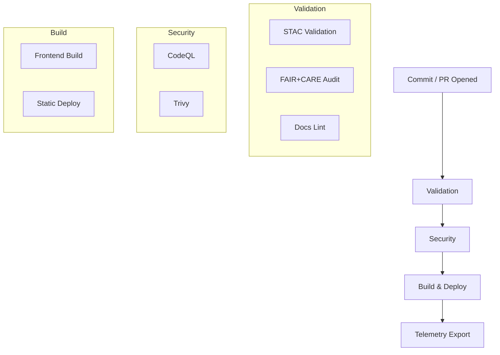

<div align="center">

# 🧩 **Kansas Frontier Matrix — GitHub Configuration & Automation Overview**
`.github/README.md`

**Purpose:** Summarize the repository-level **automation, governance, and validation** systems — workflows, issue templates, security posture, telemetry — that assure **MCP v6.3** reproducibility and **FAIR+CARE** data ethics for KFM.

[](../docs/README.md)
[](../LICENSE)
[](../docs/standards/faircare.md)
[]()

</div>

---

## 📘 Overview

The `.github/` directory defines KFM’s **CI/CD**, **security**, and **governance** controls.  
GitHub Actions validate **datasets (STAC/DCAT)**, **documentation (Markdown/YAML/JSON)**, **ethics (FAIR+CARE)**, **security (CodeQL/Trivy)**, and export **telemetry** for dashboards.  
All runs are **logged in immutable ledgers**, cross-referenced by **SBOM/manifest**, and visible in `docs/reports/**`.

---

## 🗂️ Directory Layout

```
.github/
├── ARCHITECTURE.md                 # CI/CD architecture & governance mapping
├── README.md                       # This file
│
├── workflows/                      # Automated pipelines
│   ├── stac-validate.yml           # STAC validation (Items/Collections)
│   ├── faircare-validate.yml       # FAIR+CARE + data contracts
│   ├── docs-lint.yml               # Markdown/YAML/JSON lint & schema check
│   ├── codeql.yml                  # Static analysis (security)
│   ├── trivy.yml                   # Container & dependency CVE scanning
│   ├── build-and-deploy.yml        # Frontend build + deploy
│   ├── stac-dcat-bridge.yml        # STAC ↔ DCAT synchronization
│   └── telemetry-export.yml        # Telemetry aggregation
│
├── ISSUE_TEMPLATE/                 # Community & governance forms
│   ├── data_submission.yml         # New dataset / STAC item
│   ├── feature_request.yaml        # Feature proposal
│   ├── bug_report.yaml             # Reproducible defect report
│   └── governance_form.yml         # FAIR+CARE or ethics review
│
├── pull_request_template.md        # Required PR format & checks
├── dependabot.yml                  # Dependency updates
├── SECURITY.md                     # Vulnerability disclosure policy
└── FUNDING.yml                     # Optional sponsor links
```

---

## 🔁 Continuous Integration (CI)

Every pull request runs **validation → security → build** in sequence. Failing any gate blocks the merge.

| Stage | Workflow | What It Enforces |
|-------|----------|------------------|
| Data Validation | `stac-validate.yml` | STAC 1.0.0 structure, links, schema |
| FAIR+CARE Audit | `faircare-validate.yml` | License, provenance, checksum, CARE flags |
| Docs Lint | `docs-lint.yml` | YAML front-matter, headings, links, tables, width |
| Security | `codeql.yml` / `trivy.yml` | CodeQL static analysis; CVE scanning |
| Build | `build-and-deploy.yml` | Frontend build success; artifacts & telemetry |

**Artifacts** are stored under `reports/**` and summarized in `releases/v9.7.0/focus-telemetry.json`.

---

## 🚀 Continuous Deployment (CD)

When validations pass, the site is built and (if configured) deployed.

1. **Frontend Build** (Node)  
2. **Static Deploy** (e.g., `gh-pages`)  
3. **Telemetry Export** → `releases/v9.7.0/focus-telemetry.json`  
4. **Manifest/SBOM linkage** → `releases/v9.7.0/manifest.zip`, `sbom.spdx.json`

> API docs are served locally by FastAPI (`/docs`). The web client is built from `web/`.

---

## ⚙️ Workflow → Artifact Mapping

| Workflow | Primary Outputs | Report Location |
|----------|------------------|-----------------|
| `stac-validate.yml` | `_summary.json`, CLI NDJSON | `reports/self-validation/stac/` |
| `faircare-validate.yml` | `faircare_summary.json`, NDJSON | `reports/fair/` |
| `docs-lint.yml` | `lint_summary.json`, violations NDJSON | `reports/self-validation/docs/` |
| `codeql.yml` | SARIF analysis | `reports/security/codeql/` |
| `trivy.yml` | CVE report JSON | `reports/security/trivy/` |
| `build-and-deploy.yml` | Build metrics, artifact list | `docs/reports/telemetry/build_metrics.json` |
| `telemetry-export.yml` | Aggregated metrics snapshot | `releases/v9.7.0/focus-telemetry.json` |

---

## 🧮 CI/CD Automation Flow



---

## 🧠 Governance & Ethics Integration

All automation enforces and documents **FAIR+CARE** and **MCP**:

| Layer | Standard | Enforcement |
|------|----------|-------------|
| FAIR | Findable/Accessible/Interoperable/Reusable | `faircare-validate.yml` |
| CARE | Collective Benefit, Authority, Responsibility, Ethics | `governance_form.yml` review chain |
| MCP | Docs-as-code, telemetry, provenance | All workflows + docs-lint |
| SLSA | Supply chain provenance | SBOM + manifest attestation |

Outputs are logged to **ledgers**:  
`docs/reports/audit/{governance-ledger.json, github-workflows-ledger.json, ai_models.json, release-manifest-log.json}`

---

## 🔒 Security Posture

| Control | Mechanism | Policy |
|--------|-----------|--------|
| Static Analysis | CodeQL | Scheduled + on push |
| CVE Scanning | Trivy | Fail on CRITICAL |
| Dependencies | Dependabot | Weekly updates |
| Branch Protection | GH Rules | 2 reviews + passing CI |
| Secrets | GH Encrypted Secrets | No plaintext; rotate regularly |

See `.github/SECURITY.md` for the full disclosure process.

---

## 📊 Telemetry & Reporting

**Single source of truth** for build & compliance metrics:  
`releases/v9.7.0/focus-telemetry.json`

Metrics tracked:
- Workflow success rates & durations  
- FAIR+CARE compliance scores  
- STAC/DCAT validation counts  
- Security scan summaries  
- Artifact references (SBOM, manifest)  
- Commit/author metadata

Dashboard inputs live under `docs/reports/telemetry/`.

---

## 🗺️ Cross-References

- [⚙️ CI/CD Architecture](ARCHITECTURE.md)  
- [📘 Documentation Index](../docs/README.md)  
- [🧱 System Architecture](../src/ARCHITECTURE.md)  
- [🤝 Contributing Guide](../CONTRIBUTING.md)  
- [📑 Markdown Rules](../docs/standards/markdown_rules.md)  
- [⚖️ FAIR+CARE Framework](../docs/standards/faircare.md)

---

## 🕰️ Version History

| Version | Date | Author | Summary |
|----------|------|---------|----------|
| v9.7.0 | 2025-11-05 | A. Barta | Alignment pass: added workflow→artifact map, telemetry linkage, governance references. |
| v9.5.0 | 2025-10-20 | A. Barta | Integrated FAIR+CARE audit hooks and STAC/DCAT bridge. |
| v9.0.0 | 2025-06-01 | KFM Core Team | Initial automation overview and templates. |

---

<div align="center">

**© 2025 Kansas Frontier Matrix — MIT / CC-BY 4.0**  
Automated under **Master Coder Protocol v6.3** · FAIR+CARE Certified · Diamond⁹ Ω / Crown∞Ω Ultimate Certified  
[Back to Documentation Index](../docs/README.md) · [View CI/CD Architecture](ARCHITECTURE.md)

</div>
