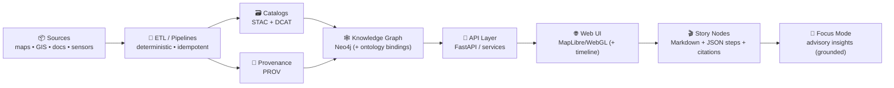
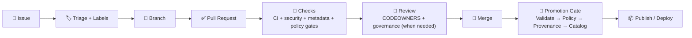
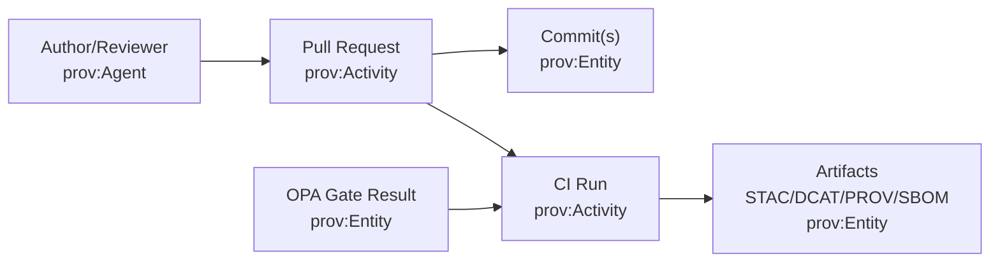

```mermaid
flowchart LR
  A["🧰 Build artifacts"] --> B["🧑‍⚖️ Policy gate<br/>OPA/Conftest bundles"]
  B --> C["🧾 Validate<br/>STAC/DCAT/PROV + schemas + link safety"]
  C --> D["🧬 Provenance guard<br/>PROV + checksums + classification propagation"]
  D --> E["🧪 Deterministic replay<br/>kfm-sim-run (optional lane)"]
  E --> F["📦 SBOM<br/>generate + attach"]
  F --> G["🖊️ Sign/Attest<br/>OIDC + DSSE/Sigstore-ish"]
  G --> H["📤 Publish<br/>atomic + immutable"]
  H --> I["🗃️ Catalog update<br/>federation-ready"]
  I --> J["🧯 Rollback ready<br/>kill-switch / tags"]
```

<a id="top"></a>

# 🤝 `.github/` — Collaboration & Automation Hub (Kansas Frontier Matrix) 🧭🗺️🤖

[](#-how-to-contribute)
[](https://github.com/bartytime4life/Kansas-Frontier-Matrix/issues)
[](#-pull-requests)
[](https://github.com/bartytime4life/Kansas-Frontier-Matrix/actions/workflows/ci.yml)
[](https://github.com/bartytime4life/Kansas-Frontier-Matrix/actions/workflows/codeql.yml)
[](#-policy-as-code-gate-opaconftest)
[](#-evidence-triplet--promotion-bar-stacdcatprov)
[-8b5cf6)](#-devops-provenance-pr--prov--graph)
[](#-agents--autonomy-boundaries-wpe)
[](#-automation--required-checks)
[](#-security--privacy)
[](../LICENSE)

> [!NOTE]
> This README documents **how we collaborate + automate on GitHub**: issues, PRs, reviews, CODEOWNERS, labels, branch protection, and CI/CD gates.  
> ✅ Start with the project overview: **[`../README.md`](../README.md)**

> [!IMPORTANT]
> `.github/` is KFM’s **operations layer**. Keep it clean, predictable, auditable, and boring (in the best way). ✅🧾  
> The fun innovation lives in **data + catalogs + pipelines + graph + UI + Story Nodes + Focus Mode** — but it only scales if this layer is disciplined. 🧭

---

## 🧾 Policy metadata

| Field | Value |
|---|---|
| 📄 File | `.github/README.md` |
| ✅ Status | Active |
| 🗓️ Last updated | **2026-01-19** |
| 🧬 KFM‑MDP baseline | **v11.2.6** *(metadata profiles + promotion discipline)* |
| 🧾 KFM‑PROV profile | **v11.0.0** *(PROV shape for lineage + governance logs)* |
| 📘 Master Guide | **v13 (draft)** *(contract-first · evidence-first · governed CI gates)* |
| 🏛️ Core governance | FAIR + CARE + sovereignty guardrails |
| 🧑‍⚖️ Policy engine | OPA/Conftest + Rego bundles (policy-as-code) |
| 🧾 Minimum metadata bar | **STAC + DCAT + PROV** for promoted artifacts |
| 🚦 Default posture | **Fail‑closed** on promotion‑critical gates |
| 🧾 DevOps provenance | Optional **PR→PROV** JSON‑LD generation + ingest (see below) |
| 📦 Supply chain | SBOM + attestations for tags/releases (optionally `main`) |
| 🧯 Safety switch | Kill‑switch supported for publish/sign lanes |

---

## ⚡ Quick links

| Action | Link |
|---|---|
| 🐛 Report a bug | [Open bug report](https://github.com/bartytime4life/Kansas-Frontier-Matrix/issues/new?template=bug_report.yml) |
| ✨ Request a feature | [Open feature request](https://github.com/bartytime4life/Kansas-Frontier-Matrix/issues/new?template=feature_request.yml) |
| 🗺️ Request a data layer/source | [Request a layer/source](https://github.com/bartytime4life/Kansas-Frontier-Matrix/issues/new?template=data_layer_request.yml) |
| 🧰 Request a pipeline / automation | [Open pipeline request](https://github.com/bartytime4life/Kansas-Frontier-Matrix/issues/new?template=pipeline_request.yml) *(spec — add if missing)* |
| 🎬 Request a Story Node | [Open Story Node request](https://github.com/bartytime4life/Kansas-Frontier-Matrix/issues/new?template=story_node_request.yml) *(spec — add if missing)* |
| 🤖 Request an AI/model change | [Open AI/model request](https://github.com/bartytime4life/Kansas-Frontier-Matrix/issues/new?template=ai_model_request.yml) *(spec — add if missing)* |
| 🧾 Ask a question | [Ask a question](https://github.com/bartytime4life/Kansas-Frontier-Matrix/issues/new?template=question.yml) |
| 🧪 See CI runs | [GitHub Actions](https://github.com/bartytime4life/Kansas-Frontier-Matrix/actions) |
| 🛡️ Security policy | [`./SECURITY.md`](./SECURITY.md) *(recommended location)* |
| 🤖 Workflows docs | [`./workflows/README.md`](./workflows/README.md) |
| 🧩 Actions catalog | [`./actions/README.md`](./actions/README.md) |
| 🧑‍⚖️ Policy rules | [`../tools/validation/policy/README.md`](../tools/validation/policy/README.md) |
| 🧯 Kill-switch config | [`../.kfm/kill-switch.yml`](../.kfm/kill-switch.yml) *(spec — add if missing)* |
| 🧪 Deterministic replay runner | [`../tools/kfm-sim-run/`](../tools/kfm-sim-run/) *(spec — add if missing)* |

> [!TIP]
> If an issue template link 404s, use the chooser: <https://github.com/bartytime4life/Kansas-Frontier-Matrix/issues/new/choose>

---

<details>
<summary><strong>🧭 Table of contents</strong></summary>

- [🧭 What we’re building](#-what-were-building)
- [🧬 Non-negotiables (v13 invariants)](#-non-negotiables-v13-invariants)
- [🧩 What lives in <code>.github/</code>](#-what-lives-in-github)
- [🔁 Workflow: Issue → PR → Merge → Promote → Ship](#-workflow-issue--pr--merge--promote--ship)
- [🧾 Evidence Triplet + promotion bar (STAC/DCAT/PROV)](#-evidence-triplet--promotion-bar-stacdcatprov)
- [🧾 DevOps provenance (PR → PROV → Graph)](#-devops-provenance-pr--prov--graph)
- [🛡️ Branch protection & merge strategy](#-branch-protection--merge-strategy)
- [🤖 Automation & required checks](#-automation--required-checks)
- [🧑‍⚖️ Policy-as-Code gate (OPA/Conftest)](#-policy-as-code-gate-opaconftest)
- [🧪 Deterministic replay lane: <code>kfm-sim-run</code>](#-deterministic-replay-lane-kfm-sim-run)
- [🛰️ Performance packaging lanes (GeoParquet · PMTiles · 3D)](#-performance-packaging-lanes-geoparquet--pmtiles--3d)
- [⏱️ Streaming & real-time lanes (watchers + telemetry)](#-streaming--real-time-lanes-watchers--telemetry)
- [🧾 Issues](#-issues)
- [✅ Pull Requests](#-pull-requests)
- [👀 Reviews & ownership](#-reviews--ownership)
- [🏷️ Label taxonomy](#-label-taxonomy)
- [🎬 Story Nodes + narrative layer](#-story-nodes--narrative-layer)
- [🧠 Focus Mode (advisory AI)](#-focus-mode-advisory-ai)
- [🤖 Agents & autonomy boundaries (WPE)](#-agents--autonomy-boundaries-wpe)
- [🧯 Kill-switch (fail‑closed) rules](#-kill-switch-fail-closed-rules)
- [🔐 Security & privacy](#-security--privacy)
- [🏛️ Cultural protocols & sensitive data](#-cultural-protocols--sensitive-data)
- [📚 Project reference library](#-project-reference-library-the-why-behind-our-standards)
- [🧾 Next “missing but expected” files](#-next-missing-but-expected-files)
- [🙌 How to contribute](#-how-to-contribute)

</details>

---

## 🧭 What we’re building

Kansas Frontier Matrix (KFM) is a **living atlas of Kansas** 🏛️🗺️ that connects:

- 🧾 historical archives & scanned maps  
- 🛰️ modern geospatial + remote sensing layers  
- 🗄️ spatial databases (**PostGIS**) + a knowledge graph (**Neo4j**)  
- 🔌 a **contract-first API boundary** (REST + GraphQL)  
- 🌐 a modern map UI (**MapLibre/WebGL**) + optional **3D** via **Cesium**  
- 🎬 **Story Nodes** (machine‑ingestible storytelling)  
- 🧠 **Focus Mode** (advisory AI, evidence‑backed, citation‑first)

KFM is intentionally **pipeline-driven** and **governance-driven**:

- data moves through a strict order (**ETL → catalogs → graph → API → UI → narratives → Focus Mode**)  
- validation gates aren’t optional 🚦  
- promoted artifacts must be **discoverable + trustworthy** via the **Evidence Triplet**: **STAC + DCAT + PROV** 🧾

### 🗺️ System order (CI mirrors this)



> [!TIP]
> Touch anything upstream (ETL/catalog/graph) and you’re touching everything downstream.  
> That’s why `.github/` gates are strict. 🚦✅

---

## 🧬 Non-negotiables (v13 invariants)

These rules keep the Matrix coherent as it grows:

1) **Pipeline ordering is absolute**: ETL → Catalogs → Graph → API → UI → Story Nodes → Focus Mode  
2) **API boundary rule**: UI must **never** query Neo4j/PostGIS directly — UI talks to **API only** 🔌  
3) **Evidence Triplet is mandatory for promotion**: **STAC + DCAT + PROV** required for promoted artifacts 🧾  
4) **Provenance first**: if it shows up publicly (UI/export/AI), it’s traceable to sources + processing ✅  
5) **No mystery layers**: unsourced or ad-hoc data is not accepted into the official catalog 🚫🕳️  
6) **Deterministic ETL**: same inputs + config = same outputs (idempotent reruns) 🧪  
7) **Stable IDs forever**: catalog IDs, graph IDs, story IDs are contracts 🏷️  
8) **Sovereignty & sensitivity propagate**: outputs cannot be “less restricted” than inputs 🧭🔒  
9) **AI must cite or refuse**: Focus Mode answers are citation-backed; no fabrication 🤖🧾  
10) **Fail‑closed on promotion‑critical gates**: missing metadata/prov/flags blocks merge or blocks publish 🚦  
11) **Supply chain hygiene**: workflows/actions are pinned, least‑privilege, and auditable 🔐  
12) **No side-channels**: Focus Mode cannot bypass redaction or leak restricted precision 🧯  

> [!IMPORTANT]
> These invariants are meant to be **enforceable by CI**, not “nice ideas.” 🤖✅

---

## 🧩 What lives in `.github/`

This folder defines the **how-we-ship** layer: templates, workflows, routing, and governance. 🤖🧾

```text
📁 .github/
├─ 🤖 workflows/                                  # 🤖 CI/CD + automation lanes
│  ├─ ✅ ci.yml                                   # ✅ lint + unit tests + typecheck + build
│  ├─ 🔐 codeql.yml                               # 🔐 SAST scanning (CodeQL)
│  ├─ 🔎 catalog-qa.yml                           # 🔎 fast STAC/DCAT sanity + link checks
│  ├─ 🧾 metadata-validate.yml                    # 🧾 schema validation (STAC/DCAT/PROV + Story metadata)
│  ├─ 🧑‍⚖️ policy-gate.yml                        # 🧑‍⚖️ Conftest/OPA policy-as-code PR gate
│  ├─ 🎬 story-lint.yml                           # 🎬 Story Node lint + citations + sensitivity checks
│  ├─ 🧬 graph-qa.yml                             # 🧬 ontology/constraints checks (spec — add if missing)
│  ├─ 🧾 pr-provenance.yml                        # 🧾 PR→PROV JSON-LD (spec — add if missing)
│  ├─ 🧩 dependency-review.yml                    # 🧩 dependency diff review (recommended)
│  ├─ 🧯 scorecard.yml                            # 🧯 supply-chain posture (optional)
│  ├─ 🐳 docker-build.yml                         # 🐳 build/push images (GHCR)
│  ├─ 📦 sbom.yml                                 # 📦 SBOM generation (Syft/SPDX/CycloneDX)
│  ├─ 🖊️ attest.yml                               # 🖊️ build/provenance attestations (OIDC/DSSE-ish)
│  ├─ 🌐 pages.yml                                # 🌐 build/deploy docs/UI (optional)
│  ├─ 🏷️ release.yml                              # 🏷️ release packaging + provenance bundle (optional)
│  └─ ♻️ reusables/                               # ♻️ reusable workflows (workflow_call)
│     ├─ ♻️ kfm-reusable-ci.yml
│     ├─ ♻️ kfm-reusable-policy.yml
│     └─ ♻️ kfm-reusable-catalog.yml              # (spec — add if missing)
├─ 🧩 actions/                                    # 🧩 repo-local composite actions (building blocks)
│  ├─ 🧰 setup-kfm/                               # setup Python/Node (+ caches, optional GIS deps)
│  ├─ 🧑‍⚖️ setup-conftest/                        # install/cache OPA + Conftest
│  ├─ 🔎 catalog-qa/                              # run tools/validation/catalog_qa
│  ├─ 🧾 metadata-validate/                       # STAC/DCAT/PROV schema validation helper
│  ├─ 🧬 provenance-guard/                        # PROV required + classification propagation checks
│  ├─ 🧑‍⚖️ policy-gate/                           # run tools/validation/policy (rego bundles)
│  ├─ 🧯 check-kill-switch/                       # fail-closed stop button (gate)
│  ├─ 📦 sbom/                                    # SBOM generation wrapper
│  ├─ 🖊️ attest/                                  # attestations wrapper (OIDC/DSSE-ish)
│  ├─ 🎬 story-lint/                              # Story Node lint helper
│  └─ 🧾 pr-provenance/                           # PR→PROV builder (spec — add if missing)
├─ 🧾 ISSUE_TEMPLATE/                             # 🧾 guided issue creation (issue forms)
│  ├─ 🐛 bug_report.yml
│  ├─ ✨ feature_request.yml
│  ├─ 🗺️ data_layer_request.yml
│  ├─ 🧰 pipeline_request.yml                     # 🧰 spec — add if missing
│  ├─ 🎬 story_node_request.yml                   # 🎬 spec — add if missing
│  ├─ 🤖 ai_model_request.yml                     # 🤖 spec — add if missing
│  └─ ❓ question.yml
├─ 📄 PULL_REQUEST_TEMPLATE.md                    # ✅ PR checklist & review prompts
├─ 📄 CODEOWNERS                                  # 👀 review routing by area
├─ 📄 dependabot.yml                              # ♻️ dependency updates (recommended)
├─ 📄 labels.yml                                  # 🏷️ canonical label taxonomy (recommended)
├─ 📄 release-drafter.yml                         # 📝 auto-draft release notes (optional)
├─ 📄 SECURITY.md                                 # 🔐 vuln reporting (recommended)
└─ 📄 README.md                                   # 📍 you are here 👋
```

> [!NOTE]
> If any “spec” file above doesn’t exist yet, this README is the **spec**.  
> ✅ As you implement each file, remove “spec” tags so this stays honest. 🧾

---

## 🔁 Workflow: Issue → PR → Merge → Promote → Ship



### 🚦 Promotion saga (KFM‑MDP / v13‑aligned)



> [!TIP]
> “Promotion” is where we get safety: **fail‑closed**, log what happened, and never break downstream consumers. ✅🧯

---

## 🧾 Evidence Triplet + promotion bar (STAC/DCAT/PROV)

KFM treats data like code: it must **compile (validate)** before it can ship. ✅🧾

### ✅ The Evidence Triplet (the minimum bar)

Promoted artifacts must have:

- **STAC** (Items + Collections) for spatial assets 🧾  
- **DCAT** (dataset/distribution discovery) 🗃️  
- **PROV** (lineage bundles linking inputs → activities → outputs) 🧬  

> [!IMPORTANT]
> If it can be toggled in the UI (or cited by Focus Mode), it must be **cataloged + provable**. 🗃️🧾

### 📁 Canonical paths (v13)

> [!NOTE]
> Some docs use `data/catalogs/` generically to mean “the DCAT output root.”  
> In this repo layout, prefer the canonical v13 paths below.

```text
📁 data/
├─ 📁 <domain>/
│  ├─ 📁 raw/                      # ingest only (read-only snapshots)
│  ├─ 📁 work/                     # intermediate transforms
│  └─ 📁 processed/                # publish-ready artifacts
├─ 📁 stac/
│  ├─ 📁 collections/              # STAC Collections
│  └─ 📁 items/                    # STAC Items
├─ 📁 catalog/
│  └─ 📁 dcat/                     # DCAT outputs (JSON-LD)
└─ 📁 prov/                        # PROV bundles (JSON-LD / per run)
```

### ✅ Promotion checklist (data + derived outputs)

Any new/updated dataset must include:

- Source name + link (or archive reference)  
- License/terms (or “unknown” with rationale + governance label)  
- Spatial reference (EPSG) + units  
- Time coverage (single year, range, or “undated”)  
- Processing steps (georef points count, resampling, simplification, etc.)  
- Checksums + version stamp *(recommended)*  
- Sensitivity / classification (and precision policy if relevant) 🔒🧭  

---

## 🧾 DevOps provenance (PR → PROV → Graph)

KFM’s roadmap includes treating **GitHub activity itself as provenance data**: PRs, commits, approvals, and merges can be emitted as **PROV‑O JSON‑LD** and (optionally) ingested into the graph. 🧾🕸️

### 🎯 Why this exists

- Link **datasets and catalogs** back to the **exact code change** that produced them  
- Answer governance questions like:
  - “Which PR introduced this layer?”
  - “Who reviewed the change that altered this dataset’s license?”
  - “Which pipeline run produced the published tiles?”

### 🧩 Concept model (high level)



### ✅ Recommended workflow behavior (`.github/workflows/pr-provenance.yml`) *(spec)*

On PR open + PR merge:

- generate `prov/devops/pr_<id>.jsonld`  
- attach to workflow artifacts (and optionally commit to repo on merge)  
- optionally ingest into Neo4j via a secured, least‑privilege endpoint *(never from PR forks)*  
- include policy gate summaries + checksums as referenced entities

> [!IMPORTANT]
> Treat **DevOps provenance** like any other evidence artifact:
> - deterministic generation
> - schema validation
> - immutable references (commit SHAs, artifact checksums)

---

## 🛡️ Branch protection & merge strategy

Configured in **Repo Settings** (not files). Recommended guardrails:

- ✅ Require PRs (no direct pushes to `main`)  
- ✅ Require status checks (CI + security + relevant gates)  
- ✅ Require **1–2 approvals** (CODEOWNERS when applicable)  
- ✅ Require “Resolve conversations” before merge  
- ✅ Block force-pushes to protected branches  
- ✅ Prefer **Squash merge** for clarity (or **Rebase merge** for linear history)

### ✅ Recommended required checks (change-aware)

Baseline (most PRs):
- `ci` ✅  
- `codeql` 🔐 *(if enabled)*  
- `dependency-review` 🧩 *(recommended)*

Change-aware gates (only when relevant paths are touched):
- `policy-gate` 🧑‍⚖️ *(required for governed surfaces: data/docs/workflows/)*  
- `catalog-qa` 🔎 *(required when `data/**` changes)*  
- `metadata-validate` 🧾 *(required for STAC/DCAT/PROV/Story metadata)*  
- `story-lint` 🎬 *(required when Story Nodes change)*  
- `pr-provenance` 🧾 *(optional, if enabled)*  

> [!NOTE]
> Keep required checks **path-aware**. If a PR doesn’t touch `data/**`, don’t block merges on catalog gates.

---

## 🤖 Automation & required checks

### ✅ What CI should do (minimum bar)

- Lint + formatting checks  
- Unit tests (fast)  
- Type checking (where applicable)  
- Build (web + CLI tooling)  
- Security scans (CodeQL + dependency review)  
- **Change-aware gates** (data/story/docs rules only when touched)  
- Upload artifacts on failure (logs are gold 🥇)

### 🧪 Gate matrix (what triggers what)

| Change type | Examples | Required gates |
|---|---|---|
| 🧠 Core code | API logic, parsers, pipelines | `ci`, `codeql`, `dependency-review` |
| 🗺️ Data/catalog | `data/**`, STAC/DCAT/PROV | `catalog-qa`, `metadata-validate`, `policy-gate` |
| 🕸️ Graph assets | ontology, constraints, ingest manifests | `ci`, `policy-gate`, `graph-qa` *(if present)* |
| 🎬 Story Nodes | `docs/**/story_nodes/**` | `story-lint`, `policy-gate` |
| 📚 Docs/specs | `docs/**`, `schemas/**` | `docs-linkcheck` *(if present)*, `policy-gate` |
| 🌐 Web UI | `web/**` | `ci` (build/test), `codeql` (as applicable) |
| 🤖 Workflows | `.github/workflows/**` | `policy-gate` *(least privilege + pinning rules)* |
| 🧾 DevOps provenance | `prov/devops/**` | `metadata-validate` *(schema)*, `policy-gate` |

### 📦 Supply chain lanes

| Lane | What it produces | When it runs |
|---|---|---|
| 📦 SBOM | SPDX/CycloneDX for builds/images | tags/releases (optionally `main`) |
| 🖊️ Attest | build/provenance attestations | tags/releases |
| 🐳 Image promotion | immutable digests, labels, metadata | `main` and tags |
| 🧾 Trace bundle | build-info + checksums + gate results | all promotion lanes |

> [!CAUTION]
> Workflows and actions are security-sensitive. Treat them like production code. 🔐

---

## 🧑‍⚖️ Policy-as-Code gate (OPA/Conftest)

KFM uses policy-as-code to keep governance **enforceable**, not “tribal knowledge.” 🧑‍⚖️🧾

### ✅ What policy gate is for

- enforcing minimum metadata and provenance rules  
- preventing link safety regressions (SSRF-ish hazards, untrusted fetch targets)  
- enforcing classification propagation and sensitive‑location precision rules  
- enforcing CI supply‑chain hygiene (least privilege, action pinning)  
- enforcing “AI must cite or refuse” compliance on publishable AI artifacts 🤖🧾  

### 🗂️ Policy source of truth

Policies live under `🧰 tools/validation/policy/` and are executed via **Conftest** (OPA/Rego).

```text
🧰 tools/
└─ ✅ validation/
   └─ 🧑‍⚖️ policy/
      ├─ 📄 README.md
      ├─ 📁 rego/
      │  ├─ 📁 common/
      │  │  ├─ 📄 helpers.rego
      │  │  ├─ 📄 license_allowlist.rego
      │  │  └─ 📄 url_allowlist.rego
      │  ├─ 📁 catalogs/
      │  │  ├─ 📄 stac_required.rego
      │  │  ├─ 📄 dcat_required.rego
      │  │  ├─ 📄 prov_required.rego
      │  │  └─ 📄 link_safety.rego
      │  ├─ 📁 governance/
      │  │  ├─ 📄 classification_propagation.rego
      │  │  ├─ 📄 sensitive_locations.rego
      │  │  ├─ 📄 ai_citation_required.rego        # (recommended)
      │  │  └─ 📄 attribution.rego
      │  ├─ 📁 supply_chain/
      │  │  ├─ 📄 workflows_least_privilege.rego
      │  │  └─ 📄 actions_pinning.rego
      │  └─ 📄 bundles.rego
      └─ 📁 tests/
         ├─ 📄 *_test.rego
         └─ 📁 samples/
            ├─ 📁 good/
            └─ 📁 bad/
```

### 🧪 Run locally (developer loop)

```bash
# examples — adjust paths to match repo tooling
conftest test tools/validation/policy/tests -p tools/validation/policy/rego

# or run against changed files (preferred)
git diff --name-only origin/main...HEAD | \
  xargs -I{} conftest test {} -p tools/validation/policy/rego
```

> [!IMPORTANT]
> Every policy should ship with:
> - tests (`*_test.rego`)
> - good/bad samples (minimal fixtures)
> - README updates if the rule changes contributor behavior

---

## 🧪 Deterministic replay lane: `kfm-sim-run`

Deterministic replay is the reproducibility backbone: a CLI + CI lane that can re-run pipeline steps with pinned environments and emit structured artifacts. 🧪🧾

### 🎯 What it’s for

- Replay an ETL/catalog/graph run deterministically  
- Produce diffs against prior outputs  
- Emit a “promotion packet” (STAC/DCAT/PROV + reports + gate results)  
- Optionally open a draft PR from the outputs *(spec)*  

### 🧰 Suggested CLI shape *(spec)*

```bash
python -m tools.kfm_sim_run \
  --domain "catalog" \
  --change "data/stac/**" \
  --seed 12345 \
  --time "2026-01-09T00:00:00Z" \
  --out ".kfm/out/simrun/"
```

### 📦 Expected outputs under `--out/` *(spec)*

```text
📁 .kfm/out/simrun/
├─ 📁 stac/                     # generated STAC
├─ 📁 dcat/                     # generated DCAT rollups
├─ 📁 prov/                     # generated PROV
├─ 📁 diffs/                    # structured diffs (before/after)
├─ 📁 reports/
│  ├─ 📄 summary.md            # human-readable summary
│  └─ 📄 gates.json            # machine-readable gate results
└─ 📁 attestations/             # optional signing inputs/outputs
```

> [!IMPORTANT]
> Determinism is a feature: if a run can’t be replayed, it can’t be trusted (or maintained). ✅

---

## 🛰️ Performance packaging lanes (GeoParquet · PMTiles · 3D)

KFM’s roadmap explicitly calls for **high-performance publishing formats** while keeping provenance intact. 🚀🧾

### ✅ Dual-format publishing (recommended pattern)

For many map layers, publish:

- **GeoParquet** for analytics + scalable query workflows  
- **PMTiles** for fast web map delivery  
- Both referenced by **STAC Items/Collections** + surfaced via **DCAT**  
- Both tied to hashes/checksums in PROV (lineage + integrity) 🧬

### 🧪 CI gates to add *(spec)*

| Artifact | Example gate |
|---|---|
| GeoParquet | schema + geometry validity + CRS metadata check |
| PMTiles | `pmtiles validate` + tilejson metadata sanity |
| 3D Tiles | tileset JSON validation + bounding volume sanity |
| Story 2D→3D | story step config validation (MapLibre/Cesium state transitions) |

> [!TIP]
> Performance upgrades are welcome — but only if they keep the **Evidence Triplet** intact. 🧾✅

---

## ⏱️ Streaming & real-time lanes (watchers + telemetry)

KFM’s roadmap includes **tiny, idempotent watchers** (e.g., GTFS-RT, gauges, sensors) that emit STAC Items per observation and DCAT entries per feed. ⏱️🛰️🧾

### ✅ Repo collaboration rule for “live” systems

- Put watcher code under `src/pipelines/` or `tools/` (wherever your v13 layout expects)  
- Treat watcher outputs like any other dataset:
  - **STAC Item** per snapshot/observation  
  - **DCAT dataset** per feed  
  - **PROV** includes retrieval metadata (ETag/Last-Modified, poll time, source URL allowlist)  
- Provide a **mock feed fixture** so CI can validate deterministically ✅  
- Avoid running high-frequency polling on GitHub-hosted runners (prototype only) ⚠️

### 📈 Telemetry expectations *(recommended)*

- structured logs (NDJSON) per run  
- per‑run “receipt” summary (inputs, outputs, checksums, gate results)  
- optional: energy/carbon accounting for heavy tasks (GreenOps) 🌱 *(future lane)*

---

## 🧾 Issues

Use issues for everything: bugs, layers, pipelines, UI changes, docs, research notes, governance questions.

### ✅ Before filing

- Search existing issues/PRs  
- Add screenshots (UI), logs (pipelines), or minimal repro (code)  
- Geo requests: include time range + spatial extent (bbox, county, township/range, etc.)  
- Catalog/pipeline requests: include dataset id, expected STAC/DCAT shape, and provenance needs

### 🏷️ Recommended issue labels

- `type:bug` 🐛 — something broken  
- `type:feature` ✨ — new capability  
- `type:data` 🗺️ — new layer/source, ingestion, catalog updates  
- `type:pipeline` 🧰 — ETL/automation/schedulers/validators  
- `type:docs` 📚 — documentation improvements  
- `type:story` 🎬 — Story Nodes / narrative layer  
- `type:ai` 🤖 — Focus Mode / model outputs / AI tooling  
- `type:chore` 🧹 — refactor, tooling, dependencies  
- `type:security` 🔐 — security-related changes *(avoid public details; see SECURITY.md)*  

---

## ✅ Pull Requests

PRs should be small, reviewable, and testable.

### 🌿 Branch naming

- `feat/<short-scope>` — new features  
- `fix/<short-scope>` — bug fixes  
- `data/<source-or-layer>` — data/catalog changes  
- `pipe/<pipeline-or-validator>` — pipeline/CI/automation work  
- `docs/<topic>` — documentation  
- `story/<slug>` — Story Nodes  
- `ai/<model-or-guardrail>` — AI changes  
- `sim/<domain>/<YYYYMMDD>-<shortsha>` — deterministic replay output branches *(spec)*

### 🧪 PR must include

- Clear summary (“what + why”)  
- Testing notes (unit/integration/manual)  
- Docs updates if behavior changes  
- Data provenance notes if layers change  
- Sensitivity notes if locations or communities could be impacted  

### 📏 PR size guideline

Prefer < 400 lines changed unless there’s a strong reason.

### 🧾 PR description essentials (geo/data-specific)

Include:

- CRS/EPSG (and whether you used STAC `proj:*` fields)  
- bbox (or named region)  
- time coverage (year / range / “undated”)  
- format (COG/GeoJSON/GeoParquet/PMTiles/3D Tiles/etc.)  
- preview proof (screenshot + zoom level)  
- catalog impact (which STAC/DCAT files changed)  
- provenance impact (which PROV record(s) were added/updated)  
- license/attribution (how downstream users should cite/attribute)  

> [!IMPORTANT]
> Link issues in the PR body using `Closes #123` ✅  
> This auto-closes issues on merge and keeps history tidy.

---

## 👀 Reviews & ownership

### ✅ CODEOWNERS = routing

- CODEOWNERS live in **[`./CODEOWNERS`](./CODEOWNERS)** 👀  
- If you’re unsure who owns an area, open an issue with `status:needs-triage` and we’ll route it.

### 🤝 Review etiquette

- Review the change, not the person.  
- Ask for evidence: screenshots, logs, benchmarks, repro steps.  
- Prefer “suggestion” comments over blockers when possible.  
- If you request changes, be explicit: what and why.

---

## 🏷️ Label taxonomy

Use prefixes so filters, search, and boards stay sane:

- `type:*` → intent (bug/feature/data/pipeline/story/docs/ai/chore/security)  
- `area:*` → subsystem  
  - `area:pipeline` 🧰  
  - `area:catalog` 🗃️  
  - `area:stac` 🧾  
  - `area:dcat` 🧾  
  - `area:prov` 🧾  
  - `area:graph` 🕸️  
  - `area:api` 🔌  
  - `area:web` 🌐  
  - `area:ui` 🖥️  
  - `area:ai` 🤖  
  - `area:db` 🗄️  
  - `area:story` 🎬  
  - `area:docs` 📚  
  - `area:devops` 🧾  
- `priority:*` → urgency (`p0`, `p1`, `p2`)  
- `status:*` → workflow state (`blocked`, `needs-info`, `ready`, `in-progress`)  
- `good-first-issue` 🌱 → newcomer-friendly  
- `governance:*` → extra review triggers  
  - `governance:sovereignty` 🧭  
  - `governance:sensitive-locations` 🗺️  
  - `governance:license` 🧾  
  - `governance:privacy` 🔒  
  - `governance:ai-output` 🤖🧾  

> [!TIP]
> Cute labels are fun… until boards become unusable. 😅 Keep it predictable.

---

## 🎬 Story Nodes + narrative layer

Story Nodes are machine‑ingestible storytelling: **Markdown + JSON step configs** that bind narrative to map/timeline state.

### ✅ Story Node rules

- Facts require citations/evidence links  
- Interpretations are allowed, but must be labeled as such  
- “AI assist” is opt‑in and must be labeled  
- Sensitive locations must be generalized (precision policy)  
- If a Story Node changes layers/camera/timeline, it must be reproducible (no mystery state)

### 🧾 Story Node front‑matter (template)

```yaml
---
id: story.kansas.<slug>
title: "Human-readable title"
time_range: [YYYY, YYYY]
places:
  - kfm.place.<place_id>
entities:
  - kfm.entity.<entity_id>
claims:
  - text: "Factual claim that must be evidence-linked."
    evidence:
      - stac:item: kfm.stac.<item_id>
      - dcat: kfm.dcat.<dataset_id>
      - prov: kfm.prov.<bundle_id>
interpretations:
  - text: "Interpretation / narrative framing (non-factual)."
ai_assist:
  used: false
sensitivity:
  level: public
  location_precision: county  # or township, bbox, h3_6, etc.
---
```

> [!NOTE]
> Story Nodes should reference durable identifiers (catalog IDs + graph IDs), not fragile URLs.

---

## 🧠 Focus Mode (advisory AI)

Focus Mode is a human-first advisory layer:

- it summarizes and connects evidence  
- it is context-aware (map view, timeline, active layers)  
- it is never autonomous; users remain in control  

### ✅ Focus Mode rules

- Outputs must be provenance-linked (citations/dataset references)  
- Never leak sensitive location precision (respect `sensitivity.location_precision`)  
- Distinguish fact vs interpretation  
- AI-generated text is opt-in, clearly labeled, and includes uncertainty hints  
- Publishable AI outputs become artifacts (store + catalog + trace)

---

## 🤖 Agents & autonomy boundaries (WPE)

KFM may use assistants/agents for supporting work (triage, doc linting, summarization, metadata suggestions) — but **not for ungoverned publishing**.

### 🧭 The WPE pattern (Watcher → Planner → Executor)

- 👀 Watcher: observes changes (PR diff, file paths, labels)  
- 🧠 Planner: proposes a plan (what gates apply, what to run)  
- 🛠️ Executor: runs approved tools only (CI jobs, validators, report generators)  

### ✅ Guardrails

- Default deny on publish/sign/promotion unless gates pass  
- Kill-switch respected 🧯  
- AI-suggested changes must be reviewable and evidence-linked  
- No autonomous merging into protected branches  

> [!IMPORTANT]
> The assistant can help you ship faster — but humans own accountability. ✅

---

## 🧯 Kill-switch (fail‑closed) rules

We maintain a “stop button” for automation so we can fail‑closed during incidents, compromised runners, or governance pauses. 🧯

### ✅ Rules of the kill-switch

- Kill-switch ON → **promotion-critical jobs stop** (or run in audit-only mode)  
- Kill-switch state must be visible (logs + summary output)  
- Prefer a repo variable (e.g., `KFM_KILL_SWITCH=true`) plus an optional file flag (e.g., `../.kfm/kill-switch.yml`)  

### 🧯 Recommended workflow pattern *(spec)*

- First steps call `.github/actions/check-kill-switch`  
- If enabled: exit clearly **before** publish/sign steps  
- CI remains “green” only for non-promotion lanes (lint/docs), unless you explicitly want a global stop

> [!TIP]
> A kill-switch is not pessimism — it’s operational maturity. ✅🧯

---

## 🔐 Security & privacy

### ✅ Always
- Never commit secrets (tokens, keys, credentials)  
- Use GitHub Secrets + environment variables  
- For vulnerabilities: use private reporting (see `SECURITY.md`)  

### 🔐 GitHub Actions hardening (required posture)

- ✅ Pin third‑party actions to commit SHAs *(or trusted tags + policy allowlist)*  
- ✅ Use least‑privilege workflow permissions (`permissions:` block)  
- ✅ Prefer OIDC for cloud auth (no long-lived keys)  
- ✅ Avoid running publish/sign jobs on PRs from forks  
- ✅ Treat `.github/**` changes as security-sensitive (require review)  

### 🧭 Data sensitivity rule (hard)

If a dataset includes sensitive locations (culturally sensitive sites, protected resources, critical infrastructure, etc.):

- generalize location precision (mask/jitter/grid indexing like H3 when appropriate)  
- restrict access where required  
- do not publish exact coordinates unless explicitly permitted by governance  

### 🗂️ Practical classification levels (recommended)

| Level | Meaning | Typical examples |
|---|---|---|
| 🌍 Public | safe to publish openly | general layers, aggregated analytics, public docs |
| 🏢 Internal | maintainer/collaborator access | draft catalogs, staging runbooks |
| 🔐 Confidential | explicit approval required | restricted layers, limited sharing |
| 🧨 Restricted | owners/admin only | credentials, incident logs, exact protected coordinates |

> [!CAUTION]
> Don’t paste sensitive endpoints, server IPs, access patterns, or raw credentials into public issues/PRs.

---

## 🏛️ Cultural protocols & sensitive data

KFM’s roadmap includes community and cultural stewardship features (not just technical controls). 🧭🤝

**When content intersects with communities, cultural sites, or sensitive narratives:**

- prefer **generalized precision** by default (county/H3/bbox over exact points)  
- attach **explicit context** (who created the data, intended use, restrictions)  
- document cultural protocols in metadata and Story Node notes  
- use governance labels to trigger reviewer routing (`governance:sovereignty`, `governance:sensitive-locations`)  

> [!IMPORTANT]
> “Open data” is not the same as “permissionless precision.” KFM defaults to trust + care. ✅🧭

---

## 📚 Project reference library (the “why” behind our standards)

> [!WARNING]
> Reference PDFs may have different licenses than this repo. Keep them in `📁 docs/library/` (or outside the repo) and respect upstream terms.

<details>
<summary><strong>📌 Docs of record (KFM-defining)</strong></summary>

- `docs/specs/Kansas Frontier Matrix (KFM) – Comprehensive Technical Documentation.pdf` 🧭  
- `docs/specs/Kansas Frontier Matrix (KFM) – Comprehensive Architecture, Features, and Design.pdf` 🧱  
- `docs/specs/Kansas Frontier Matrix – Comprehensive UI System Overview.pdf` 🖥️  
- `docs/specs/Kansas Frontier Matrix (KFM) – AI System Overview 🧭🤖.pdf` 🤖  
- `docs/specs/📚 Kansas Frontier Matrix (KFM) Data Intake – Technical & Design Guide.pdf` 📦  
- `docs/specs/🌟 Kansas Frontier Matrix – Latest Ideas & Future Proposals.docx.pdf` ✨  
- `docs/specs/Innovative Concepts to Evolve the Kansas Frontier Matrix (KFM).pdf` 🚀  
- `docs/specs/MARKDOWN_GUIDE_v13.md.gdoc` 🧾  

</details>

<details>
<summary><strong>🧠 R&amp;D shelf (supporting references)</strong></summary>

- `docs/library/AI Concepts & more.pdf` 🧠  
- `docs/library/Maps-GoogleMaps-VirtualWorlds-Archaeological-Computer Graphics-Geospatial-webgl.pdf` 🌐  
- `docs/library/Data Managment-Theories-Architures-Data Science-Baysian Methods-Some Programming Ideas.pdf` 🗄️  
- `docs/library/Various programming langurages & resources 1.pdf` 🧰  

</details>

---

## 🧾 Next “missing but expected” files

If they don’t exist yet, consider adding (or tracking as “spec” work):

### 🤖 GitHub ops (this folder)
- `📄 .github/CONTRIBUTING.md` 🤝 (setup + conventions + style)  
- `📄 .github/labels.yml` 🏷️ (label source of truth)  
- `📄 .github/workflows/policy-gate.yml` 🧑‍⚖️ (Conftest/OPA PR gate)  
- `📄 .github/workflows/catalog-qa.yml` 🔎 (fast STAC/DCAT gate)  
- `📄 .github/workflows/metadata-validate.yml` 🧾 (schemas: STAC/DCAT/PROV/story metadata)  
- `📄 .github/workflows/pr-provenance.yml` 🧾 (PR→PROV JSON-LD)  
- `📄 .github/workflows/sbom.yml` 📦 (Syft/SPDX/CycloneDX)  
- `📄 .github/workflows/attest.yml` 🖊️ (OIDC attestations)  
- `📄 .github/workflows/story-lint.yml` 🎬 (Story Nodes lint)  
- `📄 .github/workflows/graph-qa.yml` 🧬 (ontology + constraints)  

### 🧑‍⚖️ Repo-wide governance + reliability
- `📁 tools/validation/policy/` 🧑‍⚖️ (OPA policies: promotion, privacy, license, sensitivity, supply chain)  
- `📄 .kfm/kill-switch.yml` 🧯 (fail-closed safety switch)  
- `📁 schemas/` 🧩 (Story Node + manifest + contract JSON Schemas)  
- `📁 tools/validation/` ✅ (schema + link + catalog validators)  
- `📁 tools/kfm-sim-run/` 🧪 (deterministic replay runner)  
- `📄 CITATION.cff` 📌 (research citation metadata)  
- `📄 CODE_OF_CONDUCT.md` ❤️ (community standards)  
- `📄 .pre-commit-config.yaml` 🧹 (local guardrails)  

---

## 🙌 How to contribute

1) Pick an issue (or open one) 🧾  
2) Claim it (comment) ✍️  
3) Create a branch 🌿  
4) Open a PR ✅  
5) Iterate with review feedback 👀  
6) Merge when checks are green 🤖🟢  

---

<p align="right"><a href="#top">⬆️ Back to top</a></p>