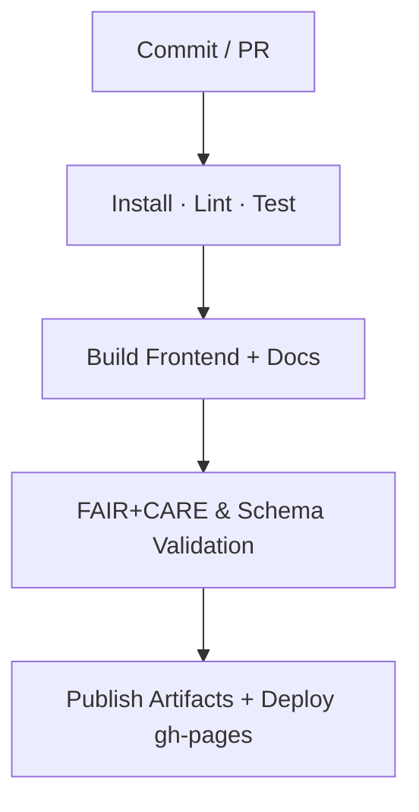
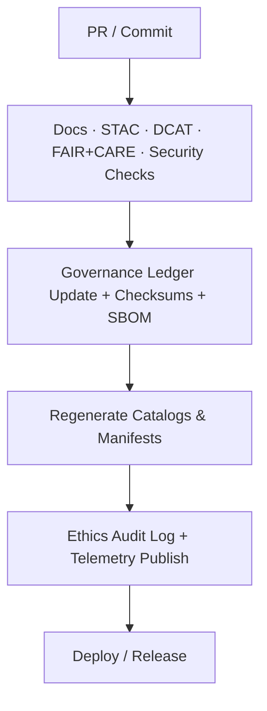

<div align="center">

# 🧩 Kansas Frontier Matrix — **GitHub Configuration & CI/CD Overview**  
`.github/README.md`

**Purpose:** Documentation for GitHub Actions, community standards, and automation in the KFM monorepo.  
Guarantees continuous integration, **FAIR+CARE** validation, automated docs checks, and ethical AI governance per **MCP-DL v6.4.3 Diamond⁹ Ω**.

[](./workflows/site.yml)
[](./workflows/stac-validate.yml)
[](./workflows/dcat-export.yml)
[](./workflows/codeql.yml)
[](./workflows/trivy.yml)
[](./workflows/pre-commit.yml)
[](./workflows/docs-validate.yml)
[](../docs/standards/faircare-validation.md)

</div>

---

## 📚 Overview

The `.github/` directory defines **automation, governance, and community configuration** for KFM.

It governs:
- **GitHub Actions** (CI/CD, build, validation, governance)
- **Issue & Pull Request templates**, **CODEOWNERS**, **CONTRIBUTING**, **SECURITY**, **SUPPORT**
- **FAIR+CARE audits**, **STAC/DCAT** validation, **docs style** and **link checks**
- **Provenance** (checksums, SBOM) and **telemetry** publication for Focus Mode

All settings are YAML-based for transparent, reproducible operations under **MCP-DL**.

---

## 🧠 Key Workflows

### 🧱 1) Build & Deployment — `site.yml`
Automates front-end build (React + MapLibre), docs site generation, and deployment (gh-pages or Netlify).

**Pipeline**


Artifacts retained: `reports/**`, `coverage/**`, `dist/**`.

---

### 🧪 2) STAC Validation — `stac-validate.yml`
Validates **STAC 1.0** Items/Collections and internal JSON Schemas.

**Checks**
- STAC core schema & extension versions  
- Spatial/temporal coverage presence  
- Asset roles/media types & checksums  
- Governance linkage (manifest + ledger entry)

Outputs → `reports/self-validation/` (referenced by FAIR+CARE audit).

---

### 🗂️ 3) DCAT Export — `dcat-export.yml`
Generates **DCAT 3.0 JSON-LD** feeds aligned with STAC entries for data portal interoperability.

**Steps**
- Transform STAC → DCAT using metadata bridge  
- Validate JSON-LD contexts  
- Publish to `data/meta/` and attach to release assets

---

### 🔍 4) Code Quality & Security — `codeql.yml` · `trivy.yml` · `pre-commit.yml`
| Workflow | Tool | Function | Output |
|---|---|---|---|
| `codeql.yml` | GitHub CodeQL | Static analysis for Python/JS/YAML | `reports/security/codeql_analysis.json` |
| `trivy.yml` | Trivy | Container/SBOM/CVE scanning | `reports/security/trivy_scan_results.json` |
| `pre-commit.yml` | Pre-Commit | Lint/format/secret-scan/md rules | Inline annotations + job summary |

---

### 🧩 5) FAIR+CARE Validation — `faircare-validate.yml`
Automates **FAIR** metadata checks and **CARE** ethical review hooks.

**Validations**
- FAIR fields in STAC/DCAT/README front-matter  
- CARE flags for sensitive layers (masking/consent/notice)  
- Provenance chains in `manifest.zip` and STAC links

Logs → `reports/fair/` and `reports/audit/`.

---

### 🧾 6) Governance & Audit — `governance-ledger.yml`
Maintains the immutable governance chain.

**Functions**
- SHA-256 checksum generation for datasets/manifests  
- Append signed entries to `reports/audit/ai_hazards_ledger.json`  
- Publish Focus Mode telemetry → `../releases/v9.5.0/focus-telemetry.json`  
- SBOM attach → `../releases/v9.5.0/sbom.spdx.json`

---

### 📚 7) Docs Validation — `docs-validate.yml`
Ensures documentation quality/compliance.

**Tasks**
- Markdown linting (style, headings, lists)  
- **Link checker** (internal/HTTP) with retries & allowlist  
- Front-matter metadata presence (title/path/version/refs)  
- Mermaid syntax quick-parse (guard against render errors)

---

## 🧩 Community Configuration

### 🧰 Issue Templates — `.github/ISSUE_TEMPLATE/`
- `bug_report.yml` — Technical defects / validation failures  
- `feature_request.yml` — Enhancements / new features  
- `governance_review.yml` — Ethics / FAIR+CARE questions  
- `data_request.yaml` — Request new dataset/API integration  
- `data_submission.yml` — Submit dataset + provenance/licensing

Each form requires **provenance**, **license**, **FAIR+CARE flags**, and **owner**.

---

### 💬 Pull Request Templates — `.github/PULL_REQUEST_TEMPLATE/`
PRs must include:
- Purpose & scope  
- Schema & license confirmations  
- Links: `governance_ref`, `manifest_ref`, `sbom_ref`  
- Required checks: STAC, DCAT, FAIR+CARE, docs-validate, security scans

---

### 👥 CODEOWNERS & CONTRIBUTING
- **CODEOWNERS** maps reviewers per path (e.g., `/data/**` → `@kfm-etl-ops`, `/docs/**` → `@kfm-architecture`).  
- **CONTRIBUTING.md** codifies MCP docs-as-code, commit style, schema/versioning, and review SLAs.  
- **SECURITY.md** details vuln reporting, embargo, and patch timelines.  
- **SUPPORT.md** points to discussions, labels, and triage windows.

All contributions pass **pre-commit** and **required status checks** before merge.

---

## ⚙️ Directory Layout

```plaintext
.github/
├── README.md
├── workflows/
│   ├── site.yml
│   ├── stac-validate.yml
│   ├── dcat-export.yml
│   ├── codeql.yml
│   ├── trivy.yml
│   ├── pre-commit.yml
│   ├── faircare-validate.yml
│   ├── docs-validate.yml
│   └── governance-ledger.yml
├── ISSUE_TEMPLATE/
│   ├── bug_report.yml
│   ├── feature_request.yml
│   ├── governance_review.yml
│   ├── data_request.yaml
│   └── data_submission.yml
├── PULL_REQUEST_TEMPLATE/
│   └── default.md
├── CODEOWNERS
├── CONTRIBUTING.md
├── SECURITY.md
└── SUPPORT.md
```

---

## 🧩 Governance Integration



**Emitted Metadata**
- FAIR+CARE: `reports/fair/**`  
- Ethics & provenance: `reports/audit/**`  
- STAC integrity: `data/stac/**`  
- DCAT feeds: `data/meta/**`  
- Focus telemetry: `../releases/v9.5.0/focus-telemetry.json`  
- Release bundle: `../releases/v9.5.0/manifest.zip`

---

## 🧾 Version History

| Version | Date       | Author              | Summary |
|---|---|---|---|
| v9.5.0 | 2025-10-30 | @kfm-architecture | Added DCAT export & docs-validate workflows; upgraded refs to v9.5.0; tightened governance telemetry. |
| v9.3.3 | 2025-10-28 | @kfm-architecture | Added `data_request.yaml` to templates and directory layout. |
| v9.3.2 | 2025-10-28 | @kfm-architecture | Unified CI/CD and FAIR+CARE automation under MCP. |
| v9.3.1 | 2025-10-27 | @bartytime4life    | Introduced governance-ledger and faircare-validation. |
| v9.3.0 | 2025-10-26 | @kfm-etl-ops       | Initialized GitHub configuration documentation. |

---

<div align="center">

**Kansas Frontier Matrix** · *Automation × Governance × Reproducibility*  
[🔗 Project Repository](https://github.com/bartytime4life/Kansas-Frontier-Matrix) • [🧭 Docs Portal](../docs/) • [⚖️ Governance Ledger](../docs/standards/governance/)

</div>
