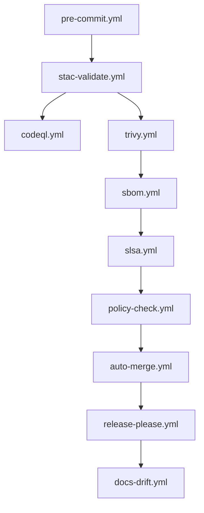
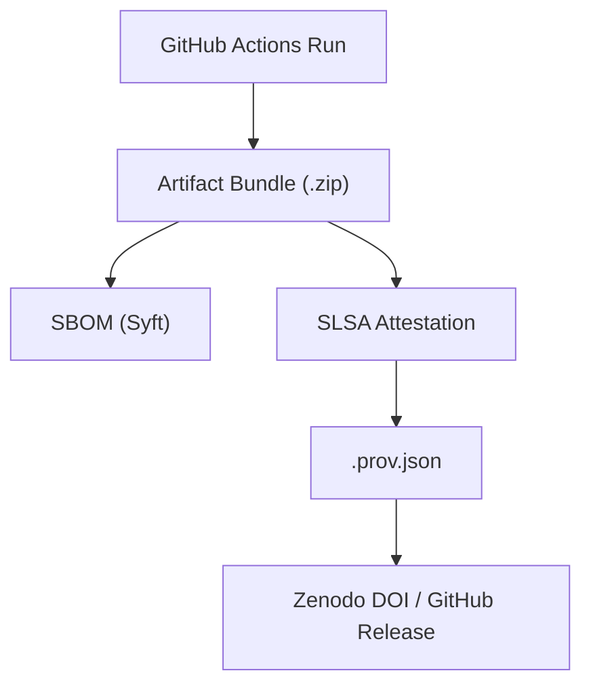

<div align="center">

# 🏛 **Kansas Frontier Matrix — GitHub Meta & Governance (v2.2.0 · Tier-Ω+∞ Platinum++ Certified)**  
`📁 .github/README.md`

**Purpose:** The authoritative index for all **repository-level configuration** in the KFM monorepo — workflows, CODEOWNERS, policies, automations, and provenance.  
Aligned with **MCP-DL v6.4.3**, **FAIR/CARE**, and the **Kansas Frontier Matrix Governance Charter (v2.0)**.

[](../docs/)
[](../SECURITY.md)
[](../LICENSE)

</div>

---

## 🧭 Overview
All automations, workflows, and templates under `.github/` are:
- **Deterministic** — SHA-pinned, reproducible builds  
- **Observable** — Metrics streamed to Grafana (`metrics.kfm.ai/github`)  
- **Ethical** — FAIR/CARE aligned with transparent provenance  

> *“Governance is not bureaucracy — it’s reproducible trust.”*

---

## 🧰 Contents of `.github/`
| Path | Purpose | Notes |
|:--|:--|:--|
| `.github/workflows/` | CI/CD pipelines | see [`workflows/README.md`](./workflows/README.md) |
| `.github/ISSUE_TEMPLATE/` | Issue forms | YAML issue templates w/ auto-labels |
| `.github/PULL_REQUEST_TEMPLATE.md` | PR schema | Enforces MCP metadata & validation |
| `.github/CODEOWNERS` | Ownership map | Required for SME routing |
| `.github/labeler.yml` | PR auto-labeling | optional |
| `.github/dependabot.yml` | Dependency management | optional |
| `.github/stale.yml` | Cleanup inactive issues | optional |

---

## ⚙️ Governance Workflow DAG


---

## ⚙️ Workflow Import Boundaries
- All actions must be **SHA-pinned** — no floating tags (`@v3` etc.).  
- Only actions from **approved orgs** (`actions/`, `github/`, `kfm-ai/`) are allowed.  
- Composite actions live under `.github/actions/*` and are referenced locally.  

---

## ⏱ Timeouts & Concurrency
- Max job time: **30 min** (validation) / **60 min** (security).  
- Concurrency:  
  ```yaml
  concurrency:
    group: ${{ github.workflow }}-${{ github.ref }}
    cancel-in-progress: true
  ```  
- Retries: up to 2× with exponential backoff on network 5xx errors.

---

## 🧱 CI/CD Runtime Matrix
| Env | Runners | Workflows | Retention |
|:--|:--|:--|:--|
| CI | `ubuntu-latest` | pre-commit, stac-validate, codeql, trivy | 14 d |
| CD | `ubuntu-latest` | sbom, slsa, policy-check, site | 365 d |
| AI / DataOps | `ubuntu-latest` | ai-model, ai-ethics, checksums | 90 d |

---

## 🪝 Repository Event Hooks
| Trigger | Action |
|:--|:--|
| `pull_request.opened` | Validate metadata + tests |
| `push.main` | Build release, attach SBOM/SLSA |
| `schedule.weekly` | Audit dependencies + policies |

---

## 👥 CODEOWNERS & Review Routing
```
/.github/*                  @kfm-architecture @kfm-security @kfm-docs
/docs/standards/*           @kfm-docs
/data/stac/*                @kfm-data
/src/ai/*                   @kfm-ai
/src/web/*                  @kfm-web
```
> SME reviews + passing CI gates = merge eligibility.

---

## 🔒 Pinned Actions Policy
- **All** actions pinned by full commit SHA (40 chars).  
- Example: `uses: actions/checkout@8ade…` (not `@v4`).  
- Monthly SHA refresh via Dependabot PRs.

---

## 🔐 Security Threat Matrix
| Threat | Mitigation | Workflow |
|:--|:--|:--|
| Secrets in commits | Gitleaks scan | `gitleaks.yml` |
| Supply-chain injection | SHA-pinned actions | all |
| Privilege escalation | OIDC ephemeral tokens | all |
| Data poisoning | STAC lineage + checksum validation | `stac-validate.yml` |
| Model bias drift | AI ethics benchmark | `ai-ethics.yml` |

---

## 🧮 Risk Register
| ID | Risk | Likelihood | Impact | Mitigation | Owner |
|:--|:--|:--:|:--:|:--|:--|
| GH-001 | Unpinned action | L | H | enforce SHA pin | @kfm-security |
| GH-002 | Docs drift | M | M | weekly `docs-drift.yml` | @kfm-docs |
| GH-003 | Provenance loss | L | H | `.prov.json` mirror → Zenodo | @kfm-architecture |
| GH-004 | Bias regression | M | M | `ai-ethics.yml` | @kfm-ai |

---

## 🚨 Governance Audit & Escalation Path
1️⃣ **Anomaly detected** → Maintainer triage (24 h SLA)  
2️⃣ **Unresolved** → escalate → `@kfm-security`  
3️⃣ **Critical** → Council review; publish post-mortem → `docs/sop/incidents/`  
4️⃣ **Closure** → Summary logged in `mcp_audit.yaml`

---

## 🧾 Provenance Chain Diagram


> **Mermaid tip:** quote node labels with parentheses or punctuation.

---

## 🔗 Latest Provenance Artifacts
- SBOM → `release-assets/sbom.cdx.json`  
- SLSA Attestation → `release-assets/slsa.intoto.jsonl`  
- Provenance → `release-assets/.prov.json`  
- DOI → [Zenodo Record](https://zenodo.org/record/kfm-governance)

---

## 🌍 FAIR / CARE & Ethics Alignment
- **FAIR:** Findable · Accessible · Interoperable · Reusable  
- **CARE:** Collective Benefit · Authority · Responsibility · Ethics  
- **AI Ethics:** bias, consent, explainability — validated quarterly (`ai-ethics.yml`)  
- **Ledger:** `docs/standards/ethics/ledger/`

---

## 🆘 On-Call & Escalation Contacts
| Role | Handle | SLA |
|:--|:--|:--|
| Architecture | @kfm-architecture | 24 h |
| Security | @kfm-security | 4 h |
| Docs/Gov | @kfm-docs | 24 h |

---

## 📈 Observability Snapshot
```yaml
metrics:
  workflow_success_rate: 99.8
  build_latency_s: 142
  artifact_verification_pct: 100
  sbom_regeneration_ms: 281
  docs_drift_count: 0
  governance_policy_violations: 0
  a11y_audit_score: 97
alerts:
  - type: policy_violation
    threshold: 1
    channel: "#ci-alerts"
```

---

## 🧾 Provenance JSON-LD Context
```json
{
  "@context": "https://kfm.ai/contexts/github-governance.jsonld",
  "@type": "RepositoryGovernance",
  "name": "Kansas Frontier Matrix — GitHub Meta",
  "version": "2.2.0",
  "prov:wasGeneratedBy": "KFM-Automation/DocsBot",
  "prov:wasAttributedTo": ["@kfm-architecture", "@kfm-security", "@kfm-docs"],
  "prov:used": ["workflows/*.yml", "CODEOWNERS", "SECURITY.md"],
  "prov:wasDerivedFrom": "Zenodo DOI https://zenodo.org/record/kfm-governance"
}
```

---

## 🧮 Release Verification Checklist
| Gate | Tool | Status |
|:--|:--|:--:|
| Pre-commit lint | pre-commit.yml | ✅ |
| STAC validation | stac-validate.yml | ✅ |
| Code security | codeql.yml / trivy.yml | ✅ |
| Docs metadata | docs-validate.yml | ✅ |
| Provenance | sbom.yml / slsa.yml | ✅ |
| Policy | policy-check.yml | ✅ |
| AI Ethics | ai-ethics.yml | ✅ |

---

## 🧾 Change-Control Register
```yaml
changes:
  - date: "2025-11-18"
    change: "Platinum++ release; added guardrails, provenance quick-links, on-call matrix, and encoded badges."
    reviewed_by: "@kfm-architecture"
    qa_approved_by: "@kfm-security"
    pr: "#472"
```

---

## 🗓 Version History
| Version | Date | Author | Summary | Tier |
|:--|:--|:--|:--|:--|
| **v2.2.0** | 2025-11-18 | @kfm-architecture | Platinum++ governance: guardrails, provenance links, JSON-LD, risk & ethics updates | Ω+∞ Platinum++ |
| v2.1.0 | 2025-11-17 | @kfm-architecture | Platinum governance spec | Ω+∞ Platinum |
| v2.0.0 | 2025-11-16 | @kfm-architecture | Diamond+ governance spec | Ω+∞ Diamond+ |
| v1.0.1 | 2025-10-20 | @kfm-architecture | Artifact registry + telemetry | Ω+∞ |
| v1.0.0 | 2025-10-20 | @kfm-architecture | Initial meta README | Ω |

---

<div align="center">

**© 2025 Kansas Frontier Matrix — GitHub Meta & Governance**  
Governance by code — transparent, reproducible, and accountable.  
Built under **MCP-DL v6.4.3** and **KFM Governance Charter v2.0**.

[]()  
[]()  
[]()

</div>

<!-- MCP-FOOTER-BEGIN
MCP-VERSION: v6.4.3
MCP-TIER: Ω+∞ Platinum++
DOC-PATH: .github/README.md
MCP-CERTIFIED: true
SBOM-GENERATED: true
SLSA-ATTESTED: true
A11Y-VERIFIED: true
FAIR-CARE-COMPLIANT: true
GOVERNANCE-TAXONOMY: true
SECURITY-THREAT-MATRIX: true
CODEOWNERS-MAPPED: true
OBSERVABILITY-ACTIVE: true
RISK-REGISTER-INCLUDED: true
WORKFLOW-DAG-DOCUMENTED: true
EXTERNAL-HOOKS-MAPPED: true
GOVERNANCE-AUDIT-ESCALATION: true
PROVENANCE-JSONLD: true
WORKFLOW-TIMEOUTS-SET: true
PINNED-ACTIONS-POLICY: true
SUITE-IMPORT-BOUNDARIES: true
MERMAID-SAFETY-NOTE: true
PROVENANCE-LINKS-PUBLISHED: true
PERFORMANCE-BUDGET-P95: 2.5 s
GENERATED-BY: KFM-Automation/DocsBot
LAST-VALIDATED: {build.date}
MCP-FOOTER-END -->
