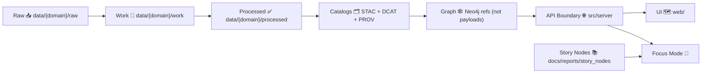

<div align="center">

<picture>
  <source media="(prefers-reduced-motion: reduce)" srcset="../docs/assets/kfm-seal-320.png">
  
</picture>

# 🧰 `.github` — Governance-as-Code, Community Health & Automation for **Kansas Frontier Matrix (KFM)** 🚧

<br/>

<!-- Status / Safety -->


<br/>


<br/>

<!-- Repo badges -->


</div>

> 🧭 **Start here:** this folder is where we codify *how we collaborate* and *what must be true before anything ships*.  
> ✅ Templates + ✅ CI/CD + ✅ Policy gates = **governed contributions** (no “trust me” merges).

---

## 🧱 Alignment: KFM v13 “One Fact, One Place” 📍

KFM’s repo structure is intentionally **canonical** (v13): documentation, standards, templates, schemas, pipelines, and data catalogs each have a single home.  
**`.github/` doesn’t define truth — it enforces truth.** It orchestrates checks against:

- 📚 **Standards:** `docs/standards/` (STAC/DCAT/PROV profiles + repo rules)  
- ⚖️ **Governance:** `docs/governance/` (ethics, sovereignty, review gates)  
- 📐 **Schemas:** `schemas/` (JSON Schema + shapes for validation)  
- ⚖️ **Policy Pack:** `policy/` (OPA/Rego + policy tests)  
- 🗂️ **Catalog outputs:** `data/stac/`, `data/catalog/dcat/`, `data/prov/` *(legacy: `data/provenance/`)*

---

## 🔗 Quick Links (Repo Truth Anchors)

- ⬅️ **Project Overview:** [`../README.md`](../README.md)
- 🧭 **Master Guide v13:** [`../docs/MASTER_GUIDE_v13.md`](../docs/MASTER_GUIDE_v13.md)
- 🏗️ **Architecture:** [`../docs/architecture/`](../docs/architecture/)
- 📜 **Standards (Profiles + Repo rules):** [`../docs/standards/`](../docs/standards/)
- ⚖️ **Governance (Ethics + Sovereignty + Review Gates):** [`../docs/governance/`](../docs/governance/)
- 📚 **Story Nodes:** [`../docs/reports/story_nodes/`](../docs/reports/story_nodes/)
- 📐 **Schemas:** [`../schemas/`](../schemas/)
- ⚖️ **OPA Policy Pack:** [`../policy/`](../policy/)
- 🗂️ **STAC:** [`../data/stac/`](../data/stac/)
- 🌐 **DCAT:** [`../data/catalog/dcat/`](../data/catalog/dcat/)
- 🧾 **PROV:** [`../data/prov/`](../data/prov/)
- 🧪 **Tests:** [`../tests/`](../tests/)
- 🔧 **Tools & Validators:** [`../tools/`](../tools/)
- 🔐 **Security Policy:** [`../SECURITY.md`](../SECURITY.md) *(or `.github/SECURITY.md` if used)*

---

## 🚧 Under Construction (Read First)

This `.github/` directory is being assembled into **Governance-as-Code**. Expect churn while we lock:

- ✅ contribution templates that **ask for evidence**
- ✅ workflows that validate **metadata + provenance + schemas**
- ✅ policy checks that **fail closed** (no silent bypasses)
- ✅ security automation (scanning + SBOM) 🔐

> 🔥 Treat changes here like production infrastructure.  
> A tiny YAML change can unblock—or break—every PR.

### ✅ Roadmap Checklist (Governed Contributions)

- [x] Baseline `.github/README.md` aligned to v13 structure 📘  
- [ ] `PULL_REQUEST_TEMPLATE.md` with governance gates ✅  
- [ ] Issue Forms (`ISSUE_TEMPLATE/*.yml`) for ingest / map / contract / story node / bug 🧾  
- [ ] `CODEOWNERS` rules for “high blast radius” areas 👀  
- [ ] `dependabot.yml` for dependency hygiene 🔄  
- [ ] CI workflows (lint/test/build) ⚙️  
- [ ] Contract + schema validation (OpenAPI / JSON Schema / GraphQL SDL) 📜  
- [ ] Catalog validation (**STAC / DCAT**) 🗂️  
- [ ] Provenance validation (**PROV / JSON‑LD**) 🧾  
- [ ] Security scanning (CodeQL / secret scanning / SBOM) 🔐  
- [ ] Policy-as-code gates (OPA + Conftest) ⚖️  
- [ ] Release gating (signed manifests + reproducible bundles) 📦  

---

## 📁 What Lives in `.github/` (and why it matters)

This directory holds GitHub-native **community health + automation**. In v13 terms: **it enforces the repo’s truth contracts**.

```text
.github/
├─ README.md                     📘 This document
├─ workflows/                    ⚙️ GitHub Actions (CI/CD + governance checks)
├─ actions/                      🧩 Composite actions shared across workflows
├─ ISSUE_TEMPLATE/               🧾 Issue forms & templates
├─ PULL_REQUEST_TEMPLATE.md      ✅ PR checklist + governance gates
├─ CODEOWNERS                    👀 Review ownership rules
├─ dependabot.yml                🔄 Automated dependency updates
├─ SECURITY.md                   🔐 Security policy (optional, GitHub-recognized)
└─ FUNDING.yml                   💖 Sponsorship links (optional)
```

### 🖼️ Assets: Where visuals should live
- ✅ **Global branding** (used across docs + UI): `docs/assets/branding/`  
- ✅ **Community-only visuals** (used only in `.github/*` docs): `.github/assets/` *(optional)*  
- ✅ Keep assets small + optimized (mobile-friendly) 📱

---

## 🧭 KFM “Truth Path” (Why GitHub Automation Matters)

KFM is built around a non‑negotiable flow of evidence → governed artifacts → user experiences.



### ✅ Non‑Negotiables enforced via `.github/` gates

- 🧾 **Provenance-first**: no dataset or evidence artifact moves forward without **STAC + DCAT + PROV** alignment.
- 🛑 **Fail‑closed by default**: missing requirements block merges.
- 🔒 **Classification propagation**: outputs can’t be less restricted than inputs.
- ♻️ **Deterministic pipelines**: idempotent, config‑driven, logged, re‑runnable.
- 🧱 **API boundary**: UI/AI does **not** query PostGIS/Neo4j directly.
- 🧠 **Focus Mode constraints**: AI outputs must be traceable to cataloged evidence and governed citations.

---

## ⚖️ Governance Gates (What Workflows Must Prove)

Workflows should validate *claims* **and** *shape*:

### 🗂️ Metadata + Catalog Gates
- STAC JSON validates against `schemas/stac/` and the project STAC profile (`docs/standards/KFM_STAC_PROFILE.md`)
- DCAT JSON‑LD validates against `schemas/dcat/` and the DCAT profile (`docs/standards/KFM_DCAT_PROFILE.md`)
- PROV bundles validate against `schemas/prov/` and the PROV profile (`docs/standards/KFM_PROV_PROFILE.md`)

### 📐 Contract + Schema Gates
- Any change to API/UI contracts must validate against versioned schemas:
  - `schemas/storynodes/` (Story Node format + fields)
  - `schemas/ui/` (UI config, layer specs, telemetry if applicable)
  - API specs and extensions (OpenAPI / GraphQL SDL / JSON Schema)

### 🧾 Provenance + Audit Gates
- PROV must link raw inputs → processes → outputs
- Checksums/manifests (where used) must match referenced assets
- Policy decisions should be traceable to a specific **policy bundle hash/version** (auditability)

### 🔐 Security Gates
- CodeQL + dependency scanning (and optional SBOM generation)
- Secret scanning (fail on leaked credentials)
- Dependency hygiene (Dependabot + pinned actions)

---

## 🧪 Local “Run It Like CI” (Developer Workflow)

CI should never surprise you. Typical local checks:

```bash
# Policy gates (OPA/Conftest)
conftest test .

# Backend tests (if using docker-compose dev stack)
docker-compose exec api pytest

# Frontend tests (depending on tooling)
npm test
# or: pnpm test

# Lint/format examples (project-specific)
black --check .
eslint .
```

> 💡 Prefer “thin workflows”: keep logic in `tools/` scripts and call them from Actions.  
> Workflows should orchestrate, not become a second codebase.

---

## 🧾 Issues: The “Front Door” for Work

Work should start as an issue when it touches:

- 📥 new dataset ingest / cataloging
- 🗺 map layer additions or styling changes
- 🧠 Focus Mode / AI behavior changes
- 📐 contract / schema changes
- ⚖️ policy pack / governance rules
- 🔥 anything with high blast radius

### 🧷 Issue Writing Rules (Keeps us fast)
- ✅ one problem per issue
- 🧩 include context + expected outcome
- 🧾 include evidence links (datasets, docs, screenshots)
- 🏷️ add labels to route review

---

## ✅ Pull Requests: What “Good” Looks Like

### 🏷️ PR Title Style
Use a clear prefix + short summary:

- `feat(api): add dataset search filter for bbox + time`
- `fix(pipeline): make ingest idempotent for ks_hydrology_1880`
- `docs(governance): clarify classification propagation rules`
- `data(catalog): register new STAC collection + DCAT dataset`
- `policy(opa): tighten citation enforcement for focus-mode`

### 📦 Minimum PR Payload
Your PR should include:
- **What changed** and **why**
- **Proof** (tests, screenshots, sample outputs, validation logs)
- **Risk notes** (breaking changes, migrations, data backfills)
- **Docs updates** when behavior/contracts change

> 🧠 If it changes a **contract** (schema/API/UI config), it must include:  
> ✅ version bump, ✅ validator updates, ✅ migration notes (if needed)

---

## 👀 CODEOWNERS: “High Blast Radius” Review Routing

CODEOWNERS should require additional review for:

- `policy/**` ⚖️ (OPA policy pack)
- `schemas/**` 📐 (schema changes ripple everywhere)
- `.github/workflows/**` ⚙️ (governance enforcement)
- `src/server/**` 🌐 (API boundary / auth)
- `data/stac/**`, `data/catalog/dcat/**`, `data/prov/**` 🗂️🧾 (catalog truth)
- `docs/governance/**` ⚖️ (ethics/sovereignty/review gates)
- `releases/**` 📦 (shipping artifacts, manifests, SBOM)

---

## 🏷️ Labels Taxonomy (Recommended)

<details>
<summary><b>Click to expand label guide</b> 🏷️</summary>

### Type
- `type:bug` 🐛
- `type:feature` ✨
- `type:docs` 📚
- `type:data` 🧱
- `type:security` 🔐
- `type:policy` ⚖️
- `type:schema` 📐
- `type:release` 📦
- `type:chore` 🧹

### Area
- `area:api` ⚙️
- `area:web` 🗺️
- `area:pipelines` ♻️
- `area:catalog` 🗂️
- `area:provenance` 🧾
- `area:graph` 🕸️
- `area:governance` ⚖️
- `area:ai` 🎯
- `area:data-sovereignty` 🪶 *(CARE-aligned work)*

### Priority / Status
- `priority:p0` 🔥 / `priority:p1` ⚡ / `priority:p2` 🧊
- `status:blocked` ⛔ / `status:needs-review` 👀 / `status:ready` ✅

</details>

---

## 🔐 Secrets & Sensitive Data

- 🚫 never commit secrets (API keys, tokens, private URLs, credentials)
- ✅ use `.env.example` as the only commit-safe env reference
- ✅ store secrets in GitHub Secrets / environment protection rules
- 🧯 if you accidentally commit a secret:
  1) rotate it immediately  
  2) open a security issue (or private report)  
  3) scrub history if required  

---

## 🧠 Focus Mode & AI Governance (What we enforce)

When AI/Focus Mode is involved:
- ✅ AI output must be traceable to cataloged sources (dataset IDs / document refs)
- ✅ citation enforcement is **policy-backed** (fail if missing)
- ✅ restricted inputs remain restricted in derived outputs (classification propagation)
- ✅ AI answers should be logged as audit artifacts (question + sources + model + policy decision)

---

## 🪶 Data Ethics & Indigenous Data Sovereignty (When Applicable)

KFM includes Indigenous history and land-related materials. When work touches Indigenous data:

- ✅ prefer community-backed context over deficit framing
- ✅ document permissions/terms clearly (licenses + access boundaries)
- ✅ treat “open” ≠ “unrestricted” (governance still applies)
- ✅ label and route review via `area:data-sovereignty` 🪶

> 🏁 Goal: **fast collaboration without sacrificing trust.**  
> If it can’t be traced, validated, and reproduced… it doesn’t merge. ✅

---
