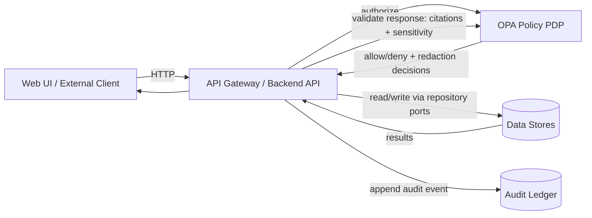

# .github/ — KFM GitHub Operations, Governance & CI Gates


> **Why this file exists**
>
> This `.github/README.md` is the **single source of truth for repo governance and CI enforcement**:
> what must exist in `.github/`, which checks are mandatory, and what rules are **non-negotiable**.
> It is written to be readable by humans *and* actionable for CI, CODEOWNERS, and policy review.

---

## 📌 Quick Links

- **Project root README**: `../README.md`
- **Docs**: `../docs/` *(not confirmed in repo — expected for KFM)*
- **Architecture**: `../docs/architecture/` *(not confirmed in repo — expected)*
- **Governance**: `../docs/governance/` *(not confirmed in repo — expected)*
- **Policies (OPA/Rego)**: `../policy/` *(path name may differ — verify in repo)*
- **Pipelines & data zones**: `../data/` *(path name may differ — verify in repo)*
- **CI workflows**: `./workflows/`

---

## 🧾 Governance Header (treat as production)

| Field | Value |
|---|---|
| Document | `.github/README.md` |
| Status | **Governed** (changes require review) |
| Applies to | GitHub Actions, branch protections, CODEOWNERS, templates, supply chain attestations |
| Effective date | 2026-02-13 |
| Owners | Defined in `.github/CODEOWNERS` (required) |
| Review triggers | Any change touching `policy/`, `.github/workflows/`, catalogs, Story Nodes, or validators |

---

## 🔒 Non‑Negotiables (KFM invariants)

These invariants are not “guidelines.” They are **contracts** that CI and policy must enforce.

1. **Trust membrane**
   - UI and external clients **never** access databases directly.
   - All access is via **governed API + policy boundary**.

2. **Fail‑closed policy**
   - **Default deny**: missing policy input, missing catalogs, missing citations → deny.

3. **Dataset promotion gates**
   - Promotion is **Raw → Work → Processed**
   - Promotion requires **deterministic checksums + catalogs** (STAC/DCAT/PROV).

4. **Focus Mode must cite or abstain**
   - Any factual answer must include citations, or the system must abstain.
   - Every Focus Mode answer produces an **audit reference**.

---

## 🧱 Trust Membrane — How Requests Flow



**Key enforcement principle:** the trust membrane exists to prevent bypassing governance and to ensure auditability.
If a path bypasses the gateway or bypasses policy → it is a **design defect** and a **CI failure**.

---

## 🗂️ What MUST Live in `.github/`

This directory is not decoration — it is where KFM’s repo-level governance becomes enforceable.

### Required files and folders

| Path | Required | Purpose | Governed impact |
|---|---:|---|---|
| `.github/README.md` | ✅ | This document | High |
| `.github/workflows/ci.yml` | ✅ | CI gates: docs/data/policy/build | High |
| `.github/workflows/release.yml` | ✅ | Releases only when gates pass; attestations | High |
| `.github/workflows/policy-regression.yml` | ✅ | OPA + “cite-or-abstain” regression suite | High |
| `.github/workflows/supply-chain.yml` | ✅ | SBOM + provenance attestation | High |
| `.github/CODEOWNERS` | ✅ | Enforced review ownership | High |
| `.github/PULL_REQUEST_TEMPLATE.md` | ✅ | PR checklist for governance compliance | Medium |
| `.github/ISSUE_TEMPLATE/` | ✅ | Structured governance-friendly issues | Medium |
| `.github/SECURITY.md` | ✅ | Responsible disclosure | Medium |
| `.github/dependabot.yml` | ✅ | Dependency visibility + updates | Medium |

> If any “Required” item is missing, open an issue labeled `governance-gap` and block releases until resolved.

---

## 🧭 Expected Repo Directory Layout (KFM standard)

> This is the **canonical expected layout** described by KFM design artifacts.  
> If your repo differs, keep the *boundaries* identical even if names differ.

```text
repo-root/
├─ .github/                      # CI + governance enforcement (this folder)
├─ docs/                         # governed docs, Story Nodes, runbooks, ADRs
├─ data/
│  ├─ raw/                        # immutable acquisitions + manifests + checksums
│  ├─ work/                       # normalized/validated intermediates
│  └─ processed/                  # publishable, policy-labeled outputs
├─ catalog/
│  ├─ dcat/                       # dataset discovery + licensing metadata
│  ├─ stac/                       # spatial asset collections + items
│  └─ prov/                       # lineage: activities/entities/agents
├─ policy/                        # OPA/Rego + tests (default deny)
├─ src/                           # backend API (ports/adapters enforced)
├─ web/                           # React/TS UI (no direct DB calls)
├─ scripts/                       # lint/validate scripts executed by CI
└─ infra/                         # deployment (k8s, helm, gitops)
```

> **Boundary rule:** regardless of layout, **frontend never talks to DB**; **core backend uses repository interfaces**; **all access is policy-governed**.

---

## ✅ CI Gates (GitHub Actions) — The KFM “No‑Merge Without Proof” Standard

### Minimum CI hardening set (required)

KFM CI must validate:
- **Docs**: lint + link-check + template validator  
- **Stories**: Story Node v3 validator + citation resolution  
- **Data**: STAC/DCAT/PROV validation + checksums  
- **Policy**: `opa test policy -v`  
- **Supply chain**: **SBOM (SPDX)** + **SLSA/in‑toto provenance attestation**  

### CI Gate Matrix

| Gate | What it protects | Typical checks | Required on PR? |
|---|---|---|---:|
| `docs` | governed documentation integrity | markdown lint, link-check, template conformance | ✅ |
| `stories` | Story Node validity + evidence | schema validation, citation resolvability | ✅ |
| `data` | promotion correctness | STAC/DCAT/PROV validate, checksum validation | ✅ |
| `policy` | safety + governance | OPA tests, regression suite (default deny) | ✅ |
| `build` | deployability | container builds, smoke tests | ✅ |
| `supply-chain` | artifact integrity | SBOM + provenance attestation | ✅ for release |
| `security` | repo hygiene | secret scan, dependency scan, pinned actions | ✅ (recommended) |

---

## 🧪 Example CI Workflow (reference skeleton)

> This is a **reference baseline**. Adjust paths as needed, but **do not weaken gates**.

```yaml
name: ci
on: [push, pull_request]

jobs:
  docs:
    runs-on: ubuntu-latest
    steps:
      - uses: actions/checkout@v4
      - run: ./scripts/lint_docs.sh
      - run: ./scripts/validate_story_nodes.sh

  data:
    runs-on: ubuntu-latest
    steps:
      - uses: actions/checkout@v4
      - run: ./scripts/validate_catalogs.sh   # STAC/DCAT/PROV
      - run: ./scripts/validate_checksums.sh

  policy:
    runs-on: ubuntu-latest
    steps:
      - uses: actions/checkout@v4
      - run: opa test policy -v

  build:
    runs-on: ubuntu-latest
    needs: [docs, data, policy]
    steps:
      - uses: actions/checkout@v4
      - run: docker build -t kfm-api ./src
      - run: docker build -t kfm-web ./web
```

---

## ⚖️ Policy-as-Code (OPA) — Default Deny, Cite-or-Abstain

### Focus Mode output validation (baseline)

```rego
package kfm.ai
default allow := false

# Require citations AND sensitivity approval.
allow if {
  input.answer.has_citations == true
  input.answer.sensitivity_ok == true
}
```

### Policy input schema (illustrative)

```json
{
  "actor": { "role": "public|reviewer|admin", "attributes": {} },
  "request": { "endpoint": "/api/v1/ai/query", "context": {} },
  "answer": { "text": "...", "has_citations": true, "citations": [], "sensitivity_ok": true }
}
```

> **Fail-closed rule:** if required keys are missing, the policy must deny.

---

## 🧾 Evidence & Audit Guarantees

### “Citations resolve fast” acceptance criterion

A KFM-quality UX means:

- Given any `citation.ref` in a Focus Mode answer, the UI can resolve it to a human‑readable evidence view in **≤ 2 API calls**.

### Audit record schema (excerpt)

```json
{
  "$schema": "https://json-schema.org/draft/2020-12/schema",
  "$id": "https://kfm.example.org/schema/audit_record.json",
  "type": "object",
  "required": ["audit_ref", "timestamp", "event_type", "subject", "event_hash"],
  "properties": {
    "audit_ref": { "type": "string" },
    "timestamp": { "type": "string", "format": "date-time" },
    "event_type": { "type": "string" },
    "actor": { "type": "object", "additionalProperties": true },
    "subject": { "type": "object", "additionalProperties": true },
    "evidence_refs": { "type": "array", "items": { "type": "string" } },
    "prev_hash": { "type": "string" },
    "event_hash": { "type": "string" }
  }
}
```

---

## 🧬 Data Zones & Promotion Gates (Raw → Work → Processed)

### What each zone means

| Zone | Allowed contents | Who can read | Who can publish |
|---|---|---|---|
| `raw/` | acquired source artifacts + deterministic manifests/checksums | internal + reviewers (by policy) | nobody |
| `work/` | normalized + validated intermediates, redaction transforms | internal + reviewers (by policy) | nobody |
| `processed/` | publishable, policy-labeled datasets and derivatives | public/reviewer/admin depending on policy | CI only |

### Promotion checklist (CI-enforced)

- [ ] Row-level schema validation (required fields; type coercion documented)
- [ ] Geometry validity + bounds checks
- [ ] Temporal consistency checks
- [ ] License + attribution captured in DCAT; restrictions encoded in policy
- [ ] Provenance completeness: every promoted artifact has a PROV chain + deterministic checksum
- [ ] Policy labels defined; restricted fields/locations redacted per rules
- [ ] Catalogs emitted (DCAT always; STAC/PROV as applicable) and link-check clean
- [ ] API contract tests pass for at least one representative query
- [ ] Backfill strategy documented (if applicable)

---

## 🧯 Sensitivity Handling (FAIR + CARE, enforced)

KFM must treat some data as sensitive (examples include private ownership, precise archaeological site locations, and some health/public-safety indicators). Sensitivity handling requires:

- policy labels at dataset/record/field level
- derivative datasets with explicit redaction provenance
- fail-closed policy checks

**Repo rule:** do not merge PRs that introduce sensitive material without explicit policy labels + redaction evidence.

---

## 🧰 Local Dev + Smoke Tests (recommended baseline)

> These commands are a *recommended baseline*; adjust to match your repo’s actual tooling.

### Quickstart

1. Copy env file:
   - `cp .env.example .env` *(if present)*
2. Start:
   - `docker compose up --build`
3. Confirm:
   - UI: `http://localhost:3000`
   - API docs: `http://localhost:8000/docs`

### Smoke tests (minimum)

- [ ] API health endpoint returns 200
- [ ] OPA reachable and returns expected deny/allow decisions
- [ ] “Focus Mode” endpoint denies answers without citations (policy test)
- [ ] A sample citation can be resolved to an evidence view

---

## 🧾 PR Workflow (mandatory)

### Branch protection (required)

- No direct pushes to protected branches
- No force push
- PR required + review required
- Required checks: `docs`, `stories`, `data`, `policy`, `build`
- `.github/workflows/**`, `policy/**`, `catalog/**` must be CODEOWNED and require explicit approval

### PR Checklist (copy into `.github/PULL_REQUEST_TEMPLATE.md`)

- [ ] No UI-to-DB direct access introduced (trust membrane preserved)
- [ ] Any new dataset change includes **checksums + STAC/DCAT/PROV** (or PR explains why not applicable)
- [ ] Story Nodes validate and citations resolve
- [ ] OPA tests pass; default deny preserved
- [ ] Sensitive data reviewed; policy labels + redaction provenance present where needed
- [ ] CI gates all green; no bypass

---

## 🧷 Issue Templates (recommended set)

Create structured issue templates so governance becomes easy, not optional:

- `bug_report.yml` — defects with reproduction + expected evidence
- `feature_request.yml` — new capability proposals with acceptance criteria
- `data_source_request.yml` — ingestion profile request with licensing + sensitivity
- `story_node_proposal.yml` — new Story Node idea with sources + claims list
- `security_report.yml` — private vulnerability channel instructions

---

## 🧑‍⚖️ CODEOWNERS (required)

Minimum recommended ownership map:

| Area | Suggested owners |
|---|---|
| `.github/workflows/**` | platform + security owners |
| `policy/**` | governance + security owners |
| `catalog/**` | data stewardship owners |
| `data/**` | data stewardship owners |
| `src/**` | backend owners |
| `web/**` | frontend owners |
| `docs/**` | documentation stewards |

> Owners are governance enforcement. Missing CODEOWNERS = missing trust.

---

## 🔐 Supply Chain (release hard requirement)

**Rule:** Publish versioned container images **only if all gates pass**.

Minimum release artifacts:
- SBOM (SPDX recommended)
- SLSA/in‑toto provenance attestation
- Versioned container images

---

## 🚨 When CI Fails — Quick Diagnosis

| Failure | Usually means | Fix |
|---|---|---|
| `validate_catalogs` | missing/invalid STAC/DCAT/PROV | add/repair catalogs; ensure link-check clean |
| `validate_checksums` | nondeterministic artifacts | regenerate with stable ordering; record checksums |
| `opa test` | policy regression | update policy/tests; do not weaken default deny |
| `validate_story_nodes` | broken schema/citations | fix front matter; ensure evidence refs resolvable |
| `build` | broken Dockerfile/paths | align build context; update CI paths |

---

## 📚 Reference Docs (authority ladder)

This `.github` governance set is derived from KFM’s design artifacts. If something conflicts:
1) The **non‑negotiables** win  
2) Policy remains **fail‑closed**  
3) Escalate via ADR (Architecture Decision Record) instead of weakening gates

**Primary authority sources (by design):**
- KFM Next‑Gen Blueprint & Primary Guide (internal draft)
- KFM Comprehensive Data Source Integration Blueprint
- KFM governance + ethics + sovereignty docs *(expected in `docs/governance/`, not confirmed in repo)*

---

## ✅ Definition of Done (for `.github/README.md`)

This document is “done” when:

- [ ] Every “Required” `.github` item exists in repo
- [ ] CI gates run on every PR and are branch-protected
- [ ] OPA tests enforce default deny + cite-or-abstain
- [ ] Supply chain attestations exist for releases
- [ ] CODEOWNERS is present and enforced for critical paths
- [ ] Contributors can run the checks locally via `scripts/` equivalents

---

<details>
<summary><strong>Appendix: Recommended GitHub Actions hardening (security hygiene)</strong></summary>

- Pin third-party Actions by commit SHA (avoid mutable tags).
- Use least-privilege `GITHUB_TOKEN` permissions per job.
- Enable secret scanning / push protection and dependency scanning.
- Require PR reviews for `.github/workflows/**` and `policy/**`.

</details>