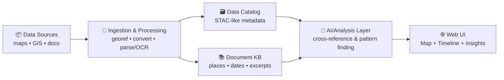

# 🤝 `.github/` — Collaboration & Automation Hub (Kansas-Frontier-Matrix)

[](#-how-to-contribute)
[](https://github.com/bartytime4life/Kansas-Frontier-Matrix/issues)
[](#-pull-requests-prs)

> [!NOTE]
> This README documents **how we collaborate on GitHub**: issues, pull requests, reviews, labels, and automation.
>
> ✅ Start with the project overview: **[`../README.md`](../README.md)**

---

## 🧭 What we’re building (context in 20 seconds)

Kansas-Frontier-Matrix is an **open-source geospatial + historical mapping hub**: we ingest historical maps, modern GIS layers, and archival documents; normalize them into consistent spatial formats (e.g., GeoTIFF/COG + GeoJSON); connect text ↔ places ↔ time; and surface everything in an interactive map UI (2D/3D + time slider). 🗺️⏳



---

## 🧩 What lives in `.github/`

This folder is the **operations layer** for GitHub collaboration: templates, workflows, and rules. ✅

```text
📁 .github/
├─ 📁 workflows/                 # 🤖 CI/CD + automation
│  ├─ ci.yml                     # ✅ tests + lint + typecheck
│  ├─ pages.yml                  # 🌐 build/deploy web UI (if using GitHub Pages)
│  ├─ data-refresh.yml           # 🗺️ scheduled catalog/layer refresh (optional)
│  └─ security.yml               # 🔐 security scans (optional)
├─ 📁 ISSUE_TEMPLATE/            # 🧾 guided issue creation
│  ├─ bug_report.yml
│  ├─ feature_request.yml
│  ├─ data_layer_request.yml
│  └─ question.yml
├─ 📄 PULL_REQUEST_TEMPLATE.md   # ✅ PR checklist & review prompts
├─ 📄 CODEOWNERS                 # 👀 review routing
└─ 📄 README.md                  # 📍 you are here
```

> [!TIP]
> If any of the files above don’t exist yet, this README acts as the **spec** for what we should add next.

---

## 🧠 How to contribute

### 🧾 1) Issues

Use issues for **everything**: bugs, data layers, UI changes, pipeline improvements, docs, research notes.

**Before filing:**
- Search existing issues/PRs
- Add screenshots (UI), logs (pipelines), or minimal repro (code)
- Include **time range** + **spatial extent** for geospatial requests (bbox, county, township/range, etc.)

**Recommended issue categories (labels):**
- `type:bug` 🐛 — something broken
- `type:feature` ✨ — new capability
- `type:data` 🗺️ — new layer/source, ingestion, catalog updates
- `type:docs` 📚 — documentation improvements
- `type:chore` 🧹 — refactor, tooling, dependencies
- `type:security` 🔐 — security-related changes (avoid public details; see below)

---

### ✅ 2) Pull Requests (PRs)

PRs should be **small, reviewable, and testable**.

**Branch naming:**
- `feat/<short-scope>` — new features
- `fix/<short-scope>` — bug fixes
- `data/<source-or-layer>` — data/catalog changes
- `docs/<topic>` — documentation

**PR size guideline:**
- Prefer < **400 lines** changed unless there’s a strong reason

**PR must include:**
- A clear summary (“what + why”)
- Testing notes (unit/integration/manual)
- Docs updates **if behavior changes**
- Data provenance notes **if layers change** (see below)

> [!IMPORTANT]
> For geospatial changes: include **EPSG**, **bbox**, **time coverage**, and **format** (COG/GeoJSON/etc.) in the PR description.

---

## 🏷️ Label taxonomy (keep it consistent)

Use prefixes so filters and boards stay sane:

- `type:*` → intent (bug/feature/data/docs/chore/security)
- `area:*` → subsystem
  - `area:pipeline` 🧰
  - `area:catalog` 🗃️
  - `area:ai` 🧠
  - `area:web` 🌐
  - `area:db` 🗄️
- `priority:*` → urgency (`p0`, `p1`, `p2`)
- `status:*` → workflow state (`blocked`, `needs-info`, `ready`, `in-progress`)
- `good-first-issue` 🌱 → newcomer-friendly

---

## 🗺️ Data & layer contribution rules (non-negotiable)

### ✅ Provenance checklist (required)
Any new/updated dataset **must** include:

- Source name + link (or archive reference)
- License/terms (or “unknown” with rationale)
- Spatial reference (EPSG) and units
- Time coverage (single year, range, or “undated”)
- Processing steps (georef points count, resampling, simplification, etc.)
- Checksums (recommended) and version stamp

> [!WARNING]
> If we can’t explain where the data came from and how it was processed, we can’t trust it — and it won’t ship.

### 🧱 Preferred formats
- Raster: **COG** (Cloud-Optimized GeoTIFF) ✅
- Vector: **GeoJSON** (or GeoPackage/Shapefile when justified)
- Interchange for Google Earth: **KML/KMZ** (regionated if large)
- Tiles: vector/raster tiles only when needed for UX/performance

### 🧪 Validation expectations
- Geometry validity checks (self-intersections, empty geometries)
- Topology checks where relevant (boundaries, networks)
- “Looks right” QA: render a quick preview in the web UI / QGIS
- Document the test: screenshot + bbox + zoom level

---

## 🧠 AI / analytics contributions (keep it scientific)

We accept AI/ML contributions when they are:
- Transparent (inputs/outputs + limitations)
- Evaluated (not vibes)
- Reproducible (seeded, versioned, documented)

**Required artifacts for ML-ish PRs:**
- A short **dataset note** (what, where from, known biases)
- An **evaluation note** (metrics + what “good” means)
- A **model/experiment card** in `mcp/model_cards/` (or equivalent)

> [!TIP]
> Avoid statistical foot-guns: document sampling, leakage risks, p-hacking risks, and how you validated.

---

## 🧱 Architecture & code quality expectations

### 🧼 Clean boundaries
We bias toward **clean architecture**:
- UI concerns stay in `web/`
- Domain logic stays testable (not glued to frameworks)
- Adapters (DB/API/IO) are swappable and mocked in tests

### 🧰 Tooling norms
- Prefer reproducible CLI tooling (`make`, `task`, or scripts)
- Keep pipelines deterministic (idempotent steps, clear outputs)
- Log important steps (inputs, outputs, counts, timings)

### 🐳 Docker-first (when possible)
If it runs in CI, it should run locally. Containerization helps.

---

## 🔐 Security & privacy

- Never commit secrets (tokens, keys, credentials)
- Use GitHub Secrets + environment variables
- For vulnerabilities: open a **private** report (or follow `SECURITY.md` if present)

> [!CAUTION]
> Don’t paste sensitive endpoints, server IPs, or access patterns in public issues.

---

## 🌐 Frontend contributions (maps + time)

UI work should keep these goals in mind:
- Layer toggles + strong legend behavior 🗺️
- Timeline/time slider that filters layers cleanly ⏳
- Progressive loading for heavy data (tiles, regionated KML, etc.)
- Accessibility + responsive layouts 📱🖥️

---

## ✅ Definition of Done (DoD)

Use this as the final self-check before requesting review:

- [ ] Issue is linked (or clearly explained why not)
- [ ] Tests added/updated (or explained why not)
- [ ] Docs updated (README/ARCHITECTURE/SOP) if behavior changed
- [ ] Data provenance included (if data touched)
- [ ] No secrets in commits, logs, or screenshots
- [ ] Reviewer can reproduce locally (steps included)

---

## 📚 Project reference library (the “why” behind our standards)

<details>
<summary><strong>📖 Expand the full reading map (PDFs)</strong></summary>

### 🧭 Core project docs
- `docs/design/Kansas-Frontier-Matrix_ Open-Source Geospatial Historical Mapping Hub Design.pdf`
- `docs/architecture/Kansas Frontier Matrix (KFM) – Comprehensive Technical Documentation.pdf`

### 🗺️ GIS, geoprocessing, remote sensing
- `docs/library/Geographic Information System Basics - geographic-information-system-basics.pdf`
- `docs/library/geoprocessing-with-python.pdf`
- `docs/library/python-geospatial-analysis-cookbook.pdf`
- `docs/library/making-maps-a-visual-guide-to-map-design-for-gis.pdf`
- `docs/library/Cloud-Based Remote Sensing with Google Earth Engine-Fundamentals and Applications.pdf`
- `docs/library/Google Earth Engine Applications.pdf`

### 🧭 Maps APIs & web mapping
- `docs/library/Google Maps API Succinctly - google_maps_api_succinctly.pdf`
- `docs/library/google-maps-javascript-api-cookbook.pdf`

### 🌐 Web + graphics + 3D
- `docs/library/responsive-web-design-with-html5-and-css3.pdf`
- `docs/library/webgl-programming-guide-interactive-3d-graphics-programming-with-webgl.pdf`
- `docs/library/Computer Graphics using JAVA 2D & 3D.pdf`

### 🧠 AI, agents, ML foundations
- `docs/library/AI Foundations of Computational Agents 3rd Ed.pdf`
- `docs/library/Artificial-neural-networks-an-introduction.pdf`
- `docs/library/deep-learning-in-python-prerequisites.pdf`
- `docs/library/Data Mining Concepts & applictions.pdf`

### 📈 Statistics, experiments, and modeling discipline
- `docs/library/Understanding Statistics & Experimental Design.pdf`
- `docs/library/Statistics Done Wrong - Alex_Reinhart-Statistics_Done_Wrong-EN.pdf`
- `docs/library/Bayesian computational methods.pdf`
- `docs/library/regression-analysis-with-python.pdf`
- `docs/library/graphical-data-analysis-with-r.pdf`
- `docs/library/Data Science &-  Machine Learning (Mathematical & Statistical Methods).pdf`

### 🧪 Simulation, optimization, and advanced math
- `docs/library/Scientific Modeling and Simulation_ A Comprehensive NASA-Grade Guide.pdf`
- `docs/library/Generalized Topology Optimization for Structural Design.pdf`
- `docs/library/Spectral Geometry of Graphs.pdf`

### 🧰 Engineering foundations (systems, DBs, tooling)
- `docs/library/clean-architectures-in-python.pdf`
- `docs/library/implementing-programming-languages-an-introduction-to-compilers-and-interpreters.pdf`
- `docs/library/Introduction-to-Docker.pdf`
- `docs/library/Node.js Notes for Professionals - NodeJSNotesForProfessionals.pdf`
- `docs/library/PostgreSQL Notes for Professionals - PostgreSQLNotesForProfessionals.pdf`
- `docs/library/MySQL Notes for Professionals - MySQLNotesForProfessionals.pdf`
- `docs/library/Scalable Data Management for Future Hardware.pdf`
- `docs/library/applied-data-science-with-python-and-jupyter.pdf`
- `docs/library/MATLAB Programming for Engineers Stephen J. Chapman.pdf`

### 🧑‍⚖️ Ethics & philosophy (how we treat data + people)
- `docs/library/Introduction to Digital Humanism.pdf`
- `docs/library/Principles of Biological Autonomy - book_9780262381833.pdf`

</details>

---

## 🧑‍💻 Maintainers & ownership

- CODEOWNERS live in **[`./CODEOWNERS`](./CODEOWNERS)** 👀  
- If you’re unsure who owns an area, open an issue with `status:needs-triage` and we’ll route it.

---

## 🚀 Next “missing but expected” files

If they don’t exist yet, consider adding:

- `SECURITY.md` 🔐 (vulnerability reporting)
- `CONTRIBUTING.md` 🤝 (expanded dev setup + conventions)
- `docs/ARCHITECTURE.md` 🧱 (system boundaries + runtime diagram)
- `.github/workflows/ci.yml` ✅ (lint/test/build)
- `.github/PULL_REQUEST_TEMPLATE.md` ✅ (checklist)

---

**Thanks for building the Matrix.** 🧭🗺️✨
