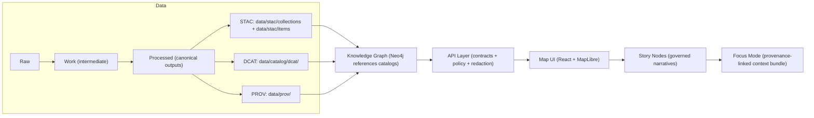
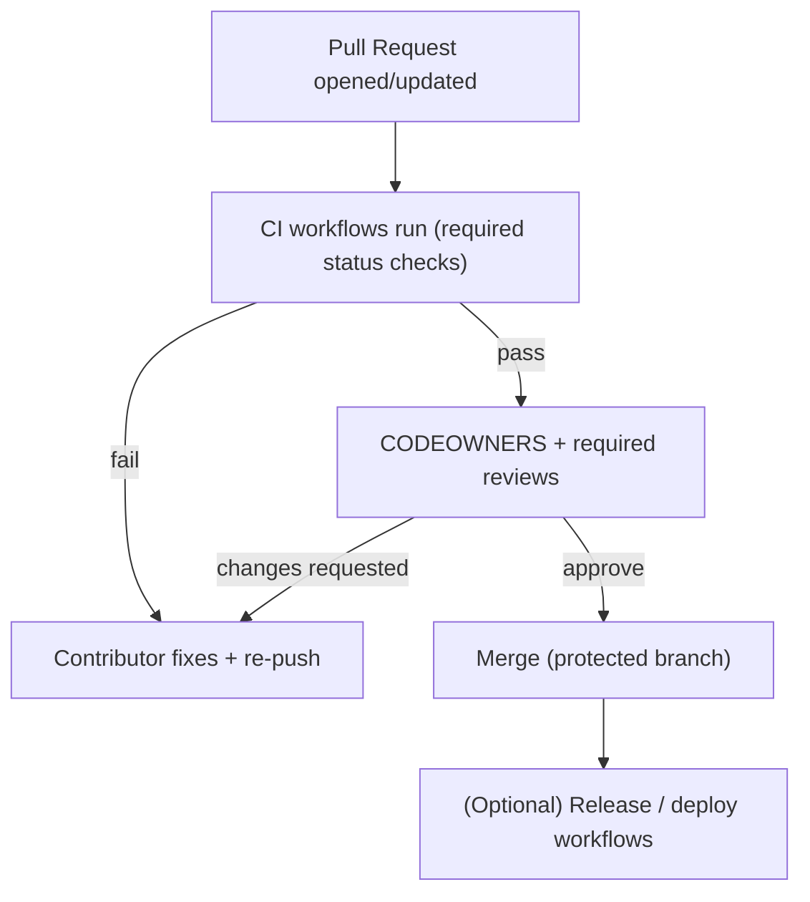
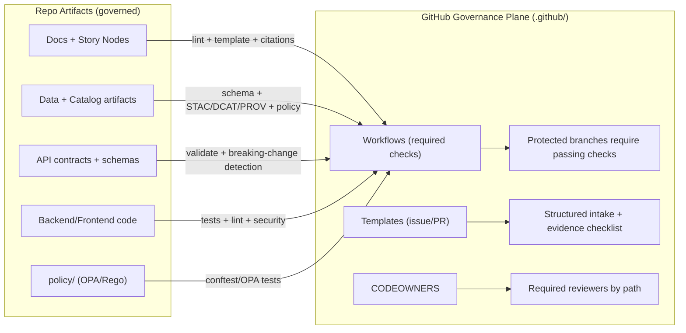

# Kansas Frontier Matrix (KFM) — `.github/` Governance Automation

> **Badges:** ✅ Governed • 🧾 Provenance-required • 🧱 Layered architecture • 🛡️ Merge-gated • 🧭 FAIR+CARE

> [!IMPORTANT]
> **Governed document.** This README describes **GitHub-native governance controls** (CI workflows + contribution templates + review routing) that enforce KFM’s core invariants **at merge time**. Documentation is treated as part of the system’s contract (not “just notes”), so changes here are subject to the same rigor as code changes.

`.github/` exists to make KFM governance **enforceable and reviewable**:
- **Evidence-first**: no narrative, dataset, or AI output ships without provenance.
- **Contract-first**: schemas and API contracts are treated as first-class, versioned artifacts.
- **Trust membrane**: clients do not access databases directly; all access is mediated by the governed API layer.

> [!NOTE]
> This README explains **what `.github/` is responsible for** (automation + contribution UX).
> For canonical **repo structure + pipeline ordering**, start with:
> - `../docs/MASTER_GUIDE_v13.md` *(canonical intent in v13 docs; verify presence in this repo)*
> - `../docs/standards/` *(standards + profiles + protocols)*
> - `../docs/governance/` *(ethics, sovereignty, review rules)*
> - `../docs/templates/` *(Universal Doc, Story Node v3, API Contract Extension templates)*

---

## 📘 Overview

### Purpose

`.github/` is the **governance control plane** for KFM’s repository:
- enforces baseline quality and policy checks automatically (**CI “gates”**),
- standardizes how work enters the repo (issues/PRs),
- routes changes to the right reviewers (CODEOWNERS),
- blocks bypass paths that violate KFM invariants (pipeline ordering, contracts, sensitivity controls).

KFM’s v13 documentation explicitly treats `.github/` as the home for **CI workflows and security policies**, i.e., it is part of the repo’s “governance membrane.”[^v13-layout]

### Scope

| In scope for `.github/` | Out of scope for `.github/` |
|---|---|
| GitHub Actions workflows (CI gates, validation, scans, reports) | Defining canonical standards/policies (live under `../docs/standards/` and `../docs/governance/`) |
| PR / issue templates (structured intake + governance checklists) | Implementing validators/schemas/runtime services (live outside `.github/`) |
| CODEOWNERS (review routing) | Changing system architecture decisions (documented elsewhere; reviewed via normal design processes) |
| Dependabot and security policy placement (if present) | Data processing logic / ETL scripts / ingestion implementations |

### Audience

- Contributors opening issues and PRs
- Reviewers/maintainers enforcing governance
- Governance/ethics reviewers (FAIR+CARE, sovereignty, sensitivity)

### Definitions

| Term | Meaning in KFM |
|---|---|
| **Governed** | Changes are subject to CI gates + review routing + policy checks before merge. |
| **Gate** | A required validation step that blocks merge on failure. |
| **Boundary artifact** | Output produced at a layer boundary (e.g., STAC/DCAT/PROV, contracts, validation reports). |
| **Trust membrane** | The rule that **all access is mediated** (no UI→DB direct access; no bypass of governed API). |
| **Evidence-first** | Factual claims and published artifacts must be provenance-linked (dataset IDs, catalog records, citations). |
| **Contract-first** | Interfaces/schemas are versioned artifacts; changes must be explicit, validated, and reviewed. |
| **Safe-by-default** | When sensitive content is possible, prefer redaction/generalization and route for governance review. |
| **MCP (Master Coder Protocol)** | The repo’s strict merge discipline: tests, lint, documentation, provenance, and “no shortcuts” architectural compliance. |

---

## 🧾 Governance anchors (canonical sources)

> [!TIP]
> Keep these pointers **stable**. CI and reviewers rely on them as the “rules live here” map.

**Core docs & protocols**
- Master guide (repo structure + pipeline ordering): `../docs/MASTER_GUIDE_v13.md`
- Markdown standards: `../docs/standards/KFM_MARKDOWN_WORK_PROTOCOL.md`
- AI usage protocol: `../docs/standards/KFM_CHATGPT_WORK_PROTOCOL.md`
- Templates:
  - `../docs/templates/TEMPLATE__KFM_UNIVERSAL_DOC.md`
  - `../docs/templates/TEMPLATE__STORY_NODE_V3.md`
  - `../docs/templates/TEMPLATE__API_CONTRACT_EXTENSION.md`

**Metadata profiles (expected in v13)**
- STAC profile: `../docs/standards/KFM_STAC_PROFILE.md`
- DCAT profile: `../docs/standards/KFM_DCAT_PROFILE.md`
- PROV profile: `../docs/standards/KFM_PROV_PROFILE.md`

**Governance & policy**
- Governance root: `../docs/governance/ROOT_GOVERNANCE.md`
- Ethics: `../docs/governance/ETHICS.md`
- Sovereignty / CARE: `../docs/governance/SOVEREIGNTY.md`

[^v13-layout]: v13 repo layout notes that `.github/` houses CI workflows and related security governance entries.

---

## 🗂️ Directory layout

### `.github/` layout (expected)

> [!NOTE]
> v13 repo structure guidance explicitly includes `.github/workflows/` and may place `SECURITY.md` under `.github/` as well.[^v13-layout]

| Path | Purpose | Governance effect |
|---|---|---|
| `.github/workflows/` | CI pipelines (tests, lint, validators, scans) | Automated merge gating |
| `.github/ISSUE_TEMPLATE/` | Structured issue intake | Better triage; prevents under-specified requests |
| `.github/PULL_REQUEST_TEMPLATE.md` *(or repo root)* | PR governance checklist | Forces evidence + validation notes |
| `.github/CODEOWNERS` *(or repo root)* | Required-review routing | “Right eyes on right changes” |
| `.github/dependabot.yml` *(if present)* | Dependency updates | Supply-chain hygiene + controlled upgrades |
| `.github/SECURITY.md` *(or repo root)* | Vulnerability disclosure | Security governance process |

### Repo-wide “canonical homes” (v13 intent)

> [!TIP]
> This is here because `.github/` gates must align with **where artifacts live** (docs, data, schemas, policy).

| Area | Canonical path (v13 intent) | Why `.github/` cares |
|---|---|---|
| Docs | `docs/` | Docs are governed artifacts (lint + structure + link checks). |
| Templates | `docs/templates/` | CI validates required sections/headings. |
| Standards & profiles | `docs/standards/` | CI enforces profile compliance + protocol requirements. |
| Governance policies | `docs/governance/` | Policy routing + sensitivity requirements. |
| Story Nodes | `docs/reports/story_nodes/` | CI enforces template v3 + citations + sensitivity handling. |
| Schemas | `schemas/` | CI validates JSON/YAML against schemas (STAC/DCAT/PROV/story). |
| Policy-as-code | `policy/` *(if present)* | CI runs OPA/Rego checks (fail closed). |
| Pipelines | `src/pipelines/` | CI validates data outputs + required metadata. |
| API boundary | `src/server/` | CI enforces contract-first + breaking-change detection. |
| UI | `web/` | CI blocks “trust membrane” bypass (no direct DB access). |

> [!WARNING]
> Some KFM texts describe data staging as `data/raw/<domain>/ → data/work/<domain>/ → data/processed/<domain>/`,
> while some repo trees depict domain-first layouts (e.g., `data/<domain>/raw/`). **Do not invent a third layout.**
> Follow `docs/MASTER_GUIDE_v13.md` in *this* repo and ensure CI validators match the chosen convention.

---

## 🧭 Context (why governance automation is non-optional)

KFM is a pipeline–catalog–graph–API–UI system where **every stage emits boundary artifacts** and **every merge is gated by validation**.

### Non‑negotiable invariants (what `.github/` must protect)

1. **Canonical pipeline order (v13 invariant)**  
   ETL/Normalization → **Catalogs (STAC/DCAT/PROV)** → **Graph** → **API** → **UI** → **Story Nodes** → **Focus Mode**  
   *(No stage consumes data that hasn’t passed the previous stage’s formal outputs and checks.)*

2. **Trust membrane (no bypass paths)**  
   - The frontend UI must never query the graph/database directly; all access goes through the governed API.
   - Business logic must not move “up” into API route handlers; services call ports/repositories.
   - Any “direct DB from UI” or “service-layer direct DB” is treated as a design defect and should be blocked.

3. **Provenance-first publishing (fail closed)**  
   - Datasets are not “publishable” until catalog artifacts exist (STAC + DCAT + PROV).
   - No dataset appears in the API/UI unless a lineage record exists.
   - “Evidence artifacts” (including AI/analysis outputs) move through the same pipeline: processed storage + catalogs + PROV + API exposure rules.

4. **Evidence-first narrative (Story Nodes + Focus Mode)**  
   - No unsourced narrative content is allowed in Story Nodes or Focus Mode.
   - AI-generated content must be clearly labeled and provenance-linked.
   - CI must reject Story Nodes that contain factual claims without citations.

5. **FAIR + CARE / sovereignty aware**  
   - Sensitive content may require redaction/generalization.
   - Exact locations for protected/culturally restricted sites are high-risk.
   - “Open data” defaults must not override CARE obligations.

> [!IMPORTANT]
> `.github/` workflows **enforce** these rules; they do **not define** them.
> If a rule matters, it must exist:
> 1) as an authoritative doc under `docs/standards/` or `docs/governance/`, and  
> 2) as an enforceable check where feasible.

---

## 🗺️ Diagrams

### Pipeline map (system truth path)



### PR governance flow (merge-time enforcement)



### Governance control plane (what GitHub enforces)



---

## 📦 Governance artifact registry (what `.github/` controls)

> [!NOTE]
> Populate “Exists?” after verifying this repo’s contents.

| Artifact | Path (expected) | Exists? | What it enforces | Review owner(s) |
|---|---|---:|---|---|
| Workflow gates | `.github/workflows/*` | ☐ | Required checks (tests, validators, scans) | Dev + Governance + Security |
| Review routing | `.github/CODEOWNERS` | ☐ | Required reviewers on sensitive paths | Maintainers |
| PR checklist | `.github/PULL_REQUEST_TEMPLATE.md` | ☐ | Evidence + validation + risk disclosure | Maintainers |
| Issue templates | `.github/ISSUE_TEMPLATE/*` | ☐ | Prevents under-specified work requests | Maintainers |
| Dependency updates | `.github/dependabot.yml` | ☐ | Controlled upgrades; supply-chain hygiene | Maintainers + Security |
| Security policy | `.github/SECURITY.md` *(or root `SECURITY.md`)* | ☐ | Disclosure + response expectations | Security |

---

## 🧪 Validation & CI/CD (the governance membrane)

CI is the automated membrane that blocks merges when a change violates KFM rules.

### CI gate checklist (v13-aligned intent)

| Gate | What it checks | Why it matters | Typical fix |
|---|---|---|---|
| **Code quality** | unit/integration tests; type checks; lint | prevents regressions & drift | fix tests/types; update adapters |
| **Docs governance** | Markdown lint; required sections; link checks | docs must be machine-ingestible | fix headings/sections; repair links |
| **Story Nodes governance** | Template v3 compliance; citations for factual claims; heading rules | prevents unsourced narrative | add citations; align with template |
| **Dataset governance** | schema validation; geometry checks; required manifests | treats data as build artifacts | fix pipeline outputs; add metadata |
| **Catalog governance** | STAC/DCAT/PROV presence + integrity + cross-links | provenance is navigable | regenerate catalogs; fix IDs/links |
| **Policy-as-code** *(if present)* | OPA/Rego via Conftest; forbidden-pattern scans | blocks policy violations | redact restricted info; fix violations |
| **Contract governance** | OpenAPI/GraphQL validation; breaking-change detection | prevents silent contract breaks | version contract; add compat notes |
| **Security hygiene** | secret scan; dependency review; SAST (if enabled) | reduces credential + supply-chain risk | remove secrets; rotate; upgrade |

> [!IMPORTANT]
> In KFM’s implementation docs, CI gates are described as **blocking merges** when required metadata is missing or policy is violated (“fail closed”). Treat data + docs like code: they must “build clean.”  
> If a check is required for merge, it must be deterministic and reviewable (upload reports/artifacts).

### Change-type → required gates (minimum)

| Change type | Must pass at minimum |
|---|---|
| Backend code | Code quality + Contract governance + Security hygiene |
| Frontend/UI | Code quality + Contract governance + Trust membrane checks |
| Docs only | Docs governance + Link checks |
| Story Nodes | Story Node governance + citation checks + sensitivity checks |
| Data only | Dataset governance + Catalog governance + Policy-as-code *(if present)* |
| Policy rules | Policy-as-code tests + docs updates |
| CI/workflows | Workflow lint *(if configured)* + security posture review + required reviewers |

### Required status checks registry (fill in with exact check names)

> [!TIP]
> Branch protection requires **exact status check names**. Keep them stable to avoid accidental bypass.

| Required check (exact name) | Category | When it runs |
|---|---|---|
| `ci-backend` *(example)* | Code quality | PR |
| `ci-frontend` *(example)* | Code quality | PR |
| `governance-docs` *(example)* | Docs governance | PR |
| `governance-story-nodes` *(example)* | Story Nodes | PR |
| `governance-data-catalog` *(example)* | Data/Catalog governance | PR |
| `governance-policy` *(example)* | Policy-as-code | PR |
| `security-dependency-review` *(example)* | Security hygiene | PR |

---

## ✅ Local pre-flight checklist (before opening a PR)

> [!NOTE]
> The implementation docs explicitly recommend running lint/tests locally (e.g., `npm run lint`, `pytest`) before pushing, and optionally building docs with `mkdocs serve` if docs are MkDocs-based.

- [ ] Run format/lint tools (if configured), e.g.:
  ```bash
  pre-commit run --all-files
  ```
- [ ] Backend tests (example):
  ```bash
  pytest
  ```
- [ ] Frontend checks (example):
  ```bash
  npm run lint
  npm test
  ```
- [ ] Docs build (if MkDocs is used):
  ```bash
  mkdocs serve
  ```
- [ ] If you touched Story Nodes:
  - [ ] ensure Template v3 compliance (sections/headings)
  - [ ] ensure every factual claim has a citation footnote/reference
  - [ ] ensure no sensitive locations/restricted knowledge is disclosed
- [ ] If you added/changed data:
  - [ ] ensure correct staging (raw → work → processed)
  - [ ] ensure boundary artifacts exist (STAC + DCAT + PROV)
  - [ ] ensure policy checks pass (sensitivity/license/citations)

---

## 🧠 Story Nodes & Focus Mode rules (what CI must protect)

### Story Nodes (governed narrative artifacts)

Story Nodes are structured, machine-ingestible narrative datasets:
- every factual statement is traceable to evidence,
- key entities reference stable identifiers,
- fact vs interpretation is clearly separated.

**CI expectations (typical in KFM docs):**
- enforce required sections (e.g., Overview section present)
- enforce heading rules (e.g., only one H1 title; no additional level-1 headings)
- reject unsourced assertions (citations/footnotes required)

### Focus Mode (hard gate)

Focus Mode is a provenance-only experience:
- **Only provenance-linked content appears**
- AI contributions must be **opt-in** and **clearly labeled**
- sensitive locations are **generalized or omitted** to prevent side-channel leaks

> [!WARNING]
> If your change could reveal sensitive locations or culturally restricted knowledge:
> - redact/generalize in data + narrative
> - flag for governance review
> - do not “work around” policy gates

---

## 🔐 Security & supply-chain posture for GitHub Actions

When editing workflows, preserve these invariants:
- **Least privilege**: restrict `GITHUB_TOKEN` permissions per job.
- **Reproducibility**: prefer pinned tool versions; deterministic builds.
- **No secret-dependent validation** for core governance checks (so forks can run gates).
- **Fail closed**: missing provenance/metadata blocks merge.
- **Action hygiene**: pin actions to tagged versions or SHAs where feasible.
- **Artifact transparency**: upload validation reports so reviewers can inspect failures.

**Recommended workflow baseline**
```yaml
permissions:
  contents: read
  pull-requests: read
  # add only what you need (e.g., security-events: write for SARIF upload)
```

> [!TIP]
> If you add a new gate, also add:
> - a brief “What it checks / How to fix” summary in CI logs,
> - a machine-readable report artifact (JSON/SARIF/Markdown summary),
> - CODEOWNERS coverage for the paths it protects.

---

## ⚖️ FAIR+CARE & Governance (sensitivity handling)

Some data and narratives can cause harm if published without controls. Treat these as high-risk:
- exact coordinates for protected sites or culturally restricted places
- precise locations of vulnerable habitats/species (when relevant)
- personally identifying information or private landowner details (when relevant)

**Governance behavior expected in `.github/`:**
- policy checks should block merges when restricted content is detected
- docs and data should support redaction/generalization patterns (and label them)

> [!CAUTION]
> “It’s in a dataset” is not a justification to publish it.
> Governance requires evaluating downstream harm and applying minimum-necessary disclosure.

---

## 🧯 Governance exceptions (rare, time-boxed)

> [!IMPORTANT]
> Exceptions should be **time-boxed** and leave an audit trail.

If a gate must be bypassed (e.g., incident response):
- Open a “Governance Exception” issue with:
  - what’s being bypassed and why
  - scope (files/paths)
  - risk assessment
  - rollback plan
  - follow-up task to re-enable gates
- Require explicit approvals from maintainers + governance/security owners (per CODEOWNERS).
- Ensure post-incident review and corrective actions are documented.

---

## 📦 Typical contents of `.github/`

<details>
<summary>Expand to see common files you may find here</summary>

- `.github/workflows/`  
  GitHub Actions pipelines (CI gates described above)
- `.github/ISSUE_TEMPLATE/`  
  Structured issue intake (bugs, data requests, story proposals)
- `.github/PULL_REQUEST_TEMPLATE.md`  
  The “governance membrane” checklist for reviewers and contributors
- `.github/CODEOWNERS`  
  Routing for required reviews (docs, data, policy, API, UI)
- `.github/dependabot.yml` *(if present)*  
  Automated dependency updates (reviewed like code)
- `.github/SECURITY.md` *(or root `SECURITY.md`)*  
  Security reporting guidance
</details>

---

## 🕰️ Version history

| Version | Date | Summary | Author |
|---:|---|---|---|
| v0.1.0 | 2026-02-09 | Initial `.github/README.md` aligned to KFM governance concepts | TBD |
| v0.2.0 | 2026-02-09 | Expanded CI gates, clarified scope, added governance control-plane diagram, added artifact registry + status-check registry | TBD |
| v0.3.0 | 2026-02-10 | Aligned repo pointers with v13 layout intent; added MCP definition; clarified Story Node home; tightened v13 pipeline invariants; strengthened CI “fail-closed” language and gate descriptions; added layout ambiguity warning for data staging conventions | TBD |