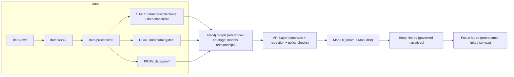

# Kansas Frontier Matrix (KFM) — `.github/` Governance Automation

This directory contains **GitHub-native governance controls** (CI workflows + contribution templates) that help enforce KFM’s core invariants:

- **Evidence-first**: no narrative, dataset, or AI output ships without provenance.
- **Contract-first**: schemas and API contracts are treated as first-class artifacts.
- **Trust membrane**: clients do not access databases directly; all access is mediated by the governed API layer.

> [!NOTE]
> This README explains **what `.github/` is responsible for** (automation + contribution UX).
> For platform architecture + the canonical pipeline, start with:
> - `../docs/MASTER_GUIDE_v13.md`
> - `../docs/architecture/`

---

## What “governed” means (as enforced through GitHub)

KFM is a pipeline–catalog–database–API–UI system where **every stage emits boundary artifacts** and **every merge is gated by validation**.

### Non‑negotiable invariants

1. **Canonical pipeline order**  
   Raw → Processed → Catalog/PROV → Database → API → UI  
   (Shortcuts are treated as design defects unless explicitly justified and reviewed.)

2. **Trust membrane (no bypass paths)**  
   - UI/external clients never connect directly to PostGIS/Neo4j.
   - Backend business logic never bypasses repository interfaces to talk directly to storage.

3. **Provenance-first publishing**  
   - Datasets are not “published” until required catalog artifacts exist.
   - Story Nodes and Focus Mode outputs must remain provenance-linked.

4. **FAIR + CARE / sovereignty aware**  
   - Sensitive content may require redaction/generalization.
   - Exact locations for protected sites are treated as high-risk.

---

## Pipeline map (mental model)



---

## What CI in `.github/workflows/` should enforce

CI is the automated “governance membrane” that blocks merges when a change violates KFM rules.

> [!IMPORTANT]
> Workflow filenames differ by repo, but the **gates below** should exist in some form.
> Check `.github/workflows/` for the authoritative job names.

### CI gate checklist

| Gate | What it checks | Why it matters | Typical fix |
|---|---|---|---|
| **Code quality** | unit/integration tests; type checks; lint | prevents regressions and drift from contracts | fix tests/types; update interfaces/adapters |
| **Docs governance** | markdown lint; required template sections; link checks; accessibility checks | keeps docs machine-ingestible and UI-safe | fix headings/sections; repair links; add alt text |
| **Dataset governance** | schema validation; “no null geometries”; value ranges; required metadata present | ensures datasets “build clean” like code | fix pipeline output; add missing metadata |
| **Policy-as-code** | OPA/Rego checks (via Conftest or equivalent) for sensitivity/license/citation rules | blocks policy violations before merge | add licenses/tags; redact restricted info |
| **Story Nodes** | Template v3 compliance; **every factual claim cited** | prevents unsourced narratives | add citations; split fact vs interpretation |
| **Focus Mode / AI** | AI outputs must include citations and respect sensitivity rules | prevents “freeform” or leaking responses | add/repair citations; reduce/aggregate sensitive data |
| **Security hygiene** | secret scan; dependency alerts (if enabled) | prevents credential leaks | remove secrets; rotate keys; use env vars |

---

## Local pre-flight checklist (before opening a PR)

If you can reproduce CI locally, your PR review becomes faster and more deterministic.

- [ ] Run local checks (when configured), e.g.:
  ```bash
  pre-commit run --all-files
  ```
- [ ] Run backend tests (service name varies by repo):
  ```bash
  pytest
  ```
- [ ] Run frontend checks (if applicable):
  ```bash
  npm test
  npm run lint
  ```
- [ ] If you touched docs:
  - [ ] verify links resolve
  - [ ] verify template-required sections exist
  - [ ] verify alt text and heading hierarchy
- [ ] If you added/changed data:
  - [ ] ensure correct staging (`raw → work → processed`)
  - [ ] ensure boundary artifacts exist (STAC + DCAT + PROV)
  - [ ] ensure policy checks pass (sensitivity/license/citations)

> [!TIP]
> Treat datasets and Story Nodes as **build artifacts**: if they don’t validate, they don’t ship.

---

## Story Nodes & Focus Mode rules (what CI must protect)

### Story Nodes (governed narrative artifacts)

Story Nodes are treated as **structured, machine-ingestible narrative datasets**:

- every factual statement is traceable to evidence,
- key entities reference stable identifiers,
- fact vs interpretation is clearly separated.

### Focus Mode (hard gate)

Focus Mode is a provenance-only experience:

- **Only provenance-linked content appears**
- AI contributions must be **opt-in** and **clearly labeled**
- sensitive locations are **generalized or omitted** to prevent side-channel leaks

> [!WARNING]
> If your change could reveal sensitive locations or culturally restricted knowledge:
> - redact/generalize in data + narrative
> - flag for governance review
> - do not “work around” policy gates

---

## Where the rules live (repo pointers)

The `.github/` automation exists to enforce rules defined elsewhere:

- Master guide + canonical pipeline: `../docs/MASTER_GUIDE_v13.md`
- Templates:
  - `../docs/templates/TEMPLATE__KFM_UNIVERSAL_DOC.md`
  - `../docs/templates/TEMPLATE__STORY_NODE_V3.md`
  - `../docs/templates/TEMPLATE__API_CONTRACT_EXTENSION.md`
- Standards/profiles:
  - `../docs/standards/` (STAC/DCAT/PROV + markdown work protocol)
- Policy-as-code (if present): `../policy/` (OPA/Rego)

---

## Typical contents of `.github/`

<details>
<summary>Expand to see common files you may find here</summary>

- `.github/workflows/`  
  GitHub Actions pipelines (CI gates described above)
- `.github/ISSUE_TEMPLATE/`  
  Structured issue intake (bug reports, data requests, story proposals)
- `PULL_REQUEST_TEMPLATE.md`  
  The “governance membrane” checklist for reviewers and contributors
- `CODEOWNERS`  
  Routing for required reviews (docs, data, policy, API, UI)
</details>

---

## Version history

| Version | Date | Summary | Author |
|---:|---|---|---|
| v0.1.0 | 2026-02-09 | Initial `.github/README.md` aligned to v13 governance | (fill in) |