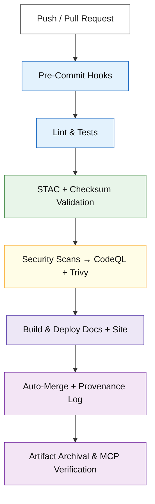
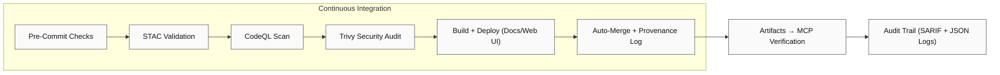

<div align="center">

# ⚙️ Kansas Frontier Matrix — GitHub Automation & Governance

**Path:** `.github/`

**Mission:** Central **automation + governance hub** for the Kansas Frontier Matrix (KFM) — enforcing
**reproducibility**, **security**, **provenance**, **versioning**, and **MCP compliance** across all code, data, and docs.

[](../.github/workflows/site.yml)
[](../.github/workflows/stac-validate.yml)
[](../.github/workflows/codeql.yml)
[](../.github/workflows/trivy.yml)
[](https://pre-commit.com/)
[](../docs/)
[](../LICENSE)

</div>

---

```yaml
---
title: "KFM • .github — Automation & Governance"
version: "v1.5.0"
last_updated: "2025-10-10"
owners: ["@bartytime4life", "@kfm-architecture", "@kfm-security"]
status: "Stable"
maturity: "Production"
tags: ["ci", "cd", "governance", "security", "mcp", "stac", "provenance", "versioning"]
license: "MIT"
---
```

---

## 🧭 Overview

`.github/` defines **how** KFM automates, validates, governs, versions, and secures its lifecycle using
**GitHub Actions**, **branch protections**, **pre-commit**, and **MCP** standards.
Automation guarantees the repo is: ✅ **Deterministic** 🔍 **Traceable** 🔐 **Secure** 🧾 **Auditable** 🧮 **MCP-Verified**

Every commit, workflow, dataset, and artifact becomes part of the **verifiable chain of reproducibility**.

---

## 🧱 Directory Layout

```bash
.github/
├── workflows/
│   ├── site.yml               # Build & deploy docs and site (GitHub Pages)
│   ├── stac-validate.yml      # Validate STAC collections/items & JSON Schemas
│   ├── codeql.yml             # Static analysis for Python/JS
│   ├── trivy.yml              # Container vulnerability scans (CVE reports)
│   ├── pre-commit.yml         # Linting + style enforcement + tests
│   └── auto-merge.yml         # Automatically merge passing PRs (policy-bound)
│
├── ISSUE_TEMPLATE/
│   ├── bug_report.md          # Structured bug report (logs + env info)
│   ├── feature_request.md     # Enhancement proposals
│   └── data_request.md        # Dataset addition/change request
│
├── PULL_REQUEST_TEMPLATE.md   # MCP-aligned PR checklist (reproducibility, provenance)
├── FUNDING.yml                # Funding + sponsor links
├── CODEOWNERS                 # Review routing and ownership (enforced by branch rules)
├── GOVERNANCE.md              # Roles, responsibilities, decision model
└── SECURITY.md                # Security policy, disclosure, rotation & hardening
```

> **Pinning Policy:** All Actions are **pinned** by version or commit SHA (no `@latest`) for deterministic runs.

---

## ⚙️ Core Workflows

| Workflow            | Purpose                                       | Trigger        | Output                     |
| ------------------- | --------------------------------------------- | -------------- | -------------------------- |
| `site.yml`          | Builds & deploys documentation + site         | push → `main`  | `_site/` → GitHub Pages    |
| `stac-validate.yml` | Validates STAC catalogs + checksums + schemas | push, PR       | `stac-report.json`         |
| `codeql.yml`        | Static analysis (security audit)              | schedule, push | CodeQL Dashboard           |
| `trivy.yml`         | CVE scans for images/deps                     | push, PR       | SARIF vulnerability report |
| `pre-commit.yml`    | Lint/format/tests/spellcheck                  | pull_request   | Pre-commit log             |
| `auto-merge.yml`    | Policy-gated auto-merge                       | checks success | Merged PR + audit trail    |

---

## 🧩 CI/CD Flow Visualization



---

## 🧮 MCP Compliance Matrix

| MCP Principle         | Implementation in `.github/`                              |
| --------------------- | --------------------------------------------------------- |
| Documentation-First   | Inline workflow docs + version tags + CHANGELOG entries   |
| Reproducibility       | Pinned actions + deterministic build matrices             |
| Provenance            | SHA-256 checksums + STAC validation & reports             |
| Auditability          | CI logs, SARIF, artifacts retained (≥ 90 days)            |
| Open Standards        | YAML, JSON Schema, STAC 1.0.x used universally            |
| Security Transparency | CodeQL & Trivy SARIF attached to runs + release bundles   |
| Accessibility         | Actions status/logs publicly visible (non-secret outputs) |

---

## 🧾 Issue & Pull Request Governance

### ✅ Pull Request Checklist (enforced by template / status checks)

* [x] Documentation updated and linked
* [x] STAC + checksum validation passed
* [x] CodeQL & Trivy scans clear (no new High/Critical)
* [x] Unit + integration tests passed
* [x] Reproducible steps (commands/env) included
* [x] Provenance metadata (sources, licenses) attached

### 🧩 Issue Templates

| Template               | Purpose                                              |
| ---------------------- | ---------------------------------------------------- |
| 🐞 **Bug Report**      | Repro errors w/ environment, logs, and screenshots   |
| 💡 **Feature Request** | Proposal w/ rationale, acceptance criteria, UX notes |
| 🗺️ **Data Request**   | Dataset + license + STAC metadata + validation scope |

---

## 🔒 Security & Maintenance Policy

| Focus Area             | Policy / Action                                                   |
| ---------------------- | ----------------------------------------------------------------- |
| **Secrets**            | GitHub → Settings → Secrets (Actions only; least-privilege)       |
| **Weekly Scans**       | CodeQL + Trivy every Sunday (cron)                                |
| **Peer Review**        | **2 approvals** required for workflow / security changes          |
| **Branch Rules**       | Signed commits + required checks + linear history                 |
| **Dependencies**       | Monthly automated updates via Dependabot + lockfile refresh       |
| **Audit Retention**    | Logs, SARIF, STAC reports kept **≥ 90 days**                      |
| **Secret Rotation**    | Quarterly rotation; emergency rotation within 24h of exposure     |
| **Permissions Bound.** | Actions run with `read` by default; `write` via explicit job only |

> **Zero-Trust:** No external repo or secret access unless explicitly defined & reviewed.

---

## 🌿 Versioning & Release Management

**Repository Release SemVer:** `vMAJOR.MINOR.PATCH`
**Workflows SemVer Header:** each `*.yml` declares `x-kfm-version: vX.Y` (comment header)
**Datasets:** version stored in STAC (`properties.version`) + CHANGELOG in dataset README
**Models:** version + training manifest in `docs/model_card.md`
**Tags & DOI:** Releases are tagged and mirrored to Zenodo for a citable DOI

### Release Flow

```text
feature/* → PR → main
          → tag vX.Y.Z → GitHub Release → Archive artifacts (STAC report, SARIF, site bundle)
```

**Backports:** Patch-only cherry-picks to `release/*` branches require approval by Security + Maintainers.

---

## 🌳 Branching Strategy & Protections

* **main**: protected; production; squash merges; signed commits; all checks required
* **release/***: backport patch-lines for supported versions
* **feature/***: short-lived, rebased on latest `main` prior to merge

**Required Checks:** pre-commit, tests, CodeQL, Trivy, STAC validate, pages build (if doc changes)

---

## 👥 Roles & CODEOWNERS

### CODEOWNERS (excerpt)

```txt
# Core ownership
*                                 @kfm-maintainers

# Security-sensitive areas
.github/workflows/*               @kfm-security @kfm-architecture
tools/containers/*                @kfm-security

# Data catalogs & STAC
data/stac/**                      @kfm-data @kfm-architecture
data/sources/**                   @kfm-data

# Web UI
web/**                            @kfm-web

# ETL/AI/ML
src/**                            @kfm-data @kfm-ml
```

> Ownership + 2-review policy enforced for security and workflow folders.

---

## 🧠 Maintainer Guidelines

1. **Modular Workflows** — One purpose per YAML; small, composable jobs
2. **Document Everything** — Comment blocks + version header + link to issue/PR
3. **Pin Versions** — No `@latest`; use tagged versions or SHAs
4. **Fail Fast** — Clear exit codes, human-readable warnings, minimal noise
5. **Test Locally** — `act` or `gh workflow run` prior to merge
6. **Cache Wisely** — `actions/cache@v3` with precise keys; purge stale caches monthly
7. **Regular Audits** — Monthly review of secrets, permissions, and job run-times

---

## 🧭 Workflow Dependency Graph



---

## 💻 CLI Utilities

```bash
# 🔍 Run pre-commit checks
pre-commit install
pre-commit run --all-files

# 🧪 Trigger a workflow manually
gh workflow run site.yml

# 📜 List latest workflow runs
gh run list

# 🧾 Download artifact from last run
gh run download --name "stac-report.json"
```

---

## 📜 Example Policy Stubs

**GOVERNANCE.md (excerpt)**

```markdown
# Governance
## Roles
- Maintainers: roadmap, releases, final reviews
- Security: secret rotation, CVE triage, workflow approvals
- Data Stewards: STAC schema, dataset provenance
## Decisions
- Lazy consensus in issues/PRs; escalate to Maintainers for tie-break
## Meetings
- Monthly triage; quarterly roadmap review
```

**SECURITY.md (excerpt)**

```markdown
# Security Policy
- Report vulnerabilities to security@kfm.org (PGP key in repo)
- SLA: triage 48h, fix plan 7d, patch release 14d (severity-dependent)
- Secret Rotation: quarterly; immediate upon suspected compromise
```

**PULL_REQUEST_TEMPLATE.md (excerpt)**

```markdown
### Summary
- [ ] Docs updated
- [ ] STAC & checksums pass
- [ ] Tests pass
- [ ] CodeQL/Trivy clean
- [ ] Provenance & license included
- [ ] Repro steps (commands/env)
```

---

## 🕓 Version History

| Version | Date       | Summary                                                           |
| ------- | ---------- | ----------------------------------------------------------------- |
| v1.5.0  | 2025-10-10 | Added versioning, release flow, CODEOWNERS, governance & security |
| v1.4.0  | 2025-10-09 | Dependency graph, CLI examples, and badges                        |
| v1.3.0  | 2025-10-08 | Enhanced MCP matrix + STAC reporting                              |
| v1.2.0  | 2025-10-07 | Added security policy & auto-merge                                |
| v1.1.0  | 2025-10-06 | Workflow documentation & diagrams                                 |
| v1.0.0  | 2025-10-04 | Initial CI/CD governance structure                                |

---

<div align="center">

### ⚙️ Kansas Frontier Matrix — Automation with Integrity

“.github/” orchestrates **reproducibility, verification, versioning, and governance**
throughout every dataset, pipeline, and artifact — the **heartbeat of MCP**.

🧭 Every workflow · Every commit · Every result — **Proven, versioned, and reproducible.**

</div>
