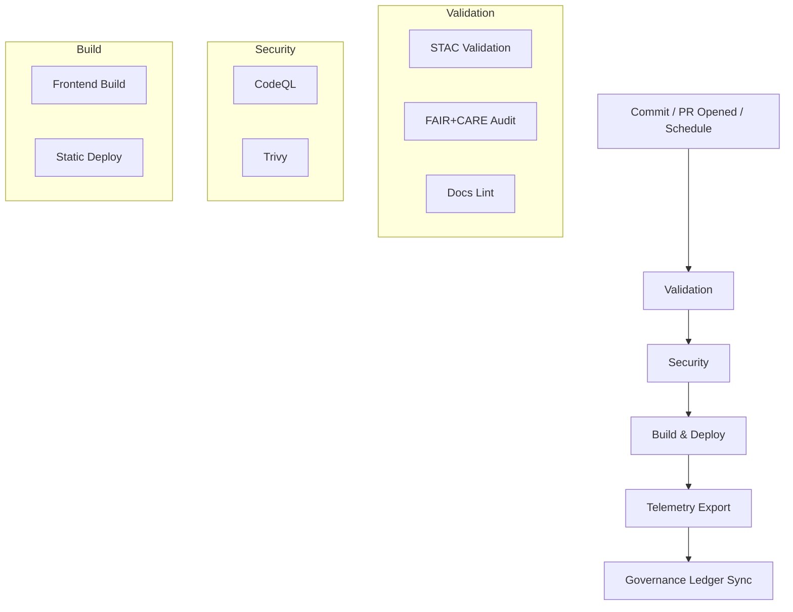

<div align="center">

# 🧩 **Kansas Frontier Matrix — GitHub Configuration & Automation Overview**  
`.github/README.md`

**Purpose:** Summarize repository-level **automation, governance, validation, and security** — workflows, issue forms, PR gates, telemetry — that guarantee **MCP-DL v6.3** reproducibility and **FAIR+CARE** data ethics across the Kansas Frontier Matrix (KFM).

[](../docs/README.md)
[](../LICENSE)
[](../docs/standards/faircare.md)
[]()

</div>

---

## 📘 Overview

The `.github/` directory codifies **CI/CD**, **security posture**, and **governance**.  
GitHub Actions validate **datasets (STAC/DCAT)**, **documentation (Markdown/YAML/JSON)**, **ethics (FAIR+CARE)**, and **security (CodeQL/Trivy)**, then export **telemetry** for dashboards.  
All runs are **artifacted, checksummed, and ledgered**; SBOM and release **manifests** bind outputs to commits for long-term provenance.

---

## 🗂️ Directory Layout

```plaintext
.github/
├── ARCHITECTURE.md                 # CI/CD architecture & governance mapping
├── README.md                       # This file
│
├── workflows/                      # Automated pipelines
│   ├── stac-validate.yml           # STAC validation (Items/Collections)
│   ├── faircare-validate.yml       # FAIR+CARE + data contracts
│   ├── docs-lint.yml               # Markdown/YAML/JSON lint & schema check
│   ├── codeql.yml                  # Static analysis (security)
│   ├── trivy.yml                   # Container & dependency CVE scanning
│   ├── build-and-deploy.yml        # Frontend build + deploy
│   ├── stac-dcat-bridge.yml        # STAC ↔ DCAT synchronization
│   ├── telemetry-export.yml        # Telemetry aggregation
│   └── ai-model-audit.yml          # AI model FAIR+CARE audit (bias/drift)
│
├── ISSUE_TEMPLATE/                 # Community & governance forms
│   ├── data_submission.yml         # New dataset / STAC item
│   ├── feature_request.yml         # Feature proposal
│   ├── bug_report.yml              # Reproducible defect report
│   └── governance_form.yml         # FAIR+CARE / ethics review
│
├── pull_request_template.md        # Required PR format & checks
├── dependabot.yml                  # Dependency updates
├── SECURITY.md                     # Vulnerability disclosure policy
└── FUNDING.yml                     # Optional sponsorship
```

---

## 🔁 Continuous Integration (CI)

Every PR runs **Validation → Security → Build**; any failure **blocks merge**.

| Stage | Workflow(s) | Enforces | Primary Artifacts |
|---|---|---|---|
| Data Validation | `stac-validate.yml` | STAC 1.0.0 structure, links, schema | `reports/self-validation/stac/summary.json` |
| FAIR+CARE Audit | `faircare-validate.yml` | License, provenance, checksum, CARE flags | `reports/fair/faircare_summary.json` |
| Docs Lint | `docs-lint.yml` | YAML front-matter, headings, links, tables, width | `reports/self-validation/docs/lint_summary.json` |
| Security | `codeql.yml` / `trivy.yml` | CodeQL SARIF; CVE scan **fail on CRITICAL** | `reports/security/codeql/*`, `reports/security/trivy/*.json` |
| AI Audit | `ai-model-audit.yml` | Bias, drift, model metadata completeness | `reports/audit/ai_model_faircare.json` |
| Build | `build-and-deploy.yml` | Frontend build success + artifact list | `docs/reports/telemetry/build_metrics.json` |

All results are summarized in `releases/v10.0.0/focus-telemetry.json`.

---

## 🚀 Continuous Deployment (CD)

When validations pass:
1. **Frontend Build** (Node)  
2. **Static Deploy** (e.g., GitHub Pages)  
3. **Telemetry Export** → `releases/v10.0.0/focus-telemetry.json`  
4. **Provenance Bind** → `releases/v10.0.0/manifest.zip`, `sbom.spdx.json`

> API docs are served by FastAPI (`/docs`); the web client builds from `web/`.

---

## ⚙️ Workflow → Artifact Mapping

| Workflow | Outputs | Report Location |
|---|---|---|
| `stac-validate.yml` | `_summary.json`, NDJSON logs | `reports/self-validation/stac/` |
| `faircare-validate.yml` | `faircare_summary.json`, NDJSON | `reports/fair/` |
| `docs-lint.yml` | `lint_summary.json`, violations NDJSON | `reports/self-validation/docs/` |
| `codeql.yml` | SARIF results | `reports/security/codeql/` |
| `trivy.yml` | CVE JSON | `reports/security/trivy/` |
| `build-and-deploy.yml` | Build metrics, artifact manifest | `docs/reports/telemetry/build_metrics.json` |
| `stac-dcat-bridge.yml` | `metadata-bridge.meta.json` | `releases/*/` |
| `telemetry-export.yml` | Aggregated snapshot | `releases/v10.0.0/focus-telemetry.json` |
| `ai-model-audit.yml` | AI fairness/drift report | `reports/audit/ai_model_faircare.json` |

---

## 🧮 CI/CD Automation Flow



---

## 🧠 Governance & Ethics Integration

Automation enforces and documents **FAIR+CARE**, **MCP-DL**, **ISO**, and **SLSA**:

| Layer | Standard | Enforcement |
|---|---|---|
| FAIR | Findable/Accessible/Interoperable/Reusable | `stac-validate.yml` + catalog checks |
| CARE | Council review for sensitive content | `governance_form.yml` + PR gates |
| MCP-DL | Docs-as-code, telemetry, provenance | `docs-lint.yml` + `telemetry-export.yml` |
| ISO 50001 | Energy + sustainability tracking | Telemetry export & reports |
| SLSA / SBOM | Supply chain provenance & attestation | `sbom.spdx.json` + `manifest.zip` |

**Ledgers (immutable):**  
`docs/reports/audit/{governance-ledger.json, github-workflows-ledger.json, ai_models.json, release-manifest-log.json}`

---

## 🔒 Security Posture

| Control | Mechanism | Policy |
|---|---|---|
| Static Analysis | CodeQL | Scheduled + push; report SARIF |
| CVE Scanning | Trivy | **Fail on CRITICAL** |
| Dependencies | Dependabot | Weekly PRs with review |
| Branch Protection | GH Rules | 2 reviews + passing CI |
| Secrets | GH Encrypted Secrets | Rotation; no plaintext in repo |

See `.github/SECURITY.md` for full disclosure and patch process.

---

## 📊 Telemetry & Reporting

**Single source of truth:** `releases/v10.0.0/focus-telemetry.json` consolidates:
- Success/failure rates + durations (per workflow)  
- FAIR+CARE compliance scores & counts  
- STAC/DCAT validation metrics  
- Security scan summaries  
- SBOM/manifest refs  
- Commit/author metadata

Dashboards ingest under `docs/reports/telemetry/`.

---

## 🗺️ Cross-References

- [⚙️ CI/CD Architecture](ARCHITECTURE.md)  
- [📘 Documentation Index](../docs/README.md)  
- [🏗️ System Architecture](../src/ARCHITECTURE.md)  
- [🤝 Contributing](../CONTRIBUTING.md)  
- [📑 Markdown Rules](../docs/standards/markdown_rules.md)  
- [⚖️ FAIR+CARE Framework](../docs/standards/faircare.md)

---

## 🕰️ Version History

| Version | Date | Author | Summary |
|---|---|---|---|
| v10.0.0 | 2025-11-08 | A. Barta | Upgraded to v10: added AI model audit workflow, ISO 50001 telemetry enrichment, expanded workflow→artifact mapping, and ledger integration. |
| v9.7.0 | 2025-11-05 | A. Barta | Added workflow matrix, security posture, telemetry linkage, governance references. |
| v9.5.0 | 2025-10-20 | A. Barta | Integrated STAC↔DCAT bridge and FAIR+CARE automation. |
| v9.0.0 | 2025-06-01 | KFM Core Team | Initial automation overview and templates. |

---

<div align="center">

**© 2025 Kansas Frontier Matrix — MIT / CC-BY 4.0**  
Automated under **Master Coder Protocol v6.3** · FAIR+CARE Certified · Diamond⁹ Ω / Crown∞Ω Ultimate Certified  
[Back to Documentation Index](../docs/README.md) · [View CI/CD Architecture](ARCHITECTURE.md)

</div>
