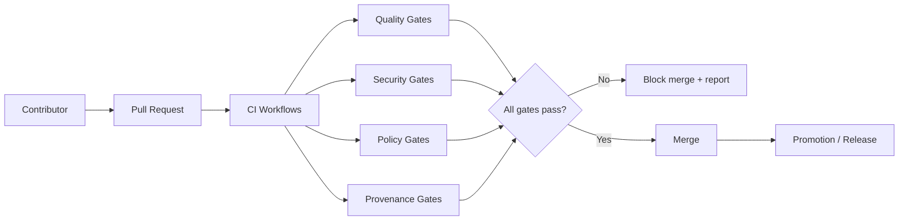
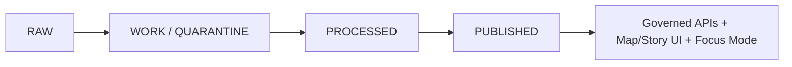
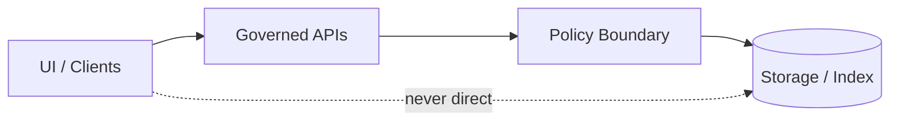

<!-- [KFM_META_BLOCK_V2]
doc_id: kfm://doc/3c0d5c1f-14d4-4b4f-9b2b-9bc3d5c1c7b0
title: .github/README — GitHub Governance & Community Files
type: standard
version: v2
status: draft
owners: kfm-engineering; kfm-governance
created: 2026-02-22
updated: 2026-02-23
policy_label: restricted
related:
  - kfm://doc/kfm-definitive-design-governance-guide-vnext
  - ../README.md
  - ./CONTRIBUTING.md
  - ./SECURITY.md
  - ./CODE_OF_CONDUCT.md
tags:
  - kfm
  - github
  - governance
notes:
  - Badge row uses Shields.io (static) until repo identifiers are wired for dynamic badges.
  - This README is the GitHub-side “trust membrane”: templates + workflows + required checks registry.
[/KFM_META_BLOCK_V2] -->

<a id="top"></a>

# KFM GitHub Operations
Map-first • time-aware • governed delivery — **community files + CI/policy gate index**

**Status:** Draft (vNext) • **Owners:** KFM Engineering + Governance


[Quick start](#quick-start) •
[Scope](#scope) •
[Folder map](#folder-map) •
[Required GitHub settings](#required-github-settings) •
[Workflow inventory](#workflow-inventory) •
[Required checks registry](#required-checks-registry) •
[CI and promotion gates](#ci-and-promotion-gates) •
[Issue and PR templates](#issue-and-pr-templates) •
[Governance and policy](#governance-and-policy) •
[Security](#security-and-responsible-disclosure) •
[Contacts](#contacts-and-owners) •
[Definition of Done](#definition-of-done)

---

## Quick start

- **Filing an issue:** use the templates in `.github/ISSUE_TEMPLATE/` (bug, feature, governance, data/pipeline, story node).
- **Opening a PR:** follow `CONTRIBUTING.md`, keep changes small, and include evidence (links, citations, or artifact hashes).
- **Changing data or policy behavior:** expect CI to **fail-closed** until promotion/metadata/policy gates pass.

> [!NOTE]
> This README is an **index + contract** for the GitHub-side “trust membrane” (workflows, templates, and guardrails).  
> If a link 404s, it means the file hasn’t been created in this repo yet.

---

## Scope

**This README *is*:**
- an index of the repo’s **community health files** (CONTRIBUTING, CODE_OF_CONDUCT, SECURITY, templates)
- an index of **governance & promotion gates** enforced by CI
- a **registry of required status checks** that branch protection should enforce

**This README is *not*:**
- product documentation (see the repo root `README.md` and `/docs`)
- a replacement for policy source of truth (see governance docs linked in the MetaBlock)

> [!WARNING]
> Do not “fix” failing gates by weakening them. Fix the underlying metadata, provenance, tests, or redaction.

---

## Folder map

Recommended (minimum) structure for `.github/`:

```text
.github/                                           # Repo governance + CI (gatehouse)
├─ README.md                                       # This file: how governance/CI is organized + where to start
├─ CODEOWNERS                                      # REQUIRED: ownership + review routing (policy/, contracts/, data/, docs/)
├─ CODE_OF_CONDUCT.md                              # REQUIRED (public): community standards + enforcement scope
├─ CONTRIBUTING.md                                 # REQUIRED: contribution workflow (branches, reviews, checks, style)
├─ SECURITY.md                                     # REQUIRED: vuln reporting process + disclosure policy
├─ PULL_REQUEST_TEMPLATE.md                        # Recommended: PR checklist (tests, policy, catalogs, receipts)
│
├─ ISSUE_TEMPLATE/                                 # Recommended: issue forms (triage + governance discipline)
│  ├─ bug_report.yml                               # Bug report intake (repro, logs, expected/actual)
│  ├─ feature_request.yml                          # Feature request intake (scope, rationale, acceptance criteria)
│  ├─ governance_request.yml                       # Governance changes (policy labels, standards, review gates)
│  ├─ data_pipeline_change.yml                     # Pipeline changes (inputs/outputs, validation, promotion impact)
│  └─ story_node.yml                               # Story Node intake (citations, assets, review requirements)
│
├─ SUPPORT.md                                      # Optional: where/how to get help (channels, office hours, links)
├─ FUNDING.yml                                     # Optional: Sponsors/funding links (if applicable)
├─ dependabot.yml                                  # Optional: dependency update policy (minimal + governed if enabled)
│
└─ workflows/                                      # REQUIRED: CI + policy gates + release gates
   ├─ ci.yml                                       # Core CI (lint, unit tests, build, linkcheck)
   ├─ policy-gates.yml                             # OPA/Conftest policy checks (fail-closed)
   ├─ provenance-audit.yml                          # Provenance/receipts/audit verification (promotion contract checks)
   └─ release.yml                                  # Release pipeline (versioning, checksums, catalogs, attestations)
```

### What belongs here vs elsewhere

- Put **repository-wide defaults** here: templates, owner routing, CI policy gates, security policy.
- Put **product docs** in `/docs` (or the repo root `README.md`).
- Put **data schemas / contracts** in their owning package/module (then referenced by CI).

### CODEOWNERS expectations

`CODEOWNERS` is the router for required reviews. Minimum expectation:

- governance-sensitive files route to **kfm-governance**
- build/runtime code routes to **kfm-engineering**
- data promotion artifacts route to **both** (default-deny if unclear)

Example (replace with repo-real paths):

```text
# Global default
* @kfm-engineering

# Governance & trust membrane
.github/* @kfm-engineering @kfm-governance
/docs/governance/** @kfm-governance
/policy/** @kfm-governance

# Data + pipelines (example)
data/** @kfm-engineering @kfm-governance
pipelines/** @kfm-engineering @kfm-governance
```

> [!TIP]
> Keep CODEOWNERS patterns boring. Prefer directories over fragile filename rules.

---

## Required GitHub settings

These settings must align with the workflows and required checks below.

### Branch protection baseline

Recommended for the default branch:

- Require PRs (no direct pushes)
- Require approvals (at least 1; increase for sensitive repos)
- Require CODEOWNERS review
- Require status checks to pass (see **Required checks registry**)
- Require branches to be up to date before merging (optional; depends on team cadence)
- Restrict who can push to the default branch (recommended)

> [!WARNING]
> If branch protection requires a check that no longer exists, merges can become permanently blocked.
> If a workflow is renamed, update branch protection *in the same PR*.

### Security feature baseline

Enable (where available for the repo visibility/tier):

- secret scanning (and push protection, if available)
- dependency alerts and (optionally) dependency updates (Dependabot)
- code scanning / SAST (or a documented substitute)

---

## Workflow inventory

This section documents the *intended* responsibilities of each workflow file.

| Workflow file | Purpose | Fail-closed expectation | Typical outputs (examples) |
|---|---|---|---|
| `.github/workflows/ci.yml` | Build/test/lint/typecheck for code and docs | PR cannot merge if checks fail or do not run | test reports, build artifacts, lint summaries |
| `.github/workflows/policy-gates.yml` | Policy label checks, redaction checks, Story Node claim hygiene | PR blocked if policy/sensitivity is unclear | policy decision log, redaction scan report |
| `.github/workflows/provenance-audit.yml` | Provenance + checksums + promotion eligibility verification | Promotion blocked if audit is incomplete | audit record (who/what/when/why), checksums |
| `.github/workflows/release.yml` | Release/promotion orchestration (tagging, packaging, publish) | No RAW→Published jumps; gates must pass | release manifest, SBOM (if applicable), publish logs |

> [!NOTE]
> The table above is a **contract**. If you add a workflow, add it here. If you remove/rename a workflow, update this table and branch protection in the same PR.

---

## Required checks registry

Branch protection should require a stable set of status checks that correspond to the gate categories below.

> [!IMPORTANT]
> **Check names are repo-specific.** Replace the placeholders with the *actual* status check names emitted by your workflows (as shown in a PR “Checks” tab).

| Gate category | Required check name (placeholder) | Source workflow | Notes |
|---|---|---|---|
| Quality | `ci / build-test` | `ci.yml` | unit/integration tests |
| Quality | `ci / lint` | `ci.yml` | formatting + lint |
| Quality | `ci / typecheck` | `ci.yml` | TypeScript/typed builds |
| Docs | `ci / docs` | `ci.yml` | docs build + link check |
| Security | `security / secret-scan` | `ci.yml` or `policy-gates.yml` | fail on leaked secrets |
| Security | `security / deps` | `ci.yml` | dependency scan + lockfile integrity |
| Governance | `policy / labels` | `policy-gates.yml` | policy labels present + valid |
| Governance | `policy / redaction` | `policy-gates.yml` | redaction / sensitive location checks |
| Governance | `policy / story-node` | `policy-gates.yml` | claim hygiene + evidence bundle refs |
| Provenance | `provenance / audit` | `provenance-audit.yml` | audit record + checksums |
| Release | `release / manifest` | `release.yml` | only required on release branches/tags |

---

## CI and promotion gates

KFM uses “fail closed” gates to protect integrity, provenance, and policy obligations.



### Gate categories

**Quality**
- formatting/lint
- unit/integration tests
- typed builds (TypeScript) where applicable
- docs build / link checks where applicable

**Security**
- dependency scanning (and lockfile integrity)
- SAST/secret scanning (block leaked credentials)

**Governance**
- **policy label required** on datasets, docs that affect behavior, and Story Nodes
- redaction checks for restricted locations / private persons / vulnerable infrastructure

**Data truth path**
- no promotion to **Published** without metadata + validation + provenance + checksums



> [!WARNING]
> If permissions/sensitivity are unclear, default is **deny** (generalize/redact; require governance review).

### Promotion minimum artifacts

Promotion to **Published** must have, at minimum:

- [ ] metadata (identity, schema, extents, license, sensitivity)
- [ ] validation results (QA checks + thresholds)
- [ ] provenance links (inputs, transforms, tool versions)
- [ ] checksums/content integrity
- [ ] audit record (who/what/when/why + inputs/outputs + sensitivity + policy decisions)

---

## Trust membrane reminder



- UI/clients **must not** talk to storage directly.
- Core/domain logic **must not** bypass repositories to reach storage.
- Policy boundary decisions should be **auditable**.

---

## Issue and PR templates

### Issue templates

Use templates to keep triage consistent:

- **Bug report:** expected vs actual, reproducible steps, logs/artifacts.
- **Feature request:** user story, acceptance criteria, policy impacts.
- **Governance request:** policy label changes, redaction guidance, release criteria.
- **Data/pipeline change:** source/license, schema, validation rules, promotion plan.
- **Story Node:** narrative claim + evidence bundle refs + map footprint + time bounds.

### PR expectations

A PR should include:

- scope: what changed + why
- evidence: links/artifact IDs/checksums (as applicable)
- tests: added/updated, or justification if not possible
- rollback: how to revert safely
- governance: policy labels, redaction notes, approval path

> [!TIP]
> For governance-sensitive PRs, ensure `CODEOWNERS` routes review to both engineering and governance owners.

---

## Governance and policy

These are the non-negotiables enforced through CI + review:

- **Evidence-first UX:** every claim should link back to evidence or be labeled **Unknown**.
- **Trust membrane:** frontends never talk directly to storage; access flows through governed APIs.
- **Promotion contract:** no RAW → Published jumps; each promotion emits an audit record.
- **Default-deny:** when sensitivity is unclear, generalize/redact and request governance review.

If a change touches governance-sensitive areas, tag the PR/issue appropriately and request review from the relevant owners (see `CODEOWNERS`).

---

## Security and responsible disclosure

- Use `SECURITY.md` for reporting vulnerabilities.
- Never post secrets or exploit details in public issues.
- Security fixes should land with tests and clear rollback notes.

---

## Badge maintenance

The badges at the top use **Shields.io** and are intentionally **static** until this repo’s canonical
org/repo identifiers and workflow filenames are finalized.

When ready, swap in dynamic badges (examples):

```md


```

---

## Contacts and owners

- **Engineering owners:** see `CODEOWNERS`
- **Governance owners:** see `CODEOWNERS`
- **Security contact:** see `SECURITY.md`

---

## Definition of Done

### Content & structure

- [ ] Badges render and reflect reality (or are clearly marked “static”)
- [ ] At least one Mermaid diagram renders
- [ ] Directory tree is present and matches current structure
- [ ] Templates exist for the main work types (bug/feature/governance/data/story)
- [ ] Links are relative and lintable (no broken internal links)

### Governance & enforcement

- [ ] CI workflows enforce fail-closed promotion/policy gates
- [ ] Required checks registry matches actual check names used by branch protection
- [ ] Policy labels + redaction defaults are stated (default-deny if unclear)
- [ ] Workflow inventory is kept current when workflows change
- [ ] Branch protection updated whenever workflow/check names change

---

[Back to top](#top)
