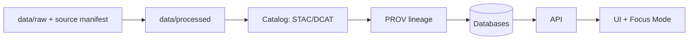

# .github — Governance & Automation for Kansas Frontier Matrix (KFM)


> [!IMPORTANT]
> This folder is the **repo-level control plane** for KFM: contribution safety, CI gates, and policy enforcement live here.
> If a change bypasses these controls, it conflicts with KFM’s “evidence-first” and “fail-closed” design goals.

> [!NOTE]
> Some files listed below may be **TBD** in your current repo snapshot. This README defines the **intended baseline** so the repo can converge on a consistent, auditable governance posture.

---

## 📘 Overview

### Purpose
KFM is designed as a governed geospatial/historical knowledge system where:
- **User-visible content is evidence-backed** (datasets, narratives, and AI answers carry provenance/citations).
- **Governance is enforced by default** (missing metadata, missing provenance, or failing checks should block merges/releases).

This `.github/` directory hosts the operational guardrails that implement that posture: PR requirements, CI workflows, security policy, and review routing.

### Scope

| In scope | Out of scope |
|---|---|
| Pull Request / Issue workflow and templates | Domain-specific narrative content (see `docs/`) |
| CI/CD workflows & required checks | Runtime infrastructure configuration (handled in infra/deploy layers) |
| Security disclosure + repo hardening policies | Dataset-specific metadata records (see `data/` + `docs/`) |
| CODEOWNERS and path-based review protections | End-user UI documentation (see product docs) |

### Audience
- **Contributors:** understand how to propose changes safely.
- **Reviewers/Maintainers:** apply consistent governance decisions.
- **Security & Data stewards:** verify policy compliance before merge/release.

### Definitions (Repo Ops)
- **Fail-closed:** if required checks/metadata are missing, the change is blocked.
- **Evidence-first:** factual claims (docs, story nodes, AI outputs) must be traceable to sources.
- **Trust membrane:** the UI never talks directly to databases; all access is governed via API.

---

## 🗂️ Directory Layout

### `.github/` (this folder)
The canonical “community health + automation” home.

```text
.github/
  README.md                         # This document
  SECURITY.md                       # Security policy + disclosure process (recommended)
  CODEOWNERS                        # Path-based mandatory review rules (recommended)
  PULL_REQUEST_TEMPLATE.md          # PR checklist aligned to KFM governance (recommended)
  ISSUE_TEMPLATE/                   # Issue intake with metadata fields (recommended)
    bug_report.yml
    feature_request.yml
    data_ingest_request.yml
    story_node_request.yml
  workflows/                        # CI policy enforcement (recommended)
    ci.yml
    docs-validation.yml
    security.yml
    provenance-validation.yml
  dependabot.yml                    # Dependency update automation (recommended)
```

> [!TIP]
> If you add any of the above, make sure **links in docs remain unbroken** and the CI “docs/link checks” pass.

### Related governed content (elsewhere in repo)
KFM documentation is expected to live under `docs/`, with templates and standards in predictable locations:

```text
docs/
  templates/                        # Governed templates (Universal Doc, Story Node v3, API Contract Extension)
  standards/                        # Work protocols (template-first, AI usage, doc validation rules)
  governance/                       # ROOT_GOVERNANCE, ETHICS, SOVEREIGNTY (policy authority)
  reports/<topic>/story_nodes/      # Story Node storage pattern (v13-era convention; align to Master Guide)
```

---

## 🧭 Context

KFM’s project posture is built around:
- **Provenance surfaced to users** (e.g., Focus Mode “Audit” panel + dataset info dialogs show source + transformations).
- **Narratives as governed artifacts** (Story Nodes follow a strict template and carry citations).
- **A governed “truth path” for data** (Raw → Processed → Catalog/PROV → Database → API → UI).

KFM’s repo operations should reflect those design commitments—CI and reviews are not “nice to have”; they are part of the product contract.

---

## 🗺️ Diagrams

### Trust membrane (high level)

```mermaid
flowchart LR
  U[User] --> UI[Web UI (React/MapLibre)]
  UI --> API[Governed API Layer]
  API --> PG[(PostGIS)]
  API --> G[(Graph Store)]
  API --> S[(Search/Index)]
  API --> C[(Catalog/Metadata)]
```

### Contribution + governance flow

```mermaid
flowchart TD
  A[Contributor] --> B[Issue / Proposal]
  B --> C[PR w/ Template + Checklists]
  C --> D[CI Gates: lint/tests/security/docs/provenance]
  D -->|pass| E[CODEOWNERS Review + Governance Review if needed]
  D -->|fail| F[Block merge (fail-closed)]
  E --> G[Merge]
  G --> H[Release / Deploy Workflow (if configured)]
```

### Data “truth path” (pipeline contract)



---

## 📦 Data & Metadata

This section defines the **minimum metadata** expected in GitHub artifacts so KFM can remain auditable.

### Issues: required metadata fields (recommended)
If you create issue templates, include fields like:

- **Change type:** code | data | docs | story node | policy
- **Risk level:** low | medium | high
- **Provenance impact:** none | adds lineage | modifies lineage
- **Sensitivity:** public | internal | restricted
- **Requested reviewers:** (suggested owners / stewards)

### Pull Requests: required checklist (recommended)
PRs should declare *what* changed and *how* it stays governed.

**PR must include:**
- [ ] Scope: which layers/areas changed (Domain / Service / Interface / Infra / Docs / Data)
- [ ] Tests: unit/integration/contract tests added/updated as applicable
- [ ] Provenance: datasets/docs/story nodes include citations / lineage artifacts as needed
- [ ] Security: no secrets committed; workflows follow least privilege
- [ ] Sensitivity: no restricted locations or personal data exposed; governance review requested if unsure

> [!NOTE]
> For KFM, documentation and story content are not “non-code.” They are governed outputs and must be reviewable and traceable.

### Dataset ingest PRs (minimum expectations)
When adding a dataset, KFM’s governance model expects:
- Raw files stored as immutable snapshots under `data/raw/`
- A **source manifest (JSON/YAML)** alongside raw data (source, acquisition date, checksums, license, format)
- CI validation gates that block merge if required fields are missing (fail-closed)

---

## 🌐 STAC, DCAT & PROV Alignment

KFM is designed to use standards-aligned metadata and lineage:
- **STAC** for geospatial items/collections
- **DCAT** for dataset catalog descriptions
- **PROV** for lineage/audit trails (how outputs were produced from inputs)

Repo operations should ensure:
- A dataset does not become UI/API-visible unless its metadata + lineage exist.
- PRs that add/modify datasets also add/modify the relevant catalog/lineage artifacts.

---

## 🧱 Architecture

### Clean layers (enforced by review discipline)
KFM follows a layered separation of concerns:

| Layer | Owns | Must NOT do |
|---|---|---|
| Domain | pure entities/models | depend on DB/UI frameworks |
| Use Case / Service | workflows + business rules | talk directly to storage |
| Integration / Interface | ports/contracts + adapters | bypass interfaces to call DBs |
| Infrastructure | real DB/API/UI implementations | embed business rules meant for services |

### Trust membrane rule (non-negotiable)
- External clients and the frontend **never access databases directly**.
- All access routes through the governed API layer where permissions/provenance/business rules apply.

---

## 🧠 Story Node & Focus Mode Integration

Story Nodes are governed narrative documents:
- Authored in Markdown with a strict structure (Template v3)
- Include citations for substantive claims
- Are version-controlled and validated in CI before becoming “official content”

Focus Mode is designed to:
- Display narrative content + evidence together
- Surface provenance in the UI (audit panel / info dialogs)
- Constrain AI answers to verified data with citations

> [!IMPORTANT]
> If a Story Node step makes a claim, it must have evidence. If the evidence is unclear, mark it as **not confirmed** and request governance review rather than guessing.

---

## 🧪 Validation & CI/CD

### Required gates (baseline)
KFM’s default posture is “fail-closed.” CI should block merges when any required check fails.

**Recommended CI checks:**
- **Code quality:** formatting, lint, typecheck
- **Testing:** unit/integration/contract tests
- **Docs validation:** markdown lint + structure/schema validation + link checks
- **Provenance validation:** required metadata/lineage artifacts exist when datasets are changed
- **Security:** secret scanning, dependency checks, code scanning (SAST), container scanning (if applicable)

### GitHub repository security baseline (recommended)
- Protect `main`/release branches: require PR review + passing CI; block force pushes
- Enable secret scanning (+ push protection if available)
- Enable dependency alerts/updates (e.g., Dependabot) and code scanning (e.g., CodeQL)
- Harden GitHub Actions:
  - least privilege permissions
  - avoid risky triggers on untrusted code
  - pin third-party actions to commit SHAs
- Use CODEOWNERS to require review for sensitive paths (especially `.github/workflows/**`)

### Sensitive paths: recommended CODEOWNERS strategy
Treat these as “high impact” areas:
- `.github/workflows/**` (CI supply chain)
- `data/raw/**` (source-of-truth evidence)
- `data/**/prov/**` (lineage/audit trail)
- `docs/templates/**` and `docs/standards/**` (governance contracts)

> [!TIP]
> If you don’t yet have GitHub teams, start with a small maintainer set and migrate to teams later. Keep owners minimal.

---

## ⚖️ FAIR+CARE & Governance

### Sensitivity posture (safe by default)
KFM may contain culturally sensitive or vulnerable information. Repo operations should:
- Prefer **generalization/redaction** over precise sensitive disclosures
- Require governance review for restricted content
- Avoid publishing precise locations of sacred/vulnerable sites in public-facing docs

### Governance escalation
Use a governance review label (recommended) when:
- Provenance is incomplete
- A dataset license is unclear
- Story content touches sensitive cultural knowledge
- A change alters templates/standards or access policy

---

## 🕰️ Version History

| Version | Date | Summary | Author | Review Notes |
|---:|---|---|---|---|
| v0.1.0 | YYYY-MM-DD | Initial governed `.github/README.md` baseline for KFM repo operations | @TBD | Align with current CI + governance policies |