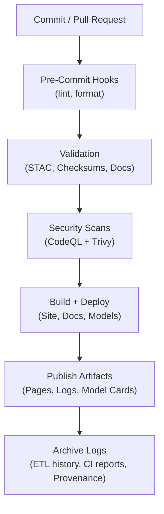
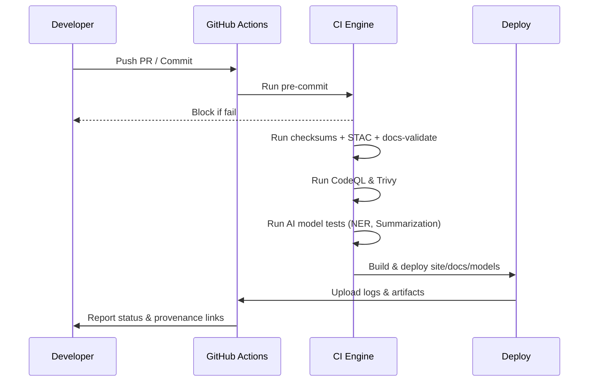

# 🤖 **Kansas Frontier Matrix — Automation & Governance**

`📁 .github/workflows/README.md`

**Mission:** Document and enforce the **GitHub-based automation (CI/CD)** and **project governance** for the Kansas Frontier Matrix (KFM). This ensures all code, data, and documentation changes are **validated**, **auditable**, **secure**, and **aligned with Master Coder Protocol (MCP)**.

---

📚 **Table of Contents**

* [🧰 Overview](#-overview)
* [🔄 CI/CD Workflow Overview](#-cicd-workflow-overview)
* [🗾 Validation Flow (CI Lifecycle)](#-validation-flow-ci-lifecycle)
* [⚙️ Core Workflows](#-core-workflows)
* [🤖 Pipeline Automation Hooks](#-pipeline-automation-hooks)
* [🛡 Governance & Roles](#-governance--roles)
* [🧲 MCP Compliance Matrix](#-mcp-compliance-matrix)
* [🔒 Security & Provenance](#-security--provenance)
* [📦 Advanced Hardening & Supply Chain](#-advanced-hardening--supply-chain)
* [🔁 Dependency & Release Automation](#-dependency--release-automation)
* [🧪 AI Model Governance (Quality & Ethics)](#-ai-model-governance-quality--ethics)
* [🧾 Data Ethics & Cultural Safeguards](#-data-ethics--cultural-safeguards)
* [🧯 Runbooks, Incidents & Retention](#-runbooks-incidents--retention)
* [🤝 Contribution Notes](#-contribution-notes)
* [🗳 Metadata & Provenance](#-metadata--provenance)
* [📂 Related Documentation](#-related-documentation)
* [🗓 Version History](#-version-history)

---

## 🧰 Overview

KFM’s `.github/` directory governs automated workflows, branch security, and contributor practices. It enforces MCP standards by validating every change through **CI checks**, **metadata audits**, **provenance logging**, and **governance policies**.

**Key design goals**

- **Integrity:** All PRs must pass tests, STAC validation, checksums, and review.  
- **Reproducibility:** Makefile + pinned actions + container digests.  
- **Security:** CodeQL, Trivy, and OIDC permissions.  
- **Governance:** CODEOWNERS, PR templates, required reviews.  
- **Auditability:** CI logs, versioned artifacts, changelogs.  
- **Automation:** Integrated DVC/LFS sync, nightly AI model validation, and Markdown linting.

All workflows run in **GitHub Actions** with logs publicly accessible.

---

## 🔄 CI/CD Workflow Overview

> Each push/PR triggers a CI pipeline: **pre-commit → validation → security → build → archive**.

---

## 🗾 Validation Flow (CI Lifecycle)

> PRs to `dev` must pass all CI jobs. Merges to `main` must originate from successful, audited runs.

---

## ⚙️ Core Workflows

| **Workflow**           | **Trigger**         | **Role**                   | **Validation / Task**                    |
|------------------------|---------------------|----------------------------|------------------------------------------|
| `pre-commit.yml`       | PR                  | Lint, format, test         | Black, Ruff, Markdownlint, actionlint    |
| `stac-validate.yml`    | PR, Push            | STAC, JSON Schema          | `stac-validator`, JSON Schema checks     |
| `checksums.yml`        | Data push           | Data integrity             | Compute & compare **SHA-256**            |
| `dvc-sync.yml`         | Data push / Manual  | Data version control       | Sync LFS/DVC pointers + verify checksums |
| `docs-validate.yml`    | PR / Push           | Docs as Code validation    | Markdownlint + link checker + metadata   |
| `ai-model.yml`         | Nightly / Manual    | AI pipeline automation     | Train/test models → update metrics/model cards |
| `external-sync.yml`    | Weekly / Manual     | External API monitor       | Verify NOAA/USGS/FEMA API schema & status|
| `fetch.yml`            | Schedule / Manual   | Data ingestion             | Load remote sources from manifests       |
| `site.yml`             | Merge to `main`     | Build & deploy             | Build docs/site → GitHub Pages           |
| `codeql.yml`           | PR, Schedule        | Static analysis (security) | CodeQL SARIF scan                        |
| `trivy.yml`            | Weekly              | CVE scanner                | Trivy images/dependencies audit          |
| `auto-merge.yml`       | Post-Checks         | PR merge automation        | Auto-merges PRs after required checks    |

---

## 🤖 Pipeline Automation Hooks

Each ETL / AI / data workflow emits CI events to maintain system synchronization and provenance tracking:

- **ETL completion** → triggers `stac-validate.yml`
- **Checksum or DVC changes** → triggers `checksums.yml`
- **AI model training completion** → triggers `ai-model.yml`
- **External API heartbeat (NOAA/USGS/FEMA)** → triggers `external-sync.yml`

All actions publish **provenance JSON** and **hash-stamped logs** to the `artifacts/` directory, archived per run for long-term reproducibility.

---

## 🛡 Governance & Roles

**Branch Strategy**

- `main`: production, protected, release-only  
- `dev`: integration branch for PRs  
- `feature/*`: short-lived development branches

**Protections**

- ✅ Required checks: pre-commit, STAC, docs, tests, security  
- ✅ At least 1 CODEOWNER review  
- ✅ Signed commits  
- ✅ Semantic commit messages (Conventional Commits)

**CODEOWNERS Roles**

| **Team**           | **Responsibilities**                           |
|--------------------|-----------------------------------------------|
| `@kfm-maintainers` | Approve releases, maintain roadmap            |
| `@kfm-security`    | Review CI workflows, secrets, security configs|
| `@kfm-docs`        | Validate all documentation changes            |
| `@kfm-data`        | Approve data pipeline and ETL modifications   |
| `@kfm-ai`          | Maintain AI/ML workflows & model reproducibility |
| `@kfm-web`         | Frontend (MapLibre, timeline, React)          |

> Governance Committee audits documentation quarterly and reviews backlog biweekly.

---

## 🧲 MCP Compliance Matrix

| **MCP Principle**     | **Implementation**                                                    |
|-----------------------|-----------------------------------------------------------------------|
| Documentation-First   | PR templates, code comments, updated READMEs before merge             |
| Reproducibility       | Makefile, pinned versions, deterministic outputs, **SHA-256** logs    |
| Provenance            | Git history, CODEOWNERS, changelogs, DVC metadata, hash-stamped logs  |
| Auditability          | Artifacts logged; STAC/checksum/AI audits weekly; auto-check CI        |
| Open Standards        | YAML, STAC, JSON Schema, DCAT, Markdown, Mermaid                      |
| Security              | CodeQL, Trivy, OIDC, branch protection                                |

---

## 🔒 Security & Provenance

- **Permissions:** Minimal OIDC scopes, no long-lived secrets in workflows  
- **CodeQL:** Static analysis for vulnerabilities (SARIF artifacts)  
- **Trivy:** Image and dependency CVE scanning  
- **Integrity:** **SHA-256** for datasets & artifacts; checksum diffs in PRs  
- **API Audit Logs:** FastAPI endpoints log structured metadata to CI artifacts  
- **Data Versioning:** DVC and LFS pointers validated via `dvc-sync.yml`  
- **Model Lineage:** `ai-model.yml` publishes hashes & evaluation metrics to `docs/model_card.md`  
- **Workflow Hygiene:** Pinned action versions, branch protection, required reviews

---

## 📦 Advanced Hardening & Supply Chain

| Capability      | Tooling / Workflow                   | Outcome |
|-----------------|--------------------------------------|---------|
| SBOM            | `sbom.yml` (Syft) + upload artifact  | Software Bill of Materials attached to each run/release |
| SBOM Scan       | Grype (re-uses Syft SBOM)            | CVE detection on dependency graph                       |
| Provenance      | SLSA attestations (gha-provenance)   | Verifiable build provenance (OIDC signed)               |
| Policy-as-Code  | `policy-check.yml` (OPA/Conftest)    | Block PRs that violate repo/org policies                |
| Secret Scanning | `gitleaks.yml`                       | Prevent leaked secrets; audit trail in artifacts        |
| Action Linting  | `actionlint` in `pre-commit.yml`     | Catch YAML/action misconfigs early                      |

> **Note:** All new workflows must pin actions by version or SHA and run with least-privilege OIDC tokens.

---

## 🔁 Dependency & Release Automation

| Workflow            | Trigger         | Task                                     |
|---------------------|-----------------|------------------------------------------|
| `dependabot.yml`    | Weekly          | Open grouped PRs for deps (code & GHAs)  |
| `renovate` (opt)    | Weekly          | Alternative dependency updater            |
| `release-please.yml`| Merge to `main` | Semantic releases + changelog generation  |

---

## 🧪 AI Model Governance (Quality & Ethics)

| Control                | Enforcement                                      |
|------------------------|--------------------------------------------------|
| Training Data Hashes   | `ai-model.yml` records content hashes + sizes    |
| Quality Gates          | Min F1/ROUGE thresholds before model publish     |
| Bias Checks            | Curated benchmark set; fail gate on regression   |
| Human-in-the-Loop      | `@kfm-ai` approval required to update model card |
| Model Card Sync        | Auto-patch `docs/templates/model_card.md` with metrics & hashes |

---

## 🧾 Data Ethics & Cultural Safeguards

- **Indigenous & sensitive datasets:** CI validates presence of source, scope, usage notes, and any redaction tags in STAC `properties` (e.g., `properties.data_ethics="restricted-derivatives"`).  
- **Public artifact scrubbing:** Large artifacts with restricted layers are excluded from public Pages builds and stored with limited retention.  
- **Ethics logs:** MCP-DL metadata extended with `ethics_review` fields for datasets requiring curation approval.

---

## 🧯 Runbooks, Incidents & Retention

| Topic          | Location / Policy                                                       |
|----------------|-------------------------------------------------------------------------|
| CI Runbook     | `docs/standards/ci-runbook.md` (build, rollback, hotfix)                |
| Incident Flow  | `docs/standards/incident-response.md` + `incident.yml` triage workflow  |
| Retention      | Logs 90d, artifacts 30d, SBOM/provenance 365d (config in each workflow) |

---

## 🤝 Contribution Notes

- Fork off `dev` and submit PRs there.  
- Run `pre-commit` locally before pushing.  
- Write **semantic commits** (`feat:`, `fix:`, `docs:`, `chore:`).  
- All changes must update docs (README or SOPs).  
- Use the PR template: fill in purpose, tests, changelog, dataset refs.

### ✅ PR Checklist

- [ ] CI green (pre-commit, STAC, docs, tests, security)  
- [ ] Docs updated (README/SOP)  
- [ ] Tests written/updated (if applicable)  
- [ ] Reviewed by appropriate CODEOWNERs  
- [ ] Semantic **and** signed commits  
- [ ] Issue/backlog item referenced  

---

## 🗳 Metadata & Provenance

- **Document:** `.github/workflows/README.md`  
- **License:** MIT (code), CC-BY 4.0 (docs)  
- **Maintainers:** `@kfm-docs`, `@kfm-security`, `@kfm-architecture`, `@kfm-ai`  
- **Standards:** MCP-DL v6.3, FAIR Principles  
- **Provenance Files:** CI-produced `.prov.json` & `.sha256` under `/artifacts/`

---

## 📂 Related Documentation

| Path                          | Description                              |
|-------------------------------|------------------------------------------|
| `docs/architecture/ci-cd.md`  | Detailed CI/CD and pipeline design       |
| `docs/architecture/ai-automation.md` | AI automation & model governance  |
| `docs/standards/security.md`  | Security policy & permissions hardening  |
| `docs/standards/markdown_rules.md` | Docs validation schema             |
| `docs/notes/backlog.md`       | Governance-tracked issues & enhancements |
| `.github/CODEOWNERS`          | Review team configuration                |
| `.github/PULL_REQUEST_TEMPLATE.md` | Required PR structure             |
| `.github/ISSUE_TEMPLATE/`     | Issue templates (bug/feature/data/etc.)  |

---

## 🗓 Version History

| Version | Date       | Summary                                                  |
|---------|------------|----------------------------------------------------------|
| v1.4    | 2025-10-18 | Added SBOM, SLSA, Gitleaks, policy-as-code, and ethics  |
| v1.3    | 2025-10-18 | Added AI/DVC/docs automation & API audit integration     |
| v1.2    | 2025-10-18 | Aligned with MCP-DL v6.3; expanded security section      |
| v1.1    | 2025-10-16 | Metadata, ToC, compliance matrix                         |
| v1.0    | 2025-10-04 | Initial governance + CI/CD automation README             |

---

✨ **Kansas Frontier Matrix** — “Automation with Integrity. Validation with Provenance.” ✨  
`.github/workflows/README.md` — The GitHub automation & governance anchor for the project.

