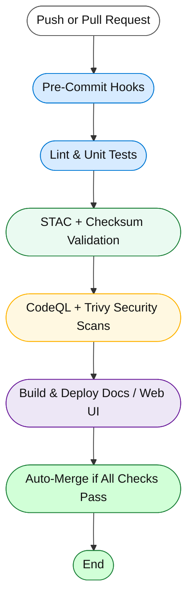

<div align="center">

# ⚙️ Kansas Frontier Matrix — GitHub Automation & Governance

**Path:** `.github/`

**Mission:** Provide a **centralized automation and governance hub**
for the **Kansas Frontier Matrix (KFM)** — ensuring
**reproducibility**, **security**, **provenance**, and **MCP compliance**
across all datasets, pipelines, and documentation.

[](../.github/workflows/site.yml)
[](../.github/workflows/stac-validate.yml)
[](../.github/workflows/codeql.yml)
[](../.github/workflows/trivy.yml)
[](https://pre-commit.com/)
[](../docs/)
[](../LICENSE)

</div>

---

## 🧠 Overview

The `.github/` directory defines how **Kansas Frontier Matrix** automates, validates,
and governs its codebase and datasets using **GitHub Actions**, **pre-commit hooks**,
and **Master Coder Protocol (MCP)** principles.

Automation here ensures the repository is:
✅ Deterministic  🔍 Traceable  🔐 Secure  🧾 Self-documenting  🧮 MCP-Aligned

---

## 🧱 Directory Layout

```bash
.github/
├── workflows/
│   ├── site.yml               # Build & deploy docs and web UI (Pages)
│   ├── stac-validate.yml      # Validate STAC + JSON Schemas
│   ├── codeql.yml             # Static analysis and dependency scanning
│   ├── trivy.yml              # Vulnerability scan (containers & deps)
│   ├── pre-commit.yml         # Linting, formatting, and unit tests
│   └── auto-merge.yml         # Safe PR auto-merge when all checks pass
│
├── ISSUE_TEMPLATE/
│   ├── bug_report.md
│   ├── feature_request.md
│   └── data_request.md
│
├── PULL_REQUEST_TEMPLATE.md   # MCP-compliant PR checklist
└── FUNDING.yml
```

---

## ⚙️ Core Workflows

| Workflow              | Purpose                                        | Trigger              | Primary Output          |
| --------------------- | ---------------------------------------------- | -------------------- | ----------------------- |
| **site.yml**          | Build & deploy documentation and static site   | `push → main`        | `_site/ (GitHub Pages)` |
| **stac-validate.yml** | Validate STAC collections/items & JSON Schemas | `push, pull_request` | `stac-report.json`      |
| **codeql.yml**        | Run CodeQL static analysis for Python code     | `schedule, push`     | CodeQL Dashboard        |
| **trivy.yml**         | Scan containers and dependencies for CVEs      | `push, pull_request` | Trivy SARIF Report      |
| **pre-commit.yml**    | Run linting, formatting, and unit tests        | `pull_request`       | Pre-commit Log          |
| **auto-merge.yml**    | Auto-merge PRs when all checks pass            | `post-check success` | Merged PR               |

> ℹ️ Enable **Allow auto-merge** in repo settings for `auto-merge.yml` to function.

---

## 🧩 CI/CD Flow Diagram



<!-- END OF MERMAID -->

---

## 🧮 MCP Compliance Matrix

| MCP Principle           | Implementation in `.github/`                            |
| ----------------------- | ------------------------------------------------------- |
| **Documentation-First** | Each workflow documented & versioned in PRs             |
| **Reproducibility**     | Deterministic CI/CD with pinned actions & caches        |
| **Provenance**          | STAC + SHA-256 validation linking datasets to artifacts |
| **Auditability**        | CI logs, artifacts, SARIF reports retained              |
| **Open Standards**      | YAML configs, STAC 1.0.x, JSON Schema validation        |

---

## 🧾 Issue & PR Governance

**Pull Request Checklist**

* [x] Documentation updated
* [x] STAC + checksum validation passed
* [x] CodeQL + Trivy scans clean
* [x] All CI workflows succeeded
* [x] MCP reproducibility verified

**Issue Templates**

* 🐞 Bug Report — reproducible steps, logs, env
* 💡 Feature Request — rationale, expected impact
* 🗺️ Data Request — dataset proposal + license source

---

## 🔒 Security & Maintenance Policy

| Focus Area            | Policy / Action                                |
| --------------------- | ---------------------------------------------- |
| **Secrets**           | Store only in → Settings › Secrets › Actions   |
| **Weekly Scans**      | Run Trivy & CodeQL automatically via schedule  |
| **Peer Review**       | Require 2-review approval for workflow changes |
| **Maintenance**       | Monthly: update pinned actions, refresh caches |
| **Branch Protection** | Require status checks + signed commits         |

---

## 🧭 Maintainer Guidelines

1. Keep workflows **modular** – one YAML per purpose.
2. **Pin** all action versions (`@v3`, not `@latest`).
3. Use `actions/cache` to speed CI dependencies.
4. Fail fast → clear logs & exit codes.
5. Auto-merge only when all policies pass.

---

## 💻 Quick Commands

```bash
# Run pre-commit locally (recommended)
pre-commit install
pre-commit run --all-files

# Trigger workflow manually
gh workflow run site.yml

# List recent runs
gh run list
```

---

## 🕓 Version History

| Version    | Date       | Summary                                        |
| ---------- | ---------- | ---------------------------------------------- |
| **v1.0.0** | 2025-10-04 | Initial automation & governance documentation  |
| **v1.1.0** | 2025-10-06 | Improved tables & visual hierarchy             |
| **v1.2.0** | 2025-10-07 | Finalized MCP-aligned GitHub-rendering version |

---

<div align="center">

**Kansas Frontier Matrix**
*“Automation with Integrity — Every Workflow Proven.”*
`.github/` serves as the **automation, validation, and governance hub**
for the Kansas Frontier Matrix knowledge infrastructure.

</div>
