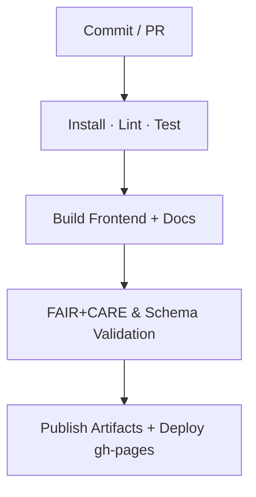
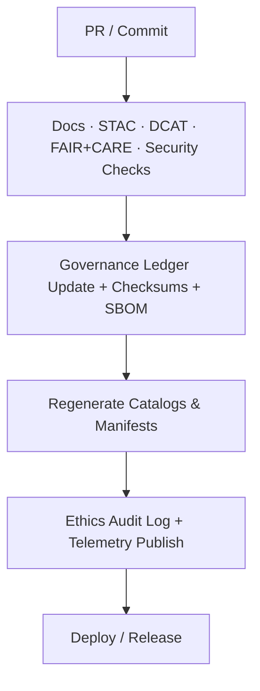

<div align="center">

# 🧩 **Kansas Frontier Matrix — GitHub Configuration & CI/CD Overview**  
`.github/README.md`

**Mission:** Document and govern GitHub Actions, community health, and automation for the KFM monorepo.  
Guarantees continuous integration, **FAIR+CARE** validation, docs linting, and ethical AI governance under **MCP-DL v6.4.3 (Tier-Ω+∞)**.

[](./workflows/site.yml)
[](./workflows/stac-validate.yml)
[](./workflows/dcat-export.yml)
[](./workflows/docs-validate.yml)
[](./workflows/codeql.yml)
[](./workflows/trivy.yml)
[](./workflows/pre-commit.yml)
[](../docs/standards/faircare-validation.md)

</div>

---

## 📚 Overview

The `.github/` directory defines **automation, governance, and community configuration** for KFM:

- **GitHub Actions** for CI/CD, build, validation, and governance.
- Issue / PR templates, **CODEOWNERS**, **CONTRIBUTING**, **SECURITY**, **SUPPORT**.
- **FAIR+CARE audits**, **STAC/DCAT** validation, docs style and link checks.
- **Provenance** (checksums, SBOM) and Focus Mode telemetry publication.

Everything is YAML-based for transparent, reproducible operations under **docs-as-code**.

---

## 🧠 Key Workflows

### 🧱 1) Build & Deployment — `site.yml`
Automates React + MapLibre frontend build, docs generation, and gh-pages deployment.



Artifacts: `dist/**`, `coverage/**`, `reports/**`.

---

### 🧪 2) STAC Validation — `stac-validate.yml`
Validates **STAC 1.0** Items/Collections and internal JSON Schemas.

- Core + extension versions  
- Spatial/temporal coverage  
- Asset roles/media types & checksums  
- Governance linkage (manifest + ledger)

Outputs → `reports/self-validation/**`.

---

### 🗂️ 3) DCAT Export — `dcat-export.yml`
Generates **DCAT 3.0 JSON-LD** feeds aligned with STAC for data-portal interoperability.

- Transform STAC → DCAT  
- Validate JSON-LD contexts  
- Publish to `data/meta/` + attach to releases

---

### 🔍 4) Code Quality & Security — `codeql.yml`, `trivy.yml`, `pre-commit.yml`

| Workflow | Tool | Function | Output |
|---|---|---|---|
| `codeql.yml` | CodeQL | Static analysis (TS/JS/Python/YAML) | `reports/security/codeql_analysis.json` |
| `trivy.yml` | Trivy | Container, SBOM, CVE scanning | `reports/security/trivy_scan_results.json` |
| `pre-commit.yml` | Hooks | Lint/format/secret-scan/md rules | Annotations + job summary |

---

### 🧩 5) FAIR+CARE Validation — `faircare-validate.yml`
Automates **FAIR** checks and **CARE** ethical review hooks.

- FAIR fields in STAC/DCAT/README front-matter  
- CARE flags (sensitive layers, consent, notices)  
- Provenance chains in `manifest.zip` and STAC links

Logs → `reports/fair/**`, `reports/audit/**`.

---

### 🧾 6) Governance & Audit — `governance-ledger.yml`
Maintains the immutable governance chain.

- SHA-256 checksums for datasets/manifests  
- Append signed entries to `reports/audit/ai_hazards_ledger.json`  
- Publish Focus telemetry → `../releases/v2.1.1/focus-telemetry.json`  
- Attach SBOM → `../releases/v2.1.1/sbom.spdx.json`

---

### 📚 7) Docs Validation — `docs-validate.yml`
Enforces documentation quality & compliance.

- Markdown linting and heading rules  
- **Link checker** (internal/external)  
- Front-matter presence (title/path/version/refs)  
- Mermaid syntax quick-parse (prevent render errors)

---

## 🧩 Community Configuration

### 🧰 Issue Templates — `.github/ISSUE_TEMPLATE/`
- `bug_report.yml` — Technical defects / validation failures  
- `feature_request.yml` — Enhancements / new features  
- `governance_review.yml` — Ethics / FAIR+CARE questions  
- `data_request.yaml` — New dataset/API integration  
- `data_submission.yml` — Submit dataset + provenance/licensing

All require **provenance**, **license**, **FAIR+CARE flags**, and **owner**.

---

### 💬 Pull Request Templates — `.github/PULL_REQUEST_TEMPLATE/`
PRs must include purpose/scope, schema & license confirmations, and links to:
`governance_ref`, `manifest_ref`, `sbom_ref`.

Required checks: STAC, DCAT, FAIR+CARE, docs-validate, security scans.

---

### 👥 CODEOWNERS & CONTRIBUTING
- **CODEOWNERS** maps reviewers per path (e.g., `/data/**` → `@kfm-etl-ops`, `/docs/**` → `@kfm-architecture`).  
- **CONTRIBUTING.md** codifies MCP docs-as-code, commit style, schema/versioning, and review SLAs.  
- **SECURITY.md** details vuln reporting, disclosure, and patch timelines.  
- **SUPPORT.md** points to discussions, labels, and triage windows.

All contributions pass **pre-commit** and **required status checks** before merge.

---

## ⚙️ Directory Layout

```bash
.github/
├── README.md
├── workflows/
│   ├── site.yml
│   ├── stac-validate.yml
│   ├── dcat-export.yml
│   ├── codeql.yml
│   ├── trivy.yml
│   ├── pre-commit.yml
│   ├── faircare-validate.yml
│   ├── docs-validate.yml
│   └── governance-ledger.yml
├── ISSUE_TEMPLATE/
│   ├── bug_report.yml
│   ├── feature_request.yml
│   ├── governance_review.yml
│   ├── data_request.yaml
│   └── data_submission.yml
├── PULL_REQUEST_TEMPLATE/
│   └── default.md
├── CODEOWNERS
├── CONTRIBUTING.md
├── SECURITY.md
└── SUPPORT.md
```

---

## 🧩 Governance Integration


<!-- END OF MERMAID -->

**Emitted Metadata**
- FAIR+CARE → `reports/fair/**`  
- Ethics & provenance → `reports/audit/**`  
- STAC integrity → `data/stac/**`  
- DCAT feeds → `data/meta/**`  
- Focus telemetry → `../releases/v2.1.1/focus-telemetry.json`  
- Release bundle → `../releases/v2.1.1/manifest.zip`

---

## 🕰 Version History

| Version | Date | Author | Summary |
|---|---|---|---|
| **v2.1.1** | 2025-11-16 | @kfm-architecture | Upgraded to MCP-DL v6.4.3; added docs-validate and DCAT export; aligned references to v2.1.1. |
| v9.3.3 | 2025-10-28 | @kfm-architecture | Added `data_request.yaml` and updated directory layout. |
| v9.3.2 | 2025-10-28 | @kfm-architecture | Unified CI/CD and FAIR+CARE automation under MCP. |
| v9.3.1 | 2025-10-27 | @bartytime4life | Introduced governance-ledger and FAIR+CARE validation. |
| v9.3.0 | 2025-10-26 | @kfm-etl-ops | Initialized GitHub configuration documentation. |

---

<div align="center">

**Kansas Frontier Matrix** · *Automation × Governance × Reproducibility*  
[🔗 Project Repository](https://github.com/bartytime4life/Kansas-Frontier-Matrix) • [🧭 Docs Portal](../docs/) • [⚖️ Governance Ledger](../docs/standards/governance/)

</div>
