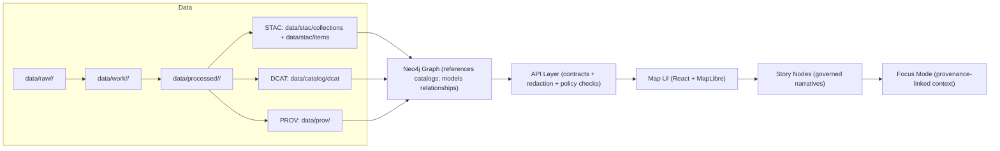
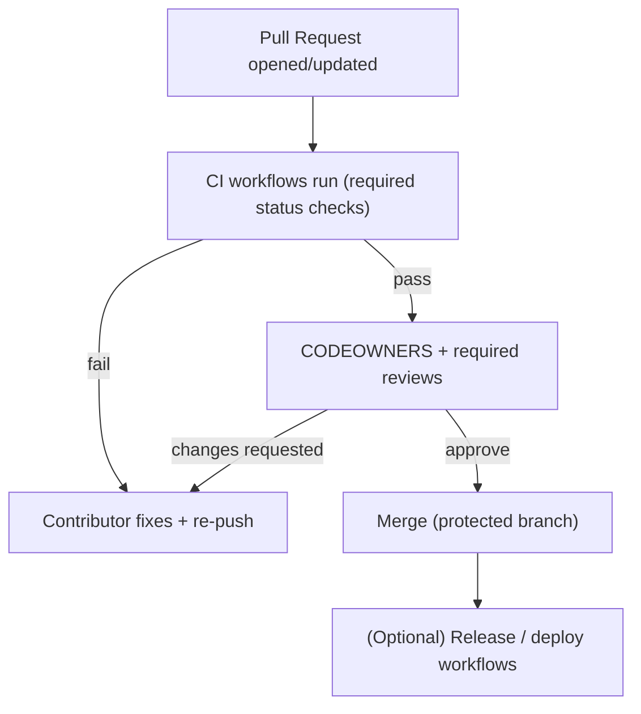

# Kansas Frontier Matrix (KFM) — `.github/` Governance Automation

> [!IMPORTANT]
> **Governed document.** This README describes **GitHub-native governance controls** (CI workflows + contribution templates + review routing) that enforce KFM’s core invariants at merge time.

This directory contains **GitHub-native governance controls** (CI workflows + contribution UX) that help enforce KFM’s core invariants:

- **Evidence-first**: no narrative, dataset, or AI output ships without provenance.
- **Contract-first**: schemas and API contracts are treated as first-class artifacts.
- **Trust membrane**: clients do not access databases directly; all access is mediated by the governed API layer.

> [!NOTE]
> This README explains **what `.github/` is responsible for** (automation + contribution UX).
> For platform architecture + the canonical pipeline, start with:
> - `../docs/MASTER_GUIDE_v13.md` *(path/version not confirmed in repo — update if your master guide differs)*
> - `../docs/architecture/` *(path not confirmed in repo — update if your architecture docs differ)*

---

## 📘 Overview

### Purpose

`.github/` exists to make KFM governance **enforceable and reviewable**:

- enforce baseline quality and policy checks automatically,
- standardize how work enters the repo (issues/PRs),
- route changes to the right reviewers (CODEOWNERS),
- prevent bypass paths (data, policy, and architecture invariants).

### Scope

In scope for `.github/`:

- GitHub Actions workflows (CI gates, validation, scans, reports)
- PR / issue templates (structured intake + governance checklists)
- CODEOWNERS (review routing)
- (If present) dependency update config (Dependabot), security policy links, etc.

Out of scope for `.github/`:

- defining KFM’s canonical standards and policies (those live under `../docs/` and `../policy/`)
- implementing pipeline logic, validators, schemas, or runtime services (those live outside `.github/`)

### Audience

- Contributors opening issues and PRs
- Reviewers/maintainers enforcing governance
- Governance/ethics reviewers (FAIR+CARE, sovereignty, sensitivity)

### Definitions

| Term | Meaning in KFM |
|---|---|
| **Governed** | Changes are subject to CI gates + review routing + policy checks before merge. |
| **Gate** | A required validation step that blocks merge when failing. |
| **Boundary artifact** | Output produced at a layer boundary (e.g., STAC/DCAT/PROV, contracts, validation reports). |
| **Trust membrane** | The rule that **all access is mediated** by governed interfaces (no UI→DB or core→DB direct access). |
| **Evidence-first** | Factual claims and published artifacts must be provenance-linked (dataset IDs, catalog records, citations). |
| **Contract-first** | Interfaces/schemas are versioned artifacts; changes must be explicit, validated, and reviewed. |

---

## 🗂️ Directory Layout

> [!NOTE]
> This is a **typical** `.github/` layout. Actual files may vary by repo. Treat this as an expectation checklist, not a claim that each file exists.

| Path | Purpose | Governance effect |
|---|---|---|
| `.github/workflows/` | CI pipelines (tests, lint, validators, scans) | Automated merge gating |
| `.github/ISSUE_TEMPLATE/` | Structured issue intake | Better triage; prevents under-specified requests |
| `.github/PULL_REQUEST_TEMPLATE.md` *(or repo root)* | PR checklist | Ensures contributors supply evidence + validation notes |
| `.github/CODEOWNERS` *(or repo root)* | Required-review routing | Enforces “right eyes on right changes” |
| `.github/dependabot.yml` *(if present)* | Dependency update automation | Supply-chain hygiene + controlled upgrades |
| `SECURITY.md` *(often repo root)* | Vulnerability disclosure guidance | Security governance process |

---

## 🧭 Context

KFM is a pipeline–catalog–database–API–UI system where **every stage emits boundary artifacts** and **every merge is gated by validation**.

### Non‑negotiable invariants

1. **Canonical pipeline order**  
   Raw → Processed → Catalog/PROV → Database → API → UI  
   (Shortcuts are treated as design defects unless explicitly justified and reviewed.)

2. **Trust membrane (no bypass paths)**  
   - UI/external clients never connect directly to PostGIS/Neo4j.
   - Backend business logic never bypasses repository interfaces to talk directly to storage.

3. **Provenance-first publishing**  
   - Datasets are not “published” until required catalog artifacts exist.
   - Story Nodes and Focus Mode outputs must remain provenance-linked.

4. **FAIR + CARE / sovereignty aware**  
   - Sensitive content may require redaction/generalization.
   - Exact locations for protected sites are treated as high-risk.

---

## 🗺️ Diagrams

### Pipeline map



### PR governance flow



---

## 🧱 Architecture of governance in `.github/`

### What `.github/` enforces vs what it references

**`.github/` enforces:**
- required CI status checks for merge (tests/validators/scans)
- structured contribution UX (templates + checklists)
- review routing (CODEOWNERS)
- consistent artifact reporting (logs, summaries, uploaded reports)

**`.github/` references (authoritative elsewhere):**
- canonical pipeline + repo structure (`../docs/MASTER_GUIDE_v13.md`)
- templates and validation rules (`../docs/templates/`, `../docs/standards/`)
- policy-as-code rules (`../policy/` if present)

> [!IMPORTANT]
> Treat workflow logic as **policy enforcement**, not policy definition.
> If a rule matters, it must exist **both** as a documented standard **and** as an enforceable check where feasible.

### Workflow change principles

When editing workflows, preserve these invariants:

- **Least privilege**: restrict `GITHUB_TOKEN` permissions per job.
- **Reproducibility**: prefer pinned tool versions; keep deterministic builds.
- **No secret-dependent validation** for core governance checks (so forks can run gates).
- **Fail closed** on governance rules (missing provenance/metadata should block, not warn).
- **Action supply-chain hygiene**: prefer pinned action versions/SHAs where feasible.
- **Artifact transparency**: upload validation reports so reviewers can inspect failures.

---

## 🧪 Validation & CI/CD

CI is the automated “governance membrane” that blocks merges when a change violates KFM rules.

> [!IMPORTANT]
> Workflow filenames differ by repo, but the **gates below** should exist in some form.
> Check `.github/workflows/` for the authoritative job names and required status checks.

### CI gate checklist

| Gate | What it checks | Why it matters | Typical fix |
|---|---|---|---|
| **Code quality** | unit/integration tests; type checks; lint | prevents regressions and drift from contracts | fix tests/types; update interfaces/adapters |
| **Docs governance** | markdown lint; required template sections; link checks; accessibility checks | keeps docs machine-ingestible and UI-safe | fix headings/sections; repair links; add alt text |
| **Contract governance** | OpenAPI/GraphQL schema validation; breaking-change detection; versioning rules | prevents silent contract breaks | update schema + version; add compatibility notes |
| **Dataset governance** | schema validation; “no null geometries”; value ranges; required metadata present | ensures datasets “build clean” like code | fix pipeline output; add missing metadata |
| **Catalog governance** | STAC/DCAT/PROV structure + referential integrity between artifacts | makes provenance navigable and machine-checkable | regenerate catalogs; fix IDs/links |
| **Policy-as-code** | OPA/Rego checks (via Conftest or equivalent) for sensitivity/license/citation rules | blocks policy violations before merge | add licenses/tags; redact restricted info |
| **Story Nodes** | Template v3 compliance; **every factual claim cited** | prevents unsourced narratives | add citations; split fact vs interpretation |
| **Focus Mode / AI** | AI outputs must include citations and respect sensitivity rules | prevents “freeform” or leaking responses | add/repair citations; reduce/aggregate sensitive data |
| **Security hygiene** | secret scan; dependency alerts (if enabled); SAST (if enabled) | prevents credential leaks and known-vuln drift | remove secrets; rotate keys; upgrade deps |
| **Infra hygiene** *(if applicable)* | IaC lint/scan; container build checks; compose/k8s validation | prevents deploy drift and insecure defaults | fix IaC; pin images; update configs |

### Change-type → expected gates

Use this quick matrix to anticipate required checks:

| Change type | Must pass at minimum |
|---|---|
| Backend code | Code quality + Contract governance + Security hygiene |
| Frontend/UI | Code quality + Accessibility checks + Contract governance |
| Docs only | Docs governance + Link checks + (Story Node checks if applicable) |
| Data only | Dataset governance + Catalog governance + Policy-as-code |
| Story Nodes | Story Node template + citation checks + sensitivity policy checks |
| Policy rules | Policy-as-code unit tests + policy lints + docs updates |
| CI/workflows | “Workflow change” lint (if present) + security posture review |

> [!TIP]
> If you want predictable CI outcomes, keep PRs “single-axis” when possible:
> - Code-only
> - Data-only
> - Docs-only
> - Contracts-only

---

## ✅ Local pre-flight checklist (before opening a PR)

If you can reproduce CI locally, your PR review becomes faster and more deterministic.

- [ ] Run local checks (when configured), e.g.:
  ```bash
  pre-commit run --all-files
  ```
- [ ] Run backend tests (service name varies by repo):
  ```bash
  pytest
  ```
- [ ] Run frontend checks (if applicable):
  ```bash
  npm test
  npm run lint
  ```
- [ ] If you touched docs:
  - [ ] verify links resolve
  - [ ] verify template-required sections exist
  - [ ] verify alt text and heading hierarchy
- [ ] If you added/changed data:
  - [ ] ensure correct staging (`raw → work → processed`)
  - [ ] ensure boundary artifacts exist (STAC + DCAT + PROV)
  - [ ] ensure policy checks pass (sensitivity/license/citations)

> [!TIP]
> Treat datasets and Story Nodes as **build artifacts**: if they don’t validate, they don’t ship.

---

## 🧠 Story Nodes & Focus Mode rules (what CI must protect)

### Story Nodes (governed narrative artifacts)

Story Nodes are treated as **structured, machine-ingestible narrative datasets**:

- every factual statement is traceable to evidence,
- key entities reference stable identifiers,
- fact vs interpretation is clearly separated.

**Minimum expectations for Story Node PRs:**
- include citations/provenance links for substantive claims
- ensure no sensitive locations are disclosed
- ensure references resolve (IDs, links, catalog items)

### Focus Mode (hard gate)

Focus Mode is a provenance-only experience:

- **Only provenance-linked content appears**
- AI contributions must be **opt-in** and **clearly labeled**
- sensitive locations are **generalized or omitted** to prevent side-channel leaks

> [!WARNING]
> If your change could reveal sensitive locations or culturally restricted knowledge:
> - redact/generalize in data + narrative
> - flag for governance review
> - do not “work around” policy gates

---

## ⚖️ FAIR+CARE & Governance

### Sensitivity handling (CARE-forward)

Some data and narratives can cause harm if published without controls. Treat these as **high-risk**:

- exact coordinates for protected sites or culturally restricted places
- precise locations of vulnerable habitats/species (when relevant)
- personally identifying information or private landowner details (when relevant)

**Governance behavior in `.github/`:**
- policy checks should block merges when restricted content is detected
- docs and data should support redaction/generalization patterns (and label them)

> [!CAUTION]
> “It’s in a dataset” is not a justification to publish it.
> Governance requires evaluating downstream harm and applying minimum-necessary disclosure.

---

## 🔎 Where the rules live (repo pointers)

The `.github/` automation exists to enforce rules defined elsewhere:

- Master guide + canonical pipeline: `../docs/MASTER_GUIDE_v13.md`
- Templates:
  - `../docs/templates/TEMPLATE__KFM_UNIVERSAL_DOC.md`
  - `../docs/templates/TEMPLATE__STORY_NODE_V3.md`
  - `../docs/templates/TEMPLATE__API_CONTRACT_EXTENSION.md`
- Standards/profiles:
  - `../docs/standards/` (STAC/DCAT/PROV + markdown work protocol)
- Policy-as-code (if present): `../policy/` (OPA/Rego)

> [!NOTE]
> If any of these paths don’t match your repository layout, update the pointers here to reflect the canonical locations.

---

## 📦 Typical contents of `.github/`

<details>
<summary>Expand to see common files you may find here</summary>

- `.github/workflows/`  
  GitHub Actions pipelines (CI gates described above)
- `.github/ISSUE_TEMPLATE/`  
  Structured issue intake (bug reports, data requests, story proposals)
- `PULL_REQUEST_TEMPLATE.md`  
  The “governance membrane” checklist for reviewers and contributors
- `CODEOWNERS`  
  Routing for required reviews (docs, data, policy, API, UI)
- `.github/dependabot.yml` *(if present)*  
  Automated dependency updates (reviewed like code)
- `SECURITY.md` *(commonly repo root)*  
  Security reporting guidance
</details>

---

## 🕰️ Version history

| Version | Date | Summary | Author |
|---:|---|---|---|
| v0.1.0 | 2026-02-09 | Initial `.github/README.md` aligned to v13 governance | TBD |
| v0.2.0 | 2026-02-09 | Expanded CI gates, clarified scope, added PR flow + change-type matrix, strengthened governance notes | TBD |