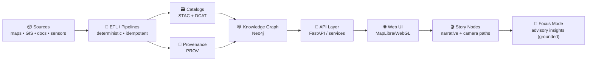
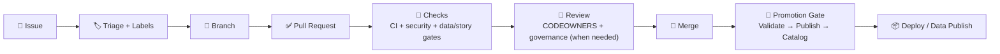
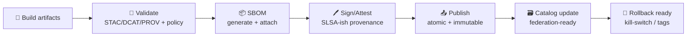

# 🤝 `.github/` — Collaboration & Automation Hub (Kansas Frontier Matrix)

[](#-how-to-contribute)
[](https://github.com/bartytime4life/Kansas-Frontier-Matrix/issues)
[](#-pull-requests)
[](https://github.com/bartytime4life/Kansas-Frontier-Matrix/actions/workflows/ci.yml)
[](https://github.com/bartytime4life/Kansas-Frontier-Matrix/actions/workflows/codeql.yml)
[](#-kfm-mdp--why-our-gates-are-strict)
[-f59e0b)](#-non-negotiables-v13-invariants)
[](#-data-promotion-gates-stacdcatprov)
[](#-security--privacy)
[](#-automation--required-checks)
[](../LICENSE)

> [!NOTE]
> This README documents **how we collaborate on GitHub**: issues, pull requests, reviews, labels, branch protection rules, and automation.  
> ✅ Start with the project overview: **[`../README.md`](../README.md)**

> [!IMPORTANT]
> This `.github/` folder is the **GitHub operations layer** for KFM — keep it clean, predictable, and boring (in the best way). ✅🧾

---

## 🧾 Policy metadata

| Field | Value |
|---|---|
| File | `.github/README.md` |
| Status | Active ✅ |
| Last updated | **2026-01-07** |
| KFM-MDP baseline | **v11.2.6** |
| Master Guide | **v13 (draft)** |
| Core governance | FAIR + CARE (data + people) |
| Minimum metadata bar | STAC + DCAT + PROV for promoted artifacts |

---

## ⚡ Quick links

| Action | Link |
|---|---|
| 🐛 Report a bug | [Open bug report](https://github.com/bartytime4life/Kansas-Frontier-Matrix/issues/new?template=bug_report.yml) |
| ✨ Request a feature | [Open feature request](https://github.com/bartytime4life/Kansas-Frontier-Matrix/issues/new?template=feature_request.yml) |
| 🗺️ Request a data layer/source | [Request a layer/source](https://github.com/bartytime4life/Kansas-Frontier-Matrix/issues/new?template=data_layer_request.yml) |
| 🧰 Request a pipeline / automation | [Open pipeline request](https://github.com/bartytime4life/Kansas-Frontier-Matrix/issues/new?template=pipeline_request.yml) *(spec — add if missing)* |
| 🎬 Request a Story Node (3D narrative) | [Open Story Node request](https://github.com/bartytime4life/Kansas-Frontier-Matrix/issues/new?template=story_node_request.yml) *(spec — add if missing)* |
| ❓ Ask a question | [Ask a question](https://github.com/bartytime4life/Kansas-Frontier-Matrix/issues/new?template=question.yml) |
| 🧪 See CI runs | [GitHub Actions](https://github.com/bartytime4life/Kansas-Frontier-Matrix/actions) |
| 🔎 Catalog QA gate | [`catalog-qa.yml`](https://github.com/bartytime4life/Kansas-Frontier-Matrix/actions/workflows/catalog-qa.yml) *(spec — add if missing)* |
| 🧰 Workflow docs | [`./workflows/README.md`](./workflows/README.md) *(add if missing)* |
| 🔐 Security policy | [`./SECURITY.md`](./SECURITY.md) *(recommended)* |

> [!TIP]
> If a template link 404s, use the chooser: https://github.com/bartytime4life/Kansas-Frontier-Matrix/issues/new/choose

---

<details>
<summary><strong>🧭 Table of contents</strong></summary>

- [🧭 What we’re building](#-what-were-building)
- [🧬 Non-negotiables (v13 invariants)](#-non-negotiables-v13-invariants)
- [🧩 What lives in <code>.github/</code>](#-what-lives-in-github)
- [🔁 Workflow: Issue → PR → Merge → Promote → Ship](#-workflow-issue--pr--merge--promote--ship)
- [🛡️ Branch protection & merge strategy](#-branch-protection--merge-strategy)
- [🤖 Automation & required checks](#-automation--required-checks)
- [🧾 Issues](#-issues)
- [✅ Pull Requests](#-pull-requests)
- [🏷️ Label taxonomy](#-label-taxonomy)
- [🔎 Data contribution rules](#-data-contribution-rules-non-negotiable)
- [🎬 Story Nodes + narrative layer](#-story-nodes--narrative-layer)
- [🧠 Focus Mode (advisory AI)](#-focus-mode-advisory-ai)
- [🔐 Security & privacy](#-security--privacy)
- [📚 Project reference library](#-project-reference-library-the-why-behind-our-standards)
- [🧾 Next “missing but expected” files](#-next-missing-but-expected-files)
- [🙌 How to contribute](#-how-to-contribute)

</details>

---

## 🧭 What we’re building

Kansas Frontier Matrix (KFM) is a **living atlas of Kansas** 🏛️🗺️ that connects:
- 🧾 historical archives & scanned maps  
- 🛰️ modern geospatial + remote sensing layers  
- 🗄️ spatial databases (PostGIS) + a knowledge graph (Neo4j)  
- 🔌 a contract-first API layer (e.g., FastAPI/services)  
- 🌐 a modern map UI (MapLibre/WebGL) with optional **3D Story Nodes** 🎬 (e.g., Cesium + MapLibre handoff)

KFM is intentionally **pipeline-driven** and **governance-driven**:
- data moves through a strict order (ETL → catalogs → graph → API → UI → Story Nodes → Focus Mode)
- validation gates aren’t optional
- promoted artifacts must be **discoverable + trustworthy** (STAC/DCAT/PROV + policy checks)

### 🗺️ System order (CI mirrors this)



> [!TIP]
> If you touch anything upstream (ETL/catalog/graph), you’re touching everything downstream.  
> That’s why gates are strict. 🚦

---

## 🧬 Non-negotiables (v13 invariants)

These are the “rules of the road” that keep the Matrix coherent as it grows:

1) **Pipeline ordering is absolute**: ETL → Catalogs → Graph → API → UI → Story Nodes → Focus Mode  
2) **API boundary rule**: the frontend must never query the graph DB directly — UI talks to **API only**  
3) **Provenance first**: every public claim should trace to a dataset, catalog entry, or archival source  
4) **Deterministic ETL**: ETL is repeatable/idempotent; inference/AI belongs in governed analysis lanes  
5) **Evidence-first narrative**: Story Nodes separate **facts** from **interpretation** and cite sources  
6) **Sovereignty & classification propagate**: outputs cannot be “less restricted” than their inputs  
7) **Validation gates are real**: missing metadata/provenance is a merge blocker for promoted artifacts

> [!IMPORTANT]
> These invariants are meant to be **enforceable by CI**, not “nice ideas.” 🤖✅

---

## 🧩 What lives in `.github/`

This folder defines the “how we ship” layer: templates, workflows, routing, and governance. 🤖🧾

```text
📁 .github/
├─ 📁 workflows/                           # 🤖 CI/CD + automation
│  ├─ ci.yml                               # ✅ lint + unit tests + typecheck + build
│  ├─ integration.yml                      # 🧬 PostGIS/adapter integration lane (recommended)
│  ├─ codeql.yml                           # 🔐 SAST scanning (recommended)
│  ├─ catalog-qa.yml                       # 🔎 quick STAC/DCAT gate for data/** (spec)
│  ├─ stac-validate.yml                    # 🧾 full STAC schema validation (spec)
│  ├─ dcat-validate.yml                    # 🧾 DCAT validation (spec)
│  ├─ prov-validate.yml                    # 🧾 PROV validation (spec)
│  ├─ policy.yml                           # 🧑‍⚖️ OPA/Conftest policy gates (spec)
│  ├─ sbom.yml                             # 📦 SBOM generation (spec)
│  ├─ attest.yml                           # 🖊️ artifact attestations/signing (spec)
│  ├─ pages.yml                            # 🌐 build/deploy docs/UI (optional)
│  ├─ release.yml                          # 🏷️ release packaging (optional)
│  └─ security.yml                         # 🔎 dependency review + secret scan helpers (optional)
├─ 📁 actions/                             # 🧩 reusable composite actions (optional)
│  ├─ check-kill-switch/                   # 🧯 fail-closed “stop button” (spec)
│  └─ story-lint/                          # 🎬 Story Node linting (spec)
├─ 📁 ISSUE_TEMPLATE/                      # 🧾 guided issue creation (issue forms)
│  ├─ bug_report.yml
│  ├─ feature_request.yml
│  ├─ data_layer_request.yml
│  ├─ pipeline_request.yml                 # 🧰 spec — add if missing
│  ├─ story_node_request.yml               # 🎬 spec — add if missing
│  └─ question.yml
├─ 📄 PULL_REQUEST_TEMPLATE.md             # ✅ PR checklist & review prompts
├─ 📄 CODEOWNERS                           # 👀 review routing by area
├─ 📄 dependabot.yml                       # ♻️ dependency updates (recommended)
├─ 📄 labels.yml                           # 🏷️ canonical label taxonomy (recommended)
├─ 📄 release-drafter.yml                  # 📝 auto-draft release notes (optional)
├─ 📄 SECURITY.md                          # 🔐 vuln reporting (recommended)
└─ 📄 README.md                            # 📍 you are here
```

> [!NOTE]
> If any file above doesn’t exist yet, this README acts as the **spec**.  
> Mark “spec” items as you implement them to keep this doc honest. 🧾✅

---

## 🔁 Workflow: Issue → PR → Merge → Promote → Ship



### 🚦 Promotion saga (KFM-MDP-style)



> [!TIP]
> “Promotion” is where we get safety: **fail-closed**, log what happened, and never break downstream consumers. ✅🧯

---

## 🛡️ Branch protection & merge strategy

Configured in **Repo Settings** (not files). Recommended guardrails:

- ✅ Require PRs (no direct pushes to `main`)
- ✅ Require status checks (CI + security + relevant data/story gates)
- ✅ Require at least **1–2 approvals** (CODEOWNERS when applicable)
- ✅ Require “Resolve conversations” before merge
- ✅ Block force-pushes to protected branches
- ✅ Prefer **Squash merge** for clarity (or **Rebase merge** for linear history)

### ✅ Recommended required checks (baseline)
- `ci` ✅
- `codeql` 🔐 *(if enabled)*
- `catalog-qa` 🔎 *(required when `data/**` changes)*
- `story-lint` 🎬 *(required when Story Nodes change — spec)*

---

## 🤖 Automation & required checks

### ✅ What CI should do (minimum bar)
- Lint + formatting checks
- Unit tests (fast)
- Type checking (where applicable)
- Build (web + CLI tooling)
- Security scans (CodeQL + dependency review)
- **Change-aware gates** (data/story rules only when touched)

### 🧭 Gate matrix (what triggers what)

| Change type | Examples | Required gates |
|---|---|---|
| 🧠 Core code | API logic, pipelines, parsing | `ci`, `codeql`, `dependency-review` |
| 🗺️ Data/catalog | `data/**`, STAC/DCAT/PROV | `catalog-qa` (fast), `stac-validate`/`dcat-validate`/`prov-validate` (full lane) |
| 🎬 Story Nodes | `docs/reports/story_nodes/**` | `story-lint` (template + citations + sensitivity) |
| 🌐 Web UI | `web/**` | `ci` (build), optional `pages` preview |
| 🤖 Workflows | `.github/workflows/**` | `actionlint` (recommended), least-privilege review |

> [!CAUTION]
> Workflows are security-sensitive. Treat them like production code. 🔐

---

## 🧾 Issues

Use issues for **everything**: bugs, layers, pipelines, UI changes, docs, research notes.

### ✅ Before filing
- Search existing issues/PRs
- Add screenshots (UI), logs (pipelines), or minimal repro (code)
- Geo requests: include **time range** + **spatial extent** (bbox, county, township/range, etc.)
- Catalog/pipeline requests: include **dataset id**, expected STAC/DCAT shape, and provenance needs

### 🏷️ Recommended issue categories (labels)
- `type:bug` 🐛 — something broken
- `type:feature` ✨ — new capability
- `type:data` 🗺️ — new layer/source, ingestion, catalog updates
- `type:pipeline` 🧰 — ETL/automation/schedulers/validators
- `type:docs` 📚 — documentation improvements
- `type:story` 🎬 — Story Nodes / narrative layer
- `type:chore` 🧹 — refactor, tooling, dependencies
- `type:security` 🔐 — security-related changes *(avoid public details; see SECURITY.md)*

---

## ✅ Pull Requests

PRs should be **small, reviewable, and testable**.

### 🌿 Branch naming
- `feat/<short-scope>` — new features
- `fix/<short-scope>` — bug fixes
- `data/<source-or-layer>` — data/catalog changes
- `pipe/<pipeline-or-validator>` — pipeline/CI/automation work
- `docs/<topic>` — documentation
- `story/<slug>` — Story Nodes

### 🧪 PR must include
- Clear summary (“what + why”)
- Testing notes (unit/integration/manual)
- Docs updates **if behavior changes**
- Data provenance notes **if layers change**
- Sensitivity notes **if locations or communities could be impacted**

### 📏 PR size guideline
Prefer < **400 lines** changed unless there’s a strong reason.

### 🧾 PR description essentials (geo/data-specific)
Include:
- **CRS/EPSG** (and whether you used STAC `proj:*` fields)
- **bbox** (or named region)
- **time coverage** (year / range / undated)
- **format** (COG/GeoJSON/tiles/etc.)
- **preview proof** (screenshot + zoom level)
- **catalog impact**: which `collection.json` / `catalog.json` changed
- **provenance impact**: which PROV record(s) were added/updated

> [!IMPORTANT]
> Link issues in the PR body using: `Closes #123` ✅  
> This auto-closes issues on merge and keeps history tidy.

---

## 👀 Reviews & ownership

### ✅ CODEOWNERS = routing
- CODEOWNERS live in **[`./CODEOWNERS`](./CODEOWNERS)** 👀  
- If you’re unsure who owns an area, open an issue with `status:needs-triage` and we’ll route it.

### 🤝 Review etiquette
- Review **the change**, not the person.
- Ask for evidence: screenshots, logs, benchmarks, repro steps.
- Prefer “suggestion” comments over blockers when possible.
- If you request changes, be explicit: **what** and **why**.

---

## 🏷️ Label taxonomy

Use prefixes so filters, search, and boards stay sane:

- `type:*` → intent (bug/feature/data/pipeline/story/docs/chore/security)
- `area:*` → subsystem
  - `area:pipeline` 🧰
  - `area:catalog` 🗃️
  - `area:stac` 🧾
  - `area:dcat` 🧾
  - `area:prov` 🧾
  - `area:graph` 🕸️
  - `area:api` 🔌
  - `area:web` 🌐
  - `area:db` 🗄️
  - `area:story` 🎬
  - `area:docs` 📚
- `priority:*` → urgency (`p0`, `p1`, `p2`)
- `status:*` → workflow state (`blocked`, `needs-info`, `ready`, `in-progress`)
- `good-first-issue` 🌱 → newcomer-friendly
- `governance:*` → extra review triggers (`sovereignty`, `sensitive-locations`, `license`, `privacy`)

> [!TIP]
> Cute labels are fun… until boards become unusable. 😅 Keep it predictable.

---

## 🔎 Data contribution rules (non-negotiable)

### ✅ The staging rule (fail-closed)
New artifacts should follow a staged lifecycle (even if directories are still “spec” while we build):

- `data/raw/` → immutable source snapshots  
- `data/work/` → intermediate transforms (discardable)  
- `data/processed/` → publish-ready artifacts  
- `data/stac/` → STAC Items/Collections that reference processed artifacts  
- `data/catalog/dcat/` → DCAT roll-ups/distributions  
- `data/prov/` → PROV docs linking inputs → activities → outputs  

> [!IMPORTANT]
> If it’s going to show up in the UI, it must be **cataloged and traceable**. 🗃️🧾

### ✅ Provenance checklist (required)
Any new/updated dataset **must** include:

- Source name + link (or archive reference)
- License/terms (or “unknown” with rationale)
- Spatial reference (EPSG) and units
- Time coverage (single year, range, or “undated”)
- Processing steps (georef points count, resampling, simplification, etc.)
- Checksums + version stamp *(recommended)*

### 🧱 Preferred formats
- Raster: **COG** (Cloud-Optimized GeoTIFF) ✅
- Vector: **GeoJSON** (or GeoPackage when justified)
- Interchange: **KML/KMZ** (regionated if large)
- Tiles: vector/raster tiles only when needed for UX/performance

### 🧾 STAC extension discipline (recommended)
- Prefer **Stable** STAC extensions for production catalogs  
- Warn on Pilot/Proposal extensions unless explicitly approved  
- Include `proj:*` fields when applicable (CRS + footprint + raster transform)

---

## 🔎 Catalog QA (STAC quick gate) — fast PR filter

A high-ROI gate that runs on PRs touching `data/**` (and validator code). It prevents broken catalogs from merging.

**Checks (fast):**
- `license` exists and non-empty ✅  
- `providers` is a non-empty array ✅  
- `stac_extensions` exists (warn if empty; fail if missing) ✅  
- top-level `links[].href` checked via HEAD/GET ✅  

**Local usage (spec path):**
```bash
python3 tools/validation/catalog_qa/run_catalog_qa.py \
  --root data/ \
  --glob "**/collection.json" \
  --fail-on-warn
```

> [!TIP]
> Catalog QA is a **quick gate**. Full schema validation can run nightly or by manual dispatch. 🧯

---

## 🎬 Story Nodes + narrative layer

Story Nodes are **machine-ingestible storytelling**: Markdown + structured front-matter that links narrative to KFM data/graph assets.

### ✅ Story Node rules
- Facts require citations/evidence links
- Interpretations are allowed, but must be labeled as such
- “AI assist” is **opt-in** and must be labeled
- Sensitive locations must be generalized (precision policy)

### 🧾 Story Node front-matter (template)

```yaml
---
id: story.kansas.<slug>
title: "Human-readable title"
time_range: [YYYY, YYYY]
places:
  - kfm.place.<place_id>
entities:
  - kfm.entity.<entity_id>
claims:
  - text: "Factual claim that must be evidence-linked."
    evidence:
      - stac:item: kfm.stac.<collection_or_item_id>
      - archive: "KSHS ref / call number / citation"
interpretations:
  - text: "Interpretation / narrative framing (non-factual)."
ai_assist:
  used: false
sensitivity:
  level: public
  location_precision: county  # or township, bbox, h3_6, etc.
---
```

> [!NOTE]
> Story Nodes should reference durable identifiers (catalog IDs + graph IDs), not fragile URLs.

---

## 🧠 Focus Mode (advisory AI)

Focus Mode is a **human-first advisory layer**:
- it surfaces narrative summaries and “what connects to what”  
- it should be grounded in KFM sources whenever possible  
- it is never autonomous; users remain in control

### ✅ Focus Mode rules
- Outputs should be provenance-linked (citations or dataset references)
- Never leak sensitive location precision (respect `sensitivity.location_precision`)
- Distinguish **fact** vs **interpretation**
- Treat AI outputs as artifacts (store + catalog + trace) if we intend to publish them

---

## 🔐 Security & privacy

- Never commit secrets (tokens, keys, credentials)
- Use GitHub Secrets + environment variables
- For vulnerabilities: use **private reporting** (see `SECURITY.md`)

### 🧭 Data sensitivity rule (hard)
If a dataset includes **sensitive locations** (culturally sensitive sites, critical infrastructure, etc.):
- generalize location precision (mask/jitter/grid indexing like H3 when appropriate)
- do not publish exact coordinates unless explicitly permitted by governance

> [!CAUTION]
> Don’t paste sensitive endpoints, server IPs, access patterns, or raw credentials into public issues/PRs.

---

## 📚 Project reference library (the “why” behind our standards)

<details>
<summary><strong>📖 Expand the full reading map (project files)</strong></summary>

### 🧭 Canonical KFM design + governance
- `docs/architecture/Kansas Frontier Matrix (KFM) – Comprehensive Engineering Design.docx`
- `docs/notes/Latest Ideas.docx`
- `docs/notes/MARKDOWN_GUIDE_v13.md.gdoc`

### 🗺️ GIS, geoprocessing, mobile mapping
- `docs/library/KFM- python-geospatial-analysis-cookbook-over-60-recipes-to-work-with-topology-overlays-indoor-routing-and-web-application-analysis-with-python.pdf`
- `docs/library/python-geospatial-analysis-cookbook.pdf`
- `docs/library/making-maps-a-visual-guide-to-map-design-for-gis.pdf`
- `docs/library/Mobile Mapping_ Space, Cartography and the Digital - 9789048535217.pdf`

### 🛰️ Remote sensing & Earth Engine workflows
- `docs/library/Cloud-Based Remote Sensing with Google Earth Engine-Fundamentals and Applications.pdf`

### 🌐 Web + graphics + 3D
- `docs/library/responsive-web-design-with-html5-and-css3.pdf`
- `docs/library/webgl-programming-guide-interactive-3d-graphics-programming-with-webgl.pdf`

### 📈 Statistics, experiments, modeling discipline
- `docs/library/Understanding Statistics & Experimental Design.pdf`
- `docs/library/regression-analysis-with-python.pdf`
- `docs/library/Regression analysis using Python - slides-linear-regression.pdf`
- `docs/library/graphical-data-analysis-with-r.pdf`
- `docs/library/think-bayes-bayesian-statistics-in-python.pdf`

### 🧪 Simulation, optimization, advanced math
- `docs/library/Scientific Modeling and Simulation_ A Comprehensive NASA-Grade Guide.pdf`
- `docs/library/Generalized Topology Optimization for Structural Design.pdf`
- `docs/library/Spectral Geometry of Graphs.pdf`

### 🧰 Engineering foundations (systems, DBs, concurrency)
- `docs/library/PostgreSQL Notes for Professionals - PostgreSQLNotesForProfessionals.pdf`
- `docs/library/Scalable Data Management for Future Hardware.pdf`
- `docs/library/Data Spaces.pdf`
- `docs/library/concurrent-real-time-and-distributed-programming-in-java-threads-rtsj-and-rmi.pdf`

### 🔐 Security awareness (defensive posture)
- `docs/library/ethical-hacking-and-countermeasures-secure-network-infrastructures.pdf`
- `docs/library/Gray Hat Python - Python Programming for Hackers and Reverse Engineers (2009).pdf`

### 🖼️ Imaging (map scans, formats, storage tradeoffs)
- `docs/library/compressed-image-file-formats-jpeg-png-gif-xbm-bmp.pdf`

### 🧑‍⚖️ Ethics & governance
- `docs/library/Introduction to Digital Humanism.pdf`
- `docs/library/Principles of Biological Autonomy - book_9780262381833.pdf`
- `docs/library/On the path to AI Law’s prophecies and the conceptual foundations of the machine learning age.pdf`

### 🧱 General programming shelf (bundles)
- `docs/library/A programming Books.pdf`
- `docs/library/B-C programming Books.pdf`
- `docs/library/D-E programming Books.pdf`
- `docs/library/F-H programming Books.pdf`
- `docs/library/I-L programming Books.pdf`
- `docs/library/M-N programming Books.pdf`
- `docs/library/O-R programming Books.pdf`
- `docs/library/S-T programming Books.pdf`
- `docs/library/U-X programming Books.pdf`

</details>

---

## 🧑‍💻 Maintainers & ownership

- CODEOWNERS live in **[`./CODEOWNERS`](./CODEOWNERS)** 👀  
- If you’re unsure who owns an area, open an issue with `status:needs-triage` and we’ll route it.

---

## 🧾 Next “missing but expected” files

If they don’t exist yet, consider adding (or tracking as “spec” work):

- `.github/SECURITY.md` 🔐 (vulnerability reporting)
- `.github/CONTRIBUTING.md` 🤝 (setup + conventions + style)
- `docs/ARCHITECTURE.md` 🧱 (system boundaries + runtime diagram)
- `docs/standards/KFM_STAC_PROFILE.md` 🧾 (what we require beyond vanilla STAC)
- `docs/standards/KFM_DCAT_PROFILE.md` 🧾
- `docs/standards/KFM_PROV_PROFILE.md` 🧾
- `policies/promotion.rego` 🧑‍⚖️ (OPA policy for promotion)
- `.kfm/kill-switch.yml` 🧯 (fail-closed safety switch)
- `.github/workflows/catalog-qa.yml` 🔎 (STAC quick gate)
- `.github/workflows/sbom.yml` 📦 (Syft/SPDX)
- `.github/workflows/attest.yml` 🖊️ (artifact attestations)
- `.github/workflows/story-lint.yml` 🎬 (Story Nodes lint)
- `.github/labels.yml` 🏷️ (label source of truth)
- `.github/release-drafter.yml` 📝 (release notes automation)

---

## 🙌 How to contribute

1. Pick an issue (or open one) 🧾  
2. Claim it (comment) ✍️  
3. Create a branch 🌿  
4. Open a PR ✅  
5. Iterate with review feedback 👀  
6. Merge when checks are green 🤖🟢  

---

**Thanks for building the Matrix.** 🧭🗺️✨