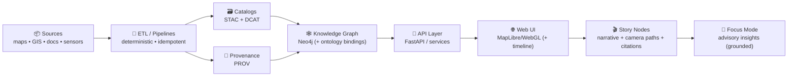
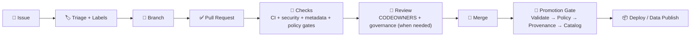

<a id="top"></a>

# 🤝 `.github/` — Collaboration & Automation Hub (Kansas Frontier Matrix)

[](#-how-to-contribute)
[](https://github.com/bartytime4life/Kansas-Frontier-Matrix/issues)
[](#-pull-requests)
[](https://github.com/bartytime4life/Kansas-Frontier-Matrix/actions/workflows/ci.yml)
[](https://github.com/bartytime4life/Kansas-Frontier-Matrix/actions/workflows/codeql.yml)
[](#-documentation-protocol-kfm-mdp--why-our-gates-are-strict)
[-f59e0b)](#-non-negotiables-v13-invariants)
[](#-policy-as-code-gate-opaconftest)
[](#-data-promotion-gates-stacdcatprov)
[](#-security--privacy)
[](#-automation--required-checks)
[](../LICENSE)

> [!NOTE]
> This README documents **how we collaborate on GitHub**: issues, pull requests, reviews, labels, CODEOWNERS, branch protection, and automation lanes.  
> ✅ Start with the project overview: **[`../README.md`](../README.md)**

> [!IMPORTANT]
> This `.github/` folder is the **GitHub operations layer** for KFM — keep it clean, predictable, auditable, and boring (in the best way). ✅🧾  
> The innovation is in **data + catalogs + pipelines + graph + UI + Story Nodes + Focus Mode** — but it only scales if this layer stays disciplined. 🧭

---

## 🧾 Policy metadata

| Field | Value |
|---|---|
| 📄 File | `.github/README.md` |
| ✅ Status | Active |
| 🗓️ Last updated | **2026-01-10** |
| 🧬 KFM-MDP baseline | **v11.2.6** *(metadata profiles / promotion discipline)* |
| 📘 Master Guide | **v13 (draft)** *(contract-first, evidence-first, governed CI gates)* |
| 🏛️ Core governance | FAIR + CARE + sovereignty guardrails |
| 🧑‍⚖️ Policy engine | OPA/Conftest + Rego bundles (policy-as-code) |
| 🧾 Minimum metadata bar | STAC + DCAT + PROV for promoted artifacts |
| 🚦 Default posture | **Fail-closed** on promotion-critical gates |
| 📦 Supply chain | SBOM + attestations for tags/releases (and optionally `main`) |

---

## ⚡ Quick links

| Action | Link |
|---|---|
| 🐛 Report a bug | [Open bug report](https://github.com/bartytime4life/Kansas-Frontier-Matrix/issues/new?template=bug_report.yml) |
| ✨ Request a feature | [Open feature request](https://github.com/bartytime4life/Kansas-Frontier-Matrix/issues/new?template=feature_request.yml) |
| 🗺️ Request a data layer/source | [Request a layer/source](https://github.com/bartytime4life/Kansas-Frontier-Matrix/issues/new?template=data_layer_request.yml) |
| 🧰 Request a pipeline / automation | [Open pipeline request](https://github.com/bartytime4life/Kansas-Frontier-Matrix/issues/new?template=pipeline_request.yml) *(spec — add if missing)* |
| 🎬 Request a Story Node | [Open Story Node request](https://github.com/bartytime4life/Kansas-Frontier-Matrix/issues/new?template=story_node_request.yml) *(spec — add if missing)* |
| ❓ Ask a question | [Ask a question](https://github.com/bartytime4life/Kansas-Frontier-Matrix/issues/new?template=question.yml) |
| 🧪 See CI runs | [GitHub Actions](https://github.com/bartytime4life/Kansas-Frontier-Matrix/actions) |
| 🛡️ Security policy | [`./SECURITY.md`](./SECURITY.md) *(recommended location)* |
| 🤖 Workflows docs | [`./workflows/README.md`](./workflows/README.md) |
| 🧩 Actions catalog | [`./actions/README.md`](./actions/README.md) |
| 🧑‍⚖️ Policy rules | [`../tools/validation/policy/README.md`](../tools/validation/policy/README.md) |
| 🧯 Kill-switch config | [`../.kfm/kill-switch.yml`](../.kfm/kill-switch.yml) *(spec — add if missing)* |
| 🧪 Deterministic replay runner | [`../tools/kfm-sim-run/`](../tools/kfm-sim-run/) *(spec — add if missing)* |

> [!TIP]
> If an issue template link 404s, use the chooser: <https://github.com/bartytime4life/Kansas-Frontier-Matrix/issues/new/choose>

---

<details>
<summary><strong>🧭 Table of contents</strong></summary>

- [🧭 What we’re building](#-what-were-building)
- [🧬 Non-negotiables (v13 invariants)](#-non-negotiables-v13-invariants)
- [🧩 What lives in <code>.github/</code>](#-what-lives-in-github)
- [🔁 Workflow: Issue → PR → Merge → Promote → Ship](#-workflow-issue--pr--merge--promote--ship)
- [🛡️ Branch protection & merge strategy](#-branch-protection--merge-strategy)
- [🤖 Automation & required checks](#-automation--required-checks)
- [🧑‍⚖️ Policy-as-Code gate (OPA/Conftest)](#-policy-as-code-gate-opaconftest)
- [🧾 Documentation Protocol (KFM‑MDP) — why our gates are strict](#-documentation-protocol-kfm-mdp--why-our-gates-are-strict)
- [🧪 Deterministic replay lane: <code>kfm-sim-run</code>](#-deterministic-replay-lane-kfm-sim-run)
- [🧯 Kill-switch (fail‑closed) rules](#-kill-switch-fail-closed-rules)
- [🧾 Issues](#-issues)
- [✅ Pull Requests](#-pull-requests)
- [👀 Reviews & ownership](#-reviews--ownership)
- [🏷️ Label taxonomy](#-label-taxonomy)
- [🔎 Data promotion gates (STAC/DCAT/PROV)](#-data-promotion-gates-stacdcatprov)
- [🧪 Evidence artifacts (analysis/model outputs) — collaboration rules](#-evidence-artifacts-analysismodel-outputs--collaboration-rules)
- [🎬 Story Nodes + narrative layer](#-story-nodes--narrative-layer)
- [🧠 Focus Mode (advisory AI)](#-focus-mode-advisory-ai)
- [🤖 Agents & autonomy boundaries (WPE)](#-agents--autonomy-boundaries-wpe)
- [🔐 Security & privacy](#-security--privacy)
- [📚 Project reference library](#-project-reference-library-the-why-behind-our-standards)
- [🧾 Next “missing but expected” files](#-next-missing-but-expected-files)
- [🙌 How to contribute](#-how-to-contribute)

</details>

---

## 🧭 What we’re building

Kansas Frontier Matrix (KFM) is a **living atlas of Kansas** 🏛️🗺️ that connects:

- 🧾 historical archives & scanned maps  
- 🛰️ modern geospatial + remote sensing layers  
- 🗄️ spatial databases (**PostGIS**) + a knowledge graph (**Neo4j**)  
- 🔌 a **contract-first API boundary** (e.g., FastAPI/services)  
- 🌐 a modern map UI (**MapLibre/WebGL**) with optional **3D** via **Cesium**  
- 🎬 **Story Nodes** (machine-ingestible storytelling)  
- 🧠 **Focus Mode** (advisory AI, evidence-backed, citation-first)

KFM is intentionally **pipeline-driven** and **governance-driven**:

- data moves through a strict order (**ETL → catalogs → graph → API → UI → narratives → Focus Mode**)  
- validation gates aren’t optional 🚦  
- promoted artifacts must be **discoverable + trustworthy** (STAC/DCAT/PROV + policy checks) 🧾

### 🗺️ System order (CI mirrors this)



> [!TIP]
> If you touch anything upstream (ETL/catalog/graph), you’re touching everything downstream.  
> That’s why gates are strict. 🚦✅

---

## 🧬 Non-negotiables (v13 invariants)

These are the rules that keep the Matrix coherent as it grows:

1) **Pipeline ordering is absolute**: ETL → Catalogs → Graph → API → UI → Story Nodes → Focus Mode  
2) **API boundary rule**: the frontend must never query the graph DB directly — UI talks to **API only**  
3) **Provenance first**: every public claim should trace to a dataset, catalog entry, or archival source  
4) **Deterministic ETL**: same inputs + config = same outputs (idempotent)  
5) **Evidence-first narrative**: Story Nodes separate **facts** vs **interpretation**, and cite sources  
6) **Sovereignty & classification propagate**: outputs cannot be “less restricted” than inputs  
7) **Validation gates are real**: missing metadata/provenance is a merge blocker for promoted artifacts  
8) **Clean architecture bias**: domain rules are not “wherever the code landed” (keep layers clean) 🧱  
9) **Stable IDs forever**: IDs are contracts (catalog IDs, graph IDs, story IDs) 🏷️  
10) **No side-channels**: Focus Mode must not leak restricted locations or bypass redaction rules 🧯  

> [!IMPORTANT]
> These invariants are meant to be **enforceable by CI**, not “nice ideas.” 🤖✅

---

## 🧩 What lives in `.github/`

This folder defines the **how-we-ship** layer: templates, workflows, routing, and governance. 🤖🧾

```text
📁 .github/
├─ 🤖 workflows/                                # 🤖 CI/CD + automation lanes
│  ├─ ✅ ci.yml                                 # ✅ lint + unit tests + typecheck + build
│  ├─ 🔐 codeql.yml                             # 🔐 SAST scanning (CodeQL)
│  ├─ 🔎 catalog-qa.yml                         # 🔎 fast STAC/DCAT sanity + link checks
│  ├─ 🧾 metadata-validate.yml                  # 🧾 schema validation (STAC/DCAT/PROV + Story Node metadata)
│  ├─ 🧑‍⚖️ policy-gate.yml                      # 🧑‍⚖️ Conftest/OPA policy-as-code PR gate
│  ├─ 🎬 story-lint.yml                         # 🎬 Story Node lint + citations + sensitivity checks
│  ├─ 🧬 integration.yml                        # 🧬 PostGIS/graph/API integration lane (scheduled/dispatch)
│  ├─ 🐳 docker-build.yml                       # 🐳 build/push images (GHCR)
│  ├─ 📦 sbom.yml                               # 📦 SBOM generation (Syft/SPDX/CycloneDX)
│  ├─ 🖊️ attest.yml                             # 🖊️ provenance/build attestations (OIDC/DSSE-ish)
│  ├─ 🌐 pages.yml                              # 🌐 build/deploy docs/UI (optional)
│  ├─ 🏷️ release.yml                            # 🏷️ release packaging + provenance bundle (optional)
│  └─ ♻️ reusables/                             # ♻️ reusable workflows (workflow_call)
│     ├─ ♻️ kfm-reusable-ci.yml
│     └─ ♻️ kfm-reusable-policy.yml
├─ 🧩 actions/                                  # 🧩 repo-local composite actions (building blocks)
│  ├─ 🧰 setup-kfm/                             # setup Python/Node (+ caches, optional GIS deps)
│  ├─ 🧑‍⚖️ setup-conftest/                      # install/cache OPA + Conftest
│  ├─ 🔎 catalog-qa/                            # run tools/validation/catalog_qa
│  ├─ 🧾 metadata-validate/                     # STAC/DCAT/PROV schema validation helper
│  ├─ 🧬 provenance-guard/                      # PROV required + classification propagation checks
│  ├─ 🧑‍⚖️ policy-gate/                         # run tools/validation/policy (rego bundles)
│  ├─ 🏛️ governance-scan/                       # FAIR/CARE + sovereignty review hints (reports)
│  ├─ 🧯 check-kill-switch/                     # fail-closed stop button (gate)
│  ├─ 🧯 kill-switch/                           # standardized kill-switch evaluation + summary
│  ├─ 🐳 docker-build/                          # buildx + labels + caching + digest outputs
│  ├─ 📦 build-info/                            # build-info.json + checksums
│  ├─ 📦 sbom/                                  # SBOM generation wrapper
│  ├─ 🖊️ attest/                                # attestations wrapper (OIDC/DSSE-ish)
│  └─ 🎬 story-lint/                            # Story Node lint helper
├─ 🧾 ISSUE_TEMPLATE/                           # 🧾 guided issue creation (issue forms)
│  ├─ 🐛 bug_report.yml
│  ├─ ✨ feature_request.yml
│  ├─ 🗺️ data_layer_request.yml
│  ├─ 🧰 pipeline_request.yml                   # 🧰 spec — add if missing
│  ├─ 🎬 story_node_request.yml                 # 🎬 spec — add if missing
│  └─ ❓ question.yml
├─ 📄 PULL_REQUEST_TEMPLATE.md                  # ✅ PR checklist & review prompts
├─ 📄 CODEOWNERS                                # 👀 review routing by area
├─ 📄 dependabot.yml                            # ♻️ dependency updates (recommended)
├─ 📄 labels.yml                                # 🏷️ canonical label taxonomy (recommended)
├─ 📄 release-drafter.yml                       # 📝 auto-draft release notes (optional)
├─ 📄 SECURITY.md                               # 🔐 vuln reporting (recommended)
└─ 📄 README.md                                 # 📍 you are here 👋
```

> [!NOTE]
> If any “spec” file above doesn’t exist yet, this README is the **spec**.  
> ✅ As you implement each file, remove “spec” tags so this stays honest. 🧾

---

## 🔁 Workflow: Issue → PR → Merge → Promote → Ship



### 🚦 Promotion saga (KFM‑MDP / v13-aligned)

```mermaid
flowchart LR
  A["🧰 Build artifacts"] --> B["🧑‍⚖️ Policy gate<br/>OPA/Conftest bundles"]
  B --> C["🧾 Validate<br/>STAC/DCAT/PROV + schemas + link safety"]
  C --> D["🧬 Provenance guard<br/>PROV + checksums + classification propagation"]
  D --> E["🧪 Deterministic replay<br/>kfm-sim-run (optional lane)"]
  E --> F["📦 SBOM<br/>generate + attach"]
  F --> G["🖊️ Sign/Attest<br/>OIDC + DSSE/Sigstore-ish"]
  G --> H["📤 Publish<br/>atomic + immutable"]
  H --> I["🗃️ Catalog update<br/>federation-ready"]
  I --> J["🧯 Rollback ready<br/>kill-switch / tags"]
```



> [!TIP]
> “Promotion” is where we get safety: **fail-closed**, log what happened, and never break downstream consumers. ✅🧯

---

## 🛡️ Branch protection & merge strategy

Configured in **Repo Settings** (not files). Recommended guardrails:

- ✅ Require PRs (no direct pushes to `main`)  
- ✅ Require status checks (CI + security + relevant data/story/policy gates)  
- ✅ Require at least **1–2 approvals** (CODEOWNERS when applicable)  
- ✅ Require “Resolve conversations” before merge  
- ✅ Block force-pushes to protected branches  
- ✅ Prefer **Squash merge** for clarity (or **Rebase merge** for linear history)

### ✅ Recommended required checks (change-aware)

Baseline (most PRs):
- `ci` ✅  
- `codeql` 🔐 *(if enabled)*

Change-aware gates (only when relevant paths are touched):
- `policy-gate` 🧑‍⚖️ *(required for governed surfaces: data/docs/workflows/)*  
- `catalog-qa` 🔎 *(required when `data/**` changes)*  
- `metadata-validate` 🧾 *(required for promotion-bound metadata: STAC/DCAT/PROV/Story metadata)*  
- `story-lint` 🎬 *(required when Story Nodes change)*  

> [!NOTE]
> Keep “required checks” **path-aware**. If a PR doesn’t touch `data/**`, don’t block merges on catalog gates.

---

## 🤖 Automation & required checks

### ✅ What CI should do (minimum bar)

- Lint + formatting checks  
- Unit tests (fast)  
- Type checking (where applicable)  
- Build (web + CLI tooling)  
- Security scans (CodeQL + dependency review)  
- **Change-aware gates** (data/story/docs rules only when touched)  
- Upload artifacts on failure (logs are gold 🥇)

### 🧪 Minimum CI gates (v13-aligned)

When a contribution touches governed surfaces, CI must also enforce:

- ✅ **Markdown protocol / governed doc shape** (required sections and metadata)  
- ✅ **Link/reference validation** (no broken internal refs, no dead citations)  
- ✅ **Schema validation** for structured artifacts:
  - STAC Items/Collections  
  - DCAT datasets/distributions  
  - PROV JSON-LD  
  - Story Node metadata/front-matter  
- ✅ **Graph integrity tests** (fixture-based checks for ontology/constraints)  

> [!CAUTION]
> Workflows and actions are security-sensitive. Treat them like production code. 🔐

### 🧭 Gate matrix (what triggers what)

| Change type | Examples | Required gates |
|---|---|---|
| 🧠 Core code | API logic, parsers, pipelines | `ci`, `codeql`, `dependency-review` |
| 🗺️ Data/catalog | `data/**`, STAC/DCAT/PROV | `catalog-qa` (fast), `metadata-validate`, `policy-gate` |
| 🕸️ Graph assets | ontologies, ingestion manifests | `ci`, `policy-gate`, `graph-qa` *(if present)* |
| 🎬 Story Nodes | `docs/reports/story_nodes/**` | `story-lint`, `policy-gate` |
| 📚 Docs/specs | `docs/**`, `schemas/**` | `docs-linkcheck` *(if present)*, `policy-gate` |
| 🌐 Web UI | `web/**` | `ci` (build/test), `codeql` (as applicable) |
| 🤖 Workflows | `.github/workflows/**` | `policy-gate` *(least privilege + pinning rules)* |

### 📦 Supply chain lanes

| Lane | What it produces | When it runs |
|---|---|---|
| 📦 SBOM | SPDX/CycloneDX for builds/images | tags/releases (and optionally `main`) |
| 🖊️ Attest | provenance/build attestations | tags/releases |
| 🐳 Image promotion | immutable digests, labels, metadata | `main` and tags |
| 🧾 Trace bundle | build-info + checksums + run metadata | all promotion lanes |

---

## 🧑‍⚖️ Policy-as-Code gate (OPA/Conftest)

KFM uses policy-as-code to **keep governance enforceable** instead of “tribal knowledge.”

### ✅ What policy gate is for

- enforcing minimum metadata and provenance rules
- preventing link safety regressions (SSRF-ish hazards, untrusted fetch targets)
- enforcing classification propagation and sensitive-location rules
- enforcing CI supply-chain hygiene (least-privilege, pinning)

### 🗂️ Policy source of truth

Policies live under `🧰 tools/validation/policy/` and are executed via **Conftest** (OPA/Rego).

```text
🧰 tools/
└─ ✅ validation/
   └─ 🧑‍⚖️ policy/
      ├─ 📄 README.md
      ├─ 📁 rego/
      │  ├─ 📁 common/
      │  │  ├─ 📄 helpers.rego
      │  │  ├─ 📄 license_allowlist.rego
      │  │  └─ 📄 url_allowlist.rego
      │  ├─ 📁 catalogs/
      │  │  ├─ 📄 stac_required.rego
      │  │  ├─ 📄 dcat_required.rego
      │  │  ├─ 📄 prov_required.rego
      │  │  └─ 📄 link_safety.rego
      │  ├─ 📁 governance/
      │  │  ├─ 📄 classification_propagation.rego
      │  │  ├─ 📄 sensitive_locations.rego
      │  │  └─ 📄 attribution.rego
      │  ├─ 📁 supply_chain/
      │  │  ├─ 📄 workflows_least_privilege.rego
      │  │  └─ 📄 actions_pinning.rego
      │  └─ 📄 bundles.rego
      └─ 📁 tests/
         ├─ 📄 *_test.rego
         └─ 📁 samples/
            ├─ 📁 good/
            └─ 📁 bad/
```

### 🔁 How it runs in CI

Typical pattern:

1) workflow checks out repo  
2) `.github/actions/setup-conftest` installs/caches `conftest` (+ OPA as needed)  
3) `.github/actions/policy-gate` runs Conftest over governed targets, usually using:
   - a path filter (only changed files)  
   - or a bundle target (catalog/governance/supply_chain)  
4) the gate produces:
   - a human summary (markdown)  
   - a machine report (json)  
   - and fails the job if policy violations exist (fail-closed on promotion-critical policies)

### 🧪 Run locally (developer loop)

```bash
# examples — adjust paths to match your repo tooling
conftest test tools/validation/policy/tests -p tools/validation/policy/rego

# or run against changed files (preferred)
git diff --name-only origin/main...HEAD | \
  xargs -I{} conftest test {} -p tools/validation/policy/rego
```

> [!IMPORTANT]
> Policies should come with:
> - tests (`*_test.rego`)
> - good/bad samples (minimal fixtures)
> - and a README update if the rule changes contributor behavior

---

## 🧾 Documentation Protocol (KFM‑MDP) — why our gates are strict

KFM’s doc + metadata discipline is not “extra paperwork” — it is how we keep a Kansas-scale atlas **auditable**. 🧾🧠

### ✅ KFM‑MDP core expectations

- **Docs are artifacts** (reviewable, versioned, referenced from catalogs when relevant)  
- **Schemas are contracts** (breaking changes must be deliberate and versioned)  
- **Links are dependencies** (broken links break trust and onboarding)  
- **Claims are evidence-linked** (especially in Story Nodes + Focus Mode)  
- **Promotion is atomic** (stage → validate → publish; no half-valid catalogs)

### 🧩 Templates you’ll see referenced (v13 shape)

- `📄 docs/templates/TEMPLATE__KFM_UNIVERSAL_DOC.md` *(governed doc structure)*
- `📄 docs/templates/TEMPLATE__STORY_NODE_V3.md` *(Story Node convention)*
- `📄 docs/templates/TEMPLATE__API_CONTRACT_EXTENSION.md` *(API contract changes)*

> [!TIP]
> If a doc is “important enough to cite,” it’s important enough to gate. ✅

---

## 🧪 Deterministic replay lane: `kfm-sim-run`

This is the reproducibility backbone: a CLI + CI lane that can re-run relevant pipeline steps with a pinned environment and emit structured artifacts. 🧪🧾

### 🎯 What it’s for

- Replay an ETL/catalog/graph run deterministically  
- Produce diffs against prior outputs  
- Emit a “promotion packet” (STAC/DCAT/PROV + reports + gate results)  
- Optionally open a draft PR from the outputs *(spec)*  

### 🧰 Suggested CLI shape (spec)

```bash
python -m tools.kfm_sim_run \
  --domain "catalog" \
  --change "data/catalog/stac/**" \
  --seed 12345 \
  --time "2026-01-09T00:00:00Z" \
  --out ".kfm/out/simrun/"
```

### 📦 Expected outputs under `--out/` (spec)

```text
📁 .kfm/out/simrun/
├─ 📁 stac/                     # generated STAC
├─ 📁 dcat/                     # generated DCAT rollups
├─ 📁 prov/                     # generated PROV
├─ 📁 diffs/                    # structured diffs (before/after)
├─ 📁 reports/
│  ├─ 📄 summary.md            # human-readable summary
│  └─ 📄 gates.json            # machine-readable gate results
└─ 📁 attestations/             # optional signing inputs/outputs
```

> [!IMPORTANT]
> Determinism is a feature: if a run can’t be replayed, it can’t be trusted (or maintained). ✅

---

## 🧯 Kill-switch (fail-closed) rules

We maintain a “stop button” for automation so we can fail-closed during incidents, compromised runners, or governance pauses. 🧯

### ✅ Rules of the kill-switch

- Kill-switch ON → **promotion-critical jobs stop** (or run in audit-only mode)  
- Kill-switch state must be visible (logs + summary output)  
- Prefer a repo variable (e.g., `KFM_KILL_SWITCH=true`) plus an optional file flag (e.g., `../.kfm/kill-switch.yml`)  

### 🧯 Recommended workflow pattern (spec)

- First steps call `.github/actions/check-kill-switch`  
- If enabled: exit clearly **before** publish/sign steps  
- CI remains “green” only for non-promotion lanes (lint/docs), unless you explicitly want a global stop

> [!TIP]
> A kill-switch is not pessimism — it’s operational maturity. ✅🧯

---

## 🧾 Issues

Use issues for everything: bugs, layers, pipelines, UI changes, docs, research notes, governance questions.

### ✅ Before filing

- Search existing issues/PRs  
- Add screenshots (UI), logs (pipelines), or minimal repro (code)  
- Geo requests: include time range + spatial extent (bbox, county, township/range, etc.)  
- Catalog/pipeline requests: include dataset id, expected STAC/DCAT shape, and provenance needs

### 🏷️ Recommended issue labels

- `type:bug` 🐛 — something broken  
- `type:feature` ✨ — new capability  
- `type:data` 🗺️ — new layer/source, ingestion, catalog updates  
- `type:pipeline` 🧰 — ETL/automation/schedulers/validators  
- `type:docs` 📚 — documentation improvements  
- `type:story` 🎬 — Story Nodes / narrative layer  
- `type:chore` 🧹 — refactor, tooling, dependencies  
- `type:security` 🔐 — security-related changes *(avoid public details; see SECURITY.md)*  

---

## ✅ Pull Requests

PRs should be small, reviewable, and testable.

### 🌿 Branch naming

- `feat/<short-scope>` — new features  
- `fix/<short-scope>` — bug fixes  
- `data/<source-or-layer>` — data/catalog changes  
- `pipe/<pipeline-or-validator>` — pipeline/CI/automation work  
- `docs/<topic>` — documentation  
- `story/<slug>` — Story Nodes  
- `sim/<domain>/<YYYYMMDD>-<shortsha>` — deterministic replay output branches *(spec)*

### 🧪 PR must include

- Clear summary (“what + why”)  
- Testing notes (unit/integration/manual)  
- Docs updates if behavior changes  
- Data provenance notes if layers change  
- Sensitivity notes if locations or communities could be impacted  

### 📏 PR size guideline

Prefer < 400 lines changed unless there’s a strong reason.

### 🧾 PR description essentials (geo/data-specific)

Include:

- CRS/EPSG (and whether you used STAC `proj:*` fields)  
- bbox (or named region)  
- time coverage (year / range / “undated”)  
- format (COG/GeoJSON/tiles/etc.)  
- preview proof (screenshot + zoom level)  
- catalog impact (which `collection.json` / `catalog.json` changed)  
- provenance impact (which PROV record(s) were added/updated)  
- license/attribution (how downstream users should cite/attribute)  

> [!IMPORTANT]
> Link issues in the PR body using `Closes #123` ✅  
> This auto-closes issues on merge and keeps history tidy.

---

## 👀 Reviews & ownership

### ✅ CODEOWNERS = routing

- CODEOWNERS live in **[`./CODEOWNERS`](./CODEOWNERS)** 👀  
- If you’re unsure who owns an area, open an issue with `status:needs-triage` and we’ll route it.

### 🤝 Review etiquette

- Review the change, not the person.  
- Ask for evidence: screenshots, logs, benchmarks, repro steps.  
- Prefer “suggestion” comments over blockers when possible.  
- If you request changes, be explicit: what and why.

---

## 🏷️ Label taxonomy

Use prefixes so filters, search, and boards stay sane:

- `type:*` → intent (bug/feature/data/pipeline/story/docs/chore/security)  
- `area:*` → subsystem  
  - `area:pipeline` 🧰  
  - `area:catalog` 🗃️  
  - `area:stac` 🧾  
  - `area:dcat` 🧾  
  - `area:prov` 🧾  
  - `area:graph` 🕸️  
  - `area:api` 🔌  
  - `area:web` 🌐  
  - `area:db` 🗄️  
  - `area:story` 🎬  
  - `area:docs` 📚  
- `priority:*` → urgency (`p0`, `p1`, `p2`)  
- `status:*` → workflow state (`blocked`, `needs-info`, `ready`, `in-progress`)  
- `good-first-issue` 🌱 → newcomer-friendly  
- `governance:*` → extra review triggers  
  - `governance:sovereignty` 🧭  
  - `governance:sensitive-locations` 🗺️  
  - `governance:license` 🧾  
  - `governance:privacy` 🔒  

> [!TIP]
> Cute labels are fun… until boards become unusable. 😅 Keep it predictable.

---

## 🔎 Data promotion gates (STAC/DCAT/PROV)

### ✅ The staging rule (fail-closed)

Artifacts follow a staged lifecycle:

- `📁 data/raw/` → immutable source snapshots 📥  
- `📁 data/work/` → intermediate transforms (discardable) 🧪  
- `📁 data/processed/` → publish-ready artifacts 🗄️  
- `📁 data/catalog/stac/` → STAC Items/Collections referencing processed artifacts 🧾  
- `📁 data/catalog/dcat/` → DCAT roll-ups/distributions 🗃️  
- `📁 data/prov/` → PROV docs linking inputs → activities → outputs 🧬  

> [!IMPORTANT]
> If it’s going to show up in the UI, it must be cataloged and traceable. 🗃️🧾

### ✅ Provenance checklist (required)

Any new/updated dataset must include:

- Source name + link (or archive reference)  
- License/terms (or “unknown” with rationale)  
- Spatial reference (EPSG) and units  
- Time coverage (single year, range, or “undated”)  
- Processing steps (georef points count, resampling, simplification, etc.)  
- Checksums + version stamp *(recommended)*  

### 🔎 Catalog QA gate (required for data PRs)

KFM treats metadata like code:

- missing fields, broken links, and invalid references fail CI  
- link safety is evaluated (no unsafe external fetch targets in promoted metadata)  
- provenance presence is enforced for promotion-bound outputs

> [!TIP]
> The catalog QA tool lives under `🧰 tools/validation/catalog_qa/` and should be runnable locally. ✅

### 🧱 Preferred formats

- Raster: COG (Cloud-Optimized GeoTIFF) ✅  
- Vector: GeoJSON (or GeoPackage when justified)  
- Tables: Parquet for analytics/time series *(CSV OK for ingest)*  
- Tiles: vector/raster tiles when needed for UX/perf (document tile scheme + zoom bounds)  

### 🖼️ Scan + media rules (maps & archives)

- Prefer lossless masters (archival fidelity)  
- Use lossy derivatives for previews only  
- Record compression/resampling choices in provenance (it’s a scientific decision)  

---

## 🧪 Evidence artifacts (analysis/model outputs) — collaboration rules

Treat analysis output like data with lineage, not screenshots in a PR. 🧠📈

### ✅ What counts as an evidence artifact

- notebooks (clean + runnable)  
- plots/figures (with code to reproduce)  
- metrics tables + model cards  
- simulation runs + sensitivity analyses  
- remote sensing reducers + time-series outputs  

### ✅ DoD for publishing evidence artifacts

- saved under `📁 mcp/` (or `📁 docs/reports/analyses/`)  
- registered in STAC/DCAT (if it’s a “first-class output”)  
- PROV emitted (inputs → params → outputs)  
- uncertainty + limitations reported (where applicable)  
- linked from Story Nodes only after registration  

> [!CAUTION]
> If the analysis could influence decisions, it must include uncertainty and assumptions. No “single-number certainty.” 🚦

---

## 🎬 Story Nodes + narrative layer

Story Nodes are machine-ingestible storytelling: Markdown + structured metadata that links narrative to KFM data/graph assets.

### ✅ Story Node rules

- Facts require citations/evidence links  
- Interpretations are allowed, but must be labeled as such  
- “AI assist” is opt-in and must be labeled  
- Sensitive locations must be generalized (precision policy)  
- If a Story Node changes layers/camera/timeline, it must be reproducible (no mystery state)

### 🧾 Story Node front-matter (template)

```yaml
---
id: story.kansas.<slug>
title: "Human-readable title"
time_range: [YYYY, YYYY]
places:
  - kfm.place.<place_id>
entities:
  - kfm.entity.<entity_id>
claims:
  - text: "Factual claim that must be evidence-linked."
    evidence:
      - stac:item: kfm.stac.<collection_or_item_id>
      - archive: "KSHS ref / call number / citation"
interpretations:
  - text: "Interpretation / narrative framing (non-factual)."
ai_assist:
  used: false
sensitivity:
  level: public
  location_precision: county  # or township, bbox, h3_6, etc.
---
```

> [!NOTE]
> Story Nodes should reference durable identifiers (catalog IDs + graph IDs), not fragile URLs.

---

## 🧠 Focus Mode (advisory AI)

Focus Mode is a human-first advisory layer:

- it surfaces narrative summaries and “what connects to what”  
- it should be grounded in KFM sources whenever possible  
- it is never autonomous; users remain in control  

### ✅ Focus Mode rules

- Outputs must be provenance-linked (citations or dataset references)  
- Never leak sensitive location precision (respect `sensitivity.location_precision`)  
- Distinguish fact vs interpretation  
- Any AI-generated text must be opt-in, clearly labeled, and include uncertainty/confidence hints  
- Treat publishable AI outputs as artifacts (store + catalog + trace)

---

## 🤖 Agents & autonomy boundaries (WPE)

KFM may use assistants/agents for supporting work (triage, doc linting, summarization, metadata suggestions) — but not for ungoverned publishing.

### 🧭 The WPE pattern (Watcher → Planner → Executor)

- 👀 Watcher: observes changes (PR diff, file paths, labels)  
- 🧠 Planner: proposes a plan (what gates apply, what to run)  
- 🛠️ Executor: runs approved tools only (CI jobs, validators, report generators)  

### ✅ Guardrails

- Default deny on publish/sign/promotion steps unless gates pass  
- Kill-switch respected 🧯  
- AI-suggested changes must be reviewable and evidence-linked  
- No autonomous merging into protected branches  

> [!IMPORTANT]
> The assistant can help you ship faster — but humans own accountability. ✅

---

## 🔐 Security & privacy

### ✅ Always
- Never commit secrets (tokens, keys, credentials)  
- Use GitHub Secrets + environment variables  
- For vulnerabilities: use private reporting (see `SECURITY.md`)  

### 🧭 Data sensitivity rule (hard)

If a dataset includes sensitive locations (culturally sensitive sites, protected resources, critical infrastructure, etc.):

- generalize location precision (mask/jitter/grid indexing like H3 when appropriate)  
- restrict access where required  
- do not publish exact coordinates unless explicitly permitted by governance  

### 🗂️ Practical classification levels (recommended)

| Level | Meaning | Typical examples |
|---|---|---|
| 🌍 Public | safe to publish openly | general layers, aggregated analytics, public docs |
| 🏢 Internal | maintainer/collaborator access | draft catalogs, staging runbooks |
| 🔐 Confidential | explicit approval required | restricted layers, limited sharing |
| 🧨 Restricted | owners/admin only | credentials, incident logs, exact protected coordinates |

> [!CAUTION]
> Don’t paste sensitive endpoints, server IPs, access patterns, or raw credentials into public issues/PRs.

### 🛡️ Defensive posture (what we accept)

KFM’s security references exist to improve defensive hardening and auditing.  
We do not accept contributions that add misuse-ready exploitation instructions. 🚫

---

## 📚 Project reference library (the “why” behind our standards)

> [!WARNING]
> Reference PDFs may have different licenses than this repo. Keep them in `📁 docs/library/` (or outside the repo) and respect upstream terms.

<details>
<summary><strong>🧠 Influence map (how project files shape collaboration + gates)</strong></summary>

| Subsystem | What it influences | Project files |
|---|---|---|
| 🧱 System blueprint | architecture layers, graph + API boundaries, publishing philosophy | `docs/specs/Kansas Frontier Matrix (KFM) – Comprehensive Technical Documentation.docx` |
| 🧾 Master Guide v13 | invariants, governed templates, contract-first & evidence-first shape | `docs/specs/MARKDOWN_GUIDE_v13.md.gdoc` |
| 🧑‍⚖️ Policy-as-code | governance enforcement + supply-chain hygiene | `tools/validation/policy/rego/**` + `tools/validation/policy/tests/**` |
| 🤖 CI + automation design | reusable workflows/actions, kill-switch, deterministic replay | `docs/specs/Latest Ideas.pdf` *(and/or future ops docs under `docs/`)* |
| 🗺️ GIS + spatial ops | PostGIS patterns, geometry ops, exporting, overlays | `docs/library/python-geospatial-analysis-cookbook.pdf` • `docs/library/PostgreSQL Notes for Professionals - PostgreSQLNotesForProfessionals.pdf` |
| 🛰️ Remote sensing | reducers, time-series, Earth Engine workflow mental models | `docs/library/Cloud-Based Remote Sensing with Google Earth Engine-Fundamentals and Applications.pdf` |
| 🎨 Cartography + map design | hierarchy, labels, legend discipline, mobile mapping constraints | `docs/library/making-maps-a-visual-guide-to-map-design-for-gis.pdf` • `docs/library/Mobile Mapping_ Space, Cartography and the Digital - 9789048535217.pdf` |
| 🌐 Web UI + 3D | responsive patterns, WebGL fundamentals, 2D→3D story performance | `docs/library/responsive-web-design-with-html5-and-css3.pdf` • `docs/library/webgl-programming-guide-interactive-3d-graphics-programming-with-webgl.pdf` |
| 🖼️ Imaging | lossless vs lossy tradeoffs, scan handling, storage decisions | `docs/library/compressed-image-file-formats-jpeg-png-gif-xbm-bmp.pdf` |
| 📈 Stats + inference | experiment design, diagnostics, regression workflows | `docs/library/Understanding Statistics & Experimental Design.pdf` • `docs/library/regression-analysis-with-python.pdf` • `docs/library/Regression analysis using Python - slides-linear-regression.pdf` • `docs/library/graphical-data-analysis-with-r.pdf` |
| 🎲 Bayesian reasoning | priors/posteriors, credible intervals, uncertainty reporting | `docs/library/think-bayes-bayesian-statistics-in-python.pdf` |
| 🧪 Simulation discipline | verification/validation, UQ, sensitivity analysis, reproducible runs | `docs/library/Scientific Modeling and Simulation_ A Comprehensive NASA-Grade Guide.pdf` |
| ⚙️ Systems + scaling | concurrency discipline, scale lanes, caching/parallelism rationale | `docs/library/Scalable Data Management for Future Hardware.pdf` • `docs/library/concurrent-real-time-and-distributed-programming-in-java-threads-rtsj-and-rmi.pdf` |
| 🧭 Interop & governance | data sovereignty, trust, policy-driven sharing | `docs/library/Data Spaces.pdf` |
| ❤️ Ethics + accountability | human-centered governance, autonomy framing, AI law context | `docs/library/Introduction to Digital Humanism.pdf` • `docs/library/Principles of Biological Autonomy - book_9780262381833.pdf` • `docs/library/On the path to AI Law’s prophecies and the conceptual foundations of the machine learning age.pdf` |
| 🛡️ Security awareness (defensive) | hardening mindset + audit thinking | `docs/library/ethical-hacking-and-countermeasures-secure-network-infrastructures.pdf` • `docs/library/Gray Hat Python - Python Programming for Hackers and Reverse Engineers (2009).pdf` |

</details>

<details>
<summary><strong>📦 Full list (by domain) — project files</strong></summary>

### 🧭 Canonical KFM docs (project-defining)
- `docs/specs/Kansas Frontier Matrix (KFM) – Comprehensive Technical Documentation.docx`  
- `docs/specs/Latest Ideas.pdf`  
- `docs/specs/MARKDOWN_GUIDE_v13.md.gdoc`  
- `docs/specs/Comprehensive Markdown Guide_ Syntax, Extensions, and Best Practices.docx`  

### 🧑‍⚖️ Policy-as-code
- `tools/validation/policy/README.md`
- `tools/validation/policy/rego/**`
- `tools/validation/policy/tests/**`

### 🗺️ GIS, geoprocessing, cartography
- `docs/library/python-geospatial-analysis-cookbook.pdf`  
- `docs/library/PostgreSQL Notes for Professionals - PostgreSQLNotesForProfessionals.pdf`  
- `docs/library/making-maps-a-visual-guide-to-map-design-for-gis.pdf`  
- `docs/library/Mobile Mapping_ Space, Cartography and the Digital - 9789048535217.pdf`  
- `docs/library/compressed-image-file-formats-jpeg-png-gif-xbm-bmp.pdf`  

### 🛰️ Remote sensing and Earth Engine
- `docs/library/Cloud-Based Remote Sensing with Google Earth Engine-Fundamentals and Applications.pdf`  

### 🌐 Web + graphics + 3D
- `docs/library/responsive-web-design-with-html5-and-css3.pdf`  
- `docs/library/webgl-programming-guide-interactive-3d-graphics-programming-with-webgl.pdf`  

### 📈 Statistics, experiments, modeling discipline
- `docs/library/Understanding Statistics & Experimental Design.pdf`  
- `docs/library/regression-analysis-with-python.pdf`  
- `docs/library/Regression analysis using Python - slides-linear-regression.pdf`  
- `docs/library/graphical-data-analysis-with-r.pdf`  
- `docs/library/think-bayes-bayesian-statistics-in-python.pdf`  
- `docs/library/Scientific Modeling and Simulation_ A Comprehensive NASA-Grade Guide.pdf`  

### 🧪 Optimization, advanced math
- `docs/library/Generalized Topology Optimization for Structural Design.pdf`  
- `docs/library/Spectral Geometry of Graphs.pdf`  

### 🧰 Systems, scalable data, interoperability
- `docs/library/Scalable Data Management for Future Hardware.pdf`  
- `docs/library/concurrent-real-time-and-distributed-programming-in-java-threads-rtsj-and-rmi.pdf`  
- `docs/library/Data Spaces.pdf`  

### ❤️ Ethics, autonomy, and governance
- `docs/library/Introduction to Digital Humanism.pdf`  
- `docs/library/Principles of Biological Autonomy - book_9780262381833.pdf`  
- `docs/library/On the path to AI Law’s prophecies and the conceptual foundations of the machine learning age.pdf`  

### 🛡️ Security (defensive)
- `docs/library/ethical-hacking-and-countermeasures-secure-network-infrastructures.pdf`  
- `docs/library/Gray Hat Python - Python Programming for Hackers and Reverse Engineers (2009).pdf`  

### 🧱 General programming shelf (bundles)
- `docs/library/A programming Books.pdf`  
- `docs/library/B-C programming Books.pdf`  
- `docs/library/D-E programming Books.pdf`  
- `docs/library/F-H programming Books.pdf`  
- `docs/library/I-L programming Books.pdf`  
- `docs/library/M-N programming Books.pdf`  
- `docs/library/O-R programming Books.pdf`  
- `docs/library/S-T programming Books.pdf`  
- `docs/library/U-X programming Books.pdf`  

</details>

---

## 🧾 Next “missing but expected” files

If they don’t exist yet, consider adding (or tracking as “spec” work):

### 🤖 GitHub ops (this folder)
- `📄 .github/CONTRIBUTING.md` 🤝 (setup + conventions + style)  
- `📄 .github/labels.yml` 🏷️ (label source of truth)  
- `📄 .github/workflows/policy-gate.yml` 🧑‍⚖️ (Conftest/OPA PR gate)  
- `📄 .github/workflows/catalog-qa.yml` 🔎 (fast STAC/DCAT gate)  
- `📄 .github/workflows/metadata-validate.yml` 🧾 (schemas: STAC/DCAT/PROV/story metadata)  
- `📄 .github/workflows/sbom.yml` 📦 (Syft/SPDX/CycloneDX)  
- `📄 .github/workflows/attest.yml` 🖊️ (OIDC attestations)  
- `📄 .github/workflows/story-lint.yml` 🎬 (Story Nodes lint)  
- `📄 .github/workflows/integration.yml` 🧬 (PostGIS + graph + API contracts)  

### 🧑‍⚖️ Repo-wide governance + reliability
- `📁 tools/validation/policy/` 🧑‍⚖️ (OPA policies: promotion, privacy, license, sensitivity, supply chain)  
- `📄 .kfm/kill-switch.yml` 🧯 (fail-closed safety switch)  
- `📁 schemas/` 🧩 (Story Node + manifest + contract JSON Schemas)  
- `📁 tools/validation/` ✅ (schema + link + catalog validators)  
- `📁 tools/kfm-sim-run/` 🧪 (deterministic replay runner)  
- `📄 CITATION.cff` 📌 (research citation metadata)  
- `📄 CODE_OF_CONDUCT.md` ❤️ (community standards)  
- `📄 .pre-commit-config.yaml` 🧹 (local guardrails)  

---

## 🙌 How to contribute

1) Pick an issue (or open one) 🧾  
2) Claim it (comment) ✍️  
3) Create a branch 🌿  
4) Open a PR ✅  
5) Iterate with review feedback 👀  
6) Merge when checks are green 🤖🟢  

---

<p align="right"><a href="#top">⬆️ Back to top</a></p>
