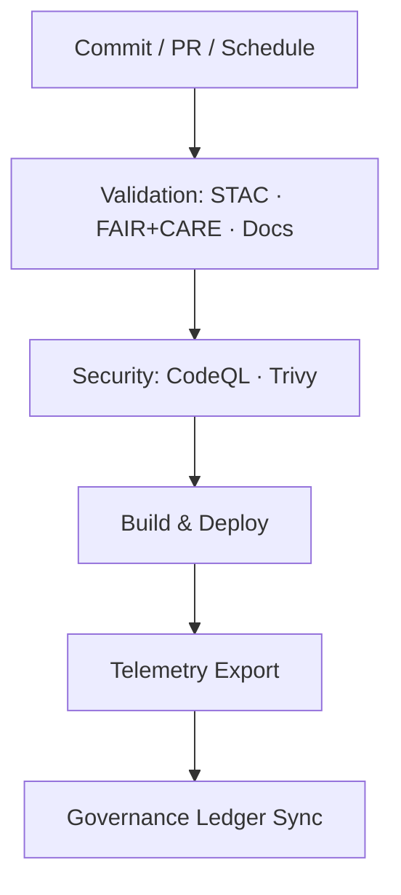

<div align="center">

# 🧩 **Kansas Frontier Matrix — GitHub Configuration & Automation Overview**  
`.github/README.md`

**Purpose:**  
Summarizes repository-level **automation, validation, security, and governance** for the Kansas Frontier Matrix (KFM).  
Defines **CI/CD pipelines, FAIR+CARE ethical checks, telemetry exports, and provenance binding** per **MCP-DL v6.3** and **Diamond⁹ Ω / Crown∞Ω** governance standards.

[](../docs/README.md)
[](../LICENSE)
[](../docs/standards/faircare.md)
[]()

</div>

---

## 📘 Overview
`.github/` defines **continuous validation, reproducibility, and governance enforcement**.  
All pipelines are automated using **GitHub Actions** and emit **telemetry**, **SBOM attestations**, and **governance ledger updates**.  
Workflows enforce FAIR+CARE, ISO 50001, ISO 14064, SLSA 1.0, and Master Coder Protocol v6.3 compliance.

---

## 🗂️ Directory Layout
```
.github/
├── ARCHITECTURE.md
├── README.md
│
├── workflows/
│   ├── stac-validate.yml          # STAC/DCAT schema validation
│   ├── faircare-validate.yml      # FAIR+CARE ethics audit
│   ├── docs-lint.yml              # Markdown/YAML/JSON lint
│   ├── codeql.yml                 # Static analysis
│   ├── trivy.yml                  # CVE + container scan
│   ├── build-and-deploy.yml       # Web build/deploy
│   ├── stac-dcat-bridge.yml       # STAC↔DCAT sync
│   ├── telemetry-export.yml       # Telemetry aggregator
│   └── ai-model-audit.yml         # AI bias/drift audit
│
├── ISSUE_TEMPLATE/
│   ├── data_submission.yml
│   ├── feature_request.yml
│   ├── bug_report.yml
│   └── governance_form.yml
│
├── pull_request_template.md
├── dependabot.yml
├── SECURITY.md
└── FUNDING.yml
```

---

## 🔁 Continuous Integration (CI)
| Stage | Workflow | Enforces | Artifacts |
|-------|-----------|-----------|------------|
| Data Validation | `stac-validate.yml` | STAC 1.0 / DCAT 3.0 structure | `reports/self-validation/stac/` |
| FAIR+CARE Audit | `faircare-validate.yml` | Provenance + Ethics | `reports/fair/faircare_summary.json` |
| Docs Lint | `docs-lint.yml` | Heading / table / link rules | `reports/self-validation/docs/` |
| Security | `codeql.yml` + `trivy.yml` | Code + CVE scanning | `reports/security/*` |
| AI Audit | `ai-model-audit.yml` | Bias / drift / explainability | `reports/audit/ai_model_faircare.json` |
| Build + Deploy | `build-and-deploy.yml` | React build + artifact export | `docs/reports/telemetry/build_metrics.json` |

Each workflow must pass before merge; outputs are aggregated into  
`releases/v10.0.0/focus-telemetry.json`.

---

## 🚀 Continuous Deployment (CD)
1. **Build Frontend** (Node/Vite)  
2. **Deploy Static Site** (GitHub Pages / S3)  
3. **Export Telemetry** → `focus-telemetry.json`  
4. **Bind Provenance** → `manifest.zip`, `sbom.spdx.json`

> API documentation is generated from FastAPI (`/docs`) and versioned with each release.

---

## ⚙️ Workflow → Artifact Mapping
| Workflow | Output | Location |
|-----------|---------|-----------|
| `stac-validate.yml` | STAC summary + NDJSON log | `reports/self-validation/stac/` |
| `faircare-validate.yml` | FAIR+CARE audit log | `reports/fair/` |
| `docs-lint.yml` | Lint summary | `reports/self-validation/docs/` |
| `codeql.yml` | SARIF | `reports/security/codeql/` |
| `trivy.yml` | CVE JSON | `reports/security/trivy/` |
| `build-and-deploy.yml` | Build metrics | `docs/reports/telemetry/` |
| `telemetry-export.yml` | Aggregated telemetry | `releases/v10.0.0/` |
| `ai-model-audit.yml` | AI audit | `reports/audit/` |

---

## 🧮 Automation Flow


---

## 🧠 Governance & Ethics
| Layer | Standard | Automation |
|--------|-----------|-------------|
| FAIR | Findable / Accessible / Interoperable / Reusable | STAC validate |
| CARE | Collective Benefit / Authority / Responsibility / Ethics | Governance forms + review |
| MCP-DL | Docs-as-Code + Telemetry | Docs lint + telemetry export |
| ISO 50001 / 14064 | Energy & Carbon Management | Sustainability telemetry |
| SLSA / SBOM | Supply-Chain Integrity | SPDX manifest + attestation |

Ledgered outputs:  
`docs/reports/audit/{governance-ledger.json,github-workflows-ledger.json}`

---

## 🔒 Security Posture
| Control | Mechanism | Policy |
|----------|------------|---------|
| Static Analysis | CodeQL | SARIF review required |
| CVE Scanning | Trivy | Fail on CRITICAL |
| Dependency Updates | Dependabot | Weekly PRs |
| Branch Protection | GitHub Rules | 2 reviews + passing CI |
| Secrets | Encrypted Secrets | Rotated quarterly |

See `.github/SECURITY.md` for disclosure procedures.

---

## 📊 Telemetry & Reporting
`focus-telemetry.json` consolidates:
- Workflow status + durations  
- FAIR+CARE compliance scores  
- STAC/DCAT validation metrics  
- Security scan summaries  
- SBOM hashes + release links  
- Commit / author metadata  

Feeds dashboards in `docs/reports/telemetry/`.

---

## 🗺️ Cross-References
- [⚙️ CI/CD Architecture](ARCHITECTURE.md)  
- [📘 Docs Index](../docs/README.md)  
- [🏗 System Architecture](../src/ARCHITECTURE.md)  
- [📑 Markdown Rules](../docs/standards/markdown_rules.md)  
- [⚖️ FAIR+CARE Framework](../docs/standards/faircare.md)

---

## 🕰️ Version History
| Version | Date | Author | Summary |
|----------|------|---------|----------|
| v10.0.0 | 2025-11-09 | FAIR+CARE Council | Added AI audit workflow, ISO 50001 telemetry, ledger sync, and SBOM v10 compliance. |
| v9.7.0 | 2025-05-05 | DevSecOps Team | Introduced telemetry aggregation and FAIR+CARE auto-audits. |
| v9.5.0 | 2025-02-01 | Core Team | STAC↔DCAT bridge and ethics validation automation. |

---

<div align="center">

© 2025 Kansas Frontier Matrix · MIT License  
Master Coder Protocol v6.3 · FAIR+CARE Certified · Diamond⁹ Ω / Crown∞Ω Ultimate Certified  
[Back to Docs Index](../docs/README.md) · [View CI/CD Architecture](ARCHITECTURE.md)

</div>