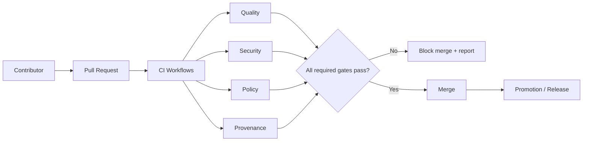
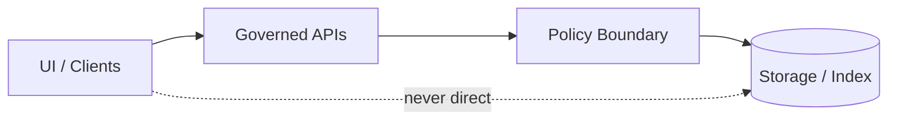

<!-- [KFM_META_BLOCK_V2]
doc_id: kfm://doc/3c0d5c1f-14d4-4b4f-9b2b-9bc3d5c1c7b0
title: .github/README — GitHub Governance & Community Files
type: standard
version: v2
status: draft
owners: kfm-engineering; kfm-governance
created: 2026-02-22
updated: 2026-02-26
policy_label: restricted
related:
  - kfm://doc/kfm-definitive-design-governance-guide-vnext
  - ../README.md
  - ./CONTRIBUTING.md
  - ./SECURITY.md
  - ./CODE_OF_CONDUCT.md
tags:
  - kfm
  - github
  - governance
notes:
  - Badge row uses Shields.io (static) until repo identifiers are wired for dynamic badges.
  - This README is the GitHub-side “trust membrane”: templates + workflows + required checks registry.
  - Added explicit mapping: Promotion Contract gates (A–F) → required checks and workflows.
  - Added “anti-skip” guidance: ensure a merge-required gate cannot be skipped by path filters/conditions.
[/KFM_META_BLOCK_V2] -->

<a id="top"></a>

# KFM GitHub Operations
Map-first • time-aware • governed delivery — **community files + CI/policy gate index**

**Status:** Draft (v2) • **Owners:** KFM Engineering + Governance  
**Core posture:** default-deny • fail-closed • reproducible by digest • policy enforced in CI + runtime


[Quick start](#quick-start) •
[Scope](#scope) •
[Directory contract](#directory-contract) •
[Reality check](#reality-check) •
[Wiring checklist](#wiring-checklist) •
[Folder map](#folder-map) •
[Required GitHub settings](#required-github-settings) •
[Workflow inventory](#workflow-inventory) •
[Promotion Contract mapping](#promotion-contract-mapping) •
[Required checks registry](#required-checks-registry) •
[CI and promotion gates](#ci-and-promotion-gates) •
[Issue and PR templates](#issue-and-pr-templates) •
[Governance and policy](#governance-and-policy) •
[Security](#security-and-responsible-disclosure) •
[Contacts](#contacts-and-owners) •
[Definition of Done](#definition-of-done)

---

## Quick start

- **Filing an issue:** use the templates in `.github/ISSUE_TEMPLATE/` (bug, feature, governance, data/pipeline, story node).
- **Opening a PR:** follow `CONTRIBUTING.md`, keep changes small, and include evidence (links, citations, or artifact hashes).
- **Changing data/policy behavior:** expect CI to **fail-closed** until promotion/metadata/policy gates pass.

> [!NOTE]
> This README is an **index + contract** for the GitHub-side “trust membrane” (workflows, templates, and guardrails).  
> If a link 404s, treat the linked artifact as **missing** (and therefore **merge-blocking** if it is required by contract).

---

## Scope

**This README *is*:**
- an index of the repo’s **community health files** (CONTRIBUTING, CODE_OF_CONDUCT, SECURITY, templates)
- an index of **governance & promotion gates** enforced by CI
- a **registry of required status checks** branch protection / rulesets should enforce

**This README is *not*:**
- product documentation (see repo root `README.md` and `/docs`)
- policy source-of-truth (see governance docs and policy-as-code bundle referenced by MetaBlock)

> [!WARNING]
> Do not “fix” failing gates by weakening them. Fix the underlying metadata, provenance, tests, redaction/generalization, or rights.

---

## Directory contract

This section makes `.github/` behave like a governed module.

### Where it fits

`.github/` is the repo’s **merge-time trust membrane**: it defines what GitHub enforces (templates, CODEOWNERS routing, and CI gates).

### Acceptable inputs

- Community health files (`CONTRIBUTING.md`, `SECURITY.md`, `CODE_OF_CONDUCT.md`, optional `SUPPORT.md`)
- Issue forms and PR templates (YAML/Markdown)
- CI workflows and shared composite actions used by workflows
- CODEOWNERS rules that route governance-critical changes

### Exclusions

- **Secrets** or credentials (never store in-repo)
- Operational runbooks and product docs that belong in `/docs`
- Dataset specs, catalogs, or policy bundles (those belong in their governed folders and are referenced from CI)

---

## Reality check

This README contains **placeholders** until the repo is wired (org/repo names, default branch, and *actual* emitted check names).

Before enforcing anything:
1. Confirm your org uses **repo rulesets** or **classic branch protection** (or both).
2. Confirm the workflows and jobs exist under `.github/workflows/`.
3. Open a PR and copy exact status check names from the PR **Checks** UI.

> [!IMPORTANT]
> **Fail-closed rule:** If a required check name is uncertain, keep it as “TBD” and do not loosen protection.
> Instead, run a PR to discover the emitted check names and update the registry.

---

## Wiring checklist

Fill these in **once**, then convert badges + branch protection from placeholders → reality.

| Wiring item | Where it is used | Current value | Target value |
|---|---|---|---|
| Org | Dynamic badges, links | `<ORG>` | TODO |
| Repo | Dynamic badges, links | `<REPO>` | TODO |
| Default branch | Dynamic badges, rulesets | `<DEFAULT_BRANCH>` | TODO |
| Ruleset / protection name | Admin UI + audit trail | `<RULESET_NAME>` | TODO |
| Workflow filenames | Required check mapping | `ci.yml`, `policy-gates.yml`, `provenance-audit.yml`, `release.yml` | TODO |
| Required check names | Branch protection / rulesets | placeholders below | TODO |

> [!TIP]
> The safest way to fill in **Required check names** is to open a PR and copy exact names from the PR **Checks** UI.
> Don’t guess—GitHub check names vary with workflow/job names and reusable workflow wrappers.

---

## Folder map

Recommended (minimum) structure for `.github/`:

```text
.github/                                           # Repo governance + CI (gatehouse)
├─ README.md                                       # This file: governance/CI index + where to start
├─ CODEOWNERS                                      # REQUIRED: ownership + review routing
├─ CODE_OF_CONDUCT.md                              # REQUIRED (public-ish): community standards + enforcement scope
├─ CONTRIBUTING.md                                 # REQUIRED: contribution workflow + how gates work
├─ SECURITY.md                                     # REQUIRED: vuln reporting process + disclosure policy
│
├─ SUPPORT.md                                      # Optional: where/how to get help (channels, office hours, links)
├─ FUNDING.yml                                     # Optional: Sponsors/funding links (if applicable)
├─ dependabot.yml                                  # Optional: dependency update policy (minimal + governed if enabled)
│
├─ PULL_REQUEST_TEMPLATE.md                        # Optional: single default PR template
├─ PULL_REQUEST_TEMPLATE/                          # Optional: multiple PR templates (?template=... URL param)
│  ├─ default.md                                   # General PR checklist
│  ├─ governance.md                                # Governance/policy-impact PR checklist
│  └─ data-pipeline.md                             # Data/pipeline promotion PR checklist
│
├─ ISSUE_TEMPLATE/                                 # Recommended: issue forms (triage + governance discipline)
│  ├─ config.yml                                   # Template chooser (contact_links + blank_issues_enabled)
│  ├─ bug_report.yml                               # Bug report intake (repro, logs, expected/actual)
│  ├─ feature_request.yml                          # Feature request intake (scope, rationale, acceptance criteria)
│  ├─ governance_request.yml                       # Governance changes (labels, standards, gates)
│  ├─ data_pipeline_change.yml                     # Pipeline changes (inputs/outputs, validation, promotion impact)
│  └─ story_node.yml                               # Story Node intake (citations, assets, review requirements)
│
├─ DISCUSSION_TEMPLATE/                            # Optional: discussion category forms (YAML)
│  └─ <category-slug>.yml                          # Filename must match discussion category slug
│
├─ actions/                                        # Optional: shared composite actions used by workflows
│  └─ <action-name>/action.yml
│
└─ workflows/                                      # REQUIRED: CI + policy gates + release/promotion gates
   ├─ ci.yml                                       # Core CI (lint, unit tests, build, linkcheck)
   ├─ policy-gates.yml                             # Policy checks (labels, redaction, story claim hygiene) — fail-closed
   ├─ provenance-audit.yml                         # Promotion eligibility: receipts/manifests/checksums — fail-closed
   ├─ codeql.yml                                   # Optional: code scanning / SAST (if enabled)
   ├─ dependency-review.yml                        # Optional: dependency diff gate (if enabled)
   └─ release.yml                                  # Release/promotion orchestration (tags, packaging, attestations)
```

### Required files checklist

| File | Why it exists | Minimum expectation |
|---|---|---|
| `CODEOWNERS` | Routes required reviews (governance, data, policy) | Patterns cover governance + data promotion paths |
| `CONTRIBUTING.md` | Contributor workflow + guardrails | Explains PR expectations + how gates work |
| `CODE_OF_CONDUCT.md` | Community standards | Publicly readable; includes enforcement scope |
| `SECURITY.md` | Responsible disclosure | Private reporting path; “don’t post exploits in issues” |
| `.github/workflows/*` | Automated gates | Emits stable, required check names |

> [!NOTE]
> GitHub also supports org-wide default community health files via a dedicated `.github` repository.
> If your org uses defaults, per-repo files should override intentionally (and be reviewed as governance-critical).

### CODEOWNERS expectations

`CODEOWNERS` is the router for required reviews. Minimum expectation:

- governance-sensitive files route to **kfm-governance**
- build/runtime code routes to **kfm-engineering**
- data promotion artifacts route to **both** (default-deny if unclear)

Example (replace with repo-real paths):

```text
# Global default
* @kfm-engineering

# Governance & trust membrane
.github/** @kfm-engineering @kfm-governance
/docs/governance/** @kfm-governance
/policy/** @kfm-governance
/contracts/** @kfm-governance @kfm-engineering

# Data + pipelines (example)
data/** @kfm-engineering @kfm-governance
pipelines/** @kfm-engineering @kfm-governance
```

> [!TIP]
> Keep CODEOWNERS patterns boring. Prefer directories over fragile filename rules.

---

## Required GitHub settings

These settings must align with workflows and required checks below.

### Default-branch protection baseline

Recommended for the default branch (ruleset or classic branch protection):

- Require PRs (no direct pushes)
- Require approvals (≥ 1; increase for sensitive repos)
- Require CODEOWNERS review
- Require status checks to pass (see **Required checks registry**)
- Require conversation resolution (recommended)
- Restrict who can push to the default branch (recommended)

> [!WARNING]
> If protection requires a check that no longer exists, merges can become permanently blocked.
> If a workflow/job is renamed, update protection **in the same PR** as the rename.

### Security feature baseline

Enable (where available):

- secret scanning (and push protection, if available)
- dependency alerts and (optionally) dependency updates (Dependabot)
- code scanning / SAST (or a documented substitute)

> [!IMPORTANT]
> These settings are repo-tier dependent (private/public, plan/org policies).
> If a feature isn’t available, document a substitute (and enforce it via CI where possible).

---

## Workflow inventory

This section documents the *intended* responsibilities of each workflow file.

| Workflow file | Purpose | Fail-closed expectation | Typical outputs (examples) |
|---|---|---|---|
| `.github/workflows/ci.yml` | Build/test/lint/typecheck for code and docs | PR cannot merge if checks fail or do not run | test reports, build artifacts, lint summaries |
| `.github/workflows/policy-gates.yml` | Policy label checks, sensitive-location/redaction checks, Story Node claim hygiene | PR blocked if policy/sensitivity is unclear | policy decision log, redaction scan report |
| `.github/workflows/provenance-audit.yml` | Promotion eligibility verification (spec_hash stability, receipts/manifests, checksums) | Promotion blocked if provenance/audit is incomplete | audit record summary, checksum report, manifest lint |
| `.github/workflows/release.yml` | Release/promotion orchestration (tagging, packaging, publish) | No RAW→Published jumps; gates must pass | release manifest, SBOM/attestations (if enabled), publish logs |

> [!NOTE]
> This table is a **contract**. If you add a workflow, add it here.
> If you remove/rename a workflow, update this table and protection rulesets in the same PR.

---

## Promotion Contract mapping

KFM’s Promotion Contract turns governance intent into enforceable behavior. In GitHub terms:
- CI must block merges when required promotion artifacts are missing or invalid.
- Release/promotion workflows must block promotion when gates fail.

### Gates A–F (minimum) → CI responsibilities

| Promotion Contract gate | What it means (summary) | What CI must check (typical) |
|---|---|---|
| **Gate A: Identity and versioning** | Dataset + DatasetVersion are stable and deterministic | `spec_hash` stability test; naming convention lint; manifest presence |
| **Gate B: Licensing and rights metadata** | License, rights holder, attribution are explicit; unclear → quarantine | rights/terms metadata present; SPDX/rights lint; “metadata-only” allowed where needed |
| **Gate C: Sensitivity classification and redaction plan** | policy_label assigned; sensitive data has a generalization/redaction plan recorded in lineage | policy_label present + valid; redaction/generalization proof; sensitive-location defaults |
| **Gate D: Catalog triplet validation** | DCAT/STAC/PROV exist, validate under profile, and cross-link correctly | schema validation; link-check; EvidenceRef resolvability |
| **Gate E: Run receipt and checksums** | Each producing run has a receipt; inputs/outputs enumerated with digests | receipts present; checksums match; env capture (image digest, parameters) |
| **Gate F: Policy tests and contract tests** | Policy fixtures pass; evidence resolver & API contracts validate | fixtures-driven policy tests; evidence resolver contract tests; OpenAPI/schema checks |

> [!IMPORTANT]
> This mapping is the “why” behind required checks. If protection doesn’t enforce these categories,
> KFM’s fail-closed posture is not real.

### Anti-skip rule

A required gate MUST NOT be skippable via:
- `paths:` filters that accidentally exclude it,
- `if:` conditions that bypass it,
- upstream job failures that prevent the “required” job from running.

**Recommended pattern:** include a final “gate summary” job that always runs and fails if any required sub-gate did not run or did not pass. Mark *that* summary job as the required status check.

---

## Required checks registry

Branch protection / rulesets should require a stable set of checks corresponding to the gate categories above.

> [!IMPORTANT]
> **Check names are repo-specific.** Replace placeholders with the *actual* status check names emitted by your workflows.

### Status check naming pitfalls

- **Skipped jobs can look “green.”** If a required gate can be skipped, fail-closed is compromised.
- **Downstream jobs may be skipped** when an upstream job fails; be careful which job you mark “required”.
- **Reusable workflows can change name formats.** Copy the exact name from the PR Checks UI.

### Registry table (placeholders)

| Gate | Required check name (placeholder) | Source workflow | Notes |
|---|---|---|---|
| Gate A (Identity) | `promotion / identity-versioning` | `provenance-audit.yml` or `ci.yml` | spec_hash stability + naming + manifest |
| Gate B (Rights) | `promotion / rights-licensing` | `policy-gates.yml` or `provenance-audit.yml` | quarantine if unclear |
| Gate C (Sensitivity) | `policy / sensitivity-redaction` | `policy-gates.yml` | default-deny; generalized derivatives |
| Gate D (Catalogs) | `catalog / validate-linkcheck` | `ci.yml` or `provenance-audit.yml` | DCAT/STAC/PROV profile + cross-links |
| Gate E (Receipts) | `provenance / receipts-checksums` | `provenance-audit.yml` | receipts + digests + env capture |
| Gate F (Policy/Contracts) | `policy / fixtures-contracts` | `policy-gates.yml` + `ci.yml` | fixtures-driven policy tests; API/schema |

**Quality gates (recommended additional required checks):**
- `ci / lint`
- `ci / build-test`
- `ci / docs-linkcheck` (if docs are part of deliverable)
- `security / secret-scan` (or substitute)
- `security / dependency-review` (or substitute)

### When a required check goes missing

If merges become blocked because a required check “doesn’t exist”:

1. Confirm the workflow still exists at the referenced path under `.github/workflows/`.
2. Confirm workflow/job names in YAML didn’t change.
3. Open a PR and confirm the check name in the PR Checks list.
4. Update rulesets/branch protection in the same PR that changed workflow/job names.

---

## CI and promotion gates

KFM uses fail-closed gates to protect integrity, provenance, rights, and policy obligations.



### PR-based promotion workflow (recommended)

Promotion should be social + technical, not ad hoc:

1) Contributor opens PR adding:
- source registry entry
- dataset spec / pipeline spec
- small fixtures + expected outputs (where feasible)

2) CI runs:
- schema validation
- fixtures-driven policy tests
- spec_hash stability test
- catalog/profile validation + link-check

3) Steward review:
- licensing/rights clarity
- sensitivity classification + redaction/generalization plan

4) Operator merges and triggers a controlled pipeline run.

5) Outputs are written to processed + catalogs.

6) Release/promotion manifest is created and tagged.

---

## Trust membrane reminder



- UI/clients **must not** talk to storage/DB directly.
- Core/domain logic **must not** bypass repositories to reach storage.
- Policy boundary decisions should be **auditable**.

---

## Issue and PR templates

### Issue templates

Use templates to keep triage consistent:

- **Bug report:** expected vs actual, reproducible steps, logs/artifacts.
- **Feature request:** user story, acceptance criteria, policy impacts.
- **Governance request:** policy label changes, redaction guidance, release criteria.
- **Data/pipeline change:** source/license, schema, validation rules, promotion plan.
- **Story Node:** narrative claim + EvidenceRefs + map footprint + time bounds.

### PR expectations

A PR should include:

- scope: what changed + why
- evidence: links/artifact IDs/checksums (as applicable)
- tests: added/updated, or justification if not possible
- rollback: how to revert safely
- governance: policy labels, redaction notes, approval path

> [!TIP]
> For governance-sensitive PRs, ensure `CODEOWNERS` routes review to both engineering and governance owners.

---

## Governance and policy

Non-negotiables enforced through CI + review:

- **Evidence-first:** every claim should link back to resolvable evidence (or be explicitly marked unknown).
- **Promotion Contract:** no RAW → Published jumps; each promotion emits receipts + audit entries.
- **Default-deny:** if sensitivity is unclear, deny publication; generalize/redact; request governance review.
- **Rights-aware:** “online ≠ permission”; rights metadata is enforced in UI/export paths.

---

## Security and responsible disclosure

- Use `SECURITY.md` for reporting vulnerabilities.
- Never post secrets or exploit details in public issues.
- Security fixes should land with tests and clear rollback notes.

> [!NOTE]
> If secret scanning / push protection is enabled, treat alerts as merge-blocking for protected branches.

---

## Badge maintenance

Badges at the top use Shields.io and are intentionally **static** until org/repo identifiers and workflow filenames are finalized.

When ready, swap in dynamic badges (examples):

```md


```

> [!TIP]
> Once wired, delete the “repo-wiring pending” badge and replace it with one or more workflow badges.

---

## Contacts and owners

- **Engineering owners:** see `CODEOWNERS`
- **Governance owners:** see `CODEOWNERS`
- **Security contact:** see `SECURITY.md`

---

## Definition of Done

### Content & structure

- [ ] Badges render and reflect reality (or are clearly marked “static”)
- [ ] At least one Mermaid diagram renders
- [ ] Directory contract section is present (acceptable inputs + exclusions)
- [ ] Directory tree is present and matches current structure
- [ ] Templates exist for the main work types (bug/feature/governance/data/story)
- [ ] Links are relative and lintable (no broken internal links)
- [ ] Wiring checklist is complete (no `<ORG>`, `<REPO>`, `<DEFAULT_BRANCH>` left behind)

### Governance & enforcement

- [ ] Workflows enforce fail-closed behavior for Promotion Contract gates (A–F)
- [ ] Required checks registry matches actual emitted check names used by rulesets/branch protection
- [ ] Policy fixtures run in CI (not only locally)
- [ ] Evidence resolver contract tests exist (at least one EvidenceRef resolvable in CI)
- [ ] Workflow inventory is kept current when workflows change
- [ ] Rulesets/branch protection updated whenever workflow/job names change

---

[Back to top](#top)
