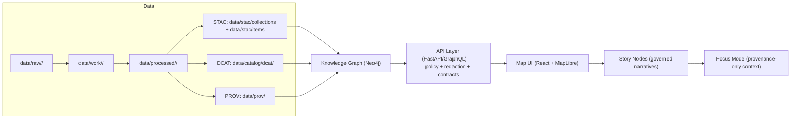
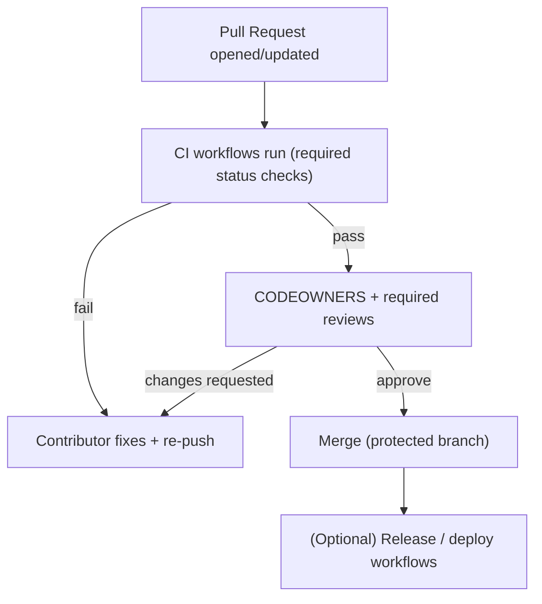
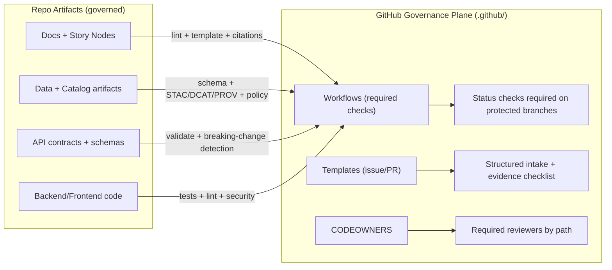

# Kansas Frontier Matrix (KFM) — `.github/` Governance Automation

> [!IMPORTANT]
> **Governed document.** This README describes **GitHub-native governance controls** (CI workflows + contribution templates + review routing) that enforce KFM’s core invariants **at merge time**. Documentation is treated as part of the system’s contract (not “just notes”), so changes here are subject to the same rigor as code changes.

`.github/` exists to make KFM governance **enforceable and reviewable**:
- **Evidence-first**: no narrative, dataset, or AI output ships without provenance.
- **Contract-first**: schemas and API contracts are treated as first-class, versioned artifacts.
- **Trust membrane**: clients do not access databases directly; all access is mediated by the governed API layer.

> [!NOTE]
> This README explains **what `.github/` is responsible for** (automation + contribution UX).
> For canonical system architecture + pipeline ordering, start with:
> - `../docs/MASTER_GUIDE_v13.md` *(expected per KFM docs; not confirmed in this repo snapshot)*
> - `../docs/architecture/` *(not confirmed in this repo snapshot)*
> - `../docs/standards/` *(where Markdown + governance protocols typically live; not confirmed in this repo snapshot)*

---

## 📘 Overview

### Purpose

`.github/` is the **governance control plane** for KFM’s repo:
- enforces baseline quality and policy checks automatically (CI “gates”),
- standardizes how work enters the repo (issues/PRs),
- routes changes to the right reviewers (CODEOWNERS),
- blocks bypass paths that violate KFM invariants (pipeline, contracts, sensitivity controls).

### Scope

| In scope for `.github/` | Out of scope for `.github/` |
|---|---|
| GitHub Actions workflows (CI gates, validation, scans, reports) | Defining canonical standards/policies (live under `../docs/` and `../policy/` if present) |
| PR / issue templates (structured intake + governance checklists) | Implementing validators/schemas/runtime services (live outside `.github/`) |
| CODEOWNERS (review routing) | Changing system architecture decisions (documented elsewhere; reviewed via normal design processes) |
| (If present) Dependabot and security policy links | Data processing logic / ETL scripts / ingestion implementations |

### Audience

- Contributors opening issues and PRs
- Reviewers/maintainers enforcing governance
- Governance/ethics reviewers (FAIR+CARE, sovereignty, sensitivity)

### Definitions

| Term | Meaning in KFM |
|---|---|
| **Governed** | Changes are subject to CI gates + review routing + policy checks before merge. |
| **Gate** | A required validation step that blocks merge on failure. |
| **Boundary artifact** | Output produced at a layer boundary (e.g., STAC/DCAT/PROV, contracts, validation reports). |
| **Trust membrane** | The rule that **all access is mediated** (no UI→DB or core→DB direct access). |
| **Evidence-first** | Factual claims and published artifacts must be provenance-linked (dataset IDs, catalog records, citations). |
| **Contract-first** | Interfaces/schemas are versioned artifacts; changes must be explicit, validated, and reviewed. |
| **Safe-by-default** | When sensitive content is possible, prefer redaction/generalization and route for governance review. |

### Key artifacts & references (expected)

> [!NOTE]
> Paths may differ by repo; treat this list as a “canonical intent” and update to match the real layout.

- **Master guide (pipeline + repo structure):** `docs/MASTER_GUIDE_v13.md`
- **Markdown governance + templates:**
  - `docs/templates/TEMPLATE__KFM_UNIVERSAL_DOC.md`
  - `docs/templates/TEMPLATE__STORY_NODE_V3.md`
  - `docs/templates/TEMPLATE__API_CONTRACT_EXTENSION.md`
  - `docs/standards/` *(Markdown protocol / work protocol / ChatGPT protocol, etc.)*
- **Governance & policy:** `docs/governance/` *(e.g., ROOT_GOVERNANCE, ETHICS, SOVEREIGNTY)*
- **CI checklists (optional but recommended):** `docs/ci/` *(e.g., PR checklists, validation runbooks)*

### Definition of Done (for changes under `.github/`)

- [ ] Workflows follow **least privilege** (`GITHUB_TOKEN` permissions minimized per job).
- [ ] New/changed gates are **documented** (what they check, why, and how to fix failures).
- [ ] Gates are **deterministic** (pinned tool versions; no “works sometimes” checks).
- [ ] Governance checks **fail closed** (missing provenance/metadata blocks merge).
- [ ] Workflow outputs are **reviewable** (reports uploaded as build artifacts).
- [ ] High-risk governance changes have **required reviewers** (CODEOWNERS enforced).
- [ ] Any repo pointers updated here are marked *(not confirmed in repo)* until verified.

---

## 🗂️ Directory Layout

> [!NOTE]
> This is a **typical** `.github/` layout. Treat this as an expectation checklist, not a claim that each file exists.

| Path | Purpose | Governance effect |
|---|---|---|
| `.github/workflows/` | CI pipelines (tests, lint, validators, scans) | Automated merge gating |
| `.github/ISSUE_TEMPLATE/` | Structured issue intake | Better triage; prevents under-specified requests |
| `.github/PULL_REQUEST_TEMPLATE.md` *(or repo root)* | PR checklist | Forces evidence + validation notes |
| `.github/CODEOWNERS` *(or repo root)* | Required-review routing | “Right eyes on right changes” |
| `.github/dependabot.yml` *(if present)* | Dependency update automation | Supply-chain hygiene + controlled upgrades |
| `SECURITY.md` *(often repo root)* | Vulnerability disclosure | Security governance process |

---

## 🧭 Context

KFM is a pipeline–catalog–database–API–UI system where **every stage emits boundary artifacts** and **every merge is gated by validation**.

### Non‑negotiable invariants (what `.github/` must protect)

1. **Canonical pipeline order**  
   Raw → Work → Processed → Catalog/PROV → Database → API → UI  
   *(Shortcuts are treated as design defects unless explicitly justified and reviewed.)*

2. **Trust membrane (no bypass paths)**  
   - UI/external clients never connect directly to PostGIS/Neo4j.
   - Backend business logic never bypasses repository interfaces to talk directly to storage.
   - The API layer is the unified “trust gate” for validation + policy checks.

3. **Provenance-first publishing**  
   - Datasets are not “published” until required catalog artifacts exist (STAC/DCAT/PROV).
   - Story Nodes and Focus Mode outputs must remain provenance-linked (no unsourced assertions).

4. **FAIR + CARE / sovereignty aware**  
   - Sensitive content may require redaction/generalization.
   - Exact locations for protected/culturally restricted sites are treated as high-risk.
   - “Open data” defaults must not override CARE obligations.

> [!IMPORTANT]
> `.github/` workflows **enforce** these rules; they do **not define** them. If a rule matters, it should exist
> (a) as an authoritative standard/policy doc **and** (b) as an enforceable check where feasible.

---

## 🗺️ Diagrams

### Pipeline map (system truth path)



### PR governance flow (merge-time enforcement)



### Governance control plane (what GitHub enforces)



---

## 📦 Data & Metadata (Governance Artifact Registry)

This section treats `.github/` files as **boundary artifacts**: they encode “how the repo decides what ships.”

> [!NOTE]
> Populate the “Exists?” column after verifying your repo’s actual contents.

| Artifact | Path (expected) | Exists? | What it enforces | Review owner(s) |
|---|---|---:|---|---|
| Workflow gates | `.github/workflows/*` | ☐ | Required checks (tests, validators, scans) | Dev + Governance + Security (varies by gate) |
| Review routing | `.github/CODEOWNERS` | ☐ | Forces required reviewers on sensitive paths | Maintainers |
| PR checklist | `.github/PULL_REQUEST_TEMPLATE.md` | ☐ | Evidence + validation + risk disclosure | Maintainers |
| Issue templates | `.github/ISSUE_TEMPLATE/*` | ☐ | Prevents under-specified work requests | Maintainers |
| Dependency updates | `.github/dependabot.yml` | ☐ | Controlled upgrades; supply-chain hygiene | Maintainers + Security |
| Security policy | `SECURITY.md` | ☐ | Disclosure + response expectations | Security |

---

## 🧱 Architecture alignment (why `.github/` can’t be “just CI”)

KFM’s clean architecture and trust membrane imply enforcement points:
- the UI consumes the public API (no direct DB connections),
- the backend uses repository interfaces (no service-layer direct DB access),
- interfaces/contracts are versioned and validated,
- the API layer is where policy checks and redaction happen.

**Implication for `.github/`:** CI must detect and block changes that introduce bypass paths (e.g., UI code adding DB drivers, or backend services skipping repository interfaces).

---

## 🧪 Validation & CI/CD

CI is the automated “governance membrane” that blocks merges when a change violates KFM rules.

> [!IMPORTANT]
> Workflow filenames differ by repo. Document the authoritative workflow names below **after** confirming `.github/workflows/`.

### CI gate checklist (expected)

| Gate | What it checks | Why it matters | Typical fix |
|---|---|---|---|
| **Code quality** | unit/integration tests; type checks; lint | prevents regressions & drift from contracts | fix tests/types; update adapters |
| **Docs governance** | Markdown lint; required template sections; link checks | keeps docs machine-ingestible and UI-safe | fix headings/sections; repair links |
| **Contract governance** | OpenAPI/GraphQL validation; breaking-change detection | prevents silent contract breaks | version contract; add compatibility notes |
| **Dataset governance** | schema validation; geometry checks; required metadata | treats data like build artifacts | fix pipeline output; add metadata |
| **Catalog governance** | STAC/DCAT/PROV integrity + cross-link validation | makes provenance navigable | regenerate catalogs; fix IDs/links |
| **Policy-as-code** *(if present)* | OPA/Rego (Conftest or equivalent) | blocks policy violations pre-merge | add tags/licenses; redact restricted info |
| **Story Nodes** | Template v3 compliance; **every factual claim cited** | prevents unsourced narratives | add citations; separate fact vs interpretation |
| **Focus Mode / AI** | AI outputs require citations + sensitivity compliance | prevents freeform/unsafe outputs | add citations; reduce sensitive detail |
| **Security hygiene** | secret scan; dependency alerts; SAST (if enabled) | reduces credential leaks and known-vuln drift | remove secrets; rotate; upgrade |

### Change-type → expected gates

| Change type | Must pass at minimum |
|---|---|
| Backend code | Code quality + Contract governance + Security hygiene |
| Frontend/UI | Code quality + Accessibility checks *(if configured)* + Contract governance |
| Docs only | Docs governance + Link checks + (Story Node checks if applicable) |
| Data only | Dataset governance + Catalog governance + Policy-as-code *(if present)* |
| Story Nodes | Story Node template + citation checks + sensitivity policy checks |
| Policy rules | Policy-as-code tests + policy lints + docs updates |
| CI/workflows | Workflow lint *(if configured)* + security posture review |

### Required status checks registry (fill in)

> [!TIP]
> Add your real workflow job names here (copy from branch protection settings).

| Required check (exact name) | Category | When it runs |
|---|---|---|
| *(not confirmed in repo)* | Code quality | PR |
| *(not confirmed in repo)* | Docs governance | PR |
| *(not confirmed in repo)* | Data/Catalog governance | PR |
| *(not confirmed in repo)* | Policy-as-code | PR |
| *(not confirmed in repo)* | Security hygiene | PR |

---

## ✅ Local pre-flight checklist (before opening a PR)

> [!NOTE]
> Commands vary by repo. Treat this as a recommended baseline.

- [ ] Run local checks (if configured), e.g.:
  ```bash
  pre-commit run --all-files
  ```
- [ ] Run backend tests:
  ```bash
  pytest
  ```
- [ ] Run frontend checks (if applicable):
  ```bash
  npm test
  npm run lint
  ```
- [ ] If you touched docs:
  - [ ] verify links resolve
  - [ ] verify template-required sections exist
  - [ ] verify heading hierarchy and any required callouts
- [ ] If you added/changed data:
  - [ ] ensure correct staging (`raw → work → processed`)
  - [ ] ensure boundary artifacts exist (STAC + DCAT + PROV)
  - [ ] ensure policy checks pass (sensitivity/license/citations)

---

## 🧠 Story Nodes & Focus Mode rules (what CI must protect)

### Story Nodes (governed narrative artifacts)

Story Nodes are **structured, machine-ingestible narrative datasets**:
- every factual statement is traceable to evidence,
- key entities reference stable identifiers,
- fact vs interpretation is clearly separated.

**Minimum expectations for Story Node PRs:**
- citations/provenance links for substantive claims
- no sensitive locations disclosed
- references resolve (IDs, links, catalog items)

### Focus Mode (hard gate)

Focus Mode is a provenance-only experience:
- **Only provenance-linked content appears**
- AI contributions must be **opt-in** and **clearly labeled**
- sensitive locations are **generalized or omitted** to prevent side-channel leaks

> [!WARNING]
> If your change could reveal sensitive locations or culturally restricted knowledge:
> - redact/generalize in data + narrative
> - flag for governance review
> - do not “work around” policy gates

---

## 🔐 Security & supply-chain posture (GitHub Actions)

When editing workflows, preserve these invariants:
- **Least privilege**: restrict `GITHUB_TOKEN` permissions per job.
- **Reproducibility**: prefer pinned tool versions; keep deterministic builds.
- **No secret-dependent validation** for core governance checks (so forks can run gates).
- **Fail closed** on governance rules (missing provenance/metadata should block).
- **Action hygiene**: prefer pinned action versions/SHAs where feasible.
- **Artifact transparency**: upload validation reports so reviewers can inspect failures.

> [!TIP]
> If you add a new gate, also add:
> - a brief “What it checks / How to fix” summary in CI logs,
> - a machine-readable report artifact (JSON/SARIF/Markdown summary).

---

## ⚖️ FAIR+CARE & Governance

### Sensitivity handling (CARE-forward)

Some data and narratives can cause harm if published without controls. Treat these as **high-risk**:
- exact coordinates for protected sites or culturally restricted places
- precise locations of vulnerable habitats/species (when relevant)
- personally identifying information or private landowner details (when relevant)

**Governance behavior expected in `.github/`:**
- policy checks should block merges when restricted content is detected
- docs and data should support redaction/generalization patterns (and label them)

> [!CAUTION]
> “It’s in a dataset” is not a justification to publish it.
> Governance requires evaluating downstream harm and applying minimum-necessary disclosure.

---

## 🧭 Where the rules live (repo pointers)

The `.github/` automation exists to enforce rules defined elsewhere:

- Master guide + canonical pipeline: `../docs/MASTER_GUIDE_v13.md` *(expected; not confirmed in this repo snapshot)*
- Templates:
  - `../docs/templates/TEMPLATE__KFM_UNIVERSAL_DOC.md`
  - `../docs/templates/TEMPLATE__STORY_NODE_V3.md`
  - `../docs/templates/TEMPLATE__API_CONTRACT_EXTENSION.md`
- Standards/profiles:
  - `../docs/standards/` *(STAC/DCAT/PROV + Markdown + ChatGPT work protocols)*
- Policy-as-code (if present): `../policy/` *(OPA/Rego)*

> [!NOTE]
> If any of these paths don’t match your repository layout, update the pointers here to reflect the canonical locations.

---

## 🧯 Governance exceptions (rare)

> [!IMPORTANT]
> Exceptions should be **time-boxed** and leave an audit trail.

If a gate must be bypassed (e.g., incident response):
- Open a “Governance Exception” issue with:
  - what’s being bypassed and why
  - scope (files/paths)
  - risk assessment
  - rollback plan
  - follow-up task to re-enable gates
- Require explicit approvals from maintainers + governance/security owners (per CODEOWNERS).

*(Exact exception workflow depends on repo policy; document it here once confirmed.)*

---

## 📦 Typical contents of `.github/`

<details>
<summary>Expand to see common files you may find here</summary>

- `.github/workflows/`  
  GitHub Actions pipelines (CI gates described above)
- `.github/ISSUE_TEMPLATE/`  
  Structured issue intake (bug reports, data requests, story proposals)
- `PULL_REQUEST_TEMPLATE.md`  
  The “governance membrane” checklist for reviewers and contributors
- `CODEOWNERS`  
  Routing for required reviews (docs, data, policy, API, UI)
- `.github/dependabot.yml` *(if present)*  
  Automated dependency updates (reviewed like code)
- `SECURITY.md` *(commonly repo root)*  
  Security reporting guidance
</details>

---

## 🕰️ Version history

| Version | Date | Summary | Author |
|---:|---|---|---|
| v0.1.0 | 2026-02-09 | Initial `.github/README.md` aligned to KFM governance concepts | TBD |
| v0.2.0 | 2026-02-09 | Expanded CI gates, clarified scope, added governance control-plane diagram, added artifact registry + status-check registry | TBD |