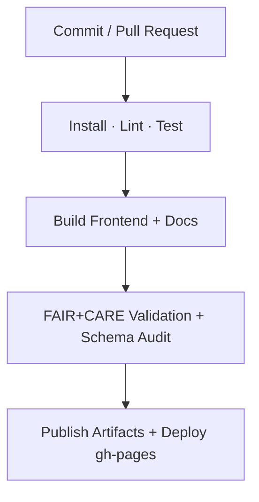
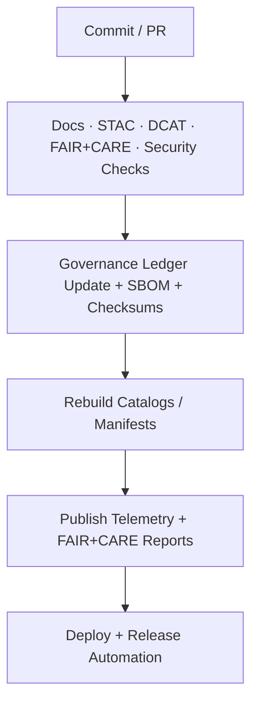

<div align="center">

# 🧩 **Kansas Frontier Matrix — GitHub Configuration & CI/CD Overview**  
`.github/README.md`

**Mission:** Document and govern GitHub Actions, community health, and automation for the KFM monorepo.  
Ensures continuous integration, **FAIR+CARE** validation, docs linting, and ethical AI governance under **MCP-DL v6.4.3 (Tier-Ω+∞)**.

[](./workflows/site.yml)
[](./workflows/stac-validate.yml)
[](./workflows/dcat-export.yml)
[](./workflows/docs-validate.yml)
[](./workflows/codeql.yml)
[](./workflows/trivy.yml)
[](./workflows/pre-commit.yml)
[](../docs/standards/faircare-validation.md)
[](../LICENSE)
[](../docs/architecture/repo-focus.md)

</div>

---

## 📚 Overview

The `.github/` directory defines **automation, governance, and community configuration** for KFM.

It governs:
- **GitHub Actions** for CI/CD, build, validation, and governance  
- **Issue / PR templates**, **CODEOWNERS**, **CONTRIBUTING**, **SECURITY**, **SUPPORT**  
- **FAIR+CARE** audits, **STAC/DCAT** validation, **docs checks**, **link validation**  
- **Provenance** (checksums, SBOM), **telemetry** logging, and **release governance**

All settings follow YAML-based transparency under **MCP-DL Docs-as-Code** principles.

---

## 🧠 Key Workflows

### 🧱 Build & Deployment — `site.yml`
Automates frontend (React + MapLibre) builds, docs site generation, and GitHub Pages/Netlify deployment.



Artifacts include: `dist/**`, `coverage/**`, and `reports/**`.

---

### 🧪 STAC Validation — `stac-validate.yml`
Validates **STAC 1.0** Items/Collections and schema alignment:

- STAC core schema & extensions  
- Temporal/spatial metadata presence  
- Asset media types & roles  
- Governance linkage (manifest + ledger)

Outputs stored in `reports/self-validation/**`.

---

### 🗂️ DCAT Export — `dcat-export.yml`
Generates **DCAT 3.0 JSON-LD** feeds aligned with STAC for data-portal interoperability.

- STAC → DCAT transformation  
- JSON-LD validation  
- Publication to `data/meta/` and release attachment

---

### 🔍 Code Quality & Security — `codeql.yml`, `trivy.yml`, `pre-commit.yml`

| Workflow | Tool | Purpose | Output |
|:--|:--|:--|:--|
| `codeql.yml` | CodeQL | Static code scanning (TS/Python/YAML) | `reports/security/codeql_analysis.json` |
| `trivy.yml` | Trivy | SBOM, CVE, and container scanning | `reports/security/trivy_scan_results.json` |
| `pre-commit.yml` | Pre-Commit | Linting, formatting, and policy enforcement | Inline annotations |

---

### 🧩 FAIR+CARE Validation — `faircare-validate.yml`
Automates ethical validation pipelines:

- FAIR metadata completeness in STAC/DCAT/READMEs  
- CARE principles: consent, sensitivity, provenance  
- Ledger verification in `reports/audit/**`

Outputs to `reports/fair/**` and `reports/audit/**`.

---

### 🧾 Governance Ledger — `governance-ledger.yml`
Manages immutable governance records and artifact provenance.

- SHA-256 checksum for datasets/manifests  
- Signed entries appended to `reports/audit/ai_hazards_ledger.json`  
- Focus telemetry: `../releases/v2.1.1/focus-telemetry.json`  
- SBOM publication: `../releases/v2.1.1/sbom.spdx.json`

---

### 📘 Docs Validation — `docs-validate.yml`
Validates documentation and metadata:

- Markdown linting, formatting, front-matter presence  
- Link checking (internal/external)  
- Mermaid diagram syntax pre-checks  
- FAIR+CARE metadata enforcement

---

## 🧩 Community Configuration

### 🧰 Issue Templates
- `bug_report.yml` — Report validation or schema issues  
- `feature_request.yml` — Propose enhancements  
- `governance_review.yml` — Ethics & FAIR+CARE discussions  
- `data_request.yaml` — Request dataset/API integration  
- `data_submission.yml` — Submit dataset for ingestion

All templates enforce **provenance**, **license**, and **FAIR+CARE** fields.

---

### 💬 Pull Request Template
PRs include:
- Purpose + context  
- Schema + license validation  
- Governance references (`manifest_ref`, `sbom_ref`, `governance_ref`)  
- Required checks: STAC, DCAT, FAIR+CARE, security, docs-validate  

---

### 👥 CODEOWNERS & CONTRIBUTING
- **CODEOWNERS** defines maintainers per domain (e.g., `/data/**` → `@kfm-etl-ops`).  
- **CONTRIBUTING.md** documents commit style, docs rules, and FAIR+CARE policy.  
- **SECURITY.md** details vuln disclosure and patch handling.  
- **SUPPORT.md** covers triage and community issue processes.

---

## ⚙️ Directory Layout

```bash
.github/
├── README.md
├── workflows/
│   ├── site.yml
│   ├── stac-validate.yml
│   ├── dcat-export.yml
│   ├── codeql.yml
│   ├── trivy.yml
│   ├── pre-commit.yml
│   ├── faircare-validate.yml
│   ├── docs-validate.yml
│   └── governance-ledger.yml
├── ISSUE_TEMPLATE/
│   ├── bug_report.yml
│   ├── feature_request.yml
│   ├── governance_review.yml
│   ├── data_request.yaml
│   └── data_submission.yml
├── PULL_REQUEST_TEMPLATE/
│   └── default.md
├── CODEOWNERS
├── CONTRIBUTING.md
├── SECURITY.md
└── SUPPORT.md
```

---

## 🧩 Governance Integration


<!-- END OF MERMAID -->

**Generated Outputs**
- FAIR+CARE: `reports/fair/**`  
- Ethics & provenance: `reports/audit/**`  
- STAC & DCAT: `data/stac/**`, `data/meta/**`  
- Telemetry: `../releases/v2.1.1/focus-telemetry.json`  
- Release: `../releases/v2.1.1/manifest.zip`

---

## 🕰 Version History

| Version | Date | Author | Summary |
|:--|:--|:--|:--|
| **v2.1.1** | 2025-11-16 | @kfm-architecture | Upgraded badges, aligned docs-validate, DCAT export, and governance ledger. |
| v9.3.3 | 2025-10-28 | @kfm-architecture | Added `data_request.yaml` template and updated layout. |
| v9.3.2 | 2025-10-28 | @kfm-architecture | Unified CI/CD and FAIR+CARE automation under MCP. |
| v9.3.1 | 2025-10-27 | @bartytime4life | Introduced governance-ledger and FAIR+CARE validation. |
| v9.3.0 | 2025-10-26 | @kfm-etl-ops | Initialized GitHub configuration documentation. |

---

<div align="center">

**Kansas Frontier Matrix © 2025**  
*“Automation with Integrity — Governance with Proof.”*  
📍 `.github/README.md` — FAIR+CARE-aligned GitHub configuration documentation for the Kansas Frontier Matrix.

</div>
