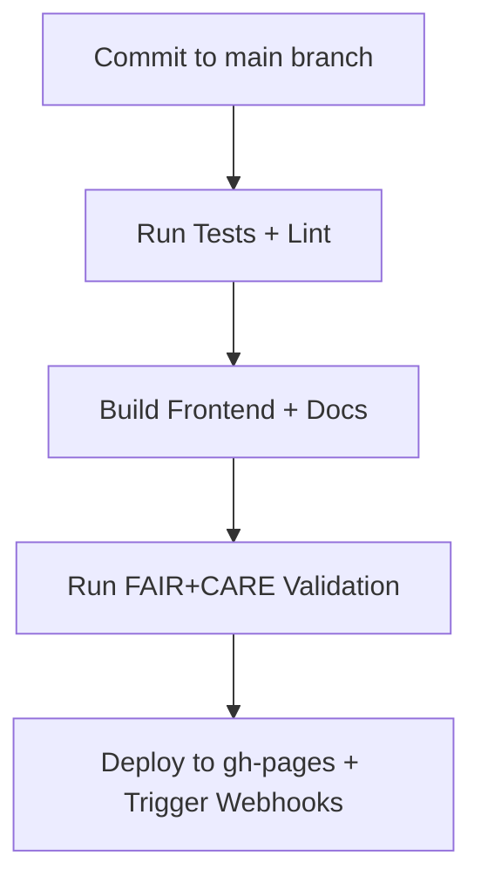
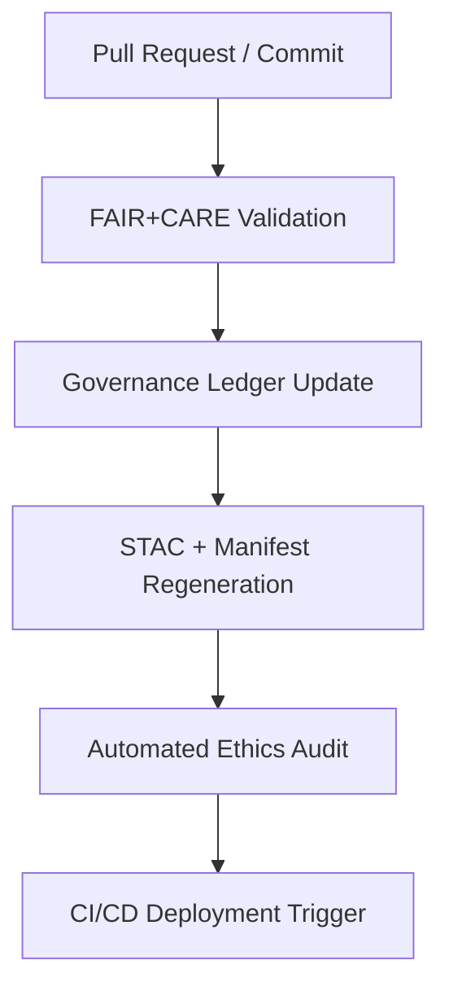

<div align="center">

# 🧩 Kansas Frontier Matrix — **GitHub Configuration & CI/CD Overview**
`.github/README.md`

**Purpose:** Provides documentation for GitHub Actions, community standards, and repository automation within the Kansas Frontier Matrix monorepo.  
Ensures continuous integration, FAIR+CARE compliance validation, automated documentation generation, and ethical AI governance enforcement per **MCP-DL v6.3**.

[](./workflows/site.yml)
[](./workflows/stac-validate.yml)
[](./workflows/codeql.yml)
[](./workflows/pre-commit.yml)
[](./workflows/trivy.yml)
[](../docs/standards/faircare-validation.md)

</div>

---

## 📚 Overview

The `.github/` directory defines **automation, governance, and community configuration** for the Kansas Frontier Matrix repository.  
It integrates CI/CD pipelines, automated FAIR+CARE validation, and contributor experience management under the **Master Coder Protocol (MCP-DL)**.

This directory governs:
- GitHub Actions workflows (CI/CD, build, validation, AI governance)
- Issue and pull request templates  
- Community health files (CODEOWNERS, CONTRIBUTING, SECURITY, SUPPORT)
- FAIR+CARE audit integration  
- Automated STAC and schema validation

All configurations are YAML-based, following MCP and Open Reproducible Science (WORCS) principles for transparency and traceability.

---

## 🧠 Key Workflows

### 🧱 1. Build & Deployment — `site.yml`
Automates frontend build and deployment of the MapLibre + React web app and documentation portal.

**Includes:**
- Node and Python dependency setup  
- React web build pipeline  
- Static site deployment (GitHub Pages or Netlify)  
- Artifact retention for validation reports  



---

### 🧪 2. STAC Validation — `stac-validate.yml`
Ensures every geospatial dataset adheres to the **SpatioTemporal Asset Catalog (STAC 1.0)** and internal metadata schema.

**Checks:**
- STAC item syntax and schema versioning  
- Temporal and spatial metadata completeness  
- JSON schema validation via `stac-validator`  
- Governance linkage confirmation  

> **Output:** Logs stored at `reports/self-validation/` and referenced in the FAIR+CARE audit trail.

---

### 🔍 3. Code Quality & Security — `codeql.yml` and `trivy.yml`
Performs automated scanning for vulnerabilities and dependency issues.

| Workflow | Tool | Function |
|-----------|------|-----------|
| `codeql.yml` | GitHub CodeQL | Static analysis for Python, JS, YAML vulnerabilities |
| `trivy.yml` | Aqua Security Trivy | Container, SBOM, and dependency CVE scanning |
| `pre-commit.yml` | Pre-Commit Hooks | Enforces linting, formatting, and doc compliance |

Outputs are stored in:
- `reports/security/codeql_analysis.json`
- `reports/security/trivy_scan_results.json`

---

### 🧩 4. FAIR+CARE Validation — `faircare-validate.yml`
Runs FAIR+CARE compliance checks for datasets, code, and governance documentation.

**Validation Areas:**
- FAIR metadata completeness  
- CARE ethical handling verification  
- Provenance linkage in STAC & manifest files  
- Audit logging to `reports/fair/` and `reports/audit/`  

**Triggered By:**
- Pull Requests to `main` or `release/*` branches  
- New data or documentation submissions  

---

### 🧠 5. Governance & Audit — `governance-ledger.yml`
Synchronizes provenance, checksum, and ethical validation with the FAIR+CARE ledger.

**Functions:**
- Generates SHA256 hashes for all datasets and manifests  
- Appends signed ledger entries to `reports/audit/ai_hazards_ledger.json`  
- Publishes `focus-telemetry.json` for Focus Mode synchronization  

---

## 🧩 Community Configuration

### 🧰 Issue Templates — `.github/ISSUE_TEMPLATE/`
Defines structured GitHub issue forms for consistency and traceability:
- `bug_report.yml` — For technical or validation-related bugs  
- `feature_request.yml` — For enhancements or new data integrations  
- `governance_review.yml` — For ethical or FAIR+CARE-related discussions  
- `data_request.yaml` — For requesting integration of new datasets or APIs  
- `data_submission.yml` — For submitting new datasets or ingestion requests  

Each template includes **metadata fields** for dataset provenance, FAIR+CARE tags, and governance linkage.

---

### 💬 Pull Request Templates — `.github/PULL_REQUEST_TEMPLATE/`
Pull requests are structured with FAIR+CARE and MCP metadata requirements:
- Description of purpose and context  
- Schema and license verification fields  
- Audit linkage (`governance_ref`, `manifest_ref`)  
- Required checks for STAC, FAIR, and MCP compliance  

---

### 🧩 CODEOWNERS & CONTRIBUTING
- **CODEOWNERS** defines maintainers for each directory (e.g., `@kfm-etl-ops` for `/data/work/`, `@kfm-architecture` for `/docs/`).  
- **CONTRIBUTING.md** outlines MCP documentation standards, commit conventions, and FAIR+CARE expectations.  

All contributions are **automatically validated** via pre-commit hooks before merging.

---

## ⚙️ Directory Layout

```plaintext
.github/
├── README.md
├── workflows/
│   ├── site.yml
│   ├── stac-validate.yml
│   ├── codeql.yml
│   ├── trivy.yml
│   ├── pre-commit.yml
│   ├── faircare-validate.yml
│   └── governance-ledger.yml
├── ISSUE_TEMPLATE/
│   ├── bug_report.yml
│   ├── feature_request.yml
│   ├── governance_review.yml
│   ├── data_request.yaml
│   └── data_submission.yml
├── PULL_REQUEST_TEMPLATE/
│   └── default.md
├── CODEOWNERS
├── CONTRIBUTING.md
├── SECURITY.md
└── SUPPORT.md
```

---

## 🧩 Governance Integration



Each workflow produces verifiable metadata for:
- FAIR+CARE compliance (`reports/fair/`)  
- Ethics audit (`reports/audit/`)  
- STAC and schema integrity (`data/stac/`)  
- Focus Mode telemetry (`releases/v9.3.2/focus-telemetry.json`)

---

## 🧾 Version History

| Version | Date       | Author              | Summary                                           |
|----------|------------|--------------------|---------------------------------------------------|
| v9.3.3   | 2025-10-28 | @kfm-architecture  | Added `data_request.yaml` to issue templates listing and directory layout. |
| v9.3.2   | 2025-10-28 | @kfm-architecture  | Unified CI/CD and FAIR+CARE automation under MCP. |
| v9.3.1   | 2025-10-27 | @bartytime4life    | Added governance-ledger and faircare-validation.  |
| v9.3.0   | 2025-10-26 | @kfm-etl-ops       | Initialized GitHub configuration documentation.   |

---

<div align="center">

**Kansas Frontier Matrix** · *Automation × Governance × Reproducibility*  
[🔗 Project Repository](https://github.com/bartytime4life/Kansas-Frontier-Matrix) • [🧭 Docs Portal](../docs/) • [⚖️ Governance Ledger](../docs/standards/governance/)

</div>