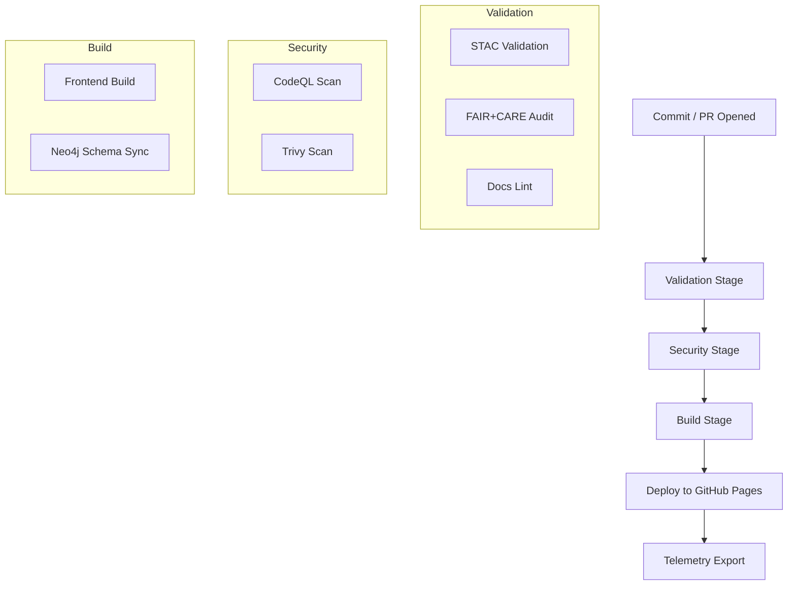

<div align="center">

# 🧩 **Kansas Frontier Matrix — GitHub Configuration & Automation Overview**
`.github/README.md`

**Purpose:** Summarize all repository-level automation, workflows, issue templates, and governance systems that ensure code quality, FAIR+CARE compliance, and continuous deployment of the Kansas Frontier Matrix (KFM).

[](../docs/README.md)
[](../LICENSE)
[](../docs/standards/faircare.md)
[]()
[]()

</div>

---

## 📚 Overview

The `.github/` directory defines **KFM’s continuous integration (CI), continuous deployment (CD), and governance framework**.  
It automates validation of all data, code, and documentation to enforce project-wide reproducibility and ethical data standards.

Each workflow, issue template, and configuration file under this directory supports the **Master Coder Protocol (MCP)**, **FAIR+CARE**, and **Diamond⁹ Ω / Crown∞Ω** certifications.  
Together, they form the backbone of KFM’s quality assurance ecosystem.

---

## 🧱 Directory Structure

```
.github/
├── ARCHITECTURE.md             # CI/CD architecture & validation system overview
├── README.md                   # This file (overview of GitHub-level automation)
│
├── workflows/                  # Automated validation & deployment pipelines
│   ├── stac-validate.yml       # Validates STAC catalog JSONs
│   ├── faircare-validate.yml   # Enforces FAIR+CARE compliance
│   ├── docs-lint.yml           # Lints markdown docs
│   ├── codeql.yml              # Security and code scanning
│   ├── trivy.yml               # Container & dependency scans
│   ├── build-and-deploy.yml    # Builds and deploys frontend (GitHub Pages)
│   ├── stac-dcat-bridge.yml    # Synchronizes STAC↔DCAT catalogs
│   └── telemetry-export.yml    # Exports telemetry metrics on every build
│
├── ISSUE_TEMPLATE/             # Community and governance templates
│   ├── data_submission.yml     # Template for dataset contributions
│   ├── feature_request.yml     # For proposing new features
│   ├── bug_report.yml          # For reporting issues
│   └── governance_form.yml     # For governance or FAIR+CARE review submissions
│
├── pull_request_template.md    # Required PR format (includes validation checklist)
├── dependabot.yml              # Automated dependency management
├── FUNDING.yml                 # Optional sponsor links
└── SECURITY.md                 # Security policy & responsible disclosure process
```

---

## 🔁 Continuous Integration (CI)

KFM’s CI system is fully automated through **GitHub Actions**.  
Every pull request triggers the following validation stages before merge approval:

| Stage | Workflow | Description |
|--------|-----------|-------------|
| **1. Data Validation** | `stac-validate.yml` | Validates all STAC 1.0.0 JSONs for schema compliance. |
| **2. FAIR+CARE Audit** | `faircare-validate.yml` | Ensures datasets meet ethical, reproducible data principles. |
| **3. Documentation Check** | `docs-lint.yml` | Lints and validates markdown, YAML, and JSON. |
| **4. Security Scan** | `codeql.yml` & `trivy.yml` | Scans source code and Docker images for vulnerabilities. |
| **5. Build Verification** | `build-and-deploy.yml` | Builds and validates frontend and backend for deployment readiness. |

All workflow logs are retained under the `releases/v*/reports/` directory and embedded in the `focus-telemetry.json` manifest.

---

## 🚀 Continuous Deployment (CD)

The **deployment pipeline** automates build, validation, and publication:

1. **Frontend Build:** React + MapLibre app built via Node.js workflow.  
2. **Backend Sync:** Syncs API schema (FastAPI/GraphQL) with the `releases/v*/manifest.zip`.  
3. **Static Site Deploy:** Pushes the built frontend to the `gh-pages` branch via `build-and-deploy.yml`.  
4. **Telemetry Export:** Summarizes build metadata and writes to `releases/v9.7.0/focus-telemetry.json`.  

**Hosting:**  
- Web UI: [https://bartytime4life.github.io/Kansas-Frontier-Matrix/](https://bartytime4life.github.io/Kansas-Frontier-Matrix/)  
- API Documentation: Auto-generated under `http://localhost:8000/docs` (via FastAPI).

---

## 🧩 Issue & PR Governance

Structured YAML-based templates ensure that every submission adheres to KFM’s governance and metadata rules.

### Issue Templates
| Template | Use Case | Required Fields |
|-----------|-----------|----------------|
| `data_submission.yml` | Add new dataset or STAC Item | Dataset ID, license, spatial extent, checksum |
| `feature_request.yml` | Propose new feature | Use case, rationale, dependencies |
| `bug_report.yml` | Report errors or defects | Steps to reproduce, expected vs. actual |
| `governance_form.yml` | FAIR+CARE or ethical review | Data source, affected communities, reviewer comments |

### Pull Request Template
Includes:
- Change summary  
- Dataset manifests or README updates  
- Validation logs  
- FAIR+CARE attestation  
- SBOM update reference

All PRs must pass automated checks before merging into `main`.

---

## 🧮 Workflow Diagram



---

## 🧠 Governance & Ethical Framework

All automation in `.github/` integrates with KFM’s **FAIR+CARE** and **MCP** governance framework.

| Layer | Standard | Enforcement |
|--------|-----------|-------------|
| **FAIR** | Findable, Accessible, Interoperable, Reusable | `faircare-validate.yml` |
| **CARE** | Collective Benefit, Authority, Responsibility, Ethics | `governance_form.yml` |
| **MCP** | Master Coder Protocol | All workflows + docs validation |
| **SLSA** | Supply chain security attestation | SBOM & provenance generation |

Each dataset or release is cryptographically verified via SHA-256 checksums and SPDX manifests.

---

## 🧾 Security & Provenance

| File | Function |
|------|-----------|
| `.github/SECURITY.md` | Defines vulnerability disclosure policies. |
| `.github/dependabot.yml` | Keeps dependencies current. |
| `.github/workflows/trivy.yml` | Scans images and dependencies for CVEs. |
| `.github/workflows/codeql.yml` | Performs static analysis and code quality checks. |
| `releases/v*/sbom.spdx.json` | SPDX Software Bill of Materials for transparency. |

**Branch Protection Rules:**  
- PRs require ≥2 reviews and all checks to pass.  
- No direct commits to `main`.  
- Signed commits (`--signoff`) enforced for governance traceability.

---

## 📊 Telemetry Integration

All CI/CD executions generate a telemetry package under `releases/v9.7.0/focus-telemetry.json`:

**Metrics Tracked:**
- Build success rate  
- Workflow durations  
- Validation status (STAC, FAIR+CARE, docs)  
- Security scan summaries  
- SBOM references  
- Contributor metadata (author, branch, commit SHA)

These reports populate the **Governance Dashboard** in the web UI for administrative review.

---

## 🔗 Related Documentation

- [📘 CI/CD Architecture](ARCHITECTURE.md)  
- [⚖️ FAIR+CARE Framework](../docs/standards/faircare.md)  
- [🧱 System Architecture](../src/ARCHITECTURE.md)  
- [🤝 Contributing Guide](../CONTRIBUTING.md)  
- [📑 Markdown Style Rules](../docs/standards/markdown_rules.md)

---

## 🕰️ Version History

| Version | Date | Author | Summary |
|----------|------|---------|----------|
| v9.7.0 | 2025-11-05 | A. Barta | Added full documentation for GitHub workflows, governance, and CI/CD flow. |
| v9.5.0 | 2025-10-20 | A. Barta | Integrated telemetry, FAIR+CARE validation, and STAC/DCAT workflows. |
| v9.3.0 | 2025-08-10 | KFM Core Team | Added code scanning and documentation linting. |
| v9.0.0 | 2025-06-01 | KFM Core Team | Initial repository automation setup. |

---

<div align="center">

**© 2025 Kansas Frontier Matrix — MIT / CC-BY 4.0**  
Automated under **Master Coder Protocol v6.3** · FAIR+CARE Certified · Diamond⁹ Ω / Crown∞Ω Ultimate Certified  
[Return to Main README](../README.md) · [View CI/CD Architecture](ARCHITECTURE.md)

</div>
