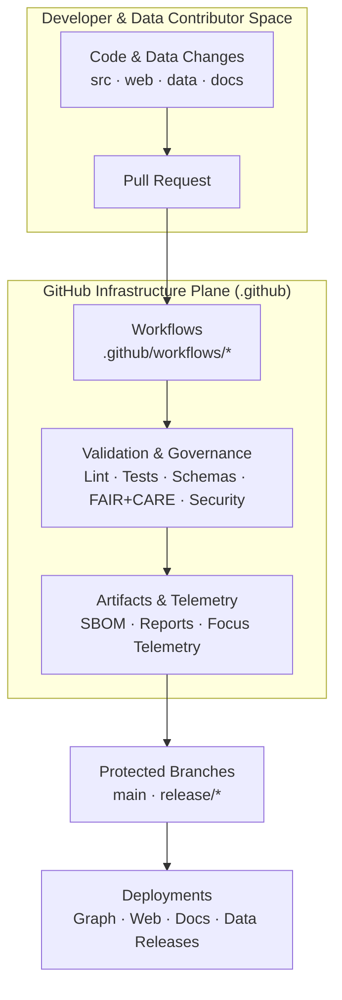

<div align="center">

# ⚙️ **Kansas Frontier Matrix — GitHub Infrastructure Overview**  
`.github/README.md`

**The governed CI/CD, validation, and automation backbone of the Kansas Frontier Matrix monorepo.**

[](../docs/standards/kfm_markdown_protocol_superstandard.md)  
[](../docs/standards/faircare/FAIRCARE-GUIDE.md)  
[](../LICENSE)  
[](#-version-history)

</div>

---

# 🧭 Purpose

The `.github/` directory implements the **GitHub infrastructure plane** of the Kansas Frontier Matrix (KFM):

- CI/CD pipelines that build, test, validate, and deploy the system  
- FAIR+CARE and governance enforcement for **every change**  
- STAC/DCAT, ontology, and JSON-LD schema validation  
- Security & supply-chain hardening (SBOM, SLSA-style attestations, vulnerability scanning)  
- Telemetry capture for Focus Mode, governance dashboards, and sustainability metrics  
- Issue / PR templates encoding documentation-first and ethics-first rules  

Nothing reaches:

- Protected branches (`main`, `release/*`)  
- The **Neo4j knowledge graph**  
- The **published STAC/DCAT catalogs**  

without successfully passing through `.github/` workflows.

---

# 🗂️ Directory Layout

```text
.github/                               # GitHub infrastructure plane
│
├── README.md                          # This overview document
├── ARCHITECTURE.md                    # (Optional) CI/CD & governance deep-dive
│
├── workflows/                         # GitHub Actions automation
│   ├── ci.yml                         # Core CI: lint, typecheck, test, build, schemas
│   ├── docs_validate.yml              # Markdown + YAML + KFM-MDP v11 validation
│   ├── stac_validate.yml              # STAC collection/item validation
│   ├── dcat_validate.yml              # DCAT dataset validation
│   ├── faircare_validate.yml          # FAIR+CARE & ethics checks
│   ├── data_pipeline.yml              # ETL/data workflows & lineage checks
│   ├── telemetry_export.yml           # Telemetry bundling for releases
│   ├── sbom_verify.yml                # SBOM + checksum + SLSA provenance
│   ├── site.yml                       # Docs + web build and deployment
│   └── security_audit.yml             # Dependency & workflow security scanning
│
├── ISSUE_TEMPLATE/                    # Issue templates (governance-aware)
│   ├── bug_report.md                  # For defects in code or data behavior
│   ├── feature_request.md             # New features / enhancements
│   └── data_issue.md                  # Dataset issues + CARE classification
│
├── PULL_REQUEST_TEMPLATE.md           # Required metadata: CARE, provenance, a11y, telemetry
├── CODEOWNERS                         # Module ownership & review boundaries
├── dependabot.yml                     # Automated dependency updates
└── SECURITY.md                        # Security & vulnerability disclosure policy
````

---

# 🧬 Role in the KFM Stack



The `.github/` directory is a **first-class subsystem**. It:

* Encodes the **policies and standards** described in `ARCHITECTURE.md` and `docs/standards/*`
* Enforces **FAIR+CARE**, sovereignty, and reliability rules at the CI/CD level
* Guards the **software and data supply chain**
* Produces **telemetry and governance artifacts** used across the platform

---

# 🧪 CI/CD Stages (v11)

All workflows together implement a **multi-stage, governance-aware CI/CD pipeline**.

## 1️⃣ Lint & Style

* **Code**: ESLint, Prettier, TypeScript checks
* **CSS/Styles**: Stylelint and design-token lints
* **Markdown**:

  * KFM-MDP v11 conformance
  * YAML front-matter validation (required keys, valid paths)
  * Fence integrity (no broken boxes, valid inner code blocks)

Any lint failure → **PR blocked**.

## 2️⃣ Schema & Metadata Validation

Ensures all persisted artifacts are **schema-conformant**:

* STAC Items & Collections (`schemas/stac/*`)
* DCAT Datasets (`schemas/dcat/*`)
* Telemetry payloads (`schemas/telemetry/*`)
* JSON-LD contexts (`schemas/jsonld/*`)
* Story Node v3 & Focus Mode schemas
* GitHub-doc JSON/SHACL shapes (including this file’s schema)

Any schema violation → **no merge**.

## 3️⃣ Testing (Unit → Integration → E2E)

* Unit tests (backend, frontend, pipelines)
* Integration tests (API↔graph↔data)
* E2E tests for key flows
* Accessibility tests (where configured)
* Data validation tests for ETL outputs

No green test matrix → **no merges**.

## 4️⃣ Governance & Ethics Enforcement

Via `faircare_validate.yml` and linked standards:

* FAIR metrics (F1–A1–I1–R1)
* CARE classification and enforcement for sensitive data
* Coordinate masking and generalization rules (H3 standards)
* License & usage rights checks
* Provenance completeness and integrity

Governance failures require FAIR+CARE Council or delegate review.

## 5️⃣ Security & Supply Chain

Using `security_audit.yml`, `dependabot.yml`, `sbom_verify.yml`:

* Dependency vulnerability scanning
* SBOM generation and signature verification
* SLSA-style provenance for releases
* Workflows scanned for:

  * Unsafe permissions
  * Secret exposures
  * Dangerous patterns

Security is baked into the CI/CD process, not bolted on later.

## 6️⃣ Build, Package & Deploy

* Web client build (React + MapLibre + Cesium)
* Documentation site build
* Packaging:

  * `manifest.zip`
  * `sbom.spdx.json`
  * `focus-telemetry.json`

Only artifacts passing all previous stages may be deployed or published.

---

# 🧩 Governance & Policy Hooks

## Issue Templates (`ISSUE_TEMPLATE/`)

Each template encodes governance prompts:

* **Bug Report**:

  * Impacted subsystem (src, web, data, docs, pipelines)
  * Severity and potential data/UX impact

* **Feature Request**:

  * User story and beneficiaries
  * A11y, performance, and governance implications

* **Data Issue**:

  * Dataset identifiers (STAC/DCAT IDs)
  * CARE classification and sovereignty notes
  * Requested changes (masking, removal, correction)

## PR Template (`PULL_REQUEST_TEMPLATE.md`)

Pull requests must capture:

* CARE / sensitivity classification
* Provenance & licensing for data / narrative content
* Schema & ontology impacts
* Accessibility impacts
* Telemetry / Observability changes
* Required reviewers (CODEOWNERS + governance delegates as needed)

This enforces **documentation-first** and **governance-first** development.

---

# 🔒 Security Model

Core controls:

* Protected branches (`main`, `release/*`) with required checks
* CODEOWNERS for critical directories (e.g., `.github/**`, `schemas/**`, `data/**`)
* Restricted permissions for workflow tokens and environment secrets
* Security scanning and SBOM verification integrated into CI
* A documented **security and disclosure policy** in `.github/SECURITY.md`

Security issues are handled per that policy, with coordinated disclosure when appropriate.

---

# 📊 Telemetry & Observability

`.github` workflows feed telemetry into the KFM observability layer:

* CI duration and flakiness
* Validation and test failure patterns
* Governance violation counts and resolution times
* Energy and carbon estimates for workflow runs
* A11y and performance signal summaries

Telemetry is consolidated into:

```text
releases/<version>/focus-telemetry.json
```

and used to power:

* FAIR+CARE governance dashboards
* Reliability & sustainability reports
* System-level Story Nodes for Focus Mode v3

---

# 🕰 Version History

| Version |       Date | Summary                                                                                               |
| ------: | ---------: | ----------------------------------------------------------------------------------------------------- |
| v11.0.0 | 2025-11-19 | v11 upgrade; aligned with KFM-MDP v11, extended metadata, telemetry hooks, and CI/CD governance docs. |
| v10.4.1 | 2025-11-16 | Extended governance/AI metadata and refined directory overview.                                       |
| v10.4.0 | 2025-11-15 | Rewrote for KFM-MDP v10.4; clarified CI/CD + governance + telemetry architecture.                     |
| v10.3.2 | 2025-11-14 | Added STAC, DCAT, governance, and telemetry integration.                                              |
| v10.0.0 | 2025-11-10 | Initial GitHub infrastructure overview.                                                               |

---

[Root README](../README.md) · [Architecture](../ARCHITECTURE.md) · [Security Policy](./SECURITY.md)

```
