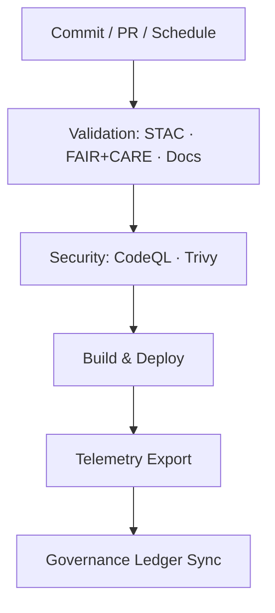

<div align="center">

# 🧩 **Kansas Frontier Matrix — GitHub Configuration & Automation Overview**  
`.github/README.md`

**Purpose:**  
Define repository-level **automation, validation, security, and governance** for the Kansas Frontier Matrix (KFM).  
Documents **CI/CD pipelines, FAIR+CARE ethical checks, telemetry exports, and provenance binding** per **MCP-DL v6.3** and **Diamond⁹ Ω / Crown∞Ω** standards.

[](../docs/README.md)
[](../LICENSE)
[](../docs/standards/faircare.md)
[]()

</div>

---

## 📘 Overview

`.github/` codifies **continuous validation, reproducibility, and governance enforcement**.  
All pipelines run on **GitHub Actions**, emitting **telemetry**, **SBOM attestations**, and **governance ledger updates**.  
Workflows enforce **FAIR+CARE**, **SLSA**, **SPDX**, and **MCP v6.3** compliance across data and code.

---

## 🗂️ Directory Layout

```
.github/
├── ARCHITECTURE.md
├── README.md
│
├── workflows/
│   ├── stac-validate.yml          # STAC/DCAT schema validation
│   ├── stac-dcat-bridge.yml       # STAC↔DCAT sync & publication
│   ├── faircare-validate.yml      # FAIR+CARE ethics audit
│   ├── docs-lint.yml              # Markdown/YAML/JSON lint & anchors
│   ├── codeql.yml                 # Static analysis (SARIF)
│   ├── trivy.yml                  # CVE & image scan (fail on CRITICAL)
│   ├── build-and-deploy.yml       # Web build/deploy (Pages/S3)
│   ├── telemetry-export.yml       # Aggregates workflow metrics → releases/*
│   ├── ai-model-audit.yml         # AI bias/drift/explainability audit
│   └── stream-ingest.yml          # Streaming ETL deploy & healthchecks
│
├── ISSUE_TEMPLATE/
│   ├── data_submission.yml
│   ├── feature_request.yml
│   ├── bug_report.yml
│   └── governance_form.yml
│
├── pull_request_template.md
├── dependabot.yml
├── SECURITY.md
└── FUNDING.yml
```

---

## 🔁 Continuous Integration (CI)

| Stage | Workflow | Enforces | Artifacts |
|---|---|---|---|
| Data Validation | `stac-validate.yml` | STAC 1.0 / DCAT 3.0 structure & checksums | `reports/self-validation/stac/` |
| STAC↔DCAT Bridge | `stac-dcat-bridge.yml` | Catalog parity & metadata upgrades | `reports/self-validation/bridge/` |
| FAIR+CARE Audit | `faircare-validate.yml` | CARE flags, consent tags, provenance | `reports/fair/faircare_summary.json` |
| Docs Lint | `docs-lint.yml` | Headings, anchors, links, fenced blocks | `reports/self-validation/docs/` |
| Security | `codeql.yml` + `trivy.yml` | SARIF + CVE scan; block CRITICAL | `reports/security/{codeql,trivy}/` |
| AI Audit | `ai-model-audit.yml` | Drift, bias, SHAP export | `reports/audit/ai_model_faircare.json` |
| Build & Deploy | `build-and-deploy.yml` | Frontend build + artifact sign | `docs/reports/telemetry/build_metrics.json` |

> 💡 **Tip:** All CI outputs are summarized into `../releases/v10.2.0/focus-telemetry.json`.

---

## 🚀 Continuous Deployment (CD)

1. **Build Frontend** (Node/Vite) → cache restore, integrity checks  
2. **Publish Static Site** (GitHub Pages or S3) with immutable hash paths  
3. **Export Telemetry** → `focus-telemetry.json` (durations, pass/fail, artifacts)  
4. **Bind Provenance** → `manifest.zip`, `sbom.spdx.json`, workflow run IDs

> API docs auto-generated from FastAPI (`/docs`) and versioned per release.

---

## ⚙️ Workflow → Artifact Mapping

| Workflow | Output | Location |
|---|---|---|
| `stac-validate.yml` | STAC validation summary + NDJSON log | `reports/self-validation/stac/` |
| `stac-dcat-bridge.yml` | Catalog parity report | `reports/self-validation/bridge/` |
| `faircare-validate.yml` | FAIR+CARE audit log | `reports/fair/` |
| `docs-lint.yml` | Markdown lint + anchor map | `reports/self-validation/docs/` |
| `codeql.yml` | SARIF | `reports/security/codeql/` |
| `trivy.yml` | CVE JSON | `reports/security/trivy/` |
| `build-and-deploy.yml` | Build metrics | `docs/reports/telemetry/` |
| `telemetry-export.yml` | Aggregated telemetry | `../releases/v10.2.0/` |
| `ai-model-audit.yml` | AI audit | `reports/audit/` |
| `stream-ingest.yml` | Stream health snapshot | `reports/stream/` |

---

## 🧮 Automation Flow



Artifacts feed provenance, dashboards, and release notes.

---

## 🧠 Governance & Ethics

| Layer | Standard | Automation |
|---|---|---|
| FAIR | Findable · Accessible · Interoperable · Reusable | STAC/DCAT validation & DOI |
| CARE | Collective Benefit · Authority · Responsibility · Ethics | Issue template + governance review |
| MCP-DL | Docs-as-Code, Telemetry | Docs lint + telemetry export |
| SLSA/SPDX | Supply Chain & Licensing | SBOM + attestation |
| Sustainability | Energy/Carbon | Build/CI energy telemetry (ISO 50001/14064-aligned) |

**Ledgers:**  
`../docs/reports/audit/{governance-ledger.json,github-workflows-ledger.json}` (append-only, signed).

---

## 🔒 Security Posture

| Control | Mechanism | Policy |
|---|---|---|
| Static Analysis | CodeQL | SARIF review required |
| CVE Scanning | Trivy | **Fail on CRITICAL** |
| Dependency Updates | Dependabot | Weekly PRs with lockfile updates |
| Branch Protection | Rulesets | 2 reviews + passing CI + signed commits |
| Secrets | OIDC + Encrypted Secrets | Quarterly rotation, no plaintext in repo |

See `.github/SECURITY.md` for coordinated disclosure.

---

## 📊 Telemetry & Reporting

`focus-telemetry.json` consolidates:
- Workflow status & durations  
- FAIR+CARE compliance scores  
- STAC/DCAT schema metrics  
- Security scan summaries  
- SBOM hashes & release links  
- Commit/author metadata and PR numbers  

Dashboards live under `../docs/reports/telemetry/`.

---

## 🗺️ Cross-References

- [⚙️ CI/CD Architecture](ARCHITECTURE.md)  
- [📘 Docs Index](../docs/README.md)  
- [🏗 System Architecture](../src/ARCHITECTURE.md)  
- [📑 Markdown Rules](../docs/standards/markdown_rules.md)  
- [⚖️ FAIR+CARE Framework](../docs/standards/faircare.md)

---

## 🕰️ Version History

| Version | Date | Author | Summary |
|---|---|---|---|
| v10.2.2 | 2025-11-12 | FAIR+CARE Council & DevSecOps | Upgraded CI to v10.2: streaming ingest workflow, expanded telemetry, stricter CVE gating, catalog bridge parity. |
| v10.0.0 | 2025-11-09 | FAIR+CARE Council | Added AI audit, sustainability telemetry, ledger sync, SBOM v10 compliance. |
| v9.7.0 | 2025-05-05 | DevSecOps Team | Introduced telemetry aggregation and FAIR+CARE auto-audits. |

---

<div align="center">

© 2025 Kansas Frontier Matrix · MIT License  
Master Coder Protocol v6.3 · FAIR+CARE Certified · Diamond⁹ Ω / Crown∞Ω Ultimate Certified  
[Back to Docs Index](../docs/README.md) · [View CI/CD Architecture](ARCHITECTURE.md)

</div>