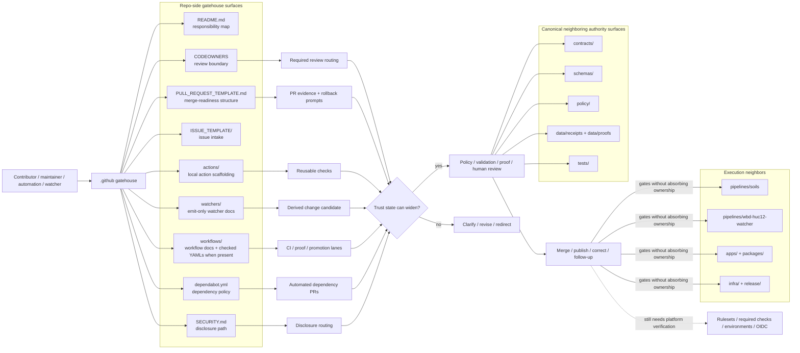

<!-- [KFM_META_BLOCK_V2]
doc_id: kfm://doc/repo/.github/readme
title: .github README
type: standard
version: v2
status: draft
owners: @bartytime4life
created: 2026-03-15
updated: 2026-04-18
policy_label: NEEDS_VERIFICATION
related: [../README.md, ../CONTRIBUTING.md, ../CHANGELOG.md, ../SECURITY.md, ../Makefile, ../docs/governance/, ../docs/architecture/, ../docs/domains/, ../docs/runbooks/, ../docs/adr/, ../contracts/, ../schemas/, ../policy/, ../data/registry/, ../apps/, ../packages/, ../pipelines/, ../infra/, ../scripts/, ../tests/, ../tools/, ../web/, ../release/, ../artifacts/, ./ISSUE_TEMPLATE/, ./actions/, ./watchers/, ./workflows/, ./CODEOWNERS, ./PULL_REQUEST_TEMPLATE.md, ./SECURITY.md, ./dependabot.yml]
tags: [kfm, github, governance, ci-cd, review, disclosure, dependabot, watchers]
notes: [Created date preserved from the previously checked-in baseline; updated date reflects this draft revision; snapshot sections below record the latest document-reported public-main .github and root control-plane state and must be rechecked in the live branch before merge; ISSUE_TEMPLATE/config.yml and actions/action.yml were documented as placeholders in earlier snapshots and remain NEEDS VERIFICATION in the active branch; workflows/ and watchers/ are documented as README-first / README-only unless live branch inspection proves additional checked-in assets; root SECURITY.md is now documented as delegating to .github/SECURITY.md, but both surfaces must remain aligned; GitHub rulesets, required checks, environment approvals, private-reporting settings, monitored secrets, app permissions, workflow callers, and OIDC bindings remain NEEDS VERIFICATION.]
[/KFM_META_BLOCK_V2] -->

<a id="top"></a>

<div align="center">
  <strong>Kansas Frontier Matrix</strong><br />
  <sub>Repository gatehouse for review routing, workflow-facing governance, disclosure posture, dependency policy, and emit-only watcher guidance</sub>
</div>

# `.github` README

Repo-side responsibility map for repository-wide governance, contributor intake, review routing, dependency policy, security disclosure, workflow documentation, and control-plane-facing automation in Kansas Frontier Matrix.

> [!NOTE]
> **Status:** active directory · draft README revision  
> **Owners:** `@bartytime4life` *(reconfirm in `CODEOWNERS` before merge if ownership changed)*  
> **Path:** `.github/README.md`  
> **Repo fit:** parent gatehouse for [`CODEOWNERS`](./CODEOWNERS), [`PULL_REQUEST_TEMPLATE.md`](./PULL_REQUEST_TEMPLATE.md), [`SECURITY.md`](./SECURITY.md), [`dependabot.yml`](./dependabot.yml), [`ISSUE_TEMPLATE/`](./ISSUE_TEMPLATE/), [`actions/`](./actions/), [`watchers/`](./watchers/), and [`workflows/`](./workflows/); aligned upward to [`../README.md`](../README.md), [`../CONTRIBUTING.md`](../CONTRIBUTING.md), [`../CHANGELOG.md`](../CHANGELOG.md), [`../SECURITY.md`](../SECURITY.md), and [`../Makefile`](../Makefile).  
>         
> **Quick jumps:** [Scope](#scope) · [Repo fit](#repo-fit) · [Accepted inputs](#accepted-inputs) · [Exclusions](#exclusions) · [Directory tree](#directory-tree) · [Quickstart](#quickstart) · [Usage](#usage) · [Diagram](#diagram) · [Control surfaces](#control-surfaces--reference-tables) · [Task list](#task-list--definition-of-done) · [FAQ](#faq) · [Appendix](#appendix)

> [!IMPORTANT]
> This README is intentionally **evidence-bounded**. It preserves KFM’s gatehouse doctrine and the latest document-reported public-main snapshot, but it does not convert branch history, platform UI signals, earlier placeholders, or GitHub settings into proof of current enforcement. Recheck the live branch and GitHub settings before merging behavior-bearing claims.

> [!TIP]
> Use these labels consistently:
>
> | Label | Meaning in this README |
> | --- | --- |
> | **CONFIRMED** | directly supported by checked-in Markdown, a documented public-main snapshot, or governing KFM doctrine |
> | **INFERRED** | conservative interpretation of confirmed evidence |
> | **PROPOSED** | doctrine-consistent guidance not yet proven as checked-in behavior |
> | **UNKNOWN** | not verified strongly enough to present as settled |
> | **NEEDS VERIFICATION** | reviewer action required before the detail should be treated as current repo truth |

---

## Scope

`.github/` is KFM’s repository-level **gatehouse**.

This is where contributor intake, review routing, ownership boundaries, disclosure posture, dependency automation, workflow documentation, local action scaffolding, and watcher-facing control-plane guidance become explicit repo surfaces instead of ambient convention.

In KFM terms, `.github/` is part of the **trust membrane**. It does not own canonical data, contracts, schemas, policy truth, runtime code, or release proofs. It helps ensure that changes touching those surfaces pass through review, verification, and evidence-bearing gates before they widen into public or semi-public consequence.

### What this gatehouse protects

| Gatehouse burden | What it protects against | Expected posture |
| --- | --- | --- |
| Review routing | silent ownership drift, unreviewed policy-significant changes | `CODEOWNERS` plus PR evidence prompts |
| Contributor intake | issue noise, unsupported claims, unclear source requests | issue templates and clear triage language |
| PR structure | generic review that misses truth-path impact | evidence links, validation, rollback, and risk prompts |
| Security disclosure | scattered vulnerability routing or unsafe public details | one authoritative GitHub-facing path |
| Dependency automation | bot-driven changes that bypass governance context | documented Dependabot policy and review expectations |
| Workflow docs | CI prose that overclaims enforcement | README-first inventory, checked YAML verification, no hidden certainty |
| Watcher docs | monitoring surfaces that silently publish | emit-only, review-bearing, fail-closed watcher doctrine |
| Local actions | reusable CI logic that hides trust behavior | documented inputs, outputs, permissions, and callers |

### Evidence boundary used here

| Evidence layer | What this README treats as settled |
| --- | --- |
| **CONFIRMED KFM doctrine** | KFM is governed, evidence-first, map-first, time-aware, and claim-centered; truth path, trust membrane, authoritative-versus-derived separation, cite-or-abstain, and fail-closed defaults are load-bearing |
| **CONFIRMED document-reported public-main state** | `.github/` is a gatehouse; visible surfaces include `ISSUE_TEMPLATE/`, `actions/`, `watchers/`, `workflows/`, `CODEOWNERS`, `PULL_REQUEST_TEMPLATE.md`, `README.md`, `SECURITY.md`, and `dependabot.yml` |
| **CONFIRMED adjacent repo lanes** | root docs and neighboring lanes exist for docs, contracts, schemas, policy, data, tests, tools, pipelines, infra, apps, packages, web, release, and artifacts |
| **UNKNOWN / NEEDS VERIFICATION** | exact live-branch deltas, checked-in workflow YAML inventory, action callers, rulesets, branch protections, required checks, environment approvals, private-reporting switches, GitHub App permissions, OIDC trust bindings, monitored secrets, and emitted proof objects |

### Current public-main deltas worth carrying forward

| Signal | Why it matters | Status |
| --- | --- | --- |
| `.github/watchers/` is part of the gatehouse | watcher doctrine must remain visible and review-bearing | **CONFIRMED** |
| `.github/watchers/` is documented as README-only unless live branch inspection proves more | avoids implying runtime watcher jobs exist in this lane | **CONFIRMED snapshot / NEEDS VERIFICATION active branch** |
| `.github/workflows/` is documented as README-first / README-only in the public-main snapshot | avoids treating historical workflow names as checked-in YAML inventory | **CONFIRMED snapshot / NEEDS VERIFICATION active branch** |
| `.github/actions/` is a visible local action surface | local action reuse is a real control-plane seam | **CONFIRMED path / NEEDS VERIFICATION callers** |
| root `SECURITY.md` is documented as handing off to `.github/SECURITY.md` | disclosure ownership should stay canonical and unambiguous | **CONFIRMED documented posture / NEEDS VERIFICATION text parity** |
| root `Makefile` is visible and used by root quickstart flows | task entrypoints can drift just like workflows | **CONFIRMED path / NEEDS VERIFICATION targets** |
| `pipelines/` is visible with `soils/` and `wbd-huc12-watcher/` landmarks | `.github` should gate pipeline-facing trust changes without absorbing runtime ownership | **CONFIRMED documented public-main landmark** |
| platform settings are not derivable from checked-in files | repo state and GitHub enforcement state are different | **UNKNOWN** |

[Back to top](#top)

---

## Repo fit

**Path:** `.github/README.md`

**Role in repo:** directory README for repository-wide governance surfaces: ownership, templates, dependency policy, security disclosure, workflow documentation, local action scaffolding, watcher-boundary guidance, and review-facing control-plane expectations.

**Why it exists:** to explain how repo-side control surfaces preserve KFM’s truth path without pretending that `.github/` is the canonical home of contracts, policy bundles, runtime code, pipeline code, data artifacts, proof packs, or long-form doctrine.

### Upstream and downstream anchors

| Direction | Path | Why it matters | Status |
| --- | --- | --- | --- |
| Upstream | [`../README.md`](../README.md) | root repo identity and orientation | **CONFIRMED path** |
| Upstream | [`../CONTRIBUTING.md`](../CONTRIBUTING.md) | contributor expectations and evidence-bounded change discipline | **CONFIRMED path** |
| Upstream | [`../CHANGELOG.md`](../CHANGELOG.md) | release and evolution log surface | **CONFIRMED path** |
| Upstream | [`../SECURITY.md`](../SECURITY.md) | root disclosure entrypoint; documented to hand off to gatehouse security policy | **CONFIRMED path / keep aligned** |
| Upstream | [`../Makefile`](../Makefile) | task entrypoint surface that should not drift from CI docs | **CONFIRMED path / targets need verification** |
| Upstream | [`../docs/governance/`](../docs/governance/) | governance doctrine and review rules | **CONFIRMED path** |
| Upstream | [`../docs/architecture/`](../docs/architecture/) | architecture doctrine adjacent to delivery and review surfaces | **CONFIRMED path** |
| Upstream | [`../docs/domains/`](../docs/domains/) | Kansas-first operating lanes that shape review burden | **CONFIRMED path** |
| Upstream | [`../docs/runbooks/`](../docs/runbooks/) | operator, rollback, and correction procedure home | **CONFIRMED path** |
| Upstream | [`../docs/adr/`](../docs/adr/) | decision records for behavior-significant governance change | **CONFIRMED path** |
| Upstream | [`../contracts/`](../contracts/) | normative contract lane for shared object families and release rules | **CONFIRMED path** |
| Upstream | [`../schemas/`](../schemas/) | authority-sensitive machine validation surface | **CONFIRMED path** |
| Upstream | [`../policy/`](../policy/) | executable deny-by-default policy lane | **CONFIRMED path** |
| Upstream | [`../data/registry/`](../data/registry/) | source descriptors and intake registry material | **CONFIRMED path** |
| Upstream | [`../pipelines/`](../pipelines/) | execution lanes that `.github` may gate but does not own | **CONFIRMED path** |
| Upstream | [`../tools/`](../tools/) | validators, attestation helpers, probes, and utilities | **CONFIRMED path** |
| Upstream | [`../tests/`](../tests/) | governed verification surface | **CONFIRMED path** |
| Downstream | [`./CODEOWNERS`](./CODEOWNERS) | executable review boundary map | **CONFIRMED** |
| Downstream | [`./ISSUE_TEMPLATE/`](./ISSUE_TEMPLATE/) | contributor issue-intake surface | **CONFIRMED** |
| Downstream | [`./PULL_REQUEST_TEMPLATE.md`](./PULL_REQUEST_TEMPLATE.md) | PR review contract and doctrine checklist | **CONFIRMED** |
| Downstream | [`./actions/`](./actions/) | repo-local reusable GitHub Actions logic and scaffolding | **CONFIRMED path** |
| Downstream | [`./watchers/`](./watchers/) | watcher lane describing emit-only derived monitoring rules | **CONFIRMED path** |
| Downstream | [`./workflows/`](./workflows/) | workflow documentation lane; checked YAML inventory requires live inspection | **CONFIRMED path / NEEDS VERIFICATION inventory** |
| Downstream | [`./SECURITY.md`](./SECURITY.md) | GitHub-facing disclosure-policy surface | **CONFIRMED** |
| Downstream | [`./dependabot.yml`](./dependabot.yml) | dependency-update automation policy | **CONFIRMED** |

<details>
<summary><strong>Broader repo context</strong> — document-reported public-main snapshot</summary>

```text
repo/
├── .codex/
├── .github/
├── apps/
├── artifacts/
├── brand/
├── configs/
├── contracts/
├── data/
├── docs/
├── examples/
├── habitat/
├── infra/
├── migrations/
├── packages/
├── pipelines/
├── policy/
├── release/
├── schemas/
├── scripts/
├── tests/
├── tools/
├── ui/
├── web/
├── CHANGELOG.md
├── CODE_OF_CONDUCT.md
├── CONTRIBUTING.md
├── LICENSE
├── Makefile
├── README.md
└── SECURITY.md
```

</details>

[Back to top](#top)

---

## Accepted inputs

The following content belongs in `.github/` when it applies across the repository rather than to one package, domain lane, or runtime surface.

| Input class | What belongs here | Why it belongs here |
| --- | --- | --- |
| Review-boundary files | `CODEOWNERS`, repo-wide review-routing notes, self-protection rules | review is part of KFM’s trust system |
| Structured contributor intake | issue-template chooser files, issue-template docs, PR templates, merge-readiness checklists | intake should be shaped before change widens |
| Reusable repo-local automation | composite actions, setup helpers, policy/install wrappers, metadata or provenance guards | repeated CI steps should stay reviewable and local to the repo |
| Workflow documentation and workflow definitions | CI, validation, runtime-proof, promotion, correction, reconciliation, and release-control lanes | workflow surfaces express repo-wide control and trust-state transitions |
| Watcher control docs | emit-only rules, materiality thresholds, receipt/open-PR conventions, and review-bearing watcher guidance | monitoring surfaces must remain derived, rebuildable, and steward-reviewed |
| Security and disclosure entrypoints | `SECURITY.md`, disclosure flow docs, safe-harbor guidance, automation-identity notes | trust-bearing reporting needs a clear repo-level home |
| Dependency update policy | `dependabot.yml` and adjacent governance notes | automated dependency change is part of delivery posture, not an afterthought |

---

## Exclusions

`.github/` can gate, reference, or validate these surfaces, but it should not quietly replace them as their canonical home.

| Does **not** belong here as canonical truth | Keep it here instead |
| --- | --- |
| machine-readable schemas, envelopes, OpenAPI specs, vocabularies | [`../contracts/`](../contracts/) and [`../schemas/`](../schemas/) |
| policy bodies, reason-code registries, fixtures, decision tests | [`../policy/`](../policy/) |
| canonical data artifacts, source descriptors, lifecycle-zone payloads, receipts, proofs, published datasets | [`../data/`](../data/) |
| runtime services, UI logic, ingestion code, pipeline execution code, evidence resolvers | [`../apps/`](../apps/), [`../packages/`](../packages/), [`../pipelines/`](../pipelines/), or [`../scripts/`](../scripts/) |
| publishable watcher outputs, canonical source captures, or long-running domain ETL | [`../data/`](../data/), [`../pipelines/`](../pipelines/), [`../tools/`](../tools/), or the owning runtime lane |
| long-form doctrine, ADRs, standards, runbooks, architecture manuals | [`../docs/`](../docs/) |
| secrets, private vulnerability details, unpublished review material, exact restricted coordinates | never in public `.github/`; route through stewarded or private paths |
| release artifacts, immutable manifests, proof packs | owning artifact / release / evidence path, not ad hoc `.github/` storage |
| GitHub platform settings | GitHub settings, exported rulesets, or infrastructure-as-code once added | checked-in docs may describe them, but do not prove they are active |

[Back to top](#top)

---

## Directory tree

The latest document-reported `.github/` shape is below. Re-run the quickstart against the live branch before treating any inventory-sensitive detail as current fact.

```text
.github/
├── ISSUE_TEMPLATE/
│   ├── README.md
│   └── config.yml                     # placeholder / content status NEEDS VERIFICATION
├── actions/
│   ├── metadata-validate-v2/
│   ├── metadata-validate/
│   ├── opa-gate/
│   ├── provenance-guard/
│   ├── sbom-produce-and-sign/
│   ├── src/
│   ├── README.md
│   └── action.yml                     # root-level placeholder / content status NEEDS VERIFICATION
├── watchers/
│   └── README.md                      # README-only watcher scaffold unless live branch proves more
├── workflows/
│   └── README.md                      # README-first / README-only unless live branch proves YAML inventory
├── CODEOWNERS
├── PULL_REQUEST_TEMPLATE.md
├── README.md
├── SECURITY.md
└── dependabot.yml
```

> [!WARNING]
> Do not infer checked-in workflow YAMLs, action callers, branch protections, environment approvals, OIDC bindings, or private-reporting settings from this tree. Those require direct branch and GitHub settings verification.

[Back to top](#top)

---

## Quickstart

Before changing repo-wide governance surfaces, inspect the live checkout and compare it against the documented snapshot.

```bash
# 0) Start from the repo root and pin the revision under review
git rev-parse --show-toplevel 2>/dev/null || pwd
git rev-parse HEAD 2>/dev/null || echo "Not inside a Git checkout"

# 1) Inventory the gatehouse
find .github -maxdepth 2 -type d | sort
find .github -maxdepth 2 -type f | sort

# 2) Inspect the highest-signal repo-side control surfaces
sed -n '1,220p' .github/README.md
sed -n '1,220p' .github/CODEOWNERS
sed -n '1,280p' .github/PULL_REQUEST_TEMPLATE.md
sed -n '1,280p' .github/SECURITY.md
sed -n '1,280p' SECURITY.md
sed -n '1,280p' .github/dependabot.yml

# 3) Inspect current intake, local-action, and watcher state
find .github/ISSUE_TEMPLATE -maxdepth 1 -type f | sort
find .github/actions -maxdepth 2 -type f | sort
find .github/watchers -maxdepth 2 -type f | sort
test -s .github/ISSUE_TEMPLATE/config.yml || echo ".github/ISSUE_TEMPLATE/config.yml is empty or missing"
test -s .github/actions/action.yml || echo ".github/actions/action.yml is empty or missing"

# 4) Inspect current workflow lane state
find .github/workflows -maxdepth 1 -type f | sort
find .github/workflows -maxdepth 1 \( -name '*.yml' -o -name '*.yaml' \) | sort

# 5) Check adjacent authority surfaces that .github should gate, not replace
find contracts schemas policy tests tools docs data pipelines apps packages infra scripts web release artifacts \
  -maxdepth 2 -type d 2>/dev/null | sort | sed -n '1,260p'

# 6) Check task entrypoints and root governance neighbors
ls -la Makefile CHANGELOG.md CONTRIBUTING.md SECURITY.md CODE_OF_CONDUCT.md LICENSE 2>/dev/null || true
make -n help 2>/dev/null || true

# 7) Platform-state checks happen outside the repo tree:
#    - branch protections / rulesets
#    - required status checks
#    - environment reviewers / deployment approvals
#    - private vulnerability reporting
#    - GitHub App permissions
#    - OIDC trust relationships
#    - monitored secrets and Dependabot security settings
```

[Back to top](#top)

---

## Usage

Use this README as the responsibility map for repo-side governance work.

1. **Inspect before editing.** Confirm the live tree and GitHub settings, not just remembered structure or historical discussion.
2. **Map the change to trust impact.** Ask whether the edit changes intake, ownership, merge-blocking logic, disclosure flow, dependency automation, watcher behavior, release evidence, or correction posture.
3. **Keep trust-bearing automation review-bearing.** KFM doctrine prefers visible deltas, attached evidence, reversible changes, and typed proof objects whenever automation could change trust state.
4. **Update adjacent docs in the same change stream.** If review routing, disclosure posture, automation lanes, watcher rules, dependency policy, or pipeline-facing gate behavior changes, the corresponding README, template, runbook, or changelog note should travel with the same PR.
5. **Do not promote history into fact.** Historical workflow names, public Actions UI entries, and old placeholder files are reconstruction clues, not current checked-in enforcement.

### Gatehouse vs. neighboring execution lanes

| Surface | Canonical home | `.github` role |
| --- | --- | --- |
| Review routing and contributor intake | `.github/` | own it directly |
| Workflow orchestration and dependency policy | `.github/` | own it directly when checked in |
| Runtime code and package logic | `../apps/`, `../packages/`, `../ui/`, `../web/` | gate via review, CI, and policy |
| Pipeline code and long-running watchers | `../pipelines/` or other owning runtime paths | gate via review, docs, and workflow/promotion surfaces |
| Canonical data, contracts, policy bundles, receipts, proofs | `../data/`, `../contracts/`, `../schemas/`, `../policy/` | validate and route, but do not replace |
| Release evidence and correction objects | `../release/`, `../data/proofs/`, owning release paths | require proof, but avoid hiding state in workflow logs |
| Operational deployment surfaces | `../infra/` | gate via review, environment controls, and rollback checks |

### Build, watch, deploy, and promote are different moves

| Move | What changes | Why `.github/` cares |
| --- | --- | --- |
| **Build** | a versioned artifact, report, or proof object exists | repo automation, metadata guards, and attest/review surfaces often begin here |
| **Watch** | a derived monitoring surface detects change and emits a candidate | watcher guidance must remain emit-only, evidence-backed, and PR/review-bearing |
| **Deploy** | runtime placement or hosted execution changes | environment approvals, rollback readiness, and post-deploy checks may be triggered here |
| **Promote** | trust state changes from candidate to releasable or publishable | policy, docs, review, and proof obligations become mandatory here |
| **Correct** | prior outward state is amended, superseded, narrowed, or retracted | correction lineage must remain visible rather than buried in commit history |

[Back to top](#top)

---

## Diagram


```mermaid
flowchart LR
    A[Contributor / maintainer / automation / watcher] --> B[.github gatehouse]

    subgraph G["Repo-side gatehouse surfaces"]
      G1["README.md<br/>responsibility map"]
      G2["CODEOWNERS<br/>review boundary"]
      G3["PULL_REQUEST_TEMPLATE.md<br/>merge-readiness structure"]
      G4["ISSUE_TEMPLATE/<br/>issue intake"]
      G5["actions/<br/>local action scaffolding"]
      G6["watchers/<br/>emit-only watcher docs"]
      G7["workflows/<br/>workflow docs + checked YAMLs when present"]
      G8["dependabot.yml<br/>dependency policy"]
      G9["SECURITY.md<br/>disclosure path"]
    end

    B --> G1
    B --> G2
    B --> G3
    B --> G4
    B --> G5
    B --> G6
    B --> G7
    B --> G8
    B --> G9

    G2 --> H[Required review routing]
    G3 --> I[PR evidence + rollback prompts]
    G5 --> J[Reusable checks]
    G6 --> K[Derived change candidate]
    G7 --> L[CI / proof / promotion lanes]
    G8 --> M[Automated dependency PRs]
    G9 --> N[Disclosure routing]

    H --> O{Trust state can widen?}
    I --> O
    J --> O
    K --> O
    L --> O
    M --> O
    N --> O

    O -->|yes| P[Policy / validation / proof / human review]
    O -->|no| Q[Clarify / revise / redirect]

    P --> R[Merge / publish / correct / follow-up]

    subgraph C["Canonical neighboring authority surfaces"]
      C1["contracts/"]
      C2["schemas/"]
      C3["policy/"]
      C4["data/receipts + data/proofs"]
      C5["tests/"]
    end

    P --> C1
    P --> C2
    P --> C3
    P --> C4
    P --> C5

    subgraph E["Execution neighbors"]
      E1["pipelines/soils"]
      E2["pipelines/wbd-huc12-watcher"]
      E3["apps/ + packages/"]
      E4["infra/ + release/"]
    end

    R -->|"gates without absorbing ownership"| E1
    R -->|"gates without absorbing ownership"| E2
    R -->|"gates without absorbing ownership"| E3
    R -->|"gates without absorbing ownership"| E4

    R -. "still needs platform verification" .-> S[Rulesets / required checks / environments / OIDC]
```

[Back to top](#top)

---

## Control surfaces & reference tables

### Gatehouse control surfaces

| Surface | Documented status | Primary role | Why it is sensitive |
| --- | --- | --- | --- |
| [`./README.md`](./README.md) | **CONFIRMED** | repo-side responsibility map | drift here blurs the control plane |
| [`./CODEOWNERS`](./CODEOWNERS) | **CONFIRMED** | executable review routing | changes approval scope and separation of duty |
| [`./PULL_REQUEST_TEMPLATE.md`](./PULL_REQUEST_TEMPLATE.md) | **CONFIRMED** | structured PR intake | weak prompts degrade review quality |
| [`./ISSUE_TEMPLATE/README.md`](./ISSUE_TEMPLATE/README.md) | **CONFIRMED path** | issue-intake guidance | contributor intake should stay governed |
| [`./ISSUE_TEMPLATE/config.yml`](./ISSUE_TEMPLATE/config.yml) | **NEEDS VERIFICATION content** | issue chooser config | earlier snapshots documented placeholder status |
| [`./actions/`](./actions/) | **CONFIRMED path** | repo-local reusable GitHub Actions scaffolding | local actions can hide trust-bearing behavior if undocumented |
| [`./actions/action.yml`](./actions/action.yml) | **NEEDS VERIFICATION content** | root action manifest path | earlier snapshots documented placeholder status |
| [`./watchers/README.md`](./watchers/README.md) | **CONFIRMED** | watcher lane with emit-only derived-surface rules | watcher surfaces must not bypass governed publication |
| [`./workflows/README.md`](./workflows/README.md) | **CONFIRMED** | workflow documentation lane | docs can drift away from real workflow inventory |
| `./workflows/*.yml|*.yaml` | **NEEDS VERIFICATION** | checked-in workflow definitions | do not infer inventory from history or UI |
| [`./SECURITY.md`](./SECURITY.md) | **CONFIRMED** | GitHub-facing disclosure-policy surface | public disclosure posture needs one stable path |
| [`../SECURITY.md`](../SECURITY.md) | **CONFIRMED path** | root security entrypoint | documented handoff must stay aligned with gatehouse policy |
| [`./dependabot.yml`](./dependabot.yml) | **CONFIRMED path** | dependency-update automation policy | bot-driven dependency PRs still affect trust |
| GitHub rulesets / required checks / environment approvals | **UNKNOWN** in checked-in docs | platform enforcement | cannot be proven from repo files alone |

### Adjacent current public landmarks

| Lane | Documented landmarks | `.github` responsibility |
| --- | --- | --- |
| `../contracts/` | shared object families and release rules | route review; do not own schema truth |
| `../schemas/` | authority-sensitive schema boundary with visible child lanes | validate and link; do not duplicate |
| `../policy/` | executable deny-by-default policy | run or document gates; do not substitute prose |
| `../data/` | registry, catalog, receipts, proofs, processed data | require evidence and lifecycle discipline |
| `../tests/` | contract, policy, reproducibility, unit, integration, e2e lanes | keep CI references honest and runnable |
| `../tools/` | validators, attestation helpers, probes, utility helpers | reuse helpers without hiding trust decisions |
| `../pipelines/` | `soils/`, `wbd-huc12-watcher/`, `ssurgo_to_catchment.md` landmarks | gate pipeline changes without absorbing runtime ownership |
| `../infra/` | backup, compose, dashboards, gitops, local/hosted, monitoring, systemd, terraform landmarks | align workflow docs with deployment and rollback posture |
| `../web/` / `../ui/` | web-facing surfaces documented as real root paths | keep public UI paths behind governed evidence posture |
| `../release/` / `../artifacts/` | release and artifact-bearing surfaces | require proof and correction readiness |

### Dependency-update coverage

The exact `dependabot.yml` contents must be rechecked in the live branch before merge. Earlier documented snapshots named the following coverage pattern and did not explicitly name every newer root lane.

| Ecosystem | Earlier documented paths | Review note |
| --- | --- | --- |
| `docker` | `/`, `/apps/*`, `/packages/*`, `/infra/*` | review whether pipeline, web, ui, tools, or release manifests now need coverage |
| `npm` | `/`, `/apps/*`, `/packages/*` | review `ui/`, `web/`, and package subtrees before assuming coverage |
| `pip` | `/`, `/apps/*`, `/packages/*` | review `tools/`, `pipelines/`, and validation helpers before assuming coverage |
| `cargo` | `/`, `/apps/*`, `/packages/*` | review actual Rust crates before widening or narrowing |

> [!NOTE]
> Missing explicit Dependabot coverage is not automatically a defect. Extend coverage only when supported manifests exist and the review burden is understood.

[Back to top](#top)

---

## Task list / definition of done

Use this as the minimum gate list for substantial changes to `.github/`.

- [ ] The live checkout matches the `.github/` snapshot documented here, or this README was updated in the same PR.
- [ ] `README.md`, `CHANGELOG.md`, `Makefile`, `CONTRIBUTING.md`, `SECURITY.md`, `.github/SECURITY.md`, `.github/CODEOWNERS`, `.github/PULL_REQUEST_TEMPLATE.md`, `.github/README.md`, `.github/actions/README.md`, `.github/watchers/README.md`, `.github/workflows/README.md`, and `.github/dependabot.yml` were re-read in the branch being merged.
- [ ] `ISSUE_TEMPLATE/` still contains the files documented here, or this README was updated in the same PR.
- [ ] `actions/` still contains the documented subdirectories, or this README was updated in the same PR.
- [ ] `watchers/` was checked for any files beyond `README.md`, or this README was updated in the same PR.
- [ ] `workflows/` was checked for actual `.yml` / `.yaml` files before any workflow claim was merged.
- [ ] Placeholder files such as `ISSUE_TEMPLATE/config.yml` and `actions/action.yml` are either intentional and documented or replaced with real content.
- [ ] Root repo context still includes the documented control-plane neighbors, or the broader snapshot above was updated in the same PR.
- [ ] If dependency-bearing files were added or changed under `../pipelines/`, `../tools/`, `../ui/`, `../web/`, `../release/`, or `../artifacts/`, `dependabot.yml` coverage was reviewed and either extended or intentionally left unchanged with explanation.
- [ ] `CODEOWNERS` coverage still matches the review expectations described here.
- [ ] `../SECURITY.md` and `./SECURITY.md` remain aligned, with one clear canonical disclosure policy.
- [ ] Branch protection, rulesets, required checks, environment approvals, OIDC bindings, monitored secrets, GitHub App permissions, and private vulnerability-reporting settings were verified in GitHub settings when relevant.
- [ ] **UNKNOWN** items remain explicit instead of being rewritten as certainty.
- [ ] Docs, templates, automation, and watcher-boundary changes that affect trust state move through the same review stream.

### Definition of done for this README

This file is healthy when:

- [ ] badges, owners, status, path, repo-fit links, accepted inputs, exclusions, and quick jumps are present
- [ ] directory tree and diagrams reflect documented evidence rather than guesses
- [ ] workflow and watcher runtime claims are bounded by live branch verification
- [ ] root and gatehouse security paths do not conflict
- [ ] local action and Dependabot claims do not overstate active callers or manifest coverage
- [ ] platform enforcement remains separate from checked-in repo evidence
- [ ] open verification items are still visible enough for reviewers to retire them intentionally

[Back to top](#top)

---

## FAQ

### Does this README prove that checked-in workflow YAML files currently exist under `.github/workflows/`?

No. The documented public-main posture treats `.github/workflows/` as README-first / README-only unless live branch inspection proves checked-in `.yml` or `.yaml` files.

### What is `.github/watchers/`?

A gatehouse watcher documentation lane. It defines emit-only, review-bearing watcher posture, but it is not proof of runtime watcher code or live orchestration.

### Does `.github/actions/` prove local actions are currently called?

No. It proves a local action surface exists. Callers require direct workflow or platform verification.

### Who owns `.github/` in this README?

The documented baseline assigns broad current public ownership to `@bartytime4life`. Reconfirm in `CODEOWNERS` before merge if ownership has changed.

### Does `.github/` own pipeline runtime logic?

No. It may gate, validate, and review pipeline-facing changes, but runtime ownership belongs in `../pipelines/`, `../apps/`, `../packages/`, `../tools/`, or the owning lane.

### Does the documented `dependabot.yml` explicitly cover every current root lane?

Not proven here. Earlier snapshots documented coverage for selected root, app, package, and infra paths. Recheck the live file before claiming coverage for `pipelines/`, `tools/`, `ui/`, `web/`, `release/`, or `artifacts/`.

### Is the public security-policy path resolved?

The latest documented posture says the root `SECURITY.md` hands off to `.github/SECURITY.md`. Keep both files aligned and make the gatehouse policy the clear GitHub-facing disclosure path unless project governance changes that decision.

### What remains unverified after this revision?

GitHub private-reporting settings, protected-branch rules, required checks, rulesets, environment approvals, GitHub App permissions, OIDC trust relationships, monitored secrets, exact workflow YAML inventory, action callers, emitted proof objects, and any non-public release or deployment controls.

[Back to top](#top)

---

## Appendix

<details>
<summary><strong>Snapshot notes carried into this README</strong></summary>

### `.github/` documented public-main landmarks

- `ISSUE_TEMPLATE/`
- `actions/`
- `watchers/`
- `workflows/`
- `CODEOWNERS`
- `PULL_REQUEST_TEMPLATE.md`
- `README.md`
- `SECURITY.md`
- `dependabot.yml`

### Current posture notes

- `.github/watchers/` is documented as README-only unless the live branch proves more.
- `.github/workflows/` is documented as README-first / README-only unless the live branch proves checked-in YAML inventory.
- `.github/actions/` is a visible local action surface, but action callers still need verification.
- root `SECURITY.md` is documented as delegating to `.github/SECURITY.md`; keep both aligned.
- platform enforcement cannot be inferred from checked-in files.

### Adjacent root landmarks worth preserving in navigation

- `Makefile` is visible and task-surface drift matters.
- `pipelines/` includes `soils/` and `wbd-huc12-watcher/` landmarks in documented public-main snapshots.
- `web/`, `ui/`, `release/`, and `artifacts/` are documented root paths that should not be dropped from future root/gatehouse navigation if they remain present.

</details>

<details>
<summary><strong>Historical signal, not present-tree proof</strong></summary>

Earlier workflow documentation and public Actions history have named deleted or historical workflow files such as:

- `verify-docs.yml`
- `verify-contracts-and-policy.yml`
- `verify-runtime.yml`
- `verify-tests-and-reproducibility.yml`
- `release-evidence.yml`
- `promote-and-reconcile.yml`

That history is useful for archaeology or reconstruction. It is **not** proof that those YAML files are checked in on the active branch.

</details>

<details>
<summary><strong>Open verification backlog</strong></summary>

1. Verify the exact live `.github/` tree in the branch being merged.
2. Confirm whether `ISSUE_TEMPLATE/config.yml` and `actions/action.yml` are intentional placeholders, removed, or replaced with real content.
3. Confirm whether `.github/watchers/` remains docs-only or now has runtime-associated assets.
4. Confirm whether `.github/workflows/` contains checked-in YAML files.
5. Confirm which `.github/actions/` directories contain executable `action.yml` files and which workflows call them.
6. Confirm `dependabot.yml` coverage against current manifests under apps, packages, infra, pipelines, tools, ui, web, release, and artifacts.
7. Confirm that root `SECURITY.md` and `.github/SECURITY.md` remain text-aligned or clearly delegated.
8. Export or inspect GitHub rulesets, branch protections, required checks, environment approvals, app permissions, OIDC trust bindings, monitored secrets, and private vulnerability-reporting settings.
9. Reconcile `.github/README.md`, `.github/ISSUE_TEMPLATE/README.md`, `.github/actions/README.md`, `.github/workflows/README.md`, `.github/watchers/README.md`, root `README.md`, `CONTRIBUTING.md`, `CHANGELOG.md`, `Makefile`, and both security-policy files so they describe the same current control-plane reality.
10. Retire **UNKNOWN** items only when direct repo or platform evidence is attached to the same PR.

</details>

[Back to top](#top)