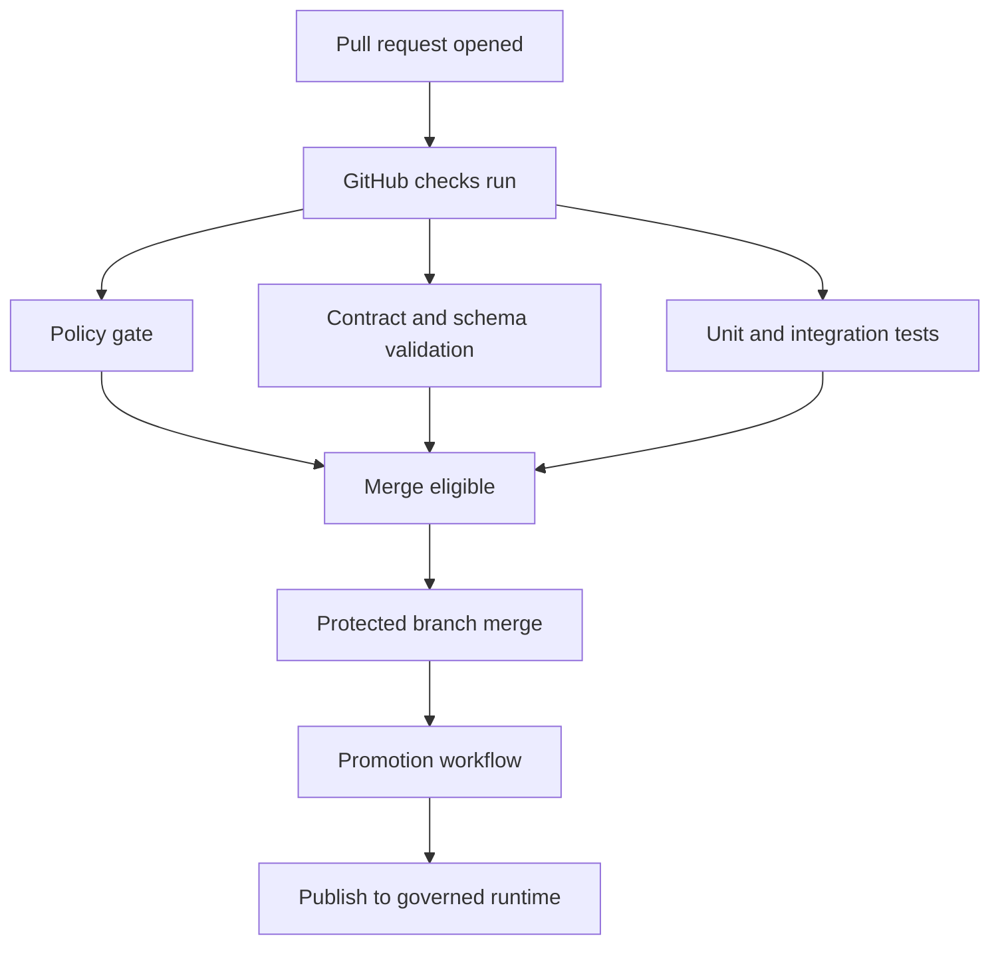

<!-- [KFM_META_BLOCK_V2]
doc_id: kfm://doc/4f0a4c1a-4f7e-4f5b-86d4-9b3b1c5c5c7a
title: .github README
type: standard
version: v1
status: draft
owners: KFM Platform Engineering (TODO: set CODEOWNERS)
created: 2026-03-03
updated: 2026-03-03
policy_label: public
related: [".github/", ".github/workflows/", ".github/ISSUE_TEMPLATE/", ".github/PULL_REQUEST_TEMPLATE.md"]
tags: [kfm, github, cicd, governance]
notes: ["Docs are a production surface. Keep this file current with CI policy + workflow changes."]
[/KFM_META_BLOCK_V2] -->

# `.github/` — GitHub governance, CI/CD, and contribution automation

One place for the **governance boundary** on GitHub: workflows, templates, and repository policies that keep KFM **evidence-first** and **fail-closed**.

> **Status:** **active** (governed surface) • **Owners:** **TODO** (`CODEOWNERS`) • **Change posture:** **small, reversible, additive**
>
>    
>
> **Jump to:** [Scope](#scope) • [Where it fits](#where-it-fits) • [Inputs](#acceptable-inputs) • [Exclusions](#exclusions) • [Directory tree](#directory-tree) • [Workflow registry](#workflow-registry) • [Change checklist](#change-checklist) • [FAQ](#faq)

---

## Scope

**CONFIRMED:** This repo uses `.github/` for **CI/CD workflows, templates, and CODEOWNERS**-style governance scaffolding.  
**PROPOSED:** This directory is the **single source of truth** for GitHub enforcement: “what checks run,” “who must review,” and “what fails closed.”

### Evidence status ledger (read this before editing)
- **CONFIRMED:** KFM operates with a strict “truth path” lifecycle and governance gates (promotion is not casual).  
- **CONFIRMED:** `.github/` is intended for CI/CD workflows and contribution governance artifacts.  
- **UNKNOWN:** The exact set of workflows already present in *your* branch (verify with `ls .github/workflows`).  
- **PROPOSED:** A baseline workflow suite is documented below (names/paths may need to be adapted).

**Smallest verification steps to turn UNKNOWN → CONFIRMED**
1. Run `ls -la .github/` and `ls -la .github/workflows/`.
2. Open each workflow file and confirm:
   - triggers (`on:`) and affected paths,
   - required secrets (if any),
   - which checks are branch-protection required.
3. Update the [Workflow registry](#workflow-registry) table to match reality.

---

## Where it fits

**CONFIRMED (concept):** KFM separates “clients/UI” from storage and treats governance as a first-class membrane.  
**PROPOSED (GitHub mapping):** `.github/` is the **GitHub-side enforcement layer** that helps ensure:
- No change reaches protected branches without required checks + reviews.
- Policy gates (OPA/Rego), contract tests, and provenance checks block promotion PRs by default.

### Upstream/downstream connections
- **Upstream:** contributor actions (PRs, issues, discussions), automation (scheduled workflows), dependency updates.
- **Downstream:** merge decisions, release and promotion pipelines, provenance receipts attached to PRs, and any publish step.

---

## Acceptable inputs

Put only GitHub governance artifacts here.

**CONFIRMED/EXPECTED inputs**
- GitHub Actions workflows: `.github/workflows/*.yml`
- Templates:
  - `.github/ISSUE_TEMPLATE/*`
  - `.github/PULL_REQUEST_TEMPLATE.md`
- Ownership + review rules:
  - `.github/CODEOWNERS` (if used)
- Repo automation configs (optional, only if used):
  - `.github/dependabot.yml`
  - `.github/labeler.yml`
  - `.github/release.yml`

---

## Exclusions

Do **not** place these in `.github/`:

- **Secrets or credentials** (ever) — **PROPOSED rule**: use GitHub Encrypted Secrets / OIDC only.
- Application code (belongs in `apps/` / `packages/` or equivalent).
- Data artifacts (RAW/WORK/PROCESSED/PUBLISHED) or catalogs.
- Large binaries (screenshots, datasets) — keep `.github/` lightweight and auditable.
- Policy bundles or schemas themselves (belong in `policy/`, `contracts/`, `schemas/`, etc.).

---

## Directory tree

**UNKNOWN:** Your repository’s exact `.github/` contents.  
**PROPOSED (recommended layout):**

```text
.github/
├── README.md
├── CODEOWNERS                         # optional but strongly recommended
├── PULL_REQUEST_TEMPLATE.md           # PR template (governance prompts)
├── ISSUE_TEMPLATE/
│   ├── bug_report.yml
│   ├── feature_request.yml
│   └── dataset_intake.yml
├── workflows/
│   ├── ci.yml                         # unit + integration + lint
│   ├── policy-gate.yml                # OPA/Rego Conftest gates (fail-closed)
│   ├── catalog-qa.yml                 # STAC/DCAT quick checks (fast fail)
│   ├── contracts.yml                  # schema + OpenAPI contract validation
│   ├── security.yml                   # SBOM + dependency scanning (if enabled)
│   └── release.yml                    # release/publish orchestration (if enabled)
└── dependabot.yml                     # optional
```

---

## Quickstart

### Local sanity checks (developer workstation)

**PROPOSED:** Run these before opening a PR that touches governance-relevant code or data.

```bash
# YAML lint (if you use yamllint)
yamllint .github/workflows

# Repo search: ensure no secrets accidentally landed
git grep -nE "(AKIA|-----BEGIN|ghp_|ghs_|xoxb-|PRIVATE KEY)" -- .

# If you use OPA/Conftest locally
opa version
conftest --version
```

### What must pass on PR

**CONFIRMED (posture):** Fail closed by default for governance gates.  
**PROPOSED (minimum):**
- Workflow lints + schema checks
- Policy checks (OPA/Rego)
- Contract tests (OpenAPI, JSON Schema, STAC/DCAT/PROV validators as applicable)
- Determinism/repro checks for produced artifacts (where applicable)

---

## How CI enforces the KFM “truth path”

**CONFIRMED (concept):** KFM promotes data through lifecycle zones with explicit gates.  
**PROPOSED (GitHub enforcement):** Workflows implement those gates as merge-blocking checks.

### Conceptual flow


```mermaid
flowchart TD
  PR[Pull request opened] --> Checks[GitHub checks run]
  Checks --> Policy[Policy gate]
  Checks --> Contracts[Contract and schema validation]
  Checks --> Tests[Unit and integration tests]
  Policy --> Ready[Merge eligible]
  Contracts --> Ready
  Tests --> Ready
  Ready --> Merge[Protected branch merge]
  Merge --> Promote[Promotion workflow]
  Promote --> Publish[Publish to governed runtime]
```

---

## Workflow registry

**UNKNOWN:** Your exact workflow set today.  
**PROPOSED:** Keep this table updated so contributors know what will block a merge.

| Workflow (path) | Primary purpose | Typical triggers | Fail-closed gates | Evidence status |
|---|---|---|---|---|
| `.github/workflows/ci.yml` | Lint, unit tests, integration tests | `pull_request`, `push` | tests must pass | **PROPOSED** |
| `.github/workflows/policy-gate.yml` | OPA/Rego policy checks (Conftest) | `pull_request` on policy/data/contracts paths | deny by default on missing provenance/rights | **PROPOSED** |
| `.github/workflows/catalog-qa.yml` | Fast STAC/DCAT “quick gate” | `pull_request` on `data/**` | missing required metadata fails | **PROPOSED** |
| `.github/workflows/contracts.yml` | Validate OpenAPI + JSON schemas | `pull_request` on `contracts/**` | schema/contract drift fails | **PROPOSED** |
| `.github/workflows/security.yml` | SBOM + dependency scanning | schedule + PR | critical findings fail | **PROPOSED** |
| `.github/workflows/release.yml` | Build/release + attestations | tags/manual | unsigned artifacts fail | **PROPOSED** |

> **IMPORTANT:** If a workflow exists but is not listed here, add it (or delete it). `.github/` is a governed surface.

---

## Governance expectations for workflow changes

### Review and ownership

**PROPOSED hard rule (recommended):**
- Any change under `.github/workflows/**` requires:
  - CODEOWNER review (platform/governance),
  - at least 1 additional engineer review,
  - passing workflow validation/lints.

### Secrets and credentials

**PROPOSED baseline:**
- Prefer **OIDC + short-lived tokens** over long-lived secrets.
- Workflows must not print secrets; sanitize logs.
- No personal access tokens (PATs) unless explicitly approved and scoped.

---

## Policy gate surface

**CONFIRMED (concept):** KFM governance includes policy enforcement that should be automated and merge-blocking.  
**PROPOSED (implementation posture):**
- Run Conftest/OPA on:
  - dataset manifests / receipts
  - catalog triplets (STAC/DCAT/PROV)
  - provenance attestation references
  - licensing and sensitivity classification fields

### Policy toolchain (recommended)
- **OPA** for compilation and v1 compatibility checks.
- **Conftest** for CI-friendly assertions over incoming artifacts/manifests.

---

## CI gates matrix

Use this matrix to keep enforcement explicit and auditable.

| Gate | What it protects | Inputs | Output | Pass criteria | Evidence status |
|---|---|---|---|---|---|
| Policy gate | Licensing, sensitivity, provenance completeness | manifests, receipts, policy bundles | conftest report | no denies | **PROPOSED** |
| Schema gate | Contract drift + invalid metadata | OpenAPI/JSON schema/STAC/DCAT | validator output | 0 errors | **PROPOSED** |
| Test gate | correctness + regressions | unit/integration suites | test reports | green tests | **PROPOSED** |
| Repro gate | deterministic artifacts | run receipts + checksums | compare hashes | identical outputs | **PROPOSED** |
| Security gate | supply chain trust | SBOM + scans + attestations | scan results | within thresholds | **PROPOSED** |

---

## Change checklist

Use this before merging any `.github/**` change.

- [ ] **PROPOSED:** Workflows remain **fail-closed** (no “allow on error” for gates that protect governance).
- [ ] **PROPOSED:** Branch protection still requires the intended checks.
- [ ] **PROPOSED:** No secrets or tokens added to repo (including examples).
- [ ] **PROPOSED:** Any new workflow has:
  - clear `on:` triggers
  - minimal permissions (`permissions:` block)
  - pinned actions versions (`@v4`, commit SHA if required)
  - timeouts and concurrency where needed
- [ ] **PROPOSED:** Documentation updated:
  - this file’s [Workflow registry](#workflow-registry)
  - any runbooks that describe CI behavior
- [ ] **PROPOSED:** Rollback path exists (revert commit restores last known good gating).

---

## FAQ

### Why is `.github/` treated as “governed”?
**CONFIRMED (principle):** CI and policy are part of the system’s trust membrane.  
**PROPOSED:** A one-line YAML change can silently weaken enforcement; we treat this as production-critical.

### I added a workflow—how do I make sure it actually blocks merges?
**PROPOSED steps:**
1. Ensure the workflow runs on `pull_request` for the relevant paths.
2. Require the workflow check in branch protection rules.
3. Add it to the [Workflow registry](#workflow-registry).
4. Add a failing test PR to verify it blocks.

### Where do I put documentation for a new gate?
**PROPOSED:** Put operator details in `docs/runbooks/` and link it from this README.

---

## Appendix

<details>
<summary>Suggested PR template prompts (governance-aware)</summary>

**PROPOSED content** for `.github/PULL_REQUEST_TEMPLATE.md`:

- What does this change affect?
- Does it change governance, policy, or promotion behavior?
- What evidence/receipts are attached (or why not)?
- What is the rollback plan?
- Which datasets or catalogs are touched?
- Any sensitivity classification changes?

</details>

<details>
<summary>Recommended GitHub Actions permissions baseline</summary>

**PROPOSED:**
- Default: `contents: read`
- Add only what is needed:
  - `pull-requests: write` for PR comments/labels
  - `checks: write` for check runs
  - `id-token: write` for OIDC
  - Avoid broad `contents: write` unless the workflow commits (and then restrict to bot branches)

</details>

---

## Back to top

[↑ Back to top](#github--github-governance-cicd-and-contribution-automation)
