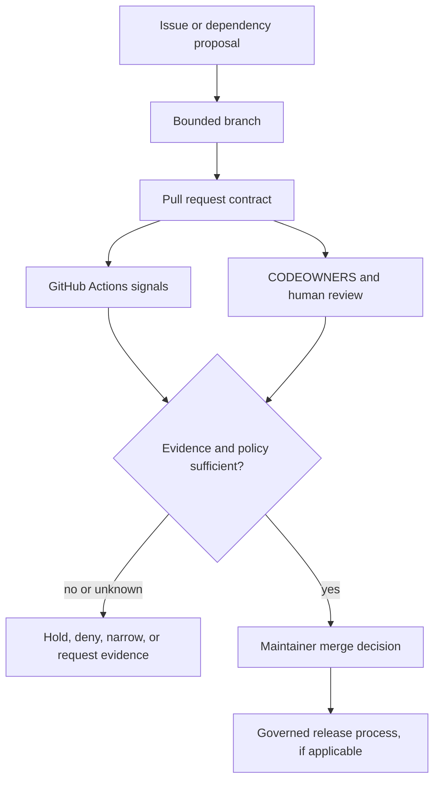

<!-- [KFM_META_BLOCK_V2]
doc_id: kfm://doc/github-folder-readme
title: .github — GitHub Platform Governance Hooks
type: README
version: v1.3
status: draft; repository-grounded
owners: ["@bartytime4life"]
created: 2026-05-11
updated: 2026-07-22
policy_label: public
owning_root: .github/
responsibility: GitHub-platform governance hooks, review routing, dependency intake, issue and pull-request intake, and CI orchestration
truth_posture: cite-or-abstain; implementation claims are bounded to the pinned repository snapshot
evidence_snapshot:
  repository: bartytime4life/Kansas-Frontier-Matrix
  base_ref: main
  base_commit: 1180cf7ec53d5acbbb859a39d93c1d129ec83df9
  inventory: 54 tracked paths; 41 workflow YAML files; 6 issue chooser templates
related:
  - ../README.md
  - ../CONTRIBUTING.md
  - ../SECURITY.md
  - ../docs/doctrine/directory-rules.md
  - ../docs/architecture/directory-rules.md
  - ../docs/doctrine/ai-build-operating-contract.md
  - ../docs/registers/DRIFT_REGISTER.md
  - ../docs/registers/VERIFICATION_BACKLOG.md
  - CODEOWNERS
  - PULL_REQUEST_TEMPLATE.md
  - ISSUE_TEMPLATE/README.md
  - workflows/README.md
notes:
  - "This README records repository files and static configuration; it does not prove GitHub settings, branch protection, workflow success, release approval, or publication."
  - "Directory Rules identifies .github/ as the canonical GitHub-platform hook root. The repository retains two Directory Rules editions whose placement remains a documented conflict; this README does not resolve it."
[/KFM_META_BLOCK_V2] -->

<a id="top"></a>

# `.github/` — GitHub platform governance hooks

[](#status-and-evidence-boundary)
[](#confirmed-inventory)
[](workflows/README.md)
[](ISSUE_TEMPLATE/README.md)
[](#authority-boundary)
[](#authority-boundary)

> GitHub Actions, review routing, issue and pull-request intake, and dependency-update configuration for KFM. This root orchestrates repository checks; it does not own policy, schemas, contracts, evidence, release decisions, or publication.

## Quick navigation

- [Purpose](#purpose)
- [Authority boundary](#authority-boundary)
- [Status and evidence boundary](#status-and-evidence-boundary)
- [Confirmed inventory](#confirmed-inventory)
- [Operating flow](#operating-flow)
- [What belongs here](#what-belongs-here)
- [What does not belong here](#what-does-not-belong-here)
- [Security and trust controls](#security-and-trust-controls)
- [Validation](#validation)
- [Review and change discipline](#review-and-change-discipline)
- [Related authority](#related-authority)
- [Open verification items](#open-verification-items)
- [Rollback](#rollback)
- [Changelog](#changelog)

## Purpose

`.github/` is the KFM responsibility root for GitHub-specific platform hooks:

- GitHub Actions orchestration;
- CODEOWNERS review routing;
- pull-request and issue intake templates;
- Dependabot configuration;
- optional GitHub community-health metadata.

It translates repository-owned commands and KFM governance expectations into review-visible platform behavior. It must remain thin enough that local tooling can reproduce material checks.

## Authority boundary

| Concern | Authority owner | `.github/` role |
|---|---|---|
| GitHub event triggers, job graphs, token permissions, and check names | `.github/workflows/` | Define platform orchestration. |
| Review routing | `.github/CODEOWNERS` | Request review from verified GitHub identities; not proof that review occurred. |
| Contribution intake | `.github/ISSUE_TEMPLATE/`, `.github/PULL_REQUEST_TEMPLATE.md` | Ask for evidence, scope, validation, and rollback; not accept or approve the claim. |
| Dependency proposals | `.github/dependabot.yml` | Open reviewable update PRs; not establish compatibility or security. |
| Semantic meaning | `contracts/` | Workflows invoke checks; they do not redefine contracts. |
| Machine-checkable shape | `schemas/` | Workflows validate against canonical schemas. |
| Allow, deny, restrict, hold, or abstain decisions | `policy/` | Workflows evaluate policy; they do not author it inline. |
| Evidence, receipts, proofs, and lifecycle data | governed `data/` lanes | Logs and artifacts are review aids unless admitted through the governed lifecycle. |
| Release, correction, withdrawal, and rollback decisions | `release/` | CI may dry-run or verify; it does not approve or publish. |

> [!IMPORTANT]
> A workflow pass proves only that the declared job completed for the declared revision and inputs. It does not prove EvidenceBundle closure, rights clearance, policy approval, release readiness, or publication.

## Status and evidence boundary

This document is pinned to `main@1180cf7ec53d5acbbb859a39d93c1d129ec83df9` on 2026-07-22.

| Surface | Confirmed repository state | Boundary |
|---|---|---|
| Tracked `.github/` paths | **54** | Count includes the three README files. GitHub settings are external to this tree. |
| Workflows | **41 `.yml` files** plus [`workflows/README.md`](workflows/README.md) | File presence and static syntax do not prove recent successful runs or required-check status. |
| Issue intake | **6 Markdown chooser templates** plus [`ISSUE_TEMPLATE/README.md`](ISSUE_TEMPLATE/README.md) | No issue-form YAML or chooser `config.yml` is present. Blank-issue behavior remains settings-dependent. |
| Pull-request intake | [`PULL_REQUEST_TEMPLATE.md`](PULL_REQUEST_TEMPLATE.md) | Rendering and use are repository-visible; completion and enforcement remain review questions. |
| Review routing | [`CODEOWNERS`](CODEOWNERS) routes all paths to `@bartytime4life` with narrower path entries | Branch protection and required code-owner review remain **NEEDS VERIFICATION**. |
| Dependency intake | [`dependabot.yml`](dependabot.yml) configures pip, npm, GitHub Actions, and pre-commit version updates | Dependabot execution history and security-update state were not inspected. |
| Funding | [`FUNDING.yml`](FUNDING.yml) contains only a KFM placeholder comment | It does not configure an active funding provider. |
| Root `CODEOWNERS` | **Absent at this snapshot** | `.github/CODEOWNERS` is the single tracked CODEOWNERS file on this revision. |

> [!WARNING]
> Branch protection, rulesets, repository token defaults, private vulnerability reporting, label existence, Dependabot execution, and workflow run results live outside this file tree. Keep those claims `NEEDS VERIFICATION` until inspected through GitHub settings or run evidence.

## Confirmed inventory

```text
.github/
├── README.md
├── CODEOWNERS
├── FUNDING.yml                         # comment-only placeholder
├── PULL_REQUEST_TEMPLATE.md
├── dependabot.yml
├── ISSUE_TEMPLATE/
│   ├── README.md
│   ├── adr.md
│   ├── bug.md
│   ├── evidence_correction.md
│   ├── feature.md
│   ├── sensitivity_concern.md
│   └── source_admission.md
└── workflows/
    ├── README.md
    └── 41 workflow .yml files
```

The complete workflow filename and maturity inventory lives in [`workflows/README.md`](workflows/README.md). The issue chooser contract lives in [`ISSUE_TEMPLATE/README.md`](ISSUE_TEMPLATE/README.md).

### Platform surfaces

| Surface | Current role | Current posture |
|---|---|---|
| [`CODEOWNERS`](CODEOWNERS) | Default and path-specific review routing | Executable GitHub configuration; one verified user identity; enforcement unknown. |
| [`PULL_REQUEST_TEMPLATE.md`](PULL_REQUEST_TEMPLATE.md) | Task contract, evidence, Directory Rules, trigger threat preflight, validation, receipt, rollback, and review prompts | Governance-bearing intake; not an approval record. |
| [`dependabot.yml`](dependabot.yml) | Weekly dependency-update proposals across four ecosystems | Proposal-only; no automatic merge or release authority. |
| [`ISSUE_TEMPLATE/`](ISSUE_TEMPLATE/README.md) | Public-safe issue routing | Six Markdown templates; settings and labels partly unverified. |
| [`workflows/`](workflows/README.md) | CI and readiness orchestration | Mixed implementation maturity; all workflows require claim-by-claim interpretation. |
| [`FUNDING.yml`](FUNDING.yml) | GitHub Sponsors/community-health surface | Inactive placeholder. |

## Operating flow


```mermaid
flowchart TD
    I["Issue or dependency proposal"] --> B["Bounded branch"]
    B --> P["Pull request contract"]
    P --> C["CODEOWNERS and human review"]
    P --> W["GitHub Actions signals"]
    W --> D{"Evidence and policy sufficient?"}
    C --> D
    D -->|no or unknown| H["Hold, deny, narrow, or request evidence"]
    D -->|yes| M["Maintainer merge decision"]
    M --> R["Governed release process, if applicable"]
```

Neither a merged pull request nor a green check is a KFM data-publication event. Publication remains a separate governed transition.

## What belongs here

- GitHub Actions workflow definitions under `workflows/`.
- Repository-local reusable or composite actions under `actions/` when real reuse is established.
- One active CODEOWNERS file at a GitHub-supported location.
- GitHub issue, pull-request, discussion, funding, and dependency-intake configuration.
- Minimal comments explaining permissions, trigger trust boundaries, stable check names, and rollback.
- README documentation for the root and substantial subtrees.

## What does not belong here

- validator or domain logic that belongs in `tools/`, `packages/`, `pipelines/`, or applications;
- Rego, allowlists, sensitivity rules, rights rules, or release policy that belongs in `policy/`;
- contracts, schemas, fixtures, source descriptors, canonical evidence, receipts, proofs, catalogs, or releases;
- credentials, private endpoints, restricted payloads, exact sensitive locations, or secret-bearing logs;
- ordinary CI that writes directly to `data/published/`, catalog/triplet authority, or release authority;
- duplicate configuration created only to make the tree look complete.

## Security and trust controls

The current workflow snapshot has these static properties:

- all 41 workflows declare a top-level `permissions` boundary;
- no `pull_request_target` trigger, self-hosted runner, or direct `secrets.*` reference is present;
- no ordinary `contents`, `issues`, `pull-requests`, `packages`, `deployments`, or `id-token` write grant is present;
- CodeQL alone grants `security-events: write`, which is required to upload code-scanning results;
- all external action references use major-version tags rather than immutable commit SHAs.

These are static findings, not a runtime security certification. See the [workflow threat preflight](workflows/README.md#trigger-and-permission-preflight) for maintenance rules.

> [!CAUTION]
> Do not place vulnerabilities, credentials, restricted source material, living-person private data, DNA/genomic data, exact rare-species or archaeology locations, or critical-infrastructure exposure details in public issues, pull requests, logs, artifacts, or generated receipts. Follow [`SECURITY.md`](../SECURITY.md) and fail closed.

## Validation

### Repository-native and static checks

```bash
# Inspect the exact tree and review scope.
git status --short
git diff --check
git diff --name-only <base>...HEAD

# Parse YAML with a YAML 1.2-capable parser or actionlint.
actionlint .github/workflows/*.yml

# Run repository checks applicable to the changed behavior.
make validate
```

Do not claim a command passed unless it was actually run. A README-only batch should additionally verify:

- one H1 per README;
- balanced fences, alerts, HTML, and details blocks;
- heading hierarchy and fragment links;
- every repository-relative link at the proposed head;
- inventory counts against `git ls-files`;
- no secret, credential, signed-URL, or exact-sensitive-location material;
- no changed workflow, trigger, permission, template behavior, or check name.

## Review and change discipline

1. Pin the base commit and inspect overlapping branches or pull requests.
2. Read [`CONTRIBUTING.md`](../CONTRIBUTING.md), [`SECURITY.md`](../SECURITY.md), Directory Rules, this README, and the nearest subtree README.
3. Define the event, path scope, untrusted-input boundary, permissions, network use, expected outcomes, and rollback before changing a workflow.
4. Preserve stable workflow and job names unless branch-protection coupling is verified and updated deliberately.
5. Keep one bounded responsibility per branch and default to a draft pull request for governance-significant or AI-authored work.
6. Never self-approve, merge, publish, deploy, enable auto-merge, or weaken a gate without explicit authority.

## Related authority

| Path | Relationship |
|---|---|
| [`../CONTRIBUTING.md`](../CONTRIBUTING.md) | Repository contribution, evidence, validation, branch, PR, and receipt discipline. |
| [`../SECURITY.md`](../SECURITY.md) | Private-first security reporting and sensitive-information boundary. |
| [`../docs/doctrine/directory-rules.md`](../docs/doctrine/directory-rules.md) | Directory Rules edition at the proposed doctrine home. |
| [`../docs/architecture/directory-rules.md`](../docs/architecture/directory-rules.md) | Parallel Directory Rules edition; placement conflict remains recorded. |
| [`../docs/doctrine/ai-build-operating-contract.md`](../docs/doctrine/ai-build-operating-contract.md) | AI-assisted work, truth labels, receipts, review, and rollback. |
| [`../policy/`](../policy/) | Allow, deny, restrict, hold, and abstain authority. |
| [`../tools/validators/`](../tools/validators/) | Repository-owned validator logic invoked by CI. |
| [`../schemas/`](../schemas/) and [`../contracts/`](../contracts/) | Machine shape and semantic meaning. |
| [`../tests/`](../tests/) and [`../fixtures/`](../fixtures/) | Enforceable behavior and deterministic examples. |
| [`../data/receipts/`](../data/receipts/) and [`../data/proofs/`](../data/proofs/) | Governed receipt and proof homes. |
| [`../release/`](../release/) | Release, correction, withdrawal, and rollback authority. |

## Open verification items

- **NEEDS VERIFICATION** — exact branch-protection rules and required check names.
- **NEEDS VERIFICATION** — whether required code-owner review is enabled.
- **NEEDS VERIFICATION** — repository and organization default `GITHUB_TOKEN` settings.
- **NEEDS VERIFICATION** — current workflow run conclusions, pass rates, logs, and artifact retention.
- **NEEDS VERIFICATION** — issue labels requested by `adr.md` and blank-issue chooser behavior.
- **NEEDS VERIFICATION** — private vulnerability reporting enablement.
- **NEEDS VERIFICATION** — Dependabot execution and security-update state.
- **PROPOSED hardening** — replace action major tags with reviewed immutable commit SHAs if the repository adopts SHA pinning as an enforced standard.
- **PROPOSED cleanup** — remove `FUNDING.yml` or configure a verified provider; the current comment-only placeholder has no active effect.

## Rollback

For documentation-only changes, restore the previous README blobs or revert the review commit, rerun the same checks, and confirm that no workflow or platform setting changed. Workflow and check-name rollback must also account for branch protection and any generated reviewer artifacts.

## Changelog

| Date | Version | Change |
|---|---|---|
| 2026-07-22 | v1.3 | Reconciled the parent README to the complete 54-path tree, 41 workflows, six issue templates, current CODEOWNERS and Dependabot configuration, static permission posture, and explicit external-settings boundary. Removed the obsolete target tree and unmatched HTML close tag. |
| 2026-07-08 | v1.2 | Added a repository-aware draft, but retained a partial inventory and target workflow map. |
| 2026-05-22 | v1.1 | Established the doctrine-grounded GitHub governance boundary. |

[Back to top](#top)
