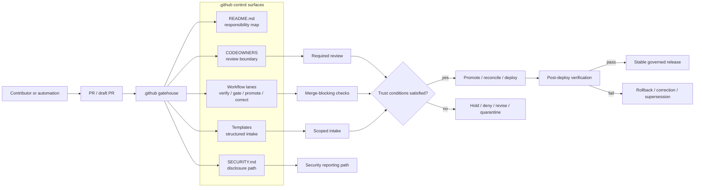

<!-- [KFM_META_BLOCK_V2]
doc_id: kfm://doc/repo/.github/readme
title: .github README
type: standard
version: v2
status: draft
owners: NEEDS_VERIFICATION
created: 2026-03-15
updated: 2026-03-19
policy_label: NEEDS_VERIFICATION
related: [../README.md, ../CONTRIBUTING.md, ../docs/governance/, ../docs/architecture/, ../docs/domains/, ../docs/runbooks/, ../docs/adr/, ../contracts/, ../policy/, ../data/registry/, ../apps/, ../packages/, ../infra/, ../tools/, ../scripts/, ../tests/, ./workflows/, ./CODEOWNERS, ./PULL_REQUEST_TEMPLATE.md, ./SECURITY.md]
tags: [kfm, github, governance, ci-cd, gitops, verification, review, release-evidence, delivery]
notes: [This revision is grounded in March 2026 KFM doctrine plus mounted repo-audit/support material. `.github/README.md`, `.github/CODEOWNERS`, `.github/SECURITY.md`, and `../CONTRIBUTING.md` are documentary-confirmed through attached repo-audit material; the live `.github/workflows/` inventory, exact template filenames, exact `CODEOWNERS` contents, branch-protection settings, required checks, and environment approvals were not directly re-inspected from a mounted checkout in this session.]
[/KFM_META_BLOCK_V2] -->

<div align="center">
  <strong>Kansas Frontier Matrix</strong><br />
  <sub>Repo gatehouse for review, verification, and governed delivery</sub>
</div>

# `.github`

Repository-wide governance, collaboration, verification, and governed delivery entrypoint for Kansas Frontier Matrix.


| Field | Value |
|---|---|
| Status | experimental |
| Owners | **NEEDS_VERIFICATION** |
| Path | `.github/README.md` |
| Repo role | Gatehouse for PR-first collaboration, merge-blocking checks, release evidence, promotion discipline, rollback/correction readiness, and contributor-facing governance |
| Truth posture | **CONFIRMED doctrine · CONFIRMED documentary repo evidence for core `.github` files · INFERRED inventory-backed workflow/template surfaces · UNKNOWN live checkout details** |
| Current evidence in this revision | Mounted March 2026 KFM PDFs plus repo-audit/support material; **no direct live checkout** of `.github/workflows/`, GitHub branch protection, environment approvals, or exact workflow YAML contents |

**Quick jump:** [Scope](#scope) · [Repo fit](#repo-fit) · [Accepted inputs](#accepted-inputs) · [Exclusions](#exclusions) · [Directory tree](#directory-tree) · [Quickstart](#quickstart) · [Usage](#usage) · [Diagram](#diagram) · [Control surfaces](#control-surfaces) · [Task list / definition of done](#task-list--definition-of-done) · [FAQ](#faq) · [Appendix](#appendix)

> [!IMPORTANT]
> This README is **evidence-bounded**.
>
> It is grounded in March 2026 KFM doctrine plus mounted repo-audit/support material, but it does **not** claim a direct current-session reinspection of the live `.github/` tree, exact workflow YAML filenames, exact required checks, exact branch-protection settings, or exact `CODEOWNERS` entries.
>
> Use these labels throughout this file:
> - **CONFIRMED** — directly supported by mounted KFM doctrine or documentary repo-audit material visible in this session
> - **INFERRED** — supported by attached repo inventory / audit material, but not rechecked from a live checkout here
> - **PROPOSED** — realization guidance consistent with KFM doctrine
> - **UNKNOWN** — not established strongly enough in this session
> - **NEEDS VERIFICATION** — placeholder or claim that should be checked against the live repository before merge

## Scope

`.github/` is KFM’s repository-level **gatehouse**.

This directory is where contributor intake, review boundaries, CI/CD, promotion, release evidence, and correction discipline stop being informal intentions and become executable controls. In KFM terms, that makes `.github/` one of the clearest repository expressions of the **trust membrane**: changes pass through review, verification, policy, and promotion controls before they widen into public-facing or release-bearing state.

A successful `.github/` tree does not merely “run CI.” It protects the repository-truth rule, keeps failure structural instead of ornamental, and makes rollback, correction, and approval boundaries visible.

### Evidence boundary used here

| Evidence layer | What this README treats as settled |
|---|---|
| **CONFIRMED** | KFM’s PR-first, merge-blocking, fail-closed, evidence-bearing delivery doctrine; documentary confirmation that `.github/README.md`, `.github/CODEOWNERS`, `.github/SECURITY.md`, and `../CONTRIBUTING.md` exist in repo-audit material |
| **INFERRED** | `.github/workflows/`, issue/PR template surfaces, and broader repo inventory described in attached repo-audit documents |
| **UNKNOWN** | Direct live checkout details: exact workflow YAML set, exact required checks, exact branch protections, exact environment approvals, exact current `CODEOWNERS` entries |

> [!NOTE]
> Platform state is **not** the same thing as repo state. Branch protection, required checks, environment reviewers, and GitHub App permissions must be verified in GitHub settings or exported governance evidence, not assumed from repository files alone.

[Back to top](#github)

## Repo fit

**Path:** `.github/README.md`

**Role in repo:** directory README for repository-wide governance, review boundaries, CI/CD, release evidence, and correction posture.

**Repo-native obligation:** explain how repo-wide controls preserve the KFM truth path without pretending `.github/` is the canonical home of contracts, policy bodies, datasets, or runtime code.

### Upstream and downstream anchors

| Direction | Path | Why it matters | Status in this README |
|---|---|---|---|
| Upstream | [`../README.md`](../README.md) | repo-wide entrypoint and project framing | INFERRED / NEEDS VERIFICATION |
| Upstream | [`../CONTRIBUTING.md`](../CONTRIBUTING.md) | contributor workflow and contribution expectations | CONFIRMED documentary evidence |
| Upstream | [`../CHANGELOG.md`](../CHANGELOG.md) | change significance and release narrative | INFERRED / NEEDS VERIFICATION |
| Upstream | [`../docs/`](../docs/) | doctrine, architecture, ADRs, runbooks, and domain references | INFERRED / NEEDS VERIFICATION |
| Upstream | [`../contracts/`](../contracts/) | canonical machine-readable contract surfaces | INFERRED / NEEDS VERIFICATION |
| Upstream | [`../policy/`](../policy/) | policy bundles, fixtures, and policy tests | INFERRED / NEEDS VERIFICATION |
| Upstream | [`../data/registry/`](../data/registry/) | source descriptors and registry-driven intake | INFERRED / NEEDS VERIFICATION |
| Downstream | [`./CODEOWNERS`](./CODEOWNERS) | executable review-boundary map | CONFIRMED documentary evidence |
| Downstream | [`./SECURITY.md`](./SECURITY.md) | security reporting and disclosure entrypoint | CONFIRMED documentary evidence |
| Downstream | [`./workflows/`](./workflows/) | CI/CD, verification, promotion, and correction lanes | INFERRED / NEEDS VERIFICATION |
| Downstream | [`./PULL_REQUEST_TEMPLATE.md`](./PULL_REQUEST_TEMPLATE.md) | contributor PR contract | INFERRED / NEEDS VERIFICATION |
| Downstream | [`./ISSUE_TEMPLATE/`](./ISSUE_TEMPLATE/) | structured issue intake | INFERRED / NEEDS VERIFICATION |

<details>
<summary><strong>Broader repo context</strong> — documentary inventory only</summary>

```text
repo/
├── .github/              # repo-wide governance and CI/CD gatehouse
├── docs/                 # human-readable doctrine, runbooks, ADRs, schemas
├── contracts/            # API contracts and schemas
├── policy/               # policy code and fixtures
├── data/                 # registry, lifecycle zones, and catalogs
├── apps/                 # runnable services and UIs
├── packages/             # reusable domain/use-case modules
├── infra/                # deployment infrastructure
├── tools/                # validators and utility tooling
├── scripts/              # build / release / promotion helpers
└── tests/                # unit, integration, policy, and e2e verification
```

</details>

[Back to top](#github)

## Accepted inputs

The following content belongs in `.github/` when it applies across the whole repository rather than one package or app.

| Input class | What belongs here | Why it belongs here |
|---|---|---|
| Workflow definitions | CI, verification, docs, promotion, rollback, correction, and release lanes | repo-wide control and merge behavior live here |
| Review-boundary files | `CODEOWNERS`, approval-boundary notes, protected-branch guidance | review is part of KFM’s trust system |
| Structured contributor intake | issue templates, PR templates, review checklists | intake should be shaped before change widens |
| Reusable governance automation | composite actions, shared setup helpers, policy/install helpers | reduces drift without hiding behavior |
| Security/community health entrypoints | `SECURITY.md`, advisory/reporting guidance, automation identity notes | makes trust surfaces discoverable at repo level |

## Exclusions

`.github/` can gate, reference, or validate these surfaces, but it should not quietly replace them as their canonical home.

| Does **not** belong here as canonical truth | Keep it here instead |
|---|---|
| machine-readable schemas, OpenAPI specs, vocabularies, envelopes | [`../contracts/`](../contracts/) |
| policy bodies, reason-code registries, fixtures, policy tests | [`../policy/`](../policy/) |
| source descriptors, raw/work/processed/catalog truth | [`../data/`](../data/) and [`../data/registry/`](../data/registry/) |
| runtime services, UI logic, ingestion logic, evidence resolvers | [`../apps/`](../apps/) and [`../packages/`](../packages/) |
| release artifacts, proof packs, manifests, immutable bundle inventory | designated release / evidence paths, not ad hoc `.github/` storage |
| architecture manuals, domain doctrine, ADRs, runbooks | [`../docs/`](../docs/) |

[Back to top](#github)

## Directory tree

The exact live `.github/` tree was **not** directly mounted in this session. The map below distinguishes **documentary-confirmed** files from **inventory-backed** surfaces that still need live reinspection.

```text
.github/
├── README.md                   # CONFIRMED documentary repo evidence
├── CODEOWNERS                  # CONFIRMED documentary repo evidence
├── SECURITY.md                 # CONFIRMED documentary repo evidence
├── workflows/                  # INFERRED inventory-backed; live YAML set not re-inspected
├── ISSUE_TEMPLATE/             # INFERRED inventory-backed; exact files not re-inspected
└── PULL_REQUEST_TEMPLATE.md    # INFERRED inventory-backed; exact path not re-inspected
```

> [!TIP]
> Treat the tree above as a **review map**, not a guarantee that every listed child has been re-read from the current repository checkout. For live accuracy, re-run the quickstart commands below in the mounted repo and update this README in the same PR.

## Quickstart

Before editing any repo-wide governance surface, confirm the live tree first.

```bash
# 0) Start from the repo root
git rev-parse --show-toplevel 2>/dev/null || pwd

# 1) Inventory the gatehouse
find .github -maxdepth 2 -type f | sort

# 2) Inspect confirmed boundary files
sed -n '1,220p' .github/README.md 2>/dev/null || true
sed -n '1,220p' .github/CODEOWNERS 2>/dev/null || true
sed -n '1,220p' .github/SECURITY.md 2>/dev/null || true
sed -n '1,220p' CONTRIBUTING.md 2>/dev/null || true

# 3) Check templates and workflow names before changing gates
find .github -maxdepth 2 -type f \
  \( -name '*PULL*' -o -path '.github/ISSUE_TEMPLATE/*' -o -path '.github/workflows/*' \) \
  2>/dev/null | sort

grep -R '^name:' .github/workflows 2>/dev/null || true

# 4) Confirm adjacent authority surfaces
find contracts -maxdepth 2 -type f 2>/dev/null | sort | sed -n '1,80p'
find policy -maxdepth 2 -type f 2>/dev/null | sort | sed -n '1,80p'
find docs -maxdepth 2 -type d 2>/dev/null | sort | sed -n '1,80p'

# 5) Platform-state checks are outside the repo tree:
#    branch protection, required status checks, environment reviewers,
#    and GitHub App permissions must be checked in GitHub settings or exported evidence.
```

## Usage

Use this README as the responsibility map for repo-wide change.

1. **Inspect before editing.** Confirm the live `.github/` tree, actual required checks, and actual review boundaries before changing filenames, section claims, or responsibility language.
2. **Map the change to trust impact.** Ask whether the edit changes contributor intake, merge-blocking logic, release evidence, correction posture, or trust-visible behavior.
3. **Edit the smallest surface that works.** KFM prefers small, reversible governance changes over sprawling rewrites.
4. **Update adjacent documentation in the same governed stream.** If a workflow, template, or approval boundary changes how trust is earned, released, rolled back, or corrected, the docs must travel with the change.

A useful mental model for `.github/` changes is:

> **Intake → Verify → Review → Promote → Reconcile / Deploy → Verify again → Correct when needed**

### When this file should change

- when repo-wide workflow responsibilities change
- when review boundaries or `CODEOWNERS` expectations change
- when contributor intake moves or becomes more structured
- when release evidence, rollback, or correction posture changes
- when platform-state verification steps need sharper guidance

[Back to top](#github)

## Diagram


```mermaid
flowchart LR
    A[Contributor or automation] --> B[PR / draft PR]
    B --> C[.github gatehouse]

    subgraph G[".github control surfaces"]
      G1["README.md<br/>responsibility map"]
      G2["CODEOWNERS<br/>review boundary"]
      G3["Workflow lanes<br/>verify / gate / promote / correct"]
      G4["Templates<br/>structured intake"]
      G5["SECURITY.md<br/>disclosure path"]
    end

    C --> G1
    C --> G2
    C --> G3
    C --> G4
    C --> G5

    G2 --> H[Required review]
    G3 --> I[Merge-blocking checks]
    G4 --> J[Scoped intake]
    G5 --> K[Security reporting path]

    H --> L{Trust conditions satisfied?}
    I --> L
    J --> L

    L -->|yes| M[Promote / reconcile / deploy]
    L -->|no| N[Hold / deny / revise / quarantine]

    M --> O[Post-deploy verification]
    O -->|pass| P[Stable governed release]
    O -->|fail| Q[Rollback / correction / supersession]
```

## Control surfaces

| Surface | Current evidence status | Primary role | Why it is sensitive |
|---|---|---|---|
| [`./README.md`](./README.md) | CONFIRMED documentary evidence | responsibility map for repo-wide governance and review posture | if it drifts, reviewers lose the boundary map |
| [`./CODEOWNERS`](./CODEOWNERS) | CONFIRMED documentary evidence | executable review ownership | changes approval scope and separation of duty |
| [`./SECURITY.md`](./SECURITY.md) | CONFIRMED documentary evidence | security reporting / disclosure path | affects incident intake and trust posture |
| [`./workflows/`](./workflows/) | INFERRED / NEEDS VERIFICATION | CI, policy, promotion, rollback, correction | directly affects merge, release, and post-deploy trust |
| [`./PULL_REQUEST_TEMPLATE.md`](./PULL_REQUEST_TEMPLATE.md) | INFERRED / NEEDS VERIFICATION | contributor PR contract | shapes evidence, rollback, and docs expectations at intake |
| [`./ISSUE_TEMPLATE/`](./ISSUE_TEMPLATE/) | INFERRED / NEEDS VERIFICATION | structured defect / request intake | controls how work enters governed review |
| GitHub platform settings | UNKNOWN in this session | branch protection, required checks, environment approvals, app permissions | repo truth can still fail if platform gates drift |

### Review-sensitive changes

| Change class | Typical KFM review class | Minimum review expectation | Why it matters |
|---|---|---|---|
| non-behavioral README copy cleanup | Class 1 | normal peer review | safe unless instructions or trust posture change |
| `CODEOWNERS` edits | Class 2–5 depending on scope | owner/steward review distinct from author when boundaries change materially | changes who can approve protected work |
| workflow logic, required checks, or release lanes | Class 3 | technical owner review plus environment / operations reviewer as needed | changes merge, promotion, or rollback behavior |
| security reporting or automation-identity changes | Class 3–5 | security/platform review | affects disclosure path, secrets, or automation trust |
| policy-significant public-truth release controls | Class 5 | separation of duty required | public confidence must not depend on self-approval |
| emergency correction / withdrawal mechanics | Class 6 | emergency authority path plus after-action evidence | correction must stay visible and auditable |

[Back to top](#github)

## Task list / definition of done

- [ ] The live `.github/` tree was re-inspected from the mounted repository before merge.
- [ ] `.github/README.md`, `.github/CODEOWNERS`, `.github/SECURITY.md`, and `CONTRIBUTING.md` were checked line-by-line against the current repo.
- [ ] The actual workflow inventory under `.github/workflows/` was compared with this README.
- [ ] Required status checks and protected-branch rules were verified in GitHub settings, not assumed from repo files alone.
- [ ] Environment approvals, deployment reviewers, and automation identities were rechecked where relevant.
- [ ] Repo-wide automation still preserves PR-first, fail-closed behavior.
- [ ] Documentation still follows the repository-truth rule: docs, schemas, policies, and workflow behavior move through the same governed stream.
- [ ] Promotion, rollback, and correction expectations remain documented where behavior depends on them.
- [ ] UNKNOWN items remain explicit instead of being rewritten as certainty.
- [ ] Adjacent docs and templates were updated in the same PR if behavior-significant controls changed.

## FAQ

### Does this README claim the live workflow set is fully verified?

No. It separates **documentary repo evidence** from **inventory-backed inference** and **UNKNOWN live checkout details**.

### Why is `.github/` treated as architecture and not just “CI config”?

Because KFM’s doctrine treats review, verification, promotion, rollback, and correction as part of one governed trust system. `.github/` is where much of that system becomes executable.

### Should contracts or policy bodies live in `.github/`?

No. `.github/` should gate and reference those surfaces, not replace them as their canonical home.

### What must be rechecked outside the repo tree?

Branch protection, required checks, environment approvals, GitHub App permissions, and other platform-state controls.

## Appendix

<details>
<summary><strong>Evidence boundary and maintainer notes</strong></summary>

### What is strongest in this revision

- KFM doctrine on PR-first collaboration, required checks, merge-blocking verification, release evidence, rollback/correction, and the repository-truth rule
- documentary repo-audit evidence confirming:
  - `.github/README.md`
  - `.github/CODEOWNERS`
  - `.github/SECURITY.md`
  - `CONTRIBUTING.md`
- repo-inventory material that consistently places `.github/` in the governance / CI/CD layer

### What remains open until a live checkout is mounted

- exact `.github/workflows/` filename set
- exact issue and PR template filenames and locations
- exact `CODEOWNERS` contents and review handles
- actual branch-protection settings and required checks
- actual environment approvals and deploy-review rules
- actual GitHub App, OIDC, or secret-management wiring

### Maintainer guidance

- Preserve KFM terms: **truth path**, **trust membrane**, **authoritative vs derived**, **EvidenceBundle**, **PR-first**, **fail-closed**, **promotion**, **rollback**, **correction**.
- Prefer explicit placeholders over invented owners, reviewers, or platform settings.
- Prefer smaller, reversible edits to governance surfaces over sweeping rewrites.
- Keep this file a **responsibility map** rather than a duplicate home for policy bodies, schemas, or runtime code.

</details>

<details>
<summary><strong>Verification backlog</strong></summary>

1. Reinspect the live `.github/` tree and replace documentary/inferred placeholders with exact file reality.
2. Verify whether `.github/ISSUE_TEMPLATE/` and `.github/PULL_REQUEST_TEMPLATE.md` exist in the current checkout exactly as named.
3. Inventory actual workflow YAMLs and map each to docs, policy, provenance, promotion, rollback, and correction duties.
4. Export or inspect protected-branch settings and required status checks.
5. Recheck `CODEOWNERS` coverage against governance-critical planes.
6. Confirm whether reusable actions, GitHub App wiring, and environment-approval flows are mounted and active.
7. Retire UNKNOWN items only when direct repo or platform evidence is attached to the same PR.

</details>

[Back to top](#github)