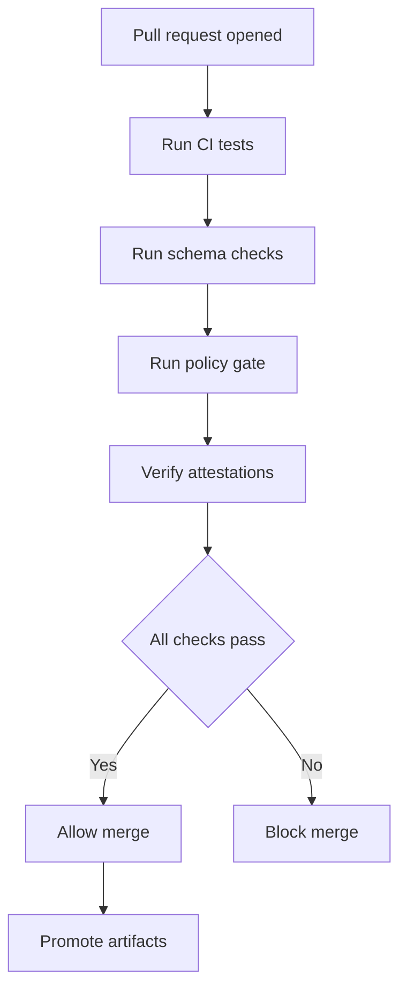

<!-- [KFM_META_BLOCK_V2]
doc_id: kfm://doc/4150adce-f3ea-497e-8aed-704db50fd615
title: ".github — GitHub Automation, Governance, and CI/CD"
type: standard
version: v1
status: draft
owners: TBD
created: 2026-03-03
updated: 2026-03-03
policy_label: public
related:
  - ../README.md
  - ../docs/
  - ../policy/
tags: [kfm, github, ci, governance, supply-chain]
notes:
  - "This README documents the contract for repo automation under .github/."
  - "Every meaningful claim is tagged Confirmed, Proposed, or Unknown."
[/KFM_META_BLOCK_V2] -->

# .github — GitHub Automation, Governance, and CI/CD

**Purpose:** define and govern all GitHub-side automation (Actions workflows, reusable Actions, templates, and CODEOWNERS) for KFM.  
**Status:** `draft` · **Owners:** `TBD` · **Policy posture:** `default-deny, fail-closed`

 <!-- TODO: wire to workflow badge -->
 <!-- TODO -->
 <!-- TODO -->
 <!-- TODO -->
 <!-- TODO -->

## Quick navigation

- [Directory contract](#directory-contract)
- [Claim status tags](#claim-status-tags)
- [Governance model](#governance-model)
- [Workflow inventory](#workflow-inventory)
- [Templates and ownership](#templates-and-ownership)
- [Branch protection baseline](#branch-protection-baseline)
- [How to add or change automation](#how-to-add-or-change-automation)
- [Appendix](#appendix)

---

## Directory contract

### Where this fits in the repo

- **Confirmed:** `.github/` is reserved for **CI/CD workflows, templates, and CODEOWNERS**.  
- **Proposed:** `.github/` is treated as a *policy-critical surface* because it can change what gets merged, released, or promoted.

### Acceptable inputs

- **Confirmed:** GitHub Actions workflows under `.github/workflows/`.
- **Proposed:** Reusable composite actions under `.github/actions/`.
- **Proposed:** Issue and PR templates under `.github/ISSUE_TEMPLATE/` and `.github/PULL_REQUEST_TEMPLATE.md`.
- **Proposed:** Repository metadata files that GitHub recognizes (example: `CODEOWNERS`, `dependabot.yml`, `SECURITY.md`).

### Exclusions

- **Confirmed:** **No secrets** in this directory (or anywhere in the repo).  
- **Proposed:** No generated build artifacts (binaries, large archives, model weights, dataset snapshots).  
- **Proposed:** No long-lived credentials (PATs) embedded in workflow YAML.

[Back to top](#github--github-automation-governance-and-cicd)

---

## Claim status tags

Every meaningful statement in this file is tagged:

- ✅ **Confirmed** — supported by KFM documents or repo inventory evidence.
- 🧪 **Proposed** — recommended contract / intended implementation.
- ❓ **Unknown** — not verified in the repo yet.

### Minimal verification steps for Unknown items

When a row/statement is **Unknown**, the smallest steps to make it **Confirmed** are:

1. `ls -R .github/` and record the directory tree (commit it into the PR description).
2. Inspect repository settings:
   - branch protection rules,
   - required checks,
   - CODEOWNERS enforcement,
   - Actions permissions and runner settings.
3. Confirm any referenced workflow exists and matches the documented intent.

[Back to top](#github--github-automation-governance-and-cicd)

---

## Governance model

### Non-negotiable posture

- 🧪 **Proposed:** **Fail-closed** — missing policy inputs, receipts, attestations, or validation outputs must block merge/publish.
- 🧪 **Proposed:** **Default-deny** — promotion is denied unless explicitly allowed by policy.
- 🧪 **Proposed:** **PR-first promotion** — changes to catalogs, provenance, and publishable outputs land via PRs and are re-validated in CI.

### Process diagram


```mermaid
flowchart TD
  A[Pull request opened] --> B[Run CI tests]
  B --> C[Run schema checks]
  C --> D[Run policy gate]
  D --> E[Verify attestations]
  E --> F{All checks pass}
  F -->|Yes| G[Allow merge]
  F -->|No| H[Block merge]
  G --> I[Promote artifacts]
```

- 🧪 **Proposed:** “Promote artifacts” is only allowed for the PROCESSED or PUBLISHED lanes when policy says it is allowed.

[Back to top](#github--github-automation-governance-and-cicd)

---

## Workflow inventory

> [!NOTE]
> This section documents the *intended* workflow catalog. If a workflow is not present in the repo, mark it **Unknown** until created.

### Workflows

| Path | Purpose | Triggers | Evidence outputs | Minimum permissions | Status |
|---|---|---|---|---|---|
| `.github/workflows/kfm-ci.yml` | Main entry workflow that calls reusable lane workflows | `pull_request`, `workflow_dispatch` | test reports, artifacts | `contents: read` | 🧪 Proposed |
| `.github/workflows/reusables/kfm-reusable-ci.yml` | Shared lane runner with guardrails and packaging | `workflow_call` | lane artifacts | `contents: read` | 🧪 Proposed |
| `.github/workflows/kfm-policy-gate.yml` | Merge-blocking policy checks via Conftest | `pull_request` | deny messages, receipts bundle | `contents: read` | 🧪 Proposed |
| `.github/workflows/kfm-attest.yml` | Produce/verify keyless attestations | `pull_request`, `push` | cosign bundles, provenance | `id-token: write` | 🧪 Proposed |
| `.github/workflows/kfm-release.yml` | Release and publish workflow | `workflow_dispatch`, `release/*` | SBOM, release manifest | `contents: write` | 🧪 Proposed |
| `.github/workflows/watch-and-pr.yml` | Watch external sources and open PRs on material change | `workflow_call`, `schedule` | run manifest, diff | `pull-requests: write` | 🧪 Proposed |
| `.github/workflows/merge-gate.yml` | Final merge gate checks | `pull_request` | final decision record | `contents: read` | 🧪 Proposed |

### Required guardrails

- 🧪 **Proposed:** Concurrency uses cancel-in-progress on PR workflows.
- 🧪 **Proposed:** A repo-level or environment kill-switch can disable promotion lanes.
- 🧪 **Proposed:** Artifact retention defaults short unless an exception is documented.

[Back to top](#github--github-automation-governance-and-cicd)

---

## Templates and ownership

### CODEOWNERS

- 🧪 **Proposed:** `CODEOWNERS` exists and requires review for:
  - `.github/**`
  - `policy/**`
  - `contracts/**`
  - `tools/validators/**`
  - `scripts/release/**`

**Recommended pattern**

```text
# Critical surfaces
/.github/            @kfm-platform
/policy/             @kfm-governance
/contracts/          @kfm-platform
/tools/validators/   @kfm-platform
/scripts/release/    @kfm-release-engineering
```

### Pull request template

- 🧪 **Proposed:** PR template forces “evidence-first” summaries and links to receipts.

Suggested minimum fields:

- spec_hash
- artifacts produced (paths + digests)
- policy decision summary (allow or deny + reason)
- rollback plan

### Issue templates

- 🧪 **Proposed:** issue templates distinguish:
  - data pipeline change,
  - policy change,
  - workflow/CI change,
  - UI/API change.

[Back to top](#github--github-automation-governance-and-cicd)

---

## Branch protection baseline

- ❓ **Unknown:** Which branches are protected and what checks are required.

### Minimal baseline

- 🧪 **Proposed:** Require these checks to pass before merge:
  - unit tests,
  - schema validators,
  - policy gate,
  - attestation verification (when promotion is in scope).

### Minimal verification steps

- ❓ **Unknown → Confirmed:** open repo settings and record:
  - required status checks list,
  - whether “Require review from Code Owners” is enabled,
  - whether admins are subject to restrictions.

[Back to top](#github--github-automation-governance-and-cicd)

---

## How to add or change automation

### Definition of done

A workflow or composite action change is done only if:

- 🧪 **Proposed:** Permissions are least-privilege and documented.
- 🧪 **Proposed:** The workflow is deterministic (pinned versions for critical tools).
- 🧪 **Proposed:** The workflow emits machine-readable evidence artifacts (receipts, reports).
- 🧪 **Proposed:** Policy gates are updated alongside behavior changes.
- 🧪 **Proposed:** Rollback path is documented (revert PR, disable workflow, kill-switch).

### Checklist for new workflows

- [ ] 🧪 Proposed: choose the narrowest trigger possible (`pull_request` over broad schedules).
- [ ] 🧪 Proposed: pin action versions (e.g., `actions/checkout@v4`).
- [ ] 🧪 Proposed: add `permissions:` explicitly and minimize it.
- [ ] 🧪 Proposed: add concurrency rules.
- [ ] 🧪 Proposed: add artifact upload for receipts and reports.
- [ ] 🧪 Proposed: add policy evaluation (OPA/Conftest) before any “promote” step.
- [ ] 🧪 Proposed: document “what changed” and “how to verify” in this README.

[Back to top](#github--github-automation-governance-and-cicd)

---

## Appendix

<details>
<summary>Example skeleton workflow</summary>

```yaml
name: PR Gates

on:
  pull_request:
    types: [opened, synchronize, reopened]

permissions:
  contents: read
  id-token: write

concurrency:
  group: pr-${{ github.event.pull_request.number }}
  cancel-in-progress: true

jobs:
  gate:
    runs-on: ubuntu-latest
    steps:
      - uses: actions/checkout@v4

      - name: Run tests
        run: make ci.test

      - name: Policy gate
        run: conftest test receipts/run_receipt.json -p policy/

      - name: Upload receipts
        uses: actions/upload-artifact@v4
        with:
          name: receipts
          path: receipts/
```

</details>

<details>
<summary>Example watcher workflow idea</summary>

```yaml
name: Watch and PR

on:
  workflow_call:
    inputs:
      source_url:
        required: true
        type: string

jobs:
  watch:
    runs-on: ubuntu-latest
    steps:
      - uses: actions/checkout@v4
      - run: |
          echo "Probe source, compute spec hash, write run manifest"
          # Then open PR if changed
```

</details>

[Back to top](#github--github-automation-governance-and-cicd)
