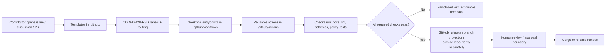

<!-- [KFM_META_BLOCK_V2]
doc_id: kfm://doc/github-readme-v1
title: .github
type: standard
version: v1
status: draft
owners: verify via /.github/CODEOWNERS
created: 2026-03-07
updated: 2026-03-07
policy_label: public
related: [/README.md, /.github/CODEOWNERS, /.github/workflows, /.github/actions, /.github/ISSUE_TEMPLATE, /.github/DISCUSSION_TEMPLATE, /.github/PULL_REQUEST_TEMPLATE, /.github/required-checks.v1.json, /policy, /tests, /docs, /CONTRIBUTING.md]
tags: [kfm, github, ci, governance, docs, workflows, codeowners]
notes: [Directory README for GitHub-side automation, templates, ownership routing, required-check synchronization, and merge discipline. Out-of-repo GitHub settings remain UNKNOWN until verified on the target branch.]
[/KFM_META_BLOCK_V2] -->

<a id="top"></a>

# `.github`
GitHub-native control plane for workflows, templates, ownership routing, and merge discipline.

> **Status:** draft  
> **Owners:** verify in [`./CODEOWNERS`](./CODEOWNERS)  
>       
> **Quick jump:** [Purpose](#purpose) · [Evidence posture](#evidence-posture) · [Repo fit](#repo-fit) · [Scope](#scope) · [Accepted inputs](#accepted-inputs) · [Exclusions](#exclusions) · [Current snapshot](#current-control-plane-snapshot) · [Control-plane model](#control-plane-model) · [Quickstart](#quickstart) · [Change discipline](#change-discipline) · [Definition of done](#definition-of-done) · [FAQ](#faq)

## Purpose

This directory is KFM’s **GitHub-side automation and collaboration surface**.

It should hold the files that shape how work enters the repo, how reviewers are routed, how required checks are expressed, and how contributor-facing templates stay aligned with KFM’s evidence-first posture.

`.github/` should make governance **more visible**, not hide it. Workflows can trigger validation, docs checks, policy tests, schema checks, and release automation, but they are **not** the source of truth for runtime policy, business logic, or publishable evidence.

## Evidence posture

### Truth labels used here

| Label | Meaning |
|---|---|
| **CONFIRMED** | Visible in the supplied repo snapshot or directly supported by governing KFM documentation. |
| **PROPOSED** | Recommended structure or operating discipline for this directory. |
| **UNKNOWN** | Not verified on the current branch or may live outside the repo in GitHub settings. |

### Directory posture

| Status | Statement |
|---|---|
| **CONFIRMED** | `.github/` is the repo’s GitHub-facing control plane for workflows, templates, support files, and ownership routing. |
| **CONFIRMED** | This directory is for collaboration and automation surfaces, not runtime business logic. |
| **PROPOSED** | `.github/README.md` should be the directory-level contract for what belongs here, how changes are reviewed, and how required checks stay legible. |
| **UNKNOWN** | Exact branch protections, rulesets, environment approvals, and which checks currently block merge on the target branch. |

## Repo fit

**Path:** `/.github/README.md`

**Repo role:** directory guide for GitHub-native collaboration, routing, and CI/CD ergonomics.

**Upstream**
- repo-root posture in [`../README.md`](../README.md)
- repo contribution and security expectations
- KFM trust-membrane and promotion-gate architecture
- GitHub rulesets / branch protections that may live outside the repo

**Downstream**
- workflow entrypoints in [`./workflows/`](./workflows/)
- reusable local actions in [`./actions/`](./actions/)
- issue, discussion, and PR templates
- ownership routing via [`./CODEOWNERS`](./CODEOWNERS)
- support and collaboration files such as [`./SUPPORT.md`](./SUPPORT.md)

## Scope

Use this README for:

| Use | Why |
|---|---|
| Directory purpose and boundary | Keeps `.github/` from becoming a junk drawer. |
| Control-plane inventory | Makes workflows, actions, templates, and routing files visible. |
| Verification-first guidance | Prevents undocumented assumptions about rulesets and required checks. |
| Change discipline | Keeps workflow names, manifests, docs, and review expectations in sync. |
| Collaboration ergonomics | Improves intake quality without pretending templates enforce runtime policy. |

Do **not** use this README for:

| Do not use it for | Where it belongs instead |
|---|---|
| Runtime business logic | `apps/` or `packages/` |
| Policy source of truth | `policy/` plus governed backend enforcement |
| API contracts or schema definitions | `contracts/` or `schemas/` |
| Dataset catalogs, manifests, provenance records | `data/` |
| Long-form architecture and runbooks | `docs/` |
| Generated evidence bundles, receipts, or release artifacts | governed data / artifact paths |
| Secrets, credentials, machine-local configuration | GitHub secrets / secret manager / local env |

## Accepted inputs

The following belong in `.github/` when they are GitHub-facing and repo-governance relevant:

| Input | Examples | Why it belongs here |
|---|---|---|
| Workflow entrypoints | CI, docs lint, policy-gate, validation, release, packaging workflows | They define GitHub-triggered automation. |
| Reusable local actions | composite actions, setup wrappers, shared validation helpers | They keep repeated workflow logic centralized and reviewable. |
| Contribution templates | issue forms, discussion prompts, PR templates | They shape structured intake and review. |
| Ownership and routing metadata | `CODEOWNERS`, review-routing helpers | They make responsibility visible. |
| Repo-side governance manifests | required-check manifests, label configs, update configs | They keep GitHub-side behavior inspectable in-repo. |
| Community support files | code of conduct, support guidance | They govern collaboration surfaces. |
| Docs-lint and contribution guardrails | markdown enforcement wiring, README checks | KFM treats docs as an operational surface. |

## Exclusions

The following do **not** belong here:

| Exclusion | Why it stays out | Where it belongs instead |
|---|---|---|
| App/runtime business logic | `.github/` is not an application module. | `apps/` or `packages/` |
| Policy source of truth | Templates can request evidence, but policy must be enforced by governed layers and tests. | `policy/` and backend enforcement paths |
| API and schema definitions | Public contracts should not be buried in workflow files. | `contracts/` or `schemas/` |
| Dataset specs, catalogs, provenance records | Data lifecycle artifacts must stay on the truth path. | `data/` |
| Runbooks and long-form architecture docs | Keep durable operational guidance in the docs plane. | `docs/` |
| Secrets, credentials, tokens | Never commit secrets to the repo. | secret manager / CI secret store |
| Generated build outputs or evidence bundles | Promotion artifacts are not configuration. | governed output paths or release surfaces |
| Restricted infrastructure data or policy-bearing exports | GitHub automation can gate them, but should not become their publication home. | governed data and release paths |

## Current control-plane snapshot

Treat the tree below as the **working snapshot supplied for this draft**. Verify it locally before treating it as current-branch truth.

### Directory tree

```text
.github/
├── DISCUSSION_TEMPLATE/
├── ISSUE_TEMPLATE/
├── PULL_REQUEST_TEMPLATE/
├── actions/
├── workflows/
├── CODEOWNERS
├── CODE_OF_CONDUCT.md
├── PULL_REQUEST_TEMPLATE.md
├── README.md
├── SUPPORT.md
├── dependabot.yml
├── labeler.yml
└── required-checks.v1.json
```

### Control-plane inventory

| Path | Intended use | Verification note |
|---|---|---|
| `DISCUSSION_TEMPLATE/` | Structured discussion intake and guided conversation prompts | Verify current file set locally. |
| `ISSUE_TEMPLATE/` | Structured bug, feature, governance, or task intake | Verify current file set locally. |
| `PULL_REQUEST_TEMPLATE/` | Specialized PR scaffolds where one default template is not enough | Verify current file set locally. |
| `actions/` | Reusable local GitHub actions that keep workflows smaller and more consistent | Verify action interfaces and callers locally. |
| `workflows/` | Workflow entrypoints for checks, validation, automation, and release | Verify active workflow names and triggers locally. |
| `CODEOWNERS` | Ownership routing and review boundaries | Verify with actual GitHub team/user mapping. |
| `CODE_OF_CONDUCT.md` | Community behavior expectations for repo collaboration surfaces | Verify alignment with repo-root docs. |
| `PULL_REQUEST_TEMPLATE.md` | Default pull request template | Verify whether specialized templates override it. |
| `README.md` | Directory guide for the GitHub control plane | This file. |
| `SUPPORT.md` | Help and support routing guidance | Verify support channels are current. |
| `dependabot.yml` | Dependency/update automation config | Verify package ecosystem coverage and schedules. |
| `labeler.yml` | Label automation or label-routing config | Verify label names still exist. |
| `required-checks.v1.json` | Repo-local manifest of required or expected checks | Exact schema / consumer remains `UNKNOWN` until verified. |

### What belongs where

| Topic | Best home | Why |
|---|---|---|
| GitHub event wiring | `.github/workflows/` | Keeps automation explicit and reviewable. |
| Shared workflow building blocks | `.github/actions/` | Avoids copy-paste workflow logic. |
| Contributor intake forms | `.github/ISSUE_TEMPLATE/`, `.github/DISCUSSION_TEMPLATE/`, PR templates | Shapes better requests and reviews. |
| Ownership routing | `.github/CODEOWNERS` | Makes review responsibility visible. |
| Required-check naming / manifests | `.github/required-checks.v1.json` | Keeps check names versioned near workflow changes. |
| Support and conduct | `.github/` top-level docs | Keeps GitHub-facing collaboration materials together. |
| Runtime policy logic | `policy/` | Policy must remain testable and separate from forms. |
| Contracts and schemas | `contracts/`, `schemas/` | Public interface guarantees need their own governed home. |

[Back to top](#top)

## Control-plane model

`.github/` is one plane inside a larger governed system. It should coordinate with policy, contracts, schemas, tests, and runtime services without replacing them.

### Control-plane principles

| Principle | Status | What it means here |
|---|---|---|
| Trust-membrane alignment | **CONFIRMED** | GitHub automation may validate and route work, but it must not create a side door around governed API/policy boundaries. |
| Fail-closed gate posture | **CONFIRMED** | Missing or broken required checks should block merge/release instead of degrading quietly. |
| Stable, inspectable gates | **PROPOSED** | Workflow names, check names, and repo-side manifests should stay synchronized. |
| Least-privilege automation | **PROPOSED** | Use explicit permissions, minimal scopes, and small reusable actions. |
| Human approval boundary | **PROPOSED** | Automation can prepare policy-significant outputs, but approval should remain human or separately controlled. |
| Evidence-aware intake | **PROPOSED** | Templates should ask for changed paths, validation, policy impact, and rollback notes. |
| Docs stay aligned with behavior | **PROPOSED** | README, templates, manifests, and contribution docs should update together when control-plane behavior changes. |

### Workflow classes

| Workflow class | Typical triggers | What it should do | What it should not do |
|---|---|---|---|
| Intake / triage | issue, discussion, PR opened/edited | apply labels, scaffold requests, direct routing | pretend a template alone enforces policy |
| Hygiene gates | `pull_request`, `push` | docs lint, YAML lint, link checks, formatting checks | publish or approve policy-significant outputs |
| Governance gates | `pull_request`, `workflow_call` | run policy tests, schema/catalog validators, evidence/link checks | bypass review because automation passed |
| Build / release / attestation | tags, manual dispatch, release events | package, attest, prepare release materials, verify artifact naming | self-approve sensitive releases |
| Maintenance automation | schedules, manual dispatch | dependency refresh, stale triage, label hygiene | silently mutate protected state without review |

### Out-of-repo settings to verify

Some GitHub behavior may not live in the repo at all.

| Surface | Why it matters | Status here |
|---|---|---|
| Branch protections / rulesets | Determine required checks, merge conditions, and actor permissions | **UNKNOWN** |
| Environment approvals | Can gate deploy/release jobs or restricted operations | **UNKNOWN** |
| Secret and variable scopes | Affect workflow behavior and blast radius | **UNKNOWN** |
| Team/user mapping behind `CODEOWNERS` | Determines real reviewer routing | **UNKNOWN** |
| Merge queue / auto-merge settings | Can change how required checks are evaluated in practice | **UNKNOWN** |

### Diagram


```mermaid
flowchart LR
    A[Contributor opens issue / discussion / PR] --> B[Templates in .github/]
    B --> C[CODEOWNERS + labels + routing]
    C --> D[Workflow entrypoints in .github/workflows]
    D --> E[Reusable actions in .github/actions]
    E --> F[Checks run: docs, lint, schemas, policy, tests]
    F --> G{All required checks pass?}
    G -- No --> H[Fail closed with actionable feedback]
    G -- Yes --> I[GitHub rulesets / branch protections<br/>outside repo; verify separately]
    I --> J[Human review / approval boundary]
    J --> K[Merge or release handoff]
```

## Quickstart

Use this to re-ground `.github/` in the current branch before making claims about how the repo works.

```bash
# identify the exact revision
git rev-parse HEAD

# inspect the GitHub control plane surface
find .github -maxdepth 3 -type f | sort
find .github -maxdepth 3 -type d | sort

# inspect workflow names, triggers, and common safety knobs
grep -RIn "^name:" .github/workflows || true
grep -RIn "^[[:space:]]*on:" .github/workflows || true
grep -RIn "workflow_call:|concurrency:|timeout-minutes:" .github/workflows || true
grep -RIn "^[[:space:]]*permissions:" .github/workflows || true

# inspect action usage and version references
grep -RIn "uses:" .github/workflows .github/actions || true

# inspect ownership, templates, and required-check wiring
sed -n '1,200p' .github/CODEOWNERS 2>/dev/null || true
find .github/ISSUE_TEMPLATE .github/DISCUSSION_TEMPLATE .github/PULL_REQUEST_TEMPLATE -maxdepth 2 -type f 2>/dev/null | sort
cat .github/required-checks.v1.json 2>/dev/null || true

# inspect related governance surfaces outside .github
find policy -maxdepth 3 -type f 2>/dev/null | sort
find contracts schemas tests -maxdepth 3 -type f 2>/dev/null | sort
```

### Verify these before documenting branch behavior as fact

1. Which workflow names are actually active on the target branch?
2. Which checks are required by GitHub rulesets or branch protections?
3. Which reusable actions are production-critical versus helper wrappers?
4. Which templates are default versus specialized?
5. Which automation paths can create or publish outputs, and where is human approval enforced?
6. Which settings live only in GitHub and therefore cannot be confirmed from files alone?

## Change discipline

### 1) Workflow changes

When you add or modify a workflow:

1. keep workflow names stable if they are referenced by required checks
2. use explicit, least-privilege permissions
3. add `timeout-minutes` and `concurrency` where jobs can hang or pile up
4. prefer reusable actions or reusable workflows over repeated YAML
5. make failures visible, actionable, and fail-closed
6. update this README when the control-plane shape or expectations change

### 2) Reusable action changes

When you change a local action in [`./actions/`](./actions/):

1. treat it like an interface, not a throwaway script
2. keep inputs, outputs, and assumptions obvious
3. keep actions small, composable, and testable
4. avoid smuggling repo business logic into GitHub wrappers
5. update callers and docs together

### 3) Template changes

When you update issue, discussion, or PR templates:

1. ask for the minimum information needed to review well
2. request affected paths, validation, policy impact, and rollback notes
3. do not ask contributors to paste secrets, credentials, or private tokens
4. keep templates aligned with repo-root posture and contribution docs
5. do not pretend that a template itself enforces runtime policy

### 4) Ownership and required-check changes

When you change `CODEOWNERS`, check names, or required-check manifests:

1. preserve clear accountability
2. avoid collapsing submitter and approver for policy-significant changes
3. keep governance-heavy areas explicitly owned
4. update workflow names, manifest entries, and docs in the **same change**
5. verify whether GitHub rulesets read from the manifest directly or whether it is advisory only

### 5) Change bundles

A good `.github/` change usually updates the related surfaces together.

| Change type | Update together |
|---|---|
| Workflow name / check name change | workflow file, `required-checks.v1.json`, README, and ruleset-verification notes |
| Local action interface change | action metadata, callers, README, and smoke validation |
| Template prompt change | template file, README, and contributor-facing docs |
| Ownership routing change | `CODEOWNERS`, README, and reviewer/approval notes |
| Release-flow change | workflow, approval assumptions, artifact naming, and rollback notes |

### 6) Permissions, secrets, and supply-chain posture

| Rule | Why it matters |
|---|---|
| Use explicit `permissions:` blocks | Reduces blast radius when a job is compromised or misconfigured. |
| Keep external action references intentional | Reduces drift and makes supply-chain review easier. |
| Set timeouts and concurrency where appropriate | Prevents hung jobs and duplicate noisy runs. |
| Keep artifact naming and retention intentional | Improves auditability and rollback clarity. |
| Never print or solicit secrets in templates or logs | Reduces accidental leakage. |
| Separate PR validation from protected release jobs | Preserves approval boundaries. |

### 7) Governance-sensitive change cues

Some changes need stronger prompts in templates and stronger review expectations.

| Change area | Prompt reviewers to ask | Expected gates |
|---|---|---|
| `.github/workflows/`, `.github/actions/`, `required-checks.v1.json` | Did check names change? Did permissions widen? What is the rollback path? | CI smoke run, README update, ruleset verification |
| `policy/`, `contracts/`, `schemas/` | What contract or policy changed? Is the change backward-compatible? | policy tests, schema/contract validation |
| `data/` catalog or provenance surfaces | Which catalogs, links, or evidence paths changed? | STAC/DCAT/PROV validation, link checks |
| Restricted city / infrastructure exposure | Does this affect public vs restricted data handling, export, or redaction? | policy checks, denial-path tests, audit/log review |
| Story / AI / Focus Mode changes | How are citations, abstention, and policy checks affected? | evaluation harness, policy tests, docs update |
| Educational / scenario surfaces | Is the fact/speculation boundary still explicit? What changed for privacy/accessibility? | docs update, scenario/role tests, reviewer confirmation |

### 8) Docs are a governed surface

Because KFM treats docs as operational, `.github/` changes should also consider:

- template clarity
- README accuracy
- review ergonomics
- support discoverability
- merge-gate transparency

## Definition of done

A `.github/` change is in good shape when all of the following are true:

- [ ] The change fits the directory boundary and does not smuggle runtime logic into GitHub config.
- [ ] Workflow names, check names, and manifests remain aligned.
- [ ] Permissions are explicit and least-privilege for the job’s purpose.
- [ ] Templates ask for useful evidence and do not solicit secrets.
- [ ] `CODEOWNERS` and reviewer routing remain intentional.
- [ ] Required-check and ruleset assumptions are verified or explicitly kept `UNKNOWN`.
- [ ] README and contribution-facing docs were updated when behavior changed.
- [ ] The change is additive, reversible, and reviewable.
- [ ] Policy enforcement remains in governed backend/tested layers, not just in form text.
- [ ] There is a clear rollback path if the automation misbehaves.

## FAQ

### Why keep some facts marked `UNKNOWN`?
Because branch protections, rulesets, environment approvals, and secret scopes can exist outside the repo. KFM should not claim hidden GitHub settings as if they were proven by files alone.

### Why not put policy logic in PR templates?
Templates help contributors provide context, but runtime policy must be enforced by governed code, tests, and merge gates.

### Why do stable check names matter?
Because required checks often depend on exact workflow/job names. Renaming a check without updating manifests and GitHub rulesets creates invisible drift.

### Why keep `.github/` separate from runtime code?
To preserve clean boundaries between collaboration/automation surfaces and application/business logic.

### Should restricted infrastructure or export review cues appear in `.github/`?
Yes, as review prompts and gate expectations. No, as the runtime policy source of truth.

### Should evidence bundles or release artifacts live under `.github/`?
No. `.github/` can trigger checks around evidence and release packaging, but governed artifacts belong on the truth path or designated release surfaces.

## Appendix

<details>
<summary><strong>Suggested evidence-aware PR fields</strong></summary>

A strong KFM pull request template usually asks for:

- what changed
- why it changed
- affected paths
- validation performed
- policy / sensitivity impact
- docs updated?
- rollback plan

For governance-heavy changes, also ask:

- did any required check names change?
- did permissions widen?
- does this affect public vs restricted exposure?
- does this affect citation, abstention, or evidence resolution behavior?

</details>

<details>
<summary><strong>Minimal maintenance checklist</strong></summary>

1. Review `.github/README.md`
2. Review `CODEOWNERS`
3. Review workflow inventory
4. Review action inventory
5. Review template inventory
6. Review required-check mapping
7. Verify out-of-repo branch protections / rulesets
8. Update docs and rollback notes together

</details>

[Back to top](#top)