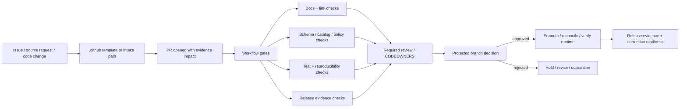

<!-- [KFM_META_BLOCK_V2]
doc_id: kfm://doc/<UUID_NEEDS_VERIFICATION>
title: .github README
type: standard
version: v1
status: draft
owners: <NEEDS_VERIFICATION>
created: <YYYY-MM-DD>
updated: <YYYY-MM-DD>
policy_label: <NEEDS_VERIFICATION>
related: [../README.md, ../docs/governance/, ../docs/architecture/, ../contracts/, ../policy/, ./workflows/, ./CODEOWNERS, ./PULL_REQUEST_TEMPLATE.md]
tags: [kfm, github, governance, ci-cd, review, delivery]
notes: [Repo tree was not directly visible in the current review session; adjacent paths and file names beyond .github/README.md are proposed anchors pending repository verification.]
[/KFM_META_BLOCK_V2] -->

# `.github`
Repository-level governance, collaboration, review, and CI/CD entrypoint for Kansas Frontier Matrix.

| Field | Value |
|---|---|
| Status | experimental |
| Owners | **NEEDS VERIFICATION** |
| Path | `.github/README.md` |
| Trust posture | **CONFIRMED / PROPOSED / UNKNOWN / NEEDS VERIFICATION** |
| Repo evidence | PDF corpus doctrine available; live repo tree not directly verified |
| Quick jumps | [Scope](#scope) · [Repo fit](#repo-fit) · [Accepted inputs](#accepted-inputs) · [Exclusions](#exclusions) · [Directory tree](#directory-tree) · [Quickstart](#quickstart) · [Workflow model](#workflow-model) · [Control surfaces](#control-surfaces) · [Task list](#task-list) · [FAQ](#faq) |


> [!IMPORTANT]
> This README is **evidence-bounded**. It reflects confirmed KFM doctrine and repository-facing expectations inferred from the mounted project corpus, but it does **not** claim that the current session verified a live `.github/` directory, workflow set, branch-protection rules, or CODEOWNERS file.
>
> Read every repo-shaped statement here as one of:
> - **CONFIRMED** — grounded in mounted KFM doctrine
> - **PROPOSED** — a repo-native implementation direction consistent with that doctrine
> - **UNKNOWN** — not established from the current session
> - **NEEDS VERIFICATION** — placeholder or path that must be checked in the actual repo

---

## Scope

`.github/` is the repository-wide **governance and collaboration surface** for KFM.

In practical terms, this directory should be where the repository expresses how contributors enter the system, how changes are reviewed, how CI/CD gates are enforced, how release evidence is protected, and how documentation, contracts, policy, and runtime change are kept in the same governed stream.

For KFM, that makes `.github/` more than a convenience folder. It is one of the human-facing edges of the **trust membrane**. A weak `.github/` layer invites quiet bypasses: undocumented automation, missing review boundaries, drift between docs and behavior, or promotion without evidence.

[Back to top](#github)

## Repo fit

**Path:** `.github/README.md`

**Role in repo:** directory README for repository-wide governance, collaboration, and delivery controls.

**Expected upstream anchors** *(NEEDS VERIFICATION)*:
- `../README.md`
- `../docs/governance/`
- `../docs/architecture/`
- `../docs/runbooks/`
- `../docs/adr/`

**Expected downstream anchors** *(NEEDS VERIFICATION)*:
- `./workflows/`
- `./CODEOWNERS`
- `./ISSUE_TEMPLATE/`
- `./PULL_REQUEST_TEMPLATE.md`
- `./SECURITY.md`
- `./actions/`

**Adjacent KFM responsibility zones** *(expected, not repo-verified here)*:
- `../contracts/` for authoritative schemas and API contracts
- `../policy/` for policy-as-code and rule fixtures
- `../data/registry/` for source and dataset registration
- `../docs/` for doctrinal, architectural, and runbook material

> [!NOTE]
> The links above are intentionally relative so this file stays repo-native, but their existence and final spellings must be checked against the actual checkout before commit.

## Accepted inputs

Content that belongs in or under `.github/` for KFM includes:

- repository-wide workflow definitions
- issue and pull-request templates
- review-boundary files such as `CODEOWNERS`
- security-reporting entrypoints
- reusable repo-level actions
- merge, promotion, and release-governance notes
- contributor-facing checklists that apply across domains
- branch-protection and required-check documentation
- automation patterns that remain PR-first and fail-closed

## Exclusions

The following do **not** belong here as authoritative source of truth:

- core domain doctrine and architecture manuals  
  → place under `../docs/architecture/`, `../docs/governance/`, or `../docs/domains/`
- policy rule bodies and their canonical tests  
  → place under `../policy/`
- contract schemas, OpenAPI definitions, catalog profiles, and vocabularies  
  → place under `../contracts/`
- runtime service code, ingestion logic, UI code, and evidence resolvers  
  → place under repo code packages/apps
- dataset-specific runbooks and source descriptors  
  → place under domain-appropriate `../data/` and `../docs/`
- release artifacts, receipts, manifests, SBOMs, or attestation payloads  
  → keep in the repository’s designated release/evidence paths, not as ad hoc `.github/` storage

## Status markers used in this README

| Marker | Meaning here |
|---|---|
| **CONFIRMED** | Stable KFM doctrine supported by the mounted project corpus |
| **PROPOSED** | Repo-native implementation direction that fits that doctrine |
| **UNKNOWN** | Not verified in the current session |
| **NEEDS VERIFICATION** | Placeholder value, path, owner, or workflow detail that must be checked in the actual repo |

## Directory tree

The exact `.github/` tree was **not** directly visible in this review session. The shape below is therefore a **PROPOSED target / expected directory contract**, not a statement of current repo fact.

```text
.github/                        # PROPOSED target shape; NEEDS VERIFICATION
├── README.md                   # this document
├── workflows/                  # CI/CD, validation, release, docs, and policy gates
├── ISSUE_TEMPLATE/             # contributor intake and defect/feature templates
├── PULL_REQUEST_TEMPLATE.md    # repo-wide PR contract and review checklist
├── CODEOWNERS                  # review ownership and separation-of-duty boundary
├── SECURITY.md                 # disclosure and security-contact surface
├── actions/                    # reusable composite actions, if adopted
└── dependabot.yml              # optional dependency/update automation
```

## Quickstart

When a real repo checkout is available, use the sequence below before editing any repository-wide governance surface.

```bash
# 1) Inspect the directory itself
ls -la .github
ls -la .github/workflows 2>/dev/null || true

# 2) Review ownership and review boundaries
test -f .github/CODEOWNERS && sed -n '1,120p' .github/CODEOWNERS

# 3) Review the PR contract
test -f .github/PULL_REQUEST_TEMPLATE.md && sed -n '1,200p' .github/PULL_REQUEST_TEMPLATE.md

# 4) Inspect workflow intent before changing gates
grep -R "catalog\|policy\|docs\|release\|evidence\|attest\|sbom" .github/workflows 2>/dev/null || true

# 5) Confirm adjacent documentation anchors
test -f README.md && sed -n '1,80p' README.md
find docs -maxdepth 2 -type f 2>/dev/null | sort | sed -n '1,80p'
```

### Minimal review order

1. Read this file and the root project doctrine.
2. Inspect the current workflow inventory.
3. Verify branch-protection and review-boundary assumptions.
4. Confirm that docs, contracts, policy, and release evidence stay aligned.
5. Change the smallest possible surface.
6. Re-check contributor ergonomics after tightening gates.

## Usage

### Changing workflow gates

Treat every workflow change as a **governance change**, not just a YAML edit.

Preserve these repository-level expectations:
- fail-closed behavior on blocking checks
- no silent bypass around policy, evidence, or release state
- docs and examples stay aligned with behavior
- automation remains accountable and reviewable
- promotion does not collapse into a blind deploy step

### Changing review ownership

If review boundaries move, update this directory’s explanation of:
- who owns what
- which changes require domain or steward review
- where separation of duty applies
- which files or paths are policy-significant

Do not let ownership drift quietly out of sync with actual merge expectations.

### Adding automation

New automation in `.github/` should begin in one of:
- draft mode
- shadow mode
- dry-run mode
- PR-only mode

KFM automation should help produce evidence and reviewable diffs. It should not self-approve policy-significant or public-truth changes.

## Workflow model


```mermaid
flowchart LR
    A[Issue / source request / code change] --> B[.github template or intake path]
    B --> C[PR opened with evidence impact]
    C --> D[Workflow gates]
    D --> D1[Docs + link checks]
    D --> D2[Schema / catalog / policy checks]
    D --> D3[Test + reproducibility checks]
    D --> D4[Release evidence checks]
    D1 --> E[Required review / CODEOWNERS]
    D2 --> E
    D3 --> E
    D4 --> E
    E --> F[Protected branch decision]
    F -->|approved| G[Promote / reconcile / verify runtime]
    F -->|rejected| H[Hold / revise / quarantine]
    G --> I[Release evidence + correction readiness]
```

## Control surfaces

| Surface | Primary role | KFM-specific obligation | Status |
|---|---|---|---|
| `./workflows/` | CI/CD, validation, promotion, and release gates | Must preserve fail-closed review and release posture | **PROPOSED path** |
| `./CODEOWNERS` | Review ownership and separation-of-duty edge | Must protect policy-significant and public-facing changes | **PROPOSED path** |
| `./PULL_REQUEST_TEMPLATE.md` | Contributor-facing review contract | Should request docs impact, evidence impact, rollback note, and test impact | **PROPOSED path** |
| `./ISSUE_TEMPLATE/` | Structured intake | Should steer source requests, defects, and governance changes into reviewable forms | **PROPOSED path** |
| `./SECURITY.md` | Disclosure and response entrypoint | Should align with KFM security and stewardship posture | **NEEDS VERIFICATION** |
| `./actions/` | Reusable repo-level automation | Should reduce drift without hiding behavior | **PROPOSED path** |

## Governance expectations for `.github/`

| Concern | Expected posture |
|---|---|
| Branching | PR-first for consequential change |
| Merge safety | Required checks should block merge when trust-significant gates fail |
| Documentation | Docs drift is a real production risk, not a cosmetic defect |
| Automation | PR-based, reviewable, and fail-closed by default |
| Promotion | Should remain inspectable and evidence-bearing |
| Release evidence | Should be generated, linked, and verified where required |
| Unknowns | Stay explicit until the repo proves more |

## Task list

**Definition of done for changes under `.github/`:**

- [ ] All links and file names in this README were checked against the actual repo tree.
- [ ] Owners and review boundaries were verified against real repo practice.
- [ ] Workflow names and paths were confirmed, not inferred.
- [ ] Required checks still reflect KFM’s fail-closed posture.
- [ ] Contributor templates still ask for docs impact, evidence impact, rollback/correction impact, and test impact.
- [ ] Policy-significant automation still cannot self-approve protected changes.
- [ ] Documentation was updated in the same change stream as behavior-significant workflow edits.
- [ ] Any new workflow or automation surface starts in draft, shadow, dry-run, or PR-only mode unless intentionally approved otherwise.
- [ ] Unknowns remain visible instead of being rewritten as certainty.

## FAQ

### Why is `.github/` so important in KFM?

Because KFM treats release, review, policy, evidence, and correction as one governed system. Repository-wide collaboration and workflow controls are part of that system, not an afterthought.

### Does this README claim these files already exist?

No. It intentionally distinguishes **confirmed doctrine** from **proposed repo shape**. The repo tree was not directly visible in the current review session.

### Should policy rule bodies live here?

No. `.github/` may point to policy or gate it, but canonical policy rule bodies belong under the project’s policy surface.

### Should schemas or API contracts live here?

No. This directory may enforce checks over them, but authoritative schemas and contracts belong in their own versioned contract paths.

### Can automation merge protected branches on its own?

This README assumes **no** for policy-significant and public-truth changes unless the project explicitly ratifies a narrower lane with the same or stronger evidence controls.

## Appendix

<details>
<summary><strong>Proposed verification backlog for this directory</strong></summary>

### Highest-priority checks

1. Confirm the real `.github/` tree and update this README to match it exactly.
2. Verify whether `CODEOWNERS`, `PULL_REQUEST_TEMPLATE.md`, `SECURITY.md`, and reusable actions already exist.
3. Inventory actual workflow files and map them to KFM gate expectations.
4. Confirm whether docs lint/link check, policy tests, catalog validation, reproducibility checks, and release evidence checks are active.
5. Verify whether branch protection and required checks are documented elsewhere and cross-link them here.

### Repo-native follow-up edits likely needed

- Replace placeholder owners.
- Replace placeholder dates.
- Replace provisional relative links with verified ones.
- Add confirmed workflow file references.
- Add confirmed badges once the repo exposes stable targets.

</details>

<details>
<summary><strong>Proposed starter file matrix for `.github/`</strong></summary>

| File | Why it may belong here | Commit only after... |
|---|---|---|
| `README.md` | Explains the repository-wide governance surface | Repo tree and adjacent paths are verified |
| `CODEOWNERS` | Makes review boundaries executable | Ownership and separation-of-duty rules are ratified |
| `PULL_REQUEST_TEMPLATE.md` | Normalizes contributor obligations | PR contract is aligned with actual required checks |
| `ISSUE_TEMPLATE/*.md` | Structures requests and defects | Intake categories are stable enough to encode |
| `workflows/*.yml` | Implements CI/CD, validation, and release behavior | Each gate has a doctrinal basis and rollback understanding |
| `actions/*` | Reuses safe automation | Inputs/outputs and failure modes are documented |
| `SECURITY.md` | Defines disclosure path | Security contact and process are verified |

</details>

<details>
<summary><strong>Authoring notes for maintainers</strong></summary>

- Keep repo-wide wording stable with KFM doctrine: **truth path**, **trust membrane**, **cite-or-abstain**, **fail-closed**, **authoritative vs derived**, **docs as production surface**.
- Prefer explicit placeholders over invented values.
- Prefer small, reviewable workflow changes over large governance rewrites.
- Prefer relative links.
- Preserve this file as a navigation and governance entrypoint, not as the canonical home of schemas, policies, or runtime code.

</details>

[Back to top](#github)
