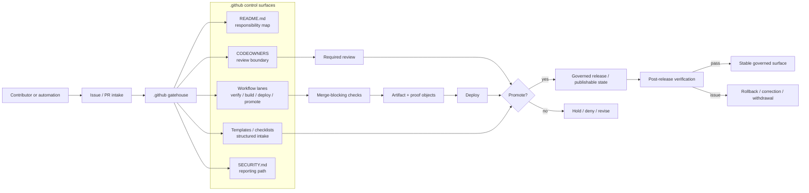

<!-- [KFM_META_BLOCK_V2]
doc_id: kfm://doc/repo/.github/readme
title: .github README
type: standard
version: v2
status: draft
owners: NEEDS_VERIFICATION
created: 2026-03-15
updated: 2026-03-22
policy_label: NEEDS_VERIFICATION
related: [../README.md, ../CONTRIBUTING.md, ../docs/governance/, ../docs/architecture/, ../docs/domains/, ../docs/runbooks/, ../docs/adr/, ../contracts/, ../policy/, ../data/registry/, ../apps/, ../packages/, ../infra/, ../tools/, ../scripts/, ../tests/, ./workflows/, ./CODEOWNERS, ./PULL_REQUEST_TEMPLATE.md, ./SECURITY.md]
tags: [kfm, github, governance, ci-cd, verification, review, release-evidence, delivery]
notes: [Documentary GitHub evidence confirms README.md, .github/README.md, .github/CODEOWNERS, .github/SECURITY.md, CONTRIBUTING.md, public repo metadata, and Actions/code-scanning activity; live workflow inventory, exact CODEOWNERS handles, template filenames, branch protection, required checks, and environment approvals remain unverified in this session.]
[/KFM_META_BLOCK_V2] -->

<div align="center">
  <strong>Kansas Frontier Matrix</strong><br />
  <sub>Repository gatehouse for governance, review, CI/CD, and delivery evidence</sub>
</div>

# `.github`

Repository-wide governance, collaboration, verification, and governed delivery entrypoint for Kansas Frontier Matrix.


| Field | Value |
|---|---|
| Status | **active** directory · **draft** README revision |
| Owners | **NEEDS_VERIFICATION** |
| Path | `.github/README.md` |
| Audited repository | `bartytime4life/Kansas-Frontier-Matrix` |
| Default branch | `main` |
| Visibility | public |
| Audience | maintainers, reviewers, contributors, release stewards |
| Repo role | gatehouse for contributor intake, review boundaries, CI/CD lanes, release evidence, and rollback/correction discipline |
| Truth posture | **CONFIRMED** KFM doctrine · **CONFIRMED** documentary repo evidence for key repo-health files and activity · **UNKNOWN** live checkout and GitHub platform settings not re-inspected here |
| Current evidence used here | March 2026 KFM doctrine plus documentary GitHub fetch/audit material; **no mounted live repo checkout** and **no direct reinspection** of `.github/workflows/` or GitHub settings in this session |

**Quick jump:** [Scope](#scope) · [Repo fit](#repo-fit) · [Accepted inputs](#accepted-inputs) · [Exclusions](#exclusions) · [Directory tree](#directory-tree) · [Quickstart](#quickstart) · [Usage](#usage) · [Diagram](#diagram) · [Control surfaces](#control-surfaces) · [Task list / definition of done](#task-list--definition-of-done) · [FAQ](#faq) · [Appendix](#appendix)

> [!IMPORTANT]
> This README is **documentary-grounded** and **live-checkout-bounded**.
>
> It is written from March 2026 KFM doctrine plus documentary GitHub evidence, but it does **not** claim a direct current-session reinspection of the live `.github/` tree, exact workflow YAML filenames, exact `CODEOWNERS` handles, exact template filenames, exact required checks, exact branch-protection settings, or exact environment approvals.
>
> Use these labels throughout this file:
> - **CONFIRMED** — directly supported by attached KFM doctrine or documentary repo evidence visible in this session
> - **INFERRED** — strongly suggested by the attached evidence, but not rechecked from a live checkout here
> - **PROPOSED** — doctrine-consistent realization guidance
> - **UNKNOWN** — not established strongly enough in this session
> - **NEEDS VERIFICATION** — placeholder or repo/platform detail that should be checked before merge

## Scope

`.github/` is KFM’s repository-level **gatehouse**.

This is where contributor intake, review boundaries, CI/CD, and delivery evidence stop being informal intentions and become executable controls. In KFM terms, `.github/` is one of the most visible repository expressions of the **trust membrane**: changes should cross review, verification, and release-bearing gates before they widen into public-facing or release-bearing state.

A strong `.github/` tree does not merely “run CI.” It makes responsibility visible. It helps keep the repository-truth rule enforceable. It gives rollback and correction a home. And it keeps repo-health surfaces close to the same governance posture as the code, contracts, schemas, and policies they protect.

### Evidence boundary used here

| Evidence layer | What this README treats as settled |
|---|---|
| **CONFIRMED doctrine** | KFM’s truth path, trust membrane, authoritative-vs-derived split, cite-or-abstain posture, default-deny/fail-closed behavior, and docs/contracts/schemas as production surfaces |
| **CONFIRMED documentary repo evidence** | `README.md`, `.github/README.md`, `.github/CODEOWNERS`, `.github/SECURITY.md`, and `CONTRIBUTING.md` were fetched in the supporting repo audit; the repository is public and uses `main` as default branch |
| **CONFIRMED activity / NEEDS VERIFICATION inventory** | GitHub Actions activity and code-scanning activity are present, but the exact workflow YAML set and exact template filenames were not re-read from a live checkout here |
| **UNKNOWN / NEEDS VERIFICATION** | exact `.github/workflows/` inventory, exact issue/PR template paths, exact current `CODEOWNERS` entries, required checks, protected branch rules, environment approvals, and GitHub App / OIDC / deployment settings |

### Documentary repo signals

| Documentary signal | What it supports | Status |
|---|---|---|
| Public repo metadata with default branch `main` | GitHub-hosted collaboration is the normal repo-facing control plane | CONFIRMED |
| `.github/README.md`, `.github/CODEOWNERS`, `.github/SECURITY.md`, and `CONTRIBUTING.md` fetched in repo-support material | these are safe, direct adjacencies for this README | CONFIRMED |
| Actions dependency-bump PRs and code-scanning/autofix activity | `.github/workflows/` is not hypothetical, even though the exact YAML set still needs live reinspection | CONFIRMED activity / NEEDS VERIFICATION inventory |
| `CODEOWNERS` coverage patterns for `docs/`, `data/`, `src/`, `tools/`, `tests/`, `policy/`, `contracts/`, plus key governance files | ownership and review boundaries are substantive repo controls, not decorative paperwork | CONFIRMED |
| Supporting audit notes explicitly call out the lack of recursive live repo extraction in that session | this README must keep live inventory claims bounded instead of implying a full checkout audit | CONFIRMED |

> [!NOTE]
> Platform state is **not** the same thing as repo state. Branch protection, required checks, environment reviewers, deployment approvals, GitHub App permissions, and OIDC trust relationships must be verified in GitHub settings or equivalent exported governance evidence. They should not be assumed from repository files alone.

[Back to top](#github)

## Repo fit

**Path:** `.github/README.md`

**Role in repo:** directory README for repository-wide governance, review boundaries, CI/CD surfaces, release evidence, and correction posture.

**Why it exists:** explain how repository-wide controls preserve KFM’s truth path without pretending `.github/` is the canonical home of schemas, policy bodies, runtime code, or domain artifacts.

### Upstream and downstream anchors

| Direction | Path | Why it matters | Status in this README |
|---|---|---|---|
| Upstream | [`../README.md`](../README.md) | project framing, repo identity, and top-level positioning | CONFIRMED documentary evidence |
| Upstream | [`../CONTRIBUTING.md`](../CONTRIBUTING.md) | contributor workflow and contribution expectations | CONFIRMED documentary evidence |
| Upstream | [`../docs/`](../docs/) | doctrine, architecture, ADRs, and runbooks that `.github/` should gate rather than replace | INFERRED / NEEDS VERIFICATION |
| Upstream | [`../contracts/`](../contracts/) | canonical machine-readable contract surfaces | INFERRED / NEEDS VERIFICATION |
| Upstream | [`../policy/`](../policy/) | policy bundles, fixtures, and policy tests | INFERRED / NEEDS VERIFICATION |
| Upstream | [`../data/registry/`](../data/registry/) | source descriptors, registry material, and lifecycle-driven intake | INFERRED / NEEDS VERIFICATION |
| Downstream | [`./CODEOWNERS`](./CODEOWNERS) | executable review-boundary map | CONFIRMED documentary evidence |
| Downstream | [`./SECURITY.md`](./SECURITY.md) | vulnerability reporting and disclosure entrypoint | CONFIRMED documentary evidence |
| Downstream | [`./workflows/`](./workflows/) | CI, validation, promotion, rollback, and correction lanes | CONFIRMED activity / NEEDS VERIFICATION inventory |
| Downstream | issue-template surface | structured issue intake | NEEDS VERIFICATION |
| Downstream | PR-template surface | structured pull-request intake | NEEDS VERIFICATION |

<details>
<summary><strong>Broader repo context</strong> — documentary inventory plus doctrine-led structure</summary>

```text
repo/
├── .github/              # repo-wide governance and CI/CD gatehouse
├── docs/                 # doctrine, architecture, ADRs, runbooks, standards
├── contracts/            # machine-readable contracts and schemas
├── policy/               # policy code, fixtures, and tests
├── data/                 # lifecycle zones, registries, and published artifacts
├── apps/                 # user-facing and steward-facing applications
├── packages/             # reusable shared modules
├── infra/                # deployment and platform infrastructure
├── tools/                # validators, generators, and support utilities
├── scripts/              # workflow helpers and operational scripts
└── tests/                # unit, integration, policy, and end-to-end verification
```

</details>

[Back to top](#github)

## Accepted inputs

The following content belongs in `.github/` when it applies across the repository rather than to one package or app.

| Input class | What belongs here | Why it belongs here |
|---|---|---|
| Workflow definitions | CI, verification, docs, promotion, rollback, correction, and release lanes | repo-wide control and merge behavior live here |
| Review-boundary files | `CODEOWNERS`, review-routing notes, protected-branch guidance | review is part of KFM’s trust system |
| Structured contributor intake | issue templates, PR templates, review checklists, community-health guidance | intake should be shaped before change widens |
| Reusable governance automation | composite actions, setup helpers, policy/install helpers, docs preflight automation | reduces drift without hiding behavior |
| Security/community health entrypoints | `SECURITY.md`, disclosure guidance, automation identity notes | makes trust surfaces discoverable at repo level |

## Exclusions

`.github/` can gate, reference, or validate these surfaces, but it should not quietly replace them as their canonical home.

| Does **not** belong here as canonical truth | Keep it here instead |
|---|---|
| machine-readable schemas, OpenAPI specs, vocabularies, envelopes | [`../contracts/`](../contracts/) |
| policy bodies, reason-code registries, fixtures, policy tests | [`../policy/`](../policy/) |
| source descriptors, lifecycle truth zones, registries, and published datasets | [`../data/`](../data/) and [`../data/registry/`](../data/registry/) |
| runtime services, UI logic, ingestion code, evidence resolvers | [`../apps/`](../apps/) and [`../packages/`](../packages/) |
| release artifacts, manifests, proof packs, immutable bundle inventory | designated release/evidence paths, not ad hoc `.github/` storage |
| architecture manuals, domain doctrine, ADRs, and runbooks | [`../docs/`](../docs/) |

[Back to top](#github)

## Directory tree

The exact live `.github/` tree was **not** directly mounted in this session. The map below distinguishes documentary-confirmed files from workflow/template surfaces that remain subject to live reinspection.

```text
.github/
├── README.md                              # CONFIRMED via documentary GitHub evidence
├── CODEOWNERS                             # CONFIRMED via documentary GitHub evidence
├── SECURITY.md                            # CONFIRMED via documentary GitHub evidence
├── workflows/                             # CONFIRMED Actions activity; exact YAML set NEEDS VERIFICATION
├── ISSUE_TEMPLATE/ or equivalent          # templates implied; exact filenames NEEDS VERIFICATION
└── PULL_REQUEST_TEMPLATE.md or equivalent # exact filename/path NEEDS VERIFICATION
```

> [!TIP]
> Treat the tree above as a **review map**, not a promise that every child has been re-read from the live repository. Before editing `.github/`, re-run the quickstart inventory commands below against the mounted checkout and update this README in the same PR.

## Quickstart

Before editing any repo-wide governance surface, confirm the live tree first.

```bash
# 0) Start from the repo root
git rev-parse --show-toplevel 2>/dev/null || pwd

# 1) Inventory the gatehouse
find .github -maxdepth 2 -type f | sort

# 2) Inspect documentary-confirmed boundary files
sed -n '1,220p' .github/README.md 2>/dev/null || true
sed -n '1,220p' .github/CODEOWNERS 2>/dev/null || true
sed -n '1,220p' .github/SECURITY.md 2>/dev/null || true
sed -n '1,220p' CONTRIBUTING.md 2>/dev/null || true

# 3) Inspect workflow inventory before changing gates
find .github/workflows -maxdepth 1 -type f 2>/dev/null | sort
grep -R '^name:' .github/workflows 2>/dev/null || true
grep -R 'uses: .*actions/' .github/workflows 2>/dev/null | sed -n '1,120p'

# 4) Check issue / PR intake surfaces
find .github -maxdepth 2 -type f \
  \( -name '*PULL*' -o -path '.github/ISSUE_TEMPLATE/*' \) \
  2>/dev/null | sort

# 5) Confirm adjacent authority surfaces
find docs -maxdepth 2 -type d 2>/dev/null | sort | sed -n '1,120p'
find contracts -maxdepth 2 -type f 2>/dev/null | sort | sed -n '1,120p'
find policy -maxdepth 2 -type f 2>/dev/null | sort | sed -n '1,120p'

# 6) Platform-state checks are outside the repo tree:
#    - protected branches
#    - required status checks
#    - environment reviewers
#    - deployment approvals
#    - GitHub App / OIDC permissions
```

## Usage

Use this README as the responsibility map for repo-wide change.

1. **Inspect before editing.** Confirm the live `.github/` tree, actual required checks, and actual review boundaries before changing filenames, responsibilities, or status language.
2. **Map the change to trust impact.** Ask whether the edit changes contributor intake, merge-blocking logic, release evidence, correction posture, or trust-visible behavior.
3. **Keep trust-impacting automation review-bearing.** KFM doctrine prefers reviewable deltas with attached evidence, policy results, and rollback posture where trust impact is real.
4. **Update adjacent documentation in the same governed stream.** If a workflow, template, or approval boundary changes how trust is earned, released, rolled back, or corrected, the docs should travel with the change.

### Build, deploy, and promote are different moves

| Move | What changes | Why `.github/` cares |
|---|---|---|
| **Build** | a versioned artifact exists with identity, digest, and validation output | workflows, attestations, and proof-pack assembly often begin here |
| **Deploy** | runtime placement changes | environment approval, rollback readiness, and post-deploy checks may be triggered here |
| **Promote** | trust state changes from candidate to governable / publishable release | policy checks, docs/accessibility gates, review records, and release evidence become mandatory |

### When this file should change

- when repo-wide workflow responsibilities change
- when review boundaries or `CODEOWNERS` expectations change
- when contributor intake moves or becomes more structured
- when release evidence, rollback, or correction posture changes
- when platform-state verification steps need sharper guidance

[Back to top](#github)

## Diagram


```mermaid
flowchart LR
    A[Contributor or automation] --> B[Issue / PR intake]
    B --> C[.github gatehouse]

    subgraph G[".github control surfaces"]
      G1["README.md<br/>responsibility map"]
      G2["CODEOWNERS<br/>review boundary"]
      G3["Workflow lanes<br/>verify / build / deploy / promote"]
      G4["Templates / checklists<br/>structured intake"]
      G5["SECURITY.md<br/>reporting path"]
    end

    C --> G1
    C --> G2
    C --> G3
    C --> G4
    C --> G5

    G2 --> H[Required review]
    G3 --> I[Merge-blocking checks]
    I --> J[Artifact + proof objects]
    J --> K[Deploy]
    H --> L{Promote?}
    K --> L
    G4 --> L

    L -->|yes| M[Governed release / publishable state]
    L -->|no| N[Hold / deny / revise]

    M --> O[Post-release verification]
    O -->|pass| P[Stable governed surface]
    O -->|issue| Q[Rollback / correction / withdrawal]
```

## Control surfaces

| Surface | Current evidence status | Primary role | Why it is sensitive |
|---|---|---|---|
| [`./README.md`](./README.md) | CONFIRMED documentary evidence | responsibility map for repo-wide governance and review posture | if it drifts, reviewers lose the boundary map |
| [`./CODEOWNERS`](./CODEOWNERS) | CONFIRMED documentary evidence | executable review ownership | changes approval scope and separation of duty |
| `./CODEOWNERS` coverage patterns | CONFIRMED documentary evidence | maps ownership over `docs/`, `data/`, `src/`, `tools/`, `tests/`, `policy/`, `contracts/`, plus key governance files | broad area ownership changes who must review trust-bearing work |
| [`./SECURITY.md`](./SECURITY.md) | CONFIRMED documentary evidence | security reporting and disclosure path | affects incident intake and trust posture |
| [`./workflows/`](./workflows/) | CONFIRMED activity / NEEDS VERIFICATION inventory | CI, validation, promotion, rollback, and correction lanes | directly affects merge, release evidence, and recovery behavior |
| Code-scanning / autofix activity | CONFIRMED activity / NEEDS VERIFICATION configuration detail | security and dependency-hygiene signals | quiet drift here weakens repo trust posture |
| GitHub platform settings | UNKNOWN in this session | branch protection, required checks, environment approvals, app permissions | repo truth can still fail if platform gates drift |

### Review-sensitive changes

| Change class | Likely review posture | Minimum review expectation | Why it matters |
|---|---|---|---|
| non-behavioral README cleanup | normal doc review | peer review | safe unless instructions or trust posture change materially |
| `CODEOWNERS` edits | ownership-boundary review | owner/steward review distinct from the author when boundaries change materially | changes who must review protected work |
| workflow logic, required checks, or release lanes | behavior-significant governance review | technical owner review plus platform/operations review as needed | changes merge, promotion, or rollback behavior |
| security reporting or automation-identity changes | security-sensitive review | security/platform review | affects disclosure paths, secrets, or automation trust |
| public-truth release controls | separation-of-duty review | distinct reviewer(s) for approval and implementation where significance warrants it | public confidence should not depend on self-approval |
| rollback / correction mechanics | audited correction-path review | documented change with follow-on evidence | correction must stay visible, recoverable, and reviewable |

[Back to top](#github)

## Task list / definition of done

- [ ] The live `.github/` tree was re-inspected from the mounted repository before merge.
- [ ] `.github/README.md`, `.github/CODEOWNERS`, `.github/SECURITY.md`, and `CONTRIBUTING.md` were checked against the current repo.
- [ ] The actual workflow inventory under `.github/workflows/` was compared with this README.
- [ ] Actions/code-scanning signals in the documentary audit were matched to current files and current settings.
- [ ] `CODEOWNERS` coverage was reviewed against `docs/`, `data/`, `src/`, `tools/`, `tests/`, `policy/`, `contracts/`, and governance-critical files.
- [ ] Required status checks and protected-branch rules were verified in GitHub settings, not assumed from repo files alone.
- [ ] Environment approvals, deployment reviewers, and automation identities were rechecked where relevant.
- [ ] Repo-wide automation still preserves fail-closed behavior and keeps build, deploy, and promote meaningfully distinct.
- [ ] Documentation still follows the repository-truth rule: docs, schemas, policies, and workflow behavior move through the same governed stream.
- [ ] Promotion, rollback, and correction expectations remain documented where behavior depends on them.
- [ ] UNKNOWN items remain explicit instead of being rewritten as certainty.
- [ ] Adjacent docs and templates were updated in the same PR if behavior-significant controls changed.

## FAQ

### Does this README claim the live workflow set is fully verified?

No. It separates **documentary repo evidence** from **confirmed activity** and from **UNKNOWN live checkout/platform details**.

### Does a passing build mean the repo is ready to publish?

No. KFM doctrine separates build, deploy, and promote. A successful build proves an artifact exists; it does not by itself prove that the release is governable or publishable.

### Why is `.github/` treated as architecture and not just “CI config”?

Because KFM doctrine treats review, verification, promotion, rollback, and correction as part of one governed trust system. `.github/` is where much of that system becomes executable.

### Should contracts or policy bodies live in `.github/`?

No. `.github/` should gate and reference those surfaces, not replace them as their canonical home.

### What must be rechecked outside the repo tree?

Branch protection, required checks, environment approvals, deployment reviewers, GitHub App permissions, OIDC trust relationships, and other platform-state controls.

## Appendix

<details>
<summary><strong>Evidence boundary and maintainer notes</strong></summary>

### What is strongest in this revision

- KFM doctrine on truth path, trust membrane, cite-or-abstain, fail-closed behavior, authoritative-versus-derived separation, review-bearing release, and correction discipline
- documentary evidence confirming:
  - `README.md`
  - `.github/README.md`
  - `.github/CODEOWNERS`
  - `.github/SECURITY.md`
  - `CONTRIBUTING.md`
- documentary evidence confirming:
  - public repository visibility
  - default branch `main`
  - GitHub Actions activity
  - security / code-scanning activity
  - `CODEOWNERS` coverage patterns across core repo areas

### What remains open until a live checkout is mounted

- exact `.github/workflows/` filename set
- exact issue and PR template filenames and locations
- exact current `CODEOWNERS` entries and review handles
- actual branch-protection settings and required checks
- actual environment approvals and deploy-review rules
- actual GitHub App, OIDC, or secret-management wiring

### Maintainer guidance

- Preserve KFM terms: **truth path**, **trust membrane**, **authoritative vs derived**, **EvidenceBundle**, **cite-or-abstain**, **fail-closed**, **promotion**, **rollback**, **correction**.
- Prefer explicit placeholders over invented owners, reviewers, or platform settings.
- Keep this file a **responsibility map** rather than a duplicate home for policy bodies, schemas, or runtime code.
- Treat workflow edits as behavior edits when they affect review, validation, release evidence, or correction posture.

</details>

<details>
<summary><strong>Verification backlog</strong></summary>

1. Reinspect the live `.github/` tree and replace documentary/activity placeholders with exact file reality.
2. Verify whether issue and PR template surfaces exist in the current checkout exactly as named.
3. Inventory actual workflow YAMLs and map each to validation, release evidence, promotion, rollback, and correction duties.
4. Export or inspect protected-branch settings and required status checks.
5. Recheck `CODEOWNERS` coverage against governance-critical paths and named maintainers.
6. Confirm whether reusable actions, code-scanning lanes, artifact attestations, and environment-approval flows are mounted and active.
7. Retire UNKNOWN items only when direct repo or platform evidence is attached to the same PR.

</details>

[Back to top](#github)
