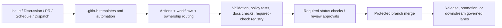

<!-- [KFM_META_BLOCK_V2]
doc_id: kfm://doc/7ee7d2d3-9e77-4a2e-9c39-b6c0a38d8f01
title: .github/
type: standard
version: v1
status: draft
owners: KFM Platform Engineering
created: 2026-03-06
updated: 2026-03-06
policy_label: public
related: [README.md, .github/actions/README.md, .github/workflows/README.md, docs/]
tags: [kfm, github, ci, governance]
notes: [Repo-side GitHub control plane for contribution routing and automation guardrails]
[/KFM_META_BLOCK_V2] -->

# `.github/`
Repo-side GitHub automation and contribution controls for how KFM changes are proposed, checked, reviewed, and merged.


## Impact

**Status:** draft  
**Owners:** KFM Platform Engineering *(verify with `CODEOWNERS`)*  
**Policy label:** public  
**Repo path:** `.github/`  
**Quick links:** [Purpose](#purpose) · [Where it fits](#where-it-fits) · [Acceptable inputs](#acceptable-inputs) · [Exclusions](#exclusions) · [Current inventory](#current-inventory) · [Directory tree](#directory-tree) · [Quickstart](#quickstart) · [Usage](#usage) · [Diagram](#diagram) · [Definition of done](#definition-of-done) · [FAQ](#faq)

## Purpose

**CONFIRMED:** KFM treats CI, policy enforcement, and documentation as part of the governed system, not as repo decoration.  
**CONFIRMED:** `.github/` is the GitHub-side control plane for contribution intake, review routing, automation, and merge-time enforcement.  
**PROPOSED:** This README should remain the first place a maintainer checks before changing templates, CODEOWNERS, composite actions, or workflow wiring.

## Where it fits

**CONFIRMED:** The repository root currently contains `.github/`, `apps/`, `configs/`, `contracts/`, `data/`, `docs/`, `examples/`, `infra/`, `migrations/`, `packages/`, `policy/`, `schemas/`, `scripts/`, `tests/`, and `tools/` alongside core repo docs such as `README.md`, `CONTRIBUTING.md`, `SECURITY.md`, and `LICENSE`.  
**CONFIRMED:** In the KFM repo model, `.github/` sits upstream of code/data changes and downstream of issues, pull requests, schedules, and manual dispatches.  
**UNKNOWN:** The exact branch protection rules, rulesets, required checks, and environment protections currently enforced outside the repository must be verified in GitHub settings before they are documented here as fact.

## Acceptable inputs

**CONFIRMED:** This directory is for GitHub-native repository controls.  
**PROPOSED baseline:**

- GitHub Actions workflows under `.github/workflows/`
- Reusable composite actions under `.github/actions/`
- Issue, discussion, and pull-request templates
- `CODEOWNERS`
- Community health files that are intentionally repo-side (`CODE_OF_CONDUCT.md`, `SUPPORT.md`)
- GitHub automation configuration such as `dependabot.yml`, `labeler.yml`, and required-check registries

## Exclusions

**CONFIRMED:** Do not use `.github/` for the following:

- Secrets, tokens, credentials, or private keys
- Application code or domain logic that belongs in `apps/`, `packages/`, `scripts/`, or `tools/`
- Data artifacts, catalogs, receipts, generated outputs, or provenance payloads that belong under governed data/documentation surfaces
- Authoritative copies of policy bundles, schemas, or contracts that already live under `policy/`, `schemas/`, or `contracts/`
- Long-form architecture or runbook documentation that belongs under `docs/`

## Current inventory

**CONFIRMED:** The current `main` branch directory listing shows the following top-level entries in `.github/`.

| Path | Kind | Role | Status |
|---|---|---|---|
| `DISCUSSION_TEMPLATE/` | directory | GitHub discussion intake templates | CONFIRMED |
| `ISSUE_TEMPLATE/` | directory | Structured issue intake | CONFIRMED |
| `PULL_REQUEST_TEMPLATE/` | directory | Multi-template PR guidance | CONFIRMED |
| `actions/` | directory | Repo-owned reusable composite actions | CONFIRMED |
| `workflows/` | directory | Workflow documentation surface | CONFIRMED |
| `CODEOWNERS` | file | Review routing / ownership mapping | CONFIRMED |
| `CODE_OF_CONDUCT.md` | file | Community standards | CONFIRMED |
| `PULL_REQUEST_TEMPLATE.md` | file | Default PR template | CONFIRMED |
| `README.md` | file | This document | CONFIRMED |
| `SUPPORT.md` | file | Support / help routing | CONFIRMED |
| `dependabot.yml` | file | Dependency update automation config | CONFIRMED |
| `labeler.yml` | file | Label automation config | CONFIRMED |
| `required-checks.v1.json` | file | Machine-readable required-check registry surface | CONFIRMED |

**CONFIRMED:** The current `main` branch listing shows these action directories under `.github/actions/`: `kfm-eval-focus/`, `kfm-linkcheck/`, `kfm-policy-test/`, `kfm-validate-contracts/`, `setup-conftest/`, `setup-node/`, `setup-opa/`, and `setup-python/`.  
**CONFIRMED:** The current `main` branch listing shows `README.md` inside `.github/workflows/`.  
**UNKNOWN:** Whether additional workflow YAML files exist on other branches, or are generated/restored by future changes, should not be assumed from this README.

## Directory tree

**CONFIRMED:** Current visible tree on `main`:

```text
.github/
├── DISCUSSION_TEMPLATE/
├── ISSUE_TEMPLATE/
├── PULL_REQUEST_TEMPLATE/
├── actions/
│   ├── README.md
│   ├── kfm-eval-focus/
│   ├── kfm-linkcheck/
│   ├── kfm-policy-test/
│   ├── kfm-validate-contracts/
│   ├── setup-conftest/
│   ├── setup-node/
│   ├── setup-opa/
│   └── setup-python/
├── workflows/
│   └── README.md
├── CODEOWNERS
├── CODE_OF_CONDUCT.md
├── PULL_REQUEST_TEMPLATE.md
├── README.md
├── SUPPORT.md
├── dependabot.yml
├── labeler.yml
└── required-checks.v1.json
```

## Quickstart

Run this before you document or change anything under `.github/**`:

```bash
find .github -maxdepth 3 -type f | sort
find .github/actions -maxdepth 2 \( -name action.yml -o -name action.yaml \) | sort
find .github/workflows -maxdepth 2 -type f | sort
grep -RIn "^name:" .github/workflows || true
grep -RIn "^[[:space:]]*permissions:" .github/workflows || true
grep -RIn "concurrency:|timeout-minutes:|workflow_call:" .github/workflows || true
```

Then answer these questions before claiming anything is implemented:

1. Which checks are actually required to merge?
2. Which workflows are blocking versus informational?
3. Which protections are enforced outside the repo?
4. Which composite actions are actively used versus merely present?

## Usage

Use `.github/` changes as governed, production-surface edits.

1. Start with the smallest reversible change.
2. Update the matching README or registry in the same PR when behavior changes.
3. Keep permissions narrow and explicit.
4. Keep required-check names stable unless you are also updating the GitHub-side protection rules.
5. Route governance-relevant paths through `CODEOWNERS`.
6. Treat missing verification as **UNKNOWN**, not as “close enough.”

## Diagram


```mermaid
flowchart LR
  A[Issue / Discussion / PR / Schedule / Dispatch] --> B[.github templates and automation]
  B --> C[Actions + workflows + ownership routing]
  C --> D[Validation, policy tests, docs checks, required-check registry]
  D --> E[Required status checks / review approvals]
  E --> F[Protected branch merge]
  F --> G[Release, promotion, or downstream governed lanes]
```

## Reality check

**CONFIRMED:** KFM uses three evidence labels in docs: `CONFIRMED`, `PROPOSED`, and `UNKNOWN`.  
**CONFIRMED:** For `.github/`, the most important UNKNOWNs are external GitHub settings and the merge-blocking status of checks.  
**PROPOSED:** Prefer one always-runs summary gate for merge protection when workflow inventory is re-established, so skipped checks cannot silently pass.

## Change rules

Use these rules for any `.github/**` change.

1. **Keep gates fail-closed.** A governance check that can silently fail open is not a gate.
2. **Keep permissions narrow.** Every workflow should declare only the permissions it needs.
3. **Keep required-check names stable.** Renames ripple into rulesets and merge requirements.
4. **Update docs when behavior changes.** If templates, actions, or workflow enforcement change, this README must change too.
5. **Preserve separation of duty.** Contribution paths and approval paths must not collapse into one unchecked step.
6. **Prefer small, reversible edits.** YAML, templates, and action metadata are production code.

## Definition of done

- [ ] The change is necessary and tightly scoped.
- [ ] The change does not weaken policy, validation, or audit posture.
- [ ] `CODEOWNERS` still routes governance-relevant paths correctly.
- [ ] Required checks still block merges as intended.
- [ ] Workflow or action permissions are present and minimal.
- [ ] Any renamed workflow/job/check has a matching GitHub protection update.
- [ ] This README is accurate for the verified branch state.
- [ ] Reverting the change restores the prior gate or control.

## FAQ

### Why is `.github/` treated as a governed surface?
Because KFM’s trust membrane is not only runtime code. Merge-time review routing, templates, required checks, and CI enforcement all affect what can reach protected branches and, eventually, published surfaces.

### Why are some statements marked `UNKNOWN`?
Because branch protection, rulesets, required-check wiring, and environment protections live partly outside the repository. This README should not pretend to know settings it has not verified.

### Why keep policy bundles and schemas out of `.github/`?
Because `.github/` should orchestrate and enforce, not become a shadow source-of-truth for governed artifacts that already have canonical homes elsewhere in the repo.

## Appendix: verification notes

**CONFIRMED:** This README is aligned to the currently visible `.github/` tree on `main`.  
**UNKNOWN:** The live required-check set and any external ruleset bindings still need GitHub-side verification.  
**PROPOSED:** When workflow files are added or restored, update this README, `.github/workflows/README.md`, and `required-checks.v1.json` together in the same PR.
