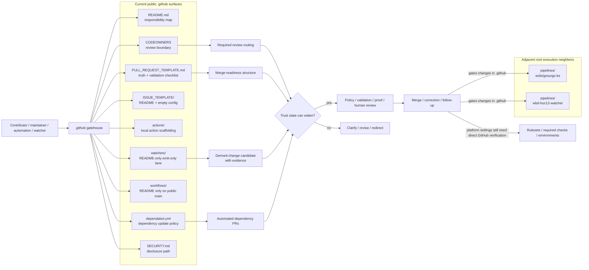

<!-- [KFM_META_BLOCK_V2]
doc_id: kfm://doc/repo/.github/readme
title: .github README
type: standard
version: v2
status: draft
owners: @bartytime4life
created: 2026-03-15
updated: 2026-04-03
policy_label: NEEDS_VERIFICATION
related: [../README.md, ../CONTRIBUTING.md, ../SECURITY.md, ../docs/governance/, ../docs/architecture/, ../docs/domains/, ../docs/runbooks/, ../docs/adr/, ../contracts/, ../schemas/, ../policy/, ../data/registry/, ../apps/, ../packages/, ../pipelines/, ../infra/, ../scripts/, ../tests/, ../tools/, ./ISSUE_TEMPLATE/, ./actions/, ./watchers/, ./workflows/, ./CODEOWNERS, ./PULL_REQUEST_TEMPLATE.md, ./SECURITY.md, ./dependabot.yml]
tags: [kfm, github, governance, ci-cd, review, disclosure, dependabot, watchers]
notes: [Created date preserved from the current checked-in baseline; updated date reflects this draft revision; current public main root includes pipelines/ with visible soils/gssurgo-ks and wbd-huc12-watcher lanes; checked-in dependabot.yml does not currently name /pipelines/* in its directory globs; ISSUE_TEMPLATE/config.yml and actions/action.yml are empty on current public main; workflows/ and watchers/ remain README-only on current public main; .github/SECURITY.md and ../SECURITY.md are not yet fully aligned; GitHub rulesets, required checks, environment approvals, monitored fallback channels, and app/OIDC permissions remain NEEDS VERIFICATION.]
[/KFM_META_BLOCK_V2] -->

<div align="center">
  <strong>Kansas Frontier Matrix</strong><br />
  <sub>Repository gatehouse for governance, review, CI/CD, disclosure, and emit-only watcher control</sub>
</div>

# `.github`

Repository-wide governance, contributor intake, review routing, automation scaffolding, disclosure posture, and control-plane-adjacent watcher entrypoint for Kansas Frontier Matrix.


| Field | Value |
|---|---|
| Status | **active** directory · **draft** README revision |
| Owners | **`@bartytime4life`** *(current public `CODEOWNERS` coverage for `/.github/`)* |
| Path | `.github/README.md` |
| Default branch | `main` |
| Visibility | public |
| Audience | maintainers, reviewers, contributors, release stewards |
| Repo role | gatehouse for intake, review boundaries, local GitHub automation, workflow documentation, dependency-update policy, disclosure/release-control surfaces, and emit-only watcher scaffolding |
| Trust posture | **CONFIRMED** checked-in public tree and public Markdown surfaces · **UNKNOWN** GitHub rulesets, required checks, environment approvals, app permissions, OIDC wiring, and other platform-only settings |
| Current public tree state | `.github/` contains `ISSUE_TEMPLATE/`, `actions/`, `watchers/`, `workflows/`, `CODEOWNERS`, `PULL_REQUEST_TEMPLATE.md`, `README.md`, `SECURITY.md`, and `dependabot.yml`; `ISSUE_TEMPLATE/config.yml` and `actions/action.yml` are empty; `watchers/` and `workflows/` are README-only on public `main` |
| Current public root execution neighbor | repo root also includes `pipelines/` with visible `soils/gssurgo-ks/` and `wbd-huc12-watcher/`; `.github` should gate those trust-bearing changes without claiming to own their runtime code |

**Quick jump:** [Scope](#scope) · [Current public deltas](#current-public-deltas) · [Repo fit](#repo-fit) · [Accepted inputs](#accepted-inputs) · [Exclusions](#exclusions) · [Directory tree](#directory-tree) · [Quickstart](#quickstart) · [Usage](#usage) · [Diagram](#diagram) · [Current public inventory](#current-public-inventory--control-surfaces) · [Task list / definition of done](#task-list--definition-of-done) · [FAQ](#faq) · [Appendix](#appendix)

> [!IMPORTANT]
> This README is intentionally **public-tree-grounded** rather than platform-assumptive.
>
> Use these labels consistently:
> - **CONFIRMED** — directly supported by the current public repo tree or checked-in docs
> - **INFERRED** — conservative interpretation of confirmed repo evidence
> - **PROPOSED** — doctrine-consistent guidance not yet proven as current checked-in behavior
> - **UNKNOWN** — not verified strongly enough to present as current reality
> - **NEEDS VERIFICATION** — explicit review placeholder

## Scope

`.github/` is KFM’s repository-level **gatehouse**.

This is where contributor intake, ownership boundaries, disclosure posture, dependency automation, and workflow-bearing delivery controls become explicit repo surfaces instead of ambient convention. In KFM terms, `.github/` is one of the clearest repository expressions of the **trust membrane**: the point where changes are expected to cross review, verification, and release-bearing gates before they widen into outward consequence.

Current public `main` also gives `.github/` a second role: it now hosts a small **watcher** lane. That lane is still docs-only in the checked-in tree, but it matters architecturally because it makes the gatehouse responsible not only for review and automation scaffolding, but also for stating how derived monitoring surfaces remain **emit-only**, **rebuildable**, and **review-bearing**.

### Evidence boundary used here

| Evidence layer | What this README treats as settled |
|---|---|
| **CONFIRMED doctrine language already present in-repo** | truth path, trust membrane, authoritative-versus-derived split, cite-or-abstain posture, fail-closed defaults, promotion as governed state transition |
| **CONFIRMED current public repo tree** | exact checked-in `.github/` inventory on public `main`, visible repo-root directories, and the presence of `pipelines/` |
| **CONFIRMED current public adjacent docs** | root `README.md`, root `SECURITY.md`, `.github` docs, and visible root surfaces under `docs/`, `data/`, `policy/`, `contracts/`, `schemas/`, `tests/`, `tools/`, and `pipelines/` |
| **UNKNOWN / NEEDS VERIFICATION** | protected branches, required checks, rulesets, environment approvals, private reporting switches, GitHub App permissions, OIDC trust relationships, unpublished workflow YAMLs or deployment overlays, and non-public release controls |

## Current public deltas

These are the concrete public-tree changes and tensions that make this revision necessary.

| Delta | Why it matters now | Status |
|---|---|---|
| `.github/watchers/` is present on public `main` | the gatehouse now includes a watcher lane that earlier inventories could easily miss | CONFIRMED |
| `watchers/` is README-only | public `main` proves documentation/scaffold presence, not mounted watcher jobs here | CONFIRMED |
| `.github/workflows/` is README-only | current public `main` does **not** expose checked-in workflow YAMLs in that directory | CONFIRMED |
| `.github/workflows/README.md` names deleted workflow files | historical automation signal exists, but it is not proof of current checked-in YAML inventory | CONFIRMED |
| `ISSUE_TEMPLATE/config.yml` and `actions/action.yml` are empty | two entrypoint/config paths remain placeholders on current public `main` | CONFIRMED |
| `.github/SECURITY.md` now presents itself as the canonical public disclosure path | the gatehouse security doc is trying to become authoritative | CONFIRMED doc claim |
| root `../SECURITY.md` still carries `REVIEW-REQUIRED` for canonical-path choice | the two public security-policy files are not yet fully aligned | CONFIRMED conflict |
| repo root now includes `pipelines/` with visible `soils/gssurgo-ks/` and `wbd-huc12-watcher/` lanes | `.github` docs should route pipeline-facing trust changes without pretending pipeline code lives under `.github/` | CONFIRMED |
| checked-in `dependabot.yml` does not currently name `/pipelines/*` in its directory globs | dependency-update policy is active, but pipeline lanes are not explicitly named in that config | CONFIRMED |

[Back to top](#github)

## Repo fit

**Path:** `.github/README.md`

**Role in repo:** directory README for repository-wide governance, contributor intake, review boundaries, reusable GitHub automation, workflow documentation, watcher-boundary guidance, disclosure posture, and dependency-update policy.

**Why it exists:** explain how repository-side control surfaces preserve KFM’s truth path without pretending that `.github/` is the canonical home of contracts, policy bundles, runtime code, pipeline code, data artifacts, or long-form doctrine.

### Upstream and downstream anchors

| Direction | Path | Why it matters | Status in this README |
|---|---|---|---|
| Upstream | [`../README.md`](../README.md) | root repo identity and orientation | CONFIRMED |
| Upstream | [`../CONTRIBUTING.md`](../CONTRIBUTING.md) | contributor expectations and evidence-bounded change discipline | CONFIRMED |
| Upstream | [`../SECURITY.md`](../SECURITY.md) | second checked-in public security-policy path that must align or delegate clearly | CONFIRMED |
| Upstream | [`../docs/governance/`](../docs/governance/) | governance doctrine and repo-facing review rules | CONFIRMED path |
| Upstream | [`../docs/architecture/`](../docs/architecture/) | architecture doctrine adjacent to delivery and review surfaces | CONFIRMED path |
| Upstream | [`../docs/domains/`](../docs/domains/) | Kansas-first operating lanes that change burden and review posture | CONFIRMED path |
| Upstream | [`../docs/runbooks/`](../docs/runbooks/) | operator and rollback/correction procedure home | CONFIRMED path |
| Upstream | [`../docs/adr/`](../docs/adr/) | decision records that should travel with behavior-significant governance change | CONFIRMED path |
| Upstream | [`../contracts/`](../contracts/) | canonical machine-readable contracts and schemas | CONFIRMED path |
| Upstream | [`../schemas/`](../schemas/) | schema surface adjacent to contract and policy enforcement | CONFIRMED path |
| Upstream | [`../policy/`](../policy/) | executable policy bundles, fixtures, and tests | CONFIRMED path |
| Upstream | [`../data/registry/`](../data/registry/) | source descriptors and intake registry material | CONFIRMED path |
| Upstream | [`../pipelines/`](../pipelines/) | public execution lanes that `.github` may gate but does not canonically own | CONFIRMED path |
| Downstream | [`./CODEOWNERS`](./CODEOWNERS) | executable review boundary map | CONFIRMED |
| Downstream | [`./ISSUE_TEMPLATE/`](./ISSUE_TEMPLATE/) | contributor issue-intake surface | CONFIRMED |
| Downstream | [`./PULL_REQUEST_TEMPLATE.md`](./PULL_REQUEST_TEMPLATE.md) | PR review contract and doctrine checklist | CONFIRMED |
| Downstream | [`./actions/`](./actions/) | repo-local reusable GitHub Actions logic and scaffolding | CONFIRMED |
| Downstream | [`./watchers/`](./watchers/) | docs-only watcher lane describing emit-only derived monitoring rules | CONFIRMED |
| Downstream | [`./workflows/`](./workflows/) | workflow documentation lane; currently README-only on public `main` | CONFIRMED |
| Downstream | [`./SECURITY.md`](./SECURITY.md) | repo-local disclosure-policy surface | CONFIRMED |
| Downstream | [`./dependabot.yml`](./dependabot.yml) | dependency-update automation policy | CONFIRMED |

<details>
<summary><strong>Broader repo context</strong> — current public <code>main</code> root snapshot</summary>

```text
repo/
├── .github/
├── apps/
├── brand/
├── configs/
├── contracts/
├── data/
├── docs/
├── examples/
├── infra/
├── migrations/
├── packages/
├── pipelines/
├── policy/
├── schemas/
├── scripts/
├── tests/
├── tools/
├── CHANGELOG.md
├── CODE_OF_CONDUCT.md
├── CONTRIBUTING.md
├── LICENSE
├── README.md
└── SECURITY.md
```

</details>

[Back to top](#github)

## Accepted inputs

The following content belongs in `.github/` when it applies across the repository rather than to one package or lane.

| Input class | What belongs here | Why it belongs here |
|---|---|---|
| Review-boundary files | `CODEOWNERS`, repo-wide review-routing notes, self-protection rules | review is part of KFM’s trust system |
| Structured contributor intake | issue-template chooser files, issue-template docs, PR templates, merge-readiness checklists | intake should be shaped before change widens |
| Reusable repo-local automation | composite actions, setup helpers, policy/install helpers, metadata or provenance guards | keeps repeated steps reviewable and local to the repo |
| Workflow definitions and workflow docs | CI, validation, promotion, correction, rollback, reconciliation, and release-control lanes | repo-wide control and trust-state transitions live here when checked in |
| Watcher control docs | emit-only rules, materiality thresholds, receipt/open-PR conventions, and review-bearing watcher guidance | keeps monitoring surfaces derived, rebuildable, and steward-reviewed |
| Security and disclosure entrypoints | `SECURITY.md`, disclosure flow docs, safe-harbor guidance, automation-identity notes | trust-bearing reporting needs a clear repo-level home |
| Dependency update policy | `dependabot.yml` and adjacent governance notes | automated dependency change is part of delivery posture, not an afterthought |

## Exclusions

`.github/` can gate, reference, or validate these surfaces, but it should not quietly replace them as their canonical home.

| Does **not** belong here as canonical truth | Keep it here instead |
|---|---|
| machine-readable schemas, envelopes, OpenAPI specs, vocabularies | [`../contracts/`](../contracts/) and [`../schemas/`](../schemas/) |
| policy bodies, reason-code registries, fixtures, decision tests | [`../policy/`](../policy/) |
| canonical data artifacts, source descriptors, lifecycle-zone payloads, receipts, published datasets | [`../data/`](../data/) and [`../data/registry/`](../data/registry/) |
| runtime services, UI logic, ingestion code, pipeline execution code, evidence resolvers | [`../apps/`](../apps/), [`../packages/`](../packages/), [`../pipelines/`](../pipelines/), or [`../scripts/`](../scripts/) |
| publishable watcher outputs, canonical source captures, or long-running domain ETL | [`../data/`](../data/), [`../apps/`](../apps/), [`../packages/`](../packages/), [`../pipelines/`](../pipelines/), or [`../scripts/`](../scripts/) |
| long-form doctrine, ADRs, standards, runbooks, architecture manuals | [`../docs/`](../docs/) |
| secrets, private vulnerability details, unpublished review material, exact restricted coordinates | never in public `.github/`; route through stewarded or private paths |
| release artifacts, immutable manifests, proof packs | owning artifact home or designated release/evidence path, not ad hoc `.github/` storage |

[Back to top](#github)

## Directory tree

Current public `main` shows the following checked-in `.github/` layout.

```text
.github/
├── ISSUE_TEMPLATE/
│   ├── README.md
│   └── config.yml                     # empty on current public main
├── actions/
│   ├── metadata-validate-v2/
│   ├── metadata-validate/
│   ├── opa-gate/
│   ├── provenance-guard/
│   ├── sbom-produce-and-sign/
│   ├── src/
│   ├── README.md
│   └── action.yml                     # empty on current public main
├── watchers/
│   └── README.md                      # docs-only watcher scaffold on current public main
├── workflows/
│   └── README.md                      # no checked-in workflow YAML visible on current public main
├── CODEOWNERS
├── PULL_REQUEST_TEMPLATE.md
├── README.md
├── SECURITY.md
└── dependabot.yml
```

> [!TIP]
> The most important tree correction in this revision is simple: `watchers/` is visibly part of `.github/`, and the broader public root context also includes `pipelines/`, so the directory README should account for both without collapsing their ownership boundaries.

## Quickstart

Before changing repo-wide governance surfaces, inspect the current checkout and compare it against the public-main snapshot above.

```bash
# 0) Start from the repo root
git rev-parse --show-toplevel 2>/dev/null || pwd

# 1) Inventory the gatehouse
find .github -maxdepth 2 -type f | sort
find .github -maxdepth 2 -type d | sort

# 2) Inspect the highest-signal repo-side control surfaces
sed -n '1,220p' .github/README.md
sed -n '1,220p' .github/CODEOWNERS
sed -n '1,260p' .github/PULL_REQUEST_TEMPLATE.md
sed -n '1,260p' .github/SECURITY.md
sed -n '1,260p' .github/dependabot.yml

# 3) Inspect current intake, local-action, and watcher state
find .github/ISSUE_TEMPLATE -maxdepth 1 -type f | sort
find .github/actions -maxdepth 2 -type f | sort
find .github/watchers -maxdepth 2 -type f | sort
test -s .github/ISSUE_TEMPLATE/config.yml || echo ".github/ISSUE_TEMPLATE/config.yml is empty"
test -s .github/actions/action.yml || echo ".github/actions/action.yml is empty"

# 4) Inspect current workflow lane state
find .github/workflows -maxdepth 1 -type f | sort
find .github/workflows -maxdepth 1 \( -name '*.yml' -o -name '*.yaml' \) | sort

# 5) Check adjacent authority surfaces that .github should gate, not replace
find docs -maxdepth 2 -type d | sort | sed -n '1,160p'
find data -maxdepth 2 -type d | sort | sed -n '1,160p'
find policy -maxdepth 2 -type d | sort | sed -n '1,160p'
find contracts -maxdepth 2 -type f | sort | sed -n '1,120p'
find schemas -maxdepth 2 -type f | sort | sed -n '1,120p'
find pipelines -maxdepth 3 | sort | sed -n '1,160p'
find tests -maxdepth 2 -type d | sort | sed -n '1,160p'

# 6) Platform-state checks happen outside the repo tree:
#    - protected branches / rulesets
#    - required status checks
#    - environment reviewers / deployment approvals
#    - private vulnerability reporting
#    - GitHub App and OIDC permissions
```

## Usage

Use this README as the responsibility map for repo-side governance work.

1. **Inspect before editing.** Confirm the live tree, not just remembered structure or historical discussion.
2. **Map the change to trust impact.** Ask whether the edit changes intake, ownership, merge-blocking logic, disclosure flow, dependency automation, watcher behavior, release evidence, or correction posture.
3. **Keep trust-bearing automation review-bearing.** KFM doctrine prefers visible deltas, attached evidence, and reversible changes whenever automation could change trust state.
4. **Update adjacent docs in the same change stream.** If review routing, disclosure posture, automation lanes, watcher rules, dependency policy, or pipeline-facing gate behavior change, the corresponding README, template, or runbook should travel with the same PR.

### Gatehouse vs. neighboring execution lanes

| Surface | Canonical home | `.github` role |
|---|---|---|
| Review routing and contributor intake | `.github/` | own it directly |
| Workflow orchestration and dependency policy | `.github/` | own it directly when checked in |
| Runtime code and package logic | `../apps/`, `../packages/` | gate via review, CI, and policy |
| Pipeline code and long-running watchers | `../pipelines/` or other owning runtime paths | gate via review, docs, and future workflow/promotion surfaces |
| Canonical data, contracts, policy bundles, receipts | `../data/`, `../contracts/`, `../schemas/`, `../policy/` | validate and route, but do not replace |

### Build, watch, deploy, and promote are different moves

| Move | What changes | Why `.github/` cares |
|---|---|---|
| **Build** | a versioned artifact or proof object exists | repo automation, metadata guards, and attest/review surfaces often begin here |
| **Watch** | a derived monitoring surface detects change and emits a candidate | watcher guidance must remain emit-only, evidence-backed, and PR/review-bearing |
| **Deploy** | runtime placement or hosted execution changes | environment approvals, rollback readiness, and post-deploy checks may be triggered here |
| **Promote** | trust state changes from candidate to releasable/publishable | policy, docs, review, and proof obligations become mandatory here |

[Back to top](#github)

## Diagram


```mermaid
flowchart LR
    A[Contributor / maintainer / automation / watcher] --> B[.github gatehouse]

    subgraph G["Current public .github surfaces"]
      G1["README.md<br/>responsibility map"]
      G2["CODEOWNERS<br/>review boundary"]
      G3["PULL_REQUEST_TEMPLATE.md<br/>truth + validation checklist"]
      G4["ISSUE_TEMPLATE/<br/>README + empty config"]
      G5["actions/<br/>local action scaffolding"]
      G6["watchers/<br/>README-only emit-only lane"]
      G7["workflows/<br/>README only on public main"]
      G8["dependabot.yml<br/>dependency update policy"]
      G9["SECURITY.md<br/>disclosure path"]
    end

    B --> G1
    B --> G2
    B --> G3
    B --> G4
    B --> G5
    B --> G6
    B --> G7
    B --> G8
    B --> G9

    G2 --> H[Required review routing]
    G3 --> I[Merge-readiness structure]
    G6 --> J[Derived change candidate<br/>with evidence]
    G8 --> K[Automated dependency PRs]

    H --> M{Trust state can widen?}
    I --> M
    J --> M
    K --> M

    M -->|yes| N[Policy / validation / proof / human review]
    M -->|no| O[Clarify / revise / redirect]

    N --> P[Merge / correction / follow-up]

    subgraph R["Adjacent root execution neighbors"]
      R1["pipelines/<br/>soils/gssurgo-ks"]
      R2["pipelines/<br/>wbd-huc12-watcher"]
    end

    P -->|"gates changes in .github"| R1
    P -->|"gates changes in .github"| R2
    P -->|"platform settings still need direct GitHub verification"| Q[Rulesets / required checks / environments]
```

## Current public inventory & control surfaces

| Surface | Current evidence status | Primary role | Why it is sensitive |
|---|---|---|---|
| [`./README.md`](./README.md) | CONFIRMED | repo-side responsibility map | drift here blurs the control plane |
| [`./CODEOWNERS`](./CODEOWNERS) | CONFIRMED | executable review routing | changes approval scope and separation of duty |
| [`./PULL_REQUEST_TEMPLATE.md`](./PULL_REQUEST_TEMPLATE.md) | CONFIRMED | structured PR intake with truth labels, evidence links, doctrine impact, and validation structure | weak PR prompts degrade review quality |
| [`./ISSUE_TEMPLATE/README.md`](./ISSUE_TEMPLATE/README.md) | CONFIRMED | issue-intake guidance | contributor intake should stay governed rather than improvised |
| [`./ISSUE_TEMPLATE/config.yml`](./ISSUE_TEMPLATE/config.yml) | CONFIRMED current file presence | issue chooser config path | currently an empty placeholder on public `main` |
| [`./actions/`](./actions/) | CONFIRMED | repo-local reusable GitHub Actions scaffolding | local actions can hide trust-bearing behavior if undocumented |
| [`./actions/action.yml`](./actions/action.yml) | CONFIRMED current file presence | root action manifest path | currently an empty placeholder on public `main` |
| [`./watchers/README.md`](./watchers/README.md) | CONFIRMED | docs-only watcher lane with emit-only, derived-surface rules | watcher surfaces must not bypass governed publication |
| [`./workflows/README.md`](./workflows/README.md) | CONFIRMED | workflow documentation lane | current public branch shows docs without checked-in workflow YAMLs |
| `./workflows/*.yml|*.yaml` | CONFIRMED current public absence | checked-in workflow definitions | none visible on public `main` at the time of this revision |
| [`./SECURITY.md`](./SECURITY.md) | CONFIRMED | repo-local disclosure-policy surface | public disclosure posture needs one stable path |
| [`../SECURITY.md`](../SECURITY.md) | CONFIRMED | second checked-in security-policy path | canonicalization is still unresolved across the two public files |
| [`./dependabot.yml`](./dependabot.yml) | CONFIRMED | dependency update automation policy | bot-driven dependency PRs still affect trust and delivery posture |
| GitHub rulesets / required checks / env approvals | UNKNOWN in this README | platform enforcement | cannot be proven from checked-in files alone |

### Current public root execution neighbors

| Path | Observed state | Why `.github` still cares |
|---|---|---|
| [`../pipelines/`](../pipelines/) | present at repo root with visible `soils/gssurgo-ks/` and `wbd-huc12-watcher` subdirectories | pipeline-facing changes still traverse `CODEOWNERS`, PR templates, disclosure posture, and any future workflow or promotion gates |

### Current public dependency-update coverage

| Ecosystem | Paths | Schedule (UTC) |
|---|---|---|
| `docker` | `/`, `/apps/*`, `/packages/*`, `/infra/*` | weekly · Monday · 06:30 |
| `npm` | `/`, `/apps/*`, `/packages/*` | weekly · Tuesday · 06:00 |
| `pip` | `/`, `/apps/*`, `/packages/*` | weekly · Wednesday · 06:00 |
| `cargo` | `/`, `/apps/*`, `/packages/*` | weekly · Thursday · 06:00 |

> [!NOTE]
> Current checked-in directory globs do **not** name `/pipelines/*`. That is a confirmed config fact, not proof that pipeline lanes definitely require Dependabot coverage today. Review and extend the config only when supported ecosystems in `../pipelines/` actually need that coverage.

[Back to top](#github)

## Task list / definition of done

- [ ] The live checkout matches the tree documented above, including `watchers/`.
- [ ] `.github/README.md`, `.github/CODEOWNERS`, `.github/PULL_REQUEST_TEMPLATE.md`, `.github/SECURITY.md`, `.github/dependabot.yml`, `.github/watchers/README.md`, and `.github/workflows/README.md` were re-read in the same branch being merged.
- [ ] `ISSUE_TEMPLATE/` still contains exactly the files documented here, or this README was updated in the same PR.
- [ ] `actions/` still contains the documented subdirectories, or this README was updated in the same PR.
- [ ] `watchers/` was checked for any new files or jobs beyond `README.md`, or this README was updated in the same PR.
- [ ] `workflows/` was checked for actual `.yml` / `.yaml` files before any workflow claim was merged.
- [ ] Any empty placeholders (`ISSUE_TEMPLATE/config.yml`, `actions/action.yml`) remain intentional and documented, or they were replaced with real content.
- [ ] Root repo context still includes `pipelines/`, or the broader repo tree above was updated in the same PR.
- [ ] If dependency-bearing files were added or changed under `../pipelines/`, checked-in `dependabot.yml` coverage was reviewed and either extended or intentionally left unchanged with explanation.
- [ ] `CODEOWNERS` coverage still matches the review expectations described here.
- [ ] `.github/SECURITY.md` and `../SECURITY.md` are either text-aligned or one clearly delegates to the other.
- [ ] Branch protection, rulesets, required checks, environment approvals, and private-reporting settings were verified in GitHub settings when relevant.
- [ ] UNKNOWN items remain explicit instead of being rewritten as certainty.
- [ ] Docs, templates, automation, and watcher-boundary changes that affect trust state move through the same review stream.

## FAQ

### Does current public `main` expose checked-in workflow YAML files?

Not in the public directory listing inspected for this revision. `./workflows/README.md` is present, but no `.yml` or `.yaml` files were visible in `./workflows/` on public `main`.

### What is `.github/watchers/` right now?

Current public `main` shows `./watchers/README.md` only. Its checked-in guidance describes watchers as **derived**, **fail-closed**, and **emit-only** monitoring surfaces that must open a governed review path instead of publishing directly.

### Does current public `main` expose issue-form templates?

The issue-template directory exists, but the visible checked-in files are `README.md` plus an empty `config.yml`. No issue-form or Markdown template files were visible in that directory on public `main`.

### Who currently owns `.github/`?

Current public `CODEOWNERS` assigns the global fallback to `@bartytime4life` and explicitly assigns `/.github/` plus `/.github/CODEOWNERS` to `@bartytime4life`.

### Does current public `main` expose pipeline lanes outside `.github`?

Yes. Repo root currently exposes `pipelines/`, with visible `soils/gssurgo-ks/` and `wbd-huc12-watcher` subdirectories. `.github` should gate those lanes, not absorb them.

### Does current checked-in `dependabot.yml` explicitly name `pipelines/*`?

No. Current globs name `/`, `/apps/*`, `/packages/*`, and `/infra/*` for Docker, and `/`, `/apps/*`, `/packages/*` for npm/pip/cargo. `pipelines/*` is not currently named.

### Is the public security-policy path resolved?

Not yet. `.github/SECURITY.md` currently presents itself as the canonical public disclosure path, but root `SECURITY.md` still says the canonical public path is `REVIEW-REQUIRED`. Those two files should be aligned or delegated cleanly.

### What remains unverified after this revision?

GitHub private-reporting fallback channels beyond what checked-in docs say, protected-branch rules, required checks, rulesets, environment approvals, GitHub App permissions, OIDC trust relationships, and any non-public release or deployment controls.

## Appendix

<details>
<summary><strong>Confirmed public-main snapshot notes</strong></summary>

### `.github/` currently visible on public `main`

- `ISSUE_TEMPLATE/` exists with `README.md` and empty `config.yml`
- `actions/` exists with five named action directories, `src/`, `README.md`, and empty `action.yml`
- `watchers/` exists with `README.md` only
- `workflows/` exists with `README.md` only
- `CODEOWNERS`, `PULL_REQUEST_TEMPLATE.md`, `README.md`, `SECURITY.md`, and `dependabot.yml` are checked in

### Adjacent repo paths confirmed during this revision

- root directories: `apps/`, `brand/`, `configs/`, `contracts/`, `data/`, `docs/`, `examples/`, `infra/`, `migrations/`, `packages/`, `pipelines/`, `policy/`, `schemas/`, `scripts/`, `tests/`, `tools/`
- visible pipeline lanes: `pipelines/soils/gssurgo-ks/` and `pipelines/wbd-huc12-watcher/`
- repo-root docs: `CHANGELOG.md`, `CODE_OF_CONDUCT.md`, `CONTRIBUTING.md`, `LICENSE`, `README.md`, `SECURITY.md`

### Practical reading rule

This directory is currently strongest as a **repo-side control map**, **local automation scaffold**, and **review-bearing watcher boundary**. The biggest public-tree gaps are still the absence of checked-in workflow YAMLs under `.github/workflows/`, the unresolved duplication of the public security-policy path, and the fact that `dependabot.yml` still follows an older root-directory taxonomy that does not explicitly name `/pipelines/*`.

</details>

<details>
<summary><strong>Historical signal, not present-tree proof</strong></summary>

`./workflows/README.md` documents prior GitHub Actions activity and names deleted workflow files such as:

- `verify-docs.yml`
- `verify-contracts-and-policy.yml`
- `verify-runtime.yml`
- `verify-tests-and-reproducibility.yml`
- `release-evidence.yml`
- `promote-and-reconcile.yml`

That is useful context for recovery, archaeology, or reconstitution work, but it is **not** the same as current checked-in inventory on public `main`.

</details>

<details>
<summary><strong>Open verification backlog</strong></summary>

1. Verify whether watcher logic exists elsewhere in the repo outside the docs-only `.github/watchers/` scaffold.
2. Confirm whether `ISSUE_TEMPLATE/config.yml` and `actions/action.yml` are intentional empty placeholders or incomplete scaffolding.
3. Choose and enforce one canonical public security-policy path, or explicitly delegate from one file to the other.
4. Recheck `CODEOWNERS` granularity if ownership expands beyond the current broad single-owner baseline.
5. Export or inspect GitHub rulesets, required checks, environment approvals, app permissions, OIDC trust bindings, and private vulnerability-reporting settings.
6. Reconcile `.github/README.md`, `.github/ISSUE_TEMPLATE/README.md`, `.github/actions/README.md`, `.github/workflows/README.md`, `.github/watchers/README.md`, root `README.md`, `CONTRIBUTING.md`, and both security-policy files so they describe the same current control-plane reality.
7. Retire UNKNOWN items only when direct repo or platform evidence is attached to the same PR.
8. Review whether `../pipelines/` needs explicit Dependabot directory coverage once supported manifests there are confirmed.

</details>

[Back to top](#github)
