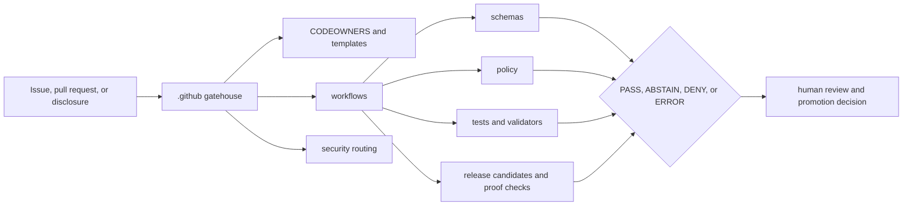

<!-- [KFM_META_BLOCK_V2]
doc_id: kfm://doc/TODO
title: .github
type: standard
version: v1
status: draft
owners: TODO: owner not verified
created: TODO: YYYY-MM-DD
updated: TODO: YYYY-MM-DD
policy_label: TODO: public|restricted|internal
related: [TODO: verify root README, CODEOWNERS, workflow, action, watcher, security, contract, schema, policy, test, tools, and release links]
tags: [kfm, github, governance, ci-cd, review, automation, publication-gates]
notes: [Prepared as proposed markdown without a mounted repo checkout; all ownership, dates, policy labels, branch settings, workflow inventory, and protected-environment details require maintainer verification.]
[/KFM_META_BLOCK_V2] -->

<a id="top"></a>

# `.github`

Repo-wide GitHub governance, review routing, workflow orchestration, and automation gatehouse for Kansas Frontier Matrix.

> [!NOTE]
> **Status:** `draft`  
> **Owners:** `TODO: owner not verified`  
> **Authority:** `PROPOSED`  
> **Repo fit:** `.github/README.md`  
> **Review burden:** Changes here can alter review routing, CI, security disclosure, dependency automation, release gates, and publication controls. Reviewers must verify CODEOWNERS, workflow inventory, branch protections, Actions permissions, and downstream trust-surface links before merge.


**Quick jumps:** [Scope](#scope) · [Repo fit](#repo-fit) · [Directory map](#directory-map) · [Accepted inputs](#accepted-inputs) · [Exclusions](#exclusions) · [Gatekeeping rules](#gatekeeping-rules) · [Review gates](#review-gates) · [Validation](#validation) · [Rollback](#rollback) · [Open verification](#open-verification)

## Scope

`.github/` is the GitHub-native gatehouse for KFM repository governance. It may route ownership, shape pull request intake, run or compose validation workflows, host reusable GitHub Actions, coordinate dependency automation, and point contributors toward security and disclosure procedures.

It does **not** own KFM truth. It does not define source authority, semantic contracts, machine schemas, policy meaning, lifecycle data, proof objects, released artifacts, or runtime behavior. Those belong to their responsibility roots and are checked or routed from here.

> [!IMPORTANT]
> A successful workflow is not a publication decision by itself. Publication-significant changes still require evidence closure, policy review, release state, correction path, and rollback target.

## Repo fit

| Relation | Path | Status | Role |
| --- | --- | --- | --- |
| This document | `.github/README.md` | `PROPOSED` | Gatehouse README and boundary map |
| Repository entrypoint | `../README.md` | `NEEDS VERIFICATION` | KFM public orientation and root routing |
| Ownership routing | `./CODEOWNERS` | `NEEDS VERIFICATION` | Required reviewer map for repo zones |
| Pull request intake | `./PULL_REQUEST_TEMPLATE.md` | `NEEDS VERIFICATION` | Review checklist and evidence prompts |
| Issue intake | `./ISSUE_TEMPLATE/` | `NEEDS VERIFICATION` | Bug, correction, source, security, and feature intake |
| Workflow orchestration | `./workflows/` | `NEEDS VERIFICATION` | GitHub Actions workflow lane |
| Reusable action steps | `./actions/` | `NEEDS VERIFICATION` | Composite or local actions used by workflows |
| Watcher automation | `./watchers/` | `NEEDS VERIFICATION` | Repo-native watcher or scheduled automation docs/configs |
| Security pointer | `./SECURITY.md`, `../SECURITY.md` | `NEEDS VERIFICATION` | Disclosure posture and sensitive-report routing |
| Dependency automation | `./dependabot.yml` | `NEEDS VERIFICATION` | Dependency update rules and review constraints |
| Trust spine downstream | `../contracts/`, `../schemas/`, `../policy/`, `../tests/`, `../tools/`, `../release/` | `NEEDS VERIFICATION` | Contract, validation, policy, test, helper, and release evidence surfaces |

## Directory map

This is the expected boundary map for the `.github` gatehouse. Update it to match the active branch before treating it as current inventory.

```text
.github/
├── README.md
├── CODEOWNERS
├── PULL_REQUEST_TEMPLATE.md
├── ISSUE_TEMPLATE/
├── workflows/
├── actions/
├── watchers/
├── dependabot.yml
└── SECURITY.md
```


```mermaid
flowchart LR
  Intake[Issue, pull request, or disclosure] --> Gatehouse[.github gatehouse]
  Gatehouse --> Owners[CODEOWNERS and templates]
  Gatehouse --> Workflows[workflows]
  Gatehouse --> Security[security routing]
  Workflows --> Schemas[schemas]
  Workflows --> Policy[policy]
  Workflows --> Tests[tests and validators]
  Workflows --> Release[release candidates and proof checks]
  Schemas --> Decision{PASS, ABSTAIN, DENY, or ERROR}
  Policy --> Decision
  Tests --> Decision
  Release --> Decision
  Decision --> Review[human review and promotion decision]
```

## Accepted inputs

Use `.github/` for GitHub-native governance and automation inputs only.

| Input | Accept here when | Must not do |
| --- | --- | --- |
| `CODEOWNERS` | It routes review responsibility for repo paths | Replace domain, policy, source, or release authority |
| Pull request and issue templates | They collect evidence, risk, validation, and rollback information | Turn checklist completion into automatic publication approval |
| Workflow YAML | It orchestrates validation, tests, policy checks, documentation checks, and release-candidate checks | Encode canonical truth or silently mutate data lifecycle state |
| Composite/local actions | They package reusable GitHub Actions steps | Hide policy decisions, source-role logic, or credentials in convenience wrappers |
| Dependabot configuration | It proposes dependency updates with review constraints | Auto-merge high-risk dependency changes without policy/security review |
| Security disclosure docs | They route vulnerability or sensitive-location reports | Expose sensitive reports, secrets, unpublished data, or precise protected locations |
| Subdirectory READMEs | They explain workflow, action, watcher, and template boundaries | Claim workflow inventory or branch protections not verified on the active branch |

## Exclusions

| Material | Does not belong in `.github/` | Correct home |
| --- | --- | --- |
| KFM doctrine, architecture, ADRs, runbooks | Human-facing governance prose belongs in docs | `../docs/` |
| Machine-readable control maps and registers | GitHub config should not become the authority registry | `../control_plane/` |
| Semantic object definitions | Contracts define meaning, not workflows | `../contracts/` |
| JSON Schema or other machine validation shapes | Schemas need a single machine-checkable home | `../schemas/` |
| Policy-as-code and policy rationale | Workflows may call policy; they should not own it | `../policy/` |
| Tests and fixtures | Workflows run tests; they do not own test evidence | `../tests/`, `../fixtures/` |
| Validators, probes, diff, attest, and helper scripts | Reusable helpers belong outside GitHub config unless they are GitHub Actions | `../tools/`, `../scripts/` |
| Source data, work products, catalog records, receipts, proofs, published artifacts | Lifecycle and proof objects must stay in governed data/release roots | `../data/`, `../release/` |
| Deployable services and shared packages | Runtime and reusable implementation are not GitHub configuration | `../apps/`, `../packages/` |
| Domain-specific docs or domain folders | Domains live under responsibility roots, not repo root or `.github` | `../docs/domains/`, `../schemas/contracts/v1/domains/`, `../policy/domains/` |
| Secrets, tokens, keys, private reports | Never commit secrets or sensitive disclosures | GitHub secrets, protected environments, private disclosure channel |

## Gatekeeping rules

Changes under `.github/` should preserve these KFM invariants:

1. **Cite-or-abstain:** workflows and templates should require evidence for consequential claims or force `ABSTAIN`.
2. **Fail closed:** unclear ownership, source rights, sensitivity, release state, or policy state blocks higher-risk actions.
3. **No direct public internal-stage access:** public workflows, logs, artifacts, and summaries must not expose RAW, WORK, QUARANTINE, unpublished candidates, secrets, direct model outputs, or internal canonical stores.
4. **Promotion is not a file move:** release workflows may assemble candidates and reports, but promotion still needs a governed decision, release manifest, correction path, and rollback target.
5. **AI remains subordinate:** no workflow should publish AI-generated text as authoritative truth without EvidenceBundle resolution and citation validation.
6. **No parallel authority homes:** do not define new schema, contract, policy, source registry, release, or proof homes from GitHub config without an ADR or migration note.
7. **Least privilege:** GitHub Actions permissions, tokens, environments, and third-party actions should be minimal, pinned, reviewed, and auditable.

## Review gates

| Gate | Required reviewer check | Result if unresolved |
| --- | --- | --- |
| Directory fit | Does this change belong in `.github/` rather than docs, policy, schemas, tests, tools, data, or release? | `ABSTAIN` or move the change |
| Ownership | Does CODEOWNERS route review to the correct maintainers? | `ABSTAIN` |
| Workflow safety | Are permissions least-privilege, secrets protected, and third-party actions pinned or justified? | `DENY` for high-risk workflows |
| Evidence and policy | Do workflow outputs distinguish validation, policy, release, and review state? | `ABSTAIN` |
| Publication impact | Could this change alter published artifacts, release state, or public UI/API behavior? | Require release/correction/rollback review |
| Documentation | Are downstream docs or READMEs updated when the contributor path changes? | `ABSTAIN` |
| Rollback | Can the change be reverted without losing audit evidence or correction lineage? | `ERROR` until fixed |

## Validation

Before merging `.github/` changes, run the repo-native validation suite. At minimum, use read-only checks like these and record actual results in the PR:

```bash
git status --short
find .github -maxdepth 4 -type f | sort
git diff --check
```

When repo tooling exists, prefer the documented task runner or CI entrypoint. Do not report workflow success unless the workflow actually ran on the active branch.

## Rollback

Rollback for `.github/` changes should be simple and auditable:

1. Revert the PR or commit that changed the gatehouse file.
2. Preserve GitHub Actions run logs, validation summaries, and review comments as audit evidence.
3. If a workflow affected a release candidate or published surface, open or update the relevant rollback card and correction notice.
4. Re-run the minimum validation checks after rollback.
5. Record any branch-protection, environment, or secret-setting changes that cannot be reverted through Git alone.

## Open verification

These items must be checked in the active repository before this README can move beyond `draft`:

- `CODEOWNERS` coverage for `.github/` and downstream trust surfaces.
- Actual `.github/` subdirectory inventory on the active branch.
- Workflow YAML names, triggers, permissions, environments, artifact retention, and third-party action pins.
- Whether `./actions/`, `./watchers/`, `./ISSUE_TEMPLATE/`, `./SECURITY.md`, and `./dependabot.yml` exist and are canonical.
- Branch protection and required-check settings.
- Secret and environment ownership model.
- Whether release, promotion, correction, rollback, and security workflows are enforced or only documented.
- Link validity for downstream `docs/`, `control_plane/`, `contracts/`, `schemas/`, `policy/`, `tests/`, `tools/`, `data/`, and `release/` surfaces.
- Final owner, creation date, update date, policy label, and `doc_id` for the KFM meta block.

[Back to top](#top)
