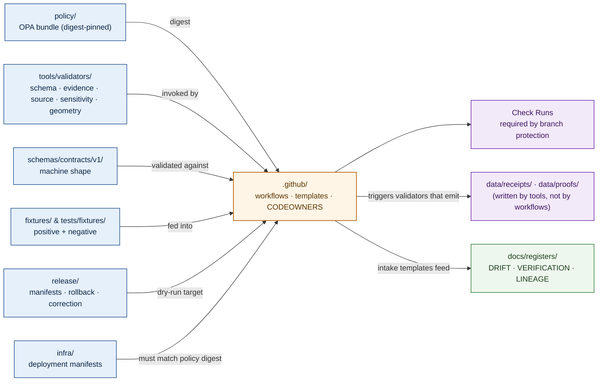

<!-- [KFM_META_BLOCK_V2]
doc_id: kfm://doc/github-folder-readme
title: .github — GitHub Platform Governance Hooks
type: standard
version: v1
status: draft
owners: <repo stewards · governance reviewers · CI maintainers — placeholder, confirm via CODEOWNERS>
created: 2026-05-11
updated: 2026-05-11
policy_label: public
related:
  - ../directory-rules.md
  - ../docs/registers/AUTHORITY_LADDER.md
  - ../docs/registers/DRIFT_REGISTER.md
  - ../docs/registers/VERIFICATION_BACKLOG.md
  - ../CODEOWNERS
  - ../policy/
  - ../tools/validators/
tags: [kfm, governance, ci, github, infra]
notes:
  - "Folder presence and contents are PROPOSED until verified against a mounted repo."
  - "Workflow filenames inside are sourced from KFM design reports (Whole-UI Expansion, Pass 10 C14-01) and from Unified Manual §25 CI/CD lanes; they may not yet exist on disk."
[/KFM_META_BLOCK_V2] -->

# `.github/` — GitHub Platform Governance Hooks

> Workflows, templates, and platform hooks that turn KFM governance doctrine into enforceable, observable signals on every push, pull request, and release dry-run.


**Status:** PROPOSED — the folder's *role* as a canonical root is **CONFIRMED**; the specific files, workflow names, branch-protection coupling, and CODEOWNERS contents inside are **PROPOSED / NEEDS VERIFICATION** until inspected against a mounted repository.
**Owners:** `<repo stewards · governance reviewers · CI maintainers — placeholder, confirm via CODEOWNERS>`
**Last updated:** 2026-05-11

---

## Quick jump

- [Purpose](#purpose)
- [Authority level](#authority-level)
- [Status](#status)
- [What belongs here](#what-belongs-here)
- [What does NOT belong here](#what-does-not-belong-here)
- [Inputs](#inputs)
- [Outputs](#outputs)
- [Validation](#validation)
- [Review burden](#review-burden)
- [Related folders](#related-folders)
- [ADRs](#adrs)
- [Last reviewed](#last-reviewed)
- [Directory tree (PROPOSED)](#directory-tree-proposed)
- [How `.github/` sits in the canonical tree](#how-github-sits-in-the-canonical-tree)
- [Responsibility map](#responsibility-map)
- [Workflow catalog (PROPOSED)](#workflow-catalog-proposed)
- [CI gate map (A–G)](#ci-gate-map-ag)
- [Anti-patterns specific to `.github/`](#anti-patterns-specific-to-github)
- [FAQ](#faq)
- [Open questions / NEEDS VERIFICATION](#open-questions--needs-verification)

---

## Purpose

`.github/` is the **canonical home for GitHub-platform-specific governance hooks** in the Kansas Frontier Matrix repository. It is the operational seam that wires KFM doctrine — Directory Rules, the gate matrix, policy-as-code, evidence-first promotion — into the day-to-day signals contributors see: workflows, required checks, code ownership, issue and pull-request templates, and dependency-intake configuration.

This folder **invokes** validators, policies, and tools that live elsewhere. It does **not** own their logic, schemas, or decisions. Workflows are glue; the trust membrane lives in `policy/`, `tools/validators/`, `schemas/`, and `contracts/`.

> [!IMPORTANT]
> `.github/` is **infrastructure for governance**, not governance itself. A workflow that disagrees with `policy/` is drift — fix the policy or fix the workflow; do not let CI invent rules that doctrine has not authored.

---

## Authority level

**Canonical.** Listed in `directory-rules.md` §5 and §20 as a canonical root. The folder is governance-bearing in role (it operationalizes gates) but *compatibility-shaped* in convention: its directory layout is dictated by GitHub, not by KFM.

| Field | Value |
|---|---|
| Authority class | **Canonical** |
| Sub-class | **implementation-bearing** — workflows execute; they do not author truth |
| Governs | CI orchestration, code ownership, issue/PR intake, platform-level governance hooks |
| Does not govern | Policy decisions, schema shape, contract meaning, validator logic, release decisions, lifecycle data |

---

## Status

**CONFIRMED** as a canonical root by `directory-rules.md`.
**PROPOSED** for everything inside it in this session — file presence, workflow names, CODEOWNERS contents, branch-protection coupling, and any specific check name. No mounted repository was inspected, so the actual contents of `.github/` are **UNKNOWN / NEEDS VERIFICATION**.

| Claim | Truth label |
|---|---|
| `.github/` is a canonical root | **CONFIRMED** (Directory Rules §5, §20) |
| `CODEOWNERS` may live at `.github/CODEOWNERS` *or* repo root | **CONFIRMED** (Directory Rules §5) |
| The seven-gate matrix (A–G) is doctrine | **CONFIRMED** (C5-01) |
| Workflow files named below exist on disk | **UNKNOWN / NEEDS VERIFICATION** |
| Branch protection currently enforces the gates listed here | **NEEDS VERIFICATION** |
| The seven-gate matrix is enforced today in this repo | **PROPOSED** — doctrine confirmed; enforcement not verified |

---

## What belongs here

| Class | Path pattern | Role |
|---|---|---|
| GitHub Actions workflows | `.github/workflows/*.yml` | CI invocations of validators, policies, gates, and release dry-runs. |
| Composite / reusable actions | `.github/actions/<name>/action.yml` | Repo-local action definitions reused by multiple workflows. |
| Code ownership | `.github/CODEOWNERS` *(or repo-root `CODEOWNERS`)* | Path-to-reviewer map enforced at PR review time. |
| Issue templates | `.github/ISSUE_TEMPLATE/*.yml` or `*.md` | Structured intake for bugs, drift entries, ADR proposals, verification-backlog items. |
| Pull request template | `.github/pull_request_template.md` *(or `PULL_REQUEST_TEMPLATE/`)* | Required PR description scaffold: cited Directory Rules section, gate impact, rollback target. |
| Dependency-intake config | `.github/dependabot.yml` | Pinned-toolchain dependency updates as reviewable PRs. |
| Funding metadata | `.github/FUNDING.yml` | Optional; community/funding pointers. |
| Discussion templates | `.github/DISCUSSION_TEMPLATE/*.yml` | Optional; community discussion intake. |
| Folder README | `.github/README.md` | **This file.** Required by Directory Rules §15. |

> [!NOTE]
> `CODEOWNERS` MAY live at `.github/CODEOWNERS` or at repo root. The canonical tree in Directory Rules §5 shows both options. Choose one home, document the choice here, and do **not** maintain two copies.

---

## What does NOT belong here

| Misplacement | Belongs in | Why |
|---|---|---|
| Validator logic (Python/Node code) | `tools/validators/` | Workflows invoke validators; they do not contain them. |
| Policy bundles (Rego, JSON policy) | `policy/` (with `policies/` only as compatibility mirror) | Policy is authored, versioned, and reviewed in `policy/`; CI references it by digest. |
| Schemas | `schemas/contracts/v1/...` per ADR-0001 default | Schema authority is `schemas/`. |
| Contracts (object meaning) | `contracts/` | Semantic Markdown belongs there. |
| Release manifests, decisions, rollback cards | `release/` | Trust-bearing release artifacts. |
| Run receipts, proofs, evidence bundles | `data/receipts/`, `data/proofs/` | Lifecycle data and emitted proof. |
| Deployment manifests, infra config | `infra/` | Hosting, network, exposure posture. |
| Executable pipeline logic / declarative pipeline specs | `pipelines/` and `pipeline_specs/` | Workflows may *trigger* pipelines; they do not *contain* pipeline logic. |
| Documentation prose / ADRs / runbooks | `docs/` | Human-facing control plane. |
| `SECURITY.md` (the public security policy) | Repo root | Directory Rules §5 places `SECURITY.md` at root. A `.github/SECURITY.md` mirror is permitted only with explicit justification. |
| Test fixtures | `fixtures/` or `tests/fixtures/` | Workflows reference fixtures; they do not store them. |

> [!WARNING]
> A workflow that embeds policy logic inline — Rego, allow/deny lists, license allowlists, sensitivity rules — is **drift**. The workflow MUST load these from `policy/` so that **CI parity (gate C, C5-03)** holds: CI and runtime MUST evaluate the same policy bundle digest.

---

## Inputs

Files in `.github/` are authored by stewards and reviewed by CODEOWNERS. They reference:

- **`tools/validators/`** — workflows shell out to repo-wide validators (schema, evidence, lifecycle, source, sensitivity, citation, geometry, geo manifest). *PROPOSED inventory.*
- **`policy/`** — Conftest/OPA decisions, license allowlists, sensitivity gates, promotion rules.
- **`schemas/contracts/v1/...`** — for schema-validation jobs.
- **`fixtures/`** and **`tests/fixtures/`** — for validator and policy fixture suites (positive and negative).
- **`tests/`** — unit, contract, end-to-end, accessibility, and finite-outcome tests.
- **`docs/registers/`** — drift, verification, lineage, and authority registers referenced from PR templates and CODEOWNERS comments.
- **`release/`** — release dry-run and rollback workflows reference release manifests and rollback cards.

---

## Outputs

`.github/` emits **signals**, not trust-bearing artifacts:

- **Check Runs and status checks** on PRs and pushes (consumed by branch protection).
- **Workflow logs and annotations** — advisory; the source of truth remains the validator/receipt/policy output, not the log line.
- **PR comments** from bot workflows (drift summaries, gate rollups, AI-patch reviews).
- **Triggered downstream jobs** — `repository_dispatch`, `workflow_dispatch`, or reusable workflow calls into `tools/` and `pipelines/`.

Workflows MUST NOT emit release decisions, receipts, proofs, or catalog updates as their **sole** output. Those belong in `data/receipts/`, `data/proofs/`, `release/`, and `data/catalog/` — written by the tools the workflow invoked, not by the workflow file itself. This preserves the **watcher-as-non-publisher** invariant.

> [!IMPORTANT]
> The CI signal is *evidence that the gate ran*. The CI signal is **not** the gate. Auditors must be able to recompute the same result on a clean local checkout via a `verify.sh`-style script (C14-01).

---

## Validation

The contents of `.github/` are themselves checked:

1. **Workflow lint** — `actionlint` (or equivalent) over `.github/workflows/*.yml`. *PROPOSED.*
2. **CODEOWNERS lint** — GitHub validates CODEOWNERS on push; CI MAY run a coverage check that fails when canonical roots lack owners.
3. **Path / drift scan** — repo-wide Directory Rules check (§16 reviewer checklist, mechanized). *PROPOSED — depends on `tools/validators/path_role/` once it exists.*
4. **Pinned action digests** — every `uses:` MUST pin a commit SHA, not a floating tag. Aligns with C13 tool-pinning.
5. **Policy parity check** — verify the OPA bundle digest referenced in any workflow matches the bundle digest referenced in `infra/` deployment manifests (C5-03).
6. **Branch-protection coupling** — required-check names MUST match the names branch protection requires. **NEEDS VERIFICATION** against current repository settings.

---

## Review burden

Changes under `.github/` require review by:

- **The owner(s) named in `CODEOWNERS`** for the affected path.
- **CI maintainers** for any new workflow, action, or branch-protection-relevant rename.
- **Governance reviewers** when the change affects required checks, CODEOWNERS coverage, PR-template gating, issue-intake routing, or any gate in the A–G matrix.
- **Subsystem owners** when a workflow's job affects their subsystem (UI, governed AI, contracts, schemas, policy, release, infra).

A workflow rename or check-name change that breaks branch protection MUST land with a coordinated update to repository settings; otherwise required checks become unmatchable and merges silently block.

---

## Related folders

| Folder | Relationship |
|---|---|
| [`../policy/`](../policy/) | Source of truth for allow / deny / restrict / abstain decisions. Workflows reference policy by digest. |
| [`../tools/validators/`](../tools/validators/) | Validator logic invoked by workflows. |
| [`../schemas/`](../schemas/) | Schema authority (`schemas/contracts/v1/...` per ADR-0001 default). |
| [`../contracts/`](../contracts/) | Object-family meaning (semantic Markdown). |
| [`../tests/`](../tests/) | Test suites invoked by CI. |
| [`../fixtures/`](../fixtures/) | Fixture inputs to validator and policy suites. |
| [`../release/`](../release/) | Release decisions; dry-run workflows reference manifests here. |
| [`../infra/`](../infra/) | Deployment manifests; policy-parity coupling lives here. |
| [`../docs/registers/AUTHORITY_LADDER.md`](../docs/registers/AUTHORITY_LADDER.md) | Authority order CI helps enforce. |
| [`../docs/registers/DRIFT_REGISTER.md`](../docs/registers/DRIFT_REGISTER.md) | Where drift between workflows and doctrine is recorded. |
| [`../docs/registers/VERIFICATION_BACKLOG.md`](../docs/registers/VERIFICATION_BACKLOG.md) | NEEDS-VERIFICATION items, including branch-protection coupling. |
| [`../directory-rules.md`](../directory-rules.md) | The doctrine this folder operationalizes. |
| [`../CODEOWNERS`](../CODEOWNERS) *or* [`./CODEOWNERS`](./CODEOWNERS) | Path-to-reviewer map. Confirm the chosen home. |

---

## ADRs

The ADRs relevant to this folder are listed below. **All listed ADR IDs except ADR-0001 are PROPOSED placeholders** until a mounted `docs/adr/` confirms them.

| ADR | Topic | Why it touches `.github/` |
|---|---|---|
| **ADR-0001** *(referenced in Directory Rules)* | Schema home — default `schemas/contracts/v1/...` | Schema-validation workflows MUST target the canonical home. |
| **ADR-CI-PARITY** *(PROPOSED)* | Policy parity — CI bundle digest equals runtime bundle digest | C5-03 enforcement; coupling between this folder and `infra/`. |
| **ADR-REQUIRED-CHECKS** *(PROPOSED)* | Pinning required-check names to branch protection | Prevents silent-block drift between workflow renames and protection rules. |
| **ADR-STARTER-PACK** *(PROPOSED)* | Five-file governance starter pack + `integrity.yml` | C14-01 minimum viable governance posture. |

> [!NOTE]
> No ADR has been verified in this session. Mounted-repo inspection is required to confirm ADR numbers, acceptance state, and supersession links.

---

## Last reviewed

**2026-05-11.** Older than six months from this date → flag for review per Directory Rules §15.

[Back to top](#github--github-platform-governance-hooks)

---

## Directory tree (PROPOSED)

> [!CAUTION]
> The tree below is **PROPOSED**. It synthesizes the canonical-root role from `directory-rules.md` with workflow names that appear in KFM design reports (Whole-UI + Governed-AI Expansion §29–§30; Pass 10 idea C14-01) and CI lanes from the Unified Implementation Manual §25. It does **not** describe the current state of any mounted repository.

```text
.github/
├── README.md                                # this file (Directory Rules §15)
├── CODEOWNERS                                # OR at repo root — choose one
├── pull_request_template.md                  # PROPOSED — must cite Directory Rules section
├── dependabot.yml                            # PROPOSED — pinned-toolchain intake
├── FUNDING.yml                               # OPTIONAL
├── ISSUE_TEMPLATE/
│   ├── bug_report.yml                        # PROPOSED
│   ├── drift_entry.yml                       # PROPOSED — feeds docs/registers/DRIFT_REGISTER.md
│   ├── verification_item.yml                 # PROPOSED — feeds docs/registers/VERIFICATION_BACKLOG.md
│   ├── adr_proposal.yml                      # PROPOSED — initiates docs/adr/ flow
│   └── config.yml                            # PROPOSED — intake routing
├── DISCUSSION_TEMPLATE/                      # OPTIONAL
├── actions/                                  # PROPOSED — composite / reusable actions
│   └── <action-name>/action.yml
└── workflows/
    ├── integrity.yml                         # PROPOSED — C14-01 starter-pack workflow
    ├── path-and-drift.yml                    # PROPOSED — Directory Rules §16 mechanized
    ├── contracts-ui-ai.yml                   # PROPOSED — schema + fixture + policy validation
    ├── ui-governed.yml                       # PROPOSED — PR-safe UI validation
    ├── policy-parity.yml                     # PROPOSED — C5-03 CI = runtime digest check
    ├── promotion-dry-run.yml                 # PROPOSED — release gate dry-run, no public effect
    ├── catalog-closure.yml                   # PROPOSED — PROV / STAC / DCAT closure check
    ├── signing-integrity.yml                 # PROPOSED — RunReceipt / spec_hash / digest verify
    └── rollback-drill.yml                    # PROPOSED — rollback card replay
```

---

## How `.github/` sits in the canonical tree


```mermaid
flowchart LR
    classDef canon fill:#e6f0fb,stroke:#1f4f8f,color:#0b2545,stroke-width:1.2px;
    classDef hook fill:#fff5e6,stroke:#b25900,color:#5a3500,stroke-width:1.4px;
    classDef result fill:#f3eaf9,stroke:#6b21a8,color:#3b1361,stroke-width:1.2px;
    classDef reg fill:#eef7ee,stroke:#2f7d32,color:#1b3b1c,stroke-width:1.2px;

    GH[".github/<br/>workflows · templates · CODEOWNERS"]:::hook

    POL["policy/<br/>OPA bundle (digest-pinned)"]:::canon
    TLS["tools/validators/<br/>schema · evidence · source · sensitivity · geometry"]:::canon
    SCH["schemas/contracts/v1/<br/>machine shape"]:::canon
    FIX["fixtures/ &amp; tests/fixtures/<br/>positive + negative"]:::canon
    REL["release/<br/>manifests · rollback · correction"]:::canon
    INF["infra/<br/>deployment manifests"]:::canon

    DAT["data/receipts/ · data/proofs/<br/>(written by tools, not by workflows)"]:::result
    CHK["Check Runs<br/>required by branch protection"]:::result
    REG["docs/registers/<br/>DRIFT · VERIFICATION · LINEAGE"]:::reg

    POL -- "digest" --> GH
    TLS -- "invoked by" --> GH
    SCH -- "validated against" --> GH
    FIX -- "fed into" --> GH
    REL -- "dry-run target" --> GH
    INF -- "must match policy digest" --> GH

    GH --> CHK
    GH -- "triggers validators that emit" --> DAT
    GH -- "intake templates feed" --> REG
```

[Back to top](#github--github-platform-governance-hooks)

---

## Responsibility map

| Responsibility | Lives in | `.github/` role |
|---|---|---|
| Decide allow / deny / restrict / abstain | `policy/` | **Reference** the bundle by digest; never inline rules. |
| Define object meaning | `contracts/` | **Validate** that PRs touching contracts pair with schema and fixture changes. |
| Define machine shape | `schemas/` | **Invoke** schema-validation jobs over `schemas/contracts/v1/` + fixtures. |
| Prove a rule is enforceable | `tests/` | **Run** unit / contract / e2e / accessibility / finite-outcome suites. |
| Repo-wide validator logic | `tools/validators/` | **Shell out** to validators; never duplicate logic in YAML. |
| Release decisions | `release/` | **Dry-run** release gates; never publish from CI alone. |
| Receipts, proofs, manifests | `data/receipts/`, `data/proofs/`, `release/manifests/` | **Written by tools** the workflow invokes, not by the workflow file. |
| Deployment posture | `infra/` | **Parity check** — CI and infra reference the same bundle digest. |
| Human explanation | `docs/` | **Linked** from PR templates, issue templates, CODEOWNERS comments. |

---

## Workflow catalog (PROPOSED)

> [!NOTE]
> Every row below is **PROPOSED**. Two filenames — `ui-governed.yml` and `contracts-ui-ai.yml` — are explicitly named in the Whole-UI + Governed-AI Expansion report as CREATE-PROPOSED. `integrity.yml` is named in Pass 10 idea C14-01. The remaining filenames are author-chosen names that map one-to-one onto the CI/CD lanes listed in Unified Manual §25; an ADR or working-group decision SHOULD freeze final names before they enter branch protection.

| Workflow | Trigger | Purpose | Gate(s) | Source for the filename / lane |
|---|---|---|---|---|
| `integrity.yml` | push, pull_request | Run `verify.sh`; same checks locally and in CI | A, B, C, F | C14-01 (filename CONFIRMED in source) |
| `path-and-drift.yml` | pull_request | Mechanize Directory Rules §16 reviewer checklist; flag root creation, schema-home drift, trust-content placement | A | Unified Manual §25 lane "Path and drift scan" (filename author-chosen) |
| `contracts-ui-ai.yml` | pull_request | Schema, fixture, and policy validation for UI + governed-AI surfaces | B, C | Whole-UI Expansion §30 (filename CONFIRMED in source) |
| `ui-governed.yml` | pull_request | PR-safe UI validation: schema / component / e2e / a11y | B, C, G | Whole-UI Expansion §30 (filename CONFIRMED in source) |
| `policy-parity.yml` | pull_request | C5-03 check — CI bundle digest equals runtime bundle digest | C | C5-03 (filename author-chosen) |
| `promotion-dry-run.yml` | pull_request, workflow_dispatch | Run promotion gates without public effect | A–F | Unified Manual §25 lane "Promotion dry-run" (filename author-chosen) |
| `catalog-closure.yml` | pull_request | Validate PROV / STAC / DCAT-style closure | F | Unified Manual §25 lane "Catalog closure" (filename author-chosen) |
| `signing-integrity.yml` | pull_request, push | Verify RunReceipt, spec_hash, digest, Merkle patterns | F | Unified Manual §25 lane "Signing / integrity" + C1-02 (filename author-chosen) |
| `rollback-drill.yml` | workflow_dispatch, schedule | Replay rollback card against a dry-run release | F, G | Encyclopedia §14 PR-10 (filename author-chosen) |

**Cross-cutting requirements (all workflows):**

- **No-network default** for the first PR pipeline. Live connectors, external endpoints, package-version probes, and runtime smoke tests are **opt-in, source-activated** jobs. *(Unified Manual §25.)*
- **Fail-closed.** Absent evidence blocks promotion. *(C5-02.)*
- **Pinned actions.** Every `uses:` references a commit SHA, never a floating tag.
- **Watcher-as-non-publisher.** Workflows MUST NOT write canonical truth, mutate catalogs, or publish directly. They emit candidate decisions and receipts only.

---

## CI gate map (A–G)

The seven-gate matrix is **CONFIRMED doctrine** (C5-01). Its **current enforcement** in this repo is **PROPOSED / NEEDS VERIFICATION** until branch protection and workflow inventory are inspected.

| Gate | Intent | Required evidence | CI surface |
|---|---|---|---|
| **A** Structure & Metadata | MetaBlock presence, zone correctness, path-role validity | Path/drift scan + MetaBlock check | `path-and-drift.yml` *(PROPOSED)* |
| **B** Schemas & Contracts | Object conforms to schema + contract vocabulary | jsonschema/ajv over `schemas/contracts/v1/` and fixtures | `contracts-ui-ai.yml`, `ui-governed.yml` *(PROPOSED)* |
| **C** Policy Parity | CI and runtime decide on the same OPA bundle digest | Conftest/OPA against pinned bundle | `policy-parity.yml`, `integrity.yml` *(PROPOSED)* |
| **D** Security & Sensitivity | Rights, sensitivity, license allowlist, secret hygiene | SPDX allowlist + sensitivity classifier + secret scan | *(integrated in `integrity.yml`; PROPOSED)* |
| **E** Data Quality | DQ profilers, assertions, threshold pass | DQ check outputs with `status: pass` | *(integrated in `promotion-dry-run.yml`; PROPOSED)* |
| **F** Provenance & Lineage | RunReceipt, spec_hash, signed bundle, catalog closure | Receipt verification + closure check | `signing-integrity.yml`, `catalog-closure.yml` *(PROPOSED)* |
| **G** Reviewability | CODEOWNERS + two-key approval + policy approval | GitHub review + policy decision | branch protection + `CODEOWNERS` + policy webhook *(NEEDS VERIFICATION)* |

> [!IMPORTANT]
> **Required-check names** in branch protection MUST exactly match the workflow job names listed here. A rename without a coordinated protection update results in **silent merge blocks**. This coupling is **NEEDS VERIFICATION** against current GitHub repository settings.

[Back to top](#github--github-platform-governance-hooks)

---

## Anti-patterns specific to `.github/`

Beyond the placement anti-patterns in Directory Rules §13, these failure modes are specific to this folder:

| Anti-pattern | Symptom | Fix |
|---|---|---|
| **Policy inlined in YAML** | `allowlist:`, `deny:`, license lists embedded directly in workflow steps | Move to `policy/`; workflow references by digest. Restores C5-03 parity. |
| **Floating action tags** | `uses: actions/checkout@v4` instead of a pinned SHA | Pin to commit SHA; updates land as reviewable PRs. |
| **Required-check drift** | Workflow renamed; branch protection still requires the old name | Rename and update protection in the same PR; ADR if the rename is structural. |
| **Workflow as publisher** | A workflow `git push`-es to `data/published/`, `data/catalog/`, or `release/` | Watcher-as-non-publisher invariant broken. Workflows emit receipts and candidate decisions; promotion is governed. |
| **CI-only validator** | Validator logic lives only inside a workflow `run:` block | Extract to `tools/validators/`; CI calls into it. Restores local reproducibility (C14-01 `verify.sh`). |
| **CODEOWNERS without coverage** | A new canonical root lands without a CODEOWNERS line | CODEOWNERS-coverage check fails; block merge. |
| **Schema job pointing at a compatibility root** | Workflow validates `jsonschema/` instead of `schemas/contracts/v1/` | Compatibility roots are mirrors; canonical home is `schemas/`. |
| **PR template smoothing over governance** | PR template omits "Directory Rules section cited" or "rollback target" fields | Restore required fields; reviewers cannot waive them. |
| **Two CODEOWNERS files** | One at `.github/CODEOWNERS`, one at repo root | Pick one home; delete the other; note the choice here. |
| **Secret-bearing workflow on PRs from forks** | Workflow with elevated permissions triggered by `pull_request` from forks | Use `pull_request_target` only with care; default to least-privilege tokens. |

---

## FAQ

<details>
<summary><strong>Why does <code>.github/</code> count as a canonical root if its layout is dictated by GitHub?</strong></summary>

Because **role** decides root membership, not naming flexibility. The folder carries repo-wide responsibility for CI orchestration, code ownership, and platform-level governance hooks — that is a canonical responsibility per Directory Rules §3. GitHub's naming conventions inside the folder are operational details, not authority questions.

</details>

<details>
<summary><strong>Where does <code>CODEOWNERS</code> belong — here or at repo root?</strong></summary>

Either is permitted by Directory Rules §5 ("may live in `.github/CODEOWNERS` instead"). Choose one home, document the choice in this README, and ensure tooling (CI, GitHub settings) points at the chosen path. Maintaining two copies is the anti-pattern.

</details>

<details>
<summary><strong>Why not put validators or policy bundles in <code>.github/</code>?</strong></summary>

Because they have canonical homes — `tools/validators/` and `policy/` respectively — and because **policy parity (C5-03)** requires CI and runtime to evaluate the same bundle. If the bundle lived in `.github/`, runtime could not reference it without `.github/` becoming a parallel authority, which violates the "no parallel authority" rule in Directory Rules §13.

</details>

<details>
<summary><strong>Can a workflow publish a release?</strong></summary>

No, not autonomously. A workflow MAY *trigger* a release pipeline whose output is a `ReleaseManifest` under `release/manifests/`, but the release decision is governed: it requires receipts, proof closure, source-activation evidence, policy approval, and (gate G) reviewer approval. The **watcher-as-non-publisher** invariant means workflows emit candidate decisions and receipts; humans (or reviewed gates) promote.

</details>

<details>
<summary><strong>What happens if branch protection requires a check that no workflow produces?</strong></summary>

PRs become unmergeable until either (a) the missing check is produced or (b) branch protection is updated. Either change is a governance event — record it in `docs/registers/DRIFT_REGISTER.md` and resolve via PR + reviewer sign-off. An ADR is needed only if the gate matrix itself changes.

</details>

<details>
<summary><strong>How does this folder relate to the five-file governance starter pack (C14-01)?</strong></summary>

C14-01 names a minimum viable governance posture: `CODEOWNERS`, `tool-versions.yaml`, `policy-bundle.json`, `sbom.yaml`, `run_receipt.schema.json`, plus `integrity.yml` and `verify.sh`. Of those:

- `CODEOWNERS` lives here *or* at repo root.
- `integrity.yml` lives in `.github/workflows/`.
- `verify.sh` lives in `scripts/dev/` (or under `tools/`) so developers can reproduce CI locally.
- `tool-versions.yaml`, `policy-bundle.json`, `sbom.yaml`, `run_receipt.schema.json` live in their canonical homes (`configs/` or `infra/`, `policy/`, `release/` or root, `schemas/contracts/v1/receipts/`) — **not** in `.github/`.

</details>

<details>
<summary><strong>How do PR templates and issue templates contribute to governance?</strong></summary>

PR templates require contributors to cite the Directory Rules section justifying any path change (§4 Step 5), name affected gates, and identify a rollback target. Issue templates route intake into the right register: bug reports, drift entries, ADR proposals, and verification-backlog items each have their own form so reviewers see structured input, not free-form prose.

</details>

---

## Open questions / NEEDS VERIFICATION

These items SHOULD be tracked in `docs/registers/VERIFICATION_BACKLOG.md`:

- **NEEDS VERIFICATION** — Whether `.github/` exists in the current mounted repo and which of the workflows listed above are present.
- **NEEDS VERIFICATION** — Whether `CODEOWNERS` lives at `.github/CODEOWNERS` or repo root in the current repo. Doctrine permits either; the repo MUST pick one.
- **NEEDS VERIFICATION** — Current branch-protection rules: which check names are required, on which branches, for which event types.
- **NEEDS VERIFICATION** — Whether the OPA bundle digest is pinned identically in CI workflows and `infra/` deployment manifests (C5-03 parity).
- **NEEDS VERIFICATION** — Whether action SHA-pinning is enforced (a `path-and-drift.yml` rule or `actionlint` policy).
- **OPEN** — Should `dependabot.yml` and Renovate co-exist, or is one canonical?
- **OPEN** — Should `SECURITY.md` live at repo root only, or also be mirrored at `.github/SECURITY.md`? Doctrine places it at root; GitHub renders either.
- **OPEN** — Which OIDC issuers belong on the cosign verifier's allowlist for KFM — GitHub Actions OIDC, an in-house issuer, or both? *(C1-03.)*
- **OPEN** — Should the starter-pack files be vendored per repo, centrally generated, or remote-included? *(C14-01.)*
- **OPEN** — Final workflow filenames for the author-chosen names in the [Workflow catalog](#workflow-catalog-proposed); freeze via ADR-REQUIRED-CHECKS before they enter branch protection.

---

> **Conformance note.** This README is governance content. Material changes to its mandatory sections (Directory Rules §15) follow the change discipline in Directory Rules §17. Adding or renaming a canonical workflow whose check is required by branch protection requires a coordinated update; see [Open questions](#open-questions--needs-verification).

**Related docs:** [`directory-rules.md`](../directory-rules.md) · [`docs/registers/AUTHORITY_LADDER.md`](../docs/registers/AUTHORITY_LADDER.md) · [`docs/registers/DRIFT_REGISTER.md`](../docs/registers/DRIFT_REGISTER.md) · [`docs/registers/VERIFICATION_BACKLOG.md`](../docs/registers/VERIFICATION_BACKLOG.md) · [`policy/README.md`](../policy/README.md) · [`tools/validators/README.md`](../tools/validators/README.md) · [`release/README.md`](../release/README.md)

**Last updated:** 2026-05-11 · **Status:** draft · **Version:** v1

[Back to top ↑](#github--github-platform-governance-hooks)
