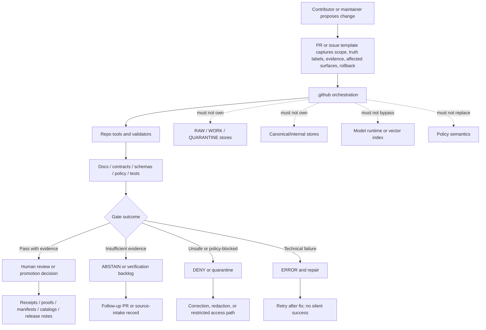

<!-- [KFM_META_BLOCK_V2]
doc_id: kfm://doc/TODO-verify-uuid--github-control-surface-readme
title: GitHub Control Surface
type: standard
version: v1
status: draft
owners: TODO-verify-owner-or-codeowners
created: TODO-verify-created-date
updated: 2026-04-22
policy_label: TODO-verify-public-or-restricted
related: [../README.md, ../docs/README.md, ../docs/standards/README.md, ../contracts/README.md, ../schemas/README.md, ../policy/README.md, ../tests/README.md, ../tools/README.md, ../data/README.md, ./CODEOWNERS, ./PULL_REQUEST_TEMPLATE.md, ./workflows/README.md]
tags: [kfm, github, ci, governance, documentation, readme, control-surface]
notes: [Draft-ready .github/README.md revision. Current repository inventory, workflow YAML, branch protection, owners, policy label, link validity, and platform settings remain NEEDS_VERIFICATION until checked in the mounted repository.]
[/KFM_META_BLOCK_V2] -->

<a id="top"></a>

# GitHub Control Surface

<p align="center">
  <strong>Contribution intake, review routing, and CI orchestration for KFM — without turning <code>.github/</code> into the source of truth.</strong>
</p>

<p align="center">
  
  
  
  
  
</p>

<p align="center">
  <a href="#read-this-first">Read first</a> ·
  <a href="#scope">Scope</a> ·
  <a href="#repo-fit">Repo fit</a> ·
  <a href="#accepted-inputs">Inputs</a> ·
  <a href="#exclusions">Exclusions</a> ·
  <a href="#operating-model">Operating model</a> ·
  <a href="#validation">Validation</a> ·
  <a href="#definition-of-done">Definition of Done</a> ·
  <a href="#appendix">Appendix</a>
</p>

---

## Read this first

> [!IMPORTANT]
> This README is **repo-ready guidance**, not proof of active GitHub enforcement. Treat workflow names, owners, badges, branch-protection claims, and platform settings as `NEEDS_VERIFICATION` until they are checked against the current repository and GitHub settings.

| Field | Value |
|---|---|
| Status | `draft` |
| Intended path | `.github/README.md` |
| Owners | `TODO-verify-owner-or-codeowners` |
| Evidence mode | `CORPUS_ONLY` / `NO_REPO_EVIDENCE` until a mounted checkout is inspected |
| Authority class | GitHub-native operational control surface |
| Policy label | `TODO-verify-public-or-restricted` |
| Truth posture | `CONFIRMED` target purpose · `PROPOSED` directory contract · `UNKNOWN` active workflow/platform state |
| Public posture | Cite-or-abstain; fail closed where rights, sensitivity, release state, or source terms are unresolved |

| What this document does | What it does not do |
|---|---|
| Defines how `.github/` should support contribution intake, review routing, and CI orchestration. | Does not prove current workflows, required checks, branch protection, owners, or repository settings. |
| Keeps GitHub automation subordinate to KFM evidence, policy, contracts, tests, and release objects. | Does not define canonical schemas, policy semantics, source authority, runtime behavior, or publication approval. |
| Gives maintainers a verification map, change playbook, and definition of done. | Does not authorize public release, direct model access, raw-data exposure, or promotion by file move. |

<p align="right"><a href="#top">Back to top ↑</a></p>

---

## Scope

`.github/` is KFM’s GitHub-native control surface. It may contain contribution templates, issue templates, workflow orchestration, ownership routing, dependency automation, and small GitHub-specific configuration.

In KFM terms, this directory helps make review and delivery expectations visible at the repository edge. It does **not** own the truth path, canonical object definitions, source authority, runtime policy decisions, or published evidence.

### This surface should make it easy to answer

- Which GitHub-facing files route contribution, review, and automation?
- Which checks are expected to run before a PR can support stronger claims?
- Which evidence, truth labels, affected surfaces, and rollback notes belong in PR intake?
- Which claims remain `UNKNOWN` until workflow YAML, branch rules, emitted artifacts, and platform settings are inspected?

> [!WARNING]
> A workflow file is not enforcement proof. Required checks, branch protection, deployment approvals, repository permissions, Actions settings, secrets, and environment rules must be verified from current platform evidence before they are described as active controls.

<p align="right"><a href="#top">Back to top ↑</a></p>

---

## Repo fit

`.github/` is a routing and orchestration layer beside the KFM trust system. It should point to the surfaces that own meaning, validation, policy, and release evidence instead of duplicating them.

| Relationship | Target path | Current status | Role |
|---|---|---:|---|
| Upstream landing | `../README.md` | `NEEDS_VERIFICATION` | Root identity and orientation. |
| Documentation standards | `../docs/README.md`, `../docs/standards/README.md` | `NEEDS_VERIFICATION` | Markdown, README, and governance documentation standards. |
| Machine meaning | `../contracts/README.md`, `../schemas/README.md` | `NEEDS_VERIFICATION` | Contract and schema homes; `.github/` must not duplicate these. |
| Policy and release gates | `../policy/README.md` | `NEEDS_VERIFICATION` | Policy rules and release admissibility. Workflows may call checks; they do not own policy semantics. |
| Tests and fixtures | `../tests/README.md` | `NEEDS_VERIFICATION` | Executable verification and fixture evidence. |
| Tooling | `../tools/README.md` | `NEEDS_VERIFICATION` | Scripts and validators that workflows should invoke rather than reimplement inline. |
| Evidence lifecycle | `../data/README.md`, `../release/` | `NEEDS_VERIFICATION` | Receipts, proofs, manifests, catalogs, review records, release bundles, and rollback references. |
| Local GitHub files | `./CODEOWNERS`, `./PULL_REQUEST_TEMPLATE.md`, `./workflows/README.md` | `NEEDS_VERIFICATION` | Ownership routing, PR intake, and workflow documentation. |

### Boundary contract

| `.github/` may coordinate | Source of meaning remains outside `.github/` |
|---|---|
| Run docs lint, schema checks, policy tests, fixtures, release dry runs, and dependency checks. | `docs/`, `contracts/`, `schemas/`, `policy/`, `tools/`, `tests/`, `data/`, and `release/`. |
| Ask contributors for truth labels, evidence links, affected surfaces, and rollback notes. | The underlying EvidenceBundle, DecisionEnvelope, receipts, proofs, manifests, review records, and correction lineage. |
| Route review using CODEOWNERS and templates. | Actual owner records, steward responsibilities, branch protection, and separation-of-duty policy. |
| Upload or report generated artifacts when workflows allow it. | The canonical lifecycle and release process that determines whether artifacts are admissible or publishable. |

<p align="right"><a href="#top">Back to top ↑</a></p>

---

## Accepted inputs

Accepted inputs for `.github/` are GitHub-specific configuration and lightweight orchestration files.

| Input family | Belongs here when… | Must stay linked to… |
|---|---|---|
| Workflow YAML | It orchestrates repo checks, builds, docs linting, fixtures, or release dry runs. | Repo tools, tests, policies, schemas, contracts, and release docs. |
| Workflow README files | They explain purpose, trigger conditions, permissions, artifacts, and failure behavior. | This README and the validators or artifacts the workflows invoke. |
| Pull request template | It collects truth labels, affected surfaces, evidence links, rollback notes, and open verification items. | Documentation, schema, policy, testing, and release standards. |
| Issue templates | They route bugs, docs drift, source intake, policy gaps, release problems, and security-sensitive reports without collapsing them into one queue. | Documentation control plane, source registry, and domain-lane owners. |
| `CODEOWNERS` | It routes review for repository paths and sensitive control surfaces. | Verified owners, steward review rules, and branch protection settings. |
| Dependency automation | It proposes dependency changes while preserving review, test, and policy gates. | Package manager evidence, lockfiles, security posture, and CI. |
| Linter configuration | It configures GitHub-facing checks or delegates to repo tooling. | Markdown/doc standards, fixtures, and validator tests. |

### Good `.github/` files are thin

They should answer **when** and **why** GitHub calls a check. The check itself should live where it can be run locally, tested, reviewed, and reused.

```text
.github/workflows/*.yml  ->  orchestrates
../tools/**              ->  implements reusable validation
../tests/**              ->  proves behavior with fixtures
../policy/**             ->  owns policy semantics
../contracts/**          ->  owns interface contracts, if repo convention confirms
../schemas/**            ->  owns machine schemas, if repo convention confirms
```

<p align="right"><a href="#top">Back to top ↑</a></p>

---

## Exclusions

`.github/` must not become a convenient dumping ground for KFM truth, policy, runtime logic, data, or proof artifacts.

| Do not put here | Use instead | Why |
|---|---|---|
| Canonical schemas or contract definitions | `../contracts/` or `../schemas/` after schema-home ADR is settled | Prevents machine-contract drift. |
| Policy semantics, rights rules, or sensitivity logic | `../policy/` | Workflows may run policy checks; they do not define policy truth. |
| Validators, scripts, or complex CI logic | `../tools/` and `../tests/` | Keeps YAML thin, testable, and reviewable. |
| RAW, WORK, QUARANTINE, processed datasets, or published artifacts | `../data/` lifecycle surfaces | Preserves KFM lifecycle boundaries. |
| Receipts, proofs, manifests, catalogs, review records, or release bundles | `../data/receipts/`, `../data/proofs/`, `../data/manifests/`, `../data/catalog/`, `../release/` as repo conventions confirm | GitHub may emit or upload artifacts; it does not own evidence objects. |
| Secrets, credentials, access tokens, model endpoints, or private service URLs | Repository/environment secrets and deployment docs | Prevents accidental exposure. |
| Runtime API, UI, MapLibre, or model-adapter code | `../apps/`, `../packages/`, or repo-native runtime homes | `.github/` is orchestration, not application implementation. |
| Branch protection claims without settings evidence | Verification backlog or platform-state docs | Repository settings are not fully represented by checked-in files. |
| Direct public path to model runtime, vector index, or unpublished candidate data | Governed API after evidence and policy checks | Preserves the trust membrane. |

> [!CAUTION]
> A workflow that publishes without EvidenceBundle closure, policy decision, release manifest, rollback reference, and required review state is not a KFM promotion path. It is an unsafe shortcut.

<p align="right"><a href="#top">Back to top ↑</a></p>

---

## Directory map

Current `.github/` contents were **not** available in the workspace used to draft this file. Treat the tree below as a verification map, not an inventory claim.

```text
.github/
├── README.md                         # this file
├── CODEOWNERS                        # NEEDS_VERIFICATION
├── PULL_REQUEST_TEMPLATE.md          # NEEDS_VERIFICATION
├── ISSUE_TEMPLATE/                   # NEEDS_VERIFICATION
│   ├── bug_report.md                 # NEEDS_VERIFICATION
│   ├── documentation_drift.md        # PROPOSED pattern
│   ├── source_intake.md              # PROPOSED pattern
│   └── policy_or_release_gap.md      # PROPOSED pattern
├── workflows/                        # NEEDS_VERIFICATION
│   ├── README.md                     # NEEDS_VERIFICATION
│   ├── docs-lint.yml                 # NEEDS_VERIFICATION
│   ├── contracts.yml                 # NEEDS_VERIFICATION
│   ├── policy.yml                    # NEEDS_VERIFICATION
│   ├── tests.yml                     # NEEDS_VERIFICATION
│   └── release-dry-run.yml           # PROPOSED pattern
├── dependabot.yml                    # NEEDS_VERIFICATION
└── linters/                          # NEEDS_VERIFICATION
    ├── markdownlint.json             # NEEDS_VERIFICATION
    └── mlc.config.json               # NEEDS_VERIFICATION
```

> [!TIP]
> After the real repository is mounted, replace this verification map with an inventory generated from the checkout.

```bash
# Read-only inventory. Run from repository root after mounting the real checkout.
find .github -maxdepth 3 -type f | sort
```

<p align="right"><a href="#top">Back to top ↑</a></p>

---

## Operating model

`.github/` should make KFM governance executable without pretending that GitHub automation is the governance system.


```mermaid
flowchart TD
    A[Contributor or maintainer proposes change] --> B[PR or issue template captures scope, truth labels, evidence, affected surfaces, rollback]
    B --> C[.github orchestration]
    C --> D[Repo tools and validators]
    D --> E[Docs / contracts / schemas / policy / tests]
    E --> F{Gate outcome}

    F -->|Pass with evidence| G[Human review or promotion decision]
    F -->|Insufficient evidence| H[ABSTAIN or verification backlog]
    F -->|Unsafe or policy-blocked| I[DENY or quarantine]
    F -->|Technical failure| J[ERROR and repair]

    G --> K[Receipts / proofs / manifests / catalogs / release notes]
    H --> L[Follow-up PR or source-intake record]
    I --> M[Correction, redaction, or restricted access path]
    J --> N[Retry after fix; no silent success]

    C -. must not own .-> RAW[RAW / WORK / QUARANTINE stores]
    C -. must not own .-> CANON[Canonical/internal stores]
    C -. must not bypass .-> MODEL[Model runtime or vector index]
    C -. must not replace .-> POLICY[Policy semantics]
```

### State discipline

| State | Meaning for `.github/` |
|---|---|
| `ANSWER` | A workflow or review path produced evidence-backed, policy-safe output. |
| `ABSTAIN` | Evidence is insufficient; the repo should request clarification or keep the claim out of publication. |
| `DENY` | Policy, rights, sensitivity, access, source terms, or exposure risk blocks the action. |
| `ERROR` | A technical failure prevents reliable interpretation; do not convert it into success. |

<p align="right"><a href="#top">Back to top ↑</a></p>

---

## Change playbook

When editing `.github/`, use the smallest reversible change that preserves KFM’s evidence-first posture.

### Change routing

| Change type | Before merge, verify… | Review emphasis |
|---|---|---|
| Workflow trigger change | The event is intentional and cannot publish or expose restricted material by accident. | Least privilege, no surprise release path, clear failure mode. |
| New workflow | It delegates substantive logic to repo tools/tests and records outputs where KFM expects them. | Thin YAML, deterministic inputs, clear artifacts. |
| Template change | It collects enough evidence without becoming noisy or performative. | Truth labels, affected surfaces, rollback, open verification. |
| `CODEOWNERS` change | Owners are current and match the review burden of affected surfaces. | Separation of duty for policy-significant paths. |
| Dependency automation | Updates remain reviewable and cannot bypass tests or policy. | Supply-chain posture, package-manager evidence, lockfile behavior. |
| Linter/config change | Rules are documented and validated with fixtures where practical. | Avoid style-only churn; prefer trust and maintainability checks. |
| Release-adjacent change | Promotion remains a governed state transition and proof objects stay distinct. | No file-move promotion; preserve receipts, manifests, review, correction, and rollback. |

### PR evidence prompts

A `.github/` PR should answer:

1. What surface does this change govern?
2. What evidence was inspected?
3. Which claims are `CONFIRMED`, `PROPOSED`, `UNKNOWN`, `NEEDS_VERIFICATION`, or `CONFLICTED`?
4. Which downstream docs, schemas, policies, tests, runbooks, release objects, or UI/API contracts are affected?
5. Could this change expose secrets, exact sensitive locations, unpublished candidate data, model endpoints, or raw lifecycle stores?
6. What is the rollback path?
7. What should not be inferred from this change?

<p align="right"><a href="#top">Back to top ↑</a></p>

---

## Workflow standards

A workflow should be legible enough that a maintainer can tell what it is allowed to touch before reading a script.

### Minimum workflow description

Each workflow README or inline header should document:

| Required item | Why it matters |
|---|---|
| Purpose | Prevents generic CI from drifting into policy-significant behavior. |
| Trigger | Shows when the workflow runs and whether it can fire on untrusted input. |
| Permissions | Makes least privilege reviewable. |
| Inputs | Identifies what the workflow can inspect or mutate. |
| Delegated tools/tests | Keeps executable logic out of YAML when practical. |
| Expected artifacts | Defines receipts, reports, logs, or summaries without conflating them. |
| Failure behavior | Preserves `ABSTAIN`, `DENY`, and `ERROR` as meaningful outcomes. |
| Rollback | Gives maintainers a safe path if the workflow misroutes review or blocks delivery. |

### Permission posture

```yaml
# Illustrative only — NEEDS_VERIFICATION against repo conventions.
# Prefer explicit least-privilege permissions per workflow.
permissions:
  contents: read
```

> [!WARNING]
> `pull_request_target`, write permissions, artifact upload, deployment triggers, and secret access require heightened review. They can cross the trust membrane if used casually.

<p align="right"><a href="#top">Back to top ↑</a></p>

---

## Validation

Use these read-only checks before changing `.github/`. They prove only what they inspect in the current checkout.

```bash
# Confirm repository state.
git status --short
git branch --show-current

# Inventory GitHub control-surface files.
find .github -maxdepth 3 -type f | sort

# Inventory workflow YAML only.
find .github/workflows -maxdepth 1 -type f \( -name '*.yml' -o -name '*.yaml' \) -print | sort

# Inspect workflow permissions and risky triggers.
grep -RInE '^(permissions:|[[:space:]]+permissions:|on:|[[:space:]]+pull_request_target:|[[:space:]]+workflow_run:|[[:space:]]+deployment:|[[:space:]]+id-token:|[[:space:]]+secrets:)' .github/workflows 2>/dev/null || true

# Look for KFM trust-surface vocabulary in GitHub-facing files.
grep -RInE \
  'EvidenceBundle|EvidenceRef|DecisionEnvelope|ReleaseManifest|CatalogMatrix|run_receipt|ai_receipt|proof pack|ABSTAIN|DENY|ERROR|ANSWER|RAW|WORK|QUARANTINE|PUBLISHED|trust membrane|cite-or-abstain' \
  .github docs contracts schemas policy tests tools 2>/dev/null || true
```

### What these commands do not prove

They do not prove branch protection, required checks, Actions permissions in repository settings, environment approvals, secret configuration, deployment posture, runtime behavior, owner freshness, or emitted proof-object validity.

### Validation matrix

| Check | Evidence needed before stronger claim |
|---|---|
| Active workflow list | Direct `.github/workflows/*.yml` inspection from current checkout. |
| Required status checks | Platform settings export, screenshot, API response, or maintainer-recorded settings evidence. |
| `CODEOWNERS` enforcement | Current `CODEOWNERS` file plus branch protection requiring code-owner review. |
| Policy enforcement | Policy files, policy tests, tool versions, workflow logs, and failure fixtures. |
| Release dry run | Generated receipts/proofs/manifests and release dry-run logs. |
| Security posture | Workflow permissions, Actions settings, secret handling, dependency automation, and deployment docs. |

<p align="right"><a href="#top">Back to top ↑</a></p>

---

## Template expectations

Templates should guide contributors toward evidence, not paperwork.

### Pull request template should collect

- Change summary.
- Affected surfaces.
- Truth labels.
- Evidence inspected.
- Links to receipts, proof packs, fixtures, or validation reports when available.
- Policy, rights, sensitivity, and public-release impact.
- Rollback or correction path.
- Remaining `UNKNOWN` / `NEEDS_VERIFICATION` items.

### Issue templates should separate queues

| Template | Use when… | Must avoid… |
|---|---|---|
| Bug report | Behavior differs from expected behavior or documented contract. | Turning uncertain source facts into confirmed bug claims. |
| Documentation drift | Docs, schemas, policy, fixtures, or implementation appear out of sync. | Silently rewriting doctrine without an evidence basis. |
| Source intake | A source, endpoint, dataset, license, or authority role needs evaluation. | Activating live ingestion before source terms and release posture are known. |
| Policy or release gap | A release path, sensitivity rule, rights rule, or rollback path is unclear. | Publishing around the gap. |
| Security-sensitive report | A workflow, secret, token, private endpoint, exposure path, or exact sensitive geometry may be exposed. | Posting secrets or sensitive location details in public issue text. |

> [!CAUTION]
> Security-sensitive, archaeology, rare-species, living-person, DNA/genomics, private landowner, critical infrastructure, private endpoint, and credential issues should fail closed and route to restricted review until publication safety is established.

<p align="right"><a href="#top">Back to top ↑</a></p>

---

## Security and exposure guardrails

KFM may be locally hosted and exposed through a home firewall, reverse proxy, or VPN for trusted third-party access. `.github/` should support that posture by keeping automation least-privileged and auditable.

| Guardrail | `.github/` implication |
|---|---|
| Deny by default | Do not grant broad workflow permissions without a verified need. |
| Least privilege | Prefer explicit workflow `permissions:` blocks. |
| No secret leakage | Never commit secrets, tokens, model endpoints, private service URLs, or sensitive coordinates. |
| No direct model path | Do not create workflows or templates that encourage public clients to talk directly to model runtimes. |
| No raw lifecycle exposure | Do not create normal public paths to RAW, WORK, QUARANTINE, canonical/internal stores, or unpublished candidate data. |
| Auditable boundaries | Preserve logs, receipts, reports, and review records where the workflow is policy-significant. |
| Reversible change | Every workflow/template/ownership change needs rollback instructions. |

<p align="right"><a href="#top">Back to top ↑</a></p>

---

## Rollback and correction

For `.github/` changes, rollback is usually a repository configuration or file revert. For release-adjacent changes, rollback also needs object-level correction context.

| Change | Minimum rollback path |
|---|---|
| Workflow YAML | Revert the workflow file or disable the workflow; document any affected checks or blocked PRs. |
| Trigger or permission change | Restore prior trigger/permission set; check whether any workflow ran with unintended authority. |
| PR/issue template | Revert the template and note any PRs/issues created under the changed intake format. |
| `CODEOWNERS` | Restore prior owner routing and verify pending reviews are not orphaned. |
| Dependency automation | Disable or revert configuration; inspect opened PRs for unintended update scope. |
| Release-adjacent workflow | Revert workflow and preserve any generated receipts, proofs, manifests, review artifacts, correction notices, and rollback references for audit. |

> [!IMPORTANT]
> Rollback should not erase evidence. Preserve enough context to reconstruct what ran, what changed, what was blocked, what was published, and what correction path applies.

<p align="right"><a href="#top">Back to top ↑</a></p>

---

## Definition of Done

A `.github/` change is done enough to support stronger claims only when the checked items below are true in the active repository.

- [ ] Metadata block has a real `doc_id`, verified owner, verified dates, verified policy label, and valid related paths.
- [ ] `.github/` inventory is generated from the current checkout and reflected in [Directory map](#directory-map).
- [ ] `CODEOWNERS` coverage is verified for `.github/`, workflows, policy-significant templates, and release-adjacent files.
- [ ] Each workflow has a documented purpose, trigger, permissions posture, expected artifacts, and failure behavior.
- [ ] Workflow YAML delegates substantive validation to `tools/`, `tests/`, `policy/`, `contracts/`, or `schemas/` instead of embedding complex logic inline.
- [ ] PR and issue templates collect truth posture, evidence basis, affected surfaces, rollback path, and open verification items.
- [ ] Required checks and branch protection claims are backed by direct platform evidence or explicitly labeled `NEEDS_VERIFICATION`.
- [ ] Secrets, credentials, model endpoints, private service URLs, and restricted geometry are absent from checked-in GitHub configuration.
- [ ] Documentation linting checks KFM Meta Block V2, H1 count, quick jumps, relative paths, and placeholder leakage where repo tooling supports it.
- [ ] Release-adjacent workflows preserve receipts, proofs, manifests, catalog records, review artifacts, correction lineage, and rollback references rather than replacing them.
- [ ] No workflow creates a normal public path to RAW, WORK, QUARANTINE, canonical/internal stores, vector indexes, model runtimes, or unpublished candidate data.
- [ ] Rollback is documented for every new workflow, template, or ownership-routing change.

<p align="right"><a href="#top">Back to top ↑</a></p>

---

## FAQ

<details>
<summary>Is <code>.github/</code> part of the KFM trust model?</summary>

Yes, but as an orchestration and review-routing surface. It can make governance visible and testable, but it does not own canonical truth, policy semantics, source authority, or release evidence.

</details>

<details>
<summary>Can workflow YAML define KFM policy?</summary>

No. Workflow YAML may call policy checks and fail a build. Policy meaning belongs in the policy surface and its linked tests, fixtures, and review records.

</details>

<details>
<summary>Can a passing workflow publish a KFM artifact?</summary>

Not by itself. Publication requires the governed release path: validation, policy checks, review state where required, provenance, proof objects, release manifest, correction/rollback context, and the promotion gate verified by the repository.

</details>

<details>
<summary>Should <code>.github/</code> contain reusable scripts?</summary>

Only tiny GitHub-specific glue should live here. Reusable validation, linting, schema, policy, source, or release logic belongs in repo tooling and test directories so it can be run locally and reviewed independently.

</details>

<details>
<summary>Can `.github/` include badge images?</summary>

Yes, when badges are static status/orientation labels or their targets are verified. Do not add fake CI, coverage, deployment, owner, security, or release badges.

</details>

<p align="right"><a href="#top">Back to top ↑</a></p>

---

## Appendix

<details open>
<summary><strong>A. Verification backlog</strong></summary>

| Item | Why it matters | Suggested evidence |
|---|---|---|
| Actual `.github/` inventory | Prevents invented workflow/template claims. | `find .github -maxdepth 3 -type f \| sort` from mounted repo. |
| Workflow YAML list | Needed before naming active CI gates. | Direct `.github/workflows/*.yml` inspection. |
| Workflow permissions | Prevents over-privileged automation. | YAML `permissions:` blocks and repository Actions settings. |
| Branch protection / required checks | Cannot be proven from README text alone. | Platform settings export, screenshot, API response, or maintainer-confirmed settings record. |
| `CODEOWNERS` coverage | Review routing is policy-significant. | Current `CODEOWNERS` file plus branch protection requiring code-owner review. |
| KFM Meta Block validation | Required for standard docs. | Docs validator output and fixture tests. |
| Schema home | Prevents `contracts/` vs `schemas/` drift. | ADR plus object map. |
| Policy toolchain | Needed before claiming OPA/Conftest/Rego enforcement. | Tool versions, workflow logs, and policy tests. |
| Release artifact storage | Needed before describing receipts/proofs/manifests as emitted. | Generated artifacts, manifests, proof bundles, or release dry-run logs. |
| Local exposure posture | KFM may be locally hosted and exposed through trusted access paths. | Deployment docs, reverse proxy/VPN config, secret handling, CORS, auth, logs, and network boundary evidence. |

</details>

<details>
<summary><strong>B. Suggested first verification pass</strong></summary>

```bash
# Run from the mounted repository root. Read-only.
printf 'repo=%s\nbranch=%s\n' "$(git rev-parse --show-toplevel 2>/dev/null || echo UNKNOWN)" "$(git branch --show-current 2>/dev/null || echo UNKNOWN)"
find .github -maxdepth 3 -type f | sort
find .github/workflows -maxdepth 1 -type f \( -name '*.yml' -o -name '*.yaml' \) -print | sort
[ -f .github/CODEOWNERS ] && sed -n '1,200p' .github/CODEOWNERS || true
[ -f .github/PULL_REQUEST_TEMPLATE.md ] && sed -n '1,220p' .github/PULL_REQUEST_TEMPLATE.md || true
```

</details>

<details>
<summary><strong>C. Glossary</strong></summary>

| Term | Meaning in this README |
|---|---|
| GitHub control surface | Files under `.github/` that route GitHub contribution, review, automation, and repository-facing configuration. |
| Orchestration | Calling tools, tests, and validators in the right order without moving policy or object truth into YAML. |
| Proof object | A release- or verification-facing artifact such as a receipt, proof, manifest, catalog record, or review record. |
| Trust membrane | KFM’s boundary preventing public clients, UI surfaces, and model runtimes from bypassing governed evidence and policy flow. |
| Cite-or-abstain | The posture that consequential claims should resolve to evidence or decline to answer. |
| Finite outcome | A bounded result such as `ANSWER`, `ABSTAIN`, `DENY`, or `ERROR`, rather than an ambiguous free-form state. |
| Promotion | A governed state transition with validation, policy, review, provenance, release, correction, and rollback context; not a file move. |

</details>

<p align="right"><a href="#top">Back to top ↑</a></p>
