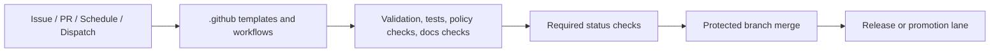

<!-- [KFM_META_BLOCK_V2]
doc_id: kfm://doc/4f0a4c1a-4f7e-4f5b-86d4-9b3b1c5c5c7a
title: .github/ — GitHub Automation and Merge Gates
type: standard
version: v1
status: draft
owners: KFM Platform Engineering (verify with CODEOWNERS)
created: 2026-03-03
updated: 2026-03-06
policy_label: public
related:
  - ".github/"
  - ".github/workflows/"
  - ".github/ISSUE_TEMPLATE/"
  - ".github/PULL_REQUEST_TEMPLATE.md"
tags: [kfm, github, cicd, governance]
notes:
  - Repo-side GitHub controls only.
  - Branch-specific claims stay UNKNOWN until verified on the current branch.
[/KFM_META_BLOCK_V2] -->

# `.github/`
Repo-side GitHub automation and contribution controls for how KFM changes are proposed, checked, reviewed, and merged.


## Impact

**Status:** draft  
**Owners:** KFM Platform Engineering (verify with `CODEOWNERS`)  
**Policy label:** public  
**Repo path:** `.github/`  
**Quick links:** [Purpose](#purpose) · [Where it fits](#where-it-fits) · [Reality check](#reality-check) · [Directory shape](#directory-shape) · [Change rules](#change-rules) · [Quickstart](#quickstart)

## Purpose

**CONFIRMED:** KFM treats CI, policy enforcement, and documentation as part of the governed system, not as repo decoration.

**CONFIRMED:** Merge checks are expected to protect policy, contracts, provenance, and documentation quality.

This directory is the repo-side GitHub control surface for that behavior.

## Where it fits

`.github/` is the repository control plane.

- **Upstream:** issues, pull requests, schedules, manual dispatches, and automation triggers
- **Downstream:** required checks, review routing, release or promotion workflows, and contribution guidance

**CONFIRMED:** KFM expects policy enforcement in CI and at runtime to agree on semantics.

**UNKNOWN:** the exact rulesets, required checks, environments, and workflow set on the current branch must be verified before they are documented as fact.

Branch protection, rulesets, environment protections, and organization-wide GitHub settings are outside the repository. This directory should support those controls, not pretend to replace them.


```mermaid
flowchart LR
  A[Issue / PR / Schedule / Dispatch] --> B[.github templates and workflows]
  B --> C[Validation, tests, policy checks, docs checks]
  C --> D[Required status checks]
  D --> E[Protected branch merge]
  E --> F[Release or promotion lane]
```

## Scope

This directory exists for GitHub-native repository controls only.

### What belongs here

**PROPOSED baseline:**

- GitHub Actions workflows in `.github/workflows/`
- reusable workflows and composite actions used by those workflows
- issue templates and pull request templates
- `CODEOWNERS`
- GitHub automation config such as Dependabot, labeler, or release-drafter files, if used

### What stays out

Do not use `.github/` for:

- secrets, tokens, or credentials
- application code
- data artifacts, catalogs, receipts, or generated outputs
- authoritative copies of policy bundles, schemas, or contracts
- long-form runbooks or architecture docs that belong under `docs/`

## Reality check

KFM uses three evidence labels:

- **CONFIRMED:** grounded in KFM manuals
- **UNKNOWN:** branch-specific and not yet verified
- **PROPOSED:** sensible default for this repo

For this directory, the main UNKNOWN is the current branch inventory. Do not claim a workflow, template, required check, or ownership rule exists until you verify it.

## Directory shape

**UNKNOWN:** the actual contents vary by branch.

**PROPOSED minimum shape:**

```text
.github/
├── README.md
├── CODEOWNERS                    # if used
├── PULL_REQUEST_TEMPLATE.md      # if used
├── ISSUE_TEMPLATE/               # if used
├── workflows/
│   └── *.yml
└── actions/                      # if used
```

## Change rules

Use these rules for any `.github/**` change.

1. Keep gates fail-closed. A governance check that can silently fail open is not a gate.
2. Keep permissions narrow. Every workflow should declare only the permissions it needs.
3. Keep required check names stable. Renames ripple into rulesets and merge requirements.
4. Update docs when behavior changes. If a workflow changes what gets enforced, this README and any related runbooks must change too.
5. Preserve separation of duty. Contributor paths and approval paths should not collapse into one unchecked step.
6. Prefer small, reversible edits. Workflow YAML is production code.

## Branch-specific verification

Before editing this README to describe the branch as it really exists, verify:

- current `.github/` file tree
- workflow names
- `permissions:` blocks
- whether status checks are actually merge-blocking
- whether `CODEOWNERS`, templates, reusable workflows, and composite actions are present

## Quickstart

Run this first:

```bash
find .github -maxdepth 3 -type f | sort
grep -RIn "^name:" .github/workflows || true
grep -RIn "^[[:space:]]*permissions:" .github/workflows || true
grep -RIn "concurrency:|timeout-minutes:|workflow_call:" .github/workflows || true
```

Then answer three questions before you document anything as real:

1. Which checks are actually required to merge?
2. Which workflows are blocking versus informational?
3. Which protections are enforced outside the repo?

## Definition of done for `.github/**` changes

- [ ] The change is necessary and tightly scoped.
- [ ] The change does not weaken policy, validation, or audit posture.
- [ ] Required checks still block merges as intended.
- [ ] `permissions:` is present and minimal.
- [ ] Any renamed workflow or job has a matching ruleset update.
- [ ] This README is accurate for the verified branch state.
- [ ] Reverting the change restores the prior gate.