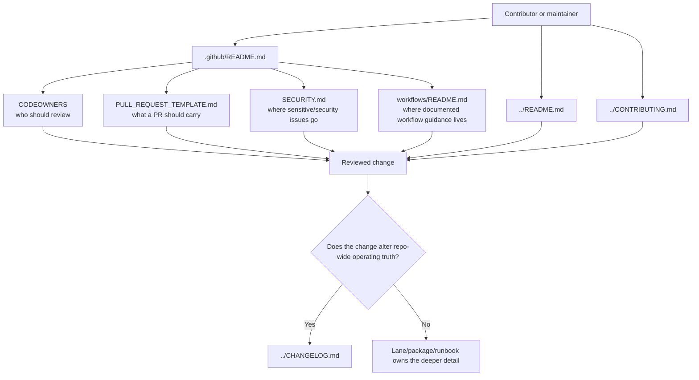

<!-- [KFM_META_BLOCK_V2]
doc_id: kfm://doc/NEEDS-VERIFICATION
title: .github — GitHub Community Health and Governed Collaboration
type: standard
version: v1
status: draft
owners: @bartytime4life (default CODEOWNERS owner) — area-specific ownership NEEDS VERIFICATION
created: YYYY-MM-DD
updated: YYYY-MM-DD
policy_label: TBD — verify
related: [../README.md, ../CONTRIBUTING.md, ../CHANGELOG.md, ./CODEOWNERS, ./PULL_REQUEST_TEMPLATE.md, ./SECURITY.md, ./workflows/README.md]
tags: [kfm, github, governance, contributor-experience, release-hygiene]
notes: [Inventory and cross-links below are grounded in repo-visible evidence from adjacent documentation, but the mounted repository tree, workflow YAML inventory, and active enforcement depth were not directly visible in the current session. Replace placeholders after direct repo verification.]
[/KFM_META_BLOCK_V2] -->

<a id="top"></a>

# `.github/` — GitHub Community Health and Governed Collaboration

Directory hub for contributor-facing governance, review, security, and workflow guidance in Kansas Frontier Matrix.

> [!NOTE]
> **Status:** experimental  
> **Owners:** `@bartytime4life` *(default CODEOWNERS owner; area-specific ownership **NEEDS VERIFICATION**)*  
>      
> **Quick jumps:** [Scope](#scope) · [Repo fit](#repo-fit) · [Accepted inputs](#accepted-inputs) · [Exclusions](#exclusions) · [Current verified snapshot](#current-verified-snapshot) · [Directory tree](#directory-tree) · [Quickstart](#quickstart) · [Usage](#usage) · [Diagram](#diagram) · [Task list](#task-list--definition-of-done) · [FAQ](#faq) · [Appendix](#appendix)  
> **Repo fit:** `.github/README.md` should route contributors toward `CODEOWNERS`, `PULL_REQUEST_TEMPLATE.md`, `SECURITY.md`, and `workflows/README.md`, while staying aligned with `../README.md`, `../CONTRIBUTING.md`, and `../CHANGELOG.md`.

> [!IMPORTANT]
> This directory is the repo’s **GitHub-facing collaboration surface**. It should help a contributor answer four questions quickly: **where to start, who should review, how evidence should travel through pull requests, and where sensitive/security issues belong**.

> [!WARNING]
> Current-session evidence confirms the **adjacent `.github/` documentation surface**, but does **not** directly verify live workflow YAML coverage, branch protection settings, or merge-blocking automation depth. Keep any implementation-specific CI claim marked **NEEDS VERIFICATION** until the mounted repository is inspected directly.

## Scope

This directory groups the GitHub-facing materials that shape how KFM is reviewed, routed, and maintained in public or maintainer-visible collaboration flows.

Use this directory to keep contributor entry points:

- easy to scan
- structurally consistent with KFM governance language
- explicit about what is confirmed versus what still needs verification
- connected to adjacent review, release, and security surfaces

In KFM terms, this directory is not just convenience chrome. It is part of the project’s **trust-visible collaboration layer**: the place where contributor expectations, review routing, security reporting, and workflow-facing guidance should remain legible instead of implied.

[Back to top](#top)

## Repo fit

| Field | Value |
| --- | --- |
| **Path** | `.github/README.md` |
| **Primary role** | Directory README for GitHub-facing community-health, review-routing, security, and workflow guidance |
| **Upstream docs** | [`../README.md`](../README.md), [`../CONTRIBUTING.md`](../CONTRIBUTING.md), [`../CHANGELOG.md`](../CHANGELOG.md) |
| **Downstream docs** | [`./CODEOWNERS`](./CODEOWNERS), [`./PULL_REQUEST_TEMPLATE.md`](./PULL_REQUEST_TEMPLATE.md), [`./SECURITY.md`](./SECURITY.md), [`./workflows/README.md`](./workflows/README.md) |
| **Trust posture** | Contributor-facing guidance should support KFM’s evidence-first, correction-visible, and no-hidden-approval posture |
| **Current evidence limit** | File inventory is grounded in repo-visible evidence; mounted repo internals and workflow enforcement depth remain **NEEDS VERIFICATION** |

### Why this directory matters in KFM

KFM’s central doctrine treats public and maintainer-visible output as governed, evidence-bearing surfaces rather than casual convenience layers. This directory should mirror that posture at the contributor boundary:

- review expectations should be visible
- ownership should be routable
- security reporting should have a clear home
- workflow-facing guidance should be documented without bluffing about enforcement
- release-facing contributor docs should stay consistent with correction and evidence discipline elsewhere in the repo

[Back to top](#top)

## Accepted inputs

Place material here when it is primarily about **GitHub-facing repo collaboration** and belongs in the `.github/` subtree.

Examples that fit here:

- directory-level guidance for how `.github/` is organized
- contributor-routing notes that explain where review, security, and workflow docs live
- guidance about how GitHub-facing files relate to root docs like `README.md`, `CONTRIBUTING.md`, and `CHANGELOG.md`
- maintenance notes for this subtree when inventory, ownership, or routing logic changes
- high-level workflow documentation index material that belongs in `./workflows/README.md`
- evidence-aware notes about pull-request expectations when those expectations are owned by `.github/` files

## Exclusions

Do **not** place the following here:

- domain-specific architecture manuals, source atlases, or lane runbooks
- deep CI implementation notes that belong in workflow files or a dedicated workflow README
- speculative repo-state claims about active enforcement, branch protection, or automation depth
- release history itself → use [`../CHANGELOG.md`](../CHANGELOG.md)
- general contribution policy that properly belongs in [`../CONTRIBUTING.md`](../CONTRIBUTING.md)
- security triage doctrine or vulnerability deep dives that belong in a security lane rather than the `.github/` subtree
- scratch notes, temporary checklists, or roadmap fragments with no durable `.github/` consequence

[Back to top](#top)

## Current verified snapshot

The current repo-grounded evidence that could be confirmed from adjacent documentation is small but useful.

| Item | Verified state | How this README should treat it |
| --- | --- | --- |
| `../README.md` | present in repo-grounded evidence | root entry point for repo orientation |
| `../CONTRIBUTING.md` | present in repo-grounded evidence | contributor-facing operating guidance |
| `../CHANGELOG.md` | present in repo-grounded evidence | release-memory and correction-facing history ledger |
| `.github/README.md` | present in repo-grounded evidence | this directory hub |
| `.github/CODEOWNERS` | present in repo-grounded evidence | ownership and reviewer-routing surface |
| `.github/PULL_REQUEST_TEMPLATE.md` | present in repo-grounded evidence | PR-facing review/evidence checklist surface |
| `.github/SECURITY.md` | present in repo-grounded evidence | security reporting/disclosure surface |
| `.github/workflows/README.md` | present in repo-grounded evidence | human-facing workflow index / explanation surface |

That means this README should prioritize **structure, routing, and local conventions** over claims about mature implementation depth.

## Directory tree

```text
.
├── CHANGELOG.md
├── README.md
├── CONTRIBUTING.md
└── .github/
    ├── README.md
    ├── CODEOWNERS
    ├── PULL_REQUEST_TEMPLATE.md
    ├── SECURITY.md
    └── workflows/
        └── README.md
```

> [!TIP]
> Keep this file focused on **routing and local conventions**. It should point a contributor toward the right trust-bearing file fast, not duplicate the full content of `CONTRIBUTING.md`, `SECURITY.md`, or workflow-specific guidance.

[Back to top](#top)

## Quickstart

### For contributors

1. Start with [`../README.md`](../README.md) for project orientation.
2. Read [`../CONTRIBUTING.md`](../CONTRIBUTING.md) before changing code, docs, contracts, or data-facing behavior.
3. Use this file to find the right `.github/` surface for your task.
4. Check [`./CODEOWNERS`](./CODEOWNERS) to understand reviewer routing and ownership expectations.
5. Use [`./PULL_REQUEST_TEMPLATE.md`](./PULL_REQUEST_TEMPLATE.md) when opening or updating a PR.
6. If your change affects security, disclosure, or exposure posture, route through [`./SECURITY.md`](./SECURITY.md).
7. If your question is “what checks or workflow docs should I look at?”, start with [`./workflows/README.md`](./workflows/README.md).

### For maintainers

When you change any GitHub-facing review or routing surface, update this README in the **same governed review stream**.

```md
If you change reviewer routing, update `.github/README.md` and `CODEOWNERS` together.
If you change PR evidence expectations, update `.github/README.md` and `PULL_REQUEST_TEMPLATE.md` together.
If you change security reporting or disclosure routing, update `.github/README.md` and `SECURITY.md` together.
If you change documented workflow behavior, update `.github/README.md` and `workflows/README.md` together.
If the contributor-facing meaning of the change is repository-wide, verify whether `../CHANGELOG.md` also needs an entry.
```

[Back to top](#top)

## Usage

### File-to-function matrix

| Path | Local job | Practical use |
| --- | --- | --- |
| [`./README.md`](./README.md) | subtree hub | explains what belongs in `.github/`, what does not, and how to navigate the subtree |
| [`./CODEOWNERS`](./CODEOWNERS) | ownership surface | points contributors toward reviewer-routing and default ownership expectations |
| [`./PULL_REQUEST_TEMPLATE.md`](./PULL_REQUEST_TEMPLATE.md) | PR review surface | gives contributors the checklist or evidence framing expected at PR time |
| [`./SECURITY.md`](./SECURITY.md) | security reporting surface | routes security-sensitive or disclosure-sensitive work away from casual discussion |
| [`./workflows/README.md`](./workflows/README.md) | workflow-facing index | explains documented workflow surfaces without forcing contributors into raw YAML first |

### Update-together matrix

| If this changes… | Review these too | Why |
| --- | --- | --- |
| reviewer routing or ownership wording | `./CODEOWNERS`, `../CONTRIBUTING.md`, this file | ownership language should not drift across entry points |
| PR evidence/checklist expectations | `./PULL_REQUEST_TEMPLATE.md`, this file | contributor-facing review rules should stay synchronized |
| security disclosure path | `./SECURITY.md`, this file | sensitive routing must remain obvious and consistent |
| workflow-facing contributor guidance | `./workflows/README.md`, this file | human-facing workflow explanations should match the subtree hub |
| repo-wide release or correction meaning | `../CHANGELOG.md` | contributor-facing process changes sometimes also change repository operating truth |

### Status vocabulary used here

| Label | How to use it in this directory |
| --- | --- |
| **CONFIRMED** | Directly supported by visible repo-grounded evidence or attached KFM doctrine |
| **INFERRED** | Small structural completion strongly implied by file names, local patterns, or surrounding docs |
| **PROPOSED** | Recommended subtree behavior or future addition not yet directly verified in-tree |
| **UNKNOWN** | Not verified strongly enough in the current session |
| **NEEDS VERIFICATION** | Reviewer action required before the detail should be treated as settled repo fact |

### KFM-specific contributor posture

KFM’s broader doctrine matters here even in a GitHub-facing directory:

- do not imply implementation maturity that current evidence does not prove
- keep review and correction behavior visible instead of hidden
- route consequential changes through review-bearing files, not ad hoc side notes
- prefer evidence-aware wording over “probably already enforced” phrasing
- keep contributor entry points aligned with the project’s trust membrane and release discipline

[Back to top](#top)

## Diagram


```mermaid
flowchart TD
    A[Contributor or maintainer] --> B[.github/README.md]
    B --> C[CODEOWNERS<br/>who should review]
    B --> D[PULL_REQUEST_TEMPLATE.md<br/>what a PR should carry]
    B --> E[SECURITY.md<br/>where sensitive/security issues go]
    B --> F[workflows/README.md<br/>where documented workflow guidance lives]

    A --> G[../README.md]
    A --> H[../CONTRIBUTING.md]

    C --> I[Reviewed change]
    D --> I
    E --> I
    F --> I
    G --> I
    H --> I

    I --> J{Does the change alter repo-wide operating truth?}
    J -- Yes --> K[../CHANGELOG.md]
    J -- No --> L[Lane/package/runbook owns the deeper detail]
```

[Back to top](#top)

## Task list / definition of done

A good update to this file should satisfy the following:

- [ ] Top-of-file status, owners, badges, and quick jumps are present.
- [ ] Repo fit, accepted inputs, and exclusions remain explicit.
- [ ] The `.github/` inventory shown here still matches the mounted repository.
- [ ] Relative links resolve correctly.
- [ ] The mermaid diagram still reflects current routing.
- [ ] No sentence claims active CI enforcement, branch protection, or workflow wiring unless directly verified.
- [ ] Metadata placeholders (`doc_id`, dates, policy label, area-specific owners) are either verified or explicitly left reviewable.
- [ ] If ownership, PR expectations, workflow guidance, or security routing changed, the sibling file changed in the same PR.
- [ ] The file still feels like a `.github/` hub, not a duplicate of broader governance docs.

## FAQ

### Does this file prove that live merge-blocking CI is wired and enforced?

No. It documents the **GitHub-facing routing surface**. Active workflow enforcement, branch protection, and exact workflow inventory remain **NEEDS VERIFICATION** until the mounted repository and workflow files are directly inspected.

### Should workflow YAML behavior be documented here in detail?

Usually no. Keep detailed workflow explanation in [`./workflows/README.md`](./workflows/README.md) and the workflow files themselves. This README should stay concise and navigable.

### Is this the right place for domain-specific architecture or data-lane rules?

No. Domain-specific doctrine, data onboarding, and architectural depth belong in the owning lane, package, runbook, or root docs—not in `.github/`.

### When should `../CHANGELOG.md` also change?

When a change in this subtree materially alters repository-level contributor expectations, trust posture, release meaning, correction behavior, or public/maintainer-facing operating truth.

### Why are there placeholders in the meta block?

Because current-session evidence did not directly verify the live `.github/README.md` metadata, exact ownership resolution, or file history. KFM prefers visible placeholders over fabricated certainty.

[Back to top](#top)

## Appendix

<details>
<summary><strong>PROPOSED future additions after mounted repo verification</strong></summary>

These are **not** confirmed current `.github/` inventory items. They are reasonable next additions only if direct repo inspection shows they are missing and the project wants them.

| Candidate addition | Why it could help | Status |
| --- | --- | --- |
| `CODE_OF_CONDUCT` witness / enforcement contact | strengthens community-health clarity for outside contributors | **PROPOSED** |
| issue / label / triage guide | makes contributor routing faster and reduces noisy intake | **PROPOSED** |
| release-drafter or release-notes guidance | improves release hygiene if the repo actually uses it | **PROPOSED** |
| contributor environment / version matrix badges | useful if workflow surfaces and supported environments are directly verified | **PROPOSED** |
| `.github/` subtree registry table expansion | useful once more verified files exist in this directory | **PROPOSED** |

</details>

<details>
<summary><strong>Verification backlog for the next direct repo pass</strong></summary>

Before publishing this file as settled repo truth, verify:

1. Whether `.github/README.md` already exists and what strong material should be preserved.
2. Exact owners from the mounted `CODEOWNERS` file.
3. Whether `SECURITY.md`, `PULL_REQUEST_TEMPLATE.md`, and `workflows/README.md` match the routing described here.
4. Whether any additional `.github/` files belong in the verified tree.
5. Whether branch protection, required checks, or workflow enforcement should be described here at all.
6. Exact created/updated dates and final doc identifier.

</details>

[Back to top](#top)
