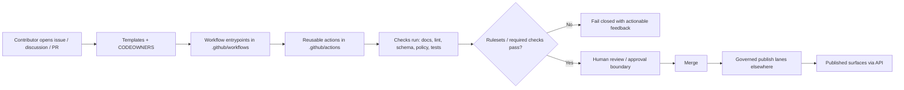

<!-- [KFM_META_BLOCK_V2]
doc_id: kfm://doc/github-readme-v1
title: .github
type: standard
version: v2
status: draft
owners: verify via /.github/CODEOWNERS
created: 2026-03-07
updated: 2026-03-07
policy_label: public
related: [/README.md, /.github/CODEOWNERS, /.github/workflows, /.github/actions, /.github/ISSUE_TEMPLATE, /.github/DISCUSSION_TEMPLATE, /.github/PULL_REQUEST_TEMPLATE, /.github/required-checks.v1.json, /policy, /tests, /docs, /CONTRIBUTING.md]
tags: [kfm, github, ci, governance, docs, workflows, codeowners]
notes: [Directory README for GitHub-side automation, templates, ownership routing, required-check synchronization, and merge discipline. Out-of-repo GitHub settings remain UNKNOWN until verified on the target branch.]
[/KFM_META_BLOCK_V2] -->

<a id="top"></a>

# `.github`
GitHub-native control plane for workflows, templates, ownership routing, required-check synchronization, and merge discipline.

> **Status:** draft  
> **Owners:** verify in [`./CODEOWNERS`](./CODEOWNERS)  
>       
> **Quick jump:** [Purpose](#purpose) · [Evidence posture](#evidence-posture) · [Repo fit](#repo-fit) · [Scope](#scope) · [Accepted inputs](#accepted-inputs) · [Exclusions](#exclusions) · [Verification boundary](#verification-boundary) · [Current snapshot](#current-control-plane-snapshot) · [Control-plane contract](#control-plane-contract) · [CI baseline](#ci-baseline) · [Automation safety](#automation-safety) · [Quickstart](#quickstart) · [Change discipline](#change-discipline) · [Definition of done](#definition-of-done) · [FAQ](#faq)

## Purpose

This directory is KFM’s **GitHub-side automation and collaboration surface**.

It holds the files that shape how work enters the repo, how reviewers are routed, how required checks are expressed, and how contributor-facing templates stay aligned with KFM’s evidence-first posture.

`.github/` should make governance **more visible**, not hide it. Workflows may trigger validation, docs checks, policy tests, schema checks, release preparation, and collaboration ergonomics, but they are **not** the source of truth for runtime policy, evidence resolution, publishable artifacts, or business logic.

Because KFM treats docs as a production surface, this README is part of the control plane. When GitHub-side behavior changes, the doc should usually change in the same PR.

## Evidence posture

### Truth labels used here

| Label | Meaning |
|---|---|
| **CONFIRMED** | Directly established by the supplied KFM source corpus or visible in the supplied directory draft. |
| **PROPOSED** | Recommended structure, workflow, or operating rule aligned to KFM but not verified as current live branch behavior. |
| **UNKNOWN** | Not established by the supplied evidence and requiring verification before being treated as branch truth. |

### Directory posture

| Status | Statement |
|---|---|
| **CONFIRMED** | `.github/` is the repo’s GitHub-facing control plane for workflows, templates, support files, and ownership routing. |
| **CONFIRMED** | Documentation is a governed surface; behavior changes here should usually update docs in the same change set. |
| **CONFIRMED** | KFM expects fail-closed checks, explicit review boundaries, and no hidden bypasses of policy, provenance, or evidence guarantees. |
| **PROPOSED** | `required-checks.v1.json` should be treated as a versioned contract surface and kept synchronized with workflow/job names and any out-of-repo rulesets. |
| **UNKNOWN** | Exact GitHub rulesets, branch protections, environment approvals, merge queue settings, and which checks currently block merge on the target branch. |

## Repo fit

**Path:** `/.github/README.md`

**Repo role:** directory guide for GitHub-native collaboration, routing, CI/CD ergonomics, and merge discipline.

| Direction | Surface | Why it matters |
|---|---|---|
| Upstream | [`../README.md`](../README.md) | Repo-root posture and public-facing project framing. |
| Upstream | `CONTRIBUTING.md`, `policy/`, `docs/`, `tests/` | Contribution expectations, runtime governance, operational docs, and test surfaces. |
| Upstream | GitHub rulesets / branch protections / environments | Some merge and release behavior lives outside the repo and must be verified separately. |
| Downstream | [`./workflows/`](./workflows/) | Workflow entrypoints and reusable workflow calls. |
| Downstream | [`./actions/`](./actions/) | Local composite actions and shared GitHub-side helpers. |
| Downstream | [`./ISSUE_TEMPLATE/`](./ISSUE_TEMPLATE/), [`./DISCUSSION_TEMPLATE/`](./DISCUSSION_TEMPLATE/), [`./PULL_REQUEST_TEMPLATE/`](./PULL_REQUEST_TEMPLATE/), [`./PULL_REQUEST_TEMPLATE.md`](./PULL_REQUEST_TEMPLATE.md) | Structured intake and review ergonomics. |
| Downstream | [`./CODEOWNERS`](./CODEOWNERS) | Ownership routing and review responsibility. |
| Downstream | [`./SUPPORT.md`](./SUPPORT.md), [`./CODE_OF_CONDUCT.md`](./CODE_OF_CONDUCT.md), `dependabot.yml`, `labeler.yml`, `required-checks.v1.json` | GitHub-facing support, automation, and versioned control-plane metadata. |

## Scope

Use this README for:

| Use | Why |
|---|---|
| Directory purpose and boundary | Keeps `.github/` from becoming a junk drawer. |
| Control-plane inventory | Makes workflows, actions, templates, and routing files visible. |
| Merge/publication distinction | Prevents people from treating a green PR as equivalent to governed publication. |
| Required-check synchronization | Keeps workflow/job names, manifests, and GitHub settings legible together. |
| Contributor expectations | Makes review artifacts and rollback expectations obvious for GitHub-side changes. |
| Verification notes | Keeps out-of-repo settings explicit instead of implied. |

Do **not** use this README for:

| Do not use it for | Where it belongs instead |
|---|---|
| Runtime business logic | `apps/` or `packages/` |
| Policy source of truth | `policy/` plus governed backend enforcement |
| API contracts and schema definitions | `contracts/` or `schemas/` |
| Dataset catalogs, manifests, provenance records, and run receipts | `data/` truth-path surfaces |
| Long-form runbooks and ADRs | `docs/` (for example `docs/runbooks/`, `docs/adr/` when present) |
| Secrets, credentials, machine-local configuration | GitHub secrets, a secret manager, or local environment files |
| Generated evidence bundles or promoted release artifacts | Governed artifact paths and published surfaces |

## Accepted inputs

The following belong in `.github/` when they are GitHub-facing and repo-governance relevant:

| Input | Examples | Why it belongs here |
|---|---|---|
| Workflow entrypoints | CI, docs lint, policy-gate, validation, package, release-prep workflows | They define GitHub-triggered automation. |
| Reusable local actions | Composite actions, setup wrappers, shared validation helpers | They keep repeated workflow logic centralized and reviewable. |
| Contribution templates | Issue forms, discussion prompts, PR templates | They shape better intake and better reviews. |
| Ownership and routing metadata | `CODEOWNERS`, reviewer routing helpers | They make accountability visible. |
| Repo-side governance manifests | `required-checks.v1.json`, label config, update automation config | They keep GitHub-side behavior inspectable in-repo. |
| Community support files | Support, conduct, contact, escalation guidance | They govern collaboration surfaces. |
| Docs-lint and contribution guardrails | README checks, markdown enforcement wiring | KFM treats docs as operational surfaces. |

## Exclusions

The following do **not** belong here:

| Exclusion | Why it stays out | Where it belongs instead |
|---|---|---|
| Runtime policy logic | `.github/` is not the policy engine. | `policy/` and governed runtime layers |
| App/service business logic | `.github/` is not an application module. | `apps/` or `packages/` |
| Dataset promotion state | Mergeability is not publication state. | Truth-path storage and governed APIs |
| Evidence bundles, receipts, catalogs | These are operational trust artifacts, not GitHub config. | `data/` truth-path surfaces |
| Public artifact URLs for restricted data | GitHub automation must not become a side door. | Governed delivery layers |
| Secrets, credentials, signing keys | Never commit secrets to the repo. | Secret manager / CI secret store |
| One-off operator notes | Durable guidance belongs in docs, not hidden in YAML comments. | `docs/` |

## Verification boundary

The supplied corpus is strong on blueprint and governance, but it does **not** prove every live GitHub setting or current branch detail. Verify these before documenting them as fact.

| Open verification item | Why it matters | Smallest acceptable proof |
|---|---|---|
| Current repo tree and commit hash | Separates supplied draft from live-branch truth. | `git rev-parse HEAD` plus a fresh `.github/` file inventory. |
| Exact merge-blocking checks | Required-check names are often exact-string sensitive. | GitHub ruleset / branch-protection view or equivalent API output. |
| `required-checks.v1.json` consumer | The file may be authoritative, advisory, or currently unused. | A verified caller, workflow, script, or ruleset reference. |
| CODEOWNERS team/user mapping | Review routing depends on real org/team membership. | GitHub org/team resolution for each CODEOWNERS target. |
| Environment approvals and protected environments | Release or deploy lanes may be gated outside the repo. | Environment configuration in GitHub. |
| Merge queue / auto-merge behavior | Affects how required checks are evaluated in practice. | Verified branch settings or merge queue configuration. |
| Which publish/deploy lanes exist today | Merge CI and publish CI are not interchangeable. | Workflow inventory plus a verified branch/ruleset/deployment view. |

## Current control-plane snapshot

Treat the tree below as the **working snapshot supplied for this draft**. Verify it locally before treating it as current-branch truth.

### Directory tree

```text
.github/
├── DISCUSSION_TEMPLATE/
├── ISSUE_TEMPLATE/
├── PULL_REQUEST_TEMPLATE/
├── actions/
├── workflows/
├── CODEOWNERS
├── CODE_OF_CONDUCT.md
├── PULL_REQUEST_TEMPLATE.md
├── README.md
├── SUPPORT.md
├── dependabot.yml
├── labeler.yml
└── required-checks.v1.json
```

### Control-plane inventory

| Path | Intended use | Verification note |
|---|---|---|
| `DISCUSSION_TEMPLATE/` | Structured discussion intake and guided conversation prompts | Verify current file set locally. |
| `ISSUE_TEMPLATE/` | Structured bug, feature, governance, or task intake | Verify current file set locally. |
| `PULL_REQUEST_TEMPLATE/` | Specialized PR scaffolds when one default template is not enough | Verify current file set locally. |
| `actions/` | Reusable local GitHub actions that keep workflows smaller and more consistent | Verify action interfaces and callers locally. |
| `workflows/` | Workflow entrypoints for checks, validation, automation, and release-prep | Verify active workflow names and triggers locally. |
| `CODEOWNERS` | Ownership routing and review boundaries | Verify actual GitHub team/user mapping. |
| `CODE_OF_CONDUCT.md` | Community behavior expectations | Verify alignment with repo-root docs. |
| `PULL_REQUEST_TEMPLATE.md` | Default PR template | Verify whether specialized templates supplement or override it. |
| `README.md` | Directory guide for the GitHub control plane | This file. |
| `SUPPORT.md` | Help and support routing guidance | Verify support channels are current. |
| `dependabot.yml` | Dependency/update automation config | Verify package ecosystem coverage and schedules. |
| `labeler.yml` | Label automation or label-routing config | Verify label names still exist. |
| `required-checks.v1.json` | Versioned manifest of required or expected check names | Exact schema and consumer remain `UNKNOWN` until verified. |

[Back to top](#top)

## Control-plane contract

`.github/` is one plane inside a larger governed system. It coordinates with policy, contracts, schemas, tests, truth-path artifacts, and runtime services without replacing any of them.

### Authoritative boundaries

| Topic | Authoritative home | Why |
|---|---|---|
| GitHub event wiring | `./workflows/` | Keeps automation explicit and reviewable. |
| Shared GitHub automation helpers | `./actions/` | Avoids duplicated workflow logic. |
| Contributor intake and review prompts | `.github` templates | Improves request quality and review quality. |
| Ownership routing | `./CODEOWNERS` | Keeps responsibility legible. |
| Required-check naming | `required-checks.v1.json` **plus** verified GitHub rulesets | In-repo manifests and out-of-repo enforcement must agree. |
| Runtime policy and evidence enforcement | `policy/` and governed backend layers | UI text and YAML cannot enforce publication rules alone. |
| Dataset publication, catalogs, receipts, provenance | Truth-path storage and governed APIs | Mergeable code is not publishable evidence. |
| Long-form runbooks and ADRs | `docs/` | Durable operational guidance should not be buried inside `.github`. |

### Merge gate versus publication gate

A green pull request is necessary for repo health, but it is **not** the same thing as KFM publication.

| Surface | Question it answers | It does **not** prove |
|---|---|---|
| PR checks and GitHub rulesets | “May this repo change merge?” | That a dataset, story, or public surface is publishable |
| Truth-path promotion gates | “May this version become user-visible?” | That the GitHub-side change was reviewed well |
| Governed API behavior | “May this caller see this result?” | That the underlying code merged safely |

Keep this distinction visible in workflows, templates, and docs. `.github/` may enforce code-review and validation posture; publication still belongs to the truth path.

### Required-check synchronization contract

When a workflow name, job name, or manifest changes, update the dependent surfaces together.

| Change | Update together | Verify before merge |
|---|---|---|
| Workflow or job rename | Workflow file, `required-checks.v1.json`, this README, and out-of-repo rulesets | Exact check names currently enforced |
| Local action interface change | Action metadata, callers, smoke validation, this README | Caller compatibility and fallback behavior |
| Label name change | `labeler.yml`, templates, contribution docs | Label still exists in GitHub |
| CODEOWNERS route change | `CODEOWNERS`, reviewer path notes, this README | Team/user resolution in GitHub |
| Release-lane change | Workflow, runbook links, rollback notes, required-check mapping | Environment approvals and protected-branch behavior |

### Diagram


```mermaid
flowchart LR
    A[Contributor opens issue / discussion / PR] --> B[Templates + CODEOWNERS]
    B --> C[Workflow entrypoints in .github/workflows]
    C --> D[Reusable actions in .github/actions]
    D --> E[Checks run: docs, lint, schema, policy, tests]
    E --> F{Rulesets / required checks pass?}
    F -- No --> G[Fail closed with actionable feedback]
    F -- Yes --> H[Human review / approval boundary]
    H --> I[Merge]
    I --> J[Governed publish lanes elsewhere]
    J --> K[Published surfaces via API]
```

## CI baseline

The sensible default order for GitHub-side gates is:

1. docs lint and link check
2. code formatting, lint, and type checks
3. unit tests
4. schema and catalog validation
5. policy tests
6. integration tests
7. reproducibility checks for generated artifacts
8. security scans and SBOM generation for release lanes

The **exact** active set on the target branch remains `UNKNOWN` until current workflows and GitHub rulesets are verified.

### What good GitHub-side checks look like

| Check class | Should prove | Anti-pattern to avoid |
|---|---|---|
| Docs checks | README, links, and contributor surfaces remain coherent | Treating docs drift as “non-blocking” when behavior changed |
| Schema/catalog checks | Machine-readable metadata still validates | Warning-only drift on broken links or missing required fields |
| Policy checks | Missing rights, missing receipts, denied cases, and role boundaries fail closed | Quiet fallback or permissive “best effort” behavior |
| API contract checks | Stable envelopes, auth behavior, evidence resolution, safe denials | Unreviewed response-shape drift |
| UI checks | Evidence reachability, keyboard access, citation visibility on critical flows | Visual-only success with broken trust affordances |
| Reproducibility checks | Deterministic outputs stay deterministic where expected | Regenerating artifacts without drift detection |
| Release-lane checks | Smoke, rollback, and security proofs are attached | Publishing without an auditable rollback path |

## Automation safety

Automation should strengthen review discipline, not create a side door around it.

| Rule | Why it matters |
|---|---|
| Use explicit `permissions:` blocks | Reduces blast radius when a job is compromised or misconfigured. |
| Prefer PR-based mutation over direct writes to protected branches | Keeps review and audit artifacts in one place. |
| Keep automation deterministic and bounded where possible | Makes behavior testable and replayable. |
| Add `timeout-minutes` and `concurrency` where jobs can hang or pile up | Prevents hidden queue growth and confusing duplicate runs. |
| Keep external action references intentional and reviewable | Helps supply-chain review and update discipline. |
| Separate low-trust validation lanes from protected release or deploy lanes | Preserves approval boundaries. |
| Require human approval for sensitive, novel, or policy-significant publication-adjacent changes | Maintains separation of duty. |
| Keep a kill-switch path for harmful automation | Safe shutdown is part of safe automation. |

### Optional advanced automation pattern

Watcher / Planner / Executor-style automation may be useful later, but it should remain **optional**, **PR-based**, **deterministic where practical**, and **unable to merge directly to protected branches**. Do not document it here as live behavior unless that has been verified on the target branch.

## Quickstart

Use this to re-ground `.github/` in the current branch before making claims about how the repo works.

```bash
# identify the exact revision
git rev-parse HEAD

# inspect the GitHub control-plane surface
find .github -maxdepth 3 -type f | sort
find .github -maxdepth 3 -type d | sort

# inspect workflow names, triggers, and common safety knobs
grep -RIn "^name:" .github/workflows || true
grep -RIn "^[[:space:]]*on:" .github/workflows || true
grep -RIn "workflow_call:|concurrency:|timeout-minutes:" .github/workflows || true
grep -RIn "^[[:space:]]*permissions:" .github/workflows || true

# inspect action usage and version references
grep -RIn "uses:" .github/workflows .github/actions || true

# inspect ownership, templates, and required-check wiring
sed -n '1,200p' .github/CODEOWNERS 2>/dev/null || true
find .github/ISSUE_TEMPLATE .github/DISCUSSION_TEMPLATE .github/PULL_REQUEST_TEMPLATE -maxdepth 2 -type f 2>/dev/null | sort
cat .github/required-checks.v1.json 2>/dev/null || true

# inspect related governance surfaces outside .github
find policy contracts schemas tests docs -maxdepth 3 -type f 2>/dev/null | sort
```

### Verify these before documenting branch behavior as fact

1. Which workflow names and job names are actually active on the target branch?
2. Which checks are required by GitHub rulesets or branch protections?
3. Does `required-checks.v1.json` drive enforcement directly, or is it advisory only?
4. Which reusable actions are production-critical versus helper wrappers?
5. Which environments require approval, and which events may reach them?
6. Which settings live only in GitHub and therefore cannot be confirmed from files alone?

[Back to top](#top)

## Change discipline

### Workflow and required-check changes

When you add or modify a workflow:

1. keep workflow and job names stable if rulesets depend on exact check names
2. use explicit, least-privilege permissions
3. add `timeout-minutes` and `concurrency` where jobs can hang or pile up
4. prefer reusable actions or reusable workflows over repeated YAML
5. make failures visible, actionable, and fail-closed
6. update `required-checks.v1.json`, this README, and verification notes in the **same change** when check names change

### Reusable action changes

When you change a local action in [`./actions/`](./actions/):

1. treat it like an interface, not a throwaway script
2. keep inputs, outputs, and assumptions obvious
3. keep actions small, composable, and testable
4. avoid smuggling repo business logic into GitHub wrappers
5. update callers and docs together

### Template and docs changes

When you update issue, discussion, or PR templates:

1. ask for the minimum information needed to review well
2. request changed paths, validation, policy impact, docs impact, and rollback notes
3. do **not** ask contributors to paste secrets, credentials, or private tokens
4. keep templates aligned with repo-root posture and contribution docs
5. remember that templates can request evidence, but they do not enforce runtime policy

### Ownership and routing changes

When you change `CODEOWNERS`, check names, or review routing:

1. preserve clear accountability
2. avoid collapsing submitter and approver for policy-significant changes
3. keep governance-heavy areas explicitly owned
4. verify that GitHub org/team mappings still resolve as intended
5. document any reviewer-path change that affects merge behavior

### Change bundles

A good `.github/` change usually updates related surfaces together.

| Change type | Update together |
|---|---|
| Workflow name / check name change | Workflow file, `required-checks.v1.json`, this README, and ruleset-verification notes |
| Local action interface change | Action metadata, callers, smoke validation, and docs |
| Template prompt change | Template file, this README, and contributor-facing docs |
| Ownership routing change | `CODEOWNERS`, this README, and any review-path notes |
| Release-lane change | Workflow, environment/approval notes, rollback path, and runbook references |

### Failure modes to prevent

| Failure mode | Why it is dangerous |
|---|---|
| Workflow/job rename without ruleset update | Creates invisible merge drift. |
| `required-checks.v1.json` exists but nobody knows who consumes it | Produces false confidence. |
| Widened workflow permissions with no rationale | Expands blast radius silently. |
| Templates that request secrets or hide policy impact | Damages trust and review quality. |
| Treating merge success as publication success | Collapses code review and governed promotion into one false step. |
| Behavior change without README update | Breaks KFM’s docs-as-production-surface rule. |

## Definition of done

A `.github/` change is in good shape when all of the following are true:

- [ ] The change fits the directory boundary and does not smuggle runtime logic into GitHub config.
- [ ] Workflow names, job names, and `required-checks.v1.json` remain aligned.
- [ ] Required-check and ruleset assumptions are verified or explicitly kept `UNKNOWN`.
- [ ] Permissions are explicit and least-privilege for the job’s purpose.
- [ ] Templates ask for useful evidence and do not solicit secrets.
- [ ] `CODEOWNERS` and reviewer routing remain intentional.
- [ ] The merge/publication distinction is still clear.
- [ ] Docs were updated when contributor or control-plane behavior changed.
- [ ] There is a clear rollback path if automation misbehaves.
- [ ] Policy enforcement still lives in governed backend/tested layers, not just in form text.
- [ ] Sensitive or high-impact automation still preserves human review boundaries.

## FAQ

### Why keep some facts marked `UNKNOWN`?
Because branch protections, rulesets, environment approvals, secret scopes, and merge-queue behavior can live outside the repo. KFM should not claim hidden GitHub settings as if they were proven by files alone.

### Is `required-checks.v1.json` automatically authoritative?
Not by default. Treat it as a versioned control-plane surface, but verify its actual consumer and the out-of-repo rulesets before claiming enforcement behavior.

### Why distinguish merge from publication?
Because KFM publication is governed by truth-path promotion gates, rights, sensitivity, catalog validation, receipts, and policy tests. A green PR does not by itself make a dataset, story, or Focus behavior publishable.

### Why keep `.github/` separate from runtime code?
To preserve clean boundaries between collaboration/automation surfaces and application/business logic.

### Should restricted infrastructure, sensitivity, or rights review cues appear here?
Yes, as reviewer prompts and gate expectations. No, as the runtime policy source of truth.

### Should advanced automation agents live here?
Only if they remain review-first, bounded, and unable to bypass protected-branch discipline. Otherwise they belong nowhere near a governed repo.

## Appendix

<details>
<summary><strong>Suggested evidence-aware PR fields</strong></summary>

A strong KFM pull request template usually asks for:

- purpose and scope
- what changed
- why it changed
- affected paths
- validation performed
- policy / sensitivity impact
- docs updated?
- rollback plan
- operational impact notes

For governance-heavy changes, also ask:

- did any required check names change?
- did permissions widen?
- does this affect public vs restricted exposure?
- does this affect citation, abstention, or evidence resolution behavior?
- does this require a runbook or ADR update?

</details>

<details>
<summary><strong>Minimal maintenance checklist</strong></summary>

1. review `.github/README.md`
2. review `CODEOWNERS`
3. review workflow inventory
4. review action inventory
5. review template inventory
6. review required-check mapping
7. verify out-of-repo rulesets / branch protections
8. confirm environment approvals and protected lanes
9. update docs and rollback notes together

</details>

[Back to top](#top)
