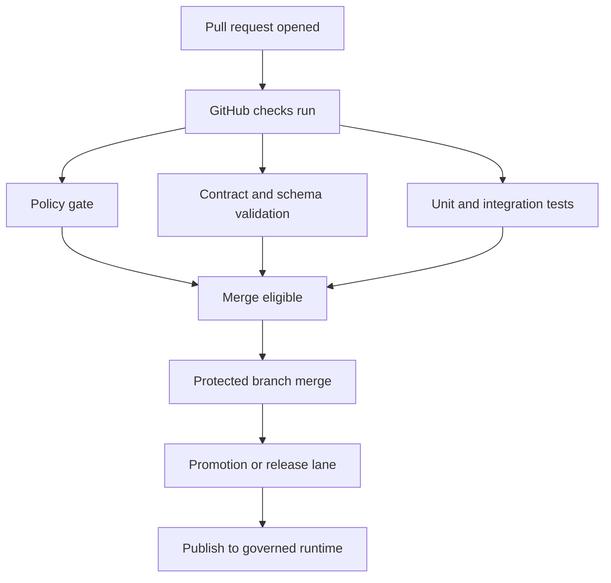

<!-- [KFM_META_BLOCK_V2]
doc_id: kfm://doc/4f0a4c1a-4f7e-4f5b-86d4-9b3b1c5c5c7a
title: .github README
type: standard
version: v1
status: draft
owners: KFM Platform Engineering (TODO: set CODEOWNERS)
created: 2026-03-03
updated: 2026-03-05
policy_label: public
related:
  - ".github/"
  - ".github/workflows/"
  - ".github/ISSUE_TEMPLATE/"
  - ".github/PULL_REQUEST_TEMPLATE.md"
tags: [kfm, github, cicd, governance]
notes:
  - Docs are a production surface. Keep this file current with CI policy + workflow changes.
[/KFM_META_BLOCK_V2] -->

<a id="top"></a>

# `.github/` — GitHub governance, CI/CD, and contribution automation

One place for **version-controlled GitHub enforcement surfaces**: workflows, templates, and ownership rules that keep KFM **evidence-first** and **fail-closed**.

> **Doc status:** **draft** • **Surface:** **governed** • **Owners:** **KFM Platform Engineering** (**TODO:** add `.github/CODEOWNERS`)  
> **Change posture:** **small, reversible, additive** • **Default:** **deny** • **Failure mode:** **closed**
>
> 
> 
> 
> 
> 
>
> **Jump to:** [Scope](#scope) • [Reality-check](#reality-check) • [Where it fits](#where-it-fits) • [Acceptable inputs](#acceptable-inputs) • [Exclusions](#exclusions) • [Directory tree](#directory-tree) • [Proposed baseline workflows](#proposed-baseline-workflows) • [Workflow registry](#workflow-registry) • [Change checklist](#change-checklist) • [FAQ](#faq)

---

## Scope

This directory holds GitHub-native governance artifacts **that are stored in the repo**.

### What belongs here (version-controlled GitHub surfaces)

- GitHub Actions workflows (`.github/workflows/**`)
- Issue + PR templates (`.github/ISSUE_TEMPLATE/**`, `.github/PULL_REQUEST_TEMPLATE.md`)
- Ownership routing (`.github/CODEOWNERS`, if used)
- Optional GitHub automation configs (`dependabot.yml`, labeler configs, release configs)

> [!IMPORTANT]
> **Hallucination guardrail:** this README must not imply a workflow/file exists unless it’s verified in your branch.
> Use the [Reality-check](#reality-check) steps before turning any “PROPOSED” content into “CONFIRMED”.

### What is NOT controlled here

Some GitHub enforcement is configured **outside the repository**, for example:
- branch protection rules (required status checks, required reviewers),
- repository settings (who can push, environments, rulesets),
- organization-level policies (actions allowlists, runner policies).

This README documents the **repo-side** pieces and how they should map to those settings.

[↑ Back to top](#top)

---

## Reality-check

**UNKNOWN (repo-specific):** which workflows/templates exist in *your* branch today.  
**CONFIRMED (process):** treat repo structure as unknown until verified; then update this file.

### Minimum verification steps (do these once per branch)

```bash
# Inventory governance artifacts
ls -la .github
ls -la .github/workflows || true
ls -la .github/ISSUE_TEMPLATE || true

# Quick scan of workflow "names" (important for branch protection check names)
grep -RIn "^name:" .github/workflows || true

# Quick scan for required permissions blocks (least-privilege posture)
grep -RIn "^\s*permissions:" .github/workflows || true
```

**PROPOSED:** After verification, update:
1) [Directory tree](#directory-tree) (to match reality), and  
2) [Workflow registry](#workflow-registry) (to match reality).

[↑ Back to top](#top)

---

## Where it fits

KFM’s core posture (trust membrane + fail-closed + cite-or-abstain) must be **enforced** through:
- CI gates (merge-blocking),
- runtime policy enforcement,
- deterministic provenance and evidence receipts.

`.github/` is the GitHub-side slice of that governance membrane: it controls *what runs on PRs/tags* and helps ensure policy and contract checks are not optional.

### Upstream / downstream connections

- **Upstream:** pull requests, issues, scheduled runs, dependency update bots.
- **Downstream (PROPOSED):** promotion/publish workflows, artifact attestations, provenance receipts, and merge audit trails.

[↑ Back to top](#top)

---

## Acceptable inputs

Put only GitHub governance artifacts here.

- **Workflows:** `.github/workflows/*.yml` (or `.yaml`)
- **Reusable workflows:** `.github/workflows/reusables/*.yml`
- **Composite actions:** `.github/actions/*/action.yml`
- **Templates:** `.github/ISSUE_TEMPLATE/*`, `.github/PULL_REQUEST_TEMPLATE.md`
- **Ownership:** `.github/CODEOWNERS`
- **Optional automation configs (only if used):**
  - `.github/dependabot.yml`
  - `.github/labeler.yml`
  - `.github/release.yml`

[↑ Back to top](#top)

---

## Exclusions

Do **not** place these in `.github/`:

- **Secrets or credentials** (ever)  
  Use GitHub Encrypted Secrets, GitHub Environments, and/or OIDC where possible.
- Application code (belongs in `apps/`, `packages/`, etc.).
- Data artifacts (RAW/WORK/PROCESSED/PUBLISHED) or catalogs.
- Large binaries (screenshots, datasets) — keep `.github/` lightweight and auditable.
- Policy bundles, schemas, or catalogs themselves (belong in `policy/`, `contracts/`, `data/`, etc.).

[↑ Back to top](#top)

---

## Directory tree

**UNKNOWN (repo-specific):** your exact `.github/` contents.  
**PROPOSED (spec-aligned baseline):** a reusable CI lane + policy PR gate pattern.

```text
.github/
├── README.md
├── CODEOWNERS                         # optional but strongly recommended
├── PULL_REQUEST_TEMPLATE.md
├── ISSUE_TEMPLATE/
│   ├── bug_report.yml
│   ├── feature_request.yml
│   └── dataset_intake.yml             # optional (if you intake datasets via GitHub)
├── workflows/
│   ├── kfm-ci.yml                     # entry workflow (schedule + workflow_dispatch)
│   ├── kfm-policy-gate.yml            # PR gate (Conftest/OPA/Rego) — merge blocking
│   └── reusables/
│      └── kfm-reusable-ci.yml         # shared runner via workflow_call
├── actions/
│   └── setup-conftest/
│      └── action.yml                  # installs pinned conftest version (example)
└── dependabot.yml                     # optional
```

[↑ Back to top](#top)

---

## Proposed baseline workflows

This section is **PROPOSED**. It becomes **CONFIRMED** only after you verify the files exist in your branch and are required by branch protection.

### What the baseline is trying to achieve

- Keep CI lanes consistent via **reusable workflows** (lanes differ by inputs, not structure).
- Enforce governance with a **merge-blocking** policy gate.
- Prefer **OIDC** and least-privilege permissions.
- Use guardrails: concurrency, kill-switches, short artifact retention.

### Conceptual flow


```mermaid
flowchart TD
  PR[Pull request opened] --> Checks[GitHub checks run]
  Checks --> Policy[Policy gate]
  Checks --> Contracts[Contract and schema validation]
  Checks --> Tests[Unit and integration tests]
  Policy --> Ready[Merge eligible]
  Contracts --> Ready
  Tests --> Ready
  Ready --> Merge[Protected branch merge]
  Merge --> Promote[Promotion or release lane]
  Promote --> Publish[Publish to governed runtime]
```

[↑ Back to top](#top)

---

## Workflow registry

**UNKNOWN (repo-specific):** your exact workflow set today.  
This table is intentionally split into:
- **Observed (fill in after Reality-check)**, and
- **Proposed baseline (safe defaults)**.

### Observed workflows (fill in)

> [!NOTE]
> Populate this after running the [Reality-check](#reality-check) commands.

| Workflow (path) | Purpose | Triggers | Merge-blocking? | Notes |
|---|---|---|---:|---|
| _TBD_ |  |  |  |  |

### Proposed baseline workflows (starter)

| Workflow (path) | Primary purpose | Typical triggers | Fail-closed gates | Evidence status |
|---|---|---|---|---|
| `.github/workflows/kfm-ci.yml` | Entry workflow calling reusable lanes | `schedule`, `workflow_dispatch` (and/or `push`) | must go red on any lane failure | **PROPOSED** |
| `.github/workflows/reusables/kfm-reusable-ci.yml` | Shared CI lane runner | `workflow_call` | consistent timeouts/concurrency/artifacts | **PROPOSED** |
| `.github/workflows/kfm-policy-gate.yml` | Policy-as-code checks (Conftest + Rego) | `pull_request` | **deny by default**; blocks merge on DENY | **PROPOSED** |
| `.github/actions/setup-conftest/action.yml` | Install a pinned Conftest | called by workflows | version pinning for determinism | **PROPOSED** |

> [!IMPORTANT]
> **Registry rule:** If a workflow exists and isn’t listed in the “Observed” table, add it.  
> If a listed workflow is removed or renamed, update this README **and** branch protection rules.

[↑ Back to top](#top)

---

## Governance expectations for workflow changes

### Review and ownership

**PROPOSED hard rule (recommended):**
- Any change under `.github/workflows/**` requires:
  - CODEOWNER review (platform/governance),
  - at least 1 additional engineer review,
  - passing workflow validation/lints.

### Status check name stability

Branch protection rules key off the *check name*. Avoid churn:
- keep workflow `name:` stable,
- keep merge-blocking job names stable,
- document renames in a PR note (and update branch protection).

[↑ Back to top](#top)

---

## Security and secrets baseline

**PROPOSED baseline (recommended):**
- Prefer **OIDC + short-lived credentials** over long-lived secrets.
- Add a `permissions:` block to every workflow; default to least privilege.

Example baseline:

```yaml
permissions:
  contents: read
```

If a workflow must comment on PRs, scope it narrowly:

```yaml
permissions:
  contents: read
  pull-requests: write
```

Also:
- Never print secrets. Sanitize logs.
- Avoid PATs unless explicitly approved and tightly scoped.
- Pin action versions (at least major versions; commit SHAs if policy requires).

[↑ Back to top](#top)

---

## CI gates matrix

Use this matrix to keep enforcement explicit and auditable.

| Gate | What it protects | Inputs | Output | Pass criteria | Evidence status |
|---|---|---|---|---|---|
| Policy gate | licensing, sensitivity, provenance completeness | manifests, receipts, policy bundle | conftest/OPA report | no denies | **PROPOSED** |
| Contract gate | OpenAPI/schema drift + invalid metadata | OpenAPI/JSON Schema/catalog profiles | validator output | 0 errors | **PROPOSED** |
| Test gate | correctness + regressions | unit/integration suites | test reports | green tests | **PROPOSED** |
| Repro gate | deterministic artifacts | receipts + checksums | compare hashes | identical outputs | **PROPOSED** |
| Security gate | supply chain trust | SBOM + scans + attestations | scan results | within thresholds | **PROPOSED** |

[↑ Back to top](#top)

---

## Quickstart

### Local sanity checks (developer workstation)

These are optional helpers; use what your repo supports.

```bash
# YAML lint (if you use it)
yamllint .github/workflows || true

# Repo search: ensure no secrets accidentally landed
git grep -nE "(AKIA|-----BEGIN|ghp_|ghs_|xoxb-|PRIVATE KEY)" -- . || true
```

### What should be merge-blocking (PROPOSED)

- workflow lint + validation
- policy checks (Conftest/OPA/Rego)
- contract tests (OpenAPI, schemas, catalog validators if applicable)
- determinism/repro checks (where artifacts are produced)

[↑ Back to top](#top)

---

## Change checklist

Use this before merging any `.github/**` change.

- [ ] Workflows remain **fail-closed** (no “allow on error” for governance gates).
- [ ] Branch protection / rulesets still require the intended checks.
- [ ] No secrets or tokens added to repo (including examples).
- [ ] Any new workflow has:
  - [ ] clear `on:` triggers
  - [ ] minimal `permissions:` block
  - [ ] pinned action versions
  - [ ] timeouts + concurrency where appropriate
- [ ] Documentation updated:
  - [ ] this file’s [Workflow registry](#workflow-registry)
  - [ ] any runbooks describing CI behavior
- [ ] Rollback path exists (revert restores last known-good gating)

[↑ Back to top](#top)

---

## FAQ

### Why is `.github/` treated as “governed”?
Because CI + policy checks are part of KFM’s enforcement membrane. A one-line YAML change can weaken gates silently, so we treat workflow changes as production-critical.

### I added a workflow—how do I make sure it blocks merges?
**PROPOSED steps:**
1. Ensure the workflow runs on `pull_request` (or the event you’re protecting).
2. Require its status check in branch protection rules (GitHub settings).
3. Add it to the “Observed workflows” table.
4. Create a test PR that intentionally fails the workflow to confirm it blocks.

### Where do I put operator documentation for a new gate?
Put operator details in `docs/runbooks/` (or your repo’s runbook directory) and link it from this README.

[↑ Back to top](#top)

---

## Appendix

<details>
<summary>Suggested PR template prompts (governance-aware)</summary>

**PROPOSED** content for `.github/PULL_REQUEST_TEMPLATE.md`:

- What does this change affect?
- Does it change governance, policy, or promotion behavior?
- What evidence/receipts are attached (or why not)?
- What is the rollback plan?
- Which datasets or catalogs are touched?
- Any sensitivity classification changes?

</details>

<details>
<summary>Recommended GitHub Actions permissions baseline</summary>

**PROPOSED:**
- Default: `contents: read`
- Add only what is needed:
  - `pull-requests: write` for PR comments/labels
  - `checks: write` for check runs
  - `id-token: write` for OIDC
- Avoid `contents: write` unless the workflow commits (and then restrict to bot branches / dedicated workflow)

</details>

---

## Back to top

[↑ Back to top](#top)
