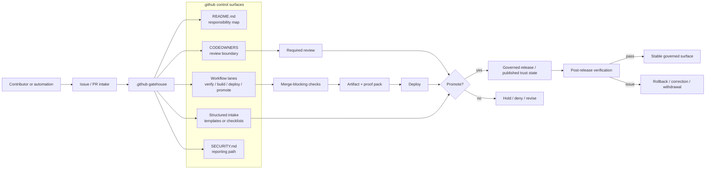

<!-- [KFM_META_BLOCK_V2]
doc_id: kfm://doc/repo/.github/readme
title: .github README
type: standard
version: v2
status: draft
owners: NEEDS_VERIFICATION
created: 2026-03-15
updated: 2026-03-19
policy_label: NEEDS_VERIFICATION
related: [../README.md, ../CONTRIBUTING.md, ../docs/governance/, ../docs/architecture/, ../docs/domains/, ../docs/runbooks/, ../docs/adr/, ../contracts/, ../policy/, ../data/registry/, ../apps/, ../packages/, ../infra/, ../tools/, ../scripts/, ../tests/, ./workflows/, ./CODEOWNERS, ./PULL_REQUEST_TEMPLATE.md, ./SECURITY.md]
tags: [kfm, github, governance, ci-cd, gitops, verification, review, release-evidence, delivery]
notes: [This revision is grounded in March 2026 KFM doctrine plus documentary repo-audit/support material. `.github/README.md`, `.github/CODEOWNERS`, `.github/SECURITY.md`, and `../CONTRIBUTING.md` are documentary-confirmed; repo-audit support also confirms public-repo metadata and GitHub Actions / code-scanning activity. The live `.github/workflows/` inventory, exact template filenames, exact `CODEOWNERS` contents, branch-protection settings, required checks, and environment approvals were not directly re-inspected from a mounted checkout in this session.]
[/KFM_META_BLOCK_V2] -->

<div align="center">
  <strong>Kansas Frontier Matrix</strong><br />
  <sub>Repo gatehouse for review, verification, and governed delivery</sub>
</div>

# `.github`

Repository-wide governance, collaboration, verification, and governed delivery entrypoint for Kansas Frontier Matrix.


| Field | Value |
|---|---|
| Status | experimental |
| Owners | **NEEDS_VERIFICATION** |
| Path | `.github/README.md` |
| Audited repo | `bartytime4life/Kansas-Frontier-Matrix` |
| Default branch | `main` |
| Visibility | public |
| Repo role | Gatehouse for contributor intake, review boundaries, workflow lanes, release evidence, and rollback / correction discipline |
| Truth posture | **CONFIRMED doctrine · CONFIRMED documentary repo evidence for `README.md`, `.github/README.md`, `.github/CODEOWNERS`, `.github/SECURITY.md`, `CONTRIBUTING.md`, public-repo metadata, and GitHub Actions / code-scanning activity · UNKNOWN live checkout details and platform settings** |
| Current evidence in this revision | Mounted March 2026 KFM PDFs plus repo-audit/support material; **no direct mounted checkout** of `.github/workflows/`, exact template filenames, branch protection, environment approvals, or exact workflow YAML contents |

**Quick jump:** [Scope](#scope) · [Repo fit](#repo-fit) · [Accepted inputs](#accepted-inputs) · [Exclusions](#exclusions) · [Directory tree](#directory-tree) · [Quickstart](#quickstart) · [Usage](#usage) · [Diagram](#diagram) · [Control surfaces](#control-surfaces) · [Task list / definition of done](#task-list--definition-of-done) · [FAQ](#faq) · [Appendix](#appendix)

> [!IMPORTANT]
> This README is **evidence-bounded**.
>
> It is grounded in March 2026 KFM doctrine plus documentary repo-audit/support material, but it does **not** claim a direct current-session reinspection of the live `.github/` tree, exact workflow YAML filenames, exact required checks, exact branch-protection settings, exact environment approvals, or exact `CODEOWNERS` entries.
>
> Use these labels throughout this file:
> - **CONFIRMED** — directly supported by mounted KFM doctrine or documentary repo-audit material visible in this session
> - **INFERRED** — supported by attached repo inventory / audit material, but not rechecked from a live checkout here
> - **PROPOSED** — realization guidance consistent with KFM doctrine
> - **UNKNOWN** — not established strongly enough in this session
> - **NEEDS VERIFICATION** — placeholder or claim that should be checked against the live repository before merge

## Scope

`.github/` is KFM’s repository-level **gatehouse**.

This directory is where contributor intake, review boundaries, CI/CD, release evidence, and correction discipline stop being informal intentions and become executable controls. In KFM terms, that makes `.github/` one of the clearest repository expressions of the **trust membrane**: changes pass through review, verification, policy, and promotion controls before they widen into public-facing or release-bearing state.

A strong `.github/` tree does not merely “run CI.” It helps preserve the repository-truth rule, keeps failure structural instead of ornamental, and makes rollback, correction, and approval boundaries visible.

### Evidence boundary used here

| Evidence layer | What this README treats as settled |
|---|---|
| **CONFIRMED** | KFM’s PR-first, fail-closed, evidence-bearing delivery doctrine; documentary confirmation that `README.md`, `.github/README.md`, `.github/CODEOWNERS`, `.github/SECURITY.md`, and `CONTRIBUTING.md` exist; audited repo metadata showing `main` as the default branch on a public GitHub repository |
| **CONFIRMED activity / NEEDS VERIFICATION inventory** | GitHub Actions and code-scanning activity are present in the repo-audit evidence, but exact workflow filenames and full workflow inventory were not re-read from a live checkout here |
| **UNKNOWN** | Direct live checkout details: exact workflow YAML set, exact issue and PR template filenames, exact current `CODEOWNERS` entries, exact required checks, exact branch protections, and exact environment approvals |

### Documentary repo signals

| Documentary repo signal | What it supports | Status |
|---|---|---|
| Repo audit identifies `bartytime4life/Kansas-Frontier-Matrix` as public with default branch `main` | This README can treat GitHub-hosted collaboration as the normal repo-facing control plane | CONFIRMED |
| `.github/README.md`, `.github/CODEOWNERS`, `.github/SECURITY.md`, and `CONTRIBUTING.md` were fetched in the repo-audit material | These files are safe direct adjacencies for this README | CONFIRMED |
| Dependency-bump pull requests touched GitHub Actions dependencies such as checkout, setup-python, and upload-artifact | `.github/workflows/` is not hypothetical, even though the exact YAML set still needs reinspection | CONFIRMED activity / NEEDS VERIFICATION inventory |
| Autofix pull requests for code scanning and a `CODEOWNERS` parsing fix are recorded in the audit support | Ownership and security automation are operating concerns in this repo, not decorative health files | CONFIRMED activity / NEEDS VERIFICATION configuration detail |

> [!NOTE]
> Platform state is **not** the same thing as repo state. Branch protection, required checks, environment reviewers, GitHub App permissions, and deployment approvals must be verified in GitHub settings or exported governance evidence, not assumed from repository files alone.

[Back to top](#github)

## Repo fit

**Path:** `.github/README.md`

**Role in repo:** directory README for repository-wide governance, review boundaries, CI/CD surfaces, release evidence, and correction posture.

**Repo-native obligation:** explain how repo-wide controls preserve KFM’s truth path without pretending `.github/` is the canonical home of contracts, policy bodies, datasets, or runtime code.

### Upstream and downstream anchors

| Direction | Path | Why it matters | Status in this README |
|---|---|---|---|
| Upstream | [`../README.md`](../README.md) | repo-wide entrypoint and project framing | CONFIRMED documentary evidence |
| Upstream | [`../CONTRIBUTING.md`](../CONTRIBUTING.md) | contributor workflow and contribution expectations | CONFIRMED documentary evidence |
| Upstream | [`../docs/`](../docs/) | doctrine, architecture, ADRs, and runbooks that `.github/` should gate rather than replace | INFERRED / NEEDS VERIFICATION |
| Upstream | [`../contracts/`](../contracts/) | canonical machine-readable contract surfaces | INFERRED / NEEDS VERIFICATION |
| Upstream | [`../policy/`](../policy/) | policy bundles, fixtures, and policy tests | INFERRED / NEEDS VERIFICATION |
| Upstream | [`../data/registry/`](../data/registry/) | source descriptors and registry-driven intake | INFERRED / NEEDS VERIFICATION |
| Downstream | [`./CODEOWNERS`](./CODEOWNERS) | executable review-boundary map | CONFIRMED documentary evidence |
| Downstream | [`./SECURITY.md`](./SECURITY.md) | security reporting and disclosure entrypoint | CONFIRMED documentary evidence |
| Downstream | [`./workflows/`](./workflows/) | CI, verification, release, and correction lanes | CONFIRMED activity / NEEDS VERIFICATION inventory |
| Downstream | PR template surface | contributor PR contract | NEEDS VERIFICATION |
| Downstream | issue template surface | structured issue intake | NEEDS VERIFICATION |

<details>
<summary><strong>Broader repo context</strong> — documentary inventory plus doctrine-led structure</summary>

```text
repo/
├── .github/              # repo-wide governance and CI/CD gatehouse
├── docs/                 # human-readable doctrine, runbooks, ADRs, schemas
├── contracts/            # API contracts and schemas
├── policy/               # policy code and fixtures
├── data/                 # registry, lifecycle zones, and catalogs
├── apps/                 # runnable services and UIs
├── packages/             # reusable domain/use-case modules
├── infra/                # deployment infrastructure
├── tools/                # validators and utility tooling
├── scripts/              # build / release / promotion helpers
└── tests/                # unit, integration, policy, and e2e verification
```

</details>

[Back to top](#github)

## Accepted inputs

The following content belongs in `.github/` when it applies across the whole repository rather than one package or app.

| Input class | What belongs here | Why it belongs here |
|---|---|---|
| Workflow definitions | CI, verification, docs, promotion, rollback, correction, and release lanes | repo-wide control and merge behavior live here |
| Review-boundary files | `CODEOWNERS`, approval-boundary notes, protected-branch guidance | review is part of KFM’s trust system |
| Structured contributor intake | issue templates, PR templates, review checklists | intake should be shaped before change widens |
| Reusable governance automation | composite actions, setup helpers, policy/install helpers, docs preflight automation | reduces drift without hiding behavior |
| Security/community health entrypoints | `SECURITY.md`, disclosure guidance, automation identity notes | makes trust surfaces discoverable at repo level |

## Exclusions

`.github/` can gate, reference, or validate these surfaces, but it should not quietly replace them as their canonical home.

| Does **not** belong here as canonical truth | Keep it here instead |
|---|---|
| machine-readable schemas, OpenAPI specs, vocabularies, envelopes | [`../contracts/`](../contracts/) |
| policy bodies, reason-code registries, fixtures, policy tests | [`../policy/`](../policy/) |
| source descriptors, raw/work/processed/catalog truth | [`../data/`](../data/) and [`../data/registry/`](../data/registry/) |
| runtime services, UI logic, ingestion logic, evidence resolvers | [`../apps/`](../apps/) and [`../packages/`](../packages/) |
| release artifacts, proof packs, manifests, immutable bundle inventory | designated release / evidence paths, not ad hoc `.github/` storage |
| architecture manuals, domain doctrine, ADRs, runbooks | [`../docs/`](../docs/) |

[Back to top](#github)

## Directory tree

The exact live `.github/` tree was **not** directly mounted in this session. The map below distinguishes documentary-confirmed files from workflow activity that is confirmed in principle but still needs live reinspection.

```text
.github/
├── README.md                   # CONFIRMED via repo-audit / GitHub connector
├── CODEOWNERS                  # CONFIRMED via repo-audit / GitHub connector
├── SECURITY.md                 # CONFIRMED via repo-audit / GitHub connector
├── workflows/                  # CONFIRMED GitHub Actions activity; exact YAML set NEEDS VERIFICATION
├── ISSUE_TEMPLATE/             # NEEDS VERIFICATION
└── PULL_REQUEST_TEMPLATE.md    # NEEDS VERIFICATION
```

> [!TIP]
> Treat the tree above as a **review map**, not a guarantee that every listed child has been re-read from the current repository checkout. For live accuracy, re-run the quickstart commands below in the mounted repo and update this README in the same PR.

## Quickstart

Before editing any repo-wide governance surface, confirm the live tree first.

```bash
# 0) Start from the repo root
git rev-parse --show-toplevel 2>/dev/null || pwd

# 1) Inventory the gatehouse
find .github -maxdepth 2 -type f | sort

# 2) Inspect confirmed boundary files
sed -n '1,220p' .github/README.md 2>/dev/null || true
sed -n '1,220p' .github/CODEOWNERS 2>/dev/null || true
sed -n '1,220p' .github/SECURITY.md 2>/dev/null || true
sed -n '1,220p' CONTRIBUTING.md 2>/dev/null || true

# 3) Inspect workflow inventory before changing gates
find .github/workflows -maxdepth 1 -type f 2>/dev/null | sort
grep -R '^name:' .github/workflows 2>/dev/null || true
grep -R 'uses: .*actions/' .github/workflows 2>/dev/null | sed -n '1,80p'

# 4) Check for issue / PR intake surfaces
find .github -maxdepth 2 -type f \
  \( -name '*PULL*' -o -path '.github/ISSUE_TEMPLATE/*' \) \
  2>/dev/null | sort

# 5) Confirm adjacent authority surfaces
find docs -maxdepth 2 -type d 2>/dev/null | sort | sed -n '1,80p'
find contracts -maxdepth 2 -type f 2>/dev/null | sort | sed -n '1,80p'
find policy -maxdepth 2 -type f 2>/dev/null | sort | sed -n '1,80p'

# 6) Platform-state checks are outside the repo tree:
#    - protected branches
#    - required status checks
#    - environment reviewers
#    - deployment approvals
#    - GitHub App / OIDC permissions
```

## Usage

Use this README as the responsibility map for repo-wide change.

1. **Inspect before editing.** Confirm the live `.github/` tree, actual required checks, and actual review boundaries before changing filenames, section claims, or responsibility language.
2. **Map the change to trust impact.** Ask whether the edit changes contributor intake, merge-blocking logic, release evidence, correction posture, or trust-visible behavior.
3. **Keep trust-impacting automation review-bearing.** KFM doctrine prefers reviewable deltas with attached evidence, policy results, and rollback posture where trust impact is real.
4. **Update adjacent documentation in the same governed stream.** If a workflow, template, or approval boundary changes how trust is earned, released, rolled back, or corrected, the docs must travel with the change.

### Build, deploy, and promote are different moves

| Move | What changes | Why `.github/` cares |
|---|---|---|
| **Build** | a versioned artifact exists with identity, digest, and validation output | workflows, attestations, and proof-pack assembly live here or begin here |
| **Deploy** | runtime placement changes | environment approval, rollback readiness, and post-deploy checks may be triggered here |
| **Promote** | trust state changes from candidate to governable / publishable release | policy checks, docs/accessibility gates, review records, and release evidence become mandatory |

### When this file should change

- when repo-wide workflow responsibilities change
- when review boundaries or `CODEOWNERS` expectations change
- when contributor intake moves or becomes more structured
- when release evidence, rollback, or correction posture changes
- when platform-state verification steps need sharper guidance

[Back to top](#github)

## Diagram


```mermaid
flowchart LR
    A[Contributor or automation] --> B[Issue / PR intake]
    B --> C[.github gatehouse]

    subgraph G[".github control surfaces"]
      G1["README.md<br/>responsibility map"]
      G2["CODEOWNERS<br/>review boundary"]
      G3["Workflow lanes<br/>verify / build / deploy / promote"]
      G4["Structured intake<br/>templates or checklists"]
      G5["SECURITY.md<br/>reporting path"]
    end

    C --> G1
    C --> G2
    C --> G3
    C --> G4
    C --> G5

    G2 --> H[Required review]
    G3 --> I[Merge-blocking checks]
    I --> J[Artifact + proof pack]
    J --> K[Deploy]
    H --> L{Promote?}
    K --> L
    G4 --> L

    L -->|yes| M[Governed release / published trust state]
    L -->|no| N[Hold / deny / revise]

    M --> O[Post-release verification]
    O -->|pass| P[Stable governed surface]
    O -->|issue| Q[Rollback / correction / withdrawal]
```

## Control surfaces

| Surface | Current evidence status | Primary role | Why it is sensitive |
|---|---|---|---|
| [`./README.md`](./README.md) | CONFIRMED documentary evidence | responsibility map for repo-wide governance and review posture | if it drifts, reviewers lose the boundary map |
| [`./CODEOWNERS`](./CODEOWNERS) | CONFIRMED documentary evidence | executable review ownership | changes approval scope and separation of duty |
| `./CODEOWNERS` coverage patterns | CONFIRMED documentary evidence | maps ownership over `docs/`, `data/`, `src/`, `tools/`, `tests/`, `policy/`, `contracts/`, plus key governance files | broad area ownership can change who must review trust-bearing work |
| [`./SECURITY.md`](./SECURITY.md) | CONFIRMED documentary evidence | security reporting / disclosure path | affects incident intake and trust posture |
| [`./workflows/`](./workflows/) | CONFIRMED activity / NEEDS VERIFICATION inventory | CI, validation, release, and correction lanes | directly affects merge, promotion, or rollback behavior |
| Code-scanning / autofix activity | CONFIRMED activity / NEEDS VERIFICATION configuration detail | security and dependency hygiene signals | a quiet drift here weakens repo trust posture |
| GitHub platform settings | UNKNOWN in this session | branch protection, required checks, environment approvals, app permissions | repo truth can still fail if platform gates drift |

### Review-sensitive changes

| Change class | Typical KFM review class | Minimum review expectation | Why it matters |
|---|---|---|---|
| non-behavioral README copy cleanup | Class 1 | normal peer review | safe unless instructions or trust posture change |
| `CODEOWNERS` edits | Class 2–5 depending on scope | owner / steward review distinct from author when boundaries change materially | changes who can approve protected work |
| workflow logic, required checks, or release lanes | Class 3 | technical owner review plus environment / operations reviewer as needed | changes merge, promotion, or rollback behavior |
| security reporting or automation-identity changes | Class 3–5 | security / platform review | affects disclosure path, secrets, or automation trust |
| policy-significant public-truth release controls | Class 5 | separation of duty required | public confidence must not depend on self-approval |
| emergency rollback / correction mechanics | Class 6 | emergency authority path plus after-action evidence | correction must stay visible and auditable |

[Back to top](#github)

## Task list / definition of done

- [ ] The live `.github/` tree was re-inspected from the mounted repository before merge.
- [ ] `.github/README.md`, `.github/CODEOWNERS`, `.github/SECURITY.md`, and `CONTRIBUTING.md` were checked line-by-line against the current repo.
- [ ] The actual workflow inventory under `.github/workflows/` was compared with this README.
- [ ] Workflow/security signals in the audit material were matched to current files (for example: Actions dependencies, code-scanning workflows, and any autofix lanes).
- [ ] `CODEOWNERS` coverage was reviewed against `docs/`, `data/`, `src/`, `tools/`, `tests/`, `policy/`, `contracts/`, and key governance files.
- [ ] Required status checks and protected-branch rules were verified in GitHub settings, not assumed from repo files alone.
- [ ] Environment approvals, deployment reviewers, and automation identities were rechecked where relevant.
- [ ] Repo-wide automation still preserves fail-closed behavior and keeps build, deploy, and promote meaningfully distinct.
- [ ] Documentation still follows the repository-truth rule: docs, schemas, policies, and workflow behavior move through the same governed stream.
- [ ] Promotion, rollback, and correction expectations remain documented where behavior depends on them.
- [ ] UNKNOWN items remain explicit instead of being rewritten as certainty.
- [ ] Adjacent docs and templates were updated in the same PR if behavior-significant controls changed.

## FAQ

### Does this README claim the live workflow set is fully verified?

No. It separates **documentary repo evidence** from **confirmed activity** and **UNKNOWN live checkout details**.

### Does build success mean the repo is ready to publish?

No. KFM doctrine separates build, deploy, and promote. A successful build proves an artifact exists; it does not by itself prove that the release is governable or publishable.

### Why is `.github/` treated as architecture and not just “CI config”?

Because KFM doctrine treats review, verification, promotion, rollback, and correction as part of one governed trust system. `.github/` is where much of that system becomes executable.

### Should contracts or policy bodies live in `.github/`?

No. `.github/` should gate and reference those surfaces, not replace them as their canonical home.

### What must be rechecked outside the repo tree?

Branch protection, required checks, environment approvals, GitHub App permissions, OIDC trust relationships, and other platform-state controls.

## Appendix

<details>
<summary><strong>Evidence boundary and maintainer notes</strong></summary>

### What is strongest in this revision

- KFM doctrine on fail-closed collaboration, required checks, release evidence, rollback/correction, and the repository-truth rule
- documentary repo-audit evidence confirming:
  - `README.md`
  - `.github/README.md`
  - `.github/CODEOWNERS`
  - `.github/SECURITY.md`
  - `CONTRIBUTING.md`
- repo-audit evidence confirming:
  - public repository visibility
  - default branch `main`
  - GitHub Actions activity
  - security / code-scanning activity
- repo-audit evidence describing `CODEOWNERS` coverage patterns across the main trust-bearing repo areas

### What remains open until a live checkout is mounted

- exact `.github/workflows/` filename set
- exact issue and PR template filenames and locations
- exact current `CODEOWNERS` entries and review handles
- actual branch-protection settings and required checks
- actual environment approvals and deploy-review rules
- actual GitHub App, OIDC, or secret-management wiring

### Maintainer guidance

- Preserve KFM terms: **truth path**, **trust membrane**, **authoritative vs derived**, **EvidenceBundle**, **PR-first**, **fail-closed**, **promotion**, **rollback**, **correction**.
- Prefer explicit placeholders over invented owners, reviewers, or platform settings.
- Keep this file a **responsibility map** rather than a duplicate home for policy bodies, schemas, or runtime code.
- Treat workflow edits as behavior edits when they affect review, validation, release evidence, or correction posture.

</details>

<details>
<summary><strong>Verification backlog</strong></summary>

1. Reinspect the live `.github/` tree and replace documentary / activity placeholders with exact file reality.
2. Verify whether `.github/ISSUE_TEMPLATE/` and the PR template surface exist in the current checkout exactly as named.
3. Inventory actual workflow YAMLs and map each to docs, policy, provenance, promotion, rollback, and correction duties.
4. Export or inspect protected-branch settings and required status checks.
5. Recheck `CODEOWNERS` coverage against governance-critical planes and named maintainers.
6. Confirm whether reusable actions, code-scanning lanes, artifact attestations, and environment-approval flows are mounted and active.
7. Retire UNKNOWN items only when direct repo or platform evidence is attached to the same PR.

</details>

[Back to top](#github)
