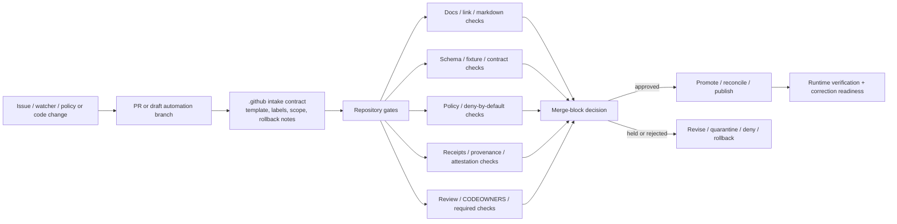

<!-- [KFM_META_BLOCK_V2]
doc_id: kfm://doc/repo/.github/readme
title: .github README
type: standard
version: v2
status: draft
owners: NEEDS_VERIFICATION
created: 2026-03-15
updated: 2026-03-18
policy_label: NEEDS_VERIFICATION
related: [../README.md, ../docs/governance/, ../docs/architecture/, ../docs/domains/, ../docs/runbooks/, ../docs/adr/, ../contracts/, ../policy/, ../data/registry/, ../apps/, ../packages/, ../infra/, ../tools/, ../scripts/, ../tests/, ./workflows/, ./CODEOWNERS, ./PULL_REQUEST_TEMPLATE.md, ./SECURITY.md]
tags: [kfm, github, governance, ci-cd, gitops, verification, review, release-evidence, delivery]
notes: [Current-session workspace evidence was PDF-only. This README is grounded in March 2026 KFM doctrine and attached repo-audit/support material, but the live .github tree, exact workflow YAML inventory, exact branch-protection settings, exact CODEOWNERS contents, and mounted implementation depth were not directly re-inspected from a live checkout in this session.]
[/KFM_META_BLOCK_V2] -->

<div align="center">
  
</div>

# `.github`

Repository-wide governance, collaboration, verification, and governed delivery entrypoint for Kansas Frontier Matrix.


| Field | Value |
|---|---|
| Status | experimental |
| Owners | **NEEDS_VERIFICATION** |
| Path | `.github/README.md` |
| Truth posture | **CONFIRMED doctrine · INFERRED repo-audit surfaces · UNKNOWN live checkout details** |
| Current-session evidence | March 2026 PDF corpus only; no mounted repo tree, workflow YAMLs, branch settings, schemas, manifests, dashboards, or runtime logs were directly verified |
| Repo role | Gatehouse for PR-first collaboration, merge-blocking checks, promotion discipline, release evidence, rollback/correction readiness, and contributor-facing governance |

**Quick jump:** [Scope](#scope) · [Repo fit](#repo-fit) · [Accepted inputs](#accepted-inputs) · [Exclusions](#exclusions) · [Directory tree](#directory-tree) · [Quickstart](#quickstart) · [Usage](#usage) · [Workflow model](#workflow-model) · [Control surfaces](#control-surfaces) · [Task list / definition of done](#task-list--definition-of-done) · [Verification backlog](#verification-backlog) · [FAQ](#faq)

> [!IMPORTANT]
> This README is **evidence-bounded**. It is grounded in March 2026 KFM doctrine plus attached repo-audit/support material, but it does **not** claim that the current session directly verified a live `.github/` checkout, exact workflow filenames, exact required checks, exact branch-protection settings, or exact `CODEOWNERS` entries.
>
> Use these labels throughout this file:
> - **CONFIRMED** — grounded in attached KFM doctrine or directly visible current-session evidence
> - **INFERRED** — supported by attached repo-audit/support documents, but not rechecked from a mounted checkout here
> - **PROPOSED** — realization guidance consistent with KFM doctrine
> - **UNKNOWN** — not established strongly enough in the current session
> - **NEEDS VERIFICATION** — placeholder or claim that should be checked against the live repository before merge

## Scope

`.github/` is KFM’s repo-level **gatehouse**.

This directory is where contributor intake, review boundaries, CI/CD, promotion, release evidence, and correction discipline become executable. In KFM terms, it is one of the most visible edges of the **trust membrane**: the place where changes stop being casual edits and become governed transitions that can be reviewed, blocked, promoted, rolled back, or corrected.

That matters because KFM explicitly rejects a model where public trust is downstream of convenience alone. A fluent UI, a passing deploy, or a merged PR is not enough if the change bypasses review, weakens evidence resolution, hides uncertainty, or silently changes release truth.

[Back to top](#github)

## Repo fit

**Path:** `.github/README.md`

**Role in repo:** directory README for repository-wide governance, contributor intake, review boundaries, CI/CD, release evidence, and correction discipline.

**Repo-native obligation:** explain how repository-wide controls protect the KFM truth path without pretending `.github/` is the canonical home of contracts, policy bodies, runtime code, or dataset truth.

### Upstream and downstream anchors

| Direction | Path | Why it matters | Status in this README |
|---|---|---|---|
| Upstream | `../README.md` | repo-wide entrypoint and system identity | INFERRED / NEEDS VERIFICATION |
| Upstream | `../CHANGELOG.md` | contract-significant change history and release discipline | INFERRED / NEEDS VERIFICATION |
| Upstream | `../docs/governance/` | doctrine, policy, review, and governance notes | INFERRED / NEEDS VERIFICATION |
| Upstream | `../docs/architecture/` | system boundaries, ADRs, and architecture law | INFERRED / NEEDS VERIFICATION |
| Upstream | `../contracts/` | canonical machine-readable contract surfaces | INFERRED / NEEDS VERIFICATION |
| Upstream | `../policy/` | policy bodies, fixtures, and policy tests | INFERRED / NEEDS VERIFICATION |
| Upstream | `../data/registry/` | source descriptors and registry-driven intake | INFERRED / NEEDS VERIFICATION |
| Downstream | `./workflows/` | CI/CD, verification, promotion, and correction lanes | INFERRED / NEEDS VERIFICATION |
| Downstream | `./CODEOWNERS` | executable review boundary | INFERRED / NEEDS VERIFICATION |
| Downstream | `./PULL_REQUEST_TEMPLATE.md` | contributor PR contract | INFERRED / NEEDS VERIFICATION |
| Downstream | `./ISSUE_TEMPLATE/` | structured intake templates | INFERRED / NEEDS VERIFICATION |
| Downstream | `./SECURITY.md` | disclosure and security entrypoint | PROPOSED / NEEDS VERIFICATION |

> [!NOTE]
> Relative links are intentional so this file feels native to the repo. Final spellings and actual presence should be checked against the live checkout before merge.

<details>
<summary><strong>INFERRED broader repo context</strong> — orientation only, not live-checkout proof</summary>

```text
repo/                              # INFERRED from attached repo-audit/support material
├── .github/                       # repo gatehouse: workflows, templates, review boundaries
├── apps/                          # governed services and user-facing applications
├── contracts/                     # OpenAPI, JSON Schema, vocabularies, envelopes
├── data/                          # registry, raw/work/processed zones, catalogs, receipts
├── docs/                          # doctrine, architecture, runbooks, ADRs, domain docs
├── infra/                         # deployment, GitOps, Terraform, dashboards
├── packages/                      # ingest, catalog, evidence, indexers, policy, shared logic
├── policy/                        # policy-as-code bundles, fixtures, tests
├── scripts/                       # build, release, lint, rebuild helpers
├── tests/                         # unit, integration, policy, and end-to-end checks
└── tools/                         # validators, link-checkers, spec hashers, dev helpers
```

</details>

## Accepted inputs

The following content belongs in `.github/` when it applies across the repository rather than to one app or package.

| Input class | What belongs here | Why it belongs here |
|---|---|---|
| Workflow definitions | CI, validation, promotion, correction, docs, and release lanes | repo-wide execution and merge controls live here |
| Review-boundary files | `CODEOWNERS`, review notes, protected-branch guidance, approval discipline | review is part of KFM’s trust system |
| Contributor intake | issue templates, PR templates, contribution checklists | intake should be structured before change widens |
| Reusable governance automation | composite actions, shared setup helpers, policy/install helpers | reduces drift without hiding behavior |
| Security/collaboration entrypoints | `SECURITY.md`, dependency/update automation, disclosure routing | keeps repo-wide governance discoverable |

## Exclusions

`.github/` may **point to** these surfaces, validate them, or gate them, but it should not quietly replace them as the canonical home of meaning.

| Does **not** belong here as canonical truth | Keep it here instead |
|---|---|
| contract schemas, OpenAPI definitions, runtime envelopes, vocabularies | `../contracts/` |
| policy bodies, fixtures, bundles, and policy tests | `../policy/` |
| source descriptors, dataset registries, raw/work/processed/catalog truth | `../data/registry/` and related `../data/` paths |
| runtime service code, evidence resolvers, UI logic, ingestion logic | `../apps/` and `../packages/` |
| release artifacts, proof packs, receipts, and immutable manifests | designated release/evidence paths, not ad hoc `.github/` storage |
| ADRs, domain doctrine, operating runbooks, and architecture manuals | `../docs/` surfaces |

[Back to top](#github)

## Directory tree

The exact `.github/` tree was **not** directly mounted in this session. The shape below is an **INFERRED / PROPOSED** directory contract for review, not a claim of live checkout truth.

```text
.github/
├── README.md                      # this responsibility map
├── workflows/                     # CI, docs, policy, promotion, correction, release gates
├── ISSUE_TEMPLATE/                # structured intake templates
├── PULL_REQUEST_TEMPLATE.md       # repo-wide PR contract
├── CODEOWNERS                     # review ownership boundary
├── SECURITY.md                    # disclosure and security reporting
├── actions/                       # reusable composite actions, if adopted
└── dependabot.yml                 # optional dependency/update automation
```

### What the `workflows/` lane should cover

- docs, link, and markdown validation
- contract, schema, and invalid-fixture checks
- policy tests and fail-closed decision checks
- build/package/release evidence generation
- attestation, signature, SBOM, or proof-object verification where adopted
- promotion, reconcile/deploy, rollback, and correction lanes that remain review-bound

## Quickstart

When a real checkout is available, start here before editing any repo-wide governance surface:

```bash
# 0) Start from the repo root
git rev-parse --show-toplevel 2>/dev/null || pwd

# 1) Inventory the gatehouse
find .github -maxdepth 2 -type f | sort

# 2) Inspect review-boundary files
sed -n '1,220p' .github/CODEOWNERS 2>/dev/null || true
sed -n '1,260p' .github/PULL_REQUEST_TEMPLATE.md 2>/dev/null || true
find .github/ISSUE_TEMPLATE -maxdepth 2 -type f 2>/dev/null | sort

# 3) Read workflow names and likely intent before changing gates
grep -R "^name:" .github/workflows 2>/dev/null || true
grep -R "policy\\|catalog\\|docs\\|release\\|evidence\\|attest\\|sbom\\|rollback\\|correction" .github/workflows 2>/dev/null || true

# 4) Confirm adjacent authority surfaces
find contracts -maxdepth 2 -type f 2>/dev/null | sort | sed -n '1,120p'
find policy -maxdepth 2 -type f 2>/dev/null | sort | sed -n '1,120p'
find docs -maxdepth 2 -type d 2>/dev/null | sort | sed -n '1,120p'

# 5) Branch protections and environment approvals are not reliably recoverable
# from the repo tree alone; check GitHub settings or an exported governance evidence pack.
```

## Usage

Use this README as the responsibility map for repo-wide change.

1. **Inspect first.** Confirm the live `.github/` inventory, actual required checks, and actual review boundaries before changing names, paths, or expectations.
2. **Map the change.** Decide whether the proposed edit affects contributor intake, policy/signature gates, release evidence, runtime trust, or correction posture.
3. **Edit the smallest surface that works.** KFM prefers small, reversible governance changes over sprawling rewrites.
4. **Update behavior-significant docs in the same PR.** If the workflow changes how trust is earned, released, rolled back, or corrected, the docs must travel with the change.

A useful mental model for delivery changes is:

> **Build → Attest → Sign → Log → Verify → Promote → Reconcile / Deploy → Verify again**

## Workflow model


```mermaid
flowchart LR
    A[Issue / watcher / policy or code change] --> B[PR or draft automation branch]
    B --> C[.github intake contract<br/>template, labels, scope, rollback notes]
    C --> D[Repository gates]
    D --> D1[Docs / link / markdown checks]
    D --> D2[Schema / fixture / contract checks]
    D --> D3[Policy / deny-by-default checks]
    D --> D4[Receipts / provenance / attestation checks]
    D --> D5[Review / CODEOWNERS / required checks]
    D1 --> E[Merge-block decision]
    D2 --> E
    D3 --> E
    D4 --> E
    D5 --> E
    E -->|approved| F[Promote / reconcile / publish]
    E -->|held or rejected| G[Revise / quarantine / deny / rollback]
    F --> H[Runtime verification + correction readiness]
```

## Control surfaces

| Surface | Primary role | KFM-specific obligation | Status in this README |
|---|---|---|---|
| `./workflows/` | CI, docs, policy, promotion, and correction lanes | preserve fail-closed, merge-blocking, evidence-bearing delivery | INFERRED / NEEDS VERIFICATION |
| `./CODEOWNERS` | review ownership and separation-of-duty edge | protect policy-significant and public-truth changes | INFERRED / NEEDS VERIFICATION |
| `./PULL_REQUEST_TEMPLATE.md` | contributor-facing PR contract | require scope, evidence labels, docs impact, tests, rollback, and operational notes | INFERRED / NEEDS VERIFICATION |
| `./ISSUE_TEMPLATE/` | structured intake | route defects, source requests, governance changes, and feature work into reviewable forms | INFERRED / NEEDS VERIFICATION |
| `./SECURITY.md` | disclosure and trust-boundary entrypoint | align with least privilege, security reporting, and evidence-preserving response | PROPOSED / NEEDS VERIFICATION |
| `./actions/` | reusable repo automation | reduce drift without hiding policy or weakening review | PROPOSED / NEEDS VERIFICATION |
| branch / environment rules | protected refs and rollout boundaries | keep approvals, required checks, and deploy gates structural rather than social | UNKNOWN / NEEDS VERIFICATION |

## Review-sensitive changes

| Change class | Minimum review expectation | Why it is sensitive |
|---|---|---|
| `.github/workflows/**` | steward + platform/security review | touches merge gates, release posture, or proof-bearing automation |
| `contracts/**` | contract + steward review | changes machine-readable public truth surfaces |
| `policy/**` | policy + steward review | changes allow/deny/generalize/hold behavior |
| `data/registry/**` | source/domain steward review | changes admissible-source boundaries |
| governed API docs or app trust surfaces | API/surface + steward review | changes trust-membrane behavior or evidence visibility |
| `infra/**` and delivery notes | platform/reliability review | changes rollout, rollback, or recovery posture |

## Task list / definition of done

- [ ] All links and filenames in this README were checked against the live repo tree.
- [ ] Owners, reviewers, and boundary files were verified against the current repository.
- [ ] Workflow names and required checks were confirmed from `.github/workflows/` and repository settings.
- [ ] Branch protections and environment reviewer rules were rechecked in the hosting platform, not assumed from repo files alone.
- [ ] Repo-wide automation still preserves PR-first, fail-closed behavior.
- [ ] Policy-significant or public-truth changes still cannot self-approve protected merges.
- [ ] PR templates still ask for scope, docs impact, tests, rollback, and operational notes.
- [ ] Docs/link checks, schema checks, and policy gates still align with KFM’s current contract surfaces.
- [ ] Promotion and release lanes still emit evidence-bearing artifacts where required.
- [ ] Rollback / correction expectations remain documented, not implied.
- [ ] UNKNOWN items remain visible instead of being rewritten as certainty.

[Back to top](#github)

## Verification backlog

1. Confirm the live `.github/` tree and update this README to match it exactly.
2. Confirm the real `CODEOWNERS`, `PULL_REQUEST_TEMPLATE.md`, `ISSUE_TEMPLATE/`, and `SECURITY.md` surfaces.
3. Inventory actual workflow YAMLs and map them to docs, policy, provenance, promotion, correction, and release gates.
4. Confirm which checks are required for protected branches and which environments require reviewers.
5. Confirm whether provenance / attestation / proof-object gates already exist in current workflow wiring.
6. Confirm whether docs, contracts, policy, and release-evidence checks run in one governed lane or multiple coordinated lanes.
7. Confirm whether correction / supersede / withdraw workflows or runbooks already exist in repo automation.
8. Replace placeholder owners, policy label, and NEEDS VERIFICATION surfaces with live repo truth.

## FAQ

### Does this README claim the listed files already exist?

No. It separates **CONFIRMED doctrine** from **INFERRED repo-audit surfaces**, **PROPOSED realization**, and **UNKNOWN live checkout details**.

### Why is `.github/` so important in KFM?

Because KFM treats review, policy, release, correction, and public trust as one governed system. `.github/` is where that system becomes executable at repository level.

### Should policy or schema truth live here?

No. `.github/` should gate and point to those surfaces, not quietly replace them.

### Can automation merge protected changes on its own?

This README assumes **no** for policy-significant and public-truth changes unless the project explicitly ratifies a narrower lane with equal or stronger review, evidence, and rollback controls.

## Appendix

<details>
<summary><strong>Current evidence boundary and maintainer notes</strong></summary>

### Current evidence boundary

What is strong right now:

- KFM doctrine on the truth path, trust membrane, authoritative-versus-derived separation, PR-first governance, fail-closed delivery, and evidence-bearing release
- attached repo-audit/support material that describes `.github/` as the repo’s CI/CD governance layer and its README as a responsibility map for merge-blocking checks
- repeated March 2026 documentation that keeps exact workflow inventory, branch protections, CODEOWNERS contents, and live repo depth in the **UNKNOWN / NEEDS VERIFICATION** layer until directly re-inspected

What remains unknown until a live checkout is mounted:

- exact `.github/` filenames and subdirectories
- exact required checks and branch/environment protection settings
- exact `CODEOWNERS` coverage and approver handles
- exact reusable-action inventory
- actual merge-blocking implementation depth versus documented target state

### Maintainer notes

- Preserve KFM terms: **truth path**, **trust membrane**, **authoritative vs derived**, **EvidenceBundle**, **PR-first**, **fail-closed**, **promotion**, **correction readiness**.
- Prefer explicit placeholders over invented owners or overclaimed workflow names.
- Prefer smaller, reversible edits to governance surfaces over sweeping rewrites.
- Keep this file a **responsibility map**, not a duplicate home for contracts, policy bodies, or runtime code.

</details>

[Back to top](#github)
