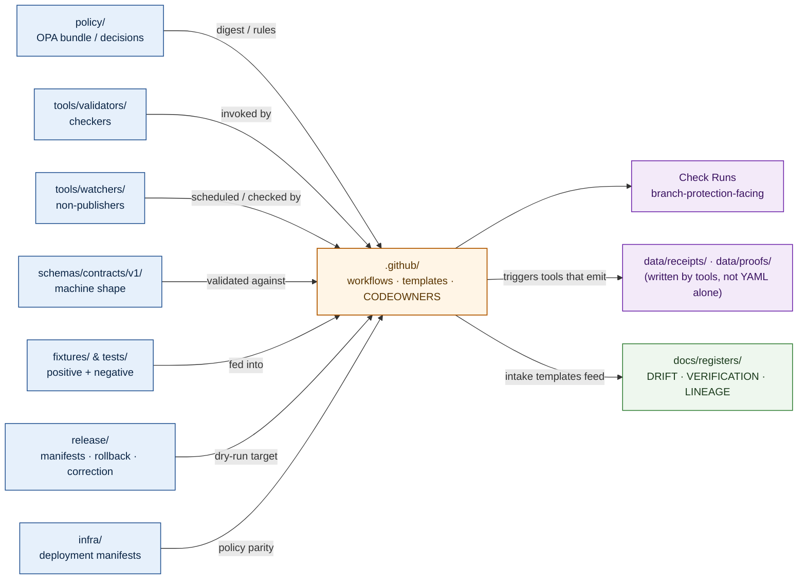

<!-- [KFM_META_BLOCK_V2]
doc_id: kfm://doc/github-folder-readme
title: .github — GitHub Platform Governance Hooks
type: standard
version: v1.2
status: draft
owners: <repo stewards · governance reviewers · CI maintainers — placeholder, confirm via CODEOWNERS>
created: 2026-05-11
updated: 2026-07-08
policy_label: public
related:
  - ../README.md
  - ../SECURITY.md
  - ../docs/doctrine/directory-rules.md
  - ../docs/doctrine/ai-build-operating-contract.md
  - ../docs/doctrine/lifecycle-law.md
  - ../docs/doctrine/trust-membrane.md
  - ../docs/doctrine/truth-posture.md
  - ../docs/registers/AUTHORITY_LADDER.md
  - ../docs/registers/DRIFT_REGISTER.md
  - ../docs/registers/VERIFICATION_BACKLOG.md
  - CODEOWNERS
  - ../policy/
  - ../tools/README.md
  - ../tools/validators/README.md
  - ../tools/watchers/README.md
  - ../release/
  - ../infra/
tags: [kfm, governance, ci, github, infra, policy-parity, starter-pack, branch-protection, codeowners]
notes:
  - "This v1.2 update makes the `.github/` README repo-aware: `.github/README.md` and `.github/CODEOWNERS` were verified through the GitHub app during the 2026-07-08 update."
  - "The repository-root `CODEOWNERS` path was not verified in this update; `.github/CODEOWNERS` is the confirmed code-owner file. Do not maintain two CODEOWNERS files without an ADR/migration note."
  - "Workflow inventory, branch-protection coupling, action pinning, policy-parity wiring, generated receipts, release dry-runs, and CI/runtime enforcement remain NEEDS VERIFICATION unless separately checked."
  - "Workflow filenames in this document remain a proposed governance catalog unless the corresponding files are verified in `.github/workflows/` and branch-protection settings."
  - "MetaBlock v2 fields follow atlas card KFM-P22-PROG-0002; governance posture follows cite-or-abstain and fail-closed defaults."
[/KFM_META_BLOCK_V2] -->

<p align="center">
  
</p>

# `.github/` — GitHub Platform Governance Hooks

> Workflows, templates, CODEOWNERS, and platform hooks that turn KFM governance doctrine into visible checks, review routing, and release-dry-run signals without becoming policy authority, validator authority, evidence authority, release authority, or publisher.


**Status:** `.github/README.md` and `.github/CODEOWNERS` are **CONFIRMED README / file surfaces** in this update. Workflow inventory, branch-protection coupling, check-name matching, action SHA pinning, policy-parity wiring, release-dry-run behavior, and CI/runtime enforcement remain **NEEDS VERIFICATION**.

**Owners:** `<repo stewards · governance reviewers · CI maintainers — placeholder, confirm via CODEOWNERS>`

**Last updated:** 2026-07-08

---

## Quick jump

- [Purpose](#purpose)
- [Current repo evidence from this update](#current-repo-evidence-from-this-update)
- [Authority level](#authority-level)
- [Status](#status)
- [What belongs here](#what-belongs-here)
- [What does NOT belong here](#what-does-not-belong-here)
- [Inputs](#inputs)
- [Outputs](#outputs)
- [Validation](#validation)
- [Review burden](#review-burden)
- [Related folders](#related-folders)
- [ADRs](#adrs)
- [Directory tree](#directory-tree)
- [How `.github/` sits in the canonical tree](#how-github-sits-in-the-canonical-tree)
- [Responsibility map](#responsibility-map)
- [Five-file governance starter pack (C14-01)](#five-file-governance-starter-pack-c14-01)
- [Workflow catalog](#workflow-catalog)
- [CI gate map (A–G)](#ci-gate-map-ag)
- [Cross-cutting requirements](#cross-cutting-requirements)
- [Adoption checklist](#adoption-checklist)
- [Anti-patterns](#anti-patterns)
- [FAQ](#faq)
- [Open questions / NEEDS VERIFICATION](#open-questions--needs-verification)
- [Last reviewed](#last-reviewed)

---

## Purpose

`.github/` is the canonical home for **GitHub-platform-specific governance hooks** in the Kansas Frontier Matrix repository.

It wires KFM doctrine into the daily development surface:

- GitHub Actions workflows;
- required checks;
- code ownership;
- issue and pull-request templates;
- dependency-intake configuration;
- branch-protection-facing job names;
- governance automation that invokes validators and policy from their owning roots.

This folder **invokes** validators, policies, tools, and release dry-runs that live elsewhere. It does **not** own their logic, schemas, source descriptors, policy decisions, evidence, receipts, release manifests, lifecycle data, or publication decisions.

> [!IMPORTANT]
> `.github/` is infrastructure for governance, not governance itself. A workflow that disagrees with `policy/`, `contracts/`, `schemas/`, `tools/validators/`, `release/`, or KFM doctrine is drift — fix the workflow or the authority root. Do not let CI invent rules that doctrine has not authored.

---

## Current repo evidence from this update

| Surface | Current-session status | What it proves | What it does **not** prove |
|---|---|---|---|
| `.github/README.md` | **CONFIRMED README** | This folder README exists and has been updated to v1.2. | Workflow inventory, branch-protection enforcement, or CI behavior. |
| `.github/CODEOWNERS` | **CONFIRMED file** | Code-owner routing file exists under `.github/`. | Team names are valid GitHub teams, branch protection requires CODEOWNERS review, or coverage is complete. |
| root `CODEOWNERS` | **NOT VERIFIED in this update** | No root CODEOWNERS file was confirmed by direct fetch. | This does not prove historical absence across branches/tags. |
| `.github/workflows/integrity.yml` | **NOT VERIFIED in this update** | Direct fetch did not confirm the file on the default branch. | This does not prove no workflows exist; a full workflow inventory remains required. |
| Workflow inventory and branch protection | **NEEDS VERIFICATION** | Search and spot checks were not enough to confirm check names, required checks, or enforcement. | Do not claim A–G gate enforcement until settings and workflows are inspected. |

> [!WARNING]
> A README can document governance posture, but it is not implementation proof. Treat workflow behavior, CI enforcement, release automation, security scanning, receipt emission, and branch-protection coupling as **NEEDS VERIFICATION** until verified from current repo files, GitHub settings, workflow runs, logs, or generated artifacts.

---

## Authority level

**Canonical root, GitHub-shaped.** `.github/` is a governance-bearing root because it controls platform hooks. Its sublayout is dictated by GitHub conventions, but KFM still treats the folder as a responsibility root.

| Field | Value |
|---|---|
| Authority class | **Canonical platform-governance root** |
| Sub-class | **implementation-bearing glue** — workflows execute, but do not author truth |
| Governs | CI orchestration, code ownership, issue/PR intake, GitHub platform hooks, branch-protection-facing checks |
| Does not govern | Policy decisions, schema shape, contract meaning, validator logic, release decisions, lifecycle data, source identity, EvidenceBundle truth, public runtime behavior |

---

## Status

| Claim | Truth label |
|---|---|
| `.github/README.md` exists | **CONFIRMED** in this update |
| `.github/CODEOWNERS` exists | **CONFIRMED** in this update |
| root `CODEOWNERS` is the active CODEOWNERS home | **NOT VERIFIED**; `.github/CODEOWNERS` is the confirmed home |
| `.github/` is the correct home for GitHub platform hooks | **CONFIRMED doctrine / responsibility-root placement** |
| The seven-gate matrix (A–G) is KFM doctrine | **CONFIRMED doctrine** |
| Default-deny promotion is KFM doctrine | **CONFIRMED doctrine** |
| Policy parity (CI = runtime, same OPA bundle digest) is KFM doctrine | **CONFIRMED doctrine** |
| Five-file starter pack + `integrity.yml` + `verify.sh` is KFM doctrine | **CONFIRMED doctrine / implementation NEEDS VERIFICATION** |
| Watcher-as-non-publisher is an invariant | **CONFIRMED doctrine / implementation NEEDS VERIFICATION** |
| Workflow files named below exist on disk | **NEEDS VERIFICATION** unless individually fetched |
| Branch protection currently enforces the gates listed here | **NEEDS VERIFICATION** |
| The seven-gate matrix is enforced today in this repo | **NEEDS VERIFICATION** |

---

## What belongs here

| Class | Path pattern | Role |
|---|---|---|
| GitHub Actions workflows | `.github/workflows/*.yml` | CI invocations of validators, policies, gates, release dry-runs, scans, and smoke tests. |
| Composite / reusable actions | `.github/actions/<name>/action.yml` | Repo-local action definitions reused by multiple workflows. |
| Code ownership | `.github/CODEOWNERS` | Path-to-reviewer map enforced at PR review time when branch protection requires it. |
| Issue templates | `.github/ISSUE_TEMPLATE/*.yml` or `*.md` | Structured intake for bugs, drift entries, ADR proposals, verification-backlog items, and security-safe routing pointers. |
| Pull request template | `.github/PULL_REQUEST_TEMPLATE.md` or `.github/PULL_REQUEST_TEMPLATE/` | Required PR scaffold: Directory Rules basis, gate impact, rollback target, AI-receipt link where applicable. |
| Dependency-intake config | `.github/dependabot.yml` | Pinned-toolchain dependency updates as reviewable PRs. |
| Discussion templates | `.github/DISCUSSION_TEMPLATE/*.yml` | Optional; community discussion intake. |
| Folder README | `.github/README.md` | This file. Required to explain the root boundary and governance posture. |

> [!NOTE]
> KFM doctrine permits `CODEOWNERS` at `.github/CODEOWNERS` or at repo root. This update verified `.github/CODEOWNERS`. Do not maintain both copies unless an ADR or migration note explains the temporary duplication and the deprecation path.

---

## What does NOT belong here

| Misplacement | Belongs in | Why |
|---|---|---|
| Validator logic | `tools/validators/` | Workflows invoke validators; they do not contain validator authority. |
| Watcher logic | `tools/watchers/` or accepted watcher homes | Workflows may schedule/watch; they do not publish or own watcher truth. |
| Policy bundles, Rego, allowlists, denylists, sensitivity rules | `policy/` | CI must reference the same policy bundle runtime uses. Inline policy breaks parity. |
| Schemas | `schemas/contracts/v1/` or accepted schema homes | Schema authority is `schemas/`. |
| Contracts | `contracts/` | Semantic object meaning belongs in contracts. |
| Release manifests, decisions, rollback cards | `release/` | Release artifacts are trust-bearing governance records. |
| Receipts, proofs, EvidenceBundles | `data/receipts/`, `data/proofs/` | Lifecycle trust data belongs under governed data roots. |
| Deployment manifests and exposure posture | `infra/` | Hosting, network, and runtime exposure are infra responsibility. |
| Pipeline code or specs | `pipelines/`, `pipeline_specs/` | Workflows may trigger pipelines; they do not contain pipeline authority. |
| Documentation prose, ADRs, runbooks | `docs/` | Human-facing control plane. |
| Root public security policy | `SECURITY.md` | Root `SECURITY.md` is the public disclosure entrypoint. A `.github` mirror requires justification. |
| Fixtures | `fixtures/` or accepted fixture homes | Workflows reference fixtures; they do not store canonical fixtures. |
| Source descriptors and source registry records | `data/registry/sources/` and accepted source registry homes | Source identity and admission posture are data/governance records, not CI config. |

> [!WARNING]
> A workflow that embeds policy logic inline — Rego, allow/deny lists, license allowlists, sensitivity rules, release decisions, or redaction thresholds — is drift. The workflow must load those from the appropriate authority root.

---

## Inputs

`.github/` files are authored by maintainers and reviewed by CODEOWNERS. They may reference:

- **`tools/validators/`** — validators invoked by workflows;
- **`tools/watchers/`** — watcher/non-publisher posture and any watcher automation hooks;
- **`policy/`** — OPA/Conftest decisions, rights, sensitivity, release, and public-surface gates;
- **`schemas/contracts/v1/`** — schema-validation targets;
- **`contracts/`** — object meaning that schemas and tests should align to;
- **`fixtures/`** and **`tests/fixtures/`** — positive and negative test inputs;
- **`tests/`** — unit, contract, e2e, boundary, accessibility, and finite-outcome tests;
- **`docs/registers/`** — drift, verification, lineage, and authority registers;
- **`release/`** — release dry-run targets, rollback cards, correction notices, manifests;
- **`infra/`** — policy-parity coupling and runtime deployment references.

---

## Outputs

`.github/` should emit **platform signals**, not sovereign trust artifacts:

- check runs and status checks on PRs and pushes;
- workflow logs and annotations;
- deterministic PR comments for missing obligations;
- reusable workflow calls;
- dispatches into tools or pipelines;
- issue/PR intake metadata.

Workflow logs are not evidence authority. A check run is evidence that a gate ran, not the gate itself. Auditors must be able to recompute the same result from local tooling, validators, fixtures, policy, receipts, and release records.

Workflows must not be the sole writer of release decisions, receipts, proofs, catalog updates, published artifacts, or public-surface data. Those belong in their owning roots and must pass governed promotion/release controls.

---

## Validation

The `.github/` folder itself should be validated.

| Validation | Expected posture | Status |
|---|---|---|
| Workflow lint | `actionlint` or equivalent over `.github/workflows/*.yml`. | **PROPOSED / NEEDS VERIFICATION** |
| CODEOWNERS lint | Coverage and syntax checks; confirmed file is `.github/CODEOWNERS`. | **NEEDS VERIFICATION** |
| Path / drift scan | Directory Rules placement and authority-boundary checks. | **PROPOSED / NEEDS VERIFICATION** |
| Pinned action digests | Every `uses:` should pin a commit SHA, not a floating tag. | **NEEDS VERIFICATION** |
| Policy parity | CI policy bundle digest matches runtime/infra policy bundle digest. | **NEEDS VERIFICATION** |
| Branch-protection coupling | Required-check names match workflow job names. | **NEEDS VERIFICATION** |
| Watcher-as-non-publisher audit | Workflows do not write directly to catalog, published, or release authority surfaces. | **NEEDS VERIFICATION** |
| AI receipt gate | AI-authored changes require `GENERATED_RECEIPT.json` when applicable. | **NEEDS VERIFICATION** |
| Kill-switch behavior | Long-running or write-emitting workflows expose explicit kill-switch outcomes. | **PROPOSED / NEEDS VERIFICATION** |

---

## Review burden

Changes under `.github/` require review from:

- the owner(s) named in `.github/CODEOWNERS` for the affected path;
- CI maintainers for workflow or action changes;
- governance reviewers for required checks, PR/issue templates, branch-protection-facing names, or gate semantics;
- subsystem owners for workflows touching UI, governed API, AI, contracts, schemas, policy, release, infra, source registries, or sensitive lanes;
- security reviewers for changes that affect secrets, security scanning, private reporting, exposure posture, token permissions, or public runtime boundaries.

Workflow renames and job-name changes are governance events when branch protection depends on them. They should land with a coordinated settings update, drift-register entry, or ADR/migration note.

---

## Related folders

| Folder | Relationship |
|---|---|
| [`../policy/`](../policy/) | Authority for allow / deny / restrict / abstain rules. Workflows reference policy; they do not author it. |
| [`../tools/validators/`](../tools/validators/) | Validator logic invoked by workflows. |
| [`../tools/watchers/`](../tools/watchers/) | Watcher non-publisher posture and watcher tooling lanes. |
| [`../schemas/`](../schemas/) | Schema authority. |
| [`../contracts/`](../contracts/) | Semantic object meaning. |
| [`../tests/`](../tests/) | Test suites invoked by CI. |
| [`../fixtures/`](../fixtures/) | Fixture inputs for validators and policy suites. |
| [`../release/`](../release/) | Release decisions, manifests, correction, and rollback. |
| [`../infra/`](../infra/) | Deployment manifests and policy-parity coupling. |
| [`../docs/registers/AUTHORITY_LADDER.md`](../docs/registers/AUTHORITY_LADDER.md) | Authority ordering CI helps enforce. |
| [`../docs/registers/DRIFT_REGISTER.md`](../docs/registers/DRIFT_REGISTER.md) | Where drift between workflows and doctrine should be recorded. |
| [`../docs/registers/VERIFICATION_BACKLOG.md`](../docs/registers/VERIFICATION_BACKLOG.md) | Where unresolved verification items should be tracked. |
| [`../SECURITY.md`](../SECURITY.md) | Public security policy and private-first vulnerability disclosure entrypoint. |

---

## ADRs

| ADR | Topic | Status | Why it touches `.github/` |
|---|---|---|---|
| `ADR-0001` | Schema home — default `schemas/contracts/v1/` | **NEEDS VERIFICATION in this update** | Schema-validation workflows must target the canonical schema home. |
| `ADR-CI-PARITY` | CI policy bundle digest equals runtime bundle digest | **PROPOSED** | Freezes C5-03 policy parity behavior. |
| `ADR-REQUIRED-CHECKS` | Required-check naming and branch-protection coupling | **PROPOSED** | Prevents silent branch-protection drift. |
| `ADR-STARTER-PACK` | Five-file starter pack + `integrity.yml` + `verify.sh` | **PROPOSED** | Freezes minimum viable governance posture. |
| `ADR-AI-RECEIPT-GATE` | AI-authored merge receipt gate | **PROPOSED** | Implements operating-contract receipt requirements. |

No ADR acceptance state was verified during this update.

---

## Directory tree

The tree below is a **target / verification map**, not a claim that every file exists.

```text
.github/
├── README.md                                # CONFIRMED README
├── CODEOWNERS                               # CONFIRMED file in this update
├── PULL_REQUEST_TEMPLATE.md                 # NEEDS VERIFICATION
├── dependabot.yml                           # NEEDS VERIFICATION
├── ISSUE_TEMPLATE/                          # NEEDS VERIFICATION
│   ├── bug_report.yml
│   ├── drift_entry.yml
│   ├── verification_item.yml
│   ├── adr.md
│   └── config.yml
├── DISCUSSION_TEMPLATE/                     # OPTIONAL / NEEDS VERIFICATION
├── actions/                                 # NEEDS VERIFICATION
│   └── <action-name>/action.yml
└── workflows/                               # NEEDS VERIFICATION
    ├── integrity.yml
    ├── path-and-drift.yml
    ├── contracts-ui-ai.yml
    ├── ui-governed.yml
    ├── policy-parity.yml
    ├── promotion-dry-run.yml
    ├── catalog-closure.yml
    ├── signing-integrity.yml
    └── rollback-drill.yml
```

---

## How `.github/` sits in the canonical tree


```mermaid
flowchart LR
    classDef canon fill:#e6f0fb,stroke:#1f4f8f,color:#0b2545,stroke-width:1.2px;
    classDef hook fill:#fff5e6,stroke:#b25900,color:#5a3500,stroke-width:1.4px;
    classDef result fill:#f3eaf9,stroke:#6b21a8,color:#3b1361,stroke-width:1.2px;
    classDef reg fill:#eef7ee,stroke:#2f7d32,color:#1b3b1c,stroke-width:1.2px;

    GH[".github/<br/>workflows · templates · CODEOWNERS"]:::hook

    POL["policy/<br/>OPA bundle / decisions"]:::canon
    TLS["tools/validators/<br/>checkers"]:::canon
    WAT["tools/watchers/<br/>non-publishers"]:::canon
    SCH["schemas/contracts/v1/<br/>machine shape"]:::canon
    FIX["fixtures/ & tests/<br/>positive + negative"]:::canon
    REL["release/<br/>manifests · rollback · correction"]:::canon
    INF["infra/<br/>deployment manifests"]:::canon

    DAT["data/receipts/ · data/proofs/<br/>(written by tools, not YAML alone)"]:::result
    CHK["Check Runs<br/>branch-protection-facing"]:::result
    REG["docs/registers/<br/>DRIFT · VERIFICATION · LINEAGE"]:::reg

    POL -- "digest / rules" --> GH
    TLS -- "invoked by" --> GH
    WAT -- "scheduled / checked by" --> GH
    SCH -- "validated against" --> GH
    FIX -- "fed into" --> GH
    REL -- "dry-run target" --> GH
    INF -- "policy parity" --> GH

    GH --> CHK
    GH -- "triggers tools that emit" --> DAT
    GH -- "intake templates feed" --> REG
```

---

## Responsibility map

| Responsibility | Lives in | `.github/` role |
|---|---|---|
| Decide allow / deny / restrict / abstain | `policy/` | Reference policy by digest or configured invocation; never inline rules. |
| Define object meaning | `contracts/` | Check that PRs touching contracts update schemas/tests/fixtures where required. |
| Define machine shape | `schemas/` | Invoke schema-validation jobs. |
| Prove a rule is enforceable | `tests/` | Run test suites; do not replace them with YAML-only logic. |
| Repo-wide validator logic | `tools/validators/` | Shell out to validators; never duplicate logic in workflows. |
| Watcher posture | `tools/watchers/` | Schedule or smoke-check watchers without granting publication power. |
| Release decisions | `release/` | Run dry-runs; never publish from CI alone. |
| Receipts and proofs | `data/receipts/`, `data/proofs/` | Produced by tools; workflows only expose/check/report. |
| Deployment posture | `infra/` | Verify policy-parity and deployment-boundary assumptions. |
| Source identity, rights, sensitivity | `data/registry/`, `policy/`, `docs/sources/` | Validate that source-bearing PRs cite proper descriptors and policy posture. |
| Human explanation | `docs/` | Link to doctrine, runbooks, ADRs, and registers. |

---

## Five-file governance starter pack (C14-01)

| Starter-pack item | Canonical home | `.github/` involvement | Current status |
|---|---|---|---|
| `CODEOWNERS` | `.github/CODEOWNERS` or root | Path-to-reviewer enforcement | **CONFIRMED at `.github/CODEOWNERS`** |
| `tool-versions.yaml` | `configs/` or root | Referenced by integrity checks | **NEEDS VERIFICATION** |
| `policy-bundle.json` | `policy/` | Referenced by policy-evaluating workflows | **NEEDS VERIFICATION** |
| `sbom.yaml` | `release/` or root | Verified by signing/integrity flows | **NEEDS VERIFICATION** |
| `run_receipt.schema.json` | `schemas/contracts/v1/receipts/` | Validated by receipt/integrity flows | **NEEDS VERIFICATION** |
| `integrity.yml` | `.github/workflows/integrity.yml` | Runs `verify.sh` on push/PR | **NEEDS VERIFICATION** |
| `verify.sh` | `scripts/dev/` or `tools/` | Local reproducibility script | **NEEDS VERIFICATION** |

---

## Workflow catalog

Workflow names below are a proposed target map until each file and branch-protection requirement is verified.

| Workflow | Trigger | Purpose | Gate(s) | Status |
|---|---|---|---|---|
| `integrity.yml` | push, pull_request | Run `verify.sh`; same checks locally and in CI | A, B, C, F | **NEEDS VERIFICATION** |
| `path-and-drift.yml` | pull_request | Mechanize Directory Rules placement and drift checks | A | **PROPOSED / NEEDS VERIFICATION** |
| `contracts-ui-ai.yml` | pull_request | Schema, fixture, and policy validation for UI/governed-AI surfaces | B, C | **NEEDS VERIFICATION** |
| `ui-governed.yml` | pull_request | PR-safe UI validation | B, C, G | **NEEDS VERIFICATION** |
| `policy-parity.yml` | pull_request | CI bundle digest equals runtime bundle digest | C | **PROPOSED / NEEDS VERIFICATION** |
| `promotion-dry-run.yml` | pull_request, workflow_dispatch | Run promotion gates without public effect | A–F | **PROPOSED / NEEDS VERIFICATION** |
| `catalog-closure.yml` | pull_request | Validate PROV / STAC / DCAT-style closure | F | **PROPOSED / NEEDS VERIFICATION** |
| `signing-integrity.yml` | pull_request, push | Verify RunReceipt, spec_hash, digest, signing posture | F | **PROPOSED / NEEDS VERIFICATION** |
| `rollback-drill.yml` | workflow_dispatch, schedule | Replay rollback card against a dry-run release | F, G | **PROPOSED / NEEDS VERIFICATION** |

---

## Cross-cutting requirements

Every workflow should preserve these KFM rules:

- **No-network default** for first-pass PR checks unless a source-activated exception exists.
- **Fail closed** when required evidence, schema, policy, rights, sensitivity, release, correction, or rollback support is absent.
- **Pinned actions**: avoid floating tags in `uses:` values.
- **Watcher-as-non-publisher**: workflows and watchers must not publish directly or write canonical truth.
- **Policy parity**: CI and runtime must evaluate the same policy bundle digest where policy gates are shared.
- **Deterministic obligations**: policy-gated failures should produce reproducible remediation comments or reports.
- **AI-receipt enforcement**: AI-authored repo changes should carry the required generated receipt when applicable.
- **Least privilege**: workflow token permissions should be minimal and explicit.
- **No secret-bearing logs**: workflows should never echo credentials, tokens, private source data, exact sensitive locations, or restricted details.
- **Visible kill-switch behavior**: long-running or write-emitting workflows should produce explicit kill-switch outcomes rather than silent skips.

---

## CI gate map (A–G)

| Gate | Intent | Required evidence | CI surface |
|---|---|---|---|
| **A** Structure & Metadata | MetaBlock presence, zone correctness, path-role validity | Path/drift scan + MetaBlock check | `path-and-drift.yml` **PROPOSED** |
| **B** Schemas & Contracts | Object conforms to schema + contract vocabulary | Schema validation over canonical schema homes and fixtures | `contracts-ui-ai.yml`, `ui-governed.yml` **NEEDS VERIFICATION** |
| **C** Policy Parity | CI and runtime decide on same policy bundle digest | Policy decision from pinned bundle | `policy-parity.yml`, `integrity.yml` **NEEDS VERIFICATION** |
| **D** Security & Sensitivity | Rights, sensitivity, license allowlist, secret hygiene | SPDX/rights/sensitivity/secret checks | **NEEDS VERIFICATION** |
| **E** Data Quality | DQ profilers, assertions, threshold pass | DQ reports with pass status | **NEEDS VERIFICATION** |
| **F** Provenance & Lineage | RunReceipt, spec_hash, signed bundle, catalog closure | Receipt verification + closure check | `signing-integrity.yml`, `catalog-closure.yml` **PROPOSED** |
| **G** Reviewability | CODEOWNERS + two-key approval + policy approval | GitHub review + policy/release decision | `.github/CODEOWNERS` **CONFIRMED file**, branch protection **NEEDS VERIFICATION** |

> [!IMPORTANT]
> Required-check names in branch protection must exactly match produced workflow job names. This coupling remains **NEEDS VERIFICATION** until GitHub repository settings are inspected.

---

## Adoption checklist

```text
[x] .github/README.md present
[x] .github/CODEOWNERS present
[ ] CODEOWNERS teams and coverage verified against real GitHub teams
[ ] .github/workflows/integrity.yml present and invokes verify.sh
[ ] scripts/dev/verify.sh or tools/verify.sh reproduces CI locally
[ ] .github/PULL_REQUEST_TEMPLATE.md renders operating-contract PR-body fields
[ ] .github/ISSUE_TEMPLATE/adr.md renders ADR skeleton
[ ] .github/ISSUE_TEMPLATE/drift_entry.yml feeds DRIFT_REGISTER
[ ] .github/ISSUE_TEMPLATE/verification_item.yml feeds VERIFICATION_BACKLOG
[ ] dependabot.yml or Renovate config present and reviewed; choose one canonical dependency-intake lane
[ ] Branch-protection required-check names match workflow job names
[ ] OPA/policy bundle digest pinned identically in CI workflows and infra manifests
[ ] Every `uses:` in workflows is pinned to a commit SHA
[ ] No workflow embeds policy logic, allow/deny lists, or license allowlists inline
[ ] No workflow writes canonical truth, mutates catalogs, or publishes directly
[ ] CI check enforces GENERATED_RECEIPT.json on AI-authored changes when applicable
[ ] no-direct-model-client and no-public-raw-path tests are wired in
[ ] Drift between workflow filename and required-check name routes to DRIFT_REGISTER
```

---

## Anti-patterns

| Anti-pattern | Symptom | Fix |
|---|---|---|
| Policy inlined in YAML | `allowlist`, `deny`, sensitivity, or release rules embedded in workflow steps. | Move rule authority to `policy/`; workflow references it. |
| Floating action tags | `uses: actions/checkout@v4` or similar floating tags. | Pin to commit SHA and update through reviewed PRs. |
| Required-check drift | Workflow/job renamed while branch protection still requires old name. | Update branch protection and workflow together; record drift if needed. |
| Workflow as publisher | Workflow writes to `data/published/`, `data/catalog/`, or `release/` as authority. | Route through governed tools, receipts, policy, review, and release. |
| CI-only validator | Validator logic exists only in workflow `run:` blocks. | Extract to `tools/validators/`; CI calls it. |
| CODEOWNERS without coverage | New canonical root has no reviewer mapping. | Extend `.github/CODEOWNERS`. |
| Two CODEOWNERS files | Root and `.github` both contain divergent CODEOWNERS. | Pick one home; document migration. |
| Secret-bearing logs | Workflow prints tokens, URLs, credentials, or restricted details. | Mask/avoid output; add secret-scan and log hygiene tests. |
| Public PR unsafe permissions | Fork PR job has write token or secret access. | Use least-privilege permissions and safe trigger design. |
| Missing AI receipt | AI-authored change merges without generated receipt when required. | Gate merge until receipt exists and validates. |

---

## FAQ

<details>
<summary><strong>Why does <code>.github/</code> count as a canonical root if GitHub dictates its layout?</strong></summary>

Because responsibility, not naming flexibility, decides root membership. `.github/` carries repo-wide responsibility for CI orchestration, code ownership, templates, and GitHub platform governance hooks. GitHub's subfolder conventions are operational constraints, not a reason to treat the root as optional.
</details>

<details>
<summary><strong>Where does <code>CODEOWNERS</code> belong?</strong></summary>

KFM permits `.github/CODEOWNERS` or root `CODEOWNERS`. This update confirms `.github/CODEOWNERS`; root `CODEOWNERS` was not verified. Maintain one active copy unless an ADR/migration note justifies a temporary overlap.
</details>

<details>
<summary><strong>Can a workflow publish a release?</strong></summary>

Not autonomously. A workflow may trigger a governed release pipeline or release dry-run, but release decisions, manifests, rollback cards, correction notices, and proofs belong under `release/`, `data/proofs/`, `data/receipts/`, and related authority roots.
</details>

<details>
<summary><strong>Why not put validators or policy bundles in <code>.github/</code>?</strong></summary>

Because `tools/validators/` owns validator logic and `policy/` owns policy. Keeping CI as a caller rather than authority preserves local reproducibility and CI/runtime policy parity.
</details>

<details>
<summary><strong>What happens if branch protection requires a check that no workflow produces?</strong></summary>

PRs can become unmergeable. Treat that as drift: update the workflow/job name and branch protection together, then record the fix in the drift or verification process.
</details>

</details>

---

## Open questions / NEEDS VERIFICATION

These items should be tracked in `docs/registers/VERIFICATION_BACKLOG.md` or an accepted equivalent:

- **NEEDS VERIFICATION** — Complete inventory of `.github/workflows/` on the default branch.
- **NEEDS VERIFICATION** — Whether branch protection requires checks, and which exact names.
- **NEEDS VERIFICATION** — Whether `.github/CODEOWNERS` teams exist and coverage is complete.
- **NEEDS VERIFICATION** — Whether OPA/policy bundle digest is pinned identically in CI workflows and `infra/` deployment manifests.
- **NEEDS VERIFICATION** — Whether action SHA-pinning is enforced.
- **NEEDS VERIFICATION** — Whether any workflow writes to catalog, published, release, or other authority homes.
- **NEEDS VERIFICATION** — Whether AI receipt gate is wired.
- **NEEDS VERIFICATION** — Whether private vulnerability reporting is enabled or linked from `SECURITY.md`.
- **OPEN** — Should Dependabot or Renovate be canonical for dependency intake?
- **OPEN** — Should `.github/SECURITY.md` exist as a mirror, or should root `SECURITY.md` remain the only public security policy?
- **OPEN** — Which workflow names should be frozen before branch protection references them?

---

## Last reviewed

`2026-07-08` — v1.2 revision. Updated the uploaded v1.1 `.github/` governance README to current repo-aware status: confirmed `.github/README.md` and `.github/CODEOWNERS`, removed stale no-repo-inspection language, documented `.github/CODEOWNERS` as the confirmed CODEOWNERS home, and left workflow inventory, branch protection, action pinning, policy parity, generated receipts, release dry-runs, and CI/runtime enforcement as **NEEDS VERIFICATION**.

Previous edition: `2026-05-22` — v1.1 draft from KFM doctrine and design reports.

[Back to top ↑](#github--github-platform-governance-hooks)
