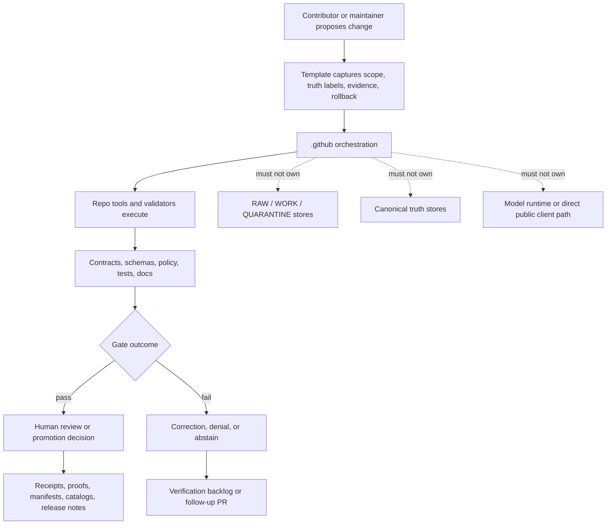

<!-- [KFM_META_BLOCK_V2]
doc_id: kfm://doc/TODO-verify-uuid--github-readme
title: GitHub Control Surface
type: standard
version: v1
status: draft
owners: TODO-verify-owner-or-codeowners
created: TODO-verify-created-date
updated: 2026-04-22
policy_label: TODO-verify-public-or-restricted
related: [../README.md, ../docs/README.md, ../docs/standards/README.md, ../contracts/README.md, ../schemas/README.md, ../policy/README.md, ../tests/README.md, ../tools/README.md, ../data/README.md, ./CODEOWNERS, ./PULL_REQUEST_TEMPLATE.md, ./workflows/README.md]
tags: [kfm, github, ci, governance, documentation, readme]
notes: [Drafted for .github/README.md from attached KFM doctrine and current-session scan; no mounted repository or workflow YAML was available, so owners, dates, policy label, link validity, and .github inventory remain verification items.]
[/KFM_META_BLOCK_V2] -->

<a id="top"></a>

# GitHub Control Surface

Repository-facing guidance for GitHub automation, contribution intake, review routing, and CI entry points without treating `.github/` as canonical truth.


> [!IMPORTANT]
> **Status:** `experimental` — directory inventory and workflow enforcement are **NEEDS VERIFICATION**  
> **Owners:** `TODO-verify-owner-or-codeowners`  
> **Path:** `.github/README.md`  
> **Authority class:** operational GitHub control surface; not doctrine, not policy law, not canonical data, and not release evidence  
> **Truth posture:** **CONFIRMED** target path requested · **PROPOSED** directory contract · **UNKNOWN** current workflow inventory  
> **Quick jumps:** [Scope](#scope) · [Repo fit](#repo-fit) · [Inputs](#inputs) · [Exclusions](#exclusions) · [Directory tree](#directory-tree) · [Quickstart](#quickstart) · [Usage](#usage) · [Diagram](#diagram) · [Operating tables](#operating-tables) · [Task list](#task-list--definition-of-done) · [FAQ](#faq) · [Appendix](#appendix)

> [!NOTE]
> This README is intentionally conservative. It documents what `.github/` should own in KFM and what must be verified before stronger claims are made about workflows, branch protection, required checks, templates, or maintainership.

---

## Scope

`.github/` is the repository’s GitHub-native control surface. It may host contribution templates, workflow orchestration, ownership routing, dependency automation, and GitHub-specific configuration.

In KFM terms, this directory helps turn review and delivery expectations into visible repository entry points. It does **not** own the truth path, canonical object definitions, source authority, runtime policy decisions, or published evidence.

### What this surface should make easier

- Reviewers can see which GitHub-facing files route contribution, review, and automation.
- Contributors can find the expected path for PR evidence, truth labels, and affected surfaces.
- Maintainers can separate orchestration from implementation logic.
- Workflow claims stay bounded until YAML, branch rules, and emitted artifacts are directly inspected.

[Back to top](#top)

---

## Repo fit

| Relationship | Target | Status | Role |
|---|---|---:|---|
| Upstream landing | [`../README.md`](../README.md) | NEEDS VERIFICATION | Root orientation and project identity. |
| Documentation standards | [`../docs/README.md`](../docs/README.md), [`../docs/standards/README.md`](../docs/standards/README.md) | NEEDS VERIFICATION | Markdown, README, and governance documentation standards. |
| Machine meaning | [`../contracts/README.md`](../contracts/README.md), [`../schemas/README.md`](../schemas/README.md) | NEEDS VERIFICATION | Contract and schema homes; `.github/` must not duplicate these. |
| Policy and gates | [`../policy/README.md`](../policy/README.md) | NEEDS VERIFICATION | Policy rules and release admissibility; workflows may call checks but do not own policy semantics. |
| Tests and fixtures | [`../tests/README.md`](../tests/README.md) | NEEDS VERIFICATION | Executable verification and fixture evidence. |
| Tooling | [`../tools/README.md`](../tools/README.md) | NEEDS VERIFICATION | Scripts and validators that workflows should invoke rather than reimplement inline. |
| Evidence artifacts | [`../data/README.md`](../data/README.md) | NEEDS VERIFICATION | Receipts, proofs, manifests, catalogs, and released derivatives belong outside `.github/`. |
| Local GitHub surfaces | [`./CODEOWNERS`](./CODEOWNERS), [`./PULL_REQUEST_TEMPLATE.md`](./PULL_REQUEST_TEMPLATE.md), [`./workflows/README.md`](./workflows/README.md) | NEEDS VERIFICATION | Ownership routing, PR intake, and workflow documentation. |

> [!WARNING]
> **Workflow presence is not enforcement proof.** Required status checks, branch protection, deployment approvals, environment rules, and repository settings must be verified from the actual repository or platform state before they are described as active controls.

[Back to top](#top)

---

## Inputs

Accepted inputs for `.github/` are GitHub-specific configuration and lightweight orchestration files.

| Input family | Belongs here when… | Must stay linked to… |
|---|---|---|
| Workflow YAML | It orchestrates repo checks, builds, docs linting, fixtures, or release dry runs. | Tooling under `../tools/`, tests under `../tests/`, and policy/schema surfaces where relevant. |
| Workflow README files | They explain workflow purpose, triggers, required evidence, and verification boundaries. | This README, `../docs/`, and any validator or emitted artifact docs. |
| Pull request template | It collects truth labels, affected surfaces, evidence links, rollback notes, and review burden. | `../docs/standards/`, `../contracts/`, `../schemas/`, `../policy/`, and `../tests/`. |
| Issue templates | They route bugs, docs drift, source-intake questions, policy gaps, and release problems without collapsing them into one queue. | Documentation, source registry, and domain-lane owners. |
| `CODEOWNERS` | It routes review for repository paths and sensitive control surfaces. | Owner records, steward review rules, and branch protection settings. |
| Dependabot / dependency automation | It proposes dependency changes while preserving review, test, and policy gates. | Security posture, CI, lockfiles, and package manager evidence. |
| Linter configuration | It configures GitHub-facing checks or delegates to repo tooling. | `../tools/`, `../docs/standards/`, and tests that prove the rule behavior. |

[Back to top](#top)

---

## Exclusions

`.github/` must not become a convenient dumping ground for KFM truth, policy, runtime logic, data, or proof artifacts.

| Do not put here | Use instead | Reason |
|---|---|---|
| Canonical schemas or contract definitions | `../contracts/` or `../schemas/` after schema-home ADR is settled | Prevents machine-contract drift. |
| Policy semantics, rights rules, or sensitivity logic | `../policy/` | Workflows can run policy checks; they do not define policy truth. |
| Validators, scripts, or complex CI logic | `../tools/` and `../tests/` | Keeps YAML thin, reviewable, and reusable. |
| RAW, WORK, QUARANTINE, processed datasets, or published artifacts | `../data/` lifecycle surfaces | Preserves KFM lifecycle boundaries. |
| Receipts, proofs, manifests, catalogs, or release bundles | `../data/receipts/`, `../data/proofs/`, `../data/manifests/`, `../data/catalog/`, or `../release/` as repo conventions confirm | GitHub workflows may emit or upload artifacts; the directory does not own evidence objects. |
| Secrets, credentials, access tokens, model endpoints, or private service URLs | Repository/environment secrets and deployment docs | Prevents accidental exposure. |
| Runtime API, UI, MapLibre, or model-adapter code | `../apps/`, `../packages/`, or repo-native runtime homes | `.github/` is orchestration, not application implementation. |
| Branch protection claims without settings evidence | Verification backlog or platform-state docs | Repository settings are not fully represented by checked-in files. |

[Back to top](#top)

---

## Directory tree

Current `.github/` contents were **not** available in the local workspace used to draft this file. Treat the following as a verification map, not an inventory claim.

```text
.github/
├── README.md                         # this file
├── CODEOWNERS                        # NEEDS VERIFICATION
├── PULL_REQUEST_TEMPLATE.md          # NEEDS VERIFICATION
├── ISSUE_TEMPLATE/                   # NEEDS VERIFICATION
│   ├── bug_report.md                 # NEEDS VERIFICATION
│   ├── documentation_drift.md        # PROPOSED pattern
│   ├── source_intake.md              # PROPOSED pattern
│   └── policy_or_release_gap.md      # PROPOSED pattern
├── workflows/                        # NEEDS VERIFICATION
│   ├── README.md                     # NEEDS VERIFICATION
│   ├── docs-lint.yml                 # NEEDS VERIFICATION
│   ├── contracts.yml                 # NEEDS VERIFICATION
│   ├── policy.yml                    # NEEDS VERIFICATION
│   ├── tests.yml                     # NEEDS VERIFICATION
│   └── release-dry-run.yml           # PROPOSED pattern
├── dependabot.yml                    # NEEDS VERIFICATION
└── linters/                          # NEEDS VERIFICATION
    ├── markdownlint.json             # NEEDS VERIFICATION
    └── mlc.config.json               # NEEDS VERIFICATION
```

> [!TIP]
> After the real repository is mounted, replace this verification map with a current file inventory generated from the checkout.

[Back to top](#top)

---

## Quickstart

Use these read-only checks before changing `.github/`.

```bash
# Confirm repository state.
git status --short
git branch --show-current

# Inventory GitHub control-surface files.
find .github -maxdepth 3 -type f | sort

# Inventory workflow YAML only.
find .github/workflows -maxdepth 1 -type f \( -name '*.yml' -o -name '*.yaml' \) -print | sort

# Look for KFM trust-surface vocabulary in GitHub-facing files.
grep -RInE \
  'EvidenceBundle|DecisionEnvelope|ReleaseManifest|CatalogMatrix|run_receipt|ai_receipt|proof pack|ABSTAIN|DENY|ERROR|ANSWER|RAW|WORK|QUARANTINE|PUBLISHED|trust membrane|cite-or-abstain' \
  .github docs contracts schemas policy tests tools 2>/dev/null || true
```

> [!CAUTION]
> These commands prove only what they inspect in the current checkout. They do not prove branch protection, required checks, Actions permissions, environment approvals, secret configuration, or deployment posture.

[Back to top](#top)

---

## Usage

When editing `.github/`, use the smallest reversible change that preserves KFM’s evidence-first posture.

### Change routing

| Change type | Before merge, verify… | Review emphasis |
|---|---|---|
| Workflow trigger change | The event is intentional and cannot publish or expose restricted material by accident. | Least privilege, no surprise release path, clear failure mode. |
| New workflow | It delegates substantive logic to repo tools/tests and records outputs where KFM expects them. | Thin YAML, deterministic inputs, clear artifacts. |
| Template change | It collects enough evidence without becoming noisy or performative. | Truth labels, affected surfaces, rollback, open verification. |
| CODEOWNERS change | Owners are current and match the review burden of the affected surface. | Separation of duty for policy-significant paths. |
| Dependency automation | Updates remain reviewable and cannot bypass tests or policy. | Supply-chain posture, package-manager evidence, lockfile behavior. |
| Linter/config change | Rules are documented and validated with fixtures where practical. | Avoid style-only churn; prefer trust and maintainability checks. |

### PR evidence prompts

A `.github/` PR should answer:

1. What surface does this change govern?
2. What evidence was inspected?
3. Which claims are **CONFIRMED**, **PROPOSED**, **UNKNOWN**, or **NEEDS VERIFICATION**?
4. Which downstream docs, schemas, policies, tests, or runbooks are affected?
5. What is the rollback path?
6. What should not be inferred from this change?

[Back to top](#top)

---

## Diagram


```mermaid
flowchart TD
    A[Contributor or maintainer proposes change] --> B[Template captures scope, truth labels, evidence, rollback]
    B --> C[.github orchestration]
    C --> D[Repo tools and validators execute]
    D --> E[Contracts, schemas, policy, tests, docs]
    E --> F{Gate outcome}

    F -->|pass| G[Human review or promotion decision]
    F -->|fail| H[Correction, denial, or abstain]

    G --> I[Receipts, proofs, manifests, catalogs, release notes]
    H --> J[Verification backlog or follow-up PR]

    C -. must not own .-> K[RAW / WORK / QUARANTINE stores]
    C -. must not own .-> L[Canonical truth stores]
    C -. must not own .-> M[Model runtime or direct public client path]
```

The core boundary is simple: `.github/` may orchestrate checks and route review, but KFM truth must remain anchored in governed evidence, policy, contracts, fixtures, and release objects outside this directory.

[Back to top](#top)

---

## Operating tables

### Authority boundary

| Surface | `.github/` may do | `.github/` must not do |
|---|---|---|
| Documentation | Run lint, structure checks, link checks, and review routing. | Declare doctrine by itself or override canonical docs. |
| Contracts / schemas | Run validation jobs and report failures. | Define object semantics or maintain duplicate schema copies. |
| Policy | Invoke policy tests and publish summaries. | Become the policy source of truth. |
| Data lifecycle | Run dry-run checks or artifact integrity checks where permitted. | Read or publish RAW, WORK, QUARANTINE, or unpublished candidate data as a normal path. |
| UI / MapLibre | Run tests or static checks. | Decide what a layer means, bypass Evidence Drawer payloads, or treat rendered maps as sovereign truth. |
| Governed AI | Run mock-adapter and citation-validation tests. | Send direct model traffic, expose prompts, or publish model output without evidence and policy checks. |
| Release | Orchestrate release dry runs or collect proof links. | Promote by file move, silently publish, or erase rollback/correction context. |

### Truth labels for this directory

| Label | Use in `.github/` docs |
|---|---|
| CONFIRMED | Directly verified from checked-in files, current command output, workflow runs, emitted artifacts, or platform settings. |
| INFERRED | Reasonable conclusion from adjacent verified evidence; keep narrow and reviewable. |
| PROPOSED | Intended workflow, template, check, or ownership rule not yet verified in the active repo. |
| UNKNOWN | Not inspectable from current files or session evidence. |
| NEEDS VERIFICATION | Concrete check required before treating a claim as fact. |
| CONFLICTED | Repo evidence, docs, or conventions disagree and need an ADR or explicit resolution. |
| LINEAGE / EXPLORATORY | Historical or idea-pressure material that may inform future work but does not prove current behavior. |

### GitHub automation posture

| Rule | Rationale |
|---|---|
| Keep workflow YAML thin. | Complex logic belongs in reviewable tools and tests, not opaque CI scripts. |
| Fail closed where rights, sensitivity, evidence, or release status is unknown. | KFM should abstain, deny, or request review rather than publish unsupported claims. |
| Make negative states visible. | `ABSTAIN`, `DENY`, and `ERROR` are meaningful governed outcomes, not merely failed UX. |
| Preserve artifact separation. | Receipts, proofs, catalogs, manifests, reviews, and corrections are different objects with different jobs. |
| Do not conflate branch checks with governance. | Passing CI is evidence, not automatic publication authority. |
| Treat local exposure as security-sensitive. | Reverse proxy, VPN, CORS, secrets, and model endpoints require deployment evidence before public claims. |

[Back to top](#top)

---

## Task list / definition of done

A `.github/` change is done enough to support stronger claims only when the checked items below are true in the active repository.

- [ ] Metadata block has a real `doc_id`, verified owner, verified dates, verified policy label, and valid related links.
- [ ] `.github/` inventory is generated from the current checkout and reflected in the [Directory tree](#directory-tree).
- [ ] `CODEOWNERS` coverage is verified for `.github/`, workflows, policy-significant templates, and release-adjacent files.
- [ ] Each workflow has a documented purpose, trigger, permissions posture, expected artifacts, and failure behavior.
- [ ] Workflow YAML delegates substantive validation to `tools/`, `tests/`, `policy/`, `contracts/`, or `schemas/` instead of embedding complex logic inline.
- [ ] PR and issue templates collect truth posture, evidence basis, affected surfaces, rollback path, and open verification items.
- [ ] Required checks and branch protection claims are backed by direct platform evidence or explicitly labeled **NEEDS VERIFICATION**.
- [ ] Secrets, credentials, model endpoints, private service URLs, and restricted geometry are absent from checked-in GitHub configuration.
- [ ] Documentation linting checks KFM Meta Block V2, H1 count, quick jumps, relative links, and placeholder leakage where repo tooling supports it.
- [ ] Release-adjacent workflows preserve receipts, proofs, manifests, catalog records, correction lineage, and rollback references rather than replacing them.
- [ ] No workflow creates a normal public path to RAW, WORK, QUARANTINE, canonical/internal stores, vector indexes, model runtimes, or unpublished candidate data.
- [ ] Rollback is documented for every new workflow, template, or ownership-routing change.

[Back to top](#top)

---

## FAQ

<details>
<summary>Is `.github/` part of the KFM trust model?</summary>

Yes, but as an orchestration and review-routing surface. It can make governance visible and testable, but it does not own canonical truth, policy semantics, source authority, or release evidence.
</details>

<details>
<summary>Can workflow YAML define KFM policy?</summary>

No. Workflow YAML may call policy checks and fail a build. The policy meaning belongs in the policy surface and its linked tests, fixtures, and review records.
</details>

<details>
<summary>Can a passing workflow publish a KFM artifact?</summary>

Not by itself. Publication requires the governed release path: validation, policy checks, review state where required, provenance, proof objects, release manifest, correction/rollback context, and whatever promotion gate the repo verifies.
</details>

<details>
<summary>Should `.github/` contain reusable scripts?</summary>

Only tiny GitHub-specific glue should live here. Reusable validation, linting, schema, policy, source, or release logic belongs in repo tooling and test directories so it can be run locally and reviewed independently.
</details>

[Back to top](#top)

---

## Appendix

### A. Verification backlog

| Item | Why it matters | Suggested evidence |
|---|---|---|
| Actual `.github/` inventory | Prevents invented workflow/template claims. | `find .github -maxdepth 3 -type f \| sort` from mounted repo. |
| Workflow YAML list | Needed before naming active CI gates. | Direct `.github/workflows/*.yml` inspection. |
| Workflow permissions | Prevents over-privileged automation. | YAML `permissions:` blocks and repository Actions settings. |
| Branch protection / required checks | Cannot be proven from README text alone. | Platform settings export, screenshot, API response, or maintainer-confirmed settings record. |
| CODEOWNERS coverage | Review routing is policy-significant. | Current `CODEOWNERS` file plus branch protection requiring code-owner review. |
| KFM Meta Block validation | Required for standard docs. | Docs validator output and fixture tests. |
| Schema home | Prevents `contracts/` vs `schemas/` drift. | ADR plus object map. |
| Policy toolchain | Needed before claiming OPA/Conftest/Rego enforcement. | Tool versions, workflow logs, and policy tests. |
| Release artifact storage | Needed before describing receipts/proofs/manifests as emitted. | Generated artifacts, manifests, proof bundles, or release dry-run logs. |
| Local exposure posture | KFM may be locally hosted and exposed through trusted access paths. | Deployment docs, reverse proxy/VPN config, secret handling, CORS, auth, logs, and network boundary evidence. |

### B. Glossary

| Term | Meaning in this README |
|---|---|
| GitHub control surface | Files under `.github/` that route GitHub contribution, review, automation, and repository-facing configuration. |
| Orchestration | Calling tools, tests, and validators in the right order without moving policy or object truth into YAML. |
| Proof object | A release- or verification-facing artifact such as a receipt, proof, manifest, catalog record, or review record. |
| Trust membrane | KFM’s boundary preventing public clients, UI surfaces, and model runtimes from bypassing governed evidence and policy flow. |
| Cite-or-abstain | The posture that consequential claims should resolve to evidence or decline to answer. |
| Finite outcome | A bounded result such as `ANSWER`, `ABSTAIN`, `DENY`, or `ERROR`, rather than an ambiguous free-form state. |

[Back to top](#top)
