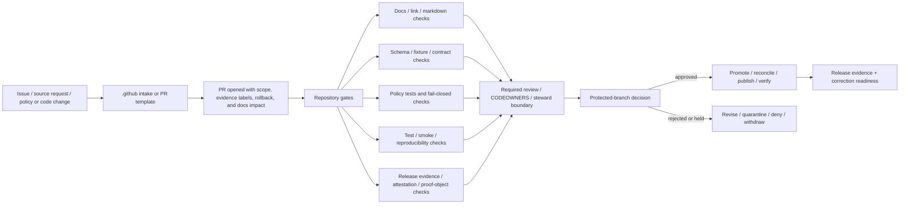

<div align="center">
  
</div>

<!-- [KFM_META_BLOCK_V2]
doc_id: kfm://doc/repo/.github/readme
title: .github README
type: standard
version: v2
status: draft
owners: NEEDS_VERIFICATION
created: 2026-03-15
updated: 2026-03-15
policy_label: NEEDS_VERIFICATION
related: [../README.md, ../docs/governance/, ../docs/architecture/, ../docs/domains/, ../docs/runbooks/, ../docs/adr/, ../contracts/, ../policy/, ../data/registry/, ../apps/, ../packages/, ../infra/, ../tools/, ../scripts/, ../tests/, ./workflows/, ./CODEOWNERS, ./PULL_REQUEST_TEMPLATE.md, ./SECURITY.md]
tags: [kfm, github, governance, ci-cd, gitops, verification, review, release-evidence, delivery]
notes: [This README reflects March 2026 KFM doctrine and realization overlays. Current-session workspace evidence exposed PDFs only; repo-specific file paths, workflow names, CODEOWNERS coverage, branch-protection rules, and mounted implementation details remain verification-bounded until the live repo is re-inspected.]
[/KFM_META_BLOCK_V2] -->

# `.github`
Repository-level governance, collaboration, verification, and governed delivery entrypoint for Kansas Frontier Matrix.

| Field | Value |
|---|---|
| Status | draft |
| Owners | **NEEDS VERIFICATION** |
| Path | `.github/README.md` |
| Truth posture | **CONFIRMED doctrine / PROPOSED repo-native realization / UNKNOWN live repo details** |
| Current-session evidence | PDF corpus only; live repo tree, workflow YAMLs, schemas, manifests, dashboards, and runtime logs were not directly verified |
| KFM role | Repo gatehouse for PR-first collaboration, CI/CD, release evidence, promotion discipline, correction readiness, and merge-blocking review boundaries |
| Quick jumps | [Why `.github` matters](#why-github-matters) · [Repo fit](#repo-fit) · [Expected root directories](#expected-root-directories) · [Expected `.github/` tree](#expected-github-tree) · [Workflow model](#workflow-model) · [Control surfaces](#control-surfaces) · [PR contract](#pr-contract) · [Definition of done](#definition-of-done) · [Verification backlog](#verification-backlog) |


> [!IMPORTANT]
> This README is **evidence-bounded**. It reflects current March 2026 Kansas Frontier Matrix doctrine and realization overlays, but it does **not** claim that the current session verified a live `.github/` directory, exact workflow inventory, exact CODEOWNERS entries, exact required checks, or exact branch-protection rules.
>
> Read repo-shaped claims here as one of:
> - **CONFIRMED** — grounded in mounted KFM doctrine and supporting repo-audit material
> - **PROPOSED** — repo-native implementation direction consistent with that doctrine
> - **UNKNOWN** — not established from the current session
> - **NEEDS VERIFICATION** — placeholder value, owner, filename, or rule that must be checked in the actual repository

## Why `.github` matters

For KFM, `.github/` is not just a convenience folder. It is one of the human-facing edges of the **trust membrane**.

This is where repository-wide change becomes governed change: contributor intake, PR review, required checks, policy-significant automation, release evidence, promotion boundaries, correction lanes, and the fail-closed habits that keep public claims downstream of evidence, policy, review, and release state.

A weak `.github/` layer invites exactly the kinds of drift KFM is designed to resist:

- docs that drift from behavior
- workflows that silently bypass policy or review
- protected changes that become effectively self-approving
- promotion that collapses into a blind deploy step
- merge hygiene that ignores evidence, rollback, or correction consequences

[Back to top](#github)

## Repo fit

**Path:** `.github/README.md`

**Role in repo:** directory README for repository-wide governance, collaboration, review, CI/CD, release evidence, and correction discipline.

**Repo-native obligation:** explain how repository-wide controls protect the KFM truth path without pretending `.github/` is the canonical home of schemas, policy bodies, source descriptors, or runtime code.

### Expected upstream anchors *(reported in corpus; NEEDS VERIFICATION in current repo)*

- `../README.md`
- `../docs/governance/`
- `../docs/architecture/`
- `../docs/domains/`
- `../docs/runbooks/`
- `../docs/adr/`
- `../contracts/`
- `../policy/`
- `../data/registry/`
- `../apps/`
- `../packages/`
- `../infra/`
- `../tools/`
- `../scripts/`
- `../tests/`

### Expected downstream anchors *(reported in corpus; NEEDS VERIFICATION in current repo)*

- `./workflows/`
- `./ISSUE_TEMPLATE/`
- `./PULL_REQUEST_TEMPLATE.md`
- `./CODEOWNERS`
- `./SECURITY.md`
- `./actions/`
- `./dependabot.yml`

> [!NOTE]
> The links above are intentionally relative so this file stays repo-native, but their final spellings, presence, and scope must be checked against the live checkout before commit.

## Current evidence boundary

The strongest current KFM materials confirm the doctrine, not the mounted repo state.

What is strong right now:

- the canonical truth path
- the trust membrane
- authoritative-versus-derived separation
- the five-plane system model
- contract-family starter sets
- trust-visible product surfaces
- verification as a cross-cutting governance layer
- PR-first, fail-closed, evidence-bearing delivery doctrine

What remains **UNKNOWN** until the repo is re-inspected:

- exact `.github/` workflow filenames
- exact required checks and branch-protection settings
- exact CODEOWNERS handles and review lanes
- exact schema inventory under `contracts/`
- exact policy bundle layout under `policy/`
- exact release-orchestrator or review-console implementation
- exact deployment manifests and runtime stack

## KFM concepts that should shape `.github/`

Repository-wide automation and review expectations should be written with these project-wide ideas in view:

| KFM concept | Why it matters to `.github/` |
|---|---|
| **Truth path** — `Source edge -> RAW -> WORK / QUARANTINE -> PROCESSED -> CATALOG -> PUBLISHED` | Workflow gates must not let public surfaces outrun governed publication state. |
| **Trust membrane** | Clients and public surfaces should not bypass governed APIs, policy, or evidence resolution. |
| **Five planes** — intake, canonical truth, catalog/policy/review, derived delivery, runtime trust surfaces | Review and CI must keep cross-plane shortcuts visible and block unsafe ones. |
| **Contract families** | Changes to schemas, envelopes, decision grammar, or proof objects should trigger strong validation and steward review. |
| **Runtime outcomes** — `ANSWER`, `ABSTAIN`, `DENY`, `ERROR` | Delivery controls should preserve fail-closed behavior and evidence-bearing negative outcomes. |
| **Map-first, time-aware shell** | UI-affecting changes should protect trust-visible geography, time scope, evidence routes, and review state. |
| **Release evidence / proof packs** | Promotion should be inspectable, signed, reviewable, and reversible rather than implicit. |
| **Correction as first-class workflow** | `.github/` should support correction, supersede, withdraw, and rollback lanes instead of only forward release motion. |

## Expected root directories

The repo shapes described in the March 2026 KFM materials are shown below as a **reported / target-oriented directory contract**, not as current-session repo fact.

```text
repo/                              # reported in supporting repo-inventory materials; NEEDS VERIFICATION live
├── .github/                       # repo gatehouse: workflows, CODEOWNERS, PR templates, security surface
├── apps/                          # governed services and user-facing applications
│   ├── api/                       # governed API boundary
│   ├── ui/                        # map / dossier / story / Focus shell
│   ├── workers/                   # async or background job surfaces
│   └── cli/                       # promotion, migration, or ops tooling
├── contracts/                     # OpenAPI, JSON Schema, vocab, route / envelope / object contracts
├── data/                          # registry, raw, work, processed, catalog, receipts, published assets
│   ├── registry/
│   ├── raw/
│   ├── work/
│   ├── processed/
│   ├── catalog/
│   └── receipts/
├── docs/                          # doctrine, architecture, domains, runbooks, ADRs, user-facing documentation
│   ├── governance/
│   ├── architecture/
│   ├── domains/
│   ├── runbooks/
│   └── adr/
├── infra/                         # deployment, GitOps, Terraform, K8s, monitoring
├── packages/                      # ingest, catalog, evidence, policy, domain, indexing / tiles, shared logic
├── policy/                        # Rego or equivalent rule bodies, fixtures, tests, bundles
├── scripts/                       # release, promotion, lint, rebuild, smoke helpers
├── tests/                         # unit, integration, e2e, policy/data fixtures
└── tools/                         # validators, spec-hashers, linkcheckers, dev helpers
```

### How `.github/` fits that shape

`.github/` should coordinate repo-wide expectations across those zones, but it should **not** become the canonical source of truth for them.

- Contracts stay authoritative under `../contracts/`
- Policy bodies and fixtures stay authoritative under `../policy/`
- Source descriptors and dataset registration stay authoritative under `../data/registry/`
- Runtime code stays authoritative under `../apps/` and `../packages/`
- Runbooks, ADRs, and doctrinal docs stay authoritative under `../docs/`
- `.github/` provides the intake, review, enforcement, and delivery surfaces that keep those zones aligned

[Back to top](#github)

## Expected `.github/` tree

The exact `.github/` tree was **not** directly visible in the current session. The shape below is therefore a **PROPOSED target / expected directory contract**, not a statement of mounted local fact.

```text
.github/                           # PROPOSED target shape; NEEDS VERIFICATION live
├── README.md                      # this document
├── workflows/                     # repo-wide validation, promotion, release, correction, docs, and policy gates
├── ISSUE_TEMPLATE/                # structured contributor intake
├── PULL_REQUEST_TEMPLATE.md       # repo-wide PR contract and review checklist
├── CODEOWNERS                     # executable review boundary and separation-of-duty edge
├── SECURITY.md                    # disclosure, security reporting, and trust-boundary note
├── actions/                       # reusable composite actions, if adopted
└── dependabot.yml                 # optional dependency/update automation
```

### What `workflows/` should conceptually cover

Even where exact YAML filenames are still unverified, KFM doctrine supports these workflow lanes:

- docs and link validation
- schema and fixture validation
- policy tests and fail-closed decision checks
- build, package, or release evidence generation
- attestation / provenance / proof-object verification where applicable
- publish / promote / reconcile lanes that remain review-bound
- correction / supersede / withdraw / rollback support

## What belongs in `.github/`

Content that belongs in or under `.github/` for KFM includes:

- repository-wide workflow definitions
- issue and pull-request templates
- review-boundary files such as `CODEOWNERS`
- security-reporting entrypoints
- reusable repo-level actions
- branch-protection and required-check documentation
- merge, promotion, release, and correction-governance notes
- contributor-facing checklists that apply across planes and domains
- automation patterns that remain PR-first, deterministic, and fail-closed

## What does **not** belong here as canonical truth

The following do **not** belong here as the authoritative home of system meaning:

- contract schemas, OpenAPI definitions, event grammar, or vocabularies  
  → keep under `../contracts/`
- policy rule bodies, fixtures, bundles, or policy tests  
  → keep under `../policy/`
- source descriptors, source registries, dataset specs, or release catalogs  
  → keep under `../data/registry/` and related data/catalog paths
- runtime service code, evidence resolvers, UI code, or ingestion logic  
  → keep under `../apps/` and `../packages/`
- release artifacts, proof packs, receipts, manifests, SBOMs, or attestation payloads  
  → keep in designated release/evidence paths, not as ad hoc `.github/` storage
- domain doctrine, system architecture, or Kansas source-atlas material  
  → keep under the appropriate `../docs/` surfaces

## Workflow model


```mermaid
flowchart LR
    A[Issue / source request / policy or code change] --> B[.github intake or PR template]
    B --> C[PR opened with scope, evidence labels, rollback, and docs impact]
    C --> D[Repository gates]
    D --> D1[Docs / link / markdown checks]
    D --> D2[Schema / fixture / contract checks]
    D --> D3[Policy tests and fail-closed checks]
    D --> D4[Test / smoke / reproducibility checks]
    D --> D5[Release evidence / attestation / proof-object checks]
    D1 --> E[Required review / CODEOWNERS / steward boundary]
    D2 --> E
    D3 --> E
    D4 --> E
    D5 --> E
    E --> F[Protected-branch decision]
    F -->|approved| G[Promote / reconcile / publish / verify]
    F -->|rejected or held| H[Revise / quarantine / deny / withdraw]
    G --> I[Release evidence + correction readiness]
```

### Governed delivery expectations

Changes under `.github/` should preserve these repo-wide expectations:

- PR-first collaboration for consequential change
- merge-blocking checks on trust-significant failures
- small, reviewable, reversible change units
- docs updated in the same stream as behavior-significant workflow changes
- no automation lane that silently merges protected changes on its own
- promotion treated as a governed state transition, not just a deploy button
- correction and rollback treated as first-class operational outcomes

## Control surfaces

| Surface | Primary role | KFM-specific obligation | Status here |
|---|---|---|---|
| `./workflows/` | CI, validation, promotion, correction, release, and docs gates | Must preserve fail-closed review and release posture | **PROPOSED path** |
| `./CODEOWNERS` | Review ownership and separation-of-duty edge | Must protect policy-significant and public-truth changes | **PROPOSED path** |
| `./PULL_REQUEST_TEMPLATE.md` | Contributor-facing PR contract | Should require scope, evidence labels, rollback, docs impact, tests, and operational notes | **PROPOSED path** |
| `./ISSUE_TEMPLATE/` | Structured intake | Should route defects, governance changes, and source requests into reviewable forms | **PROPOSED path** |
| `./SECURITY.md` | Disclosure and response entrypoint | Should align with KFM security, least-privilege, and evidence-preserving posture | **NEEDS VERIFICATION** |
| `./actions/` | Reusable repo automation | Should reduce drift without hiding behavior or weakening review | **PROPOSED path** |
| branch-protection docs or notes | Human-readable guardrails for protected refs | Should match actual required checks and approval lanes | **NEEDS VERIFICATION** |

## PR contract

A KFM-native repo-wide PR contract should ask for more than “what changed.” For consequential changes, it should ask contributors to make the following visible:

- purpose and scope
- evidence label summary: what is **CONFIRMED**, **PROPOSED**, or **UNKNOWN**
- affected planes: intake, canonical truth, catalog/policy/review, derived delivery, runtime trust surfaces
- affected contract families, if any
- docs impact or explicit rationale for none
- tests added or updated
- rollback or correction path
- operational impact notes if runtime behavior, review boundaries, or release posture change

### Changes that deserve especially strong review

| Change class | Minimum review expectation | Why it is sensitive |
|---|---|---|
| `.github/workflows/**` | steward + platform / security review | touches merge gates, release posture, or evidence-bearing delivery |
| `contracts/**` | contract + steward review | changes machine-readable truth surfaces |
| `policy/**` | policy + steward review | changes deny/allow/generalize/hold behavior |
| `data/registry/**` or source onboarding docs | source / domain steward review | changes admissible-source boundaries |
| `apps/api/**` or API contract docs | API + steward review | changes governed boundary behavior |
| `apps/ui/**`, Evidence Drawer, Focus, dossier, or story docs | surface + steward review when trust semantics shift | changes user-visible trust behavior |
| `infra/**` or delivery docs | platform / reliability review | changes rollout, rollback, or recovery posture |

## Quick inspection order

When a real repo checkout is available, inspect `.github/` in this order before editing any repo-wide governance surface:

```bash
# 1) Inspect directory and workflow inventory
ls -la .github
ls -la .github/workflows 2>/dev/null || true

# 2) Inspect executable review boundaries
sed -n '1,200p' .github/CODEOWNERS 2>/dev/null || true

# 3) Inspect the PR contract and contributor intake
sed -n '1,240p' .github/PULL_REQUEST_TEMPLATE.md 2>/dev/null || true
find .github/ISSUE_TEMPLATE -maxdepth 2 -type f 2>/dev/null | sort

# 4) Inspect workflow intent before changing gates
grep -R "catalog\|policy\|docs\|release\|evidence\|attest\|sbom\|prove\|rollback\|correction" .github/workflows 2>/dev/null || true

# 5) Confirm adjacent authority surfaces
find docs -maxdepth 2 -type d 2>/dev/null | sort | sed -n '1,120p'
find contracts -maxdepth 2 -type f 2>/dev/null | sort | sed -n '1,120p'
find policy -maxdepth 2 -type f 2>/dev/null | sort | sed -n '1,120p'
```

## Definition of done

**Definition of done for changes under `.github/`:**

- [ ] All links and file names in this README were checked against the actual repo tree.
- [ ] Owners and review boundaries were verified against current repo practice.
- [ ] Workflow names, required checks, and branch-protection assumptions were confirmed, not inferred.
- [ ] Repo-wide automation still preserves PR-first, fail-closed behavior.
- [ ] Policy-significant or public-truth changes still cannot self-approve protected merges.
- [ ] PR templates still ask for scope, evidence labels, docs impact, tests, rollback, and operational notes.
- [ ] Docs drift checks and link checks remain healthy where required.
- [ ] Schema, fixture, and policy checks still reflect KFM’s current contract surfaces.
- [ ] Release evidence and correction readiness are preserved where delivery behavior changed.
- [ ] Unknowns remain visible instead of being rewritten as certainty.

## Verification backlog

The March 2026 KFM materials repeatedly leave some repo realities explicit as **UNKNOWN** until the repo is directly mounted. For `.github/`, the highest-value confirmations are:

1. Confirm the live `.github/` tree and update this README to match it exactly.
2. Confirm the real `CODEOWNERS`, `PULL_REQUEST_TEMPLATE.md`, `ISSUE_TEMPLATE/`, and `SECURITY.md` surfaces.
3. Inventory actual workflow YAMLs and map them to validation, promotion, correction, and docs gates.
4. Confirm which checks are required for protected branches.
5. Confirm whether provenance / attestation / proof-object gates already exist.
6. Confirm whether docs, contracts, policy, and release-evidence checks are wired in one governed lane.
7. Confirm whether correction / supersede / withdraw workflows or runbooks are already represented in repo automation.
8. Replace placeholder owners, dates, and verification-bounded anchors with live repo truth.

## FAQ

### Does this README claim these files already exist?

No. It intentionally distinguishes **confirmed doctrine** from **proposed repo shape** and **unknown live implementation**.

### Why is `.github/` so important in KFM?

Because KFM treats review, policy, evidence, release, correction, and public trust as one governed system. `.github/` is where that system becomes executable at repository level.

### Should policy or schema truth live here?

No. `.github/` may gate, validate, or point to those surfaces, but it should not replace them as the authoritative home of meaning.

### Can automation merge protected branches on its own?

This README assumes **no** for policy-significant and public-truth changes unless the project explicitly ratifies a narrower lane with equal or stronger evidence, review, and rollback controls.

## Maintainer notes

- Keep wording aligned with KFM doctrine: **truth path**, **trust membrane**, **authoritative vs derived**, **evidence bundle**, **fail-closed**, **docs as production surface**, **PR-first**, and **correction readiness**.
- Prefer explicit placeholders over invented owners or claims.
- Prefer relative links.
- Prefer smaller reversible workflow edits over large governance rewrites.
- Preserve this file as a navigation and governance entrypoint, not as the canonical home of contracts, policy, or runtime code.

[Back to top](#github)
