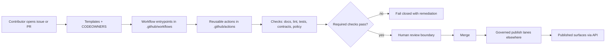

<!-- [KFM_META_BLOCK_V2]
doc_id: kfm://doc/github-readme-v2
title: .github
type: standard
version: v1
status: draft
owners: @bartytime4life
created: 2026-03-07
updated: 2026-03-08
policy_label: public
related: [/README.md, /.github/CODEOWNERS, /.github/dependabot.yml, /.github/ISSUE_TEMPLATE, /.github/PULL_REQUEST_TEMPLATE.md, /.github/workflows, /.github/actions, /policy, /tests, /docs, /CONTRIBUTING.md]
tags: [kfm, github, ci, governance, docs, workflows, codeowners]
notes: [Rewritten to distinguish verified current repo facts from target-state control-plane conventions and to align with the current public GitHub surface.]
[/KFM_META_BLOCK_V2] -->

<a id="top"></a>

# `.github`
GitHub-native control plane for workflows, templates, ownership routing, dependency automation, and merge discipline.

> **Status:** draft  
> **Owners:** currently [`@bartytime4life`](./CODEOWNERS)  
>       
> **Quick jump:** [Purpose](#purpose) · [Truth labels](#truth-labels) · [Repo fit](#repo-fit) · [Verified current state](#verified-current-state) · [What belongs here](#what-belongs-here) · [What-does-not-belong-here](#what-does-not-belong-here) · [Control-plane contract](#control-plane-contract) · [Automation safety](#automation-safety) · [Quickstart](#quickstart) · [Change discipline](#change-discipline) · [Definition of done](#definition-of-done) · [Open verification steps](#open-verification-steps)

## Purpose
This directory is KFM’s GitHub-side control plane.

It contains the repo-facing assets that shape how work enters the monorepo, how automation runs, how reviews are routed, and how contributor prompts stay aligned with KFM’s evidence-first posture. Workflows and templates may strengthen validation, review quality, and developer ergonomics, but they are **not** the runtime source of truth for policy, evidence resolution, publication state, or public data access.

Because KFM treats docs as a production surface, this README is not commentary. It is part of the operating contract for the control plane. When GitHub-side behavior changes, this doc should usually change in the same PR.

## Truth labels

| Label | Meaning here |
|---|---|
| **CONFIRMED** | Directly established by the supplied KFM source corpus or by the current public repository surface. |
| **PROPOSED** | Recommended structure or operating rule aligned to KFM, but not proven as current branch behavior. |
| **UNKNOWN** | Not established by the current proof base and requiring verification before being treated as branch truth. |

## Repo fit
**Path:** `/.github/README.md`

**Repo role:** directory guide for GitHub-native collaboration, CI/CD ergonomics, reviewer routing, and merge discipline.

| Direction | Surface | Why it matters |
|---|---|---|
| Upstream | [`../README.md`](../README.md) | Repo-root posture and project-level architecture contract. |
| Upstream | [`../CONTRIBUTING.md`](../CONTRIBUTING.md), `policy/`, `docs/`, `tests/` | Contributor expectations, runtime governance, long-form guidance, and verification surfaces. |
| Upstream | GitHub rulesets / branch protections / environments | Some enforcement lives outside the repo and must be verified separately. |
| Downstream | [`./CODEOWNERS`](./CODEOWNERS) | Ownership routing and review accountability. |
| Downstream | [`./dependabot.yml`](./dependabot.yml) | Dependency-update automation baseline. |
| Downstream | [`./ISSUE_TEMPLATE/`](./ISSUE_TEMPLATE/) | Structured issue intake. |
| Downstream | [`./PULL_REQUEST_TEMPLATE.md`](./PULL_REQUEST_TEMPLATE.md) | Default PR review contract. |
| Downstream | [`./actions/README.md`](./actions/README.md) | Detailed contract for repo-owned composite actions. |
| Downstream | [`./workflows/README.md`](./workflows/README.md) | Detailed contract for workflow lanes and promotion gates. |

## Verified current state
This section records what is actually proven by the current public repo surface, not what might exist later.

| Item | Status | Notes |
|---|---|---|
| Public GitHub repository on `main` | **CONFIRMED** | The monorepo is live and publicly visible. |
| `/.github/README.md` | **CONFIRMED** | This directory guide exists and is currently the repo’s landing doc when browsing `.github/`. |
| `/.github/CODEOWNERS` | **CONFIRMED** | Current ownership routing resolves to `@bartytime4life` for the whole repo and explicitly for `.github/` and other governance-heavy areas. |
| `/.github/dependabot.yml` | **CONFIRMED** | Current baseline automates GitHub Actions dependency updates on a weekly cadence. |
| `/.github/PULL_REQUEST_TEMPLATE.md` | **CONFIRMED** | A default PR template exists and already includes governance-aware review prompts. |
| `/.github/ISSUE_TEMPLATE/` | **CONFIRMED** | The issue template directory exists. |
| `/.github/actions/` | **CONFIRMED** | Repo-owned composite actions exist and have their own README. |
| `/.github/workflows/` | **CONFIRMED** | The workflows directory exists and has its own README. |
| Exact required checks, branch protections, environment approvals, merge queue behavior | **UNKNOWN** | These settings may live only in GitHub and are not proven by repo files alone. |
| Whether any repo-side required-check manifest is actually authoritative | **UNKNOWN** | Do not claim enforcement until the consumer and ruleset wiring are verified. |

### Confirmed current control-plane snapshot

```text
.github/
├── README.md
├── CODEOWNERS
├── PULL_REQUEST_TEMPLATE.md
├── dependabot.yml
├── ISSUE_TEMPLATE/
├── actions/
│   ├── README.md
│   ├── kfm-eval-focus/
│   ├── kfm-linkcheck/
│   ├── kfm-policy-test/
│   ├── kfm-validate-contracts/
│   ├── setup-conftest/
│   ├── setup-node/
│   ├── setup-opa/
│   └── setup-python/
└── workflows/
    ├── README.md
    └── active workflow files (verify exact filenames locally / in GitHub Actions)
```

### Observed current workflow surface
The public GitHub Actions surface shows a live workflow inventory, including at least:

| Workflow surface | Status | Notes |
|---|---|---|
| `Dependabot Updates` | **CONFIRMED** | Active in GitHub Actions and consistent with `dependabot.yml`. |
| `Copilot coding agent` | **CONFIRMED** | Active in GitHub Actions. |
| Additional workflow history referencing site / release / security / preview lanes | **CONFIRMED historical surface** | Treat exact current filenames and required-check names as verification work until rechecked directly in the branch. |

### Not currently confirmed
Do **not** list the following as part of the confirmed current snapshot unless they are re-verified:

- `DISCUSSION_TEMPLATE/`
- `PULL_REQUEST_TEMPLATE/` directory
- `SUPPORT.md`
- `labeler.yml`

They may be future additions, removed assets, or simply unverified from the current public fetch path. This README should not overclaim their presence.

[Back to top](#top)

## What belongs here
Use `/.github/` for GitHub-facing control-plane assets only.

| Belongs here | Why |
|---|---|
| Workflow entrypoints | They define GitHub-triggered automation. |
| Repo-owned composite actions | They reduce workflow duplication and centralize cross-cutting setup logic. |
| Issue and PR templates | They improve intake quality and review quality. |
| Ownership routing metadata | It makes accountability visible. |
| Dependency/update automation config | It keeps supply-chain maintenance inspectable in-repo. |
| GitHub-side docs for workflows and actions | KFM treats docs as operational surfaces. |

## What does not belong here
`.github/` is not the place for core business logic, policy engines, or truth-path artifacts.

| Does not belong here | Where it belongs instead |
|---|---|
| Runtime business logic | `apps/` or `packages/` |
| Runtime policy source of truth | `policy/` plus governed backend enforcement |
| Dataset catalogs, manifests, EvidenceBundles, receipts, provenance records | `data/` truth-path surfaces |
| API contracts and schemas | `contracts/` or `schemas/` |
| One-off operator notes hidden in YAML comments | `docs/` |
| Secrets, credentials, signing keys, machine-local config | GitHub secrets or a proper secret manager |

## Control-plane contract
`.github/` is one plane inside a larger governed system. It improves merge quality and developer workflow, but it does not replace runtime governance.

### Authoritative boundaries

| Topic | Authoritative home | Why |
|---|---|---|
| GitHub event wiring | `./workflows/` | Keeps automation explicit and reviewable. |
| Shared GitHub-side helpers | `./actions/` | Avoids duplicated workflow logic. |
| Contributor prompts | `.github` templates | Improves request and review quality. |
| Ownership routing | `./CODEOWNERS` | Keeps responsibility legible. |
| Runtime policy and evidence enforcement | `policy/` and governed backend layers | Form text and YAML do not enforce publication rules. |
| Dataset publication, catalogs, receipts, provenance | Truth-path storage and governed APIs | Mergeability is not publication. |
| Long-form runbooks and ADRs | `docs/` | Durable operations guidance should not be buried in GitHub config. |

### Merge gate versus publication gate
A green pull request is necessary for repo health, but it is **not** the same thing as KFM publication.

| Surface | Question it answers | It does **not** prove |
|---|---|---|
| PR checks and GitHub rulesets | “May this repo change merge?” | That a dataset, story, or public surface is publishable |
| Truth-path promotion gates | “May this version become user-visible?” | That the GitHub-side change was reviewed well |
| Governed API behavior | “May this caller see this result?” | That the underlying code merged safely |

Keep this distinction visible in workflow docs, templates, and contributor guidance.

### Required-check synchronization rule
If a workflow name, job name, or lane contract changes, update the dependent surfaces together:

- workflow file
- any repo-side manifest used to document required checks
- this README
- ruleset-verification notes
- out-of-repo branch-protection or ruleset config

Exact check-name drift is one of the easiest ways to create invisible merge failures.

### Control-plane flow


```mermaid
flowchart LR
    A[Contributor opens issue or PR] --> B[Templates + CODEOWNERS]
    B --> C[Workflow entrypoints in .github/workflows]
    C --> D[Reusable actions in .github/actions]
    D --> E[Checks: docs, lint, tests, contracts, policy]
    E --> F{Required checks pass?}
    F -- no --> G[Fail closed with remediation]
    F -- yes --> H[Human review boundary]
    H --> I[Merge]
    I --> J[Governed publish lanes elsewhere]
    J --> K[Published surfaces via API]
```

## Current action registry
The names below are currently confirmed as existing action directories. Treat purpose, inputs, outputs, and callers as verification items unless documented in the action’s own README or `action.yml`.

| Action directory | Status | Next verification step |
|---|---|---|
| `kfm-eval-focus/` | **CONFIRMED present** | Verify inputs, outputs, and workflow callers. |
| `kfm-linkcheck/` | **CONFIRMED present** | Verify lane use and failure semantics. |
| `kfm-policy-test/` | **CONFIRMED present** | Verify policy-pack source and allow/deny contract. |
| `kfm-validate-contracts/` | **CONFIRMED present** | Verify schemas/contracts covered. |
| `setup-conftest/` | **CONFIRMED present** | Verify pinned version / integrity strategy. |
| `setup-node/` | **CONFIRMED present** | Verify cache and version pinning rules. |
| `setup-opa/` | **CONFIRMED present** | Verify pinning and caller workflows. |
| `setup-python/` | **CONFIRMED present** | Verify interpreter matrix and dependency strategy. |

For deeper detail, use [`./actions/README.md`](./actions/README.md).

## Automation safety
Automation in a governed repo must make review more reliable, not less.

### Required minimums

| Rule | Why it matters |
|---|---|
| Use explicit `permissions:` blocks | Reduces blast radius for compromised or misconfigured jobs. |
| Prefer PR-based mutation over direct writes to protected branches | Keeps review and audit artifacts visible. |
| Add `timeout-minutes` and `concurrency` where jobs can hang or pile up | Prevents queue growth and duplicate work. |
| Keep third-party actions pinned and reviewable | Reduces supply-chain drift. |
| Separate validation lanes from publish/deploy lanes | Preserves approval boundaries. |
| Require human approval for sensitive or policy-significant release-adjacent actions | Maintains separation of duty. |
| Keep a kill-switch path for harmful automation | Safe shutdown is part of safe automation. |

### What must never happen

- a workflow silently widens permissions with no rationale
- a renamed required check drifts away from branch protection
- an action becomes the hidden source of repo business logic
- a GitHub automation path becomes a side door around truth-path promotion
- a docs-impacting behavior change lands with no README or runbook update

## Quickstart
Use this to re-ground `/.github/` in the current branch before making claims about how the repo works.

```bash
# identify the exact revision
git rev-parse HEAD

# inspect the GitHub control-plane surface
find .github -maxdepth 3 -type f | sort
find .github -maxdepth 3 -type d | sort

# inspect workflow names, triggers, and safety knobs
grep -RIn "^name:" .github/workflows || true
grep -RIn "^[[:space:]]*on:" .github/workflows || true
grep -RIn "workflow_call:|concurrency:|timeout-minutes:" .github/workflows || true
grep -RIn "^[[:space:]]*permissions:" .github/workflows || true

# inspect local actions and usage
grep -RIn "uses:" .github/workflows .github/actions || true

# inspect ownership and contribution prompts
sed -n '1,200p' .github/CODEOWNERS 2>/dev/null || true
find .github/ISSUE_TEMPLATE -maxdepth 2 -type f 2>/dev/null | sort
sed -n '1,240p' .github/PULL_REQUEST_TEMPLATE.md 2>/dev/null || true

# inspect deeper docs
sed -n '1,220p' .github/actions/README.md 2>/dev/null || true
sed -n '1,220p' .github/workflows/README.md 2>/dev/null || true
```

## Change discipline
GitHub-side changes should be small, reviewable, and reversible.

### Workflow changes
When changing a workflow:

1. keep workflow and job names stable unless a rename is intentional and synchronized
2. use least-privilege permissions
3. add `timeout-minutes` and `concurrency` where appropriate
4. prefer reusable actions or reusable workflows over copy-pasted YAML
5. make failures visible and actionable
6. update docs in the same change when behavior changes

### Action changes
When changing a local action in [`./actions/`](./actions/):

1. treat it like an interface, not throwaway glue
2. keep inputs, outputs, and assumptions explicit
3. keep orchestration small and push real logic into versioned scripts or packages
4. avoid embedding unreviewed network fetches or hidden install logic
5. update callers and docs together

### Template changes
When changing templates:

1. ask for the minimum information needed to review well
2. request changed paths, validation performed, policy impact, docs impact, and rollback notes
3. never ask contributors to paste secrets or tokens
4. keep prompts aligned with repo-root posture and truth-path discipline

## Definition of done
A `/.github/` change is in good shape when all of the following are true:

- [ ] The change fits the directory boundary and does not smuggle runtime logic into GitHub config.
- [ ] Current-state claims are verified or explicitly marked `UNKNOWN`.
- [ ] Workflow names, job names, and any documented required-check mapping remain synchronized.
- [ ] Permissions are explicit and least-privilege for the job’s purpose.
- [ ] Docs were updated when control-plane behavior changed.
- [ ] The merge/publication distinction remains clear.
- [ ] Human review boundaries remain intact for sensitive automation.
- [ ] There is a clear rollback path if automation misbehaves.

## Open verification steps
These remain intentionally open until proven:

1. exact branch protections and required checks
2. environment approvals and protected deployment lanes
3. merge queue / auto-merge behavior
4. complete current workflow file inventory under `/.github/workflows/`
5. whether any repo-side required-check manifest is authoritative, advisory, empty, or unused
6. whether any currently undocumented support or label-routing files should be restored, documented, or removed from expectations

## FAQ

### Why is this README so explicit about `UNKNOWN`?
Because GitHub rulesets, protected environments, and merge policies can live outside the repo. KFM should not claim hidden settings as if files alone proved them.

### Why distinguish merge from publication?
Because KFM publication is governed by truth-path promotion gates, policy checks, evidence resolution, and auditability. A green PR does not make a dataset, story, or Focus result publishable.

### Why keep `/.github/` separate from runtime code?
To preserve clean boundaries between collaboration/automation surfaces and application/business logic.

### Why promote verified current state over “expected” tree diagrams?
Because a control-plane README should reduce drift, not create it. It should show what is true now and clearly label what is merely intended.

## Notes for maintainers
- Keep this README aligned with the strongest KFM governance materials.
- Upgrade `UNKNOWN` only when the current branch or GitHub settings prove the claim.
- When workflow, action, or template behavior changes, update this README in the same PR.
- Do not let a polished control-plane doc become a hidden policy bypass.

[Back to top](#top)
